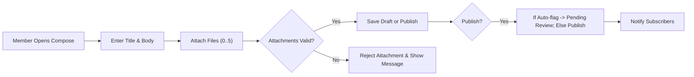
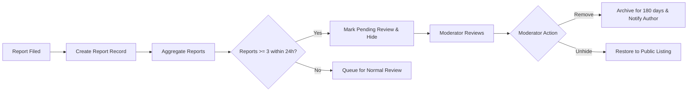

# Functional Requirements — discussionBoard

## Purpose
Provide a concise, actionable set of business requirements for discussionBoard, a minimal economic and political discussion board that supports article-style posts with image/file attachments, commenting, reporting, and lightweight moderation. Requirements are expressed in natural language and EARS format where applicable so backend engineers and QA can implement and validate behaviors without prescribing technical implementation details.

## Actors and Permission Summary
- Guest: read-only access to public posts and attachments; cannot create, comment, attach files, or report.
- Member: create, edit (within windows), soft-delete own posts and comments, attach files to own content, report content, subscribe to posts/authors.
- Moderator: review reports, hide/unhide or remove content, warn or suspend members, view moderation logs and appeal records.

Permission matrix (business view):
- View public content: Guest, Member, Moderator
- Create post/comment: Member, Moderator
- Edit own post (24h): Member, Moderator
- Moderate content: Moderator

## Authentication and Account Lifecycle (Business Rules)
- THE discussionBoard SHALL require a verified unique email for members before allowing public publishing.
- WHEN a user registers, THE discussionBoard SHALL create an account in "unverified" state and SHALL send a single-use verification link that expires after 48 hours.
- WHEN a user verifies their email, THE discussionBoard SHALL mark the account as "verified" and allow publishing and commenting.
- THE discussionBoard SHALL require passwords of at least 12 characters and at least three of the following categories: uppercase, lowercase, number, symbol.
- THE discussionBoard SHALL allow optional MFA; WHERE enabled, THE discussionBoard SHALL require second factor during login before granting publishing privileges.
- THE discussionBoard SHALL implement account lockout: IF an account has 10 failed authentication attempts within 1 hour, THEN THE discussionBoard SHALL lock interactive authentication for 15 minutes and notify the account email of suspicious activity.
- THE discussionBoard SHALL support session lifetimes: access credential validity of ~15 minutes and refresh credential inactivity expiry after 14 days; THE system SHALL require re-authentication after 30 days of inactivity.
- WHEN a password is changed or "revoke all sessions" is requested, THEN THE discussionBoard SHALL invalidate active refresh credentials.

## Functional Requirements (EARS)
All requirements below use EARS phrasing (THE, WHEN, IF, THEN, SHALL, WHERE) to be unambiguous and testable.

### Post lifecycle
- THE discussionBoard SHALL allow members to create an article with a title (max 250 characters) and a body (max 200,000 characters).
- WHEN a member publishes a post, THE discussionBoard SHALL record creation metadata: author id, creation time, published time, and attachment manifest.
- WHEN a member publishes a post, THE discussionBoard SHALL make the post visible to public listings within 3 seconds in normal conditions.
- THE discussionBoard SHALL allow members to save drafts; WHILE a post is a draft, THE discussionBoard SHALL prevent it from appearing in public listings or search.
- THE discussionBoard SHALL allow members to edit their own posts within a 24-hour edit window after publication; IF an edit is attempted after 24 hours, THEN THE discussionBoard SHALL deny the edit and offer an "edit request" path to moderators.
- WHEN a member deletes their own post, THEN THE discussionBoard SHALL soft-delete the post (non-public) and retain it for 30 days for possible restoration unless legal hold applies.

### Attachment support
- THE discussionBoard SHALL support attachments for posts and comments.
- THE discussionBoard SHALL permit image attachments: JPEG, PNG, GIF, WEBP and document attachments: PDF, TXT, DOCX, XLSX.
- THE discussionBoard SHALL allow up to 5 attachments per post and up to 3 attachments per comment.
- THE discussionBoard SHALL limit per-file size to 10 MB for images and 25 MB for non-image files.
- IF an attachment exceeds allowed size or is disallowed type, THEN THE discussionBoard SHALL reject the upload and present a clear user-facing message describing allowed types and size limits.
- WHEN attachments are uploaded, THE discussionBoard SHALL run a malware/virus scan (integration) and IF the file fails the scan, THEN THE discussionBoard SHALL quarantine the file and notify the uploader.
- WHEN attachments are associated with drafts, THE discussionBoard SHALL preserve those attachments with the draft for at least 48 hours; orphaned temporary uploads SHALL be purged after 48 hours.
- WHEN a post with attachments is soft-deleted, THEN THE discussionBoard SHALL retain associated attachments for the same retention window as the post.

### Commenting and replies
- THE discussionBoard SHALL allow members to post comments on published posts.
- WHEN a member posts a comment, THE discussionBoard SHALL accept up to 5,000 characters per comment.
- THE discussionBoard SHALL allow reply threading up to two levels deep for MVP to preserve readability.
- WHEN a member edits a comment, THE discussionBoard SHALL permit edits only within 60 minutes of creation.
- THE discussionBoard SHALL rate-limit comment creation to 10 comments per minute per member; IF exceeded, THEN THE discussionBoard SHALL warn the member and apply exponential backoff.

### Moderation and reporting
- THE discussionBoard SHALL allow members to report posts or comments and SHALL capture: reporter id, target content id, reason (from a predefined list), and optional explanation up to 1000 characters.
- IF a single content item receives 3 unique valid reports within a 24-hour window, THEN THE discussionBoard SHALL mark the item as "pending moderator review" and remove it from public listings until reviewed.
- THE discussionBoard SHALL provide moderators the ability to: dismiss report, hide content (soft hide), remove content (flag for deletion), warn user, suspend user (time-bound), and ban user (permanent) with audit recording for each action.
- WHEN a moderator acts, THE discussionBoard SHALL record moderator id, action, reason, and timestamp in an auditable log and SHALL retain moderation logs for at least 1 year (audit requirement).
- THE discussionBoard SHALL enforce moderator SLA: standard reports SHALL be reviewed within 48 hours and priority items (automatically hidden or safety risk) SHALL be reviewed within 12 hours.
- THE discussionBoard SHALL provide an appeals path: WHEN a member appeals a removal within 14 days, THEN THE discussionBoard SHALL queue the appeal for secondary review by a different moderator or administrator.

### Search, categories and discovery
- THE discussionBoard SHALL support a single primary category per post and up to 10 tags per post.
- THE discussionBoard SHALL present public listings in reverse-chronological order within each category by default and support pagination with 20 items per page default.
- WHEN a user applies keyword search, THEN THE discussionBoard SHALL return results ordered by relevance then recency and SHALL return the first page within 2 seconds in normal conditions.

### Notifications and subscriptions
- THE discussionBoard SHALL allow members to subscribe to posts and authors.
- WHERE a member subscribes, THE discussionBoard SHALL support delivery modes: "immediate" or "daily digest".
- WHEN a subscribed event occurs and delivery mode is "immediate", THEN THE discussionBoard SHALL deliver the notification within 30 seconds under normal conditions.
- WHEN a subscription encounters 3 consecutive delivery failures, THEN THE discussionBoard SHALL mark the subscription as "delivery failed" and surface an account notification recommending the user update delivery preferences.

## Data Lifecycle and Retention (Business Rules)
- THE discussionBoard SHALL soft-delete user-initiated deletions and retain soft-deleted content for 30 days before permanent purge unless a legal hold applies.
- THE discussionBoard SHALL retain moderator-removed content for 180 days for audit and appeals before permanent purge unless legal hold applies.
- WHEN a legal hold is applied, THEN THE discussionBoard SHALL suspend automated purges for that content until the hold is released.
- WHEN a user requests account deletion, THEN THE discussionBoard SHALL place the account in a 30-day pending-deletion state; after 30 days the account's personal identifiers SHALL be anonymized or removed per Data Lifecycle rules unless legal requirements prevent deletion.
- THE discussionBoard SHALL support user data export: WHERE an account has <10,000 items, THEN THE discussionBoard SHALL provide export within 72 hours; for larger accounts, THEN THE discussionBoard SHALL provide export within 7 business days.

## Non-Functional Requirements (Business-level SLOs)
- THE discussionBoard SHALL return post listing pages of 20 items within 1 second 95% of the time under normal load.
- THE discussionBoard SHALL acknowledge successful post submission to the user within 3 seconds 95% of the time under normal load.
- THE discussionBoard SHALL accept image uploads and provide initial acceptance acknowledgement within 10 seconds for files <=5 MB under normal network conditions.
- THE discussionBoard SHALL target availability of 99.9% monthly for public read APIs (business SLO).
- WHEN SLO violations persist, THEN THE monitoring system SHALL alert on-call operations per severity thresholds defined in operations runbooks.

## Error Handling and User-Facing Recovery
- IF an attachment upload fails due to size/type, THEN THE discussionBoard SHALL reject the file and show a clear message explaining allowed types and maximum sizes.
- WHEN an upload fails due to transient network issues, THEN THE discussionBoard SHALL automatically retry up to 3 times with exponential backoff (1s, 2s, 4s) and THEN present options to "Retry" or "Save Draft" if retries fail.
- IF publishing is blocked by pending moderator review, THEN THE discussionBoard SHALL notify the author with the status "pending moderator review" and an estimated review timeframe.
- WHEN authentication fails due to session expiry during content creation, THEN THE discussionBoard SHALL preserve the draft for at least 48 hours and prompt the user to re-authenticate to resume.

## Acceptance Criteria (Selected, Testable)
- Post creation: GIVEN a verified member, WHEN creating a post with allowed attachments, THEN the post appears in public listing within 3 seconds and attachments are downloadable/previewable.
- Attachment validation: GIVEN an oversized or disallowed file, WHEN the user attempts upload, THEN the upload is rejected and user is shown the allowed types and sizes.
- Moderation threshold: GIVEN 3 unique reports within 24 hours, WHEN threshold is met, THEN the content is hidden from public listings and queued for moderator review.
- Edit window: GIVEN a published post, WHEN the author edits within 24 hours, THEN edits are accepted; WHEN edit is attempted after 24 hours, THEN edit is rejected with an option to request moderator edit.

## Diagrams
Post creation and attachment flow:

```mermaid
graph LR
  A["Member Opens Compose"] --> B["Enter Title & Body"]
  B --> C["Attach Files (0..5)"]
  C --> D{""Attachments Valid?""}
  D -->|"Yes"| E["Save Draft or Publish"]
  D -->|"No"| F["Reject Attachment & Show Message"]
  E --> G{""Publish?""}
  G -->|"Yes"| H["If Auto-flag -> Pending Review; Else Publish" ]
  H --> I["Notify Subscribers"]
```

Moderation and reporting flow:

```mermaid
graph LR
  R["Report Filed"] --> S["Create Report Record"]
  S --> T["Aggregate Reports"]
  T --> U{""Reports >= 3 within 24h?""}
  U -->|"Yes"| V["Mark Pending Review & Hide" ]
  U -->|"No"| W["Queue for Normal Review"]
  V --> X["Moderator Reviews"]
  X --> Y{""Moderator Action""}
  Y -->|"Remove"| Z["Archive for 180 days & Notify Author"]
  Y -->|"Unhide"| AA["Restore to Public Listing"]
```

## Glossary
- Draft: private post state editable by author
- Soft-delete: non-public state retained for possible recovery
- Pending review: state where content is not public and awaits moderator action

## Related Documents
- 01-service-overview.md (vision and KPIs)
- 02-user-actors.md (detailed authentication and actor definitions)
- 06-business-rules.md (detailed rules and sanction matrix)
- 08-external-integrations.md (attachment storage, scanning, email)

