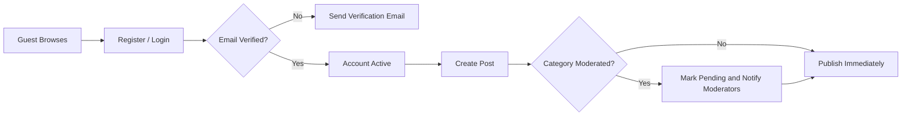
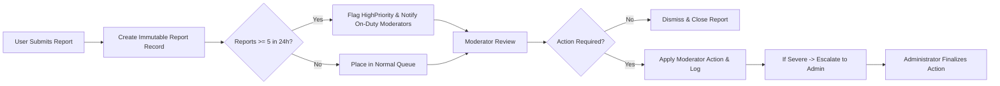
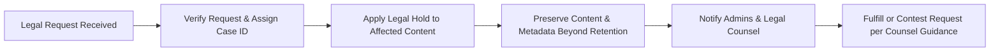

# 02 — Problem Definition for econPoliticalForum

## Executive summary

High-signal public discussion about economics and politics requires predictable moderation, provenance, and discoverability. econPoliticalForum provides a topic-focused space that reduces noise and abuse while enabling robust debate. The following defines the problem space, target users and pains, regulatory constraints, business rules written in EARS format, operational workflows, measurable SLAs, and acceptance criteria required to launch and operate the service safely.

## One-line problem statement

Users seeking constructive economic and political discussion cannot reliably find or trust forums that combine open debate with predictable moderation, transparent escalation, and measurable operational guarantees.

## Target users and personas

- Guest: Browses public content to evaluate community quality. Primary need: fast discovery and sampling without commitment.
- RegisteredUser: Creates posts and comments, votes, bookmarks, and follows threads. Primary need: meaningful engagement with preservation of reputation and safety.
- Moderator: Reviews reports, enforces policy, manages queue. Primary need: efficient triage tools, consistent escalation, and auditability.
- Administrator: Final authority for legal responses, global policy, and account actions. Primary need: comprehensive logs, escalation pathways, and compliance controls.

## Core user pain points (by persona)

Guest:
- Cannot quickly determine whether community enforces rules before registering.
- Landing pages surface low-value content ahead of high-quality analysis.

RegisteredUser:
- Valuable content competes with noise and coordinated brigading.
- Unclear moderation outcomes and opaque appeals reduce trust.

Moderator:
- High-volume reports lack prioritization and provenance, slowing decisions.

Administrator:
- Legal exposure and cross-jurisdictional takedown complexity.

## Risks and political sensitivities

- Misinformation risk: Unverified factual claims on policy, finance, elections.
- Harassment and doxxing: High potential for targeted abuse with real-world harm.
- Coordinated manipulation: Risk of vote brigades, sockpuppets, and mass-reporting.
- Jurisdictional legal conflict: Differing takedown and data-retention laws.

## Regulatory and compliance considerations (business-level)

- WHEN a lawful request (subpoena, court order) is received, THE system SHALL log the request, apply any legal hold to affected content, and notify administrators within business hours; disclosure SHALL follow legal counsel guidance.
- WHEN content is subject to a legal hold, THEN THE system SHALL preserve content and related metadata beyond normal retention until the legal hold is released.
- WHEN personal data export or deletion is requested under applicable law, THEN THE system SHALL comply within the jurisdictional SLA (default: 30 calendar days) and SHALL log the action.

## Business rules (EARS format) — core areas

Registration and verification
- WHEN a user registers, THE system SHALL create an account with status "unverified" and SHALL send a verification email with an expiring token valid for 7 days.
- IF a user does not verify within 7 days, THEN THE system SHALL limit posting privileges until verification completes and SHALL send up to two reminder emails at 48-hour intervals.
- WHEN a user attempts password reset, THE system SHALL issue a single-use token that expires within 1 hour and SHALL log the reset event.

Posting and editing
- WHEN a registeredUser attempts to create a post, THE system SHALL accept titles of 5–200 characters and bodies of 10–50,000 characters and SHALL return a specific validation error for each rule violation.
- WHEN a registeredUser edits their post within 24 hours, THE system SHALL allow the edit and SHALL create an audit entry noting edit time; edits after 24 hours SHALL be marked as "edited" publicly and SHALL be visible in revision history to moderators.
- IF a post is locked by moderator review, THEN THE system SHALL prevent the author from editing until the lock is released.

Comments and replies
- WHEN a registeredUser submits a comment, THE system SHALL permit up to 5,000 characters and SHALL allow nested replies up to 3 levels for MVP.
- IF a comment's parent is pending or hidden, THEN THE system SHALL deny new child comments and present the reason to the user.

Voting and reputation
- WHEN a registeredUser votes, THE system SHALL allow exactly one active vote per user per item and SHALL prevent voting on own content.
- IF suspicious voting patterns are detected (for example, >1,000 votes on a single thread within 10 minutes or large number of votes from sibling accounts), THEN THE system SHALL flag the thread for coordinator review and SHALL nullify suspect votes pending investigation.

Rate limits and abuse prevention
- WHEN an account age < 7 days, THE system SHALL limit posts to at most 3 per 24-hour period and comments to 20 per 24-hour period.
- WHEN any account exceeds 200 votes in a 24-hour rolling window, THE system SHALL temporarily throttle voting capability for 24 hours and SHALL log the event for review.

Publishing and moderation gating
- WHEN a post is created in a category labeled "moderated", THE system SHALL mark the post as PendingApproval and SHALL notify assigned moderators; the post SHALL NOT appear in public listings until approved.
- WHEN a post is created in an unmoderated category, THE system SHALL publish immediately and SHALL allow reporting to initiate retroactive moderation.

Reporting and triage
- WHEN a user files a report, THE system SHALL capture reporterId (unless reporter requests anonymity), reportedItemId, reasonCode, optional reporterComment (<=2000 chars), and timestamp and SHALL produce an immutable report record.
- WHEN an item accumulates 5 independent reports within a 24-hour window, THE system SHALL escalate the item to HighPriority queue and SHALL notify on-duty moderators within 15 minutes.

Moderator actions and audit
- WHEN a moderator takes action (hide, remove, warn, suspend), THE system SHALL record an immutable moderation log entry including moderatorId, action, reasonCode, free-text rationale, and timestamp.
- IF a moderator removes content, THEN THE system SHALL notify the content author with the reason and instructions for appeal.

Suspension and appeals
- WHEN a user accumulates 3 verified policy violations within 90 days, THE system SHALL apply a temporary suspension of 7 days and SHALL notify the user with appeal instructions.
- IF an appeal is submitted within 14 days of suspension, THEN THE system SHALL assign the appeal to an administrator or an independent reviewer and SHALL respond with a final determination within 7 calendar days.

Data retention and privacy
- WHEN content is deleted by user action, THE system SHALL soft-delete the public view and SHALL retain an immutable archived copy for 90 days for appeals and legal purposes unless law requires longer retention.
- WHEN an account deletion request is received, THE system SHALL anonymize personal identifiers in public views within 30 days and SHALL provide the user a confirmation of which data was removed and which content remains for community continuity.

Transparency and reporting
- WHEN moderation actions occur, THE system SHALL include a changelog entry with the action, actor role, and date; the system SHALL expose aggregated moderation metrics in quarterly transparency reports without PII.

Automation and escalation thresholds
- WHEN automated detection flags content for likely severe violation (e.g., doxxing, explicit incitement), THEN THE system SHALL automatically hide the item and SHALL create an urgent escalation for administrators within 5 minutes.

## Operational workflows and process diagrams

### Registration and publish flow

### Reporting, triage, and escalation flow

### Legal hold and evidence preservation flow

All Mermaid nodes use double-quoted labels where needed and arrows use `-->` per diagram syntax rules.

## Acceptance criteria and KPIs (measurable)

Launch acceptance criteria:
- Moderation readiness: At least one trained moderator per 5,000 expected MAU at time of launch and documented on-call coverage for high-severity reports.
- Triage SLA: 95% of high-severity reports acknowledged by a moderator within 2 hours and initial action (hide/esc) within 24 hours.
- Availability: Category listing and thread view shall present the first page within 2 seconds in 95% of requests under baseline load.
- Safety: No more than 2% of moderator removals reversed on appeal in first 90 days (target for moderation accuracy).

Operational KPIs to monitor:
- MAU, DAU, new registrations, verified ratio
- Reports per 1,000 posts, average time-to-first-reply by moderators
- Moderator queue depth over time and SLA compliance
- Vote irregularity incidents and coordinated activity flags

## Governance, ownership, and change process

- THE product manager SHALL own prioritization of feature scope and MUST approve category definitions and moderated categories.
- THE policy lead SHALL own moderation policy text and SHALL approve any changes that materially alter prohibited content definitions.
- WHEN a major content policy change is approved, THEN THE documentation SHALL be updated within 7 calendar days and SHALL include change rationale, effective date, and impacted categories.

## Operational assumptions and constraints

- Initial launch jurisdiction is limited to selected English-speaking countries to reduce legal complexity; expansion requires legal review.
- Moderation is human-led at MVP with automation for triage; automation SHALL NOT perform final enforcement actions without human confirmation.

## Open questions for stakeholders (explicit action required)

- Confirm initial moderated categories and whether anonymous posting is permitted in any category at launch.
- Confirm specific retention windows required by legal counsel for moderation logs and content archives.
- Decide whether vote model for MVP is upvote-only or upvote/downvote.

## Conclusion and next steps

- Proceed to convert EARS business rules into functional requirements and acceptance tests in the Functional Requirements document.
- Prepare moderator training materials, escalation matrix, and incident response playbook in parallel with engineering work for features.

