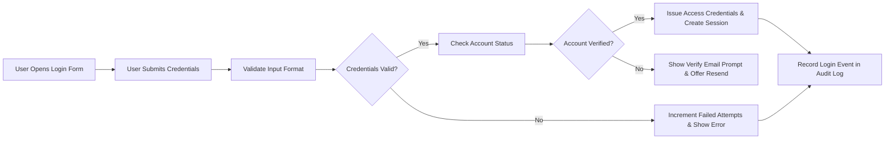
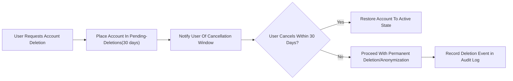

# 02 User Actors and Authentication Requirements

## Scope and Purpose
Defines business-level authentication, session lifecycle, account lifecycle, actor responsibilities, and audit expectations for discussionBoard. Requirements are written in business language (EARS format where applicable) and provide measurable, testable criteria for backend implementation and QA verification.

## Service Context
- Service name (business reference): discussionBoard
- Primary goal: enable minimal, secure member interactions (create posts, comment, attach files) while allowing guests to read public content and moderators to enforce community rules.
- Constraints: Business requirements only. No API, schema, or cryptographic mandates; technical implementation decisions remain with the engineering team.

## Actors and Business Responsibilities

### Guest
- Description: Unauthenticated visitor browsing public content.
- Business permissions:
  - Read-only access to published posts, public attachments, categories and search.
  - SHALL be prompted to register when attempting member-only actions.
- Business restrictions:
  - SHALL not create drafts, publish content, comment, upload attachments, or file reports.

### Member
- Description: Registered, authenticated user who participates in discussion.
- Business permissions:
  - Create, edit (within edit window), soft-delete own content, comment, attach files, report content, subscribe to notifications.
- Business responsibilities:
  - SHALL verify email before publishing public content.
  - SHALL adhere to community rules; violations SHALL be subject to moderator action per Business Rules.
- Business restrictions:
  - SHALL not moderate other users unless explicitly granted moderator privileges.

### Moderator
- Description: Privileged user responsible for reviewing reports and enforcing policy.
- Business permissions:
  - Review reports; hide/unhide or remove content; issue warnings and temporary suspensions; view moderation-only logs and audit trails.
- Business responsibilities:
  - SHALL record a reason for each moderation action and SHALL act within moderation SLAs.
  - SHALL not change system-level settings or billing.

## Permission Matrix (Business view)

| Action | guest | member | moderator |
|---|---:|---:|---:|
| View published posts & attachments | ✅ | ✅ | ✅ |
| Create draft post | ❌ | ✅ | ✅ |
| Publish post | ❌ | ✅ | ✅ |
| Edit own post (24h window) | ❌ | ✅ | ✅ |
| Delete own post (soft, 30d) | ❌ | ✅ | ✅ |
| Attach files to posts/comments | ❌ | ✅ | ✅ |
| Comment | ❌ | ✅ | ✅ |
| Report content | ❌ | ✅ | ✅ |
| Review reports / take moderation action | ❌ | ❌ | ✅ |
| Suspend or ban user | ❌ | ❌ | ✅ (per escalation policy) |

Notes:
- "Edit own post (24h window)" means direct edits permitted only within 24 hours after publication; after 24 hours an "edit request" path to moderators is required.
- Moderator actions SHALL be auditable and visible to other moderators for accountability.

## Authentication Requirements (EARS)

- THE discussionBoard SHALL allow a new account to be registered using a unique email address, a chosen password, and an optional display name.

- WHEN registration completes, THE discussionBoard SHALL create the account in a "pending verification" state and SHALL send a single-use verification link to the provided email address that expires in 48 hours.

- IF the verification link expires, THEN THE discussionBoard SHALL allow the user to request a new verification link; THE system SHALL limit resends to 5 per 24 hours per email to reduce abuse.

- WHEN a user verifies their email, THE discussionBoard SHALL mark the account as "verified" and SHALL allow publishing of public content and commenting.

- THE discussionBoard SHALL require passwords to meet the following business constraints: minimum 12 characters and at least three of: uppercase letter, lowercase letter, number, symbol.

- WHEN a user requests a password reset, THE discussionBoard SHALL send a single-use reset token to the account email that expires after 1 hour.

- THE discussionBoard SHALL support optional MFA (time-based OTP or equivalent) where:
  - WHEN MFA is enabled by the user, THE discussionBoard SHALL require the second factor for all interactive logins and sensitive actions (password change, email change, account deletion).
  - WHEN an MFA device is registered or revoked, THE discussionBoard SHALL provide recovery guidance and SHALL record the event in audit logs.

- WHEN a user completes registration but remains unverified, THE discussionBoard SHALL allow saving drafts but SHALL prevent publishing, commenting, or uploading public attachments until verification completes.

- IF a user attempts to register with an email already in use, THEN THE discussionBoard SHALL refuse the registration and instruct the user to log in or use password recovery.

## Session and Token Lifecycle (Business Expectations)

- THE discussionBoard SHALL issue short-lived access credentials for interactive sessions with a business-expected lifetime of 15 minutes (access token) and SHALL issue refresh credentials that persist session continuity up to 14 days of inactivity.

- WHEN a refresh credential is used to obtain new access credentials, THEN THE discussionBoard SHALL extend the refresh credential's validity so long as the sliding inactivity window (14 days) is not exceeded.

- THE discussionBoard SHALL consider a user session inactive after 30 days of no activity and SHALL require full re-authentication to restore interactive privileges.

- WHEN a user performs an explicit "logout" action, THE discussionBoard SHALL invalidate the user's active refresh credentials and access tokens immediately.

- WHEN a user changes password or requests "revoke all sessions", THEN THE discussionBoard SHALL invalidate all active refresh credentials and require re-authentication for subsequent access.

- THE discussionBoard SHALL allow session revocation on account suspension and SHALL block new sessions until account reinstatement.

## Authentication Failure and Brute-Force Mitigation (Business Thresholds)

- THE discussionBoard SHALL track failed authentication attempts per account and per IP address.

- IF an account accumulates 10 failed authentication attempts within a rolling 1-hour window, THEN THE discussionBoard SHALL temporarily lock the account for 15 minutes and SHALL email the account owner a security notification.

- IF suspicious activity is detected (rapid session origin IP changes or other anomaly signals), THEN THE discussionBoard SHALL require step-up verification (email verification or MFA) before allowing high-risk operations.

## Account Lifecycle and States

- Account states: pending verification, active (verified), warned, suspended (temporary), banned (permanent), pending-deletion (user-initiated soft-delete).

- WHEN a member requests account deletion, THE discussionBoard SHALL place the account into pending-deletion for 30 days; during this window the user MAY cancel and restore the account.

- IF 30 days elapse after a deletion request without cancellation and no legal hold exists, THEN THE discussionBoard SHALL permanently anonymize or remove personal identifiers according to Data Lifecycle rules.

- WHEN a moderator suspends an account, THE discussionBoard SHALL record the suspension reason, duration, and moderator identity in audit logs and SHALL immediately revoke active sessions.

- WHEN a suspension period elapses or an appeal is granted, THE discussionBoard SHALL reinstate the account and notify the account owner.

## Audit and Accountability Requirements

- THE discussionBoard SHALL record the following events in an immutable audit trail: account registration, email verification, login success and failures (including reason), password change, password reset requests, session revocations, MFA enroll/revoke, content create/edit/delete events, report submissions, moderation actions (hide/remove/warn/suspend), account suspension and reinstatement, and deletion/export requests.

- FOR each audited event THE discussionBoard SHALL record at minimum: event type, acting user id (or "guest"), target resource id (when applicable), timestamp (ISO 8601 UTC), actor display name, and an optional free-text reason for moderator actions.

- THE discussionBoard SHALL retain moderation and security audit logs for a minimum of 1 year and SHALL make them queryable by authorized roles for compliance and appeals.

- WHEN an audit log is accessed by an administrative user, THE discussionBoard SHALL record accessor id, timestamp, and query purpose in a meta-audit record retained for at least 1 year.

## Error Handling and User-Facing Messages (Authentication)

- IF authentication fails due to incorrect credentials, THEN THE discussionBoard SHALL show a non-disclosing message: "Incorrect email or password." and SHALL not reveal whether the email exists.

- IF an account is temporarily locked due to failed attempts, THEN THE discussionBoard SHALL inform the user of the lockout duration and recommend password reset.

- WHEN a verification or password reset email fails to deliver, THEN THE discussionBoard SHALL queue resend attempts for up to 24 hours and SHALL notify the user with an intermediate status indicating retry attempts.

- WHEN a session expires during content creation, THEN THE discussionBoard SHALL preserve the draft client-side or server-side for at least 48 hours and SHALL allow the user to re-authenticate and resume editing.

## Acceptance Criteria and Measurable SLAs

- Authentication success path: 95% of valid login attempts complete within 2 seconds under normal load.
- Email delivery: 95% of verification and password reset emails delivered within 60 seconds under normal conditions.
- Session revocation: when requested, THE discussionBoard SHALL invalidate sessions within 30 seconds for 95% of cases.
- Audit retention: moderation and security logs retained for at least 1 year and accessible to authorized roles.
- Account lockout: after 10 failed attempts in 1 hour, account locked for 15 minutes; notification email sent within 10 minutes.

## Mermaid Diagrams

### Authentication Flow

### Account Deletion Flow (Soft Delete)

## Example Audit Record (business fields)
- eventType: "moderation.action"
- eventTimestamp: "2025-10-31T13:34:29Z"
- actorId: "moderator:42"
- targetId: "post:12345"
- action: "hide"
- reason: "multiple user reports: harassment"
- metadata: { "reports": 5 }

## Test Cases and QA Checklist
- Verify registration and verification flows: registration creates pending account; verification link expires after 48 hours; resend limited to 5/24h.
- Verify login path: successful login issues session within 2s for 95% of attempts; failed attempt increments counter; 10 failures within 1 hour lock for 15 minutes.
- Verify password reset: reset link expires in 1 hour and invalidates on use.
- Verify session revocation: revoke all sessions invalidates refresh tokens and prevents new access within 30s for 95% of cases.
- Verify audit coverage: all moderator actions produce audit logs with required fields and accessible by authorized roles.

## Constraints and Open Items
- Implementation choice: token format, storage, and rotation strategies are left to engineering; update this document if refresh-token rotation is adopted.
- Open decision: whether to allow login via third-party SSO (out of scope for MVP). If SSO is introduced, update audit and session rules accordingly.

## Glossary
- access credentials: short-lived token used for API access (15 minutes business expectation).
- refresh credentials: longer-lived token to obtain new access credentials (14-day sliding window business expectation).
- pending verification: account state before email verification is completed.

# End of 02 User Actors and Authentication Requirements
