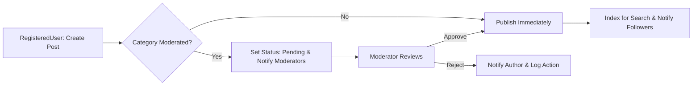
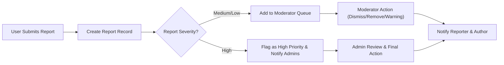

# Core Value Proposition and Minimal Feature Set for econPoliticalForum

## Executive summary

econPoliticalForum provides a focused discussion environment for economics and political topics that balances open debate with predictable safety controls. The platform prioritizes high-signal content, clear moderation, and discoverability. Launch priorities are safety, measurable engagement, and fast iteration.

Primary objectives:
- Enable constructive, evidence-based discussion on economics and public policy.
- Surface high-quality contributions through transparent community signals and moderator curation.
- Provide a minimal, maintainable MVP that meets safety SLAs and is extensible.

## Service purpose and goals
- Provide public, searchable threads organized by category and tags to support reusable research and debate.
- Minimize harassment and misinformation through conservative posting rules, mandatory reporting/audit trails, and moderator-first handling of high-risk content.
- Validate a sustainable community model that can support optional paid services for institutions.

Business goals (measurable):
- Reach 10,000 MAU within 12 months of launch (target)
- Weekly retention >= 20% of registered users by month 3
- Moderation SLA: 95% of high-severity reports acknowledged by a human moderator within 24 hours

## Target users and role-based value
Roles and core value:
- Guest: discover and read high-quality public discussions.
- RegisteredUser: contribute posts and comments, build reputation, follow topics.
- Moderator: triage reports, apply policy actions, preserve auditability.
- Administrator: manage policies, legal responses, and platform health.

Role-based expectations (business-level):
- Guests SHALL be able to read public posts without registration.
- RegisteredUsers SHALL verify email to post in restricted categories.

## Minimal Feature Set (MVP) — Must have
Each MVP item includes the business rationale and acceptance criteria.

1. Registration & email verification
  - Rationale: reduce anonymous abuse and enable accountability.
  - Acceptance: WHEN a user registers, THE system SHALL send a verification email within 30s; verification token SHALL expire in 7 days.

2. Public categories and threaded posts
  - Rationale: core content model for discussions.
  - Acceptance: WHEN a post is created in an open category, THE system SHALL publish within 3s in 95% of baseline tests.

3. Comments and single-level nested replies
  - Rationale: readable conversations with limited depth to reduce moderation complexity.
  - Acceptance: comments limited to 2,000 chars; replies permitted to one level in MVP.

4. Voting (single vote per item) or simple upvote-only (product decision)
  - Rationale: surface signal; prevents complex weightings at launch.
  - Acceptance: votes SHALL update visible score within 1s 95% of the time.

5. Search & tag-based discovery (basic)
  - Rationale: find historical discussions; seed SEO traffic.
  - Acceptance: common queries SHALL return results within 2s for 90% of queries.

6. Reporting UI and moderator queue
  - Rationale: safety operations and audit.
  - Acceptance: report captures reason code and optional note; high-severity reports flagged immediately.

7. Moderator tools (hide/unpublish, warn, temporary suspension)
  - Rationale: enable human triage and proportional enforcement.
  - Acceptance: moderator actions SHALL create immutable logs with actor, timestamp, reason and be retained per retention policy.

8. User profiles, follow/bookmark, and notifications
  - Rationale: retention levers and personal context.
  - Acceptance: following a thread SHALL trigger in-app notification for first reply within 10s for 95% of cases.

9. Bookmark/favorite for saved threads
  - Rationale: personal curation.
  - Acceptance: bookmarks SHALL appear in the user's bookmark list within 2s.

10. Basic moderation SLAs and audit trail
  - Rationale: legal and trust requirements.
  - Acceptance: immutable moderation logs retained for at least 2 years.

## Prioritized features (post-MVP)
Priority 1 (months 1–3 post-launch): reputation/karma, improved search filters, thread follow digests, moderator dashboard improvements.
Priority 2 (months 3–9): badges, organization accounts, payment integrations for premium features, enhanced moderation automation for triage.
Priority 3 (after 9 months): private groups, richer media uploads, advanced analytics dashboards for paying partners.

## Unique differentiators and positioning
- Topic-focus: dedicated to economic and political discussion with policy-aware moderation.
- Safety-first MVP: conservative posting rules for new accounts, category-level moderation controls, and clear appeals workflows.
- Transparency: logged moderator actions and periodic transparency reporting.

## User acquisition and retention levers
- Seed content partnerships with think tanks and academic groups to populate high-signal threads.
- Invite-only beta to attract subject-matter contributors and create exemplar content.
- Retention: follow/notification, bookmarks, weekly digests of followed threads.

## Business rules and safety controls (EARS format)
Posting and verification
- WHEN a registeredUser attempts to create a post in a category marked "restricted", THE system SHALL require email verification and SHALL deny publishing until verification completes.
- WHEN a registeredUser creates a post, THE system SHALL validate title length (5–150 characters) and body length (10–50,000 characters) and SHALL reject submissions outside these bounds with a clear message stating the allowed ranges.
- IF a registeredUser edits their post after 24 hours from initial publish, THEN THE system SHALL mark the post as "edited (post-24h)" and SHALL flag it for moderator review in sensitive categories.

Comments and replies
- WHEN a registeredUser submits a comment, THE system SHALL enforce a maximum length of 2,000 characters and SHALL allow one level of nested reply in MVP.

Voting and reputation
- WHEN a registeredUser casts a vote, THE system SHALL enforce one active vote per user per content item and SHALL allow changing the vote within 24 hours; THE system SHALL record vote changes for abuse analysis.
- IF coordinated voting anomalies are detected, THEN THE system SHALL invalidate suspect votes and SHALL flag affected accounts for moderator review.

Rate limiting and abuse prevention
- WHEN a newly verified account (age < 7 days) attempts to post, THE system SHALL restrict new-post creation to at most 3 posts per 24-hour period.
- WHEN a registeredUser creates more than 60 comments within a rolling 60-minute window, THE system SHALL throttle the user for 1 hour and SHALL present a cooldown message with remaining wait time.

Publishing and moderation
- WHEN a post is submitted to a moderated category, THE system SHALL set status to "pending" and SHALL notify assigned moderators within 30 seconds.
- WHEN a post is reported and reaches a configured report threshold (configurable, default 5 reports in 24 hours), THE system SHALL escalate to high-priority moderator queue.

Deletion and retention
- WHEN a registeredUser deletes their own post within 30 days, THE system SHALL soft-delete the public display but SHALL retain an immutable archived copy for compliance for at least 90 days unless law requires longer retention.
- IF an account is permanently banned, THEN THE system SHALL anonymize personal identifiers on public content while preserving content continuity unless removal is legally required.

Moderation logging and transparency
- WHEN any moderator or administrator action occurs, THE system SHALL create an immutable moderation log entry containing moderator ID, action type, reason code, and timestamp; THE logs SHALL be retained for at least 2 years.

Error handling
- IF input validation fails, THEN THE system SHALL return a localized, human-readable error that names the exact validation failure and the accepted bounds (for example: "Title must be between 5 and 150 characters").

## Authentication and permission matrix (business view)
Authentication expectations (business-level):
- WHEN a new account registers, THE system SHALL create an unverified account and SHALL send a verification email; verified status is required for some posting privileges.
- WHEN a user elects password reset, THE system SHALL send a single-use reset token valid for 1 hour to the verified email.
- THE system SHALL support session revocation by the user ("sign out everywhere") and SHALL invalidate sessions within 60 seconds under normal conditions.

Permission matrix (business mapping):
- Guest: browse public content, view public profiles — no posting, voting, commenting.
- RegisteredUser: create/edit own posts/comments (subject to edit windows), vote, report, bookmark, follow.
- Moderator: triage reports, hide/unpublish content, warn users, apply temporary suspensions; all actions logged.
- Administrator: manage roles, configure categories, perform permanent suspensions, access audit logs.

EARS examples for auth
- WHEN a user requests session revocation, THE system SHALL invalidate all active sessions and notify the user within 60 seconds.
- IF an account has 5 failed authentication attempts within 15 minutes, THEN THE system SHALL lock authentication for the account for 15 minutes and SHALL email the account owner a locked-account notification.

## Simple user journeys and diagrams
Mermaid: Publish and moderation flow

Mermaid: Reporting and escalation

All Mermaid labels use double quotes and correct node syntax to ensure diagram parsers accept the markup.

## Acceptance criteria and KPIs (measurable)
- Publishing latency: WHEN a verified user posts to an open category, THEN the post SHALL be visible within 3 seconds in 95% of test cases.
- Moderation SLA: 95% of high-severity reports SHALL be acknowledged by a human moderator within 24 hours.
- Notification delivery: direct mention notifications SHALL be delivered in-app within 10 seconds in 95% of cases.
- Retention: achieve 20% weekly active retention among registered users by month 3.
- Quality signal: at least 30% of posts SHALL receive one or more upvotes within 7 days of publishing.

Acceptance tests (QA examples):
- Register and verify: register, receive verification within 30s, verify before token expiry, post to open category and validate visibility within SLA.
- Reporting escalation: submit 6 reports within 24 hours and verify the item escalates to high-priority queue.
- Moderation log integrity: perform moderator action and confirm immutable log entry with required fields exists and retention is enforced.

## Non-functional expectations and SLAs
- Read performance: category listing and thread read SHALL load first render within 2 seconds for 95% of baseline requests.
- Write acknowledgement: create/edit post or comment SHALL respond with success within 2 seconds for 95% of normal operations.
- Search: typical queries SHALL return within 2 seconds under baseline load.
- Availability target (MVP): 99.5% monthly availability for read operations.

## Error handling, edge cases and recovery flows
Edit collisions
- WHEN two users attempt simultaneous edits, THE system SHALL detect the collision and SHALL present the later submitter with options to "overwrite", "merge" (where frontend assists), or "cancel"; THE backend SHALL provide version metadata to support merge.

Rate limits
- WHEN a user exceeds allowed posting/commenting thresholds, THEN THE system SHALL return a localized message explaining the limit and the remaining time until posting is allowed.

Anonymous posting (limited)
- WHERE categories permit anonymous posting, THE system SHALL allow verified users to post anonymously but SHALL preserve author identity in moderator logs for legal compliance; anonymous posts SHALL be limited to 2 per 24-hour period.

Account suspension and appeals
- WHEN a suspension is applied, THE system SHALL notify the user with reason and appeal link; appeals SHALL be acknowledged within 48 hours and resolved within 7 days.

## Data retention and privacy summary
- Moderation logs and evidence SHALL be retained for at least 2 years for audit and legal compliance.
- Soft-deleted content SHALL be retained for 90 days by default and SHALL be purged or anonymized according to jurisdictional legal obligations.
- Account deletion SHALL begin a 30-day pending window during which users may cancel deletion; after 30 days PII SHALL be removed and public content shall be anonymized unless retention is required by law.

## Roadmap and phased timeline
Phase 0 (0–2 months): policy definition, seed content, basic posting/commenting, email verification, and moderator queue.
Phase 1 (2–5 months): public beta, reputation primitives, follow/bookmark enhancements, improved search.
Phase 2 (6–12 months): organization accounts, premium features, advanced moderation tooling, transparency reports.

## Glossary
- MAU: Monthly Active Users
- MVP: Minimum Viable Product
- EARS: Easy Approach to Requirements Syntax
- SLA: Service Level Agreement
- PII: Personally Identifiable Information

## Related documents
- 01-service-overview.md — strategic rationale and KPIs
- 04-functional-requirements.md — detailed business-level functional requirements
- 05-user-roles-authentication.md — role definitions and authentication lifecycle
- 08-moderation-content-policy.md — moderation rules and escalation
- 09-non-functional-requirements.md — SLAs, monitoring, and privacy expectations

