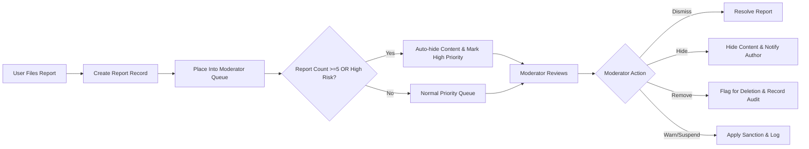

# Functional Requirements for discussionBoard

## Executive Summary

discussionBoard is a minimal discussion platform for evidence-backed economic and political articles. The MVP supports article posts with attachments, comments with limited threading, lightweight moderation and reporting, basic search and category/tag discovery, and simple subscription/notification options. Requirements below are business-level, testable, and intentionally minimal to guide backend implementation and QA.

## Scope

In-scope (MVP):
- Article posts: create, draft, publish, edit (time-limited), delete (soft), restore
- Attachments: image and document uploads with validation, thumbnails/previews, quarantine for unsafe files
- Comments: create, edit (time-limited), delete (soft), reply (limited depth)
- Reporting: structured reports, moderator queues, audit logging, moderation actions (hide/remove/warn/suspend)
- Discovery: categories (single primary), tags (0..10), basic keyword search, paginated listings
- Notifications: immediate and daily-digest subscription modes, author and follower notifications

Out-of-scope (MVP):
- Rich social features (reactions, follows beyond basic notifications), advanced reputation systems
- Real-time collaboration, complex nested threading beyond specified depth
- Built-in monetization beyond optional future tiers
- Advanced automated fact-checking or ML-driven content moderation (conceptual integrations allowed but not required for MVP)

## Actors and Permission Summary

Actors (business definitions):
- Guest: read-only access to published content and previews of attachments that are public
- Member: create/edit/delete own content within constraints, attach files to own content, comment, report
- Moderator: review reports, hide/remove content, warn or suspend members, view moderation audit logs

Permission mapping (business view):
- View public posts: guest ✅, member ✅, moderator ✅
- Create draft/publish post: guest ❌, member ✅, moderator ✅
- Edit own post (within 24h): member ✅, moderator ✅
- Delete own post (soft-delete): member ✅, moderator ✅
- Attach files to a post: member ✅, moderator ✅
- Comment on posts: member ✅ only (guest must register)
- Report content: member ✅
- Moderate (hide/remove/warn/suspend): moderator ✅

Actor state impact:
- Unverified member: may save drafts and edit profile but SHALL NOT publish posts or comments until email verification completes.
- Suspended member: SHALL NOT create posts or comments; read access remains unless account is banned.

## Post Lifecycle Requirements (EARS)

- THE discussionBoard SHALL allow a member to create a post with fields: title, body, optional primary category, tags (0..10), and attachments.

- WHEN a member creates a post, THE discussionBoard SHALL allow the member to save it as a "draft" or publish it. Drafts SHALL be private to the author and accessible only by the author and moderators.

- WHEN a member publishes a post, THE discussionBoard SHALL make the post visible to guests and members within 3 seconds 95% of the time under normal load.

- THE discussionBoard SHALL enforce title and body length constraints: title min 5 chars, max 250 chars; body min 10 chars, max 200,000 chars.

- THE discussionBoard SHALL allow members to edit their own published posts within 24 hours of publication. AFTER 24 hours edits SHALL be denied unless a moderator restores edit permission.

- WHEN a member requests deletion of their own post, THEN THE discussionBoard SHALL perform a soft-delete, remove the post from public listings immediately, and retain the content for a 30-day recovery window.

- IF 30 calendar days elapse after a soft-delete and no legal hold or moderation appeal exists, THEN THE discussionBoard SHALL permanently delete the content and its attachments per the Data Lifecycle policy.

- WHERE a post is flagged by automated heuristics or reaches an escalation threshold (see Moderation), THE discussionBoard SHALL mark the post as "pending moderator review" and SHALL not surface it in public listings until review or automatic clearances occur.

Acceptance tests (post lifecycle):
- Create draft -> publish -> post appears in listing and is viewable within 3 seconds in 95% of trials under normal load.
- Edit attempt after 24 hours is rejected with a clear message and path to request moderator review.
- Delete request removes post from public view immediately and allows restore within 30 days.

## Attachment Support and Lifecycle

Attachment policy summary (measurable):
- Image types allowed: image/jpeg, image/png, image/gif, image/webp
- Document types allowed: application/pdf, text/plain, application/msword, application/vnd.openxmlformats-officedocument.wordprocessingml.document
- Per-file size limits: images <= 10 MB; documents <= 25 MB
- Per-post attachment limits: max 5 attachments per post; max 3 images per post
- Per-comment attachment limits: max 1 attachment per comment

EARS requirements for attachments:
- WHEN a member uploads an attachment, THE discussionBoard SHALL validate file type and size immediately and SHALL reject invalid files with a clear user-facing message describing allowed types and max size.

- IF an attachment fails malware or abuse scanning, THEN THE discussionBoard SHALL quarantine the attachment, prevent public access, notify the uploading member, and create a moderator review task.

- WHEN attachments are associated with a draft post, THEN THE discussionBoard SHALL preserve those attachments with the draft for at least 48 hours. Orphaned uploads not associated with drafts or published content SHALL be purged after 24 hours.

- IF a post or comment containing attachments is soft-deleted, THEN THE discussionBoard SHALL retain the attachments for the same retention window as the parent content (default 30 days) and SHALL not expose quarantined attachments publicly.

Attachment UX and performance expectations:
- THE discussionBoard SHALL provide thumbnail or preview generation for images; image thumbnails SHALL be available within 10 seconds of a successful upload for files <=5 MB.
- THE discussionBoard SHALL provide an initial upload acknowledgement within 3 seconds for typical consumer networks for files <=5 MB.

Acceptance tests (attachments):
- Upload valid image <=5 MB: accepted, thumbnail available within 10 seconds, attachment associated with draft.
- Upload invalid type: immediate rejection with allowed types listed.
- Quarantine flow: malicious file upload results in quarantine notification and moderator task.

## Commenting and Replies

- THE discussionBoard SHALL permit authenticated members to post comments on published posts.

- WHEN a member creates a comment, THE discussionBoard SHALL accept up to 2,000 characters per comment.

- THE discussionBoard SHALL permit threaded replies to a maximum depth of two reply levels beyond the root comment (total depth = 3 levels) for MVP.

- WHEN a member edits a comment, THE discussionBoard SHALL allow edits only within 60 minutes of posting. AFTER 60 minutes edits SHALL be disabled; members MAY add follow-up comments.

- WHEN a member deletes their own comment, THEN THE discussionBoard SHALL soft-delete the comment and retain it for 30 days for possible restoration or moderation appeals.

- THE discussionBoard SHALL rate-limit comment creation to 10 comments per minute per member as an anti-abuse measure; moderators MAY have elevated limits.

Acceptance tests (comments):
- Post a comment and see it appear within 2 seconds in normal conditions.
- Edit within 60 minutes succeeds and is reflected; edit after 60 minutes is blocked with explanatory message.

## Moderation and Reporting (EARS)

Report metadata and submission:
- THE discussionBoard SHALL allow members to report posts or comments and SHALL collect the following structured metadata: reporterId, targetContentId, reasonCategory (enum: "Spam","Harassment","Misinformation","Illegal","Other"), optional text explanation (max 1000 chars), and timestamp.

Escalation thresholds and automatic actions:
- IF a content item receives 5 unique reports from distinct members within a 48-hour rolling window, THEN THE discussionBoard SHALL automatically hide the item from public listings and mark it as "pending moderator review" (high priority).

- WHEN automated abuse scoring (if integrated) returns a high-confidence unsafe score (business-configurable threshold), THEN THE discussionBoard SHALL hide the content immediately and create a moderator review task.

Moderator actions and logging:
- THE discussionBoard SHALL provide moderators the ability to dismiss reports, hide content (soft-hide), remove content (flag for permanent deletion), warn users (record warning), suspend users temporarily (time-bound), or escalate to administrators.

- WHEN a moderator takes action, THE discussionBoard SHALL record an audit entry containing moderatorId, actionType, actionReason, targetContentId, and timestamp. Audit logs SHALL be retained for a minimum of 1 year.

Appeals and restoration:
- THE discussionBoard SHALL allow authors to appeal moderator removals within 14 days. Appeals SHALL be routed to a secondary review and SHALL pause automatic purge if the removal caused soft-delete retention to elapse.

Moderation SLAs (business targets):
- THE discussionBoard SHALL route high-priority moderation items (auto-hidden or 5+ reports) to moderators and SHALL target first review within 12 hours and final resolution within 48 hours.

Acceptance tests (moderation):
- Simulate 5 unique reports in 48 hours -> content becomes hidden and appears in moderator queue with correct metadata.
- Moderator action logged with required metadata and retained for 1 year.

## Discovery: Search, Categories, Tags

- THE discussionBoard SHALL allow posts to have one primary category and up to 10 tags.

- WHEN listing posts in a category or tag, THE discussionBoard SHALL return only published, non-hidden content and SHALL order results newest-first by default.

- THE discussionBoard SHALL support keyword search over titles and bodies. FOR MVP the system SHALL return search results within 2 seconds 95% of the time for typical dataset sizes.

- THE discussionBoard SHALL support pagination with default page size 20 and optional request for up to 100 items per page.

Acceptance tests (discovery):
- Category listing returns newest-first, excludes hidden content, page size respected.
- Keyword search returns relevant results within 2 seconds for standard queries.

## Notifications and Subscriptions

Subscription types and delivery modes:
- THE discussionBoard SHALL support: subscribe-to-post (comment updates) and follow-author (new posts). Delivery modes are "immediate" or "daily-digest".

Delivery SLAs:
- WHEN a subscribed event occurs and delivery mode is "immediate", THEN THE discussionBoard SHALL deliver a notification within 30 seconds under normal operating conditions.

Failure behavior:
- IF notification delivery fails for 3 consecutive attempts, THEN THE discussionBoard SHALL mark the subscription as "delivery failed" and present guidance to the user in the notification settings UI.

Acceptance tests (notifications):
- Immediate notifications delivered within 30 seconds in normal conditions; daily digest delivered within 24 hours.

## Rate Limiting and Abuse Mitigation

- THE discussionBoard SHALL limit post creation to 5 posts per member per hour and comments to 200 comments per hour per member.

- IF a member exceeds soft rate limits, THEN THE discussionBoard SHALL apply exponential backoff for subsequent create attempts starting at 1 minute.

- THE discussionBoard SHALL provide moderators with an interface to review and lift rate limits for verified trusted authors.

## Error Handling, Atomicity and Recovery (EARS)

Atomic publish and rollback:
- WHEN a publish action includes multiple steps (attach files + create post + notify subscribers), THEN THE discussionBoard SHALL ensure atomic behavior from a user-visible perspective: either the entire publish completes or the publish is rolled back and no partial content is visible publicly.

Attachment retry/backoff expectations:
- WHEN an upload fails due to transient network issues, THEN THE discussionBoard SHALL automatically retry up to 3 times with exponential backoff (1s, 2s, 4s). IF all retries fail, THEN THE system SHALL offer "Retry" and "Save Draft" options to the member.

Draft preservation:
- THE discussionBoard SHALL preserve in-progress drafts and their attachments for 48 hours server-side; clients SHALL also preserve an interim draft locally to protect against network interruptions.

User-facing error messages (templates):
- Attachment too large: "Upload failed: file exceeds maximum allowed size (images <= 10 MB, documents <= 25 MB)."
- Unsupported file type: "Upload failed: unsupported file type. Allowed types: JPEG, PNG, GIF, WEBP, PDF, DOCX, TXT."
- Edit window expired: "Editing period expired. Contact support or submit an edit request to moderators."
- Rate limit exceeded: "You have reached the allowed creation limit. Please wait X minutes before retrying."

Acceptance tests (error handling):
- Simulate upload transient failures: verify retries occur and user is offered retry/save draft after 3 failed attempts.
- Simulate partial failure during publish: verify no partial post is visible.

## Accessibility and Metadata

- WHEN a member uploads an image, THE discussionBoard SHALL allow optional alt-text up to 250 characters and SHALL surface that alt-text to assistive technologies.

- THE discussionBoard SHALL expose basic metadata (filename, size, mime type) for attachments in any export performed for a user.

## Acceptance Criteria and QA Test Cases

Provide a succinct checklist for QA to validate MVP behavior:
- Post creation and publish flow including attachments and draft preservation
- Attachment validation (type/size), thumbnail generation, quarantine flow
- Comment creation, edit within 60 minutes, nested replies up to depth 3
- Report creation and automatic hide at 5 reports within 48 hours
- Moderator actions recorded with required audit fields
- Search and category listing performance within stated SLAs
- Notifications delivered within stated SLAs; failed delivery handling
- Rate limiting enforcement and exponential backoff behavior
- Data retention behavior for soft-delete and purge windows

Each acceptance item SHALL include exact steps to reproduce, expected results, and performance measurement thresholds.

## Diagrams

Post creation and attachment validation flow:

```mermaid
graph LR
  A["Member Opens Compose"] --> B["Enter Title & Body"]
  B --> C["Attach Files (0..5)"]
  C --> D{""Validate Attachments(type/size/scan)""}
  D -->|"Valid"| E["Save Draft or Publish"]
  D -->|"Invalid"| F["Reject Upload & Inform User"]
  E --> G{""Publish?""}
  G -->|"Yes"| H["Attempt Publish (atomic)"]
  G -->|"No"| I["Keep Draft"]
  H --> J{""Requires Moderation?""}
  J -->|"Yes"| K["Mark Pending Review & Hide"]
  J -->|"No"| L["Make Public & Notify Subscribers"]
```

Moderation/Reporting flow:



## Traceability and Related Business Targets
- Publish visibility target: posts visible within 3 seconds in 95% of successful publish attempts under normal load
- Attachment thumbnail target: thumbnails available within 10 seconds for images <=5 MB
- Moderator response SLA: first review within 12 hours for high-priority items; final resolution within 48 hours
- Retention windows: soft-delete recovery 30 days; moderator removal retention 180 days

## Glossary
- Draft: non-public post state private to the author
- Soft-delete: non-public state retained for recoverability for a finite window
- Pending review: moderator-only visibility while moderation completes
- Quarantine: attachment state for files blocked by malware/abuse scans

## Appendix: Example User Messages
- "Upload failed: file exceeds maximum allowed size (images <= 10 MB, documents <= 25 MB)."
- "Your post has been marked pending moderator review and is not currently visible to the public. A moderator will review within 48 hours."