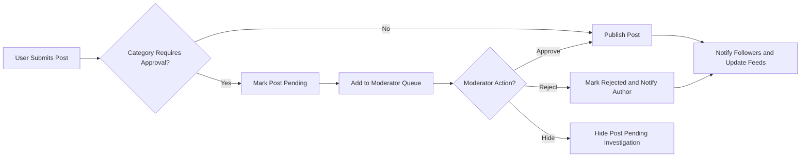
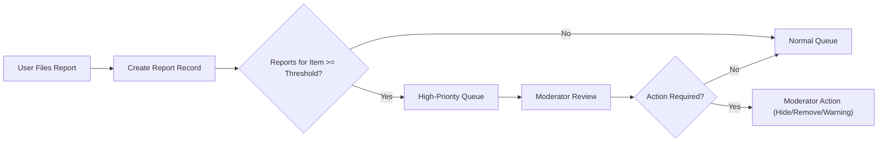
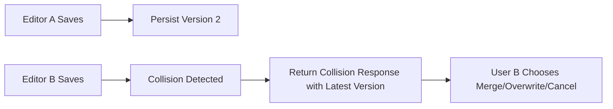

# Functional Requirements — econPoliticalForum

## Purpose and scope
Define the business-level functional requirements for econPoliticalForum, a public discussion board focused on economics and political topics. These requirements specify WHAT the system must support for core user actions, discovery, moderation, auditing, and operational behavior. Implementation details (APIs, database schema, encryption algorithms) are intentionally out of scope.

## Assumptions and constraints
- Target MVP audience: English-speaking users within initial jurisdiction(s) defined by stakeholders.  
- Roles: guest, registeredUser, moderator, administrator. Role behaviors are referenced here but enforced by authentication/authorization components.  
- Minimum operational baselines: support 10,000 MAU at launch and meet SLAs defined in Non-Functional Requirements.

## Key concepts and entities
- Post: top-level authored content with title, body, tags, and category.  
- Comment: reply attached to a post or to another comment (nesting depth limited per rules).  
- Thread: a post and its comment tree.  
- Category: logical grouping of threads; categories may be public, restricted, or moderated.  
- Tag: optional short label applied to posts for discovery.  
- Vote: upvote or downvote applied by registered users.  
- Report: structured user submission indicating a policy concern about content.

## Roles and permission references (business view)
- guest: read-only access to public content.  
- registeredUser: create/edit/delete own content per edit windows, vote, report, bookmark, follow.  
- moderator: triage reports, hide/unpublish content, issue warnings, place temporary suspensions, approve posts in moderated categories.  
- administrator: perform role management, permanent suspensions, system-wide policy changes, and legal compliance tasks.

## 1. Post lifecycle and rules (EARS)
- WHEN a registeredUser submits a new post, THE system SHALL accept the post if the user is not suspended and meets category restrictions (email verified when required).  
- WHEN a user submits a post, THE system SHALL validate title length to be between 5 and 200 characters and SHALL validate body length to be between 10 and 50,000 characters; invalid submissions SHALL be rejected with clear error messages indicating the violated constraint.  
- WHEN a post is created in a category marked as "moderated", THE system SHALL mark the post status as "pending" and SHALL add it to the moderator queue; the post SHALL NOT be publicly visible until approved.  
- WHEN a post is created in a category marked as "public", THE system SHALL publish the post immediately and SHALL make it discoverable subject to indexing timelines.

### Editing posts
- WHEN a post author edits their post within 24 hours of original publication, THE system SHALL accept edits and SHALL update the public view without requiring moderator re-approval; THE system SHALL record an edit audit entry with timestamp and editor id.  
- IF a post author edits a post after 24 hours from publication, THEN THE system SHALL mark the post as "edited" in public views and SHALL record the full revision history for moderators and administrators.  
- IF a post is currently under moderator review or locked due to an ongoing investigation, THEN THE system SHALL prevent author edits and SHALL display a notification that edits are temporarily disabled.

### Deleting posts
- WHEN a post author deletes their post within 30 days of publication, THE system SHALL soft-delete the post (hide from public listings) but SHALL retain the content in immutable archives for at least 90 days for appeals and legal compliance.  
- IF a post has comments by other users, THEN THE system SHALL preserve comment context: the public view SHALL display a standardized placeholder such as "Post removed by author" while preserving child comments for continuity unless moderators decide otherwise.  
- IF a post is removed by a moderator or administrator for policy reasons, THEN THE system SHALL notify the author with a rationale code and SHALL record the action in the moderation audit log.

## 2. Comments and replies (EARS)
- WHEN a registeredUser submits a comment, THE system SHALL accept comment content up to 5,000 characters and SHALL permit nested replies up to 3 levels for the MVP; attempts to exceed these limits SHALL be rejected with an explanatory message.  
- WHEN a comment is submitted on a post that is pending moderator approval or hidden, THE system SHALL deny the comment submission and SHALL inform the user that the post is not accepting comments.  
- WHEN a comment author edits their comment within 15 minutes of posting, THE system SHALL accept the edit and SHALL not display an "edited" marker; edits after 15 minutes SHALL be marked "edited" and SHALL be recorded in an audit trail.

### Comment deletion
- WHEN a comment author deletes their comment, THE system SHALL remove it from public view and SHALL retain a soft-delete copy for 90 days for moderation and appeals.
- IF a moderator deletes a comment for policy reasons, THEN THE system SHALL notify the comment author and record the deletion reason and moderator id in the moderation log.

## 3. Categories, threads, and tags (EARS)
- WHERE a category is designated "restricted", THE system SHALL require email verification and any additional prerequisites (such as account age) defined by product policy before allowing posts in that category.  
- WHEN a user selects tags for a post, THE system SHALL accept up to 5 unique tags per post, SHALL normalize tags to lower-case, shall trim whitespace, and SHALL limit tag length to 30 characters; tags violating constraints SHALL be rejected with a clear message.  
- WHEN a moderator merges two threads, THE system SHALL preserve original post timestamps and author attributions and SHALL append a moderator note explaining the merge reason; the merge action SHALL be recorded in the moderation audit log.

## 4. Voting and reputation (EARS)
- WHEN a registeredUser casts a vote on a post or comment, THE system SHALL accept one vote per user per item and SHALL prevent voting on one's own content; the system SHALL reflect the changed vote count to viewers within 2 seconds in 95% of normal requests.  
- WHEN a registeredUser changes a previously cast vote within 24 hours, THE system SHALL accept the change and SHALL record the vote change in an audit log.  
- IF a pattern of suspicious voting behavior is detected (for example, more than 100 votes by the same account across unrelated items within 10 minutes, or mass votes concentrated on a single target from related IPs/accounts), THEN THE system SHALL flag the accounts and impacted items for moderator review and SHALL optionally exclude flagged votes from public score calculations until resolution.  
- WHEN a user's content is removed for verified policy violations, THE system SHALL subtract the associated reputation changes resulting from that content from any public reputation metrics and SHALL record the adjustment.

## 5. Search and discovery (EARS)
- WHEN a user performs a search, THE system SHALL return ranked results subject to relevance and community signals and SHALL return initial result pages within 2 seconds for 95% of typical queries under normal load.  
- IF a user filters search results by category, tag, author or date range, THEN THE system SHALL apply those filters and SHALL return results that match all selected filters.  
- WHERE content is private, pending moderation, or restricted to certain roles, THE system SHALL exclude such items from search results for users who lack the required permissions.

## 6. Notifications, bookmarks, and following (EARS)
- WHEN a user follows a thread, THE system SHALL generate in-app notifications for new comments or posts in that thread according to the user's notification preferences and SHALL deliver in-app notifications for immediate events within 10 seconds in 95% of cases under normal load.  
- WHEN a user is directly mentioned, THE system SHALL create a high-priority notification and SHALL send an email notification if the user's email notifications setting indicates so.  
- WHEN a user bookmarks a post, THE system SHALL persist the bookmark and SHALL display it in the user's bookmark list immediately.

## 7. Reporting and moderation workflow (EARS)
- WHEN any user files a report, THE system SHALL require selection of a structured reason code and MAY accept optional text up to 2000 characters; THE system SHALL create an immutable report record containing reporter id (if authenticated), target content id, reason code, reporter text, and timestamp.  
- WHEN the number of independent reports for a single item reaches a configurable threshold (default: 5 reports within 24 hours), THE system SHALL escalate the item to a high-priority moderator queue and SHALL surface it to on-duty moderators within 30 minutes.  
- WHEN a moderator takes action (dismiss, warn, hide, remove, suspend), THE system SHALL record the moderator id, action type, policy clause(s) applied, and a free-text rationale (up to 1000 chars) in an immutable moderation log entry.  
- IF a moderator removes content, THEN THE system SHALL notify the content author with the action code and appeals instructions and SHALL include a reference id from the moderation log for appeals.

## 8. Rate limiting and abuse controls (EARS)
- WHEN a newly registeredUser (account age < 7 days) attempts to create posts, THE system SHALL limit that user to at most 3 posts per 24-hour rolling window and SHALL return a human-readable message indicating remaining quota and reset time.  
- WHEN any registeredUser attempts to create more than 10 comments within one minute, THE system SHALL throttle additional comment submissions for that user for 10 minutes and SHALL inform the user of the cooldown and reason.  
- WHEN an account exceeds automated voting thresholds indicative of abuse (e.g., >200 votes in 1 hour), THE system SHALL temporarily suspend voting for that account pending moderator review and SHALL log the event for audit.

## 9. Drafts, error handling, and recovery (EARS)
- WHEN a user composes a post or comment and network disruption occurs, THE system SHALL preserve an editable draft client-side for at least 7 days; THE system SHALL accept subsequent retries as updates rather than duplicates if the client indicates a prior failed attempt.  
- IF user input validation fails (length limits, missing required fields), THEN THE system SHALL return a localized, human-readable error message explaining the exact violation and the allowed ranges.  
- WHEN a user is rate-limited, THE system SHALL display an explicit message containing reason, remaining time until the limit lifts, and a link to guidance on posting and community rules.

## 10. Concurrency, idempotency, and conflict resolution (EARS)
- WHEN concurrent edits to a post are submitted, THE system SHALL detect edit collisions and SHALL provide a deterministic resolution path: accept one edit and return a collision response to the other editor including the latest version and an option to merge or overwrite; collision events SHALL be logged.  
- WHEN duplicate create requests are received (for example due to client retries), THE system SHALL ensure idempotent behavior by using client-generated idempotency keys: THE system SHALL accept the first request and SHALL return the same success result on retries with the same key.  
- WHEN conflicting moderator actions occur concurrently, THE system SHALL record both actions with timestamps and SHALL surface the most recent action as the effective state while preserving prior actions in the audit trail for administrator review.

## 11. Privacy, data export, and retention (EARS)
- WHEN a user requests account deletion, THE system SHALL mark the account as "scheduled for deletion" and SHALL provide a 30-day cancellation window; AFTER the window expires, THE system SHALL anonymize personal identifiers in public content while retaining non-personal content for community continuity subject to legal retention rules.  
- WHEN a user requests a data export, THE system SHALL provide an export of user-owned content (posts, comments, bookmarks) within 30 calendar days in a machine-readable format per privacy policy.  
- IF content is removed due to policy or legal reasons, THEN THE system SHALL retain archival copies and moderation evidence for at least 365 days or longer if required by legal hold.

## 12. Audit logging and transparency (EARS)
- WHEN any moderation or administrative action occurs, THE system SHALL create an immutable audit log entry containing: acting user id, role, action type, target id(s), timestamp, policy clause(s) referenced, and free-text rationale; these entries SHALL be retained for at least 2 years.  
- WHEN an administrator queries moderation history, THE system SHALL provide filters for date range, moderator id, action type, and target user, and THE system SHALL return results matching filters within 10 seconds for normal datasets.

## 13. Acceptance criteria and QA test cases (measurable)
- WHEN a verified registeredUser submits a valid post in an open category, THEN the post SHALL be publicly visible within 3 seconds in 95% of test requests under baseline load.  
- WHEN a user edits a post inside the 24-hour window, THEN the edit SHALL be accepted and the public content SHALL reflect changes within 3 seconds.  
- WHEN 5 unique authenticated users report the same item within 24 hours, THEN the item SHALL be escalated to high-priority queue and visible to moderators within 30 minutes in 95% of measured events.  
- WHEN a high-severity report is submitted, THEN a moderator SHALL acknowledge and open the case within 2 hours during active moderation hours for 95% of test cases.  
- WHEN a typical search query is executed, THEN the system SHALL return initial result page within 2 seconds for 95% of queries under baseline load.

## 14. Non-functional references (summary of critical SLAs)
- Read/listing page response: target 2s for 95% of requests.  
- Post/comment write acknowledgement: target 2s for 95% of requests.  
- Vote action acknowledgement: target 1s for 99% of requests.  
- Moderation high-severity acknowledgement: within 2 hours during active hours.

## 15. Process flows and diagrams
### Posting and moderation flow

### Reporting escalation flow

### Concurrency and collision handling

## 16. Open questions for stakeholders (business decisions)
- Confirm exact tag moderation policy: SHOULD tags be pre-moderated for specific categories at launch?  
- Confirm reputation thresholds: WHAT reputation score unlocks reduced rate limits or additional privileges?  
- Confirm data export SLA: IS 30 days acceptable for legal or regulatory requirements in primary jurisdictions?

## 17. Next steps for implementation teams
- Translate these EARS requirements into concrete API contracts and acceptance tests.  
- Implement moderation audit log schema and retrieval endpoints to match audit requirements.  
- Build test harnesses to validate SLAs under expected load and to simulate moderation workflows.

