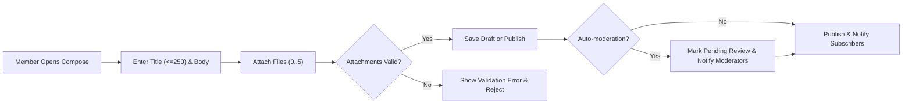

# 04-user-stories.md — User Stories for discussionBoard

## Purpose and Scope
Provide precise, testable user stories for the discussionBoard MVP. Stories define actor goals, business-level requirements in EARS format, and acceptance criteria suitable for implementation and QA. Audience: product managers, backend developers, and QA engineers. Related documents: 01-service-overview.md, 02-user-actors.md, 03-functional-requirements.md, 06-business-rules.md, 08-external-integrations.md, 09-data-lifecycle.md, 10-error-handling-and-exceptions.md.

## Personas
- Guest
  - Role: Unauthenticated visitor who reads public posts and attachments.  
  - Constraint: Guests SHALL not create posts, comments, or attach files.

- Member
  - Role: Registered, verified user who creates posts and comments, attaches files, reports content, and manages subscriptions.  
  - Constraint: Members SHALL verify email before publishing; permission details in 02-user-actors.md.

- Moderator
  - Role: Privileged user who reviews reports, hides/removes content, issues warnings and suspensions, and records audit entries.  
  - Constraint: Moderator actions SHALL be logged and auditable per 02-user-actors.md and 06-business-rules.md.

## MVP Prioritization (High -> Low)
1. Member: Create and publish article posts with attachments (images/files)  
2. Member: Comment and reply threads (limited depth)  
3. Attachment validation and safe storage with CDN access  
4. Reporting and moderator review workflow with audit logging  
5. Guest: Browse and read public posts and attachments  
6. Member: Edit within permitted window; Delete and restore within retention window


## Primary User Stories (Members)

### Story 1: Create and publish an article with attachments (MVP)
Narrative: As a Member, I want to create an article with supporting images or files so that readers can view my analysis and evidence.

EARS Requirements:
- WHEN a member composes a new article, THE system SHALL accept a title (max 250 characters) and a body (max 200,000 characters).
- WHEN a member attaches files to an article, THE system SHALL allow up to 5 attachments per article and up to 3 image attachments among them.
- WHEN a member uploads an attachment, THE system SHALL validate file type and size immediately and SHALL reject attachments exceeding limits (images <= 10 MB, other allowed files <= 50 MB).
- WHEN a member publishes an article and automated safety checks do not require review, THE system SHALL make the article publicly visible within 3 seconds under normal conditions.
- IF automated or report-based moderation rules require pre-publication review, THEN THE system SHALL mark the article as "Pending Review" and SHALL not display it in public listings until a moderator clears it.

Acceptance Criteria (testable):
- Member can create a draft, attach up to 5 files, publish, and see the article appear in listings within 3 seconds.
- Attempting to attach a 6th file fails with a clear error message and no attachments saved.
- Attaching an image >10 MB or a document >50 MB is rejected with an explicit size error.
- When automated checks flag content, article is marked Pending Review and not visible to guests or members in listings.

Test Scenarios:
- Upload valid images (1 MB) and a PDF (2 MB) and publish: article appears in listing.
- Upload 6 small images: UI/backend rejects 6th and returns specific error.
- Simulate spam score high: article enters Pending Review queue and author is notified.


### Story 2: Edit own article within edit window
Narrative: As a Member, I want to correct mistakes in my article shortly after publishing so my arguments remain accurate.

EARS Requirements:
- THE system SHALL allow authors to edit their own published articles within 24 hours of publication.
- IF an author attempts to edit after 24 hours, THEN THE system SHALL deny direct edits and SHALL provide an "edit request" path routed to moderators.
- WHEN an edit occurs within the edit window, THE system SHALL record an edit history entry with timestamp and author id accessible to moderators and the author.

Acceptance Criteria:
- Edits made within 24 hours update public content and create an edit history entry.
- Edits attempted after 24 hours are blocked and UI provides instructions to request moderator-assisted edits.

Test Scenarios:
- Publish a post, edit within 10 minutes: changes visible and history recorded.
- Publish a post, attempt to edit after 25 hours: edit blocked and request path offered.


### Story 3: Delete and restore own article
Narrative: As a Member, I want to delete my article and restore it within a grace period for accidental deletions.

EARS Requirements:
- WHEN a member deletes their own article, THE system SHALL soft-delete the post immediately and SHALL retain it as recoverable for 30 calendar days.
- IF the member requests restoration within 30 days, THEN THE system SHALL restore the post to its prior state and make it public per visibility rules.
- IF 30 days elapse, THEN THE system SHALL permanently purge the post and associated attachments unless a legal hold exists.

Acceptance Criteria:
- Member deletes post: post removed from public listings immediately but available in their restore UI.
- Restoring within 30 days recovers the post with attachments and metadata.
- After 30 days, restore option is unavailable and content is purged by scheduled purge job.

Test Scenarios:
- Delete and restore within 10 days: post is restored.
- Delete and wait 31 days: post no longer restorable.


### Story 4: Attach files while composing and handle failures
Narrative: As a Member, I want to attach supportive files and be informed if uploads fail so I can retry or adjust files.

EARS Requirements:
- WHEN a member uploads an attachment, THE system SHALL validate type and size and return a precise user-facing error on failure.
- WHEN an upload fails due to transient network issues, THE system SHALL perform up to 3 automatic retries with exponential backoff (1s, 2s, 4s) and then present retry/save-draft options.
- IF the storage provider is unavailable, THEN THE system SHALL queue uploads for up to 24 hours and SHALL notify the author if persistence fails beyond 24 hours.

Acceptance Criteria:
- Uploads that fail transiently are retried automatically; after 3 failed attempts the user sees "Retry" and "Save Draft" options.
- Uploads rejected for type/size return the exact allowed limits in the error message.
- Queued uploads persist and complete when provider recovers in >95% of recovery tests.

Test Scenarios:
- Simulate network drop: confirm 3 retries then user options.
- Upload >limit file: confirm explicit size error.


### Story 5: Commenting and reply threading
Narrative: As a Member, I want to comment and reply to others to participate in discussion.

EARS Requirements:
- THE system SHALL allow authenticated members to post comments up to 500 characters.
- THE system SHALL allow replies nested up to 2 levels deep for MVP; deeper replies SHALL be flattened into level 2 with an indicator.
- WHEN a comment is created, THE system SHALL display it publically within 2 seconds under normal conditions.
- WHEN a member edits their comment, THE system SHALL allow edits only within 60 minutes of posting.

Acceptance Criteria:
- Comment posted and visible within 2 seconds.
- Edits within 60 minutes succeed and are recorded; edits after 60 minutes are blocked.
- Nested replies beyond level 2 are consolidated at level 2 with a UI indicator.

Test Scenarios:
- Post a comment and reply twice: verify threading and visibility.
- Attempt edit after 2 hours: edit is blocked.


## Moderator and Admin Stories

### Story 6: Report review and moderator action
Narrative: As a Moderator, I want to review reports and take actions to enforce rules and keep the community healthy.

EARS Requirements:
- WHEN a report is filed, THE system SHALL record reporter id, target content id, selected reason category, and optional explanation.
- IF a content item receives 5 unique reports within 48 hours, THEN THE system SHALL auto-hide the content and escalate to high-priority review.
- WHEN a moderator takes action (hide/remove/warn/suspend), THE system SHALL record moderator id, action, reason, and timestamp in an audit log.

Acceptance Criteria:
- Reports generate moderation queue entries with metadata.
- 5 reports within 48 hours auto-hide content and notify moderators.
- All moderator actions are recorded and visible in moderator tools.

Test Scenarios:
- File 5 reports: verify auto-hide and queue prioritization.
- Moderator hides content: verify visibility changes and audit entry.


### Story 7: Moderator issues sanctions and handles appeals
Narrative: As a Moderator, I want to warn or suspend users and handle appeals fairly.

EARS Requirements:
- WHEN a moderator issues a warning, THE system SHALL record the warning against the user's account with timestamp and reason and SHALL optionally notify the user.
- WHEN a moderator suspends an account temporarily, THE system SHALL set the account state to suspended for the defined duration and SHALL revoke active sessions.
- WHEN a user appeals, THE system SHALL queue the appeal for secondary review and SHALL process appeals within 14 days business SLA.

Acceptance Criteria:
- Warnings and suspensions appear in moderator dashboards and affect user capabilities immediately.
- Appeal requests are queued and processed within 14 days in 95% of cases.


## Guest / Visitor Scenarios

### Story 8: Browse and read public articles
EARS Requirements:
- THE system SHALL present published articles and their attachments to guests, excluding content hidden by moderation or under review.
- WHEN a guest attempts an action requiring authentication, THE system SHALL prompt for login or registration and preserve read context.

Acceptance Criteria:
- Guests can view published posts and preview attachments; attempting to comment leads to login prompt.


### Story 9: Register and verify account
EARS Requirements:
- WHEN a guest registers, THE system SHALL create a pending account and SHALL send a verification email that expires within 48 hours.
- WHEN the account is verified, THE system SHALL grant publishing privileges.

Acceptance Criteria:
- New account cannot publish until verified; resend verification works within 48-hour window.


## Edge Cases and Secondary Stories

### Edge Case A: Conflicting simultaneous edits
EARS Requirements:
- IF concurrent edits are submitted, THEN THE system SHALL detect conflicts and SHALL present the editor with a merge/conflict resolution option preserving both versions for manual resolution.

Acceptance Criteria:
- Conflicting edits do not silently overwrite; users receive conflict view and preserved versions.

### Edge Case B: Automated moderation false positive
EARS Requirements:
- IF automated spam detection hides content erroneously and a user appeals, THEN THE system SHALL queue an expedited moderator review and SHALL restore content if cleared.

Acceptance Criteria:
- Appeals for auto-hidden content are reviewed within priority SLA (12 hours) and cleared content is restored with audit record.

### Edge Case C: Attachment upload interruptions
EARS Requirements:
- WHEN an upload is interrupted, THE system SHALL preserve draft for at least 48 hours and SHALL provide a retry mechanism; resumable uploads are recommended.

Acceptance Criteria:
- Drafts persist for 48 hours; upload retry restores attachments in 90% of tests when network recovers within 1 hour.


## Acceptance Criteria Matrix (summary)
- Post publish latency: public visibility within 3 seconds for successful publishes (95th percentile under normal load).
- Attachment limits: <=5 attachments/post, <=3 images/post, image <=10 MB, other <=50 MB.
- Edit windows: posts 24 hours, comments 60 minutes.
- Comment length: <=500 characters.
- Rate limits: posts <=5/hour per member, comments <=200/hour per member.
- Moderation thresholds: auto-hide at 5 reports within 48 hours; moderation response SLA: 48h (12h for priority).


## Traceability and Related Documents
- Service vision and constraints: 01-service-overview.md
- Actor and authentication expectations: 02-user-actors.md
- Functional requirements: 03-functional-requirements.md
- Business rules and retention: 06-business-rules.md
- External integrations (storage, email, scanning): 08-external-integrations.md
- Data lifecycle and purge schedules: 09-data-lifecycle.md
- Error handling and retry policies: 10-error-handling-and-exceptions.md


## Diagrams
Post creation flow:



Moderation review flow:

```mermaid
graph LR
  R["Report Filed"] --> S["Create Report Entry"]
  S --> T["Moderation Queue"]
  T --> U{""Priority? (>=5 reports)""}
  U -->|"Yes"| V["Auto-hide Content & High Priority"]
  U -->|"No"| W["Normal Queue Order"]
  V --> X["Moderator Reviews"]
  W --> X
  X --> Y{""Action""}
  Y -->|"Dismiss"| Z["Mark Resolved & Notify Reporter"]
  Y -->|"Hide/Remove"| AA["Apply Action & Record Audit"]
  AA --> AB["Notify Author & Record Appeal Window"]
```


## Glossary
- Member: registered and verified user able to publish and comment.
- Moderator: privileged user who enforces policies and records audit actions.
- Pending Review: content state where public visibility is suppressed until moderator approval.
- Soft-delete: reversible deletion state retained for 30 days.


## Next Steps
- Implement backend APIs and database models consistent with these stories and acceptance criteria.
- Create QA test plans mapping to each acceptance test defined above.
- Confirm integration SLAs for attachments and email in 08-external-integrations.md.


