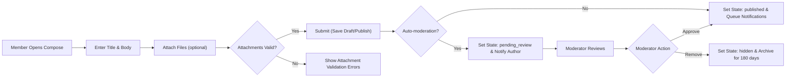
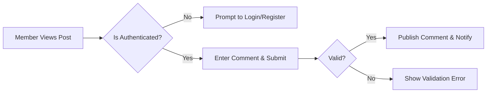
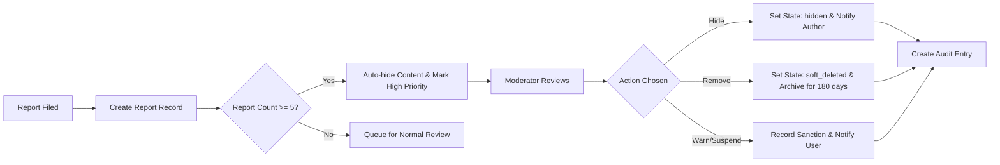
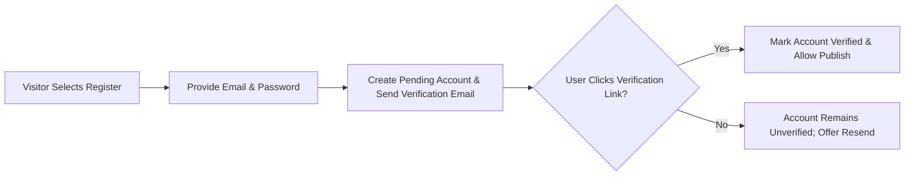
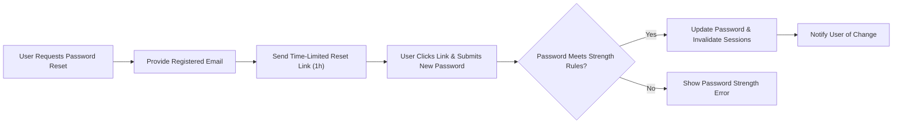

# 05-user-flows.md — User Flows and Requirements for discussionBoard

## Scope and Purpose
Provide precise, testable user flows for core discussionBoard operations: post creation (with attachments), commenting, moderation, account registration and verification, and password reset. Each flow defines actor steps, system validations, asynchronous processing, state transitions, error handling, and acceptance criteria. Requirements use EARS phrasing where applicable and reference related business-level documents for policy and retention rules.

Related documents: ./01-service-overview.md, ./02-user-actors.md, ./03-functional-requirements.md, ./06-business-rules.md, ./08-external-integrations.md, ./09-data-lifecycle.md, ./10-error-handling-and-exceptions.md

## Actors, Preconditions, and Common States
Actors:
- Guest — unauthenticated visitor with read-only access
- Member — authenticated user with content creation and reporting permissions
- Moderator — privileged actor with moderation and sanctioning permissions

Common content states:
- draft: private to the author
- published: visible to guests and members
- pending_review: held from public view until moderator approval
- hidden: removed from public listings by moderator or automated rule
- soft_deleted: non-public, recoverable for retention window
- archived: excluded from default listings; viewable by moderators or owners

Authentication preconditions:
- THE discussionBoard SHALL require members to have a verified email before allowing publication actions (create public posts or comments).
- WHEN an actor is unauthenticated and attempts to perform member-only actions, THE discussionBoard SHALL redirect or present an authentication prompt and SHALL preserve in-progress draft where feasible.

Session expectations (business-level):
- THE discussionBoard SHALL require re-authentication for sensitive flows after session expiry; session expiry handling and token lifetimes are defined in ./02-user-actors.md.

## Flow 1 — Post Creation (Compose, Attach, Validate, Publish)

Overview: Members create article posts with optional attachments. The flow covers draft saving, attachment validation, optional automatic moderation, publishing, notification, and state transitions.

Happy path (step-by-step):
1. Member opens the Compose UI and enters Title, Body, selects Category and Tags as desired.
2. Member optionally uploads attachments (images/documents). Each attachment is immediately validated by the backend for type and size; the UI displays validation results.
3. Member selects Publish. The backend performs synchronous validation and returns success acknowledgement when the post and associated metadata are accepted.
4. THE discussionBoard SHALL either publish the post (state=published) or place it in pending_review (state=pending_review) depending on automated moderation signals.
5. If published, THE discussionBoard SHALL queue notifications to followers/subscribers according to their delivery preferences.

Decision points and branching:
- Missing required fields: Title required; Body required unless at least one valid attachment exists.
- Attachment failure: invalid type or size rejects the attachment and the system prevents publish until resolved.
- Automated moderation trigger: high-confidence automated signals result in state pending_review; medium confidence results in publish but flagged for expedited review.

EARS requirements (key):
- WHEN a member submits a new post for publishing, THE discussionBoard SHALL validate that the title length is between 5 and 250 characters and that the body length is between 10 and 200000 characters unless at least one valid attachment exists.
- WHEN attachments are included, THE discussionBoard SHALL accept only allowed mime types and SHALL reject any attachment exceeding per-file size limits (images <= 5 MB; documents <= 20 MB) and SHALL return a clear user-facing message identifying the failing attachment and reason.
- IF automated spam/abuse scoring exceeds the high threshold, THEN THE discussionBoard SHALL set the post state to "pending_review" and SHALL not display the post to the public until a moderator approves it.
- WHEN a post is published successfully, THE discussionBoard SHALL present a visible confirmation to the author within 3 seconds under normal operating conditions and SHALL queue notifications for subscribers (immediate or digest) per user preferences.

Attachment lifecycle within the flow:
- WHEN an attachment is uploaded and associated with a draft, THE discussionBoard SHALL retain the attachment for at least 48 hours tied to the draft; orphaned upload files older than 48 hours SHALL be purged.
- WHEN an attachment fails malware or abuse scanning, THEN THE discussionBoard SHALL quarantine the attachment, reject association with public content, notify the uploader, and queue a moderator review.

Error and recovery paths:
- IF attachment upload fails due to transient network failure, THEN THE discussionBoard SHALL automatically retry the upload up to 3 times with exponential backoff (1s, 2s, 4s) and SHALL surface retry status to the user; after retries fail THE discussionBoard SHALL allow the user to save draft and retry later.
- IF final publish fails after successful validation (storage error), THEN THE discussionBoard SHALL preserve the draft and attachments and SHALL notify the author with a reference id for support.

Acceptance criteria (post creation):
- Member can create a draft, attach files, and publish; published posts appear in public listings within 3 seconds for 95% of normal requests.
- Uploads of images <=5 MB and allowed documents <=20 MB succeed in 95% of cases under normal network conditions.
- Posts receiving high-confidence automated flags enter pending_review and are not visible publicly until approval.

Mermaid diagram (post creation):

## Flow 2 — Commenting and Replying

Overview: Members post comments to published posts; comments are subject to validation, edit windows, and rate limits.

Happy path (steps):
1. Member navigates to a published post and enters a comment.
2. Backend validates comment length and content policy heuristics and returns immediate visibility for accepted comments.
3. THE discussionBoard SHALL notify the post author and mentioned users according to their notification preferences.

EARS requirements:
- WHEN an authenticated member submits a comment, THE discussionBoard SHALL accept up to 5,000 characters per comment and SHALL reject empty or whitespace-only submissions.
- WHEN a comment triggers a high-risk automated signal, THEN THE discussionBoard SHALL place the comment into pending_review and SHALL not render it publicly until moderator approval.
- WHEN a member edits their own comment, THE discussionBoard SHALL allow edits within a 60-minute window after posting; edits after 60 minutes SHALL be disallowed and THE member SHALL be encouraged to post a follow-up comment.

Threading and limits:
- THE discussionBoard SHALL support nested replies up to two levels deep for MVP to maintain readability.

Rate limiting:
- THE discussionBoard SHALL limit comment creation to 10 comments per minute per member; exceeding the limit SHALL result in a user-facing rate-limit message and exponential backoff on retries.

Acceptance criteria (comments):
- Comments appear publicly within 2 seconds for successful submissions under normal load.
- Edit window enforcement (60 minutes) functions in all tested cases.

Mermaid diagram (commenting):

## Flow 3 — Moderation: Report -> Review -> Action -> Appeal

Overview: Members report content; moderators triage, act, and record audit logs. Appeal paths enable authors to contest moderation decisions.

Report creation:
- WHEN a member files a report, THE discussionBoard SHALL capture reporter id, target content id, reason category, optional text (<=1000 chars), and timestamp.
- WHEN an item receives 5 unique reports within a 48-hour window, THEN THE discussionBoard SHALL automatically hide the content and mark it high-priority for moderator review.

Moderator actions and audit:
- WHEN a moderator acts on a reported item, THE discussionBoard SHALL record the moderator id, action taken, reason, and timestamp in an audit entry and SHALL notify the content author of the action and appeal options.
- THE discussionBoard SHALL retain moderation audit records for at least 2 years for compliance and appeals.

Appeals:
- WHEN an author appeals a moderation action within 14 days, THE discussionBoard SHALL queue the appeal for secondary review by a different moderator or administrator and SHALL suspend automatic purge timers for the content until the appeal completes.

Error and escalation paths:
- IF moderator action fails due to system error, THEN THE discussionBoard SHALL queue the action for retry and escalate to administrators if retries exceed 10 attempts over 1 hour.

Acceptance criteria (moderation):
- High-priority items (auto-hidden) are visible in moderator queue within 5 minutes and prioritized for review.
- Moderator action logging is complete and queryable for audit in 99% of tests.

Mermaid diagram (moderation):

## Flow 4 — Account Registration and Email Verification

Overview: New users register, verify their email, and gain posting privileges after verification. Unverified accounts may save drafts but cannot publish.

Basic steps:
1. Visitor registers with email, password, and display name.
2. THE discussionBoard SHALL create a pending account and send a single-use verification link that expires in 48 hours.
3. WHEN the user clicks the verification link, THE discussionBoard SHALL mark the account verified and permit publishing actions.
4. IF verification link expires, THEN THE discussionBoard SHALL allow the user to request a new verification link.

EARS requirements:
- WHEN a visitor registers, THE discussionBoard SHALL create an account in "unverified" state and SHALL send a verification link that expires within 48 hours.
- WHEN an unverified user attempts to publish content, THE discussionBoard SHALL block the action and SHALL present an option to resend the verification email.

Acceptance criteria (registration):
- Verification emails delivered within 60 seconds for 95% of attempts under normal conditions.
- Unverified accounts may save drafts but cannot publish until verification completes.

Mermaid diagram (registration):

## Flow 5 — Password Reset

Overview: Members request password reset; secure single-use tokens facilitate reset and session revocation.

Steps:
1. Member requests password reset by providing registered email.
2. THE discussionBoard SHALL send a single-use reset link or token that expires in 1 hour.
3. WHEN the member uses the link and sets a new password (meeting strength rules), THE discussionBoard SHALL invalidate other active sessions and notify the user of the change.

EARS requirements:
- WHEN a member requests password reset, THE discussionBoard SHALL send a time-limited reset link that expires within 1 hour.
- WHEN a password reset succeeds, THE discussionBoard SHALL invalidate all active sessions and SHALL notify the account email about the change.

Acceptance criteria (password reset):
- Reset links delivered within 60 seconds for 95% of attempts under normal conditions.
- After reset, previous sessions are invalidated and new authentication is required.

Mermaid diagram (password reset):

## Attachment Lifecycle & Orphan Handling

Rules (business-level):
- THE discussionBoard SHALL allow up to 5 attachments per post and up to 1 attachment per comment for MVP.
- THE discussionBoard SHALL accept images (JPEG, PNG, GIF, WEBP) and document types (PDF, DOCX, TXT) and SHALL reject executables and archives containing executables.
- WHEN an attachment is uploaded and remains unassociated with published or draft content for more than 48 hours, THEN THE discussionBoard SHALL mark it as orphaned and schedule it for deletion.
- WHEN an attachment fails malware scanning, THEN THE discussionBoard SHALL quarantine the file, notify the uploader, and require moderator review before release.

## Error Handling and Retry Policies (flow-agnostic)

Generic retry rules:
- FOR transient failures (network, storage), THE discussionBoard SHALL attempt automated retries with exponential backoff and a maximum of 5 attempts for critical operations; non-critical operations may be queued for asynchronous retry up to 72 hours.

Draft preservation:
- WHEN an action that would publish content fails, THE discussionBoard SHALL preserve the author’s draft and attachments for at least 48 hours and SHALL surface a reference id to support recovery.

User-facing messaging:
- FOR validation errors, THE discussionBoard SHALL present itemized messages indicating which fields failed and how to correct them.
- FOR system errors, THE discussionBoard SHALL present a friendly message, provide a reference id for support, and offer to save work as draft.

## Non-Functional SLAs Relevant to Flows
- THE discussionBoard SHALL present published posts in public listings within 3 seconds for 95% of requests under normal load.
- THE discussionBoard SHALL provide upload acknowledgement for attachments within 10 seconds for files <=5 MB under normal conditions.
- THE discussionBoard SHALL display comment publish acknowledgements within 2 seconds for 95% of cases.
- THE discussionBoard SHALL surface new moderation reports to moderators within 5 minutes; high-priority items (auto-hidden) SHALL appear within 1 minute.

## Acceptance Criteria and QA Test Scenarios
For each flow the following QA checks apply:

Post Creation:
- Create draft -> attach three valid images -> publish -> verify post visible in listing within 3 seconds.
- Attempt to attach a disallowed file type -> verify clear error message and upload rejection.
- Trigger auto-moderation (test label) -> verify pending_review state and no public visibility.

Commenting:
- Post a comment as authenticated user -> verify visibility within 2 seconds and notification to author.
- Edit comment within 60 minutes -> verify edit allowed and edit history recorded.

Moderation:
- File 5 unique reports on a post within 48 hours -> verify auto-hide and moderator queue entry.
- Moderator hides a post -> verify author notification and audit log entry.

Registration & Password:
- Register new user -> verify verification email delivery within 60 seconds and publishing blocked until verification.
- Password reset request -> verify reset link delivery within 60 seconds and session invalidation after reset.

## Traceability and Next Steps for Implementation
- Use ./03-functional-requirements.md and ./06-business-rules.md to derive API-level validations, data models, and error codes.
- Integrate with external services per ./08-external-integrations.md for storage, scanning, email delivery, and analytics.
- Map these flows to acceptance tests for CI and QA automation.

## Glossary
- pending_review: content not visible publicly pending moderator or automated clearance
- orphaned attachment: uploaded file not associated with any draft or published content for a configured time window
- audit entry: immutable record describing moderation or security-relevant actions with actor id and timestamp

# End of 05-user-flows.md
