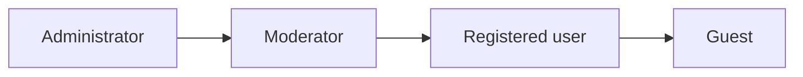
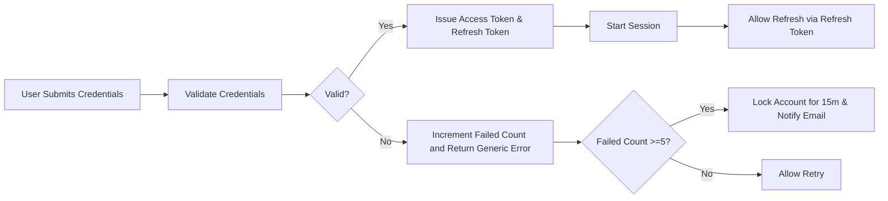
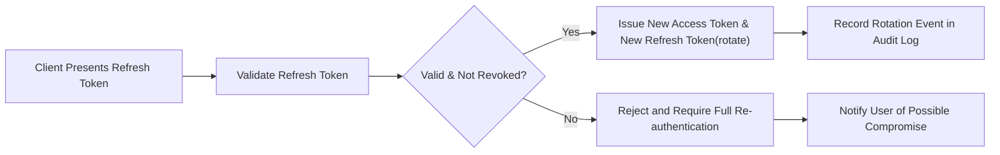

# 05-user-roles-authentication.md — User Roles, Authentication & Token Requirements

## Executive summary

Economical and secure account management for econPoliticalForum requires clear, testable business rules for user roles, authentication lifecycle, session management, and auditability. These rules define what the system must do to protect users, enable trusted participation, and provide administrators with the information needed for compliance and incident response. Implementation choices (protocols, libraries, database schema, cryptography) are intentionally left to the development team; this document specifies business-level, testable requirements only.

## Scope and audience

Audience: backend engineers, security reviewers, product managers, operations, and compliance teams.

Scope: role definitions, account lifecycle states, registration and verification, password rules and resets, session and token behaviors, permission matrix, suspension and appeal processes, audit logging, acceptance criteria, and diagrams. Out of scope: cryptographic algorithms, concrete API endpoint signatures, storage schema, and UI mockups.

## Roles and hierarchy

Defined roles (business-level):
- guest — Unauthenticated visitors. Capabilities: browse public categories and read public posts and comments. Restrictions: cannot create content, vote, report with identity-linked metadata, or access member-only features.
- registeredUser — Authenticated account holders. Capabilities: create/edit/delete own content (per edit windows), vote, report, bookmark, follow threads, receive notifications, and request account operations. Restrictions: cannot moderate or administrate.
- moderator — Designated community members with delegated moderation authority. Capabilities: review reports, hide/unpublish content, issue warnings, apply temporary suspensions (short-duration), approve posts in moderated categories, and view moderation logs. Restrictions: cannot change global policies or perform permanent bans without administrator confirmation.
- administrator — System operators with full platform privileges. Capabilities: manage roles and user lifecycle (suspend, reinstate, role changes), configure categories and global policies, access system-wide analytics and logs for legal or operational needs, and perform escalated moderation and legal responses.

Mermaid diagram — Role hierarchy

## Account states and lifecycle (business model)

Primary account states: Pending (registration created but unverified), Verified (email confirmed), Limited (temporary feature restrictions e.g., unverified or probation), Active (fully allowed per role), Suspended (temporary or permanent suspension), Deleted (user requested or admin removed — with retention rules applied).

EARS-formatted lifecycle rules:
- WHEN a new user registers, THE system SHALL create the account in "Pending" state and SHALL send a verification email to the supplied address.
- WHEN a user completes email verification using a valid verification token, THE system SHALL transition the account to "Verified" and SHALL allow verified privileges defined in the permission matrix.
- IF a user does not verify their email within 14 days, THEN THE system SHALL mark the account as "Limited" and SHALL restrict posting privileges until verification completes.
- WHEN a user requests deletion, THE system SHALL mark account as "Deleted (pending)" for a 30-day cancellation window and SHALL anonymize personal identifiers after the window expires unless legal holds apply.

Account metadata and auditability:
- WHEN an account changes state (Pending -> Verified, Verified -> Suspended, Suspended -> Reinstated), THE system SHALL record a timestamped audit event including the acting principal (system, moderator id, admin id) and a short reason code.

## Registration and input validation (business rules)

EARS-formatted registration requirements:
- WHEN a user submits a registration request, THE system SHALL validate email format and reject addresses that fail standard email syntax checks.
- WHEN a user submits registration, THE system SHALL require acceptance of the platform Terms of Service and Privacy Policy; the user SHALL be presented a link and SHALL indicate assent as part of the registration payload.
- IF registration input fails validation (email invalid, display name too short), THEN THE system SHALL return a localized error identifying the failing field and the valid constraints.

Specific field constraints (business-level):
- Display name: 3–30 characters, trimmed of leading/trailing whitespace, disallowing offensive words per policy (enforcement via policy checks during moderation).
- Password: minimum 10 characters and at least one uppercase letter, one lowercase letter, and one numeric character OR one special symbol. (Business-level requirement — implementers may enforce additional strength checks.)

Acceptance criteria for registration:
- WHEN a user registers with valid fields, THE system SHALL create an account in Pending state and send a verification email within 30 seconds in 95% of successful requests under normal load.

## Email verification and password reset flows

Verification token rules:
- WHEN a verification email is sent, THE system SHALL issue a single-use verification token that expires after 7 days.
- IF a user attempts to use an expired verification token, THEN THE system SHALL reject the token and SHALL provide a clear option to resend the verification email.
- THE system SHALL limit resend attempts to 5 per 24-hour rolling window per account to reduce abuse.

Password reset business rules:
- WHEN a verified user requests a password reset, THE system SHALL send a single-use reset link that expires after 1 hour.
- IF the reset token is used successfully, THEN THE system SHALL invalidate all active refresh tokens for that account and SHALL notify the user by email of the reset event.
- IF the reset token is presented after expiration, THEN THE system SHALL refuse the reset and SHALL allow the user to request a new reset link.

Acceptance criteria (verification & reset):
- WHEN a user requests password reset, THE system SHALL send the reset link within 60 seconds for 95% of requests under normal load.
- WHEN a user uses a valid password reset link, THE system SHALL permit password change and SHALL require new password to meet password rules.

## Login, failed attempts, and lockout handling

EARS-formatted login and lockout rules:
- WHEN a user attempts to log in, THE system SHALL validate credentials and SHALL not disclose whether the email or password was incorrect in user-facing messages.
- IF an account accrues 5 failed login attempts within a rolling 15-minute window, THEN THE system SHALL temporarily lock authentication for that account for 15 minutes and SHALL send a notification to the account email about suspicious activity.
- IF suspicious login patterns are detected (login attempts from multiple geographic regions within a short window), THEN THE system SHALL require re-authentication via verified email step or optional multi-factor authentication if enabled.

Account lockout handling:
- WHEN a user is locked out, THE system SHALL allow them to request immediate password reset to regain access; password reset action SHALL lift the lockout upon successful completion.

Performance acceptance:
- WHEN a user submits credentials, THE system SHALL respond within 2 seconds for 95% of normal requests under baseline load.

## Session and token management (business-level requirements)

Overview: sessions SHALL be represented by short-lived access tokens and longer-lived refresh tokens. Technical token format is left to implementers, but the following business behaviors are mandatory.

Token lifetime and rotation (business rules):
- THE system SHALL issue short-lived access tokens with a lifetime in the range of 15 to 30 minutes for normal interactive sessions.
- THE system SHALL issue refresh tokens with a lifetime between 7 and 30 days; the default business expectation for MVP is 14 days.
- WHEN a refresh token is used to obtain a new access token, THE system SHALL rotate the refresh token (issue a new refresh token and invalidate the prior one) and SHALL record the rotation event in an audit log.
- IF a refresh token is presented that has been previously invalidated, THEN THE system SHALL refuse the renewal and SHALL require full re-authentication.

Token minimal payload (business guidance):
- THE system SHALL ensure tokens contain minimal business claims: stable user identifier (userId), role identifier (role), issued-at timestamp (iat), and expiry timestamp (exp). THE system SHALL NOT contain sensitive personal data in token payloads.

Single sign-out and session revocation (business rules):
- WHEN a user selects "revoke other sessions" or "log out everywhere", THE system SHALL invalidate all other active access and refresh tokens associated with the account and SHALL complete invalidation within 60 seconds for 95% of requests under normal load.
- WHEN an administrator revokes a user's sessions for security reasons, THE system SHALL invalidate tokens and SHALL record the administrative action in an audit event with reason.

Refresh usage and suspicious activity:
- IF refresh token usage shows anomalous behavior (reuse from different geolocation or previously rotated token reuse), THEN THE system SHALL mark the account for immediate review, revoke suspicious tokens, and notify the user.

Acceptance criteria (token operations):
- WHEN a valid refresh token is used, THE system SHALL return a new access token and a rotated refresh token within 2 seconds for 95% of requests under normal load.
- WHEN a session revocation request is made, THE system SHALL show effect (other sessions invalidated) within 60 seconds for 95% of cases.

## Permission matrix (business actions mapped to roles)

| Action | Guest | Registered user | Moderator | Administrator |
|---|---:|---:|---:|---:|
| Browse public content | ✅ | ✅ | ✅ | ✅ |
| Read private or restricted content | ❌ | conditional (verified) | ✅ | ✅ |
| Create post | ❌ | ✅ (verified required in restricted categories) | ✅ | ✅ |
| Edit own post | ❌ | ✅ (within edit window) | ✅ | ✅ |
| Delete own post | ❌ | ✅ (soft-delete) | ✅ | ✅ |
| Comment | ❌ | ✅ | ✅ | ✅ |
| Vote | ❌ | ✅ | ✅ | ✅ |
| Bookmark/follow | ❌ | ✅ | ✅ | ✅ |
| Report content | ✅ | ✅ | ✅ | ✅ |
| Moderate reports | ❌ | ❌ | ✅ | ✅ |
| Suspend user (temporary) | ❌ | ❌ | limited (temporary, logged) | ✅ |
| Permanently ban user | ❌ | ❌ | ❌ | ✅ |
| Change global policies | ❌ | ❌ | ❌ | ✅ |

EARS permission rules referencing the matrix:
- WHEN a Registered user attempts to create a post in a category labeled "restricted", THE system SHALL verify the account is Verified before permitting creation.
- IF a Moderator applies a temporary suspension, THEN THE system SHALL record the action and SHALL restrict the account from creating new content for the specified duration.

## Account suspension, appeals, and reinstatement

EARS-formatted suspension and appeals rules:
- WHEN a user accumulates three confirmed moderation violations within a rolling 90-day window, THE system SHALL automatically flag the account for administrative review and SHALL apply a 7-day temporary suspension pending manual review.
- IF an account is suspended for legal reasons (e.g., content requiring law enforcement involvement), THEN THE system SHALL immediately notify administrators and SHALL preserve evidence per legal hold rules.
- WHEN a suspended user files an appeal within 14 days of suspension notice, THE system SHALL queue the appeal for human review and SHALL provide an initial acknowledgement within 48 hours and a final decision within 7 calendar days for standard appeals.
- IF an appeal is granted, THEN THE system SHALL reinstate the account and SHALL record the reinstatement event and rationale in moderation logs.

Acceptance criteria (suspension & appeals):
- WHEN a suspension is applied, THE system SHALL send a suspension notice to the user's verified email within 30 minutes in 95% of cases.
- WHEN an appeal is submitted, THE system SHALL acknowledge receipt within 48 hours in 95% of cases and SHALL resolve within 7 days in 90% of cases.

## Audit logging and monitoring requirements

Mandatory audit events (business-level):
- Account lifecycle events: registration, verification, deletion requests, state transitions.
- Authentication events: successful logins, failed login attempts, lockouts, password resets, token issuance, token refresh, session revocations.
- Privileged actions: moderator actions, administrator role changes, suspensions, permanent deletions, legal requests and disclosures.
- Token anomalies: refresh token rotation events, reuse of invalidated tokens, geographic anomalies.

Audit retention and access rules:
- THE system SHALL retain authentication and moderation audit logs for a minimum of 365 days, and longer where legal hold or policy requires (business default: 2 years for moderation logs).
- WHEN audit logs are accessed for investigation, THE system SHALL record the auditor identity, reason for access, and timestamp; these audit-access logs SHALL be retained for 365 days.
- THE system SHALL provide administrators with read-only dashboards summarizing authentication trends (failed logins, lockouts) and security incidents for the last 90 days.

Privacy safeguards for logs:
- IF audit logs contain personal identifiers, THEN THE system SHALL restrict access to authorized admin roles only and SHALL redact sensitive fields when presenting aggregated dashboards.

## Error handling, user messaging, and UX guidelines

Error message requirements (business-level):
- WHEN authentication fails, THE system SHALL return a localized, non-revealing error message such as "Invalid credentials" and SHALL NOT indicate whether the email or password was incorrect.
- WHEN a user is rate-limited or locked out, THE system SHALL return an explanatory message including the remaining time until the restriction is lifted in minutes and an actionable next step (e.g., "request password reset").
- WHEN token or session-related operations fail, THE system SHALL show a clear message and provide guidance to retry or contact support with a case id.

Draft and retry behavior:
- WHEN a content submission fails due to authentication expiration, THE system SHALL preserve the user's draft client-side and SHALL allow replay within 10 minutes of token refresh to minimize lost work. The backend SHALL accept idempotent retries during that window.

## Acceptance criteria and test cases (measurable)

Registration and verification tests:
- WHEN a new user registers with valid data, THE system SHALL create a Pending account and send verification email within 30s for 95% of cases.
- WHEN a user verifies within 7 days using a valid token, THE system SHALL mark account as Verified and allow posting in non-restricted categories.

Login and lockout tests:
- WHEN a user provides valid credentials, THE system SHALL authenticate and issue tokens within 2 seconds for 95% of normal requests.
- WHEN 5 failed login attempts occur within 15 minutes, THE system SHALL lock authentication for 15 minutes and SHALL send an email notification.

Password reset tests:
- WHEN a user requests a password reset, THE system SHALL send a single-use reset link that expires in 1 hour and SHALL invalidate refresh tokens upon successful reset.

Token lifecycle tests:
- WHEN a refresh token is used, THE system SHALL rotate the refresh token and SHALL refuse reuse of the invalidated token.
- WHEN a session revocation request is made, THE system SHALL invalidate other sessions within 60 seconds for 95% of cases.

Audit and logging tests:
- WHEN an administrative action is taken (suspend, reinstate), THE system SHALL create an audit log record containing actor id, timestamp, action type, and reason, and this record SHALL be retrievable by administrators.

## Mermaid diagrams — Authentication lifecycle and token flow

### Authentication lifecycle

### Token refresh and revocation

Note: All mermaid labels use double quotes and proper node syntax.

## Glossary
- Access token: short-lived token enabling API access for interactive requests.
- Refresh token: longer-lived token used to obtain new access tokens; must be revocable and rotated on use.
- Rotation: the act of issuing a new refresh token and invalidating the previous one when used.
- Audit log: immutable record of actions for compliance and investigation.

## Related documents
- Functional Requirements: 04-functional-requirements.md
- Moderation & Content Policy: 08-moderation-content-policy.md
- Non-Functional Requirements: 09-non-functional-requirements.md
- Primary User Scenarios: 06-primary-user-scenarios.md

## Final acceptance checklist
- [ ] All EARS-formatted requirements are present and testable.
- [ ] Token lifetimes and rotation requirements are specified.
- [ ] Permission matrix references are included and aligned with functional requirements.
- [ ] Audit logging and retention rules are specified.
- [ ] Acceptance criteria for QA are measurable and actionable.

