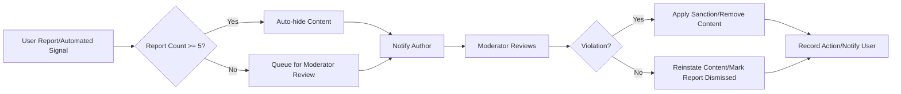
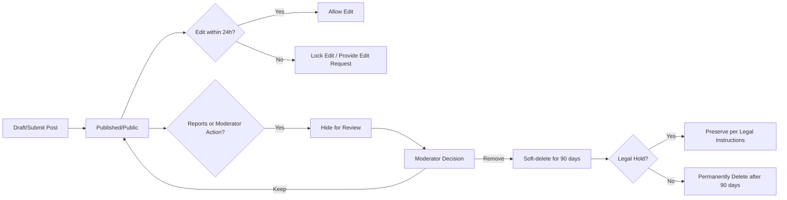

# Business Rules for discussionBoard

## Document Overview and Audience
This document enumerates the business rules that govern content, attachments, moderation, editing windows, and user behavior for the "discussionBoard" service. It contains measurable constraints and testable behavioral requirements expressed in natural language suitable for backend developers, product managers, QA, legal/compliance reviewers, and operations teams.

This document provides business requirements only. All technical implementation decisions (architecture, APIs, database design, storage, exact file scanning tools, and deployment) are at the discretion of the development team.

## Scope and Constraints
- Scope: Rules for user-generated content (articles/posts), comments, attachments (images and files), moderation and reports, user behavior handling, sanctions, and data retention/deletion.
- Out of scope: Technical specifications (API endpoints, DB schema), frontend UI details, or specific vendor choices for storage and scanning. Those are handled in other documents.

## Actors and Permission Summary
The following actors are relevant to these rules and are used throughout the document:
- guest: unauthenticated visitors who may read public content and browse categories but cannot create, comment, or attach files.
- member: registered users who may create articles, upload attachments to their own content, comment, edit within allowed windows, report content, and manage their profile/notifications.
- moderator: privileged users who review reports, hide or remove content, suspend or warn members, and escalate cases to administrators (administrators are outside the minimal scope of this service but may be referenced in escalation paths).

Permission matrix (business-level):

| Action | guest | member | moderator |
|--------|-------|--------|-----------|
| Read public posts | ✅ | ✅ | ✅ |
| Create article/post | ❌ | ✅ | ✅ |
| Edit own post within edit window | ❌ | ✅ | ✅ |
| Delete own post within delete window | ❌ | ✅ | ✅ |
| Attach files/images to own post | ❌ | ✅ | ✅ |
| Comment on posts | ❌ | ✅ | ✅ |
| Report content | ❌ | ✅ | ✅ |
| Hide/remove content | ❌ | ❌ | ✅ |
| Suspend user | ❌ | ❌ | ✅ (per policy) |
| View moderation queue | ❌ | ❌ | ✅ |

## General Business Principles (always true)
THE discussionBoard SHALL prioritize transparency, predictability, and fairness in how content is managed and moderated.
THE discussionBoard SHALL log moderation actions and report outcomes in a way that supports appeals and audits (business-level requirement; logging details are implementation decisions).

## 1. Posting and Editing Rules
This section defines the constraints and allowed behaviors around creating, updating, and deleting posts and comments.

Content format and validation
- THE discussionBoard SHALL require a post title that is at least 5 characters and at most 200 characters.
- THE discussionBoard SHALL require a post body that is at least 10 characters and at most 20,000 characters.
- THE discussionBoard SHALL allow Markdown-like content, but THE discussionBoard SHALL strip any executable code fragments or embedded scripts before rendering (business requirement; technical sanitization is implementation detail).
- THE discussionBoard SHALL limit comment length to a maximum of 500 characters.

Posting frequency and rate limits (business-level)
- WHEN a member creates posts frequently, THE discussionBoard SHALL enforce a rate limit of at most 10 posts per 24-hour period per member to discourage spam (business constraint). Implementation of enforcement (token bucket, counters) is left to developers.

Editing windows and rules
- THE discussionBoard SHALL allow members to edit their own posts within 24 hours after publication.
- WHEN a member attempts to edit a post after the 24-hour edit window has closed, THE discussionBoard SHALL deny direct edits and SHALL allow members to submit an "edit request" that is routed to moderators for review.
- THE discussionBoard SHALL record an edit history entry for each edit that includes timestamp and memberId; the edit history SHALL be accessible to moderators and to the original author (business-level requirement; storage method is implementation detail).
- WHERE a moderator determines that an edited post violates policy, THE discussionBoard SHALL allow the moderator to revert to the previous version and SHALL notify the post author with a reason.

Deletion rules
- THE discussionBoard SHALL allow members to delete their own post within 24 hours after publication; deletion within this window SHALL immediately remove the post from public view but SHALL be retained as "soft-deleted" for 90 days (see retention rules below).
- WHEN a post is soft-deleted by its author after the 24-hour window, THE discussionBoard SHALL require a moderator review before the post is removed from public view.
- IF a post has active reports or ongoing moderation actions, THEN THE discussionBoard SHALL prevent author-initiated permanent deletion until moderation completes (soft-delete may still be permitted to remove from public lists pending review).

Edge cases and special rules
- THE discussionBoard SHALL prevent impersonation: post author display name cannot exactly match a verified moderator name or another member's verified display name when it would cause confusion; disputes are escalated to moderators.
- IF a member creates duplicate posts (same title/body) within 72 hours, THEN THE discussionBoard SHALL flag those posts for moderator review and may merge or remove duplicates at the moderator's discretion.

## 2. Attachment Rules (allowed types, size limits as business constraints)
The discussionBoard supports attachments on posts and comments subject to the following measurable business constraints.

Allowed types and limits
- THE discussionBoard SHALL allow image attachments with mime types: image/jpeg, image/png, image/gif, image/webp.
- THE discussionBoard SHALL allow document attachments with mime types: application/pdf, application/msword, application/vnd.openxmlformats-officedocument.wordprocessingml.document, application/vnd.ms-excel, application/vnd.openxmlformats-officedocument.spreadsheetml.sheet, text/plain.
- THE discussionBoard SHALL limit the number of attachments per post to a maximum of 5 files and a maximum of 3 images per post.
- THE discussionBoard SHALL limit the number of attachments per comment to a maximum of 1 file.

Size constraints
- THE discussionBoard SHALL enforce a per-file maximum size for images of 5 MB (5,242,880 bytes) and for non-image documents of 20 MB (20,971,520 bytes).
- IF a user attempts to upload a file larger than the allowed limit, THEN THE discussionBoard SHALL reject the upload and present a clear user-facing message indicating the limit (see Error Handling section).

Filename and metadata rules
- THE discussionBoard SHALL require that attached filenames are stored as provided by the user but THE discussionBoard SHALL also store a sanitized display name for public listings (business requirement; specific sanitization rules left to developers).
- THE discussionBoard SHALL not allow files with executable extensions such as .exe, .bat, .sh, and SHALL reject archives that contain executables; archives are prohibited unless explicitly allowed and scanned.

Attachment verification and safety
- WHERE an attachment is uploaded, THE discussionBoard SHALL verify (business-level) that the attachment is not malware and is of the claimed file type. IF malware or dangerous content is detected, THEN THE discussionBoard SHALL quarantine and block the attachment from public view and SHALL notify the uploader and moderators.
- WHEN an attachment is quarantined for malware or policy violation, THE discussionBoard SHALL hold it for 30 days for appeals and audit before permanent deletion unless the content is confirmed malicious by tools or security team.

Image and display rules
- THE discussionBoard SHALL allow images to be displayed inline when they are below 5 MB and match supported mime types.
- THE discussionBoard SHALL provide a thumbnail or reduced-size preview for images and large document previews for supported document types (business expectation; thumbnail generation is implementation detail).

Attachment retention related to posts
- IF a post is permanently deleted, THEN THE discussionBoard SHALL mark associated attachments for deletion in accordance with the retention policy (see Content Retention section).

## 3. Moderation Policies and Escalation Paths
This section defines how reports and moderation actions are handled from a business perspective.

Report submission and initial triage
- WHEN a member reports content, THE discussionBoard SHALL accept a report that includes a reason category (spam, harassment, misinformation, illegal content, other) and optional comment.
- THE discussionBoard SHALL record the report and assign it to the moderation queue.

Thresholds, automatic actions, and prioritization
- WHERE a single moderator flags content as violating policy, THE discussionBoard SHALL surface the content in the moderation dashboard with high priority.
- IF content receives 5 unique member reports within a 48-hour rolling window, THEN THE discussionBoard SHALL automatically hide the content from public listings and mark the report for immediate moderator review.
- IF a post is hidden automatically due to user reports, THE discussionBoard SHALL notify the author that their post has been hidden pending review and SHALL provide the report reason categories (not reporter identities).

Moderator SLAs and review expectations
- THE discussionBoard SHALL require moderators to review new reports within 48 hours of report submission; priority reports (automatic hide or safety risk) SHALL be reviewed within 12 hours.
- WHEN a moderator takes action (dismiss, warn, hide, remove, suspend user), THE discussionBoard SHALL record the action, the reason, and the timestamp.

Escalation path
- WHEN a moderator determines a case requires administrative attention (criminal content, legal takedown, persistent high-risk actor), THE discussionBoard SHALL escalate the case to administrators and legal/compliance according to organizational processes.
- THE discussionBoard SHALL provide moderators with the option to apply temporary mitigations (hide content, suspend posting for the user for up to 7 days) while awaiting escalation.

Appeals and visibility
- THE discussionBoard SHALL allow members to appeal moderator removals within 14 days of the action; appeals SHALL be queued for secondary review by a different moderator or administrator depending on severity.
- THE discussionBoard SHALL provide the author with the primary reason for the action and the steps for appeal; internal notes and reporter identities SHALL remain confidential.

Moderator accountability
- THE discussionBoard SHALL track moderator actions for audit; repeated incorrect or biased moderator actions SHALL be subject to internal review and potential moderator sanction (organizational policy).

Automation and algorithmic signals (business-level)
- WHERE automated signals (spam scoring, abuse heuristics) surface content for review, THE discussionBoard SHALL surface the score and explanation in the moderation queue. Automated actions that hide content SHALL be conservative and follow the above 5-report threshold unless the content is clearly illegal or dangerous.

## 4. User Behavior Rules and Sanctions
This section defines prohibited behaviors, sanctioning rules, and strike accumulation logic.

Prohibited behaviors (examples)
- THE discussionBoard SHALL prohibit the following behaviors from members: direct threats of violence, doxxing (sharing private personal data of others), coordinated harassment, posting illegal content (illegal sex material, illicit sale of goods), and posting malware.
- THE discussionBoard SHALL treat repeated posting of demonstrably false information that causes harm as a policy violation under "misinformation" for escalation (business-level definition; evidentiary standards for misinformation are established by product governance).

Sanctions, strikes, and durations
- WHEN a member receives a policy violation that is categorized as minor (e.g., single non-malicious profanity, minor harassment), THEN THE discussionBoard SHALL issue a warning (no strike) and require the user to remove or edit the offending content within 48 hours.
- WHEN a member receives a policy violation that is categorized as moderate (e.g., repeated harassment, posting private personal data without consent), THEN THE discussionBoard SHALL issue one strike and apply a temporary posting suspension of 7 days.
- WHEN a member receives a policy violation that is categorized as severe (e.g., threats of violence, distribution of illegal material, posting malware), THEN THE discussionBoard SHALL issue two strikes and suspend the account for 30 days pending review.
- THE discussionBoard SHALL permanently ban a member when the member accumulates three strikes within a rolling 12-month period.

Strike lifecycle and decay
- THE discussionBoard SHALL expire a strike after 12 months from the date of issuance if no additional strikes occur in that period.
- WHEN a strike expires, THE discussionBoard SHALL update the user's strike count and SHALL notify the user that the strike has expired.

Sanctions transparency and notices
- WHEN a sanction is applied, THE discussionBoard SHALL notify the user with the reason category, which rule was violated, the sanction duration, and instructions for appeal.
- THE discussionBoard SHALL not disclose the identity of reporters to the sanctioned user.

Temporary mitigations and content handling
- WHEN content is judged dangerous or borderline during review, THE discussionBoard SHALL offer options: hide content, add a caution label (business-level content advisory), or remove content. The moderator SHALL document which mitigation was chosen.

## 5. Content Retention and Deletion Policies
This section defines how long content and attachments are retained and the process for deletion and archival.

Retention categories and durations
- THE discussionBoard SHALL retain active (public) content indefinitely unless removed by the author or moderators.
- WHEN content is soft-deleted (author deletion within allowed window or moderator temporary hide), THE discussionBoard SHALL retain the data as soft-deleted for 90 days before permanent deletion or archival.
- THE discussionBoard SHALL move content subject to legal hold or regulatory retention to long-term retention per legal instructions; such holds supersede other retention rules.
- THE discussionBoard SHALL retain attachments related to soft-deleted content for the same 90-day period and SHALL not expose quarantined attachments publicly.

Permanent deletion and archival
- WHEN 90 days pass after soft-deletion without successful appeal or legal hold, THEN THE discussionBoard SHALL permanently delete the content and associated attachments unless otherwise instructed by legal/compliance.
- WHERE users request account deletion, THE discussionBoard SHALL soft-delete user-generated content and SHALL provide the user with a 30-day grace period during which they can cancel the request; after 30 days, THE discussionBoard SHALL proceed with soft-deletion and follow the 90-day retention workflow.

Data portability and user requests
- THE discussionBoard SHALL allow users to request an export of their content and attachments for personal portability; THE discussionBoard SHALL fulfill export requests within 30 days (business-level SLA).

Auditability and logs
- THE discussionBoard SHALL retain moderation logs and audit trails related to actions (removals, suspensions, appeals) for 2 years for compliance and dispute resolution unless longer retention is required by law.

## 6. Error Handling and User-Facing Recovery (business-level)
This section lists common failure scenarios and expected user-facing responses and recovery paths.

Attachment upload errors
- IF an attachment upload fails due to exceeding size limits, THEN THE discussionBoard SHALL present a user-facing message: "Upload failed: file exceeds maximum allowed size of [limit]." THE message SHALL include the specific file size limit for the attempted file type.
- IF an attachment upload fails due to unsupported file type, THEN THE discussionBoard SHALL present a user-facing message: "Upload failed: file type not supported. Allowed types: [list allowed types]."
- IF an attachment upload fails due to a transient storage or network issue, THEN THE discussionBoard SHALL present a message indicating a temporary problem and SHALL allow the user to retry; THE discussionBoard SHALL advise attempting the upload again and SHALL recommend a best-effort number of retries (business expectation: allow at least 3 retry attempts before surfacing a persistence error).

Post submission failures
- IF a post submission fails due to validation (title/body length, required fields), THEN THE discussionBoard SHALL provide an itemized list of validation failures and SHALL not create the post until validation passes.
- IF a post submission fails due to an internal error, THEN THE discussionBoard SHALL preserve the draft client-side or offer an option to save a draft and retry; server-side draft persistence is an implementation choice.

Moderation process feedback
- WHEN content is hidden by automated thresholds or moderator action, THE discussionBoard SHALL notify the author with the reason category and indicate whether the action is temporary pending review or permanent.
- WHEN an appeal is submitted, THE discussionBoard SHALL acknowledge receipt immediately and provide an estimated review timeframe (e.g., within 48 hours) and escalation path.

## 7. Performance & Operational Expectations (business-level)
- THE discussionBoard SHALL provide a user experience where common content actions (create post with small attachments, view a post) complete within 3 seconds under normal operational load (business-level target; exact measurement and monitoring are implementation responsibilities).
- THE discussionBoard SHALL present progress feedback for large uploads (files > 2 MB) and SHALL not block the UI without progress indication (business expectation).

## 8. Examples and Typical Workflows
This section gives concise business-oriented workflows to illustrate how rules interact.

Example 1: Normal post creation with images
1. Member creates a post with title (80 chars) and two images (1.2 MB and 3 MB).  
2. THE discussionBoard verifies attachments meet allowed types and sizes; thumbnails are generated and the post is published.  
3. THE discussionBoard records timestamps and allows the member to edit the post for 24 hours.

Example 2: Post receives multiple reports
1. Member's post receives 5 unique reports within 48 hours.  
2. THE discussionBoard automatically hides the post and notifies the author.  
3. Moderator reviews within 12 hours, determines violation: removes content and issues one strike; user receives notification with appeal instructions.

## 9. Diagrams (Mermaid)
Moderation escalation flow:

Post lifecycle flow:

> Note: All Mermaid node labels use double quotes and graph orientation is left-to-right for readability.

## 10. Success Criteria and Acceptance Conditions
The following business-level success criteria will be used to validate an implementation against these rules:
- All content validation rules (title length, body length, comment limits) are enforced and reject invalid submissions with itemized feedback.
- Attachment upload rules enforce per-file and per-post limits and clearly communicate failures to users.
- Edit and delete windows behave as specified: edits and deletions allowed within 24 hours, edit requests routed to moderators afterward.
- Automated hiding threshold (5 unique reports within 48 hours) functions and moderator SLAs (12/48 hours) are met in operational testing.
- Sanctions follow the strike lifecycle: warnings, 7-day suspension for moderate violations, 30-day suspension for severe violations, permanent ban at 3 strikes within 12 months.
- Data retention follows the soft-delete 90-day rule and audit logs for moderation are retained for 2 years.

## 11. Related Documents
- Service Vision and Scope: [Service Overview](./01-service-overview.md)
- User roles and authentication expectations: [User Actors and Authentication](./02-user-actors.md)
- Feature list and user stories: [Functional Requirements](./03-functional-requirements.md) and [User Stories](./04-user-stories.md)
- Moderation process detail and error handling: [Moderation and Error Handling](./10-error-handling-and-exceptions.md)
- Retention and lifecycle context: [Data Lifecycle and Retention](./09-data-lifecycle.md)

## 12. Glossary of Terms
- soft-delete: content removed from public listings but retained in the system for a defined retention period pending permanent deletion or restoration.
- quarantine: attachment or content taken out of public view due to safety, policy, or malware concerns pending further review.
- strike: a recorded policy violation tied to a user that counts toward escalation to permanent ban.

## 13. Document Change Control
- Versioning: This document is the authoritative business-rules baseline for the MVP of discussionBoard. Any changes to numeric thresholds, retention periods, or sanction durations SHALL be approved by product and compliance stakeholders.

-- End of Business Rules Document --
