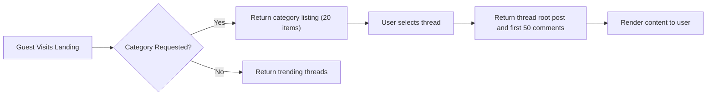
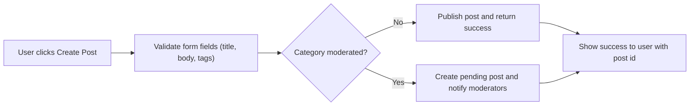
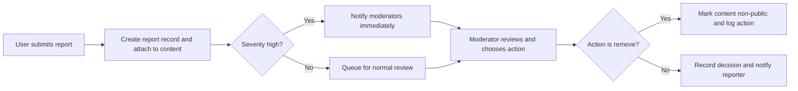

# Primary User Scenarios for econPoliticalForum

## Purpose and scope
Define core, testable happy-path user journeys and business-level success criteria for the econPoliticalForum platform. Scenarios are expressed as concrete steps, EARS-formatted requirements, measurable acceptance criteria, and QA test cases so backend engineers, QA, and product owners can implement and validate behaviors without ambiguity.

Assumptions:
- The service prefix is "econPoliticalForum".
- Roles are defined as: guest, registeredUser, moderator, administrator.
- Authentication lifecycle and content policy are specified in companion requirement documents; scenario-level rules below restate the business behaviors developers must support.

## Personas and high-level capabilities
- guest — browse public content, view public profiles. Cannot create content, vote, or bookmark.
- registeredUser — create/edit/delete own posts and comments (within edit windows), vote, bookmark, follow, report, receive notifications.
- moderator — triage reports, hide/unpublish content, issue warnings, apply temporary suspensions, approve content in moderated categories; record actions in moderation logs.
- administrator — full platform control for policy, permanent suspensions, legal responses, and audit access.

## Scenario 1 — Browse public categories and read posts (guest and registeredUser)
Happy path steps:
1. User requests category listing or homepage.
2. econPoliticalForum returns a paginated list of threads (20 items per page default) with metadata (title, author handle, timestamp, score, reply count, tags).
3. User selects a thread. econPoliticalForum returns the root post and top-level comments (first 50 comments) and renders them.

EARS requirements:
- WHEN a user requests a category page, THE system SHALL return up to 20 threads per page ordered by the selected sort (default: "newest").
- WHEN a user requests a thread, THE system SHALL return the root post and top-level comments (up to 50 items) in a single response.
- WHEN the response size exceeds allowed payload norms, THE system SHALL provide consistent paging tokens and next-page cursors.

Acceptance criteria (measurable):
- Category listing responses SHALL be delivered within 2 seconds for 95% of requests under baseline load.
- Thread view (root post + first 50 comments) SHALL render within 2 seconds for 95% of requests under baseline load.

QA test cases:
- Load a category containing 25 threads and verify the first page contains 20 items and next-page token exists.
- Open a thread with 40 comments and confirm the root post and 40 comments are returned and timestamps preserved.

Mermaid: Browse flow

## Scenario 2 — Register and verify account (Guest → registeredUser)
Happy path steps:
1. Guest submits registration data (email, display name, password, accept terms).
2. econPoliticalForum validates inputs and creates a pending account.
3. econPoliticalForum sends a verification email with a time-limited token.
4. User clicks verification link within token window; account state becomes verified and Active privileges apply.

EARS requirements:
- WHEN a new user registers, THE system SHALL validate required fields and SHALL create an account in "pending" state if email verification is enabled.
- WHEN a verification token is used, THE system SHALL mark the account as "verified" and SHALL enable posting privileges subject to category rules.
- IF a verification token is expired or invalid, THEN THE system SHALL reject verification and SHALL offer to resend the verification email.

Acceptance criteria:
- Verification email SHALL be sent within 30 seconds of successful registration submission in 95% of test runs.
- Using a valid verification token SHALL set account state to verified and allow posting in non-restricted categories immediately.

QA test cases:
- Register with valid email/password; confirm verification email is received and verification action transitions state to verified.
- Attempt to verify with expired token; verify the flow rejects and offers resend.

## Scenario 3 — Create a new post (registeredUser)
Happy path steps:
1. Verified registeredUser selects a category and composes title, body, and up to 5 tags.
2. econPoliticalForum validates title/body/tag limits and category rules.
3. If category is open, econPoliticalForum publishes the post; if moderated, the system marks the post pending and notifies moderators.
4. System returns a post id and short link to the author.

EARS requirements:
- WHEN a registeredUser creates a post, THE system SHALL validate title length (5–150 characters) and body length (10–50,000 characters) and SHALL reject submissions that violate limits with precise, localized error messages.
- WHEN a category requires moderator approval, THE system SHALL mark the post as "pending" and SHALL not display it publicly until a moderator approves.
- WHEN a post is published, THE system SHALL make it visible in category listings within 3 seconds for 95% of requests under baseline load.

Acceptance criteria:
- Valid post in open category SHALL appear in the category listing and its thread page within SLA.
- Post submitted to moderated category SHALL be visible in moderator queue and not publicly visible until approved.

QA test cases:
- Submit a valid post in open category and verify listing and thread availability within SLA.
- Submit to moderated category and verify pending status in moderator queue.

Mermaid: New post flow

## Scenario 4 — Comment and reply (registeredUser)
Happy path steps:
1. registeredUser opens a thread and submits a comment or a reply to an existing comment.
2. econPoliticalForum validates comment length and nesting depth and persists the comment.
3. System returns confirmation and notifies the thread followers and mentioned users.

EARS requirements:
- WHEN a registeredUser submits a comment, THE system SHALL accept comments of up to 5,000 characters and SHALL permit nested replies up to 3 levels deep.
- IF the parent post is hidden or pending review, THEN THE system SHALL deny new comments and SHALL inform the user that the post is not accepting comments.

Acceptance criteria:
- Comment actions SHALL be visible within 2 seconds for 95% of requests under baseline load.
- Attempting to reply beyond allowed nesting depth SHALL result in a clear rejection message.

QA test cases:
- Post a top-level comment and verify visibility and notification delivery.
- Attempt to post a reply at nesting level 4 and confirm rejection.

## Scenario 5 — Vote on posts and comments (registeredUser)
Happy path steps:
1. registeredUser clicks upvote or downvote on a post or comment.
2. econPoliticalForum records the vote and updates displayed score.
3. registeredUser may change vote within defined rules.

EARS requirements:
- WHEN a registeredUser casts a vote, THE system SHALL accept one active vote per user per content item and SHALL prevent self-voting.
- WHEN a registeredUser changes their vote, THE system SHALL allow changes and SHALL record the change for abuse analysis; vote changes within the first 24 hours SHALL be allowed without extra logging, and changes after 24 hours SHALL be recorded with timestamp differences.
- IF suspicious voting patterns are detected, THEN THE system SHALL flag the item and SHALL optionally discount flagged votes pending moderator review.

Acceptance criteria:
- Vote actions SHALL update the UI within 1 second for 99% of requests.
- Self-vote attempts SHALL be denied with a clear message.

QA test cases:
- Upvote an item and verify the count increments and author reputation updates within SLA.
- Attempt to vote on own post and verify action is prevented.

## Scenario 6 — Bookmarking and following threads (registeredUser)
Happy path steps:
1. registeredUser bookmarks a post or follows a thread.
2. econPoliticalForum stores the preference and includes the thread in the user's personalized list.
3. Notifications are delivered per user preferences when new activity occurs.

EARS requirements:
- WHEN a user bookmarks a post, THE system SHALL record the bookmark and SHALL list it in the user's bookmarked items immediately.
- WHEN a user follows a thread, THE system SHALL include new replies in the user's notification feed per their notification preferences.

Acceptance criteria:
- Bookmark and follow actions SHALL persist and reflect in the user's lists within 2 seconds for 95% of cases.

QA test cases:
- Bookmark a post, navigate to bookmarks, and confirm presence.
- Follow a thread and verify a reply generates a notification.

## Scenario 7 — Reporting content and moderation initiation (registeredUser → moderator)
Happy path steps:
1. registeredUser files a report selecting a structured reason and optional details.
2. econPoliticalForum creates an immutable report record and attaches contextual metadata.
3. System triages the report; high-severity reports go to high-priority queue and trigger moderator notification.
4. Moderator reviews and applies an action (dismiss, warn, hide, remove, suspend, escalate).
5. econPoliticalForum notifies the reporter and the content author per confidentiality rules and logs the outcome.

EARS requirements:
- WHEN a user files a report, THE system SHALL require a reason selected from the structured list and SHALL capture reporterId (if authenticated), targetId, timestamp, and optional notes up to 2,000 characters.
- IF reports for a single item exceed a configured threshold (e.g., 5 unique reports in 24 hours), THEN THE system SHALL escalate the item to high-priority moderator queue.
- WHEN a moderator applies an enforcement action, THE system SHALL create an immutable moderation log entry including moderatorId, actionType, reason code, and timestamp.

Acceptance criteria:
- High-priority reports SHALL surface to on-duty moderators within 30 minutes in 95% of observed events.
- Moderator actions SHALL be recorded and visible to administrators and appropriate reviewers immediately upon action.

QA test cases:
- File a report with reason and free-text; confirm report appears in moderator queue with correct metadata.
- Generate 6 unique reports for an item and confirm escalation to high-priority queue.

Mermaid: Reporting and moderation flow

## Notification flows and SLAs
- WHEN a user is directly mentioned, THE system SHALL generate an in-app notification within 10 seconds for 95% of cases.
- WHEN critical moderation actions affect a user's content or account, THE system SHALL deliver an email notification within 60 seconds if the user has email notifications enabled.
- WHEN a site digest is configured, THE system SHALL deliver digest notifications per user preferences (daily/weekly) and SHALL not include sensitive moderation details.

## Error handling and recovery scenarios
Edit collisions
- WHEN concurrent edits are submitted to the same post, THE system SHALL detect the collision and SHALL provide a conflict resolution response enabling the client to merge or overwrite. The backend SHALL return the current version and a merge token.

Draft preservation
- WHEN a user composes content and a submission fails due to transient error, THE system SHALL preserve client-side drafts for 7 days and SHALL accept retried submissions as updates rather than duplicates if the post draft id matches.

Rate-limits and throttling
- WHEN a new account (age < 7 days) attempts to create posts, THE system SHALL limit the user to at most 3 posts per 24-hour rolling window and SHALL present a human-readable cooldown message with remaining time.

Suspended accounts
- IF an account is suspended, THEN THE system SHALL prevent creation of new posts/comments and SHALL show a clear suspension notice with reason, duration, and appeal link.

Validation errors
- IF user input fails validation (title length, missing required fields), THEN THE system SHALL return localized, actionable messages specifying the invalid field and allowed ranges.

## Performance expectations (scenario-level SLAs)
- Read operations (category listing, thread view) SHALL be returned within 2 seconds for 95% of baseline requests.
- Write acknowledgements (create post/comment/vote) SHALL be acknowledged within 2–3 seconds for 95% of requests.
- Notification delivery for direct mentions SHALL occur within 10 seconds for 95% of normal requests.

## Acceptance checklist and QA matrix
For each scenario include pass/fail criteria developers and QA can run:
- Browse: load category and thread pages, verify pagination and timing.
- Register: verify email flow and state transition.
- Post: valid post shows up in listings or moderator queue appropriately.
- Comment: comments create, nest up to 3 levels, and appear in thread view.
- Vote: single vote per user enforced; self-vote prevented.
- Report: report record created with required fields and escalates at threshold.
- Notifications: mention triggers in-app notification within SLA.

## Test data and concrete examples
- Example post title: "Fiscal Policy and Inflation: Short-term Impacts" (length under 150 chars).
- Example tag set: ["fiscal-policy", "inflation", "2025-policy"] — each tag <= 30 chars and max 5 tags.
- Example report reason codes: "harassment", "doxxing", "misinformation", "illegal-content", "spam", "other".

## Glossary and references
- EARS: Easy Approach to Requirements Syntax (WHEN, IF, THEN, THE, SHALL)
- MAU: Monthly Active Users
- SLA: Service Level Agreement
- Moderator queue: internal prioritized list of reports requiring human review

## Appendix: Additional QA scripts (examples)
- End-to-end registration and posting: register → verify email → create post → see post in category list.
- Moderation escalation load test: simulate 100 reports on single item and validate system escalates per threshold and moderator queue throughput.

