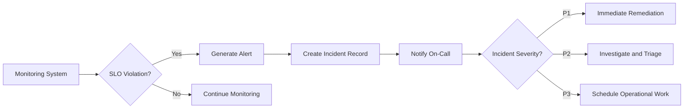
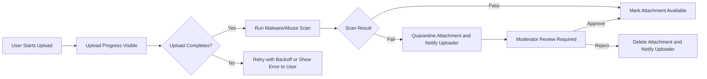

# 07-non-functional-requirements.md — Non-Functional Requirements for discussionBoard

## Executive Summary

discussionBoard is a focused discussion platform for economic and political articles and conversations. The service's non-functional goals prioritize fast, predictable read experiences, timely interactive operations (post and comment), reliable attachment handling, robust monitoring and auditability, and clear security/privacy controls suitable for small community deployments. The following sections state measurable business-level SLOs, operational expectations, security and privacy rules, and acceptance criteria in testable EARS format.

## Scope and Constraints

- Scope: Business-level non-functional requirements for public read APIs, interactive write flows (create/publish posts and comments), attachment upload and serving, search and filtering, notifications, monitoring, and operational recovery.
- Out of scope: Exact API shapes, database schema, cloud provider choices, and vendor SDK usage. Those are implementation decisions.
- Assumptions: Authentication, authorization and user actor definitions are described in the User Actors document. Integration points include file storage, email delivery, spam/abuse detection, CDN and analytics.

## Measurable Service Level Objectives (SLOs)

- THE discussionBoard SHALL deliver post listing pages (20 items per page) such that 95th percentile latency is <= 1.0 second under normal load.
- THE discussionBoard SHALL complete interactive create operations (post creation, comment submission) such that 95th percentile end-to-end latency for acknowledgement is <= 2.5 seconds under normal load.
- THE discussionBoard SHALL return search results for common queries such that 90th percentile latency is <= 500 milliseconds under normal load.
- THE discussionBoard SHALL accept and provide initial acknowledgement for image uploads (<=5 MB) within 10 seconds for 95% of attempts under normal network conditions.
- THE discussionBoard SHALL deliver transactional emails (verification/password reset) such that 95% of deliveries occur within 60 seconds.
- THE discussionBoard SHALL aim for monthly availability of 99.9% for public read APIs and member-facing features (excluding scheduled maintenance notifications).

## Load Definitions (Business Context)

- Normal load: up to 1,000 concurrent authenticated members, 10,000 unique daily visitors, write rate up to 5 posts/min and 20 comments/min.
- Peak load: up to 10,000 concurrent users, write rate up to 50 posts/min and 200 comments/min.
- WHEN DAU exceeds 50,000, THE discussionBoard SHALL trigger a formal capacity review and scaling plan within 7 calendar days.

## Availability, Maintenance and Notifications

- THE discussionBoard SHALL target 99.9% monthly uptime for read and write capabilities (excluding scheduled maintenance).
- WHEN scheduled maintenance is required, THE discussionBoard SHALL notify registered members and moderators at least 48 hours prior, including expected start time and impact.
- IF a degradation event is detected that reduces availability below SLO thresholds for more than 10 minutes, THEN THE discussionBoard SHALL display an in-app banner indicating degraded service and estimated impact.

## Security and Privacy Expectations (Business-Level)

- THE discussionBoard SHALL protect data in transit using industry-standard TLS and SHALL require that providers used for public traffic support TLS termination.
- THE discussionBoard SHALL require that sensitive data stored by third-parties (attachments, backups) is encrypted at rest; business contracts must document encryption obligations.
- WHEN personal data (email, profile info) is stored, THE discussionBoard SHALL treat it as PII and apply data minimization and access controls; access SHALL be restricted to authorized roles only.
- WHERE account authentication is required, THE discussionBoard SHALL allow optional MFA and SHALL require rate limits and lockout behavior for repeated failed authentication attempts (see Authentication document for thresholds).
- THE discussionBoard SHALL ensure that moderator and security operations are auditable: moderator actions, suspensions, and removals SHALL be logged with moderator id, timestamp, and reason.
- IF data residency requirements apply for a community, THEN THE discussionBoard SHALL support selecting storage regions or vendors meeting the residency need and SHALL document provider responsibilities in contracts.

## Scalability and Throughput (Business Triggers)

- THE discussionBoard SHALL scale horizontally; business triggers for capacity operations include:
  - WHEN sustained 95th-percentile latency for listings exceeds 1.0 second for three consecutive 10-minute windows, THEN operations SHALL scale read capacity or caching within 24 hours.
  - WHEN write latency or error rates for post creation exceed SLOs for three consecutive 10-minute windows, THEN operations SHALL scale write capacity or increase worker concurrency within 24 hours.
  - WHEN attachment queue backlog exceeds 100 pending items older than 15 minutes, THEN operations SHALL investigate and add capacity or failover storage per integration fallback rules.

## Logging, Monitoring and Auditing (Business-Level)

- THE discussionBoard SHALL log the following events at minimum: account registration, login success/failure, password reset, session revocation, post create/edit/delete, comment create/edit/delete, attachment upload/scan/quarantine, report submission, moderator actions (hide/remove/warn/suspend), legal hold placement, and export requests.
- FOR each logged event, THE discussionBoard SHALL retain: event type, acting user id (or "guest"), affected resource id (post/comment id), timestamp (ISO 8601), and a short human-readable reason for moderator actions.
- THE discussionBoard SHALL retain moderation and security logs for a minimum of 1 year. Audit trails for moderation actions SHALL be retained for 3 years.
- THE discussionBoard SHALL restrict access to audit logs to authorized roles and SHALL log access to those logs for accountability.

Monitoring and alert thresholds (business rules):
- WHEN error rate for critical endpoints (create post, upload attachment, auth) exceeds 1% over a 5-minute window, THEN generate an automated P2 alert.
- WHEN error rate for critical endpoints exceeds 5% over a 5-minute window OR availability drops below 95% for 10 minutes, THEN generate a P1 alert and notify on-call immediately.
- WHEN attachment upload queue depth > 100 pending items OR oldest pending > 30 minutes, THEN generate a storage-failure alert (P2) and notify operations.

## Operational Recovery and Business Continuity (RTO / RPO)

- THE discussionBoard SHALL define the following business recovery targets: RTO (read access restoration) = 4 hours for regional outages; RPO (data loss tolerance) = 1 hour for accepted writes.
- WHEN external integrations (file storage, email, spam detection) are degraded, THE discussionBoard SHALL maintain read-only access to existing public content and SHALL queue non-critical writes for retry.
- IF an outage affecting write capability persists beyond the RTO, THEN product SHALL publish a status update to users within 60 minutes describing impact and estimated restoration.

## External Integrations and Failure Modes (Business-Level)

- WHEN uploading attachments, THE discussionBoard SHALL integrate with file storage and CDN. Business-level fallback: if primary storage is unavailable, THE discussionBoard SHALL attempt write to a configured secondary or queue uploads for up to 24 hours and inform the user of pending persistence.
- WHEN the email provider fails, THE discussionBoard SHALL retry transactional emails with exponential backoff for up to 24 hours and SHALL failover to alternate provider when high delivery failure rates are detected (failure threshold: >5% failure rate for 10 minutes).
- WHEN the spam/abuse detection service is unavailable, THEN THE discussionBoard SHALL default to conservative publication rules by routing new content to moderator review rather than auto-publishing.
- THE discussionBoard SHALL log and retain integration health metrics and SHALL send integrations alerts when provider latency/failed-request thresholds are exceeded (see Monitoring thresholds above).

## Error Handling and Retry Policies (Business-Level)

- THE discussionBoard SHALL use exponential backoff for transient failures on external calls. Business default: retry delays of 500ms, 1s, 2s, 4s, 8s, up to 5 attempts unless a vendor-specific policy requires otherwise.
- WHEN uploads fail due to transient network/storage issues, THE discussionBoard SHALL perform up to 3 automatic resumable retries client-side and shall queue server-side retries for up to 24 hours if resumable upload is not possible.
- WHEN a multi-step operation (attachments + publish) fails at any step, THEN THE discussionBoard SHALL avoid exposing partially-published content; the operation SHALL either complete fully or the system SHALL roll back to pre-action state from the user's viewpoint.

## Accessibility and User Experience During Degradation

- WHEN upload or publish operations are delayed, THE discussionBoard SHALL show clear progress indicators and statuses: "uploading", "pending remote storage", "published" or "failed".  
- IF a publish operation is pending due to integration retries, THEN the author SHALL receive an in-app notification and email (if available) once the operation completes or fails permanently.
- THE discussionBoard SHALL provide an option to save drafts locally and/or server-side so users do not lose content during transient failures.

## Acceptance Criteria and Testable SLOs

Performance and availability tests:
- GIVEN normal load conditions, WHEN synthetic tests run for 24 hours, THEN 95% of listing requests return within 1.0 second and 95% of post creation acknowledgements return within 2.5 seconds.
- GIVEN a spam-detection outage, WHEN 100 new posts are submitted, THEN all posts SHALL be routed to moderator queue and no more than 2% of posts shall be auto-published incorrectly.
- GIVEN primary storage outage with secondary available, WHEN 20 concurrent uploads occur, THEN >=95% of uploads SHALL succeed via failover within 2 minutes of initial attempt.

Operational and monitoring tests:
- WHEN error rate surpasses 1% over a 5-minute window, THEN an automated P2 alert SHALL be raised and ticket created.
- WHEN an attachment queue backlog reaches defined threshold (100 items older than 15 minutes), THEN an alert SHALL be raised and operations SHALL be able to inspect pending items via dashboard.

Security and privacy tests:
- WHEN a moderator action is taken, THEN the audit entry SHALL contain moderator id, timestamp, action, and human-readable reason, and the entry SHALL be retrievable by authorized personnel within 5 minutes.
- GIVEN a request for data export for an account <10,000 items, WHEN export requested, THEN export SHALL be available within 72 hours in 95% of attempts.

## Mermaid Diagrams (valid syntax with double-quoted labels)

### Monitoring and Incident Flow

### Attachment Upload and Quarantine Flow

## Glossary
- SLO: Service Level Objective — measurable target for performance or availability.
- RTO: Recovery Time Objective — target time to restore service capability after outage.
- RPO: Recovery Point Objective — acceptable window of data loss during disaster recovery.
- P1/P2/P3: Priority levels for incidents with defined alerting and escalation timelines.

## Appendix: Example Alerts and QA Scenarios

- Alert Example 1: "Attachment failures > 1% over 5 minutes" — create P2 alert, include sample failed upload ids.
- Alert Example 2: "Create post errors > 5%" — create P1 incident, notify product owner and on-call.
- QA Scenario 1: Simulate storage provider latency; verify failover and queued retry behaviors and final success rate >=95% for failover attempts.
- QA Scenario 2: Simulate spam-detection downtime; verify routing to moderator queue and that no more than 2% of posts slip through as published.

## Acceptance and Handoff

- THE discussionBoard non-functional requirements in this file SHALL be used by backend and operations teams to implement monitoring, capacity planning, integration contracts, and acceptance tests.
- Product and compliance SHALL review any deviation from numeric SLOs or retention durations prior to changes that affect user-facing behavior.

