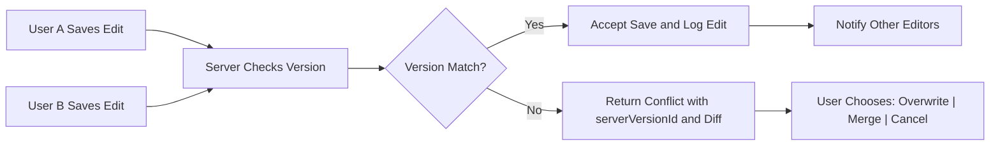
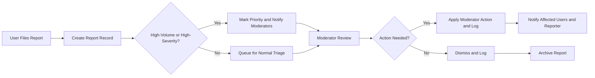

# Secondary and Edge Case Requirements for econPoliticalForum

## 1. Scope and Purpose

This file defines the business-level requirements for secondary flows, error cases, and edge conditions that the econPoliticalForum platform must support. The behaviors specified are intended for backend developers, QA engineers, operations teams, moderation leads, and product owners so they can implement, test, and operate systems that handle unusual but realistic scenarios safely and predictably.

## 2. Relationship to other documents

- Functional Requirements (04-functional-requirements.md): Core CRUD and normal operations are specified there; this file extends those rules to exceptional cases.
- User Roles & Authentication (05-user-roles-authentication.md): Role definitions and account lifecycle rules are authoritative; references in this file assume those role names and lifecycle events.
- Moderation & Content Policy (08-moderation-content-policy.md): Policy thresholds and prohibited-content categories are authoritative and inform escalation rules.
- Non-Functional Requirements (09-non-functional-requirements.md): Performance SLAs referenced here are business-level targets.

## 3. Assumptions and definitions

- Role names: guest, registeredUser, moderator, administrator.
- "Soft-delete": content hidden from public views but retained for audit and recovery purposes.
- "Moderation hold" or "legal hold": temporary override that prevents deletion or permanent purging of content subject to review or legal requirement.
- "High-severity report": reports that claim imminent harm, doxxing, illegal activity, or credible threats.
- Time references use ISO 8601 UTC format in examples.

## 4. Rate limits and throttling behaviors (business rules)

WHEN a guest attempts to create a post, THE system SHALL deny the action and SHALL return a localized message explaining registration is required within 1 second.

WHEN a registeredUser with account age < 7 days attempts to create more than 3 top-level posts in any rolling 24-hour period, THE system SHALL throttle new post creation for that account and SHALL prevent further posts for 24 hours from the time of the last allowed submission. The user-facing message SHALL include the earliest allowed retry time in ISO 8601 UTC.

WHEN a registeredUser attempts to create more than 60 comments across the platform in any rolling 60-minute window, THE system SHALL throttle comment creation for that account for 1 hour and SHALL display a message showing the cooldown expiration time.

WHEN a registeredUser performs more than 200 vote actions in any rolling 24-hour window, THE system SHALL suspend voting for that account for 24 hours and SHALL flag the account for moderator review.

WHEN a moderator performs more than 100 moderation actions in a rolling 60-minute window, THE system SHALL flag the moderator's activity for audit review but SHALL NOT automatically block the moderator's ability to act; the activity SHALL be reviewed by an administrator if it exceeds 200 actions in a rolling 60-minute window.

IF a user triggers throttles 5 times within 30 days, THEN THE system SHALL automatically escalate to an account review and SHALL apply a temporary 7-day posting suspension pending manual review.

User-facing throttle message example:

- "You have reached your posting limit. You may post again at 2025-10-04T12:00:00Z. See community guidelines or contact support if you believe this is an error."

Acceptance criteria for throttling:
- Throttle enforcement occurs within 1 second of a violating request.
- Message provides the precise ISO 8601 UTC retry timestamp and a link to guidance.
- Throttle events are logged with userId, eventType, threshold, timestamp, and expiration in the moderation audit log.

## 5. Edit and deletion edge cases

WHEN a registeredUser edits their own post within 15 minutes of publication, THE system SHALL apply the edit without adding an "edited" marker for public viewers; THE system SHALL record an internal audit entry with the edit timestamp and a short summary.

IF a registeredUser edits a post after 15 minutes from publication, THEN THE system SHALL mark the post as "edited" in public views, SHALL append an edit timestamp, and SHALL record the original content in an immutable audit trail retained for 90 days (or longer if legal hold applies).

WHEN a registeredUser deletes their own post within 24 hours of publication, THE system SHALL soft-delete the post (it shall be invisible to regular users) and SHALL preserve the post content and metadata for 90 days to support appeals and moderation review.

IF a post with child comments is soft-deleted by its author, THEN THE system SHALL preserve child comments and SHALL mark the top-level post as deleted in public UI with a placeholder that states "Post removed by author; comments preserved for context". Moderators SHALL be able to view the original post in moderation UI.

WHEN an author requests permanent deletion of their content and the content is under active moderation or legal hold, THE system SHALL deny permanent deletion and SHALL present the author with an explanation including the legal hold reference and retention timeframe.

WHEN content is permanently purged (outside any legal hold), THE system SHALL remove personally identifying data for the author and SHALL anonymize public content while preserving the non-PII content for community continuity unless law requires full removal.

Edit collision handling:
- WHEN two users (or two sessions owned by the same user) attempt to save conflicting edits concurrently, THEN THE system SHALL detect a conflict at save time and SHALL return a structured conflict response within 2 seconds that includes: the current server version id, a summary diff, and options for the editor to "Overwrite", "Merge", or "Cancel". The UI SHALL offer a merge UI when feasible; the backend SHALL provide the raw diffs and version identifiers.

Acceptance criteria for edits and deletions:
- Edits within 15 minutes do not show public edit markers; edits after 15 minutes do and are recorded.
- Soft-deleted posts with comments present a consistent public placeholder and preserve comment context.
- Conflicts return structured metadata and are logged for audit with both attempt timestamps and actor ids.

## 6. Concurrency, idempotency, and conflict resolution

WHEN a user issues a vote action and network or client retries cause duplicate requests, THE system SHALL ensure idempotent final state: the user's vote on the item SHALL be recorded once, and duplicate requests SHALL not increment score beyond a single vote. The system SHALL return the canonical vote state and timestamp.

WHEN two moderators take conflicting moderation actions on the same content at nearly the same time (e.g., one hides, one approves), THEN THE system SHALL record both actions with timestamps and SHALL surface to administrators the chronological order; THE most recent action SHALL represent the current visible state to ordinary users while the full action history SHALL be visible to administrators in audit logs.

WHEN concurrent user edits are saved, THEN THE system SHALL preserve all conflicting versions in the audit trail and SHALL ensure the final merged content is traceable to contributing versions.

Idempotency patterns and expectations:
- API operations that modify state (create post, vote, report) SHALL accept a client-supplied idempotency key when available and SHALL use it to deduplicate repeated requests for a configurable window (e.g., 10 minutes) while returning the original operation result when duplicates are detected.

Acceptance criteria for concurrency controls:
- Duplicate vote retries do not corrupt score totals. QA should simulate duplicate requests and verify single-vote effect.
- Conflicting moderator actions appear in chronological order and the current state matches the last action by timestamp.
- Idempotency keys produce deterministic operations for retried requests.

## 7. Anonymous and pseudonymous posting rules

WHEN a category explicitly permits anonymous posting, THE system SHALL allow a verified registeredUser to post anonymously for that single post; public viewers SHALL see "Anonymous" while moderators and administrators SHALL be able to view the linked author identity in the moderation UI.

WHEN a user elects anonymous posting for a post, THE system SHALL prevent reversal of anonymity for that post by the author.

IF a user without an account attempts to post anonymously, THEN THE system SHALL deny the attempt and SHALL require account creation and verification before allowing anonymous posting.

WHEN anonymous posting is enabled, THE system SHALL limit anonymous posts to a maximum of 2 per account per rolling 24-hour period.

IF a user abuses anonymous posting (three moderator-confirmed violations within 180 days), THEN THE system SHALL revoke the user's anonymous-posting privilege for 180 days and SHALL log the revocation reason in the user's moderation record.

Sample moderator view for anonymous posts (business fields):
- internalAuthorId: UUID
- publicAuthorLabel: "Anonymous"
- createdAt: ISO timestamp
- category: string
- moderationHistory: array of moderation actions

Acceptance criteria for anonymous posting:
- Public views show "Anonymous" and do not leak author data.
- Moderation UI provides sufficient traceability for legal requests.
- Rate limits and revocation rules enforceable and logged.

## 8. Account suspension, appeal, and reinstatement scenarios

WHEN a user receives three moderator-confirmed policy violations within a rolling 90-day period, THEN THE system SHALL automatically apply a temporary suspension of 7 days and SHALL notify the user with suspension reason, duration, and instructions to appeal.

IF a user's automated abuse score exceeds configured threshold (combining rate-limit breaches, mass reports, and vote anomalies), THEN THE system SHALL apply a temporary suspension (24–72 hours depending on severity) and SHALL create an administrative review case.

WHEN an administrator applies a manual suspension, THEN THE system SHALL record the administrator id, reason code, suspension start and planned end timestamps, and SHALL send a notification to the suspended user via verified email and in-app message.

WHEN a suspended user files an appeal, THEN THE system SHALL create an appeal case, associate evidence (reports, moderator notes), and SHALL present the case to an independent reviewer (administrator or appeals moderator) who did not participate in the original action.

THE independent reviewer SHALL respond with an initial acknowledgement within 48 hours and SHALL provide final determination within 7 calendar days for standard appeals and within 72 hours for high-priority appeals.

IF an appeal is successful, THEN THE system SHALL reinstate the account immediately, SHALL publish a short reinstatement audit entry (visible to administrators), and SHALL notify the user. The action SHALL remove associated temporary restrictions but SHALL maintain a record of the original action and appeal outcome for 365 days.

Acceptance criteria for suspension and appeals:
- Automatic suspensions for three verified violations are applied within 1 minute of the verification action.
- Appeals receive acknowledgement within SLA and final decision within 7 days for standard appeals.
- Reinstatements are logged with id and timestamp and notifications are sent to the user.

## 9. Reporting, moderation escalation, and malicious-report handling

WHEN a registeredUser files a report, THE system SHALL create an immutable report record containing reporterId (or anonymous flag), targetContentId, reportCategory, reporterMessage (max 2000 chars), timestamp, and reporterLocale. The record SHALL be visible to moderators and administrators.

WHEN an item receives at least 5 independent reports for the same reason within 24 hours, THEN THE system SHALL mark the item as "high-volume" and SHALL prioritize it in moderator queues (escalation priority). Moderators SHALL see a priority flag and an aggregated report summary.

IF a user is found to have submitted 5 or more intentionally false or malicious reports within a rolling 90-day window (as validated by moderators), THEN THE system SHALL temporarily disable that user's ability to file reports for 180 days and SHALL log the action with the moderator id and rationale.

WHEN multiple coordinated reports target the same user or content (evidence of brigading: e.g., 200+ distinct reports from newly created accounts within 1 hour), THEN THE system SHALL quarantine the reported items from auto-removal and SHALL escalate to administrators for network analysis and potential coordinated-account actions.

Moderator actions and required logging:
- Each moderator action SHALL include: moderatorId, actionType, reasonCode, freeTextJustification (max 1000 chars), timestamp, linkedReportIds, and evidence references. These fields SHALL be immutable once recorded.

Acceptance criteria for reporting and escalation:
- High-volume items appear in prioritized queues within 10 minutes of threshold detection.
- Malicious reporting sanctions are recorded and enforced; the reporter is notified when their reporting privileges are revoked.
- Coordinated-activity cases are flagged to administrators within 30 minutes of detection for cases meeting automation thresholds.

## 10. Error responses, retry semantics, and draft preservation

WHEN a content submission fails due to validation errors, THEN THE system SHALL return an HTTP 4xx-style structured error with specific failure codes, human-readable message, and field-level details; the client SHALL display the errors and preserve the user's draft locally for at least 7 days.

WHEN a transient server error occurs (e.g., temporary database outage), THEN THE system SHALL return an HTTP 5xx-style structured error including a correlation id and a suggested retry-after header; the client SHALL allow the user to retry safely and SHALL not duplicate content if an idempotency key is provided.

WHEN a network interruption prevents a save, THEN THE system SHALL accept a retried save if the client submits the original idempotency key within 10 minutes and SHALL treat it as an update rather than a duplicate new post.

WHEN an action is blocked due to moderation hold, THEN THE system SHALL return a specific hold code and a human-readable explanation that includes an approximate resolution window (e.g., "under review; typical resolution: 4–72 hours").

Draft preservation requirements:
- Client-side drafts SHALL persist for at least 7 days. Server-side autosave drafts (if implemented) SHALL persist for at least 30 days and SHALL be accessible to the author only.

Acceptance criteria for error handling and retries:
- Validation errors return field-level messages suitable for display.
- Idempotent retries do not create duplicate posts; QA should test retry within 10-minute window with same idempotency key.
- Moderation-hold messages include codes and expected resolution windows.

## 11. Performance SLAs for exceptional flows

WHEN a high-severity report is submitted, THEN THE system SHALL surface it to an on-duty moderator within 5 minutes in 95% of cases under normal load.

WHEN an automatic detection flags coordinated activity, THEN THE system SHALL generate an administrative alert and provide an investigative bundle (reports, account metadata, vote activity graph) within 30 minutes.

WHEN edit collisions are detected, THEN THE system SHALL return conflict metadata within 2 seconds for 95% of cases.

WHEN idempotency keys are used for retried writes, THEN THE system SHALL deduplicate repeated requests and return the canonical result within 2 seconds in 95% of cases.

## 12. Data retention, evidence preservation, and legal holds

WHEN content is subject to a legal hold or law-enforcement request, THEN THE system SHALL mark the content as "legal_hold" and SHALL prevent any deletion or permanent anonymization for the duration of the hold.

THE system SHALL preserve moderation evidence (reported content snapshot, full metadata, moderation actions, reports, and appeal transcripts) for a minimum of 365 days following final resolution or longer if a legal hold applies.

WHEN a lawful disclosure is made to an external authority, THEN THE system SHALL record a disclosure event with: requestId, requestingAuthority, requestTimestamp, disclosedRecords (list of item ids), disclosureRationale, and internalApproverId.

Acceptance criteria:
- Legal holds prevent deletions and are visible in admin UIs.
- Evidence retention meets minimum 365-day requirement and is retrievable by administrator queries.

## 13. Logging, audit, and transparency requirements

EVERY moderation action SHALL generate an immutable audit entry containing: actionId (UUID), moderatorId, actionType, reasonCode, freeTextJustification, targetContentId, linkedReportIds, timestamp (ISO 8601), and caseId for grouping related actions.

THE system SHALL provide administrators with a searchable moderation audit view that can filter by date range, moderatorId, actionType, targetContentId, and caseId for at least 365 days.

WHEN a user requests an export of their moderation history or appeals, THEN THE system SHALL provide a downloadable summary that excludes third-party personal data and sensitive reporter identities unless disclosure is mandated by law.

Transparency reporting:
- THE system SHALL produce a quarterly transparency summary including aggregate counts of reports, actions, escalations, and appeals. This report SHALL avoid revealing personally identifying information.

## 14. Acceptance criteria and QA test cases

Test case examples (concrete):
1. Rate-limit enforcement test: Create 4 posts in under 24 hours with a new account; verify 4th is rejected and message includes ISO timestamp for retry.
2. Edit-window test: Create post, edit within 10 minutes, verify no public edit marker; edit after 20 minutes, verify "edited" marker and audit history entry exists.
3. Collision test: Open same post in two sessions; save session A, then save session B with conflicting edits; verify conflict response includes serverVersionId and diff metadata.
4. Duplicate vote retry test: Simulate two identical vote requests for same user/item; verify score increments by 1 only and final vote state returned.
5. Anonymous post traceability test: Post anonymously in allowed category; verify public label is "Anonymous", moderation UI shows internalAuthorId, and anonymous-post rate limit enforced.
6. Suspension and appeal test: Generate three moderator-confirmed violations for a user, verify automatic 7-day suspension, submit appeal, and verify appeal acknowledgement within 48 hours and final decision within 7 days.
7. Malicious reporting test: Create 6 clearly false reports from same reporter; verify reporting privileges revoked after moderator validation and notification sent to reporter.
8. Legal hold test: Place content under legal hold and attempt deletion; verify deletion is denied and hold metadata visible to admins.

Each test SHALL include: preconditions, steps, expected results, and required audit log entries to validate.

## 15. Mermaid diagrams — corrected syntax

### Edit collision flow

### Reporting and escalation flow

## 16. Appendix — example audit entries and sample messages

Example moderation audit entry (JSON-like business view):

- actionId: "f47ac10b-58cc-4372-a567-0e02b2c3d479"
- moderatorId: "mod-83a2"
- actionType: "remove"
- reasonCode: "doxxing"
- freeTextJustification: "Published private contact details without consent"
- targetContentId: "post-2025-00012"
- linkedReportIds: ["report-123","report-124"]
- timestamp: "2025-10-03T15:00:00Z"
- caseId: "case-789"

Sample user-facing throttle message:
- "You have reached your posting limit. You may post again at 2025-10-04T12:00:00Z. If you need assistance, contact support@econpoliticalforum.example.com."

Sample moderation-hold response for API clients:
- status: 423
- code: "moderation_hold"
- message: "This post is under moderator review and cannot be modified. Expected review window: 4–72 hours. Case ID: case-789"

## 17. Final acceptance checklist

- [ ] All EARS-formatted requirements are present and testable
- [ ] Mermaid diagrams use double quotes and valid arrow syntax
- [ ] Acceptance tests cover rate limits, edits, collisions, anonymous posting, suspensions, malicious reporting, and legal hold
- [ ] Audit and legal hold requirements are explicit and measurable
- [ ] Document length and completeness meet enhancement criteria

