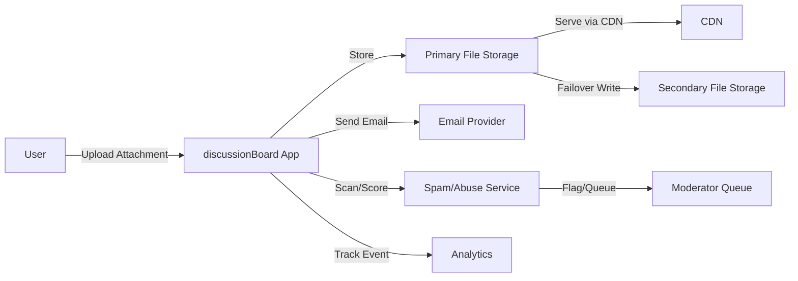
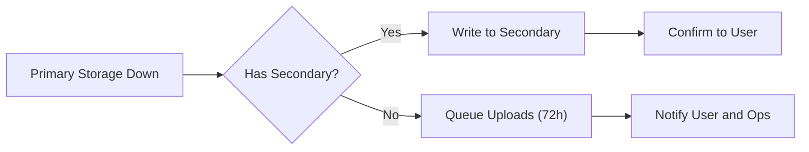

# External Integrations — discussionBoard

## Purpose

Provide clear, business-level requirements for third-party integrations used by discussionBoard. Integrations covered include file storage and CDN, email delivery, spam and abuse detection, analytics, and optional services (virus scanning, image processing). These requirements specify WHAT the integrations must support from a business perspective, measurable SLAs, fallback behaviors, privacy obligations, and acceptance tests for go-live.

## Scope and Audience

Intended audience: backend engineers, operations, product managers, procurement, and security/compliance teams.  
Scope: business-level expectations for integration behavior, failure handling, privacy, monitoring, and acceptance criteria. This document does not prescribe API contracts, database schemas, or implementation libraries.

## Integration Categories and Business Rationale

- File Storage & CDN — store and serve user attachments reliably and efficiently.  
- Email Delivery — deliver transactional emails (verification, password reset, notifications).  
- Spam and Abuse Detection — score and flag content to reduce moderation load.  
- Analytics & Telemetry — capture aggregate usage metrics to inform product decisions while respecting privacy.  
- Optional: Virus/Malware Scanning, Image Processing (thumbnailing), OCR for searchable attachments.

Rationale: Managed providers reduce time-to-market, reduce operational burden, and offer scalable infrastructure for attachments, messaging, and content safety.

## Business Requirements (EARS) — Overview

THE discussionBoard SHALL integrate with managed providers for critical external functions to meet availability, reliability, and privacy expectations.  
WHEN an integration is used, THE discussionBoard SHALL record integration health and operational metrics for monitoring and incident response.

Each integration category below contains EARS-formatted requirements and measurable acceptance criteria.

---

## File Storage & CDN (Business Requirements)

THE discussionBoard SHALL use an external file storage provider and CDN to persist and serve attachments for durability and global access.

- THE discussionBoard SHALL allow attachments of the following mime types: image/jpeg, image/png, image/gif, image/webp, application/pdf, text/plain, application/vnd.openxmlformats-officedocument.wordprocessingml.document (DOCX).

- THE discussionBoard SHALL limit per-file sizes to 10 MB for images and 25 MB for other allowed file types.  
  - Rationale: business-level limit to control costs and UX.

- THE discussionBoard SHALL allow up to 5 attachments per post and up to 1 attachment per comment as a business constraint.

- WHEN a user uploads an attachment, THE discussionBoard SHALL achieve end-to-end successful upload confirmation (client -> storage) within 30 seconds for files <=10 MB in 95% of cases under normal network conditions.

- THE discussionBoard SHALL serve attachments via a CDN for reads with 95th percentile read latency <= 500ms for files <=1 MB when measured under "normal load" (see Non-Functional Requirements document for load definition).

- IF the primary storage provider returns transient errors during writes, THEN THE discussionBoard SHALL retry writes with exponential backoff (initial delay 1s, multiplier 2x, max attempts 5) and SHALL queue uploads for up to 72 hours when provider outage persists.

- IF retries and queued writes fail after 72 hours, THEN THE discussionBoard SHALL notify affected authors and SHALL provide a remediation path (retry, remove attachments, or request support assistance).

- THE discussionBoard SHALL maintain at least one high-availability copy in the configured provider and SHALL support configuration to mirror to a secondary provider for failover when required by business continuity needs.

Acceptance criteria (File Storage):
- Upload test (image, 3 MB): 95% success within 30 seconds in normal test conditions.  
- CDN read test (1 MB): 95th percentile latency <= 500ms.
- Failover behavior: queued uploads automatically committed within 24 hours of provider recovery in 95% of cases.

---

## Email Delivery (Business Requirements)

THE discussionBoard SHALL ensure reliable transactional email delivery for account verification, password reset, and safety notifications.

- WHEN the system sends a verification or password reset email, THE discussionBoard SHALL expect delivery within 60 seconds for 95% of attempts under normal provider performance.

- IF the primary email provider experiences delivery failure rates above 5% over a rolling 10-minute window, THEN THE discussionBoard SHALL failover to a configured secondary email provider for transactional emails.

- WHEN an email send fails with a transient error, THE discussionBoard SHALL perform up to 3 retries with exponential backoff (1m, 2m, 4m). For permanent failures (bounced or suppressed), THEN THE discussionBoard SHALL mark the address as undeliverable and notify the account owner with remediation guidance.

- THE discussionBoard SHALL avoid embedding PII unnecessarily in email bodies and SHALL avoid attaching user attachments directly to emails.

Acceptance criteria (Email):
- 95% of verification emails delivered within 60 seconds to major mailbox providers in test runs.  
- Failover to secondary provider triggers within 60 seconds of degraded SLI detection and reduces failed sends to below 1% in controlled failover tests.

---

## Spam and Abuse Detection (Business Requirements)

THE discussionBoard SHALL integrate with automated spam and abuse detection services to score new posts, comments, and attachments.

- WHEN a content item receives a high-confidence abuse score (configurable threshold), THE discussionBoard SHALL hide the item from public listings and route it to the moderator queue for expedited review.

- WHEN a content item receives a medium-confidence score, THE discussionBoard SHALL surface the item but attach flags and metadata for moderator prioritization.

- IF the spam detection provider is unavailable, THEN THE discussionBoard SHALL apply conservative local heuristics (size/type checks, rate-limiting, basic pattern checks) and SHALL route new content to moderator review rather than auto-publish.

- THE discussionBoard SHALL log spam scores and decision metadata for at least 180 days to enable appeals and auditing.

Acceptance criteria (Spam/Abuse):
- In a labeled test data set, high-confidence spam classification precision >= 85% and false-positive rate for known-good content <= 5%.
- Provider unavailability test: system reroutes content to moderator queue with no public exposure within 2 minutes of detection.

---

## Analytics & Telemetry (Business Requirements)

THE discussionBoard SHALL capture aggregated analytics sufficient to compute daily active users (DAU), posts per day, comments per day, attachment upload counts, and moderation throughput while respecting privacy preferences.

- WHERE a user opts out of analytics tracking, THE discussionBoard SHALL not send identifiable user-level telemetry to external analytics providers; only aggregate or anonymized metrics SHALL be sent.

- WHEN analytics provider is unavailable, THE discussionBoard SHALL buffer events and forward them within 24 hours on provider recovery. Buffered events older than 7 days SHALL be dropped unless the product team approves retention for a specific analysis need.

- THE discussionBoard SHALL retain raw analytics events for 90 days and aggregated summaries for 2 years for business reporting.

Acceptance criteria (Analytics):
- Buffered event replay: 95% of buffered events forwarded within 24 hours after provider restore in test scenarios.
- Privacy test: opt-out results in zero identifiable telemetry leaving the system in 100% of opt-out cases.

---

## Optional Integrations (Virus Scanning, Image Processing, OCR)

- WHEN virus scanning is enabled, THE discussionBoard SHALL scan attachments on upload and SHALL quarantine or reject files that fail scanning. Quarantined items SHALL be retained for 30 days for review.

- WHEN image processing (thumbnail generation) is enabled, THE discussionBoard SHALL generate thumbnails such that either a thumbnail or a placeholder is visible to the user within 10 seconds for images <=5 MB under normal load.

- WHEN OCR is enabled for text extraction, THE discussionBoard SHALL process uploads asynchronously and SHALL attach extracted text to the content metadata within 24 hours in 95% of cases.

Acceptance criteria (Optional):
- Virus scan: known-malicious test file is quarantined in 100% of tests.  
- Thumbnail generation: thumbnail visible within 10 seconds for 95% of images <=5 MB.

---

## Failure and Fallback Expectations (Consolidated)

- IF a primary integration becomes unavailable, THEN THE discussionBoard SHALL switch to the documented fallback behavior for that integration category within a short detection window as specified per integration.  
- WHEN queuing is used as a fallback (uploads, analytics), THE discussionBoard SHALL surface to users that operations are pending and SHALL provide a clear expected retry window (e.g., "Attachments will be retried for up to 72 hours; watch your drafts").
- THE discussionBoard SHALL notify operations when queued items exceed a configurable threshold (default: queue depth > 50) or when oldest queued item age exceeds thresholds (default: 6 hours for uploads, 24 hours for analytics).

Retry/backoff defaults (business policy): initial delay 1s, multiplier 2x, max attempts 5 for storage writes; for email transactional retry initial 1m with 3 retries; for analytics forwarding initial 10s with 6 retries.

---

## Privacy, Data Protection, and Compliance

- THE discussionBoard SHALL not transmit unnecessary PII to analytics providers and SHALL require explicit user consent for any analytics that include user-level identifiers.

- THE discussionBoard SHALL contractually require providers to support deletion of user data within 30 days of verified user deletion requests, unless legal hold applies.

- WHEN a user requests account deletion, THE discussionBoard SHALL ensure provider-side deletion workflows are initiated within 48 hours and SHALL track completion; disputes or delays SHALL be reported to compliance within 72 hours.

- THE discussionBoard SHALL require that providers support data processing agreements (DPA) and include clauses for data residency, incident notification (72-hour maximum), and audit rights.

- WHERE regional data residency is required by law for specific user populations, THE discussionBoard SHALL choose providers or region settings to comply with those requirements and SHALL document the residency choices in procurement records.

Acceptance criteria (Privacy):
- Export & deletion test: provider reports completion of deletion workflow for sample user within 30 days in 95% of tests.
- Incident notification test: provider issues simulated incident notice within 72 hours in 100% of tests conducted during procurement.

---

## Operational SLAs, Monitoring and Alerts

- THE discussionBoard SHALL monitor provider health with periodic probes (business expectation) and SHALL trigger an alert when provider error rate exceeds 1% over a rolling 5-minute window for critical operations (uploads, transactional emails).

- WHEN an alert is triggered for degraded integration health exceeding configured thresholds, THEN THE discussionBoard SHALL notify on-call operations within 5 minutes for P1 issues and shall create an incident ticket with attached diagnostic metadata.

- Recovery targets: RTO for provider failover actions SHALL be 60 minutes for critical transactional services (email) and 4 hours for bulk ingestion failover (analytics). RPO for queued uploads SHALL be 1 hour business target.

Acceptance criteria (Monitoring):
- Simulated provider degradation triggers alerts and failover flows within the detection windows in 95% of test runs.

---

## Selection Criteria, Procurement and Contract Requirements

Providers should meet the following business criteria:
- Published SLA of >=99.9% for critical services or contractual RTO guarantees.  
- Support for encryption in transit and at rest, and DPA contract for data processing.  
- Ability to support geo-replication or region-specific storage when required by law.  
- Clear deletion and export mechanisms that can be audited.  
- Reasonable cost model aligned with expected usage for MVP and predictable scaling.

Contract clauses to request during procurement:
- Data processing agreement with 72-hour incident notification.  
- Export and deletion guarantees with measurable completion windows.  
- Right to audit or receive third-party audit reports.  
- Terms for failover support and documented health-check endpoints.

---

## Cost Control and Budgeting (Business Guidance)

- THE discussionBoard SHALL maintain monthly budget alerts for integration spend and SHALL notify product and ops when monthly spend exceeds forecast by 20%.

- WHEN high-volume usage patterns are detected, THE discussionBoard SHALL evaluate tiered pricing or negotiate committed usage discounts to control costs.

---

## Security and Contractual Requirements

- THE discussionBoard SHALL require providers to support TLS for all transport and a contractual requirement for encryption at rest for stored data.

- THE discussionBoard SHALL require role-based access controls and audit logging for provider consoles and API usages. Access to production provider consoles SHALL be restricted and logged.

- THE discussionBoard SHALL require breach notification timelines (max 72 hours) and SHALL document escalation paths in procurement records.

---

## Acceptance Tests and Go-Live Criteria

File storage & CDN
- Upload 3 MB image -> 95% success within 30 seconds.  
- CDN read 1 MB -> 95th percentile latency <= 500ms.

Email
- Verification email -> 95% delivered within 60 seconds to major inbox providers.
- Failover exercise to secondary provider reduces failure rate under simulated primary outage.

Spam & Abuse
- Labeled test: high-confidence spam precision >= 85% and false positive <= 5%.

Analytics
- Buffered event replay: 95% forwarded within 24 hours after provider restore.

Privacy & Deletion
- Provider-side deletion workflow completes within 30 days for sampled deletion requests in 95% of tests.

Operational
- Simulated degradation triggers alerts and failover flows within detection windows in 95% of tests.

---

## Diagrams

(Notes: All Mermaid labels use double quotes and proper arrow syntax to ensure diagram validity.)

---

## Glossary

- Provider: Third-party service used for storage, email, spam detection, analytics, or optional processing.  
- Quarantine: Provider-managed or system-managed hold preventing public exposure of content pending review.  
- Failover: Switching writes or reads to a secondary provider or queue when the primary provider is unhealthy.  
- DPA: Data Processing Agreement.

---

## Appendices and Sample Contract Clauses

- Require DPA with 72-hour incident notification, data deletion support within 30 days, and audit rights.  
- Require published SLA with >=99.9% uptime and documented failover endpoints.

---

END OF EXTERNAL INTEGRATIONS BUSINESS REQUIREMENTS

