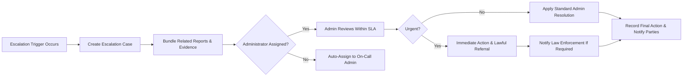

# Moderation & Content Policy for econPoliticalForum

## 1. Executive summary and scope
This document defines the business-level moderation policy, reporting workflows, moderator actions and escalation paths for econPoliticalForum, a focused discussion platform for economic and political topics. The goal is to enable open discussion while minimizing harm, ensuring legal compliance, and providing transparent, timely moderation and appeals.

Scope: This document covers content definitions (allowed, restricted, prohibited), user reporting mechanisms, moderator triage and actions, escalation rules, appeals, reporter protections, record-keeping, and SLAs for moderation activities. This document does not prescribe technical implementations (databases, API definitions) but specifies the exact business behaviors the system must support.

This document provides business requirements only. All technical implementation decisions belong to developers; developers have full autonomy over architecture, APIs, and database design.

## 2. Audience and roles
Audience: Moderators, administrators, legal/compliance teams, product owners, and backend developers implementing moderation features.

Primary roles (refer to [User Roles and Authentication Guide](./05-user-roles-authentication.md)):
- guest: May report content but cannot perform moderation actions.
- registeredUser: May create posts/comments, report content, and view outcomes of their own reports.
- moderator: Performs content review, issues warnings, hides content, places temporary suspensions, and approves content in moderated categories per policy.
- administrator: Final authority for escalations, policy updates, permanent suspensions, and legal takedowns. Administrators manage global moderation settings and audit logs.

Role responsibilities relevant to moderation:
- Moderators: initial triage, temporary measures, prepare case notes for escalations.
- Administrators: resolve escalations, apply permanent account actions, fulfill lawful takedown orders, and approve policy changes.

## 3. Definitions and guiding principles
Definitions (business-focused):
- Content: Any post, comment, reply, user profile text, or attachment uploaded or posted by users.
- Report: A user-initiated request to review specific content for policy violation.
- Triage: The initial moderation step where a moderator reviews a report and decides a next action (dismiss, take action, escalate).
- Temporary action: Non-permanent moderation actions such as hiding content, placing temporary suspension, or requiring re-submit after edit.
- Final action: Permanent removal of content or account suspension.

Guiding principles:
- Safety first: Prioritize preventing imminent harm and illegal activity.
- Transparency: Keep affected users informed of decisions and reasons.
- Proportionality: Use the least restrictive action that reasonably addresses the violation.
- Auditable: All moderator actions must be recorded with clear business metadata.

## 4. Content policy: allowed, restricted, and prohibited content
This section categorizes content and provides examples and business rules for each category.

4.1 Allowed content (examples):
- Reasoned analysis of policies, data-driven arguments, citations to public sources.
- Opinionated commentary that does not target protected classes or incite violence.

4.2 Restricted content (may require additional labels or moderation):
- Highly partisan advocacy in contexts where the category is intended for neutral debate. WHERE category is labeled "expert analysis", THE system SHALL require content to include at least one citation or data source before posting.
- Unverified factual claims about public health, electoral procedures, or legal processes where misinformation risk is high. WHEN content is tagged "high-impact claim", THE system SHALL flag it for expedited moderator review.

4.3 Prohibited content (illustrative and non-exhaustive):
- Illegal activity: IF content describes or organizes imminent criminal acts, THEN THE system SHALL treat content as "prohibited" and escalate to administrators for immediate removal and possible referral to law enforcement.
- Direct incitement to violence: IF content explicitly calls for violence or physical harm against individuals or groups, THEN THE system SHALL remove the content and permanently suspend the responsible account on first confirmed violation.
- Hate speech targeting protected characteristics (race, religion, nationality, gender identity, sexual orientation, disability) that attacks, dehumanizes, or calls for exclusion or harm: IF content is hateful as defined above, THEN THE system SHALL remove the content and apply progressive sanctions (warning or suspension) depending on severity and history.
- Credible threats and doxxing: IF content publishes private personal information with intent to harm, THEN THE system SHALL remove the content, anonymize the report details for the reporter, and escalate to an administrator.
- Coordinated misinformation campaigns that meet internal thresholds for coordination and impact: IF content is part of coordinated campaign as determined by moderation evidence, THEN THE system SHALL mark involved accounts for administrator review and apply rate-limits or suspensions as needed.
- Sexual content, pornography, or explicit adult content posted outside an explicit, age-gated category: IF explicit sexual content appears outside an age-gated category, THEN THE system SHALL remove it and suspend posting privileges until review.

Business rules for borderline cases:
- WHEN content contains harassment but does not target protected classes, THE system SHALL apply escalating non-permanent sanctions (warning, temporary suspension) for repeated offenses.
- WHEN a user posts content that appears to be satire or parody, THE system SHALL consider context, historical behavior, and user-provided context before removing content; moderators shall document rationale.

## 5. Reporting: reporter protections and workflow
5.1 Reporter protections (business rules):
- WHEN a user files a report, THE system SHALL allow the reporter to choose to remain anonymous to the content author and public; the reporter's identity SHALL be visible only to moderators and administrators.
- IF the reporter requests confidentiality for safety reasons (e.g., doxxing, threats), THEN THE system SHALL redact personal identifiers from any report summaries shared in escalation workflows.
- WHEN a reporter retracts a report before triage, THE system SHALL mark the report as "retracted" and preserve an audit trail but not notify the reported user.

5.2 Reporting input requirements (business-level):
- WHEN a user submits a report, THE system SHALL require the reporter to select a reason from a structured list (e.g., "hate speech", "incitement", "doxxing", "misinformation", "harassment", "other") and provide an optional free-text explanation limited to 1000 characters.
- WHEN a user selects "other", THE system SHALL prompt for a concise explanation limited to 500 characters and categorize it under "other" for human review.

5.3 Reporting workflow overview (business steps):
1. Reporter submits report with reason and optional details.
2. THE system SHALL create a report record and assign status "new".
3. THE system SHALL notify on-duty moderators (business-level: notify within 5 minutes during active moderation windows; see SLAs) and place the report in the triage queue.
4. A moderator performs triage and sets the report to one of: "dismissed", "action taken", "escalated".
5. For "action taken", THE system SHALL record the action type, summary justification, and notify reporter and reported user with a templated message describing the result and rationale (subject to confidentiality rules).

Mermaid diagram: Reporting and triage flow

```mermaid
graph LR
  A["User Submits Report"] --> B["Create Report Record(Status: \"new\")"]
  B --> C["Notify Moderators"]
  C --> D{"Moderator Reviews"}
  D -->|"Dismiss"| E["Mark Report Dismissed"]
  D -->|"Action Taken"| F["Apply Moderator Action"]
  D -->|"Escalate"| G["Create Escalation Case"]
  F --> H["Notify Reporter & Reported User"]
  G --> I["Administrator Reviews"]
  E --> K["Archive Report"]
  J --> K
```

5.4 Time-to-first-response and triage SLAs (measurable):
- WHEN a report is created during active moderation hours, THE system SHALL ensure a moderator acknowledges (i.e., opens the report for review) within 2 hours for high-severity reports and within 24 hours for low-severity reports.
- WHEN a report is acknowledged, THE system SHALL complete initial triage (dismiss/action/escalate) within 24 hours for high-severity items and within 72 hours for low-severity items.
- WHEN a report is submitted outside active moderation hours, THE system SHALL queue the report and ensure acknowledgement within the above times measured from the start of the next active moderation window.

## 6. Moderator actions: triage, temporary measures, and final actions
6.1 Moderator action types and permitted use (business matrix):
- "Dismiss": Use when content does not violate policy.
- "Hide/Unpublish": Temporarily remove content from public view pending further review.
- "Require Edit": Require author to remove or correct parts of content before republishing.
- "Warning": Record a formal warning to a user's record.
- "Temporary Suspension": Temporarily block posting privileges for a defined period (e.g., 24 hours, 7 days, 30 days) depending on severity and prior history.
- "Permanent Suspension": Remove posting privileges indefinitely and require administrator action for reinstatement.
- "Escalate to Admin": Route cases with legal risk, doxxing, coordinated campaigns, or requiring permanent account actions.

6.2 Authorization rules (who can do what):
- WHEN a report is low-severity and first-time, THE system SHALL allow moderators to dismiss, issue a warning, or require edit.
- WHEN content meets criteria for immediate removal (e.g., explicit incitement to violence, doxxing, illegal activity), THE system SHALL allow moderators to hide content immediately and escalate to administrators for permanent actions.
- WHEN moderation requires permanent suspension, THE system SHALL require administrator approval before the action is applied, except in cases of clear legal risk where immediate admin notification is required.

6.3 Documentation requirements for actions:
- WHEN a moderator takes action, THE system SHALL record a mandatory summary of no more than 1000 characters describing the reason using structured tags and free-text justification.
- WHEN a moderator issues a warning or suspension, THE system SHALL record start/end times and link to the triggering report(s).

6.4 Rate-limiting and safeguards for moderation actions:
- WHERE automated bulk actions are enabled (e.g., bulk hide), THE system SHALL require dual approval from two moderators OR one administrator for retroactive permanent removals affecting more than 50 items for the same cause.

## 7. Escalation rules and senior-admin involvement
7.1 Escalation triggers (explicit business rules):
- WHEN a content case involves doxxing, imminent threat to physical safety, or credible plea for immediate law enforcement intervention, THE system SHALL mark the case as "urgent" and notify administrators with highest priority.
- WHEN a content case involves coordinated inauthentic behavior meeting coordination thresholds (business-determined), THE system SHALL escalate to administrators for account network analysis and potential coordinated action.
- WHEN a reported user receives three moderation actions within 90 days, THE system SHALL automatically flag the user's account for administrator review.

7.2 Escalation routing and responsibilities:
- WHEN a case is escalated, THE system SHALL create an escalation case that bundles all related reports, prior moderator actions, and a timeline of events for administrator review.
- THE administrator assigned to the escalation SHALL complete final decision within 72 hours of assignment for non-urgent cases and within 4 hours for urgent cases.
- WHEN administrators take final action, THE system SHALL record rationale and notify affected parties per confidentiality constraints.

Mermaid diagram: Escalation flow



## 8. Appeal and dispute resolution process
8.1 Appeal eligibility and initiation:
- WHEN a user receives a final adverse action (content removal or suspension), THE system SHALL allow the user to submit an appeal within 14 calendar days of the action notice.
- WHERE the action was a temporary suspension of 7 days or less, THE system SHALL accept appeals but may require a cooling-off period before review.

8.2 Appeal workflow and SLAs:
1. User submits appeal with a required short statement (max 1000 characters) and may attach up to 3 supporting documents.
2. THE system SHALL acknowledge receipt of appeal within 48 hours.
3. An independent reviewer (administrator who did not take the original final action or a designated appeals moderator) SHALL complete appeal review within 7 calendar days and issue a final decision.
4. THE system SHALL permit one re-opened appeal if new evidence is produced within 30 days of final appeal decision.

8.3 Appeal outcomes and communication:
- Possible outcomes: "Upheld", "Reversed", "Modified" (e.g., reduce suspension duration), "Further Action Required".
- WHEN an appeal is reversed, THE system SHALL restore content and remove associated strikes from the user's moderation record if appropriate; THE system SHALL notify the user with explanation.

## 9. Transparency, logging and record-keeping
9.1 Required audit records (business-level):
- THE system SHALL store an immutable audit trail for each moderation action containing: timestamp, acting role (moderator/admin ID), action type, reason code(s), free-text justification, linked report IDs, and action outcome.
- THE system SHALL retain moderation audit records for a minimum of 2 years unless legal requirements mandate longer retention.

9.2 Public transparency reporting:
- WHERE practicable, THE system SHALL publish a quarterly transparency report that includes aggregate counts of reports received, actions taken, escalations, appeals filed and their outcomes, and policy changes. No personally identifying information shall be published.

9.3 Data minimization and redaction for safety:
- IF a report contains sensitive personal information or material that could endanger a reporter, THEN THE system SHALL redact identifying fields in any internal summaries shared outside the minimal moderator/admin set.

## 10. Performance and SLA requirements (business-level)
- WHEN a user submits a report marked "high-severity", THE system SHALL ensure initial moderator acknowledgment within 2 hours and resolution (dismiss/action/escalate) within 24 hours.
- WHEN a report is "low-severity", THE system SHALL ensure initial acknowledgment within 24 hours and resolution within 72 hours.
- WHEN an escalation is created, THE system SHALL ensure administrator assignment within 8 hours for urgent cases and within 72 hours for non-urgent cases.
- WHEN automated detection flags content as potentially in violation, THE system SHALL present the suspected items to moderators in an "automated review" queue where human confirmation is required before final action.

## 11. Privacy, legal and compliance considerations
11.1 Lawful requests and takedown orders:
- WHEN the platform receives a lawful request or subpoena affecting content, THE system SHALL record the request, mark affected content as "legal hold", notify administrators, and follow escalation procedures for legal response.

11.2 Cross-border content and jurisdictional rules:
- WHEN content is legal in one jurisdiction but illegal in another and the user base spans both, THE system SHALL apply localized restrictions where feasible (e.g., geoblocking sensitive content) and escalate to administrators for policy decisions.

11.3 Personal data and retention:
- THE system SHALL avoid including reporters' identity in public communications. Reporter identities SHALL be accessible only to moderators and administrators and only for investigation purposes.

## 12. Metrics, auditing and reporting for admins
Key operational KPIs (business metrics to track):
- Number of reports received per day
- Average time-to-acknowledgement (high/low severity)
- Average time-to-resolution
- Percentage of reports resulting in action
- Appeals received and reversal rate
- Moderator agreement rate (percentage where a second moderator agrees with first triage)
- False positive rate of automated detection mechanisms (business-level reporting)

Reporting cadence:
- Daily operational dashboard for on-duty moderation teams showing queue depth and SLA breaches.
- Weekly summary to administrators with trends and notable escalations.
- Quarterly transparency report (aggregate, non-identifying).

## 13. Example scenarios and business rules (detailed)
Scenario A: Single tweet-like post that explicitly calls for violence against a political group
- WHEN such a post is reported, THE system SHALL mark it high-severity, ensure moderator acknowledgment within 2 hours, hide content immediately, and escalate to an administrator for permanent removal.

Scenario B: User posts an unverified claim about election fraud in a public thread
- WHEN a post is tagged as "high-impact claim" by user flags or automated detection, THE system SHALL flag it for expedited moderator review; moderators SHALL apply a label "unverified claim" if not removed.

Scenario C: Doxxing report
- IF content contains private personal data disclosed without consent and with intent to harm, THEN THE system SHALL remove content immediately, redact the reporter's identity in shared summaries, and escalate to administrators for potential permanent suspension and law enforcement referral.

## 14. Mermaid diagrams (already included above)
- Reporting and triage flow (see section 5.3)
- Escalation flow (see section 7.2)

## 15. Acceptance criteria and success tests (measurable checks)
All acceptance criteria are written as measurable business tests.

- WHEN a user files a high-severity report, THEN a moderator SHALL acknowledge it within 2 hours in 95% of test cases measured over a rolling 30-day window.
- WHEN 100 randomly sampled closed reports are audited, THEN at least 95% SHALL have an audit record containing the mandatory fields (timestamp, actor, action, reason, linked report IDs).
- WHEN 100 appeals are processed, THEN the appeal SLA (7 days) SHALL be met in at least 90% of cases.
- WHEN a content item is removed for doxxing, THEN the system SHALL redact reporter identity in any non-admin summaries in 100% of cases.

## 16. Related documents and references
- [User Roles and Authentication Guide](./05-user-roles-authentication.md)
- [Functional Requirements Document](./04-functional-requirements.md)
- [Edge Case Handling Document](./07-secondary-edge-cases.md)
- [Non-Functional Requirements](./09-non-functional-requirements.md)
- Legal templates for takedown and lawful requests (internal reference)

## 17. Constraints, assumptions and open questions (business-level)
Constraints and assumptions:
- The platform targets public discussion of economics and politics; content volume is expected to grow and moderation staffing will scale accordingly.
- Moderators are trusted members and will follow the documented processes.
- Automated detection assists but human confirmation is required for final enforcement.

Open questions for stakeholders (for product/legal teams to confirm outside this document):
- Define exact thresholds for "coordinated inauthentic behavior" that will trigger automated flagging and escalation.
- Confirm acceptable retention period beyond 2 years for audits where legal obligations exist.
- Determine whether permanent suspension requires multi-party approval in addition to admin approval for specific categories (e.g., verified public figures).

## 18. Final notes
This document defines business-level moderation and content policies and measurable requirements for reporting, triage, escalation, appeals, and record-keeping. It is intended to be used by moderation teams, administrators, legal counsel, and backend developers implementing moderation features. Technical implementation details (APIs, schemas, storage) are intentionally omitted and are the responsibility of the development team.