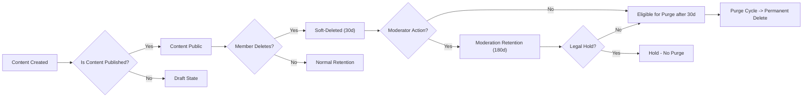
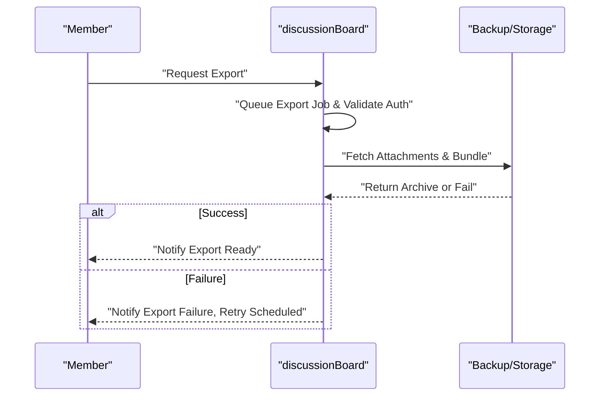

# 09-data-lifecycle.md — Data Lifecycle and Retention Policy for discussionBoard

## Purpose and scope

This policy defines explicit business rules that govern the lifecycle, retention, archival, deletion, portability, backup, recovery, and audit of user-generated content and account data for the discussionBoard service. The policy specifies measurable durations, decision points, escalation paths, and acceptance criteria for backend implementers, operations, and compliance. All requirements below are stated in natural language using EARS constructs (WHEN, THE, SHALL, IF, THEN, WHERE) and include concrete thresholds and SLAs.

Scope: posts, comments, attachments, user accounts, moderation artifacts, audit logs, backups, and exports. Implementation details (schema, storage providers, exact API endpoints) are intentionally out of scope and left to engineering.

## Service identity and actors

- Service name: discussionBoard
- Actors: guest (unauthenticated reader), member (authenticated content creator), moderator (privileged reviewer/operator)

Ownership principle (EARS):
- THE discussionBoard SHALL record the creating actor id for every post, comment and attachment so ownership, export and deletion requests are auditable and enforceable.

## Data types (logical)

- Post: title, body, metadata (authorId, timestamps, category, tags, state)
- Comment: text, parent relation, authorId, timestamps
- Attachment: file metadata (filename, mime-type, size), storage reference, ownerId, associated resource id
- User account: profile fields, email, password hash, preferences
- Moderation artifacts: reports, moderator actions, appeal records
- Audit logs: authentication events, moderation actions, exports, deletes
- Backups and snapshots: system-level recovery artifacts

## Creation and ownership rules (EARS)

- WHEN a member creates content, THE discussionBoard SHALL persist the author identity and timestamps and SHALL associate any attachments to both the content and the uploading member.
- WHEN attachments are uploaded and not yet associated with content (orphan uploads), THE discussionBoard SHALL mark them as "orphan" and SHALL automatically purge or expire them after 90 calendar days unless associated with content earlier.

## Retention and archival rules (concrete)

General retention principles:
- THE discussionBoard SHALL prefer reversible soft-delete for user-initiated and many moderation removals to support appeals and recovery.
- WHEN a legal hold is in place for a content item, THEN THE discussionBoard SHALL suspend any automated purge for that item until the legal hold is released.

1) Posts
- THE discussionBoard SHALL retain published posts indefinitely while the author account is active and no legal hold applies.
- WHEN a member requests deletion of a post, THE discussionBoard SHALL soft-delete the post immediately and SHALL retain it in a recoverable state for 30 calendar days.
- IF 30 calendar days elapse after a user-initiated deletion and no legal hold or active appeal exists, THEN THE discussionBoard SHALL permanently purge the post and its attachments in the next scheduled purge cycle.
- WHEN a moderator removes a post for policy violation, THE discussionBoard SHALL soft-delete the post and retain it for 180 calendar days before permanent deletion unless legal hold extends this period.

2) Comments
- THE discussionBoard SHALL soft-delete user-deleted comments and retain them for 30 calendar days before permanent purge.
- WHEN a moderator deletes a comment, THE discussionBoard SHALL retain the comment for 180 calendar days for audit and appeals.

3) Attachments
- THE discussionBoard SHALL treat attachments as linked assets inheriting the retention of their parent resource by default.
- WHEN a parent resource is soft-deleted, THEN THE discussionBoard SHALL place associated attachments into linked soft-delete and retain them for the parent retention window (30 or 180 days as applicable).
- WHEN an attachment becomes orphaned (no associated content) for more than 90 calendar days, THEN THE discussionBoard SHALL permanently purge the attachment.
- IF an attachment is quarantined for malware or legal reasons, THEN THE discussionBoard SHALL retain the quarantined asset for 180 calendar days for review before deletion unless legal hold applies.

4) User accounts and profile data
- WHEN a member requests account deletion, THE discussionBoard SHALL present options: "Anonymize" or "Hard Delete" and SHALL document consequences to the user.
  - WHERE the user selects "Anonymize", THEN THE discussionBoard SHALL remove or obfuscate direct identifiers (email, display name) and replace author fields with a stable anonymized token; content remains subject to normal content retention rules.
  - WHERE the user selects "Hard Delete", THEN THE discussionBoard SHALL soft-delete the user's content immediately and begin a 30 calendar-day recoverable window. After 30 days, the system SHALL permanently purge content and attachments unless legal holds apply.
- WHEN an account is suspended, THE discussionBoard SHALL not change retention, but SHALL invalidate active sessions immediately.

5) Moderation artifacts and appeals
- THE discussionBoard SHALL retain moderation logs, including reports, moderator actions, and appeals, for a minimum of 3 years for accountability and compliance.
- WHEN an appeal is submitted within 180 calendar days of a moderator action, THEN THE discussionBoard SHALL pause any scheduled permanent purge of the underlying content until appeal resolution.

6) Audit logs
- THE discussionBoard SHALL retain security and moderation audit logs for a minimum of 3 years. Logs necessary for compliance or legal obligations may be retained longer per legal instructions.
- WHEN an audit log entry is requested for investigation, THE discussionBoard SHALL provide authorized access per access control policies and SHALL record access to audit logs.

## Purge scheduling and operational constraints

- THE discussionBoard SHALL run a scheduled purge job at least once every 7 calendar days to perform permanent deletions for items past retention windows.
- WHEN a purge job runs, THE discussionBoard SHALL skip any item that currently has a legal hold or an active appeal and SHALL log the skip reason for audit.
- IF a purge operation partially fails for an item (e.g., external storage deletion fails), THEN THE discussionBoard SHALL retry per retry policy (see Error Handling) and SHALL escalate to operations if retries exceed thresholds.

## Backup, recovery and reconciliation (RTO/RPO)

Business targets:
- THE discussionBoard SHALL maintain backups with a Recovery Point Objective (RPO) of 1 hour for user content (i.e., no more than 1 hour of accepted writes lost in catastrophic failure) and a Recovery Time Objective (RTO) of 48 hours for critical read access restoration in a regional outage.
- WHEN performing object-level restore for a specific content item, THE discussionBoard SHALL reconcile identifiers to avoid duplicate visible content and SHALL record a reconciliation audit entry describing the mapping.
- THE discussionBoard SHALL retain backup snapshots for a minimum of 30 calendar days and for up to 365 calendar days when legal or compliance retention requirements apply.

## Data export and portability (SLAs and process)

Export scope and format:
- THE discussionBoard SHALL provide account exports containing posts, comments, metadata, and references to attachments. Attachments may be included in the export archive when file sizes and policies permit.

Export SLAs (measurable):
- WHERE the requested account contains fewer than 10,000 content items, THEN THE discussionBoard SHALL produce the export and make it available for download within 72 hours of verified request.
- WHERE the requested account contains 10,000 or more items, THEN THE discussionBoard SHALL produce the export within 7 business days.

Export rules and omissions:
- IF attachments are disallowed by policy or exceed export size limits, THEN THE discussionBoard SHALL omit those attachments from the export and SHALL include a manifest listing omitted items and the reason.
- THE discussionBoard SHALL authenticate export requests and SHALL only deliver exports to the account owner or an authorized delegate.

## Error handling, retry, and notification expectations

Retry policy for failed data operations:
- FOR transient failures (storage provider error, transient network), THE discussionBoard SHALL retry operations with exponential backoff starting at 500 ms and doubling up to a maximum delay of 8 seconds, for a maximum of 5 attempts.
- IF retries exceed the maximum attempts for critical purge or export operations, THEN THE discussionBoard SHALL queue the operation for deferred processing and SHALL notify operations when the queue depth exceeds 100 items or when the oldest queued item is older than 24 hours.

User notifications on failures:
- WHEN a user-requested export fails after retries, THEN THE discussionBoard SHALL notify the user within 24 hours with an explanation and an estimated retry timeline.
- WHEN a purge of attachments cannot complete due to external provider errors and remains pending beyond 48 hours, THEN THE discussionBoard SHALL notify the affected account owner and create an operational incident.

## Security, access control and compliance

- THE discussionBoard SHALL ensure that requests to delete, export or anonymize data require authentication and authorization and that only the data owner or authorized delegates can initiate these flows.
- THE discussionBoard SHALL ensure all deletion and export operations are logged in the audit trail with actor id, timestamp, and operation details.
- WHEN a legal hold is received, THEN THE discussionBoard SHALL record the legal hold metadata (requesting authority, case id, timestamp) and SHALL prevent deletion or purge of affected items until release.

## Performance and SLA acceptance criteria (testable)

- Export SLA: 95% of exports for accounts <10,000 items complete within 72 hours measured over a 30-day window.
- Soft-delete visibility: 95% of user-initiated soft-deletes become non-public within 5 seconds under normal load.
- Purge completion: 99% of eligible purge items are permanently deleted within 24 hours of the scheduled purge job start.
- Backup RPO/RTO: Restore tests shall demonstrate RPO <=1 hour and RTO <=48 hours under planned recovery drills.
- Orphan purge: 95% of orphaned attachments older than 90 days are purged in the next purge cycle.

## Acceptance tests and examples (concrete scenarios)

1) User deletion flow
- GIVEN a user requests "Hard Delete" and confirms, WHEN 30 days pass and no legal hold or appeal exists, THEN the system SHALL permanently purge the user's content and attachments during the scheduled purge and SHALL record a deletion audit entry.

2) Moderator removal and appeal
- GIVEN a moderator removes a post and the author appeals within 14 days, WHEN the appeal is pending, THEN the scheduled purge SHALL not permanently delete the post until appeal resolution.

3) Orphan attachment
- GIVEN an attachment uploaded but never associated to content, WHEN 90 days elapse, THEN the attachment SHALL be permanently purged and an audit entry SHALL record the purge.

4) Export failure
- GIVEN an export job fails due to external storage timeout, WHEN automatic retries are exhausted, THEN the system SHALL notify the user within 24 hours and queue the job for deferred retry; operations SHALL be alerted if queue depth thresholds are exceeded.

## Diagrams (Mermaid) — corrected syntax

Post and purge lifecycle:

Export and backup flow:

## Auditability and operational access

- THE discussionBoard SHALL provide role-based access to audit logs and SHALL record all accesses to audit data. Audit access records SHALL include accessor id, timestamp and purpose and SHALL be retained for 3 years.
- WHEN investigators request logs for legal or compliance interactions, THEN THE discussionBoard SHALL export a time-bounded set of audit records and SHALL document the export action in the audit trail.

## Glossary
- Soft-delete: Non-public state allowing recovery within a retention window.
- Legal hold: Administrative flag preventing purge for legal reasons.
- Orphaned attachment: Attachment with no remaining content references.
- RPO: Recovery Point Objective — maximum acceptable data loss window.
- RTO: Recovery Time Objective — maximum acceptable recovery duration.

## Related documents
- 01-service-overview.md (service scope and KPIs)
- 02-user-actors.md (actors and authentication expectations)
- 06-business-rules.md (content and attachment business constraints)
- 08-external-integrations.md (storage, email, scanning integrations)
- 10-error-handling-and-exceptions.md (operational error handling)

## Change control and governance

- THE discussionBoard product team SHALL review and approve any changes to retention durations, legal-hold processes or audit retention. Changes to retention policies SHALL be versioned and SHALL include justification, migration steps and acceptance test updates.

