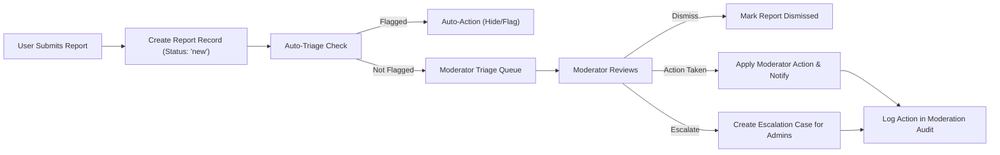
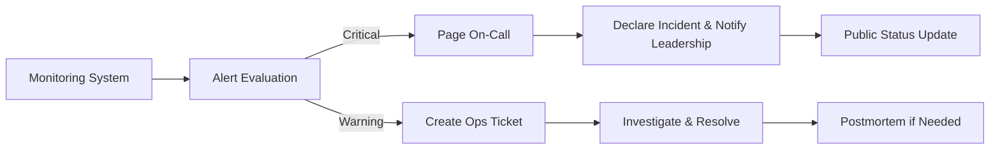
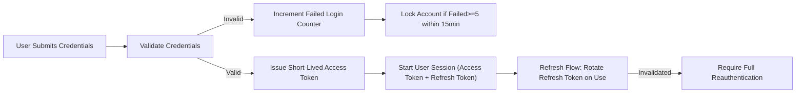

# Non-Functional Requirements — econPoliticalForum

## 1. Executive summary and intended audience

Non-Functional Requirements define business-level service expectations for performance, scalability, security, privacy, accessibility, monitoring, backup, and moderation SLAs for econPoliticalForum. Audience: product managers, backend developers, SRE/operations, security and privacy teams, and moderators. Use this document to derive SLOs, monitoring dashboards, runbooks, and acceptance tests.

## 2. Scope, assumptions, and relationships

Scope: business-level expectations for the public forum MVP and early-stage scaling. Out of scope: low-level architecture choices, specific libraries, and database schema decisions. Related documents: Service Overview, Functional Requirements, User Roles & Authentication, Moderation & Content Policy, MVP Roadmap.

Assumptions:
- Initial launch targets English-speaking jurisdictions as defined in the Roadmap.
- Moderation is primarily human-led at launch supplemented by basic automated triage.
- No private messaging at MVP to reduce moderation complexity.

## 3. Performance SLAs and user experience targets (measurable)

Core SLA targets (business-level, measurable):
- WHEN a user requests a content listing page (category or thread list) for the first page, THE system SHALL return the first renderable payload within 2 seconds in 95% of requests under normal load.
- WHEN a user opens a single thread (post + top-level comments), THE system SHALL render the post and the first 50 comments within 2 seconds in 95% of requests under normal load.
- WHEN a registeredUser submits a create/edit operation (post, comment, vote, bookmark), THE system SHALL acknowledge success or a clear error within 2 seconds in 95% of requests under normal load.
- WHEN a user performs a vote or bookmark action, THE system SHALL reflect the UI update within 1 second in 99% of operations under normal load.
- WHEN a user performs a search for common terms, THE system SHALL return initial search summaries within 2 seconds for 90% of queries under normal load.

Graceful degradation rules:
- IF sustained load exceeds 4x of expected normal load for more than 5 minutes, THEN THE system SHALL degrade non-critical background processes and SHALL prioritize read access to public content such that page response does not exceed 5 seconds for 95% of read requests.
- WHEN search or ranking components are degraded, THE system SHALL fall back to a simpler index mode that returns category-filtered matches with a response target of 5 seconds.

Acceptance tests:
- GIVEN a staging environment representing the production workload baseline, WHEN a synthetic user requests a category page, THEN 95% of requests SHALL return within 2 seconds.
- GIVEN 10k simulated concurrent users performing mixed read/write actions, WHEN the system is tested in staging, THEN create/edit acknowledgements shall meet the stated SLA in 95% of requests.

## 4. Scalability and capacity planning (business expectations)

MAU baselines and concurrency:
- THE system SHALL support an MVP baseline of 10,000 Monthly Active Users with SLA targets above.
- THE system SHALL plan capacity with a baseline concurrency factor of 5% of MAU for peak concurrency planning (e.g., 10,000 MAU => 500 concurrent users baseline).
- WHEN MAU approaches 100,000, THE system SHALL scale to maintain the interactive action SLAs with horizontal scaling or equivalent strategies (implementation discretion for developers).

Viral growth and read-only behavior:
- IF the system experiences sudden growth > 2x in an hour that threatens moderation capacity, THEN THE business SHALL be able to put new user-generated content into a writable queue with transparent messaging to users and preserve read access to public content.

Capacity test acceptance criteria:
- GIVEN growth to 10x initial baseline in staging, WHEN read-only fallback is engaged, THEN read access for public content SHALL be preserved and write operations SHALL be queued with clear user messaging.

## 5. Authentication and session management — business-level expectations

Token and session lifetimes (business rules):
- THE system SHALL use short-lived access tokens with baseline lifetime between 15 and 30 minutes and SHALL use refresh tokens with a baseline lifetime of 7 to 30 days for session renewal.
- WHEN a refresh token is used, THE system SHALL rotate refresh tokens and invalidate the previous refresh token (rotating refresh tokens). If an invalidated token is later presented, THE system SHALL require full re-authentication.
- IF a user selects "revoke other sessions," THEN THE system SHALL invalidate other active sessions and associated tokens within 60 seconds in normal operation.

Authentication error handling and lockout policies:
- WHEN a user fails authentication 5 times within 15 minutes, THE system SHALL temporarily lock the account for 15 minutes and SHALL send a notification to the user's verified email describing the lock and recovery steps.
- IF suspicious authentication patterns are detected (credential stuffing, token replay), THEN THE system SHALL revoke active tokens for affected accounts and notify security operations per incident response rules.

Business EARS examples for auth:
- WHEN a user initiates password reset via a verified email, THE system SHALL send a single-use reset link that SHALL expire within 1 hour of issuance.
- WHEN a newly registered account is created, THE system SHALL mark it as "unverified" until email verification completes and SHALL restrict posting in restricted categories until verified.

Acceptance tests:
- GIVEN a valid refresh token rotation event, WHEN a refresh is performed, THEN the new refresh token SHALL work and the old one SHALL be rejected on subsequent use.
- GIVEN 5 failed logins in 15 minutes, WHEN another login attempt occurs, THEN the account SHALL be locked and a notification email SHALL be sent.

## 6. Moderation latency, safety, and escalation SLAs

Moderation triage and action SLAs:
- WHEN a report is submitted and marked high-severity (imminent threat, doxxing, illegal content), THE system SHALL ensure a moderator acknowledgment within 2 hours and initial human review within 24 hours during active moderation windows.
- WHEN a low-to-medium severity report is submitted, THE system SHALL acknowledge and begin triage within 72 hours.
- IF the number of untriaged reports exceeds a backlog threshold (configurable, recommended: > 500 open reports older than 72 hours), THEN THE system SHALL trigger an escalation alert to operations and product leadership.

Evidence retention and appeals SLA:
- THE system SHALL retain moderation evidence (content snapshot, report details, moderator notes) for a minimum of 365 days after final resolution unless legal requirements mandate a longer retention period.
- WHEN a user appeals a moderation decision, THE system SHALL queue the appeal for administrator review and SHALL provide an initial response within 7 calendar days.

Moderation logging rules (EARS):
- WHEN a moderator takes an action, THE system SHALL record an immutable moderation log entry including moderator ID, action type, reason code, and timestamp.

Acceptance tests:
- GIVEN 100 sampled high-severity reports during a 30-day period, WHEN measured, THEN 95% SHALL have moderator acknowledgment within 2 hours.
- GIVEN an appeal filed, WHEN escalated, THEN the initial admin response SHALL occur within 7 days.

## 7. Security, privacy, and legal compliance

Breach notification and legal request handling:
- WHEN a breach affecting personal data is detected, THE system SHALL notify security leadership within 1 hour of detection and SHALL notify affected users within 72 hours or as required by local regulation.
- WHEN a lawful request (subpoena, DMCA, or other legal order) is received, THE system SHALL log the request, mark affected content with a legal hold, and follow administrator escalation and notification processes.

Data minimization and deletion timelines (business-level):
- WHEN a user requests account deletion, THE system SHALL schedule deletion and SHALL provide a 30-day grace period during which the user may cancel the deletion. After 30 days, THE system SHALL remove personally identifying information from public views and SHALL anonymize content where required by policy while preserving content for legal retention if applicable.
- IF local law requires shorter or longer retention, THEN THE system SHALL comply with the applicable jurisdictional rule and SHALL document the variance in the record.

Access control and audit:
- WHEN privileged administrative or moderator actions occur, THE system SHALL capture an audit record including actor id, action, target, and rationale and SHALL make audit logs available to authorized roles for at least 365 days.

Acceptance tests:
- GIVEN a simulated breach notification workflow, WHEN triggered, THEN security leadership SHALL receive an alert within 1 hour in 95% of test runs.
- GIVEN a deletion request, WHEN 30 days elapse, THEN PII shall be removed from public views and anonymization proofs shall be recorded.

## 8. Monitoring, logging, backup, and recovery

Monitoring and alerting business rules:
- WHEN error rates (5xx) exceed 1% over a rolling 5-minute window for public content endpoints, THE system SHALL generate an on-call page to SRE/ops.
- WHEN authentication failures spike beyond a configured threshold (e.g., 100 failed logins in 5 minutes), THE system SHALL generate a security alert to the security operations team.

Log retention and access controls:
- THE system SHALL retain structured logs necessary for security and moderation audit for at least 365 days. Logs containing sensitive personal data SHALL be access-controlled and only viewable by authorized roles.

Backup and recovery expectations:
- THE system SHALL perform business-level backups of user content and moderation logs at least once per 24 hours and SHALL retain backups for at least 90 days.
- RTO/RPO targets for MVP: the business-level Recovery Time Objective (RTO) SHALL be 4 hours to restore read access to public content after a major incident; Recovery Point Objective (RPO) SHALL be 24 hours for MVP.

Disaster recovery acceptance tests:
- GIVEN a simulated data corruption incident in staging, WHEN DR runbook is executed, THEN public content shall be restored to a consistent state within the RTO and data loss shall not exceed the RPO.

## 9. Accessibility and usability expectations

Accessibility commitments:
- THE system SHALL conform to common accessibility principles (screen-reader compatibility, keyboard navigation, semantic HTML/accessible ARIA usage) for core user flows: browse, read, register, post, comment, report, and review moderation outcomes.
- WHEN new features are introduced to core flows, THE product SHALL run at least one manual accessibility test and an automated accessibility scan before release.

Usability acceptance criteria:
- DURING usability testing with representative users, 90% of participants SHALL be able to complete core flows (register, create a post, report content) within 3 steps and without assistance.

## 10. Error handling, user-facing messages, and recovery

Standardized user messages (business-level):
- WHEN rate-limited, THE system SHALL present a message stating the reason, time remaining until limit lifts, and a link to policy.
- WHEN content is placed under moderator hold, THE system SHALL indicate the hold to the author and affected readers as "under review" with an estimated resolution timeframe.
- WHEN transient service errors occur, THE system SHALL present a clear message that the action failed and offer an option to retry; drafts shall be preserved client-side for up to 7 days.

Acceptance tests:
- GIVEN a rate-limit hit, WHEN user attempts to post, THEN the response message SHALL include remaining wait time and a link to moderation policy.
- GIVEN a moderation hold, WHEN viewing a held post, THEN the UI shall display "under review" and the expected SLA for resolution.

## 11. Metrics, dashboards, and KPIs for operations

Required dashboards and metrics (business definitions):
- Site Health: MAU, DAU, current concurrent users, 5xx rates, average page latency (p95)
- Moderation: open reports count, median time-to-acknowledge, median time-to-resolution, appeals pending
- Safety: reports per 1,000 posts, percent of high-severity reports, moderation action counts by type
- Security: failed login spikes, account lockouts, suspicious token activity

Reporting cadence:
- Real-time dashboards for on-call moderators and ops updated at least every 60 seconds
- Daily summary emailed to product and moderation leads summarizing open queues and SLA breaches
- Weekly metric digest for executives highlighting trends and risk indicators

Acceptance criteria:
- GIVEN the Site Health dashboard, WHEN accessed by product managers, THEN it SHALL display up-to-date MAU and moderator queue length and update every 15 minutes at minimum.

## 12. Acceptance criteria and test cases (summary)

MVP acceptance checklist (business-level):
- Performance: 95% of category page loads within 2 seconds under baseline load
- Moderation: 95% of high-severity reports acknowledged within 2 hours in active moderation windows
- Security: breach notification workflow validated and responders alerted within 1 hour in simulated tests
- Backup/DR: read access restored within RTO in DR exercises
- Accessibility: core flows pass automated scans and at least one manual accessibility check

Concrete test case examples:
- Post creation SLA test: create 1,000 posts in staging within an hour and verify 95% success acknowledgement under 2s.
- Moderation SLA test: generate 100 high-severity reports in staging, ensure 95% are acknowledged within 2 hours.

## 13. Mermaid diagrams and process flows (fixed syntax)

### Moderation workflow

### Incident response and monitoring

### Authentication lifecycle

All diagram labels use double quotes and bracketed labels without spaces between bracket and quotes as required.

## 14. Glossary and abbreviations
- MAU: Monthly Active Users
- RTO: Recovery Time Objective
- RPO: Recovery Point Objective
- SLA: Service Level Agreement
- SLO: Service Level Objective
- EARS: Easy Approach to Requirements Syntax

## 15. Appendix: change log and ownership
- Document owners: Product Manager (business owner), Lead Backend Engineer (technical clarifications), Policy Lead (moderation and compliance)
- Change log: record of major revisions with author, date, and summary. All substantive changes SHALL include a changelog entry.

## 16. Final compliance checklist
- ALL applicable requirements are expressed in testable EARS format or measurable business statements.
- Mermaid diagrams use double-quoted labels and correct arrow syntax.
- Authentication/session behaviors, moderation SLAs, backup/DR targets, and logging/retention rules are specified at a business level.
- Document length meets the minimum content threshold and includes acceptance criteria, diagrams, and a glossary.

