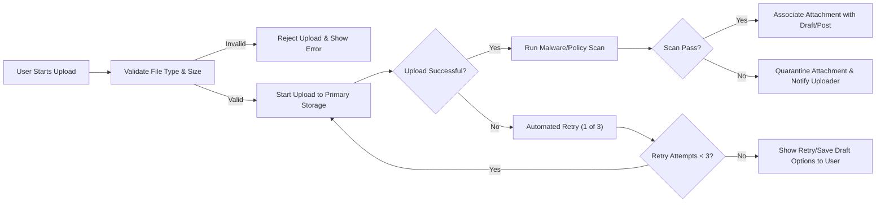
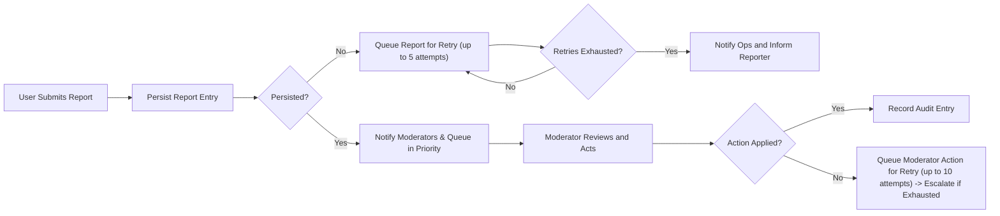

# Error Handling and Exceptions — Business Requirements for discussionBoard

## Scope and Audience
Applies to the discussionBoard backend and supporting integrations. Audience: backend developers, QA engineers, operations, and security/compliance. The requirements below describe WHAT the system must do from a user-facing and operational perspective when errors or exceptional conditions occur. Implementation choices (APIs, storage providers, schemas) are at the discretion of engineering but behavior described here is mandatory.

## Actors and Context
- Guest: Unauthenticated visitor; read-only access.
- Member: Authenticated user who can create content, upload attachments, comment, and report content.
- Moderator: Privileged user who reviews reports and takes moderation actions. Moderator actions must be auditable.

## Error Handling Principles (EARS)
- THE discussionBoard SHALL present concise, actionable, and localized messages for all user-facing errors.
- THE discussionBoard SHALL ensure that no partially-completed or invalid content is ever visible to guests or unauthorized members.
- THE discussionBoard SHALL log every failure that affects user-visible operations with sufficient context to support troubleshooting while minimizing exposure of PII.
- WHEN transient system failures occur, THE discussionBoard SHALL retry operations according to the retry policies in this document and SHALL surface progress or pending state to the user.

## User-Facing Error Scenarios and Messages
All user-facing errors below include an example message and an EARS statement.

### General UI Error Principles
- WHEN any user action fails for a user-visible reason, THE discussionBoard SHALL display a short headline, a one-line explanation, and a single recommended next action (retry, save draft, contact support).

Example message templates (localization-ready):
- "Upload failed: file exceeds the permitted size. Allowed: images ≤ 5 MB, documents ≤ 20 MB."
- "Action failed: your session expired. Please sign in again to continue." 
- "Operation delayed: we are retrying in the background. You can save this as a draft or try again later."

Acceptance criterion: In QA, simulated failures must surface the appropriate message and recommended action for each scenario.

### Content Creation and Publish Failures
- WHEN a member's post submission fails before final commit, THEN THE discussionBoard SHALL preserve the post draft client-side and SHALL NOT publish any attachments or content to public listings.
- WHEN a post publish attempt fails after attachments have uploaded but before the final commit step, THEN THE discussionBoard SHALL keep attachments private and associated with the draft until publish completes successfully or the author cancels.

Example message: "Publishing failed due to a temporary error. Your draft is saved locally and attachments remain private. Try again or save and publish later."

Acceptance criterion: Under simulated mid-publish failure, no public content is created and attachments are not accessible by other users.

### Commenting Failures
- WHEN a comment submission fails due to validation (length or empty), THEN THE discussionBoard SHALL present a field-specific message and preserve the comment text for user correction.
- WHEN a comment submission fails due to authorization (e.g., suspended account), THEN THE discussionBoard SHALL inform the user of their account state and surface next steps (appeal/contact support).

Example message: "Comment failed: comment exceeds 500 characters. Please shorten and try again."

Acceptance criterion: Validation failures return an itemized list of fields and do not clear user input.

## Attachment Upload Failures and Recovery
Refer to the Business Rules document for canonical attachment limits. For error handling behaviors, these business constraints are authoritative in this document unless otherwise noted: image attachments are allowed up to 5 MB; non-image documents are allowed up to 20 MB. Attachment count per post shall be limited per Business Rules.

### Validation Failures
- WHEN a user attempts to upload an attachment that violates allowed type or size, THEN THE discussionBoard SHALL reject the upload and return a clear, user-friendly error specifying the allowed types and size limits.

Example message: "Upload failed: unsupported file type. Allowed types: JPEG, PNG, GIF, PDF, DOCX, TXT."

Acceptance criterion: Attempting to upload a disallowed file results in rejection and a clear explanation.

### Transient Network Failures and Retry Policy
- WHEN an attachment upload fails due to a transient network or storage error, THEN THE discussionBoard SHALL attempt up to 3 automated retries with exponential backoff delays of 1 second, 2 seconds, and 4 seconds respectively.
- IF the third retry fails, THEN THE discussionBoard SHALL stop automatic retries and present the user with two explicit options: "Retry upload now" and "Save post as draft".
- WHILE automated retries are running, THE discussionBoard SHALL display a progress indicator and messages such as: "Retrying upload (attempt 2 of 3)."

Acceptance criterion: In simulated flaky network conditions, the system performs exactly the configured retries and then surfaces retry/save options.

### Storage Provider Failures, Queuing and Failover
- WHEN the primary storage provider fails to accept uploads, THEN THE discussionBoard SHALL attempt to write to a configured secondary provider where available and SHALL retry writes up to 5 times with exponential backoff before queuing.
- IF both primary and secondary writes fail, THEN THE discussionBoard SHALL queue the upload item in a durable retry queue for up to 24 hours and SHALL mark the related post as "attachments pending remote storage" or keep it as a draft until persistence succeeds.
- IF queued uploads remain unpersisted after 24 hours, THEN THE discussionBoard SHALL mark the attachments as failed, notify the author with remediation options, and raise an operational alert when queue depth exceeds configured thresholds (default: 50 pending items for more than 30 minutes).

EARS example: IF primary storage is unreachable, THEN THE discussionBoard SHALL write to the secondary provider where available and SHALL queue uploads for at most 24 hours if both fail.

Acceptance criterion: Under simulated storage outage, uploads are queued and retried; authors receive notifications on failure and operations receive alerts if queue thresholds are exceeded.

### Resumable Uploads and Large Files
- WHERE resumable uploads are supported, THE discussionBoard SHALL resume from the last confirmed chunk and SHALL not require the user to restart multipart uploads from zero during transient network failures.
- WHEN proposing resumable uploads, THE discussionBoard SHALL show progress and estimated time remaining for files > 2 MB.

Acceptance criterion: Interrupted resumable upload resumes from the last successful chunk in QA simulations.

## Authentication and Authorization Failures
These requirements complement the Authentication document; they specify error behavior and lockout UX.

### Login Failures and Lockout Policy
- WHEN a user provides incorrect credentials, THEN THE discussionBoard SHALL display a non-ambiguous error: "Incorrect email or password." and SHALL decrement the remaining attempt counter.
- IF a user accumulates 5 failed login attempts within a rolling 30-minute window, THEN THE discussionBoard SHALL lock authentication for that account for 15 minutes and SHALL send a suspicious activity notification to the account email address indicating the lockout and recommended steps.
- WHEN a user is locked out, THEN THE discussionBoard SHALL surface recovery options including password reset and support contact. The password reset token SHALL be single-use and expire within 1 hour.

EARS example: IF 5 failed login attempts occur within 30 minutes, THEN THE discussionBoard SHALL lock the account for 15 minutes and notify the account owner.

Acceptance criterion: Simulate failed attempts to verify lockout timing, notification, and password reset behavior.

### Unverified Accounts
- WHEN an unverified account attempts to perform a publishing action, THEN THE discussionBoard SHALL prevent the action and SHALL provide a direct action to resend verification with a maximum resend rate of 3 times per hour.

Acceptance criterion: Unverified accounts cannot publish; resend verification rate-limited.

### Session Expiry and Multi-device Conflicts
- WHEN a session expires during content creation, THEN THE discussionBoard SHALL preserve the draft client-side and SHALL prompt the user to re-authenticate. After re-authentication, THE discussionBoard SHALL offer to resume the draft.
- IF simultaneous edits produce a conflict, THEN THE discussionBoard SHALL prevent silent overwrite, present a conflict notice to the user, and SHALL provide options to merge, keep local changes, or keep remote version.

Acceptance criterion: Conflict scenario resolves with explicit user choice and no silent data loss.

## Moderation Workflow Failures and Escalation
Moderation actions must be durable and auditable.

### Report Persistence and Retry
- WHEN a member files a report and the persistence operation fails, THEN THE discussionBoard SHALL enqueue the report for retry and SHALL inform the reporter that the report will be persisted and reviewed; the reporter SHALL receive a confirmation once the report is successfully persisted.
- IF a report cannot be persisted after 5 retries, THEN THE discussionBoard SHALL escalate to operations and provide a fallback contact path for the reporter.

Acceptance criterion: Report submission failures are queued and retried; permanent failures create an operations ticket and inform the reporter.

### Moderator Action Retries and Escalation
- WHEN a moderator's action (hide/remove/suspend) fails to apply due to a transient system error, THEN THE discussionBoard SHALL queue the moderator action for up to 10 retries over 1 hour using exponential backoff. If all retries fail, THEN THE discussionBoard SHALL escalate to administrators and create an incident record with affected items.

Acceptance criterion: Queued moderator actions retry and escalate after configured limits.

## Operational Failures and Rollback Expectations
Atomicity and visibility rules protect the public experience.

- WHEN a multi-step operation (attach files + publish post) fails to complete all steps, THEN THE discussionBoard SHALL ensure atomicity from the user's perspective: no partial content is published and attachments remain private until the entire operation completes successfully.
- IF rollback is performed programmatically, THEN THE discussionBoard SHALL restore the pre-action visibility state and SHALL preserve any client-side drafts.

Retry/backoff defaults for system operations:
- THE discussionBoard SHALL retry transient operational failures with exponential backoff starting at 500 ms doubling each attempt for up to 5 attempts unless a module-specific policy overrides the defaults.
- IF retries exhaust for critical operations, THEN THE discussionBoard SHALL queue the job for deferred processing and raise an operational alert if queue age or depth exceed configured limits (e.g., queue depth > 100 or oldest job older than 30 minutes).

Acceptance criterion: Under simulated component failure, rollback preserves pre-action state and queues deferred jobs appropriately.

## Audit, Logging and Monitoring Requirements
Define what must be logged, retention, and alerting thresholds.

### Events to Log (minimum fields)
- THE discussionBoard SHALL record the following events: authentication events (login success, login failure, password changes), content lifecycle events (create, edit, delete, publish, hide, remove), attachment events (upload success/failure, quarantine), report events (filed, persisted, resolved), moderator actions (action, moderator id, reason), and system errors.
- FOR each logged event THE discussionBoard SHALL include: event type, acting identity (userId or "guest"), target resource id (if applicable), timestamp (ISO 8601 UTC), correlation id for the user transaction, severity level, and a short human-readable message. Where appropriate, include error category and numeric error code (internal).

### Retention and Access
- THE discussionBoard SHALL retain moderation and security audit logs for a minimum of 1 year and operational error logs for at least 90 days. Access to audit logs SHALL be restricted and audited; access attempts SHALL be logged with accessor id and timestamp.

### Monitoring and Alerting Thresholds
- THE discussionBoard SHALL emit alerts when:
  - Attachment upload failure rate > 1% over a 24-hour window
  - Authentication failure rate > 5% of login attempts in a 1-hour window
  - Moderation action retry queue length > 50 items for more than 30 minutes
  - System-wide SLO violations persist for three consecutive 10-minute windows
- WHEN an alert triggers, THEN THE discussionBoard SHALL create an incident record and notify on-call per operational runbook.

Acceptance criterion: Simulated alerting conditions generate incidents and include required diagnostic context.

## Metrics, SLAs and Acceptance Criteria
- THE discussionBoard SHALL provide the following measurable SLAs for error-handling related features:
  - Upload retry acknowledgement: The system SHALL acknowledge upload start within 2 seconds for 95% of attempts in normal load conditions.
  - Publish atomicity: 100% of publish operations shall either complete fully or not be visible (atomic from user perspective) in 99.99% of operations under normal load.
  - Moderation retry and escalation: 95% of moderator actions shall apply successfully within 5 minutes; items failing after retries SHALL escalate automatically.

QA test cases (minimum set):
- Upload retry: Simulate network flakiness and verify retry policy and final user message.
- Atomic publish: Simulate final-commit failure and verify no public artifact is observable.
- Login lockout: Simulate failed attempts and verify lockout timing and notification.
- Moderator action retry: Simulate transient failure and verify queueing and escalation behavior.
- Audit retrieval: Verify audit logs contain required fields and are queryable for moderation actions.

## Appendix: Example User Messages and Diagrams
### Example messages (localizable strings)
- "Upload failed: file exceeds permitted size (images ≤ 5 MB, documents ≤ 20 MB). Please reduce the file size and try again."  
- "Publishing delayed: attachments are pending remote storage. Your draft is saved and we are retrying automatically."  
- "Login failed: incorrect email or password. You have 2 attempts remaining before temporary lockout."  
- "Moderation action pending: your content is under review by moderators. You will be notified of the outcome within 48 hours."

### Mermaid: Attachment Upload and Retry Flow

### Mermaid: Report Persistence and Moderator Action Retry Flow

## Final Acceptance Summary
- All error-handling behaviors described above shall be implemented in the system and validated by QA with the listed acceptance tests.
- Audit and monitoring coverage shall be implemented to detect the thresholds and trigger incidents as defined.

