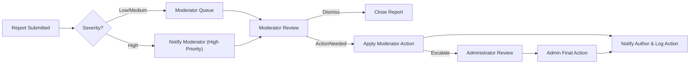
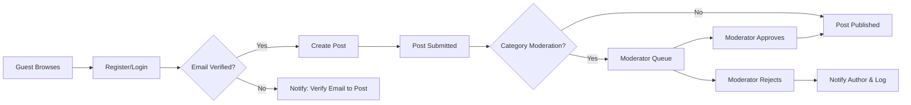

# econPoliticalForum — MVP Roadmap and Operational Requirements

## 1. Executive summary and objectives

econPoliticalForum delivers a focused, moderated public discussion platform for economics and political topics. The primary objectives are:
- Enable constructive, evidence-based public discourse while minimizing harm and legal exposure.
- Launch a safe MVP that demonstrates community value and trustworthiness.
- Establish measurable SLAs and acceptance criteria to ensure operational readiness and user safety.

Key success metrics (business-level):
- Monthly Active Users (MAU) target for MVP: 10,000 within 12 months.
- Moderation SLA: 95% of high-severity reports triaged within 24 hours at launch.
- Engagement: 7-day retention >= 40% for new verified users.
- Performance: 95% of content listing and thread view requests return within 2 seconds under normal load.

## 2. Business model and target users

Economics and positioning: product focuses on serious, topic-driven discussion, balanced safety-first moderation, and optional monetization later via premium features or organizational partnerships.

Primary roles and high-level permissions (business view):
- guest: read-only access to public content and public profiles; may submit reports but cannot create content.
- registeredUser: create/edit/delete own posts/comments (within constraints), vote, bookmark, follow threads, report content, receive notifications.
- moderator: triage reports, hide/unpublish content, issue warnings, apply temporary suspensions, approve moderated-category posts, view moderation logs.
- administrator: global configuration, permanent suspensions, legal takedowns, access to audit logs, manage moderation policies.

## 3. Authentication, account lifecycle, and session expectations (business-level)

EARS-formatted authentication rules:
- WHEN a user registers, THE system SHALL create an account in Pending status and SHALL send a verification email; THE account SHALL remain limited until the verification completes.
- WHEN a verified user requests password reset, THE system SHALL issue a single-use reset token that SHALL expire within 1 hour.
- WHEN a user revokes all sessions, THE system SHALL invalidate all active sessions within 60 seconds under normal conditions.
- WHEN a user accumulates 5 failed login attempts in a rolling 15-minute window, THE system SHALL lock the account for 15 minutes and SHALL notify the verified email address.

Session and token expectations (business guidance):
- Access tokens broadly: short-lived (15–30 minutes) and refresh tokens: longer-lived (7–30 days) with rotation on use; these are business-level expectations and developers will choose secure implementations.
- THE system SHALL NOT embed PII in tokens and SHALL ensure tokens are revocable for security operations.

Account lifecycle and suspension:
- WHEN a moderator issues a temporary suspension, THE system SHALL disable the user's ability to create new posts/comments and SHALL notify the user with reason and appeal instructions.
- WHEN a user requests account deletion, THE system SHALL mark the account for deletion and SHALL allow 30 days to cancel; after 30 days PII SHALL be removed or anonymized while retaining anonymized content per legal retention rules.

## 4. MVP scope and prioritized feature list

MUST HAVE (MVP):
- Registration and login with email verification and password reset.
- Public categories and threaded posts with create/read/update/delete for own posts within business rules.
- Comments and one-level nested replies (comment -> reply) for MVP.
- Voting primitive (upvote/downvote or upvote-only — product decision) with one vote per user per content item.
- Tagging and simple search for discovery across titles and tags.
- Reporting UI and moderator queue with structured reason codes.
- Moderator tools: hide/unpublish content, warnings, temporary suspensions, approve pending posts.
- User profiles, follow/bookmark, and notifications for replies/mentions/moderation actions.

SHOULD HAVE (post-MVP):
- Reputation badges and privileges tied to trust score.
- Advanced search filters and sorting.
- Digest notifications and thread-following options.

NICE TO HAVE (later):
- Organization accounts, paid tiers, direct messaging, advanced analytics for institutions.

## 5. Detailed EARS-formatted business rules (posting, editing, deletion, voting, reports)

Posting and visibility rules
- WHEN a registeredUser attempts to create a post, THE system SHALL allow creation if the user is not suspended and meets category requirements (email verified for restricted categories).
- WHEN a post is created in a moderated category, THE system SHALL mark it as PendingApproval and SHALL notify moderators; THE post SHALL not be publicly visible until approval.
- WHEN a registeredUser submits a post, THE system SHALL accept titles up to 200 characters and body up to 50,000 characters; submissions exceeding these limits SHALL be rejected with a clear error message.

Editing and delete rules
- WHEN a registeredUser edits their own post within 24 hours of creation, THE system SHALL permit the edit and SHALL record the edit in an audit trail.
- IF a registeredUser edits after 24 hours, THEN THE system SHALL mark the post as "edited" publicly and SHALL flag the edit for moderator review in sensitive categories.
- WHEN a registeredUser deletes a post within 30 days of creation, THE system SHALL soft-delete the post (remove from public listing) and SHALL retain an archived copy for moderation and legal purposes for the retention window.

Comment rules
- WHEN a registeredUser submits a comment, THE system SHALL limit comment length to 5,000 characters and SHALL allow one level of nested replies in MVP.
- WHEN a comment is deleted by the author, THE system SHALL replace visible content with a standard placeholder ("Comment removed by user") but SHALL retain archived copy for moderation.

Voting rules
- WHEN a registeredUser casts a vote, THE system SHALL accept one vote per user per item and SHALL prevent self-voting.
- WHEN vote anomalies are detected (e.g., >1,000 votes in 10 minutes on a single thread), THE system SHALL flag the thread for moderator review and SHALL temporarily exclude flagged votes from public score calculations until investigation.

Reporting rules
- WHEN a user files a report, THE system SHALL capture reporter id (if authenticated), target content id, report reason code, timestamp, and optional reporter notes (max 2,000 chars).
- WHEN reports for a single item reach 5 distinct reporters within 24 hours, THE system SHALL escalate item to high-priority moderator queue and SHALL notify on-duty moderators.

Moderation logging and transparency
- WHEN a moderator or administrator takes an action, THE system SHALL record an immutable moderation log entry including actor id, action type, reason code, and timestamp; THE moderation log SHALL be retained per policy for audit.

Appeals and reinstatement
- WHEN a user is suspended, THE system SHALL provide a mechanism to appeal within 14 days; THE appeal SHALL be reviewed by an administrator or delegated appeals reviewer within 7 business days.

## 6. Operational checklist for launch (concrete preconditions)

Pre-launch mandatory items (each is an EARS-style business requirement):
- THE project SHALL have at least two trained moderators available for the launch period and a documented escalation path to administrators.
- THE project SHALL have a transactional email provider configured and validated for verification and password reset flows.
- THE project SHALL have an anti-abuse service integrated and configured to reduce automated signups and posting.
- THE project SHALL have backup procedures for user content and moderation logs with daily backups and test restores documented.
- THE project SHALL have published Terms of Service, Privacy Policy, and content policy with clear reporting and appeals procedures.

Pre-launch acceptance tests:
- WHEN a registration test is executed, THE system SHALL send a verification email within 30 seconds for 95% of attempts.
- WHEN a post is created by a verified user in an open category, THE system SHALL publish it and display it in the category listing within 3 seconds for 95% of test runs under baseline load.

## 7. Required integrations and external services (business expectations)

- Email/Transactional Messaging provider: Must support high deliverability, verification and password reset templates, and rate-limiting controls.
- Anti-abuse/Spam detection: Must provide bot/registration risk scoring and API hooks for registration/post triage.
- Search index (hosted or managed): Must support keyword search and tag queries with <2s result latency under baseline load.
- Logging and monitoring service: Must provide alerting for auth anomalies, moderation queue depth, and high error rates.
- Optional payment provider: For later monetization phases; must satisfy business compliance and PCI requirements when enabled.

Integration acceptance criteria:
- WHEN a verification email is requested, THE email provider SHALL deliver within 30 seconds in 95% of test cases.
- WHEN the anti-abuse service flags a high-risk registration, THE system SHALL prevent account activation pending review.

## 8. Analytics and admin dashboards (metrics and behaviors)

Required dashboards and metrics (business-level):
- Community Activity: MAU, DAU, new registrations/day, posts/day, comments/day.
- Safety Metrics: reports/1,000 posts, high-severity reports/day, moderation median and 95th percentile time-to-triage and time-to-resolution.
- Moderator Performance: actions per moderator/day, appeals processed, reversal rate.
- Abuse Signals: vote spikes, mass-reporting events, burst signups.

Business-level reporting rules:
- WHEN an abnormal spike is detected in reports or votes, THE system SHALL create a high-priority incident and notify administrators and on-duty moderators.
- DASHBOARDS SHALL refresh data at least every 15 minutes for operational monitoring and SHALL provide filters by date range, category, and moderator.

## 9. Moderation & safety workflows with SLAs and escalation thresholds

Moderation triage and SLA rules (EARS format):
- WHEN a report is submitted and classified as high-severity, THE system SHALL notify on-duty moderators within 30 minutes and SHALL ensure a human review within 24 hours.
- WHEN a report is low-severity, THE system SHALL ensure initial triage within 72 hours.
- WHEN a moderator hides content, THE system SHALL notify the author with a reason and provide appeal instructions.

Escalation thresholds and rules:
- WHEN 5 distinct users report the same item within 24 hours, THE system SHALL escalate to high-priority queue.
- WHEN a user receives 3 moderator-confirmed violations within 90 days, THEN THE system SHALL automatically escalate account to administrator review for potential temporary suspension.

Mermaid diagram — Moderation escalation (fixed syntax)

## 10. Non-functional requirements (performance, scalability, security, backups)

Performance and SLAs (business-level):
- WHEN a user requests a category listing (20 items), THE system SHALL present usable content within 2 seconds for 95% of normal requests.
- WHEN a user opens a thread to view the root post and comments, THE system SHALL render the initial view within 2 seconds for 95% of normal requests.
- WHEN a user performs a vote action, THE system SHALL reflect the updated score within 1 second for 99% of operations.

Scalability and growth planning:
- MVP baseline: Support 10,000 MAU with targets for graceful degradation beyond that by prioritizing read operations.
- WHEN MAU grows to 100,000, THE system SHALL scale infrastructure to maintain interactive SLAs; capacity planning is an operations exercise.

Security and privacy expectations:
- THE system SHALL record authentication events, moderation actions, and legal request handling in auditable logs for at least 365 days.
- WHEN a lawful legal request is received, THE system SHALL mark affected content as legal hold and SHALL notify administrators.

Backup and recovery business rules:
- THE system SHALL perform daily backups of user content and moderation logs and SHALL test restores quarterly.
- WHEN data corruption is detected, THE system SHALL be capable of restoring to a point not older than 24 hours for MVP.

Accessibility and usability commitments:
- THE system SHALL ensure primary flows are accessible by assistive technologies and SHALL include keyboard navigation and semantic headings.

## 11. Rate limits, abuse controls, and coordination detection

Rate limits (business EARS rules):
- WHEN an account age <7 days, THE system SHALL limit posts to 3 per 24-hour period and comments to 10 per 24-hour period.
- WHEN an account age >=7 days, THE system SHALL limit posts to 5 per 24-hour period and comments to 200 per 24-hour period.
- IF a user exceeds comment or post limits, THEN THE system SHALL deny further attempts and SHALL display the earliest time posting will be allowed.

Coordination and vote manipulation detection:
- WHEN a single thread receives >1,000 votes within 10 minutes or experiences an unusual vote pattern, THE system SHALL flag the thread for potential coordinated manipulation and SHALL temporarily exclude suspect votes from public scores until investigation.

## 12. Acceptance criteria and measurable test cases

Post creation and publish tests:
- GIVEN a verified registeredUser in an open category, WHEN they submit a valid post, THEN the post SHALL be visible in the category listing within 3 seconds for 95% of test runs.

Moderation SLA tests:
- GIVEN high-severity reports are filed, WHEN measured over a 30-day period, THEN 95% of those reports SHALL be triaged and assigned to a moderator within 24 hours.

Rate-limit tests:
- GIVEN a new account, WHEN attempting 4 posts within 24 hours, THEN the 4th attempt SHALL be denied and a throttle message SHALL be returned indicating time to next allowed post.

Search performance tests:
- GIVEN common queries, WHEN executed under baseline load, THEN 90% of queries SHALL return initial results within 2 seconds.

## 13. Phased roadmap and timeline

Phase 0 (0–2 months): policy drafting, moderator recruitment, minimal UI prototypes, deployment baseline, anti-abuse integration.
Phase 1 (2–5 months): implement core MVP features, internal moderation testing, invite-only beta with trusted contributors.
Phase 2 (5–9 months): public launch, analytics rollout, follow and notification improvements, reputation primitives.
Phase 3 (9–18 months): scaling, organization accounts, paid tiers, advanced moderation tooling.

Post-launch priorities (business order):: moderation capacity, search improvements, reputation system, monetization experiments after safety KPIs stable.

## 14. Appendix: glossary, entities, and mermaid diagrams

Short glossary:
- MAU: Monthly Active Users
- SLA: Service Level Agreement
- EARS: Easy Approach to Requirements Syntax

Key entities:
- User (guest, registeredUser, moderator, administrator)
- Post/Thread: title, body, author, tags, category, visibility status
- Comment: body, author, parent, visibility status
- Report: reporter, reason code, target id, timestamp

Mermaid diagram — user publish flow (fixed)

## 15. Acceptance checklist (go/no-go)
- [ ] Moderator staffing and SOPs in place
- [ ] Transactional email provider tested (verification/reset)
- [ ] Anti-abuse integration active for registration and posting
- [ ] Daily backups and tested restore process documented
- [ ] Basic dashboards for MAU, moderation queue, and reports available and refresh every 15 minutes
- [ ] Published Terms of Service, Privacy Policy, and content policy
- [ ] Legal escalation path and administrator contacts configured

## 16. Open decisions and stakeholder confirmations required
- Vote model decision: upvote-only or upvote+downvote for MVP (product decision required).
- Final retention windows for moderated content and audit logs (legal/product decision required).
- Exact categories designated as "moderated" at launch (product/design decision required).

