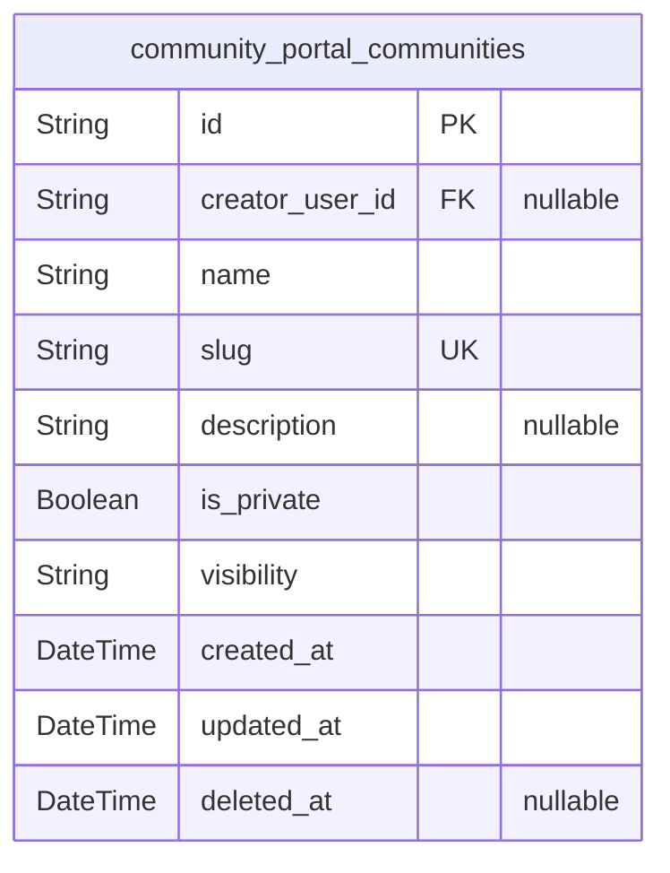
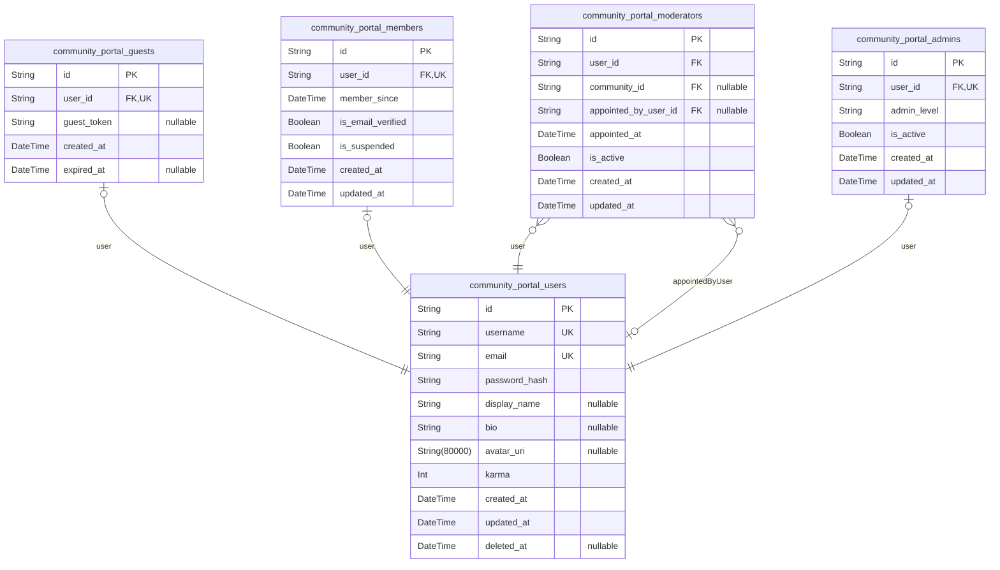
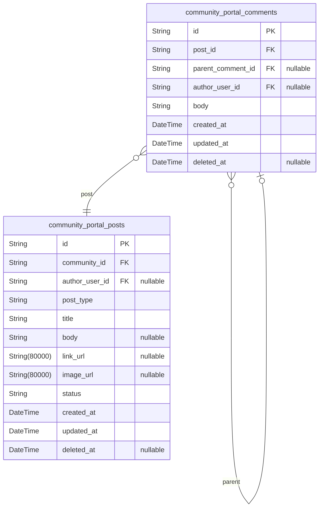
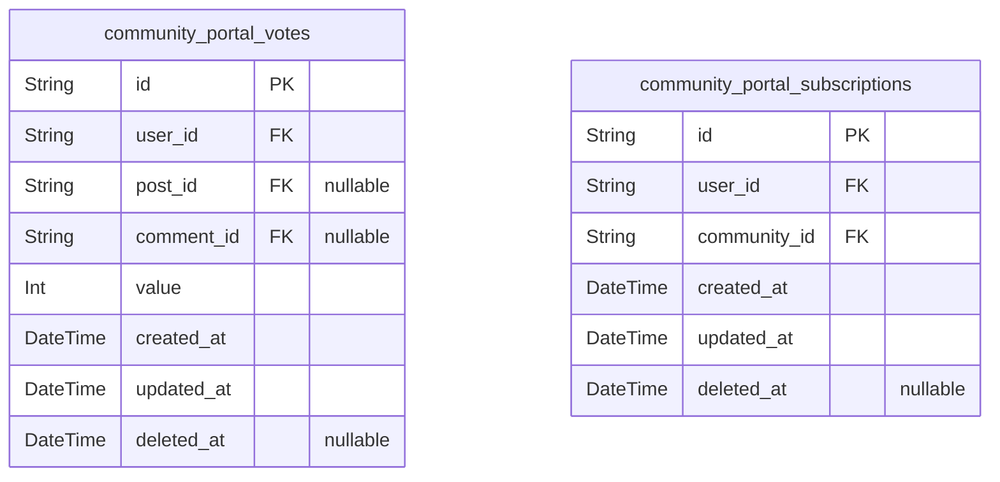
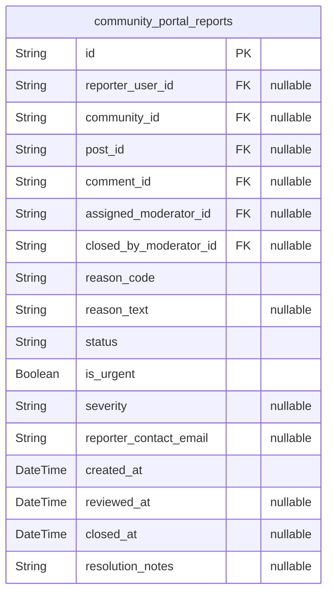

# Prisma Markdown

> Generated by [`prisma-markdown`](https://github.com/samchon/prisma-markdown)

- [Systematic](#systematic)
- [Actors](#actors)
- [Content](#content)
- [Interactions](#interactions)
- [Moderation](#moderation)

## Systematic

### `community_portal_communities`

Community records for communityPortal. Primary business entity
representing a topic-focused community where members create posts,
subscribe, and moderate content. Key relationships: creator user ({@link
community_portal_users.id}). Contains temporal fields for auditing and
soft-delete. Adjusted creator foreign key to be nullable to avoid
cascade-delete of communities when a user is removed. Use
application-level reassignment workflows or DB ON DELETE SET NULL.

Properties as follows:

- `id`: Primary Key.
- `creator_user_id`
  > Creator user's [community_portal_users.id](#community_portal_users). Nullable to avoid
  > cascade-deleting communities when the creator account is removed.
- `name`: Human-readable community title.
- `slug`
  > URL-friendly unique identifier (slug) for the community; enforce
  > case-insensitive uniqueness at DB-level (e.g., unique index on
  > lower(slug)) or canonicalize on write.
- `description`: Short community description or purpose statement.
- `is_private`: Whether the community is private (invite-only).
- `visibility`
  > Visibility policy (e.g., 'public' or 'private'). Consider converting to
  > an enum or check constraint to ensure consistent values.
- `created_at`: Record creation timestamp (UTC).
- `updated_at`: Last update timestamp (UTC).
- `deleted_at`: Soft-delete timestamp; null when record is active.

## Actors

### `community_portal_users`

Primary user accounts for communityPortal. Stores authentication and
profile data referenced by role tables and content entities. Key
relationships: referenced by {@\link community_portal_members.id},
{@\link community_portal_moderators.id}, {@\link
community_portal_admins.id}, and content tables (posts, comments, votes)
in other components. Use soft-delete (deleted_at) in practice; primary
operations should prefer soft-delete to preserve audit trails.

Properties as follows:

- `id`: Primary Key.
- `username`: Unique login handle used for authentication and public identity.
- `email`
  > Primary email address for the account. Must be unique. Used for
  > verification and notifications.
- `password_hash`: Password hash using secure algorithm (never store plain passwords).
- `display_name`: Optional human-friendly display name shown in the UI.
- `bio`
  > Optional profile biography text. Indexed for text search (GIN) to support
  > fuzzy matching.
- `avatar_uri`: Optional avatar image URI for the user profile.
- `karma`
  > Aggregated user karma score used for reputation and gating. Stored as
  > integer; authoritative calculation may be driven by vote events in other
  > components.
- `created_at`: Record creation timestamp.
- `updated_at`: Last modification timestamp for the user record.
- `deleted_at`
  > Soft-delete timestamp. When set, the user is considered deleted/archived
  > for business logic while preserving audit trails.

### `community_portal_guests`

Subsidiary table capturing guest-specific metadata linked to a primary
user account. Guests are lightweight accounts with limited privileges;
this table exists to track guest enrollment or ephemeral metadata without
polluting the main user record.

Properties as follows:

- `id`: Primary Key.
- `user_id`: Belonged user's {@\link community_portal_users.id}.
- `guest_token`: Optional short-lived token or metadata for guest sessions or invitations.
- `created_at`: When the guest record was created.
- `expired_at`: Optional expiration timestamp for guest status or token.

### `community_portal_members`

Subsidiary table for member-specific attributes tied to a primary user
account. Holds membership metadata such as verification and suspension
state and membership start date. One-to-one with community_portal_users
to support member-only attributes without bloating the core user table.

Properties as follows:

- `id`: Primary Key.
- `user_id`: Belonged user's {@\link community_portal_users.id}.
- `member_since`: Timestamp when the user became a member (verified).
- `is_email_verified`: Whether the member's email has been verified.
- `is_suspended`: Flag indicating whether the member account is suspended (platform action).
- `created_at`: Record creation timestamp for membership record.
- `updated_at`: Last update timestamp for membership record.

### `community_portal_moderators`

Moderator assignments with robust auditability. Each appointment
references the moderator user and the appointing user. The model
preserves timestamps and activation flags. Appointing actor is a foreign
key to community_portal_users to ensure referential integrity and easier
audit queries. Community reference is nullable to support global
moderators.

Properties as follows:

- `id`: Primary Key.
- `user_id`: Moderator's user reference. [community_portal_users.id](#community_portal_users).
- `community_id`
  > Assigned community's [community_portal_communities.id](#community_portal_communities). Nullable to
  > allow global moderators without single-community assignment.
- `appointed_by_user_id`
  > Appointing user's [community_portal_users.id](#community_portal_users). Nullable when
  > appointed by system or for legacy/backfill records.
- `appointed_at`: Timestamp when the moderator appointment was made.
- `is_active`: Whether the moderator assignment is currently active.
- `created_at`: Record creation timestamp for the moderator assignment.
- `updated_at`: Last update timestamp for the moderator assignment.

### `community_portal_admins`

Subsidiary table for platform admin accounts and admin-scoped metadata.
One-to-one with the primary user record. Stores admin level and
activation flag for elevated privileges; admin actions should always be
audited in external audit logs.

Properties as follows:

- `id`: Primary Key.
- `user_id`: Belonged user's {@\link community_portal_users.id}.
- `admin_level`
  > Admin level or role string (e.g., 'super', 'moderator_coordinator').
  > Defines scope of privileges; exact semantics are platform-defined.
- `is_active`: Whether the admin account is active and may perform admin actions.
- `created_at`: Timestamp when admin role was granted.
- `updated_at`: Last updated timestamp for admin record.

## Content

### `community_portal_posts`

Primary entity for community posts. Stores canonical post data (type,
title, body/link/image), community membership, author reference, and
temporal audit fields. Aggregated ranking signals (score, upvote_count,
downvote_count) MUST NOT be stored here per normalization rules; instead,
compute/store them in materialized views (mv_) or event-driven aggregate
tables. Author reference is nullable and should use SET NULL on user
deletion to preserve content auditability. {@link
community_portal_communities.id} [community_portal_users.id](#community_portal_users).

Properties as follows:

- `id`: Primary Key.
- `community_id`
  > Belonged community's [community_portal_communities.id](#community_portal_communities). Required; a
  > post must belong to a community.
- `author_user_id`
  > Authoring user's [community_portal_users.id](#community_portal_users). Nullable to allow
  > account deletion while preserving post content (SET NULL on user delete
  > recommended).
- `post_type`
  > Post type indicator: 'text', 'link', or 'image'. Determines which content
  > field is expected to be populated.
- `title`
  > User-facing title of the post. Use for listing and search. Recommend max
  > 300 chars at application level.
- `body`: Text body for text posts. Nullable for link/image posts.
- `link_url`: External link URL for link posts. Nullable for other post types.
- `image_url`
  > Representative image URL for image posts (for multi-image support use a
  > separate media table).
- `status`
  > Moderation state of the post (e.g., 'published', 'pending', 'removed').
  > Application enforces allowed values.
- `created_at`: Record creation timestamp (UTC).
- `updated_at`: Last update timestamp (UTC).
- `deleted_at`: Soft-delete timestamp. Null when not deleted.

### `community_portal_comments`

Primary entity for comments and nested replies. Stores canonical comment
text, parent/post references, author reference, and temporal audit
fields. Aggregated vote counters MUST NOT be stored here; surface
aggregates via materialized views or event-driven aggregate tables.
Preserve comments for audit on user deletion by using nullable author
reference and SET NULL semantics. [community_portal_posts.id](#community_portal_posts)
[community_portal_users.id](#community_portal_users).

Properties as follows:

- `id`: Primary Key.
- `post_id`
  > Parent post's [community_portal_posts.id](#community_portal_posts). Comment must belong to a
  > post.
- `parent_comment_id`
  > Optional parent comment's [community_portal_comments.id](#community_portal_comments) for nested
  > replies. Nullable for top-level comments.
- `author_user_id`
  > Authoring user's [community_portal_users.id](#community_portal_users). Nullable to allow
  > account deletion while preserving comment audit trail (SET NULL
  > recommended).
- `body`: Comment text body. Required for a valid comment.
- `created_at`: Comment creation timestamp (UTC).
- `updated_at`: Last update timestamp (UTC).
- `deleted_at`: Soft-delete timestamp. Null when not deleted.

## Interactions

### `community_portal_votes`

Vote records for the communityPortal. Stores individual user votes on
posts or comments. IMPORTANT: enforce DB-level constraints to guarantee a
vote targets exactly one entity (post XOR comment) and to enforce one
active vote per (user,target) using partial unique indexes. Because
Prisma PSL does not support partial indexes or CHECK constraints
natively, implement the CHECK constraint and partial unique indexes via a
raw SQL migration. Also prefer soft-delete semantics for parent entities
to preserve vote audit.

Properties as follows:

- `id`: Primary Key.
- `user_id`: Voter's [community_portal_users.id](#community_portal_users).
- `post_id`
  > Target post [community_portal_posts.id](#community_portal_posts). Nullable — a vote targets
  > either a post OR a comment. Enforce XOR at DB level.
- `comment_id`
  > Target comment [community_portal_comments.id](#community_portal_comments). Nullable — a vote
  > targets either a comment OR a post. Enforce XOR at DB level.
- `value`: Vote value: +1 for upvote, -1 for downvote.
- `created_at`: Record creation timestamp.
- `updated_at`: Record last updated timestamp.
- `deleted_at`: Soft-delete timestamp. Null when active.

### `community_portal_subscriptions`

Subscription records linking users to communities. Represents a user's
subscription to a community so it can be included in personalized feeds
and notifications. Each subscription references the subscriber ({@\link
community_portal_users.id}) and the community ({@\link
community_portal_communities.id}). Enforces uniqueness on (user_id,
community_id) to prevent duplicate subscriptions. Includes timestamps and
deleted_at for soft-delete/revocation auditing. Indexes support lookup by
user and by community.

Properties as follows:

- `id`: Primary Key.
- `user_id`: Subscriber's {@\link community_portal_users.id}.
- `community_id`: Subscribed community {@\link community_portal_communities.id}.
- `created_at`: Subscription creation timestamp.
- `updated_at`: Subscription last updated timestamp.
- `deleted_at`: Soft-delete timestamp for revoked subscriptions.

## Moderation

### `community_portal_reports`

Moderation reports for communityPortal. Records user-submitted reports
about posts, comments, or community-level issues. Designed to be an
auditable, appendable evidence record: reports must survive deletion of
related content or actors. This revised model enforces nullable FKs for
audit preservation, documents status semantics, and includes indexing
improvements to support moderator inbox and urgent-queue queries.

Properties as follows:

- `id`: Primary Key.
- `reporter_user_id`
  > Reporting user's [community_portal_users.id](#community_portal_users). Nullable for
  > anonymous reports. Set NULL on referenced user deletion to preserve
  > audit.
- `community_id`
  > Related community [community_portal_communities.id](#community_portal_communities). Nullable when
  > the report targets a cross-community item. Set NULL on community deletion
  > to preserve report history.
- `post_id`
  > Target post [community_portal_posts.id](#community_portal_posts). Nullable when the report
  > targets a comment or community-level issue. Set NULL on post deletion to
  > preserve the report record as evidence.
- `comment_id`
  > Target comment [community_portal_comments.id](#community_portal_comments). Nullable when the
  > report targets a post or community-level issue. Set NULL on comment
  > deletion to preserve the report record as evidence.
- `assigned_moderator_id`
  > Assigned moderator responsible for initial triage {@link
  > community_portal_moderators.id}. Nullable until assignment. Set NULL if
  > moderator account/assignment is removed to maintain report availability.
- `closed_by_moderator_id`
  > Moderator who closed or resolved the report {@link
  > community_portal_moderators.id}. Nullable until the report is closed. Set
  > NULL on moderator deletion to preserve audit trail referencing a
  > historical ID.
- `reason_code`
  > Controlled reason code for the report (e.g., 'spam', 'harassment',
  > 'hate', 'illegal', 'other'). Application SHOULD enforce a controlled
  > vocabulary; consider DB CHECK or enum in a later migration.
- `reason_text`
  > Optional free-text details provided by the reporter to explain the reason
  > for the report. Useful for moderation context and fuzzy search.
- `status`
  > Report lifecycle state. Allowed values (application-level): 'OPEN',
  > 'IN_REVIEW', 'REQUIRES_ACTION', 'DISMISSED', 'CLOSED'. Document these
  > values and enforce in application logic; consider DB enum/CHECK in
  > migration.
- `is_urgent`
  > Whether the reporter flagged this report as urgent and it requires
  > prioritized handling.
- `severity`
  > Severity level for triage (e.g., 'low', 'medium', 'high'). Use alongside
  > is_urgent for prioritization. Application MUST enforce allowed values.
- `reporter_contact_email`
  > Optional contact email captured at report submission for follow-up or
  > anonymous contact. Recommend limiting length (e.g., 254) and validating
  > format at application layer.
- `created_at`: Timestamp when the report was created.
- `reviewed_at`: Timestamp when a moderator first reviewed the report.
- `closed_at`: Timestamp when the report was resolved/closed.
- `resolution_notes`
  > Optional moderator notes describing the resolution or actions taken.
  > Auditable text; consider GIN indexing if search is supported.
