# Prisma Markdown

> Generated by [`prisma-markdown`](https://github.com/samchon/prisma-markdown)

- [Systematic](#systematic)
- [Actors](#actors)
- [Communities](#communities)
- [Posts](#posts)
- [Comments](#comments)
- [Votes](#votes)
- [Reports](#reports)
- [Subscriptions](#subscriptions)
- [Notifications](#notifications)
- [AuditAnalytics](#auditanalytics)
- [default](#default)

## Systematic

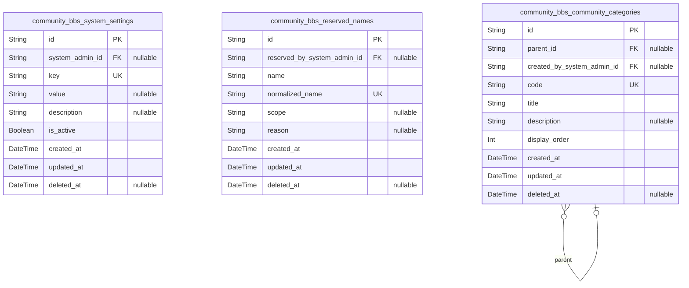
```mermaid
erDiagram
"community_bbs_system_settings" {
  String id PK
  String system_admin_id FK "nullable"
  String key UK
  String value "nullable"
  String description "nullable"
  Boolean is_active
  DateTime created_at
  DateTime updated_at
  DateTime deleted_at "nullable"
}
"community_bbs_reserved_names" {
  String id PK
  String reserved_by_system_admin_id FK "nullable"
  String name
  String normalized_name UK
  String scope "nullable"
  String reason "nullable"
  DateTime created_at
  DateTime updated_at
  DateTime deleted_at "nullable"
}
"community_bbs_community_categories" {
  String id PK
  String parent_id FK "nullable"
  String created_by_system_admin_id FK "nullable"
  String code UK
  String title
  String description "nullable"
  Int display_order
  DateTime created_at
  DateTime updated_at
  DateTime deleted_at "nullable"
}
"community_bbs_community_categories" }o--o| "community_bbs_community_categories" : parent
```

### `community_bbs_system_settings`

Global system configuration key/value pairs used for platform-wide
policies and feature flags. Managed by system administrators and
referenced by other domains for runtime behavior (e.g., post limits,
rate-limit thresholds). Contains auditing timestamps and optional
authoring admin reference. [community_bbs_systemadmin.id](#community_bbs_systemadmin).

Properties as follows:

- `id`: Primary Key.
- `system_admin_id`
  > Creator or last modifier system administrator. {@link
  > community_bbs_systemadmin.id}.
- `key`: Canonical settings key (example: "posts.default_edit_window_hours").
- `value`
  > Serialized value for the setting. Consumer interprets format
  > (string/JSON) according to key.
- `description`: Human-readable explanation of the setting purpose and acceptable values.
- `is_active`: Whether this setting is active and should be applied at runtime.
- `created_at`: Record creation timestamp.
- `updated_at`: Record last modification timestamp.
- `deleted_at`: Soft delete timestamp. Null when active.

### `community_bbs_reserved_names`

List of reserved or blocked community names and slugs enforced at
community creation and rename time. Records the responsible admin (if
any), scope, and rationale for the reservation. To enforce
case-insensitive uniqueness at the database level, this model includes a
normalized_name field which must be populated with lower(name) by the
application or migration. [community_bbs_systemadmin.id](#community_bbs_systemadmin).

Properties as follows:

- `id`: Primary Key.
- `reserved_by_system_admin_id`: System admin who reserved this name. [community_bbs_systemadmin.id](#community_bbs_systemadmin).
- `name`
  > Reserved community name or slug (original casing preserved for
  > presentation). Application should populate `normalized_name =
  > lower(name)` on insert/update.
- `normalized_name`
  > Lowercased normalized name used for case-insensitive uniqueness checks.
  > Must be populated as lower(name) by application or migration; add unique
  > constraint on this column.
- `scope`: Scope of reservation (e.g., "global", "community-specific").
- `reason`: Rationale or policy reference for the reservation.
- `created_at`: Timestamp when the reservation was created.
- `updated_at`: Timestamp when the reservation was last updated.
- `deleted_at`: Soft delete timestamp for expiration or revocation.

### `community_bbs_community_categories`

Taxonomy of community categories and topical classifications. Categories
can be hierarchical via parent relationship and are used for discovery,
filtering, and policy scoping. [community_bbs_systemadmin.id](#community_bbs_systemadmin) for
creator reference.

Properties as follows:

- `id`: Primary Key.
- `parent_id`
  > Optional parent category reference for hierarchical taxonomy. {@link
  > community_bbs_community_categories.id}.
- `created_by_system_admin_id`
  > System administrator who created or curates this category. {@link
  > community_bbs_systemadmin.id}.
- `code`: Short machine-friendly code for the category (unique).
- `title`: Human-readable category title shown in UIs.
- `description`: Longer description of the category and intended use.
- `display_order`: Ordering weight for UI lists; lower values sort earlier.
- `created_at`: Category creation timestamp.
- `updated_at`: Category last modified timestamp.
- `deleted_at`: Soft delete timestamp for deprecation or archival.

## Actors

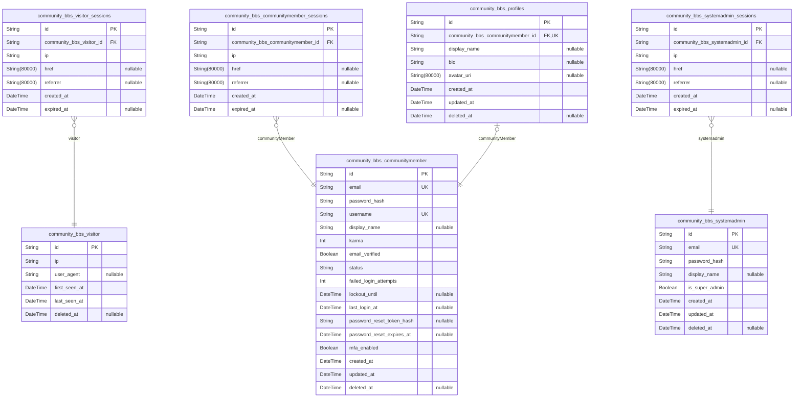
```mermaid
erDiagram
"community_bbs_visitor" {
  String id PK
  String ip
  String user_agent "nullable"
  DateTime first_seen_at
  DateTime last_seen_at
  DateTime deleted_at "nullable"
}
"community_bbs_visitor_sessions" {
  String id PK
  String community_bbs_visitor_id FK
  String ip
  String(80000) href "nullable"
  String(80000) referrer "nullable"
  DateTime created_at
  DateTime expired_at "nullable"
}
"community_bbs_communitymember" {
  String id PK
  String email UK
  String password_hash
  String username UK
  String display_name "nullable"
  Int karma
  Boolean email_verified
  String status
  Int failed_login_attempts
  DateTime lockout_until "nullable"
  DateTime last_login_at "nullable"
  String password_reset_token_hash "nullable"
  DateTime password_reset_expires_at "nullable"
  Boolean mfa_enabled
  DateTime created_at
  DateTime updated_at
  DateTime deleted_at "nullable"
}
"community_bbs_communitymember_sessions" {
  String id PK
  String community_bbs_communitymember_id FK
  String ip
  String(80000) href "nullable"
  String(80000) referrer "nullable"
  DateTime created_at
  DateTime expired_at "nullable"
}
"community_bbs_systemadmin" {
  String id PK
  String email UK
  String password_hash
  String display_name "nullable"
  Boolean is_super_admin
  DateTime created_at
  DateTime updated_at
  DateTime deleted_at "nullable"
}
"community_bbs_systemadmin_sessions" {
  String id PK
  String community_bbs_systemadmin_id FK
  String ip
  String(80000) href "nullable"
  String(80000) referrer "nullable"
  DateTime created_at
  DateTime expired_at "nullable"
}
"community_bbs_profiles" {
  String id PK
  String community_bbs_communitymember_id FK,UK
  String display_name "nullable"
  String bio "nullable"
  String(80000) avatar_uri "nullable"
  DateTime created_at
  DateTime updated_at
  DateTime deleted_at "nullable"
}
"community_bbs_visitor_sessions" }o--|| "community_bbs_visitor" : visitor
"community_bbs_communitymember_sessions" }o--|| "community_bbs_communitymember" : communityMember
"community_bbs_systemadmin_sessions" }o--|| "community_bbs_systemadmin" : systemadmin
"community_bbs_profiles" |o--|| "community_bbs_communitymember" : communityMember
```

### `community_bbs_visitor`

Records unauthenticated visitor identities for analytics, rate-limiting
fingerprints and soft-tracking. Stores lightweight connection metadata
(IP, user-agent, first_seen/last_seen) used for session creation in
[community_bbs_visitor_sessions.id](#community_bbs_visitor_sessions). This table is used for
transient visitor attribution and must not contain authentication
credentials.

Properties as follows:

- `id`: Primary Key.
- `ip`: IP address observed for the visitor session (string).
- `user_agent`: User agent string captured for attribution and analytics.
- `first_seen_at`: When this visitor fingerprint was first observed.
- `last_seen_at`: Most recent observation time for this visitor fingerprint.
- `deleted_at`
  > Soft-delete timestamp for visitor record when required by retention or
  > privacy.

### `community_bbs_visitor_sessions`

Actor-specific session table for anonymous visitors. Follows the exact
session table pattern: stores connection context and expiry for each
visitor session. Referencing visitor via {@link
community_bbs_visitor.id}. This table is subsidiary and used for tracking
ephemeral sessions.

Properties as follows:

- `id`: Primary Key.
- `community_bbs_visitor_id`: Belonged visitor's [community_bbs_visitor.id](#community_bbs_visitor).
- `ip`: IP address that initiated the session.
- `href`: Connection URL / landing href for the session (if available).
- `referrer`: Referrer URL for the session (if available).
- `created_at`: Session creation timestamp.
- `expired_at`: Session expiration timestamp (nullable if session is open-ended).

### `community_bbs_communitymember`

Authenticated community member accounts. Extended to include account
lifecycle, verification, lockout and password-reset metadata required by
authentication EARS: email verification, status lifecycle, failed login
tracking, lockout, last_login, and password reset token hash and expiry.
This model is the primary actor entity for community members and must
support secure account management, session revocation, and auditability.

Properties as follows:

- `id`: Primary Key.
- `email`
  > Verified email address for the member; business-unique contact. Used for
  > password reset and notifications.
- `password_hash`: Password hash used for authentication. Never store plain passwords.
- `username`: Unique username chosen by the member for display and discovery.
- `display_name`: Optional display name; used for presentation separate from username.
- `karma`: Reputation score aggregated from votes and system adjustments.
- `email_verified`
  > Whether the member's email has been verified. Default false until
  > verification completes.
- `status`
  > Account lifecycle status:
  > 'registered_unverified'|'registered_verified'|'suspended'|'banned'|'deleted_soft'.
  > Application enforces allowed values.
- `failed_login_attempts`: Count of recent failed login attempts used for progressive lockout rules.
- `lockout_until`
  > If set, the account is locked until this timestamp as part of progressive
  > lockout policies.
- `last_login_at`
  > Timestamp of the most recent successful login for operational reporting
  > and stale-account detection.
- `password_reset_token_hash`
  > Hash of the active password reset token when issued. Store only a hash,
  > not the token itself.
- `password_reset_expires_at`: Expiration time for the active password reset token, if any.
- `mfa_enabled`: Whether multi-factor authentication is enabled for this account.
- `created_at`: Account creation time.
- `updated_at`: Last profile or account update time.
- `deleted_at`: Soft-delete timestamp for account recovery and retention.

### `community_bbs_communitymember_sessions`

Session table for community members. Conforms strictly to the Session
Table Pattern: contains only allowed session fields and references the
community member via [community_bbs_communitymember.id](#community_bbs_communitymember). Used for
session listing, revocation, and audit trails.

Properties as follows:

- `id`: Primary Key.
- `community_bbs_communitymember_id`: Belonged community member's [community_bbs_communitymember.id](#community_bbs_communitymember).
- `ip`: IP address for the session.
- `href`: Connection URL for the session (landing page).
- `referrer`: Referrer URL for the session.
- `created_at`: Session creation time.
- `expired_at`: Session expiration time (nullable).

### `community_bbs_systemadmin`

Platform administrator accounts. Administrators are primary actor
entities with elevated privileges; this table stores authentication data,
admin role metadata, and temporal fields for audit. Admin sessions are
stored in [community_bbs_systemadmin_sessions.id](#community_bbs_systemadmin_sessions).

Properties as follows:

- `id`: Primary Key.
- `email`: Administrator email, used for authentication and official notifications.
- `password_hash`: Password hash for admin authentication.
- `display_name`: Administrator display name for audit logs and UI.
- `is_super_admin`: Flag indicating super-administrator privileges.
- `created_at`: Account creation timestamp.
- `updated_at`: Last update timestamp.
- `deleted_at`: Soft-delete timestamp for admin accounts.

### `community_bbs_systemadmin_sessions`

Session table for system administrators. Implements the Session Table
Pattern exactly: references [community_bbs_systemadmin.id](#community_bbs_systemadmin),
contains only allowed session context fields, and includes the composite
index required for session queries.

Properties as follows:

- `id`: Primary Key.
- `community_bbs_systemadmin_id`: Belonged admin's [community_bbs_systemadmin.id](#community_bbs_systemadmin).
- `ip`: IP address initiating the admin session.
- `href`: Connection URL context for this session.
- `referrer`: Referrer URL for the admin session.
- `created_at`: Session creation timestamp.
- `expired_at`: Session expiration timestamp (nullable).

### `community_bbs_profiles`

Member profile data supporting community_bbs_communitymember. Contains
presentation fields such as display_name, bio and avatar_uri. Managed as
a subsidiary table with a 1:1 relationship to
community_bbs_communitymember (enforced via unique FK). Snapshots and
audit trails are handled by other components.

Properties as follows:

- `id`: Primary Key.
- `community_bbs_communitymember_id`: Belonged community member's [community_bbs_communitymember.id](#community_bbs_communitymember).
- `display_name`: Optional display name for public profile presentation.
- `bio`
  > Short biography or profile description (business-limited length enforced
  > at application layer).
- `avatar_uri`: URI to the profile avatar image stored in media service.
- `created_at`: Profile creation timestamp.
- `updated_at`: Last profile update timestamp.
- `deleted_at`: Soft-delete timestamp for profile data.

## Communities

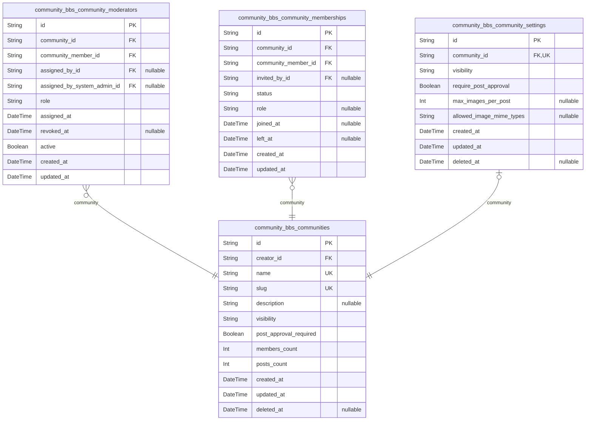
```mermaid
erDiagram
"community_bbs_communities" {
  String id PK
  String creator_id FK
  String name UK
  String slug UK
  String description "nullable"
  String visibility
  Boolean post_approval_required
  Int members_count
  Int posts_count
  DateTime created_at
  DateTime updated_at
  DateTime deleted_at "nullable"
}
"community_bbs_community_moderators" {
  String id PK
  String community_id FK
  String community_member_id FK
  String assigned_by_id FK "nullable"
  String assigned_by_system_admin_id FK "nullable"
  String role
  DateTime assigned_at
  DateTime revoked_at "nullable"
  Boolean active
  DateTime created_at
  DateTime updated_at
}
"community_bbs_community_memberships" {
  String id PK
  String community_id FK
  String community_member_id FK
  String invited_by_id FK "nullable"
  String status
  String role "nullable"
  DateTime joined_at "nullable"
  DateTime left_at "nullable"
  DateTime created_at
  DateTime updated_at
}
"community_bbs_community_settings" {
  String id PK
  String community_id FK,UK
  String visibility
  Boolean require_post_approval
  Int max_images_per_post "nullable"
  String allowed_image_mime_types "nullable"
  DateTime created_at
  DateTime updated_at
  DateTime deleted_at "nullable"
}
"community_bbs_community_moderators" }o--|| "community_bbs_communities" : community
"community_bbs_community_memberships" }o--|| "community_bbs_communities" : community
"community_bbs_community_settings" |o--|| "community_bbs_communities" : community
```

### `community_bbs_communities`

Primary business entity representing communities. Contains canonical
identity, visibility and cached counters. members_count and posts_count
are cached aggregates and should default to 0 (application or DB default)
to avoid nulls.

Properties as follows:

- `id`: Primary Key.
- `creator_id`: Creator community member's [community_bbs_communitymember.id](#community_bbs_communitymember).
- `name`: Canonical community name (unique, case-insensitive).
- `slug`: URL-friendly unique identifier for the community (unique).
- `description`: Short community description shown in listings and community header.
- `visibility`
  > Visibility policy: 'public', 'restricted', or 'private' (business enum
  > enforced in application).
- `post_approval_required`: Whether new posts require moderator approval before publishing.
- `members_count`
  > Cached number of community members for fast listing and metrics. DB
  > default should be 0.
- `posts_count`
  > Cached number of posts in the community for metrics and quotas. DB
  > default should be 0.
- `created_at`: Record creation timestamp.
- `updated_at`: Record last update timestamp.
- `deleted_at`: Soft-delete timestamp. Null if active.

### `community_bbs_community_moderators`

Moderator assignments for communities. Links a community to a member with
moderator privileges. Assignment provenance can originate from either a
member (owner) or a system administrator; to preserve referential
integrity both assigner FKs are represented. Moderator actions themselves
are recorded in moderation_action/audit tables for immutability.

Properties as follows:

- `id`: Primary Key.
- `community_id`: Belonged community's [community_bbs_communities.id](#community_bbs_communities).
- `community_member_id`: Assigned moderator's [community_bbs_communitymember.id](#community_bbs_communitymember).
- `assigned_by_id`
  > Actor (community member) who assigned the moderator. {@link
  > community_bbs_communitymember.id}. Nullable when assignment is performed
  > by system admin.
- `assigned_by_system_admin_id`
  > Optional system administrator who assigned the moderator. {@link
  > community_bbs_systemadmin.id}. Nullable when assigned by community
  > member.
- `role`: Moderator role or scope (e.g., 'moderator', 'senior_moderator').
- `assigned_at`: Timestamp when the moderator was assigned.
- `revoked_at`: Timestamp when moderator privileges were revoked (if any).
- `active`: Whether the moderator assignment is currently active.
- `created_at`: Record creation timestamp.
- `updated_at`: Record last update timestamp.

### `community_bbs_community_memberships`

Membership records representing a community member's relationship to a
community (join requests, approved members, banned members). Supports
membership lifecycle: requested, pending, approved, left, banned.
References community_bbs_communitymember for actor identity and
community_bbs_communities for the community. Used for membership lists,
join approvals, and membership counts.

Properties as follows:

- `id`: Primary Key.
- `community_id`: Target community's [community_bbs_communities.id](#community_bbs_communities).
- `community_member_id`: Member's [community_bbs_communitymember.id](#community_bbs_communitymember).
- `invited_by_id`
  > Optional inviter's [community_bbs_communitymember.id](#community_bbs_communitymember) for invite
  > flows.
- `status`
  > Membership status: 'requested','pending','member','left','banned'
  > (business values enforced at application level).
- `role`: Member-specific role inside community (e.g., 'member','contributor').
- `joined_at`: Timestamp when membership became active (approved).
- `left_at`: Timestamp when member left or was removed.
- `created_at`: Record creation timestamp (request created).
- `updated_at`: Record last update timestamp.

### `community_bbs_community_settings`

Per-community configuration allowing optional overrides of global
defaults. Null values indicate "use system default" semantics (e.g.,
max_images_per_post = null means use the global platform default). Stores
visibility override, moderation defaults, and media constraints. {@link
community_bbs_communities.id}.

Properties as follows:

- `id`: Primary Key.
- `community_id`
  > Referenced community's [community_bbs_communities.id](#community_bbs_communities). 1:1
  > constraint enforced by unique index.
- `visibility`
  > Community visibility override: 'public','restricted','private'
  > (application-level enum).
- `require_post_approval`: Whether posts from new members require moderator approval by default.
- `max_images_per_post`: Per-community limit for images per post. NULL means use global default.
- `allowed_image_mime_types`
  > Comma-separated list of allowed image MIME types for this community
  > (e.g., 'image/jpeg,image/png'). Consider migrating to JSON/text[] for
  > structured storage.
- `created_at`: Record creation timestamp.
- `updated_at`: Record last update timestamp.
- `deleted_at`: Soft-delete timestamp for settings row, if the community is removed.

## Posts

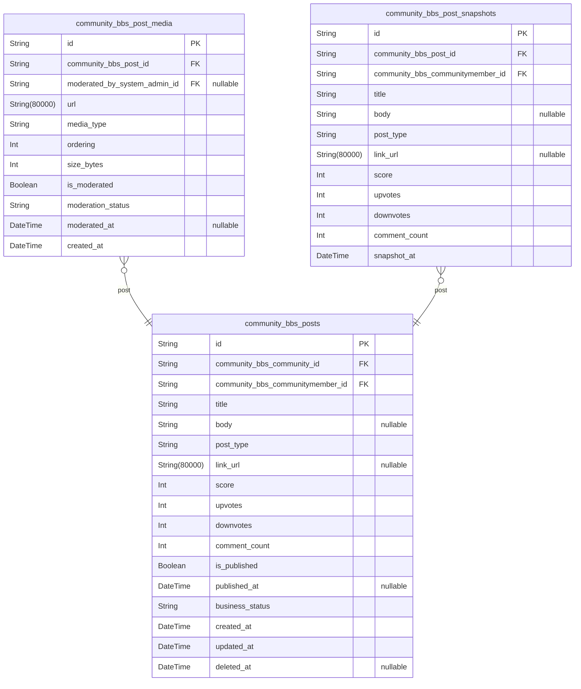
```mermaid
erDiagram
"community_bbs_posts" {
  String id PK
  String community_bbs_community_id FK
  String community_bbs_communitymember_id FK
  String title
  String body "nullable"
  String post_type
  String(80000) link_url "nullable"
  Int score
  Int upvotes
  Int downvotes
  Int comment_count
  Boolean is_published
  DateTime published_at "nullable"
  String business_status
  DateTime created_at
  DateTime updated_at
  DateTime deleted_at "nullable"
}
"community_bbs_post_media" {
  String id PK
  String community_bbs_post_id FK
  String moderated_by_system_admin_id FK "nullable"
  String(80000) url
  String media_type
  Int ordering
  Int size_bytes
  Boolean is_moderated
  String moderation_status
  DateTime moderated_at "nullable"
  DateTime created_at
}
"community_bbs_post_snapshots" {
  String id PK
  String community_bbs_post_id FK
  String community_bbs_communitymember_id FK
  String title
  String body "nullable"
  String post_type
  String(80000) link_url "nullable"
  Int score
  Int upvotes
  Int downvotes
  Int comment_count
  DateTime snapshot_at
}
"community_bbs_post_media" }o--|| "community_bbs_posts" : post
"community_bbs_post_snapshots" }o--|| "community_bbs_posts" : post
```

### `community_bbs_posts`

Primary posts table representing user-created posts (text/link/image)
inside communities. Added lifecycle and workflow fields to support
explicit moderation and publishing semantics (published_at,
business_status). Retains cached counters for scoring and includes
indexes to optimize feed and moderator queries. {@link
community_bbs_communities.id} [community_bbs_communitymember.id](#community_bbs_communitymember).

Properties as follows:

- `id`: Primary Key.
- `community_bbs_community_id`: Belonged community's [community_bbs_communities.id](#community_bbs_communities).
- `community_bbs_communitymember_id`: Authoring member's [community_bbs_communitymember.id](#community_bbs_communitymember).
- `title`: Post title up to 300 characters; used for display and search.
- `body`
  > Post body for text posts; nullable for link/image posts. Stores raw
  > content; heavy media lives in post_media.
- `post_type`
  > Post type identifier (text, link, image). Application enforces allowed
  > values.
- `link_url`: For link posts, the validated http/https URL. Nullable otherwise.
- `score`
  > Cached score used for ranking. Maintained by application logic (not
  > authoritative event log).
- `upvotes`: Cached upvote count for quick reads.
- `downvotes`: Cached downvote count for quick reads.
- `comment_count`: Cached number of comments for feed display.
- `is_published`
  > Whether the post is published/visible (consider moderation/pending
  > states).
- `published_at`
  > Timestamp when the post was made publicly visible. Nullable for
  > drafts/pending posts. Use this for feed time-window calculations and
  > 'top' queries.
- `business_status`
  > Business workflow status for the post (e.g.,
  > 'draft','pending_moderation','published','removed'). Application enforces
  > allowed values and transitions.
- `created_at`: Post creation timestamp.
- `updated_at`: Last modification timestamp.
- `deleted_at`: Soft-delete timestamp; null when active.

### `community_bbs_post_media`

Media attachments for posts. Each record represents one media item
attached to a post. Added operational metadata to support media-size
enforcement, moderation triage, and auditability (size_bytes,
moderation_status, moderated_by_system_admin_id, moderated_at). Related
[community_bbs_posts.id](#community_bbs_posts).

Properties as follows:

- `id`: Primary Key.
- `community_bbs_post_id`: Referenced post's [community_bbs_posts.id](#community_bbs_posts).
- `moderated_by_system_admin_id`
  > System admin who performed moderation on the media (nullable). {@link
  > community_bbs_systemadmin.id}.
- `url`: Canonical URL to media (CDN or object store).
- `media_type`
  > Media MIME-type or category (image/jpeg, image/png, image/gif).
  > Application enforces allowed types.
- `ordering`: Display ordering within the post (0-based).
- `size_bytes`
  > Size of the media file in bytes. Used to validate per-file and per-post
  > payload limits.
- `is_moderated`: Whether the media has been reviewed by automated or human moderation.
- `moderation_status`
  > Moderation outcome for the media (e.g., 'pending','approved','rejected').
  > Application enforces allowed values.
- `moderated_at`
  > Timestamp when moderation decision was applied (nullable if still
  > pending).
- `created_at`: Attachment creation time.

### `community_bbs_post_snapshots`

Append-only snapshot table capturing point-in-time state of posts for
auditing, historical feeds, and rollback. Each snapshot records the
post's business fields at snapshot time. Snapshots are created by
application services when significant state changes occur (publish, edit,
moderation action).

Properties as follows:

- `id`: Primary Key.
- `community_bbs_post_id`: Referenced canonical post's [community_bbs_posts.id](#community_bbs_posts).
- `community_bbs_communitymember_id`: Author at snapshot time [community_bbs_communitymember.id](#community_bbs_communitymember).
- `title`: Snapshot of the post title at snapshot time.
- `body`: Snapshot of the post body (nullable for link/image posts).
- `post_type`: Post type at snapshot time (text/link/image).
- `link_url`: Link URL if applicable at snapshot time.
- `score`: Cached score when snapshot was taken.
- `upvotes`: Cached upvote count at snapshot time.
- `downvotes`: Cached downvote count at snapshot time.
- `comment_count`: Cached comment count at snapshot time.
- `snapshot_at`: Timestamp when snapshot was captured.

## Comments

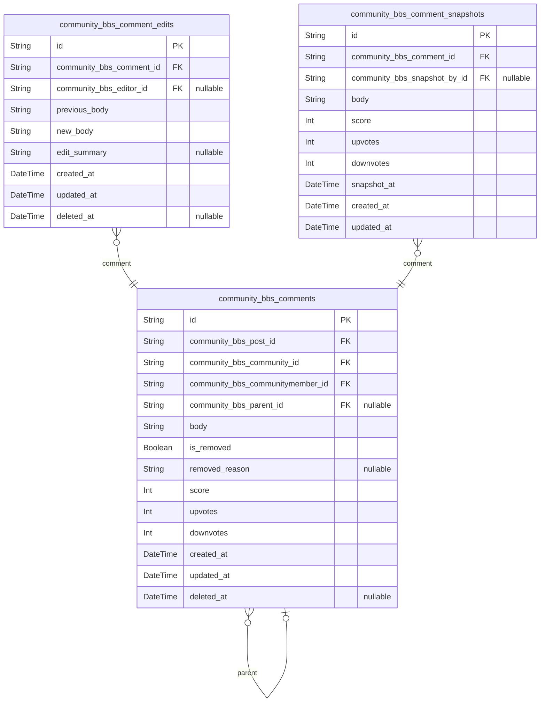
```mermaid
erDiagram
"community_bbs_comments" {
  String id PK
  String community_bbs_post_id FK
  String community_bbs_community_id FK
  String community_bbs_communitymember_id FK
  String community_bbs_parent_id FK "nullable"
  String body
  Boolean is_removed
  String removed_reason "nullable"
  Int score
  Int upvotes
  Int downvotes
  DateTime created_at
  DateTime updated_at
  DateTime deleted_at "nullable"
}
"community_bbs_comment_edits" {
  String id PK
  String community_bbs_comment_id FK
  String community_bbs_editor_id FK "nullable"
  String previous_body
  String new_body
  String edit_summary "nullable"
  DateTime created_at
  DateTime updated_at
  DateTime deleted_at "nullable"
}
"community_bbs_comment_snapshots" {
  String id PK
  String community_bbs_comment_id FK
  String community_bbs_snapshot_by_id FK "nullable"
  String body
  Int score
  Int upvotes
  Int downvotes
  DateTime snapshot_at
  DateTime created_at
  DateTime updated_at
}
"community_bbs_comments" }o--o| "community_bbs_comments" : parent
"community_bbs_comment_edits" }o--|| "community_bbs_comments" : comment
"community_bbs_comment_snapshots" }o--|| "community_bbs_comments" : comment
```

### `community_bbs_comments`

Primary table for comment threads and nested replies. Stores individual
comment entries posted to community posts. Each comment references the
parent post ([community_bbs_posts.id](#community_bbs_posts)), the owning community
([community_bbs_communities.id](#community_bbs_communities)), and the author ({@link
community_bbs_communitymember.id}). Replies are represented by an
optional self-reference ([community_bbs_comments.id](#community_bbs_comments)). Includes
temporal fields for auditing and a soft-delete column for recoverability.
Indexes use composite FK+created_at patterns for common query patterns.
GIN index provided on body for text search.

Properties as follows:

- `id`: Primary Key.
- `community_bbs_post_id`: Belonged post's [community_bbs_posts.id](#community_bbs_posts).
- `community_bbs_community_id`: Belonged community's [community_bbs_communities.id](#community_bbs_communities).
- `community_bbs_communitymember_id`: Authoring community member's [community_bbs_communitymember.id](#community_bbs_communitymember).
- `community_bbs_parent_id`
  > Parent comment's [community_bbs_comments.id](#community_bbs_comments) (nullable for root
  > comments).
- `body`
  > Canonical comment body in markdown/plain text. Use for rendering and
  > search.
- `is_removed`: Whether the comment was removed by moderation or author.
- `removed_reason`: Short moderation reason code or freeform note explaining removal.
- `score`
  > Cached score used for ranking (derived from votes). Application logic
  > must maintain this.
- `upvotes`: Cached upvote count. Maintained by application vote flows.
- `downvotes`: Cached downvote count. Maintained by application vote flows.
- `created_at`: Comment creation timestamp.
- `updated_at`: Last modification timestamp for the comment.
- `deleted_at`: Soft-delete timestamp; null when not deleted.

### `community_bbs_comment_edits`

Edit history for comments. Each record captures a single edit operation
for a comment: who edited, previous and new body, optional edit summary,
and timestamps. This subsidiary table preserves edit audit trails without
polluting the main comment record. Includes created_at and updated_at for
parity with temporal conventions.

Properties as follows:

- `id`: Primary Key.
- `community_bbs_comment_id`: Edited comment's [community_bbs_comments.id](#community_bbs_comments).
- `community_bbs_editor_id`
  > Editor community member's [community_bbs_communitymember.id](#community_bbs_communitymember).
  > Nullable for system-applied edits.
- `previous_body`: Previous comment body before the edit.
- `new_body`: New comment body after the edit.
- `edit_summary`: Optional short summary or reason for the edit provided by the editor.
- `created_at`: Timestamp when the edit was created.
- `updated_at`
  > Last update timestamp for the edit record (for reconciliation or
  > corrections).
- `deleted_at`
  > Soft-delete for edit records if removal is required for legal/compliance
  > reasons.

### `community_bbs_comment_snapshots`

Append-only snapshots capturing point-in-time state of a comment for
audit, historical display, and rollback. Each snapshot records comment
fields required to fully reconstruct the comment state at snapshot_at.
Includes created_at and updated_at for reconciliation metadata.

Properties as follows:

- `id`: Primary Key.
- `community_bbs_comment_id`: Source comment's [community_bbs_comments.id](#community_bbs_comments).
- `community_bbs_snapshot_by_id`
  > Actor (user or system) who created the snapshot. References {@link
  > community_bbs_communitymember.id}. Nullable when snapshot generated by
  > background system process.
- `body`: Comment body captured at snapshot time.
- `score`: Cached score value at snapshot time.
- `upvotes`: Upvote count at snapshot time.
- `downvotes`: Downvote count at snapshot time.
- `snapshot_at`: Timestamp representing the point-in-time the snapshot captures.
- `created_at`: Record creation timestamp.
- `updated_at`: Last update timestamp for reconciliation metadata.

## Votes

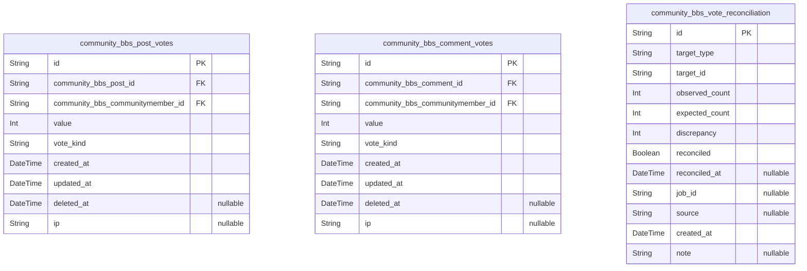
```mermaid
erDiagram
"community_bbs_post_votes" {
  String id PK
  String community_bbs_post_id FK
  String community_bbs_communitymember_id FK
  Int value
  String vote_kind
  DateTime created_at
  DateTime updated_at
  DateTime deleted_at "nullable"
  String ip "nullable"
}
"community_bbs_comment_votes" {
  String id PK
  String community_bbs_comment_id FK
  String community_bbs_communitymember_id FK
  Int value
  String vote_kind
  DateTime created_at
  DateTime updated_at
  DateTime deleted_at "nullable"
  String ip "nullable"
}
"community_bbs_vote_reconciliation" {
  String id PK
  String target_type
  String target_id
  Int observed_count
  Int expected_count
  Int discrepancy
  Boolean reconciled
  DateTime reconciled_at "nullable"
  String job_id "nullable"
  String source "nullable"
  DateTime created_at
  String note "nullable"
}
```

### `community_bbs_post_votes`

Durable per-post vote events. Records each community member's
upvote/downvote on a post to support audit, anti-abuse detection, and
reconciliation. Added a canonical 'vote_kind' discriminator ('up'|'down')
to improve human-readability and to support safe migrations. The numeric
'value' remains for aggregation; database-level CHECK (value IN (1,-1))
should be added in migration SQL. [community_bbs_posts.id](#community_bbs_posts) {@link
community_bbs_communitymember.id}.

Properties as follows:

- `id`: Primary Key.
- `community_bbs_post_id`: Target post's [community_bbs_posts.id](#community_bbs_posts).
- `community_bbs_communitymember_id`: Voting community member's [community_bbs_communitymember.id](#community_bbs_communitymember).
- `value`
  > Vote numeric value: +1 for upvote, -1 for downvote. DB CHECK constraint
  > recommended: value IN (1,-1).
- `vote_kind`
  > Canonical human-readable vote discriminator. Allowed values: 'up' or
  > 'down'. This field improves auditability and should be backfilled from
  > value during migration.
- `created_at`: Event creation timestamp.
- `updated_at`
  > Event last update timestamp. For append-only semantics this typically
  > equals created_at until a vote is changed or soft-deleted.
- `deleted_at`: Soft-delete timestamp for reversible removals.
- `ip`
  > Optional source IP for abuse detection and forensics (consider hashed
  > storage if privacy concerns require).

### `community_bbs_comment_votes`

Durable per-comment vote events. Records each community member's
upvote/downvote on a comment for audit, ranking, and abuse detection.
Added 'vote_kind' discriminator ('up'|'down') to mirror post_votes and
support safe backfills. Keep numeric 'value' for aggregation; enforce DB
CHECK (value IN (1,-1)) in migration SQL. {@link
community_bbs_comments.id} [community_bbs_communitymember.id](#community_bbs_communitymember).

Properties as follows:

- `id`: Primary Key.
- `community_bbs_comment_id`: Target comment's [community_bbs_comments.id](#community_bbs_comments).
- `community_bbs_communitymember_id`: Voting community member's [community_bbs_communitymember.id](#community_bbs_communitymember).
- `value`
  > Vote numeric value: +1 for upvote, -1 for downvote. DB CHECK recommended:
  > value IN (1,-1).
- `vote_kind`
  > Canonical human-readable vote discriminator. Allowed values: 'up' or
  > 'down'. Backfill from value is required during migration.
- `created_at`: Event creation timestamp.
- `updated_at`: Event last update timestamp.
- `deleted_at`: Soft-delete timestamp for reversible removals.
- `ip`
  > Optional source IP for abuse detection and forensics (consider hashed
  > storage if privacy concerns require).

### `community_bbs_vote_reconciliation`

Append-only reconciliation snapshots for vote aggregates and anomaly
detection. Added optional job_id and source fields to trace
reconciliation runs and support idempotent re-runs. Stores observed vs
expected counts and reconciliation metadata used by anti-abuse and daily
reconciliation jobs.

Properties as follows:

- `id`: Primary Key.
- `target_type`: Target entity type for this reconciliation (e.g., 'post' or 'comment').
- `target_id`: Identifier of the target entity (post or comment) at the time of snapshot.
- `observed_count`
  > Observed vote count derived from raw vote events during reconciliation
  > window.
- `expected_count`: Expected vote count from cached aggregates or secondary systems.
- `discrepancy`
  > Computed difference (observed_count - expected_count). Non-zero values
  > flag anomalies.
- `reconciled`: Whether reconciliation actions have been taken to resolve the discrepancy.
- `reconciled_at`: Timestamp of reconciliation action, if any.
- `job_id`
  > Optional identifier of the reconciliation job/run that produced this
  > snapshot (for traceability and idempotent reruns).
- `source`
  > Optional source or agent that produced the reconciliation result (e.g.,
  > 'daily_job','on_demand','operator:<id>').
- `created_at`: Snapshot creation timestamp.
- `note`: Optional operator note or automated reconciliation reason.

## Reports

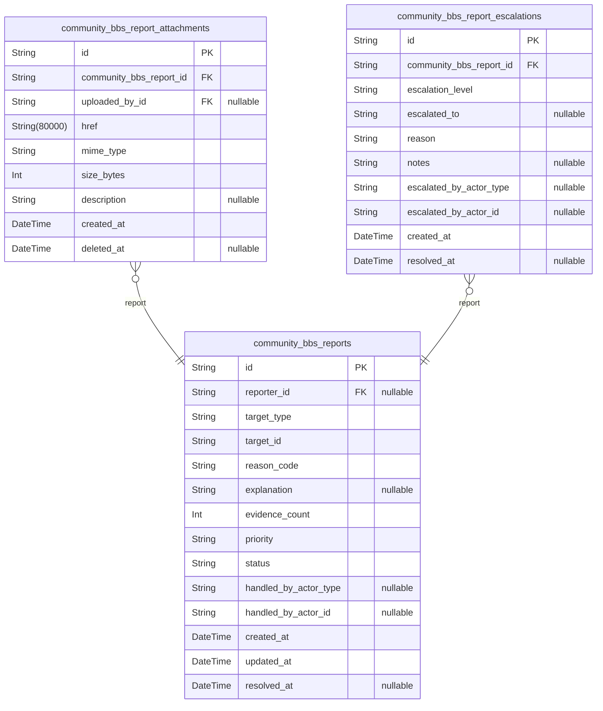
```mermaid
erDiagram
"community_bbs_reports" {
  String id PK
  String reporter_id FK "nullable"
  String target_type
  String target_id
  String reason_code
  String explanation "nullable"
  Int evidence_count
  String priority
  String status
  String handled_by_actor_type "nullable"
  String handled_by_actor_id "nullable"
  DateTime created_at
  DateTime updated_at
  DateTime resolved_at "nullable"
}
"community_bbs_report_attachments" {
  String id PK
  String community_bbs_report_id FK
  String uploaded_by_id FK "nullable"
  String(80000) href
  String mime_type
  Int size_bytes
  String description "nullable"
  DateTime created_at
  DateTime deleted_at "nullable"
}
"community_bbs_report_escalations" {
  String id PK
  String community_bbs_report_id FK
  String escalation_level
  String escalated_to "nullable"
  String reason
  String notes "nullable"
  String escalated_by_actor_type "nullable"
  String escalated_by_actor_id "nullable"
  DateTime created_at
  DateTime resolved_at "nullable"
}
"community_bbs_report_attachments" }o--|| "community_bbs_reports" : report
"community_bbs_report_escalations" }o--|| "community_bbs_reports" : report
```

### `community_bbs_reports`

Primary report records capturing user-submitted reports against
polymorphic targets (post, comment, community, or user). Updated to
implement polymorphic handler attribution using an actor discriminator
pair (handled_by_actor_type, handled_by_actor_id) so both community
moderators and system administrators (and automated systems) can be
recorded as the handler. Retains reporter FK and target_type/target_id.
Adds index for handler actor fields and preserves GIN on explanation.

Properties as follows:

- `id`: Primary Key.
- `reporter_id`
  > Reporting community member's [community_bbs_communitymember.id](#community_bbs_communitymember).
  > Nullable to support anonymous reports.
- `target_type`
  > Polymorphic target type identifier (e.g.,
  > "post","comment","community","user"). Application-level discriminator for
  > target_id.
- `target_id`
  > Polymorphic target identifier. Application must resolve this against the
  > table indicated by target_type.
- `reason_code`
  > Standardized reason code for triage (e.g.,
  > "spam","harassment","copyright","illegal").
- `explanation`
  > Optional reporter-supplied explanation or details (free text) to support
  > triage.
- `evidence_count`
  > Number of attachments/evidence items associated with this report.
  > Maintained by application logic.
- `priority`
  > Triage priority (e.g., 'low','medium','high','critical'). Use canonical
  > values from business rules.
- `status`: Report lifecycle status (e.g., 'open','in_review','resolved','dismissed').
- `handled_by_actor_type`
  > Actor class that handled this report (e.g.,
  > 'community_moderator','system_admin','automation'). Enables polymorphic
  > handler attribution without multiple nullable FKs.
- `handled_by_actor_id`
  > Actor identifier for the handler. Interpretation depends on
  > handled_by_actor_type (application resolves to moderator id, system_admin
  > id, or null for automated).
- `created_at`: Report creation timestamp.
- `updated_at`: Last update timestamp for the report record.
- `resolved_at`: Timestamp when the report was resolved (if applicable).

### `community_bbs_report_attachments`

Attachments and evidentiary artifacts associated with reports. Stores
durable URIs, MIME type, file size and optional description. Subordinate
to community_bbs_reports and designed for audit/evidence preservation.

Properties as follows:

- `id`: Primary Key.
- `community_bbs_report_id`: Owning report reference. [community_bbs_reports.id](#community_bbs_reports).
- `uploaded_by_id`
  > Uploader identity if available [community_bbs_communitymember.id](#community_bbs_communitymember).
  > Nullable for anonymous or system uploads.
- `href`
  > Canonical URI to the stored evidence artifact (object storage or forensic
  > snapshot).
- `mime_type`
  > MIME type of the attachment (e.g., image/jpeg, video/mp4,
  > application/pdf).
- `size_bytes`: Size of the attachment in bytes.
- `description`: Optional description or contextual note about the attachment.
- `created_at`: Attachment upload timestamp.
- `deleted_at`: Soft-delete timestamp for attachment (if removed from evidence set).

### `community_bbs_report_escalations`

Escalation records for reports capturing triage decisions, escalation
target (internal or external), timestamps, and resolution outcomes.
Modified to support polymorphic escalator attribution via
escalated_by_actor_type and escalated_by_actor_id to allow
moderator-initiated escalations, admin escalations, and automated
escalations. Keeps report FK and provides indexes for escalator actor
lookups.

Properties as follows:

- `id`: Primary Key.
- `community_bbs_report_id`: Reference to the originating report. [community_bbs_reports.id](#community_bbs_reports).
- `escalation_level`: Escalation level (e.g., 'moderator','admin','legal','law_enforcement').
- `escalated_to`
  > Optional free-text target (external agency identifier or internal team)
  > to which the report was escalated.
- `reason`: Business justification for escalation captured at the time of escalation.
- `notes`: Operator notes and summary of actions taken during escalation.
- `escalated_by_actor_type`
  > Actor class that initiated the escalation (e.g.,
  > 'community_moderator','system_admin','automation'). Allows polymorphic
  > attribution.
- `escalated_by_actor_id`
  > Actor identifier for the escalator; interpretation depends on
  > escalated_by_actor_type.
- `created_at`: Escalation creation timestamp.
- `resolved_at`: When escalation was resolved or closed (if applicable).

## Subscriptions

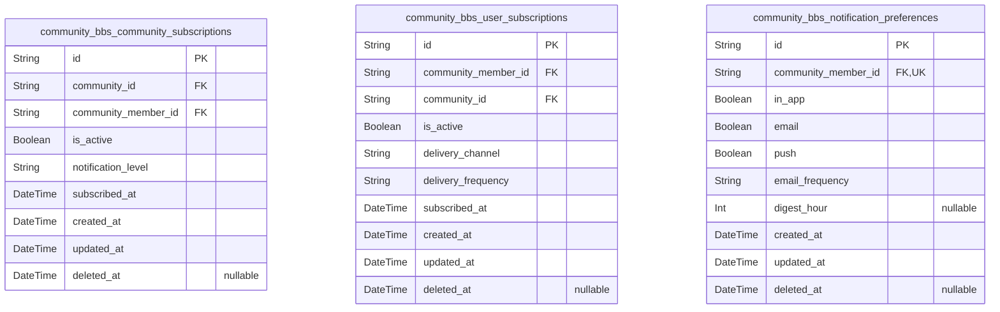
```mermaid
erDiagram
"community_bbs_community_subscriptions" {
  String id PK
  String community_id FK
  String community_member_id FK
  Boolean is_active
  String notification_level
  DateTime subscribed_at
  DateTime created_at
  DateTime updated_at
  DateTime deleted_at "nullable"
}
"community_bbs_user_subscriptions" {
  String id PK
  String community_member_id FK
  String community_id FK
  Boolean is_active
  String delivery_channel
  String delivery_frequency
  DateTime subscribed_at
  DateTime created_at
  DateTime updated_at
  DateTime deleted_at "nullable"
}
"community_bbs_notification_preferences" {
  String id PK
  String community_member_id FK,UK
  Boolean in_app
  Boolean email
  Boolean push
  String email_frequency
  Int digest_hour "nullable"
  DateTime created_at
  DateTime updated_at
  DateTime deleted_at "nullable"
}
```

### `community_bbs_community_subscriptions`

Community-centric subscription record: one row per community-member
subscription. Added soft-delete timestamp (deleted_at) to align temporal
lifecycle fields with project-wide retention and account-deletion
workflows. References community [community_bbs_communities.id](#community_bbs_communities) and
subscriber's member record [community_bbs_communitymember.id](#community_bbs_communitymember).

Properties as follows:

- `id`: Primary Key.
- `community_id`: Belonged community's [community_bbs_communities.id](#community_bbs_communities).
- `community_member_id`: Subscribed member's [community_bbs_communitymember.id](#community_bbs_communitymember).
- `is_active`
  > Whether the subscription is currently active. Used for soft-unsubscribe
  > and quick feed filtering.
- `notification_level`
  > Subscription-level preference for community notifications (business
  > values: 'all','mentions','none').
- `subscribed_at`: Timestamp when the subscription was created (member subscribed at).
- `created_at`: Record creation timestamp.
- `updated_at`: Record last update timestamp.
- `deleted_at`
  > Soft-delete timestamp for subscription record (nullable for active
  > subscriptions).

### `community_bbs_user_subscriptions`

User-centric subscription record representing a member's subscription to
a single community. Added subscribed_at and deleted_at to align
temporally with community-centric subscriptions and to support consistent
retention and analytics. References user {@link
community_bbs_communitymember.id} and community {@link
community_bbs_communities.id}.

Properties as follows:

- `id`: Primary Key.
- `community_member_id`: Owner member's [community_bbs_communitymember.id](#community_bbs_communitymember).
- `community_id`: Subscribed community's [community_bbs_communities.id](#community_bbs_communities).
- `is_active`: Active flag for the subscription (soft-unsubscribe semantics).
- `delivery_channel`
  > Preferred delivery channel for this subscription (e.g.,
  > 'in_app','email','push').
- `delivery_frequency`
  > Delivery frequency for batched notifications (e.g.,
  > 'immediate','hourly','daily').
- `subscribed_at`
  > Timestamp when the subscription was created (keeps parity with
  > community-centric subscription).
- `created_at`: Record creation timestamp.
- `updated_at`: Record last update timestamp.
- `deleted_at`: Soft-delete timestamp for subscription record (nullable).

### `community_bbs_notification_preferences`

Per-member global notification preferences. Stores channel opt-ins, email
frequency, and push/in-app toggles. Added deleted_at to support account
deletion and retention policies. References member {@link
community_bbs_communitymember.id}.

Properties as follows:

- `id`: Primary Key.
- `community_member_id`: Owner member's [community_bbs_communitymember.id](#community_bbs_communitymember).
- `in_app`: Whether in-app notifications are enabled for the member.
- `email`: Whether email notifications are enabled for the member.
- `push`: Whether push notifications are enabled for the member.
- `email_frequency`: Preferred email digest frequency (e.g., 'immediate','hourly','daily').
- `digest_hour`
  > Preferred hour of day (0-23) to send daily digests when applicable.
  > Nullable when not applicable.
- `created_at`: Record creation timestamp.
- `updated_at`: Record last update timestamp.
- `deleted_at`: Soft-delete timestamp to support account deletion workflows.

## Notifications

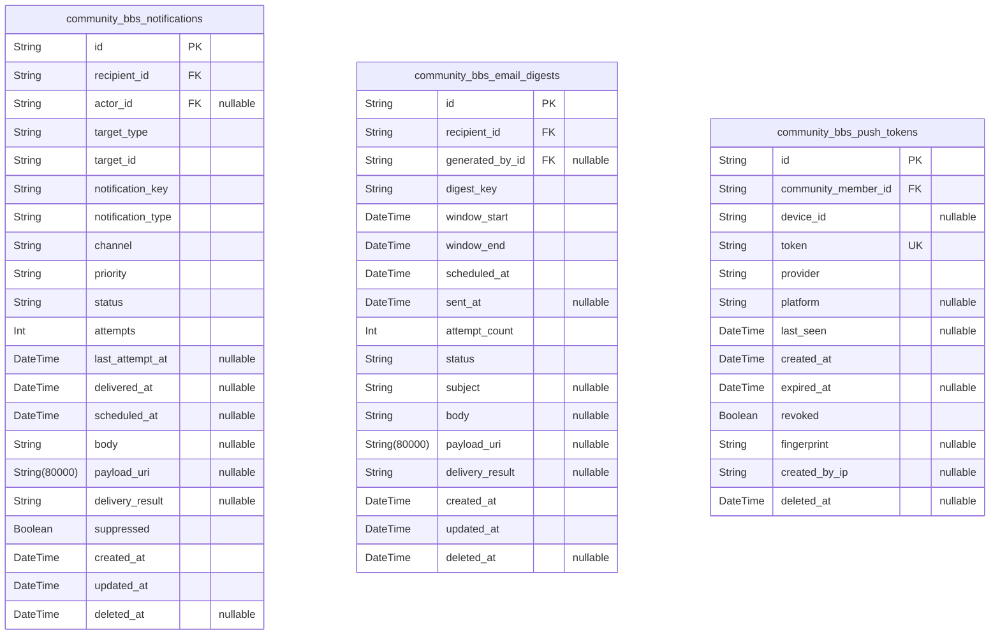
```mermaid
erDiagram
"community_bbs_notifications" {
  String id PK
  String recipient_id FK
  String actor_id FK "nullable"
  String target_type
  String target_id
  String notification_key
  String notification_type
  String channel
  String priority
  String status
  Int attempts
  DateTime last_attempt_at "nullable"
  DateTime delivered_at "nullable"
  DateTime scheduled_at "nullable"
  String body "nullable"
  String(80000) payload_uri "nullable"
  String delivery_result "nullable"
  Boolean suppressed
  DateTime created_at
  DateTime updated_at
  DateTime deleted_at "nullable"
}
"community_bbs_email_digests" {
  String id PK
  String recipient_id FK
  String generated_by_id FK "nullable"
  String digest_key
  DateTime window_start
  DateTime window_end
  DateTime scheduled_at
  DateTime sent_at "nullable"
  Int attempt_count
  String status
  String subject "nullable"
  String body "nullable"
  String(80000) payload_uri "nullable"
  String delivery_result "nullable"
  DateTime created_at
  DateTime updated_at
  DateTime deleted_at "nullable"
}
"community_bbs_push_tokens" {
  String id PK
  String community_member_id FK
  String device_id "nullable"
  String token UK
  String provider
  String platform "nullable"
  DateTime last_seen "nullable"
  DateTime created_at
  DateTime expired_at "nullable"
  Boolean revoked
  String fingerprint "nullable"
  String created_by_ip "nullable"
  DateTime deleted_at "nullable"
}
```

### `community_bbs_notifications`

Durable notification records representing an attempt to notify a specific
recipient about an application event. Reworked to use a polymorphic
discriminator (target_type, target_id) rather than multiple nullable FK
columns to avoid nullable-FK polymorphic anti-pattern and to ensure a
single canonical reference to the target entity. Keeps deduplication via
(recipient_id, notification_key), supports delivery metadata, and indexes
for delivery queues and moderation queries.

Properties as follows:

- `id`: Primary Key.
- `recipient_id`: Target recipient's [community_bbs_communitymember.id](#community_bbs_communitymember).
- `actor_id`
  > Initiating actor's [community_bbs_communitymember.id](#community_bbs_communitymember). Nullable
  > when system-generated.
- `target_type`
  > Polymorphic target type discriminator (e.g.,
  > 'post','comment','community','user'). Application resolves target_id
  > against the type.
- `target_id`: Identifier of the target entity referenced by target_type.
- `notification_key`
  > Canonical deduplication key for this logical notification event (used
  > with recipient_id to prevent duplicate deliveries).
- `notification_type`
  > Semantic type of the notification (e.g.,
  > 'reply','mention','moderator_action').
- `channel`: Primary delivery channel intended (e.g., 'in_app','email','push').
- `priority`: Delivery priority (e.g., 'critical','high','medium','low').
- `status`
  > Operational delivery status (e.g.,
  > 'pending','attempting','delivered','failed','suppressed').
- `attempts`: Number of delivery attempts performed.
- `last_attempt_at`: Timestamp of the most recent delivery attempt.
- `delivered_at`
  > Timestamp when the notification was successfully delivered to at least
  > one channel.
- `scheduled_at`
  > Scheduled send time for delayed/batched notifications (digest scheduling
  > or throttled delivery).
- `body`
  > Optional message body or excerpt used for in-app display or search; heavy
  > payloads should reference external URIs.
- `payload_uri`
  > Optional URI to an external JSON payload or media used by delivery
  > services.
- `delivery_result`
  > Short result code or message from the last delivery attempt (provider
  > responses, error codes).
- `suppressed`
  > Flag set when notification is suppressed due to user preferences or rate
  > limiting.
- `created_at`: Record creation timestamp.
- `updated_at`: Record update timestamp.
- `deleted_at`: Soft-delete timestamp when the notification is logically removed.

### `community_bbs_email_digests`

Batched email digest records for recipients. Each digest represents a
scheduled aggregation window (window_start..window_end) for a particular
recipient, tracks attempts and delivery result, and prevents duplicate
digests via a unique key. These records are subsidiary operational
artifacts used by the digesting pipeline.

Properties as follows:

- `id`: Primary Key.
- `recipient_id`
  > Recipient community member who will receive the digest. {@link
  > community_bbs_communitymember.id}.
- `generated_by_id`
  > Optional admin/system actor who triggered the digest generation. {@link
  > community_bbs_systemadmin.id}.
- `digest_key`: Canonical deduplication key for this digest (for idempotent scheduling).
- `window_start`: Inclusive start of aggregation window for this digest.
- `window_end`: Exclusive end of aggregation window for this digest.
- `scheduled_at`: When the digest is scheduled to be generated/sent.
- `sent_at`: When the digest was successfully sent (if sent).
- `attempt_count`: Number of delivery attempts for this digest.
- `status`: Digest lifecycle status (e.g., 'scheduled','processing','sent','failed').
- `subject`
  > Email subject used when sending the digest; nullable when subject is
  > generated at send time.
- `body`
  > Rendered HTML/text body for the digest; large payloads may be stored
  > externally and referenced via payload_uri.
- `payload_uri`
  > Optional external URI to the digest payload (for large renders or
  > archival).
- `delivery_result`: Provider response or final status message for delivery.
- `created_at`: Record creation time.
- `updated_at`: Record update time.
- `deleted_at`: Soft-delete timestamp for this digest record.

### `community_bbs_push_tokens`

Device push token registry for community members. Stores per-device
token, platform, provider details, last_seen timestamp and
revocation/expiry flags. Used by delivery services to fan-out push
notifications reliably and to manage token lifecycle and pruning.

Properties as follows:

- `id`: Primary Key.
- `community_member_id`: Owning community member. [community_bbs_communitymember.id](#community_bbs_communitymember).
- `device_id`: Client-supplied device identifier (optional).
- `token`: Opaque push token issued by provider (should be stored encrypted at rest).
- `provider`: Push provider name (e.g., 'fcm','apns').
- `platform`: Client platform (e.g., 'android','ios','web').
- `last_seen`: Last time the device checked in or was used for delivery.
- `created_at`: Record creation timestamp.
- `expired_at`: Optional expiry timestamp after which token must not be used.
- `revoked`: Revocation flag; when true, token must not be used for delivery.
- `fingerprint`
  > Optional short client-provided fingerprint to help deduplicate device
  > entries without storing the full device_id.
- `created_by_ip`
  > IP address where the registration request originated (for telemetry and
  > abuse detection).
- `deleted_at`: Soft-delete timestamp.

## AuditAnalytics

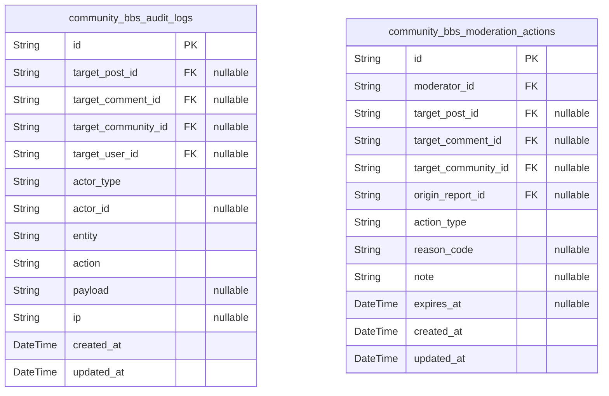
```mermaid
erDiagram
"community_bbs_audit_logs" {
  String id PK
  String target_post_id FK "nullable"
  String target_comment_id FK "nullable"
  String target_community_id FK "nullable"
  String target_user_id FK "nullable"
  String actor_type
  String actor_id "nullable"
  String entity
  String action
  String payload "nullable"
  String ip "nullable"
  DateTime created_at
  DateTime updated_at
}
"community_bbs_moderation_actions" {
  String id PK
  String moderator_id FK
  String target_post_id FK "nullable"
  String target_comment_id FK "nullable"
  String target_community_id FK "nullable"
  String origin_report_id FK "nullable"
  String action_type
  String reason_code "nullable"
  String note "nullable"
  DateTime expires_at "nullable"
  DateTime created_at
  DateTime updated_at
}
```

### `community_bbs_audit_logs`

Immutable audit trail for system and moderation events. Records actor
attribution (actor_type + actor_id), target references (post, comment,
community, user), action verb and payload for forensic analysis and legal
retention. Append-only: new events are inserted; existing rows are not
updated except for administrative reconciliation metadata. Uses
{community_bbs_posts, community_bbs_comments, community_bbs_communities,
community_bbs_communitymember} from other components for contextual
joins. Retention and legal-hold logic is managed by application and
retention processes. NOTE: Added composite indexes to optimize actor- and
action-centric queries.

Properties as follows:

- `id`: Primary Key.
- `target_post_id`: Referenced post for this audit event. [community_bbs_posts.id](#community_bbs_posts).
- `target_comment_id`
  > Referenced comment for this audit event. {@link
  > community_bbs_comments.id}.
- `target_community_id`
  > Referenced community for this audit event. {@link
  > community_bbs_communities.id}.
- `target_user_id`
  > Referenced user (community member) related to the event where applicable.
  > [community_bbs_communitymember.id](#community_bbs_communitymember).
- `actor_type`
  > Actor classification that performed the action (e.g.,
  > 'visitor','community_member','moderator','system_admin'). Application
  > logic resolves actor_id according to actor_type for accurate attribution.
- `actor_id`
  > Actor identifier from the actor domain; resolution depends on actor_type.
  > Kept as plain uuid to avoid multi-null FK anti-pattern; application
  > enforces integrity.
- `entity`
  > The high-level entity type affected by this audit record (e.g.,
  > 'post','comment','community','report').
- `action`
  > Action verb describing the event (e.g.,
  > 'created','edited','deleted','moderation.action').
- `payload`
  > Optional JSON payload (stringified) or human-readable summary capturing
  > context for the audit event. Suitable for downstream forensic analysis.
- `ip`: Originating IP address when available for the event.
- `created_at`: Event creation timestamp.
- `updated_at`
  > Last-modified timestamp. Typically equals created_at for append-only
  > records but available for exceptional reconciliation metadata.

### `community_bbs_moderation_actions`

Records moderator and admin actions taken on platform content and users.
Each row represents a discrete action (approve, remove, warn, suspend,
restore) tied to a moderator actor and optional originating report.
Designed for auditability and operational workflows; moderation actions
are queryable, filterable by community, moderator, action type, and time
window. NOTE: Added additional indexes to support action- and
reason-based queries.

Properties as follows:

- `id`: Primary Key.
- `moderator_id`
  > Moderator who performed the action. {@link
  > community_bbs_community_moderators.id}.
- `target_post_id`
  > Optional referenced post that the moderation action targeted. {@link
  > community_bbs_posts.id}.
- `target_comment_id`
  > Optional referenced comment that the moderation action targeted. {@link
  > community_bbs_comments.id}.
- `target_community_id`
  > Optional referenced community affected by the action. {@link
  > community_bbs_communities.id}.
- `origin_report_id`
  > Optional originating report that triggered the action. {@link
  > community_bbs_reports.id}.
- `action_type`
  > Enumerated action type (e.g.,
  > 'remove','approve','warn','suspend','unsuspend','ban','unban','restore').
- `reason_code`
  > Standardized reason code for the action (e.g.,
  > 'harassment','spam','copyright','policy_violation').
- `note`
  > Moderator-supplied explanatory note or rationale for the action; used in
  > audit reviews and appeals.
- `expires_at`
  > Optional expiry timestamp for temporary actions (e.g., temporary
  > suspensions).
- `created_at`: Action creation timestamp.
- `updated_at`: Last-modified timestamp for the moderation action record.

## default

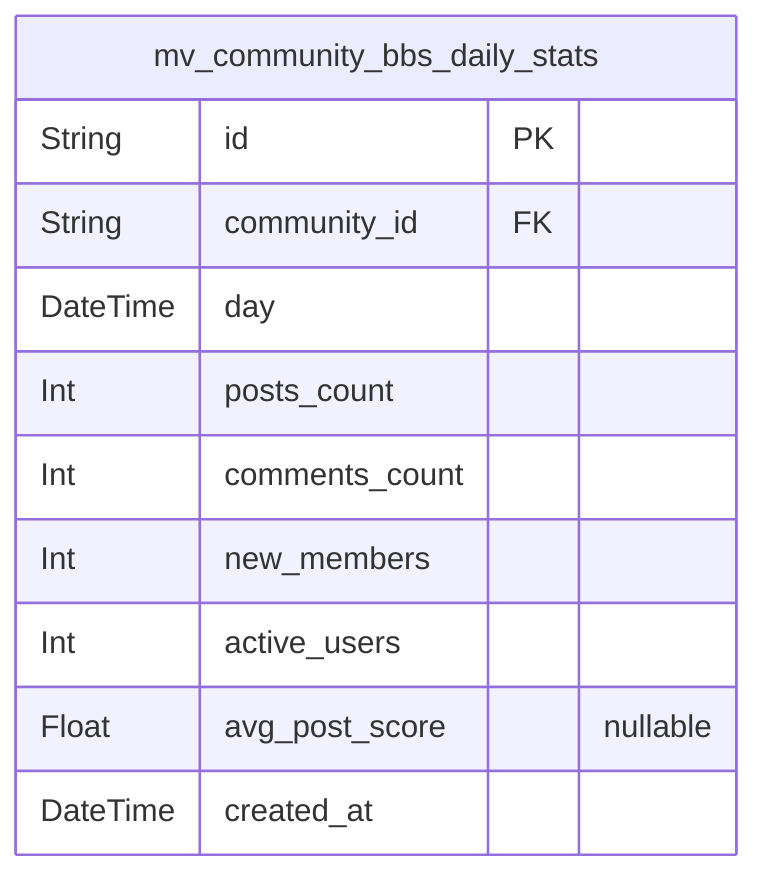
```mermaid
erDiagram
"mv_community_bbs_daily_stats" {
  String id PK
  String community_id FK
  DateTime day
  Int posts_count
  Int comments_count
  Int new_members
  Int active_users
  Float avg_post_score "nullable"
  DateTime created_at
}
```

### `mv_community_bbs_daily_stats`

Materialized daily aggregates per community for analytics and KPI
dashboards. Contains denormalized counts and precomputed metrics (posts,
comments, active_users, new_members) for a given day. This is a
read-optimized materialized view maintained by ETL/cron processes.
Denormalization allowed; data is refreshed on a schedule. Marked
material=true and stance=subsidiary.

Properties as follows:

- `id`: Primary Key.
- `community_id`
  > Referenced community for this daily aggregate. {@link
  > community_bbs_communities.id}.
- `day`: Date representing the aggregated day (UTC midnight).
- `posts_count`: Number of posts published in the community during the day.
- `comments_count`: Number of comments created in the community during the day.
- `new_members`: Number of new community members (joins) during the day.
- `active_users`: Count of distinct active users in the community during the day.
- `avg_post_score`: Average post score for posts created that day; null when not applicable.
- `created_at`: Snapshot creation timestamp.
