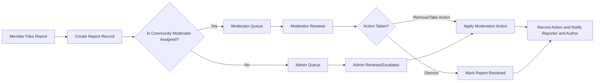

# Functional Requirements — communityPortal

## Executive Summary and Scope
communityPortal is a community-driven discussion platform that enables topic-based communities where authenticated members can create posts (text, links, images), comment with nested replies, vote on content, subscribe to communities, and report inappropriate content. The scope of these requirements covers business-level behavior necessary for backend implementation planning: roles and permissions, authentication lifecycle, feature-level functional requirements expressed in EARS format, business rules, moderation workflows, error handling, performance expectations, acceptance criteria, and outstanding stakeholder decisions.

Scope boundaries:
- Business-level requirements only; do not include low-level API definitions, database schemas, or deployment architecture.
- All applicable functional requirements are written in EARS format and are testable.

Audience: product owners, backend developers, QA engineers, moderation leads, and operations.

## System Goals and Success Metrics
- Provide a reliable platform for forming and participating in topic-based communities.
- Surface high-quality content using community voting and clear moderation workflows.
- Ensure safety and trust through reporting and role-based moderation.

Key KPIs (business-level): MAU, DAU/MAU ratio, number of active communities, average posts per community per week, median report resolution time, and retention at 7/30/90 days.

## Roles and Permission Matrix
Defined roles (business terms):
- guest: Unauthenticated visitor with read-only access to public communities.
- member: Verified authenticated user able to post, comment, vote, subscribe, and report.
- moderator: Community-scoped manager able to act on reports and moderate content in assigned communities.
- admin: Platform-level operator with global moderation, user management, and policy controls.

Permission matrix (business-level):
- Browse public communities: guest ✅, member ✅, moderator ✅, admin ✅
- Register / Login: guest ❌, member ✅, moderator ✅, admin ✅
- Create community: guest ❌, member ✅*, moderator ✅, admin ✅
- Create post/comment: guest ❌, member ✅, moderator ✅, admin ✅
- Vote: guest ❌, member ✅**, moderator ✅, admin ✅
- Report content: guest ❌, member ✅, moderator ✅, admin ✅
- Moderate assigned community: guest ❌, member ❌, moderator ✅ (scoped), admin ✅

*Community creation may be rate-limited or restricted by stakeholder policy (see Open Questions).
**Voting may be gated by account age or karma thresholds (stakeholder-decision).

## Authentication and Account Lifecycle (EARS)
Business requirements for account lifecycle and session behavior.

- WHEN a visitor submits registration data (email, password), THE system SHALL validate the email format and password strength and create an account in "unverified" state and send a verification email within 60 seconds.

- WHEN a user follows the verification action, THE system SHALL transition the account to "active" and allow content creation, voting, commenting, and subscribing immediately.

- IF an account attempts to perform member-only actions while unverified, THEN THE system SHALL deny the action and prompt the user to verify their email with an explanatory message ("Verify your email to post and vote").

- WHEN a verified user provides valid credentials, THE system SHALL authenticate the user and establish a session that allows member actions; authentication success SHALL be observable within 2 seconds under normal load.

- IF authentication fails due to invalid credentials, THEN THE system SHALL deny access and record the failed attempt for rate-limiting and anti-abuse analysis without exposing which credential component was incorrect.

- WHEN a user requests a password reset, THE system SHALL send a single-use reset mechanism to the verified email and expire the reset token after a stakeholder-configurable period (recommended default: 1 hour).

- WHEN a user logs out, THE system SHALL invalidate the session token so that it may not be reused for authenticated actions.

- WHILE a user's account is suspended by moderator or admin action, THE system SHALL prevent content creation, voting, commenting, and subscription changes while allowing read-only browsing according to policy.

Session and token business expectations (implementation detail to be decided by developers but described here as business expectations):
- THE system SHOULD support short-lived access tokens and long-lived refresh tokens to balance UX and security. Token revocation and inactivity rules SHALL be implemented to enforce suspensions and password resets.

## Core Features and EARS Requirements
Each core feature includes: brief description, EARS-style functional requirements, and acceptance criteria.

1) User Registration and Login
- WHEN a user submits registration details, THE system SHALL validate required fields and create an "unverified" user and send a verification email within 60 seconds.
- IF the submitted email is already in use, THEN THE system SHALL reject the registration and present a user-facing message "Email already registered. Sign in or reset your password.".
- WHEN a verified user supplies valid login credentials, THE system SHALL authenticate and establish a session enabling member actions; authentication SHALL respond within 2 seconds under normal load.

Acceptance criteria:
- Registration with valid inputs creates an unverified account and verification email is dispatched; verification completes activation.
- Invalid credentials return an authentication failure without revealing specific credential details.

2) Create Communities
- WHEN a member requests creation of a community, THE system SHALL validate the proposed community name for uniqueness (case-insensitive) and allowed character rules and create the community or reject with an explanatory error.
- IF community creation is rate-limited by policy, THEN THE system SHALL enforce the rate limit and supply a message indicating eligibility and retry timeframe.
- WHERE communities support pre-approval, THE system SHALL mark newly created communities as "pending" until an admin approves.

Acceptance criteria:
- Unique community names produce active communities visible to discovery per visibility rules; duplicates are rejected with a specific message.

3) Post text, links, or images in communities
- WHEN a verified member submits a post, THE system SHALL validate required fields (title and at least one of body/link/image) and create the post associated with the community and author and a timestamp.
- IF images are included, THEN THE system SHALL enforce platform-configurable image size and count limits and reject uploads exceeding those limits with a clear error ("Image exceeds maximum allowed size of X MB").
- WHERE community policy requires pre-approval for posts, THE system SHALL place posts into a moderation queue until approved.

Acceptance criteria:
- Posts with valid inputs are visible per community moderation policy; invalid posts are rejected with actionable messages.

4) Commenting and Nested Replies
- WHEN a member submits a comment on a post or reply to another comment, THE system SHALL attach the comment to the parent entity and record the author and timestamp.
- IF the platform enforces a maximum nesting depth, THEN THE system SHALL reject replies beyond the maximum depth and inform the user.
- IF a comment exceeds allowed character length, THEN THE system SHALL reject the submission and return a validation error specifying the maximum allowed length.

Acceptance criteria:
- Comments are retrievable in threaded order; attempts to exceed nesting or length limits are rejected with clear messages.

5) Upvote/Downvote Posts and Comments
- WHEN an authenticated member casts a vote on a post or comment, THE system SHALL record the vote as a single active vote per (user, target) and update aggregated totals.
- IF a member attempts to vote multiple times on the same target, THEN THE system SHALL interpret the action as a vote change (switch or remove) and not create duplicate votes.
- WHERE voting eligibility is gated (e.g., by account age or karma), THE system SHALL prevent ineligible accounts from voting and display the reason.

Acceptance criteria:
- Single vote per user per target; vote changes update totals consistently and are reflected in sorting behavior.

6) User Karma System
- WHEN votes or other karma-affecting actions occur, THE system SHALL update a user's karma according to stakeholder-defined rules.
- IF karma gates are in place for privileges (e.g., community creation), THEN THE system SHALL evaluate karma before allowing the action.
- IF the precise karma formula is unspecified, THEN THE system SHALL record vote events and mark the karma calculation as STAKEHOLDER-DECISION and default to a conservative placeholder if needed for MVP (recommendation: +1 per upvote, -1 per downvote) until final formula is approved.

Acceptance criteria:
- Karma is displayed on profile pages and updated promptly after vote events per agreed formula.

7) Sort posts by hot, new, top, controversial
- WHEN a member requests a feed sorted by a mode (hot, new, top, controversial), THE system SHALL return posts ordered per the business-defined ranking algorithm for that mode.
- IF ranking algorithm parameters are unspecified, THEN THE system SHALL default to "new" for feeds and document that hot/controversial algorithms are STAKEHOLDER-DECISION items.

Acceptance criteria:
- Sorting modes return deterministic orderings per documented rules and persist selection in session or user preferences.

8) Subscribe to Communities
- WHEN a member subscribes to a community, THE system SHALL record the subscription and include the community's posts in the member's personalized feed according to feed rules.
- IF a member unsubscribes, THEN THE system SHALL remove the subscription and update the personalized feed accordingly.

Acceptance criteria:
- Subscriptions are recorded and reflected immediately in user subscription lists and feed behavior.

9) User Profiles Showing Their Posts and Comments
- WHEN a user profile is requested, THE system SHALL present the user's public posts, comments, displayed karma, and join date, respecting user privacy settings.
- IF privacy controls are configured, THEN THE system SHALL enforce visibility settings when rendering profiles to other users.

Acceptance criteria:
- Profiles display public activity and reflect privacy settings consistently.

10) Report Inappropriate Content
- WHEN a member files a report against a post or comment, THE system SHALL record reporter identity, target item, reason code, and timestamp and route it to community moderator queues.
- IF a report is marked urgent, THEN THE system SHALL flag it for prioritized review and possible admin escalation.
- WHEN moderators or admins take action, THE system SHALL record the action, actor, and timestamp for audit.

Acceptance criteria:
- Reports are visible to moderators and admins (for escalations); moderator actions are auditable.

## Data Entities (Business-level)
Primary entities implied by requested features (business attributes only):
- User: userId, username, emailVerified, joinDate, karma, roles, privacySettings
- Community: communityId, name, description, visibility, creatorUserId, moderators
- Post: postId, communityId, authorUserId, title, body/link/imageRef, createdAt, score, status
- Comment: commentId, postId, parentCommentId, authorUserId, body, createdAt, score
- Vote: voteId, voterUserId, targetType, targetId, voteValue, createdAt
- Subscription: subscriptionId, userId, communityId, createdAt
- Report: reportId, reporterUserId, targetType, targetId, reasonCode, details, createdAt, status, assignedModeratorId
- KarmaEvent (audit): eventId, userId, delta, reason, createdAt

> Note: These are business-level attributes; do not treat them as storage schema or DB column specifications.

## Business Rules and Validation (EARS)
- WHEN a community name is proposed, THE system SHALL reject names that are duplicates (case-insensitive) or contain disallowed words and return an explanatory error.
- WHEN a post is submitted without a title, THE system SHALL reject the submission and instruct the user "Title is required.".
- WHEN an unauthenticated user attempts to vote or report, THE system SHALL deny the action and prompt the user to authenticate.
- WHEN a user exceeds configured rate limits for posting or voting, THE system SHALL throttle further actions and inform the user of the retry timeframe.
- IF content is removed for policy violations, THEN THE system SHALL reverse associated karma deltas if the removal policy requires reversal and record the action for audit.

Validation defaults (stakeholder decision items clearly marked):
- Recommended defaults (configurable): title max 300 chars, text body max 40,000 chars, comment max 10,000 chars, image max 10 MB, default nesting depth 6. These defaults SHALL be finalized by stakeholders prior to implementation.

## Moderation and Reporting Workflow (Business Flow)
High-level business flow for reports and moderation with clear audit trails.

Audit requirements:
- WHEN moderators or admins act, THE system SHALL log actor identity, action type, reason, and timestamp in an auditable record accessible to authorized administrators.

## Error Handling and User-Facing Recovery (EARS)
- IF a user submits an invalid registration (duplicate email), THEN THE system SHALL return a clear message "Email already registered. Sign in or reset your password." and provide a link to password recovery.
- IF a user attempts to create a post with missing required fields, THEN THE system SHALL reject the request with field-specific messages and preserve any valid inputs as a draft where possible.
- IF moderation actions fail due to transient internal errors, THEN THE system SHALL present a retry option to the moderator and log the failure for operational follow-up.

User message guidance: all user-facing messages shall be actionable, non-technical, and localized.

## Performance and Non-Functional Expectations (Business-level)
- WHEN a user performs critical interactions (login, post creation, vote), THE system SHALL respond within 2 seconds under normal load as a business target.
- WHEN a user requests a community page of posts (default page size 20), THE system SHALL return paginated results within 3 seconds under normal load.
- THE system SHALL provide configurable rate-limiting to protect platform integrity and prioritize moderation queues during traffic spikes.

Operational expectations: define normal load and scale targets with operations; recommended baseline for MVP planning: support 10k concurrent sessions and 1k writes/sec aggregate.

## Acceptance Criteria and Measurable Objectives
- Registration: 95% of valid registrations receive verification email within 60 seconds in staging under normal load.
- Posting: valid posts created by verified members appear in community feeds according to moderation settings within 5 seconds.
- Voting integrity: a single active vote per (user,target) is enforced across reads/writes.
- Report visibility: 95% of reports are delivered to moderator queues within 10 seconds of submission under normal load.
- Moderation SLA (recommended): initial moderator action within 48 hours for non-high-severity reports; high-severity reports escalated to admin immediately.

## Open Questions and Stakeholder Decisions Required
1. Karma calculation formula (weighting, decay, caps) — REQUIRED before finalizing karma-dependent gates.
2. Image hosting strategy and exact file-size/type limits — REQUIRED to implement image posts.
3. Exact rate-limits for posting, commenting, voting, and community creation — REQUIRED for anti-abuse rules.
4. Sorting algorithm definitions for "hot" and "controversial" — REQUIRED for consistent ranking behavior.
5. Community creation policy (open vs gated) and initial default moderator assignment rules.
6. Retention policy for deleted content and moderation logs (legal hold treatment).
7. Localization and support for multiple locales and timezones for timestamps in UI.

Each of the above items should be resolved prior to detailed design and implementation to avoid rework.

## Glossary
- Member: authenticated and email-verified user who can create content.
- Karma: a derived reputation score reflecting community reactions to a user's contributions (calculation TBD).
- Moderator: a role assigned to manage one or more communities.
- Admin: platform-level operator with global moderation and user management privileges.

## Appendix: Example Acceptance Tests (High-level)
- Registration flow: register -> receive verification email -> verify -> create post. Expected: verification email within 60s, ability to post after verification.
- Vote idempotence: upvote -> upvote again -> change to downvote -> remove vote. Expected: single active vote and correct score deltas observed.
- Report processing: submit report -> appears in moderator queue -> moderator removes content -> audit record created and notified. Expected: report visible within 10s, audit log contains moderator id and reason.

# End of Requirements

