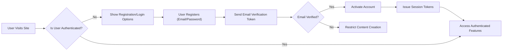
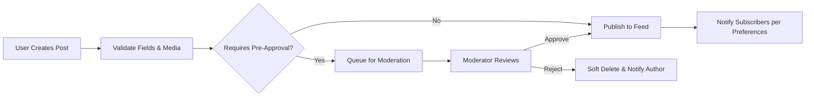
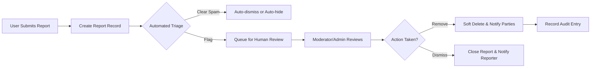

# Requirements Analysis Report — communityBbs (Reddit-like Community Platform)

## 1. Executive Summary and Scope

communityBbs provides topic-based communities where registered members create and curate content (text, links, images), participate in threaded discussions, vote, subscribe, and report inappropriate content. The platform emphasizes transparent moderation, fair reputation (karma), and predictable community governance. The scope of these requirements is business-level behavior: what the platform must do, acceptance criteria, and operational SLAs. Implementation details (APIs, database schemas, infrastructure) are intentionally excluded.

## 2. Audience

Intended readers: product owners, backend engineers, QA, moderation leads, compliance officers, and SRE.

## 3. Actors and Permission Matrix

Actors (business terms):
- visitor: unauthenticated site visitor; can browse public content only.
- communityMember: authenticated, verified user; can create communities (subject to eligibility), create posts/comments, vote, subscribe, report, and edit own content within windows.
- communityModerator: community-appointed or owner-assigned actor with moderator privileges limited to a community.
- systemAdmin: platform administrator with global moderation and audit capabilities.

Permission summary (business-level):
- WHEN a visitor accesses the site, THE system SHALL permit read-only viewing of public communities and posts.
- WHEN a communityMember is verified, THE system SHALL permit content creation, voting, subscribing, and reporting, subject to community rules.
- WHEN a communityModerator acts within their community, THE system SHALL allow moderation actions (approve/reject posts, remove content) and SHALL record all moderator actions in audit trails.
- WHEN a systemAdmin takes action, THE system SHALL record the action and rationale immutably.

## 4. Business Vision and Goals

- Enable sustainable, high-quality discussion in topic-focused communities.
- Reduce harmful content exposure through timely triage and escalation.
- Provide transparent reputation signals to increase trust and retention.
- Scale moderation operationally with automated triage and clear SLAs.

Key KPIs: MAU, DAU, average posts per active user, moderation time-to-first-action, rate of escalated reports, retention (30-day), and average session duration.

## 5. Authentication & Account Management (EARS)

- WHEN a user registers with email and password, THE system SHALL create an account in a "pending verification" state and SHALL send an email verification token.
- WHEN a user redeems a valid email verification token, THE system SHALL transition the account to "verified" and SHALL permit state-changing actions.
- WHEN a verified user provides valid credentials, THE system SHALL issue session tokens to permit authenticated actions; THE system SHALL include userId and primary role in the session token payload.
- IF a user requests password reset, THEN THE system SHALL send a single-use, time-limited reset token to the verified email address and SHALL invalidate the token after use.
- WHEN a user revokes sessions, THE system SHALL invalidate refresh tokens associated with that user and SHALL prevent further unauthorized access.

Authentication acceptance criteria:
- GIVEN a new user registers and verifies email, WHEN they attempt to create a post, THEN the action SHALL succeed and the account SHALL be active.
- GIVEN a failed login after 5 attempts in 15 minutes, WHEN further attempts occur, THEN the system SHALL apply progressive backoff and present a clear error code.

Session and token business rules:
- THE system SHALL use short-lived access tokens with configurable lifetimes (business guidance: 15–30 minutes) and refresh tokens with configurable lifetimes (business guidance: 7–30 days).
- WHEN a refresh token is revoked by user action or admin, THEN THE system SHALL prevent use of that refresh token to obtain a new access token.

## 6. Community Management (EARS)

- WHEN a verified communityMember submits a community creation request, THE system SHALL validate that the name is unique and that the description does not exceed 400 characters.
- IF a community name is reserved or violates policy, THEN THE system SHALL reject the request and return a business-readable reason code.
- WHEN a community is created, THE system SHALL assign the creating user as community owner and SHALL enable owner controls (moderator assignment, visibility settings).
- WHERE a community is marked "private" or "restricted", THE system SHALL require membership approval before non-members can view or post.

Acceptance criteria:
- GIVEN a verified user creates a community with unique name and valid description, WHEN creation completes, THEN the creator SHALL appear as owner and the community SHALL be listed as active per visibility.

## 7. Post Management: Types and Media Rules (EARS)

Post types: text, link, image.

- WHEN a communityMember submits a text post, THE system SHALL require a title (1-300 characters) and SHALL accept a body up to 40,000 characters.
- WHEN a communityMember submits a link post, THE system SHALL require a title and SHALL validate the URL uses http or https scheme.
- WHEN a communityMember submits an image post, THE system SHALL accept allowed image MIME types (JPEG, PNG, GIF) and SHALL enforce per-image size limit up to 10 MB and max 10 images per post by default.
- IF a post includes disallowed media types or exceeds size limits, THEN THE system SHALL reject the submission and return a clear error explaining allowed types and sizes.
- WHERE a community requires pre-approval, THE system SHALL place new posts in a moderation queue until an authorized moderator approves.

Acceptance criteria:
- GIVEN a verified member submits a valid text post, WHEN accepted, THEN the post SHALL appear in the community feed and be retrievable by feed queries.

## 8. Commenting and Nested Replies (EARS)

- WHEN a communityMember posts a comment, THE system SHALL attach metadata (authorId, timestamp, parentCommentId optional) and SHALL enforce a maximum comment length of 10,000 characters.
- WHERE nested replies occur, THE system SHALL support logical unlimited nesting but SHALL recommend UI-friendly depth and SHALL allow flattening for rendering where necessary.
- WHEN a comment receives multiple high-severity reports, THEN THE system SHALL flag it for moderator review and MAY hide it pending review.

Edit and deletion windows:
- THE system SHALL allow creators to edit their own posts and comments within 24 hours; edits after the window SHALL require moderator assistance and SHALL be logged in audit trails.
- WHEN a user deletes content, THE system SHALL soft-delete it and retain for a configurable retention period (default 30 days) before permanent removal.

## 9. Voting and Karma System (EARS)

- WHEN a verified communityMember casts an upvote or downvote on a post or comment, THE system SHALL record the vote and SHALL update visible vote counts immediately.
- IF a user changes or removes their vote, THEN THE system SHALL update counts and SHALL recalculate affected karma.
- THE system SHALL compute user karma using configurable weights (example defaults: post upvote +10, post downvote -5, comment upvote +2, comment downvote -1) and SHALL allow admin configuration.
- WHERE coordinated or suspicious voting patterns are detected, THE system SHALL flag implicated accounts and temporarily suspend vote effects pending investigation.

Acceptance criteria:
- GIVEN a user upvotes a post, WHEN vote accepted, THEN post upvote count SHALL increment and author's karma SHALL change per configured rules within the observable SLA.

## 10. Feed Sorting and Pagination (hot/new/top/controversial)

Business definitions:
- "new": items ordered by creation timestamp descending.
- "top": items ordered by score within a selected time window (day/week/month/all).
- "hot": time-decayed ranking balancing recency and engagement using tunable parameters.
- "controversial": items with high disagreement between upvotes and downvotes.

Feed rules:
- WHEN a feed is requested, THE system SHALL return paginated results with default page size 25 and SHALL permit up to 100 items per page.
- IF a client requests "top" with time window, THEN THE system SHALL restrict results to that window.
- THE system SHALL document hot-score parameters and make them adjustable by administrators.

Acceptance criteria:
- GIVEN sufficient posts exist, WHEN user requests page 1 of community feed sorted by "new", THEN response SHALL contain the newest items up to page size and be returned within SLA.

## 11. Subscriptions and Notifications (EARS)

- WHEN a communityMember subscribes to a community, THE system SHALL record the subscription and SHALL include the community's content in the user's personalized feed and notification pipeline.
- IF a user opts into email notifications, THEN THE system SHALL batch notifications to avoid excessive emails (default cap: 5 digests per day) and SHALL allow user-configurable frequency.
- WHEN a subscribed community publishes new content, THE system SHALL respect the user's notification preferences and SHALL surface the event in-app and optionally via email or push based on preferences.

Notification acceptance criteria:
- GIVEN a user subscribed with immediate in-app notifications enabled, WHEN a new post is published in the community, THEN an in-app notification SHALL appear within the real-time SLA.

## 12. Reporting, Moderation, and Escalation (EARS)

- WHEN a communityMember reports content, THE system SHALL create a report record with reporterId, targetId, reason code, optional explanation (max 1000 chars), and timestamp.
- IF a content item receives reports exceeding a configurable threshold within a time window (example: 5 reports within 48 hours), THEN THE system SHALL flag the item for expedited moderator review and MAY hide it pending review.
- WHEN moderators take action, THE system SHALL record the action, reason, and actorId in an immutable audit log and SHALL notify the reporting user of the resolution following privacy rules.
- WHERE automated heuristics indicate probable illegal content, THEN THE system SHALL prioritize the report and SHALL preserve relevant evidence for legal compliance.

Moderation SLAs (business):
- High-priority reports: initial triage within 4 hours; resolution within 24–72 hours depending on complexity.
- Normal reports: initial triage within 24 hours; resolution within 72 hours.

Acceptance criteria:
- GIVEN a post receives 6 valid reports in 48 hours, WHEN threshold reached, THEN system SHALL mark for expedited review and place in moderator queue with visible priority.

## 13. Business Rules, Rate Limits and Abuse Prevention

- THE system SHALL enforce content limits: title max 300 chars, text post max 40,000 chars, comment max 10,000 chars.
- THE system SHALL impose rate limits as business defaults (configurable): max 10 posts/hour/user, 200 comments/day/user, 100 votes/hour/user.
- WHEN rate limits are exceeded, THE system SHALL temporarily restrict the action and SHALL present a clear error with remaining wait time.
- THE system SHALL detect coordinated abuse patterns (vote rings, sockpuppets) and SHALL flag involved accounts, reverse suspect vote effects, and initiate admin review.

## 14. Data Lifecycle and Retention (EARS)

- WHEN content is soft-deleted, THE system SHALL retain it for a configurable retention period (default 30 days) to allow appeals and audits, after which THE system SHALL permanently remove or archive per legal rules.
- WHEN a user requests account deletion, THE system SHALL begin a deletion workflow that soft-deletes account data and SHALL complete hard deletion after retention window unless legal hold applies.
- THE system SHALL retain moderation audit logs for a minimum of 2 years for compliance and dispute resolution.

Acceptance criteria:
- GIVEN a user requests deletion and no legal hold exists, WHEN retention window elapses, THEN user-identifiable data SHALL be removed from public views and backups per retention rules.

## 15. Non-Functional SLAs (Business-Level)

- Read operations (feed retrieval, post read) SHALL respond within 2 seconds 95% of the time under nominal load.
- Write operations (post/comment/vote) SHALL complete within 3 seconds 95% of the time under nominal load and SHALL reflect in feeds within 5 seconds.
- Availability targets: target 99.9% monthly availability for core APIs; moderation escalation SLA: 95% of escalations triaged within 24 hours.

## 16. Acceptance Criteria and Example Scenarios

- Registration: WHEN a user registers and verifies email, THEN the account SHALL be active and capable of creating content; acceptance verified by successful post creation.
- Posting: WHEN a verified user creates a text post within limits, THEN post shall be visible in community feed and retrievable by feed API within SLA.
- Voting: WHEN a user upvotes, THEN post score and author karma SHALL update according to configured rules; acceptance verified by visible delta in user profile and post metadata.
- Reporting: WHEN threshold of reports is reached, THEN post SHALL appear in expedited moderator queue; acceptance verified by moderator UI visibility and audit log entry.

## 17. Diagrams

Registration and login flow:

```mermaid
graph LR
  A["User Visits Site"] --> B{"Is User Authenticated?"}
  B -->|"No"| C["Show Registration/Login Options"]
  C --> D["User Registers (Email/Password)"]
  D --> E["Send Email Verification Token"]
  E --> F{"Email Verified?"}
  F -->|"Yes"| G["Activate Account"]
  F -->|"No"| H["Restrict Content Creation"]
  G --> I["Issue Session Tokens"]
  I --> J["Access Authenticated Features"]
  B -->|"Yes"| J
```

Post creation to moderation flow:

```mermaid
graph LR
  A["User Creates Post"] --> B["Validate Fields & Media"]
  B --> C{"Requires Pre-Approval?"}
  C -->|"Yes"| D["Queue for Moderation"]
  C -->|"No"| E["Publish to Feed"]
  D --> F["Moderator Reviews"]
  F -->|"Approve"| E
  F -->|"Reject"| G["Soft Delete & Notify Author"]
  E --> H["Notify Subscribers per Preferences"]
```

Report triage flow:

```mermaid
graph LR
  A["User Submits Report"] --> B["Create Report Record"]
  B --> C{"Automated Triage"}
  C -->|"Clear Spam"| D["Auto-dismiss or Auto-hide"]
  C -->|"Flag"| E["Queue for Human Review"]
  E --> F["Moderator/Admin Reviews"]
  F --> G{"Action Taken?"}
  G -->|"Remove"| H["Soft Delete & Notify Parties"]
  G -->|"Dismiss"| I["Close Report & Notify Reporter"]
  H --> J["Record Audit Entry"]
```

## 18. Glossary

- communityMember: a verified registered user with content privileges.
- karma: numeric reputation reflecting votes and system actions.
- soft-delete: hidden from public view but retained for recovery and audits.
- systemAdmin: platform-level administrator with global moderation authority.

## 19. Change Log

- 2025-10-31: Initial consolidated business requirements authored.

# End of Requirements Analysis Report — communityBbs
