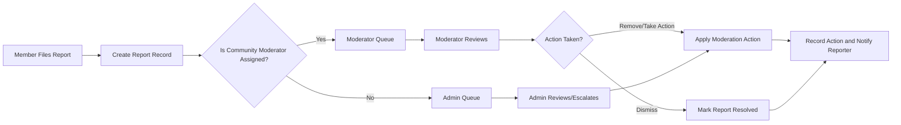
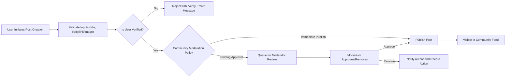

# 01-service-overview.md — Service overview and business model for communityPortal

## Service Vision and Purpose
communityPortal is a community-driven discussion platform that enables people to form and join focused communities, share text, links, and images, engage through comments and votes, and self-organize around shared interests. The platform exists to facilitate discovery of high-quality, community-relevant content, encourage constructive conversation, and provide tools for community moderation and safety.

Purpose summary (concise): Provide a scalable, moderation-aware community platform that balances open discussion with manageable moderation cost and fair, transparent community governance.

## Target Users and Market Positioning
- Primary users: Individual members who seek topic-specific communities to read, discuss, and share content.
- Community creators and moderators: Users who establish communities and maintain community rules.
- Casual visitors (guests): Unauthenticated users who discover content and communities.
- Platform administrators: Staff who oversee global policy, escalations, and platform health.

Market positioning: communityPortal targets niche- and interest-focused communities where members value clear community rules and lightweight tools for curation. It competes with general-purpose community platforms by prioritizing transparent moderation workflows, flexible community creation, and simple karma-driven reputation mechanics.

## Core Value Proposition
- Lower friction for community formation and subscription
- Clear social signals (votes and karma) to surface valued content
- Moderation tooling that scales with communities and reduces admin overhead
- Member profiles that surface contributions and encourage healthy participation

## High-level Goals and Success Metrics
- Goal: Launch a Minimum Viable Product (MVP) supporting community creation, posting (text/link/image), commenting with nested replies, voting, subscription, profiles, and reporting.
- Success metrics (measurable):
  - Monthly Active Users (MAU) target for first 6 months: defined by stakeholders (example: 50k MAU)
  - New communities created per month (MCC): target to be defined
  - Average daily posts per community: baseline to be established during pilot
  - Moderator resolution time for reports: median < 48 hours (business target)
  - Content retention and recovery: percentage of posts restored on appeal (operational target)

## Business Model: revenue and growth strategy
### Why this service exists
- Problem addressed: Existing community platforms can be noisy, costly to moderate, or limited in customization for community owners. There is demand for spaces where topic-focused communities can form and self-regulate with transparent reward mechanisms.

### Revenue strategy (high-level)
- Advertising: Native and community-targeted ads after reaching scale; ads should respect community rules and user privacy expectations.
- Optional subscription tiers: Premium features for community creators or users (e.g., custom moderation tools, analytics, ad-free experience).
- Marketplace or tipping (future): Voluntary payments to creators or communities.
- Timeline: Monetization is optional for MVP; revenue features are deferred to post-MVP phases.

## Operating Assumptions and Constraints
- Privacy and compliance: The platform SHALL operate with business-level commitments to privacy law compliance (e.g., GDPR, CCPA). Specific legal requirements and data retention policies will be defined with legal counsel.
- Moderation cost constraint: Moderation workflows must balance human review workload and automated triage; moderation costs are a key constraint for business viability.
- Feature scope constraint: Only the features explicitly requested by stakeholders are included in the MVP. No additional social features will be added without stakeholder approval.

## Core Features — Detail, User Stories, Requirements, and Acceptance Criteria
The following sections describe each feature requested by the user. For functional requirements that can be expressed in the EARS templates, requirements are written using EARS (WHEN, THE, SHALL, IF, THEN, WHERE, WHILE). All requirements are business-level and testable.

### 1) User registration and login
Description: Allow new users to create accounts and existing users to authenticate. Unverified accounts may have limited capabilities.

Representative user stories:
- As a prospective member, I want to register an account with my email and password so that I can create posts and comments.
- As a member, I want to log in and log out so that my identity is known and my actions are attributed to me.

Functional requirements (EARS):
- WHEN a user submits registration data (email, password), THE system SHALL validate the email format and password strength and create a pending account requiring email verification.
- IF the submitted email is already in use, THEN THE system SHALL reject the registration and inform the user that the email is in use.
- WHEN a verified user provides valid credentials, THE system SHALL authenticate the user and establish a user session.
- IF authentication fails due to incorrect credentials, THEN THE system SHALL report an authentication error to the user and record the failed attempt for rate-limiting/anti-abuse analysis.

Acceptance criteria:
- The system accepts a registration with a properly formatted email and password meeting strength rules and sends a verification link to the email.
- The system denies registration using an email already associated with an existing account.
- Valid credentials result in an active user session; invalid credentials return an authentication error and do not create a session.

### 2) Create Communities (Subreddits)
Description: Members may create named communities that group posts by topic. Community creation may be subject to rate limits, approval, or restrictions.

Representative user stories:
- As a member, I want to create a community about a specific topic so that other users can join and discuss that topic.

Functional requirements (EARS):
- WHEN a member requests creation of a new community, THE system SHALL validate the community name for uniqueness and compliance with naming rules.
- WHERE community creation is subject to approval (business-configurable), THE system SHALL mark the community as "pending approval" until a moderator or admin approves it.
- IF a member attempts to create communities > X per 30 days (stakeholder to define), THEN THE system SHALL reject the request and notify the user that they have reached the creation limit.

Acceptance criteria:
- A valid, unique community name results in a created community in active state or pending-approval state depending on platform policy.
- Attempts to create duplicate or disallowed names are rejected with a clear message.
- Creation rate limits, if configured, are enforced and yield a clear user-facing reason when exceeded.

Notes: The precise limit for "X per 30 days" must be defined by stakeholders; until then, treat it as a configurable platform policy.

### 3) Post Text, Links, or Images in Communities
Description: Members can submit posts of three types: text, external link, or image post. Posts belong to a single community and inherit that community's rules.

Representative user stories:
- As a member, I want to create a text post in a community so others can read and comment.
- As a member, I want to share an external link or upload an image in a post to share content.

Functional requirements (EARS):
- WHEN a member creates a post, THE system SHALL validate that the post includes required fields (title and either body/link/image) and that it is being submitted to an existing community.
- IF the posted content includes an image, THEN THE system SHALL enforce platform-configurable limits on image size and total number of images per post (exact numeric limits to be defined by stakeholder).
- WHEN a post is created, THE system SHALL associate the post with the creating member, the target community, and a timestamp.

Acceptance criteria:
- Posts with required fields accepted and become visible according to community moderation settings (immediately or pending review).
- Posts missing required fields are rejected with clear error messages.
- Posts referencing non-existent communities are rejected.

### 4) Upvote/Downvote Posts and Comments
Description: Community members express content quality and relevance via upvotes and downvotes on posts and comments. Votes affect visibility and the user karma system.

Representative user stories:
- As a member, I want to upvote a helpful post so it appears more prominently.
- As a member, I want to downvote spam or off-topic comments so they are deprioritized.

Functional requirements (EARS):
- WHEN an authenticated member casts a vote (upvote or downvote) on a post or comment, THE system SHALL record the vote and update the aggregated vote totals.
- IF a member attempts to vote more than once on the same item, THEN THE system SHALL interpret that action as a vote change (e.g., switch from upvote to downvote) rather than creating duplicate votes.
- WHERE voting restrictions apply (e.g., new account age or karma threshold), THE system SHALL prevent voting until restrictions are met (business-configurable).

Acceptance criteria:
- Single active vote per user per item is enforced; changing a vote updates totals appropriately.
- Vote actions are rejected for unauthenticated users and for accounts that do not meet voting eligibility rules.
- The effect of votes on content ranking is visible in sorting modes.

Note: The specific impact of votes on karma and content ranking (score weighting, time decay) is undetermined and must be specified by stakeholders; it is treated as a configurable business rule.

### 5) Comment on Posts with Nested Replies
Description: Members can create comments on posts and reply to comments, supporting arbitrary nested threads (depth may be limited for usability).

Representative user stories:
- As a member, I want to reply to a comment so that discussion can branch into sub-topics.
- As a member, I want to view nested replies to follow conversation context.

Functional requirements (EARS):
- WHEN a member submits a comment on a post or as a reply to another comment, THE system SHALL associate the comment with the parent entity and the creating member and record a timestamp.
- WHERE the platform enforces a maximum comment nesting depth (configurable), THE system SHALL prevent deeper replies and return a clear message.
- IF a member submits a comment exceeding allowed length, THEN THE system SHALL reject the comment with a validation message.

Acceptance criteria:
- Comments are stored with parent/child relationships and are retrievable in threaded order.
- Attempts to exceed configured nesting depth or length limits are rejected with user-friendly messages.

### 6) User Karma System
Description: A reputation metric that reflects a user's contributions based on community voting and other actions. Karma influences privileges and community standing per business rules.

Representative user stories:
- As a member, I want to see my karma so I understand how my content is perceived.
- As a moderator, I want to see a user's karma when evaluating behavior.

Functional requirements (EARS):
- WHEN a vote or other karma-affecting action occurs, THE system SHALL update the user's karma according to platform-configurable rules.
- WHERE karma gates are in place (e.g., ability to vote, create communities), THE system SHALL enforce thresholds and deny actions that require higher karma.
- IF the calculation method for karma is unspecified, THEN THE system SHALL mark karma calculation as "stakeholder-defined" and do not assume a calculation method.

Acceptance criteria:
- Karma is displayed on user profiles and is updated after karma-affecting events according to defined rules (when those rules are provided).
- Actions restricted by karma thresholds are blocked when a user does not meet requirements.

### 7) Sort Posts by Hot, New, Top, Controversial
Description: Members can view community posts sorted by common discovery modes: hot (engagement/time blend), new (timestamp), top (highest score), controversial (mixed vote patterns).

Representative user stories:
- As a member, I want to switch sorting to "Top" to see the highest-scoring posts.

Functional requirements (EARS):
- WHEN a member requests a sorting mode for a community feed (hot, new, top, controversial), THE system SHALL return posts ordered according to business-defined sorting algorithms for each mode.
- IF sorting algorithm parameters (e.g., time decay, weighting) are unspecified, THEN THE system SHALL treat them as "stakeholder-defined" and the default shall be "new" until specified.

Acceptance criteria:
- Each sorting mode yields a deterministically ordered list of posts according to documented sorting behavior (once algorithms are specified).
- Sorting mode selection persists in session or user preferences where applicable.

### 8) Subscribe to Communities
Description: Members may subscribe to communities to follow and receive updates from them.

Representative user stories:
- As a member, I want to subscribe to a community so I can easily find its posts in my personal feed.

Functional requirements (EARS):
- WHEN a member subscribes to a community, THE system SHALL record the subscription and include the community's posts in the member's personal feed according to feed rules.
- IF a member unsubscribes, THEN THE system SHALL remove the community from the member's subscriptions list and stop including its posts in the personalized feed.

Acceptance criteria:
- Subscriptions are stored and are reflected in personalized feed behavior.
- Subscribing and unsubscribing actions are reversible and produce immediate feedback to the user.

### 9) User Profiles Showing Their Posts and Comments
Description: Each member has a profile page showing their public posts, comments, join date, and karma.

Representative user stories:
- As a member, I want to view my public activity so others can see my contributions.

Functional requirements (EARS):
- WHEN a user views a member's profile, THE system SHALL present a list of the member's public posts and comments and the member's displayed karma and join date.
- IF a member has privacy controls (configurable), THEN THE system SHALL respect the member's visibility settings for which activities are public or private.

Acceptance criteria:
- Profile pages display public posts and comments and current karma.
- Privacy settings (if implemented) correctly affect which activities are visible.

### 10) Report Inappropriate Content
Description: Members can report posts or comments for moderator review. Reports generate a moderation workflow that moderators and admins process.

Representative user stories:
- As a member, I want to report a comment that contains personal attacks so moderators can review and act.

Functional requirements (EARS):
- WHEN a member files a report on a post or comment, THE system SHALL record the report with reporter identity, target item, reason, and timestamp and mark it for moderator review in the appropriate community queue.
- IF a report is marked as "urgent" by the reporter, THEN THE system SHALL flag it for elevated review by moderators and admins.
- WHEN a moderator or admin takes action on a report (approve, remove, dismiss, escalate), THE system SHALL record the action, the actor, and a timestamp for auditability.

Acceptance criteria:
- Reports are visible to moderators responsible for the community and to admins for escalations.
- Moderator actions on reports update the report state and are auditable.

## Data Entities (Implied, minimal set)
Below are the primary data entities implied directly by the features and their primary attributes (business-level only).

- User: userId, username, displayName, email (verified flag), joinDate, karma, role(s), privacySettings
- Community: communityId, name, description, creationDate, creatorUserId, visibility (public/private), moderatorList
- Post: postId, communityId, authorUserId, title, body (for text), link (for link posts), images (reference), createdAt, score
- Comment: commentId, postId, parentCommentId (nullable), authorUserId, body, createdAt, score
- Vote: voteId, voterUserId, targetType (post/comment), targetId, voteValue (+1/-1), createdAt
- Subscription: subscriptionId, userId, communityId, createdAt
- Report: reportId, reporterUserId, targetType (post/comment), targetId, reason, createdAt, status, assignedModeratorId
- Karma: (business view): userId, score (business-calculated)

> Note: These entity attribute lists are the minimal business-level attributes implied by requested features. They intentionally avoid storage, index, or schema details.

## Business Rules and Validation (Core)
- Community Creation: Only authenticated members may request community creation. The maximum number of communities a single member can create within a configurable time window is "stakeholder-defined".
- Posting Eligibility: Only verified accounts may create posts; guests may not create posts.
- Voting Eligibility: Voting requires an authenticated account; optional gating may require minimum account age or minimum karma.
- Vote Semantics: One active vote per user per item; repeat votes toggle or change the vote.
- Karma Calculations: Karma rules are unspecified — THE system SHALL defer to stakeholder-defined formulas. Until defined, THE system SHALL display karma but not rely on karma for critical access control decisions.
- Content Visibility: Posts and comments are publicly visible by default unless community privacy or post moderation states require otherwise.
- Moderation Scope: Moderators can act only within assigned communities; admins have platform-wide moderation powers.

## Error Handling and User-Facing Recovery
EARS-style error handling examples (user-facing):
- IF a user attempts to create a post with a missing title, THEN THE system SHALL reject the post and display an error explaining "Title is required.".
- IF a user attempts to register with an email already in use, THEN THE system SHALL reject the registration and instruct the user to log in or use password recovery.
- IF moderation actions fail due to internal error, THEN THE system SHALL inform the moderator that the action failed and provide an option to retry; the system SHALL also log the failure for ops (ops-level logging details left for implementers).

Recovery expectations:
- User-facing error messages shall be clear and actionable.
- For transient failures (service unavailable), the system shall surface a friendly retry message and suggest possible next steps (try again later, contact support).

## Performance and Non-Functional (Business-Facing) Expectations
- WHEN a user performs critical interactions (login, post creation, vote), THE system SHALL respond to the user within 2 seconds under normal load conditions as a business target.
- WHEN a user requests a community page of posts, THE system SHALL present paginated results (default page size configurable; example: 25 items) and respond within 3 seconds under normal load as a business expectation.
- WHILE the site experiences traffic spikes, THE system SHALL prioritize moderation queues and reporting visibility to moderators so abusive content is surfaced quickly.

Note: Engineers must translate these business-level expectations into measurable SLAs, capacity planning, and monitoring requirements.

## Moderation and Reporting Workflows
High-level workflow (business-level):
- Member files report -> report enters community moderation queue -> assigned moderator reviews -> moderator acts (remove/approve/escalate) -> if escalated, admin reviews and resolves.

Mermaid diagram: community report and moderation flow

Audit and traceability business rules:
- WHEN a moderator or admin takes action on content, THE system SHALL record the action, actor identity, community scope, and timestamp for audit and dispute resolution.

## Acceptance Criteria and Success Metrics
- Each core feature passes acceptance tests that exercise the EARS-level requirements listed above.
- Moderation throughput: 95% of reports appear in moderator queues within 60 seconds of filing under normal operations.
- Basic repository of posts: posts created with valid inputs show up in appropriate community feeds according to configured moderation policy.
- Voting integrity: vote counts and single-vote semantics are enforced consistently.

## Open Questions and Decisions Required from Stakeholders
These items must be clarified before engineering implementation begins (important, not optional):
1. Karma calculation: Define exact formula (how post votes, comment votes, time decay, and penalties affect karma).
2. Community creation policy: Are communities created immediately or require approval? What is the per-user creation limit per time period?
3. Image hosting: Are images hosted by the platform or by third-party CDN/hosting? What are maximum allowed sizes and allowed formats?
4. Moderation policy: What content categories require automatic holds (e.g., hate speech) and what are escalation rules for urgent reports?
5. Sorting algorithms: Define exact algorithms for "hot" and "controversial" modes (weighting, time windows, decay factors).
6. Voting eligibility gating: Will there be minimum account age or karma thresholds to vote?
7. Profile privacy options: Which profile elements are configurable by users for privacy?
8. Retention policy: How long are deleted posts/comments retained for audit or retrieval?

## How to Use This Documentation Package
Reading order recommendation:
1. Read this document for business requirements and the ToC.
2. Read the [Service Overview] (01-service-overview.md) for vision and high-level goals.
3. Read the [Core Features Document] (03-core-features.md) for feature descriptions and user stories.
4. Read the [User Roles and Authentication Guide] (04-user-roles-and-authentication.md) for auth flows and role responsibilities.
5. Read the [Functional Requirements] (06-functional-requirements.md) for EARS-formatted requirements and acceptance criteria by feature.
6. Read the [Business Rules and Validation] (07-business-rules-and-validation.md) for detailed rules like karma and voting caveats.
7. For error handling and recovery expectations, read the [Exception Handling and Error Recovery] (08-exception-handling-and-error-recovery.md).

(Links above are descriptive placeholders; link to the actual document files in the repository when integrating.)

## Document Relationships and Navigation
- The [Service Overview] (01-service-overview.md) explains WHY the platform exists and the high-level business model.
- The [Problem Definition] (02-problem-definition.md) documents the market problem and competitive position.
- The [Core Features] (03-core-features.md) expands the feature list with user stories and acceptance criteria.
- The [User Roles and Authentication] (04-user-roles-and-authentication.md) provides authentication flows and role matrices.
- The [Functional Requirements] (06-functional-requirements.md) contains the EARS-format requirements expanded for development.
- The [Business Rules and Validation] (07-business-rules-and-validation.md) provides rules like content constraints and karma calculation policy placeholders.
- The [Exception Handling and Error Recovery] (08-exception-handling-and-error-recovery.md) clarifies error messages and recovery flows.
- The [Performance, Security and Compliance] (09-performance-security-compliance.md) covers business-level non-functional expectations.
- The [Implementation Questions and Roadmap] (10-implementation-questions-and-roadmap.md) lists decisions, roadmap, and MVP scope.

## Glossary of Key Terms
- Community: topic-focused space created by members to host posts and discussion.
- Post: a user-created content item of type text, link, or image.
- Comment: a reply attached to a post or another comment; supports nested threading.
- Vote: expression of approval or disapproval (+1/-1) on posts or comments.
- Karma: an accumulated reputation score for members derived from community interactions (business-defined).
- Moderator: community-level user responsible for moderation of assigned communities.
- Admin: global platform administrator for escalations and system-wide policy enforcement.

## Appendix: Permission Matrix (Business-Level)
| Action | Guest | Member | Moderator (assigned) | Admin |
|--------|-------|--------|----------------------|-------|
| Browse public communities | ✅ | ✅ | ✅ | ✅ |
| Register / Login | ❌ | ✅ | ✅ | ✅ |
| Create community | ❌ | ✅* | ✅ (approve) | ✅ |
| Create post | ❌ | ✅ | ✅ | ✅ |
| Comment | ❌ | ✅ | ✅ | ✅ |
| Vote | ❌ | ✅** | ✅ | ✅ |
| Report content | ❌ | ✅ | ✅ | ✅ |
| Moderate assigned community | ❌ | ❌ | ✅ | ✅ |
| Global moderation / ban | ❌ | ❌ | ❌ | ✅ |

*Community creation may be subject to approval or rate limits (stakeholder-defined).
**Voting may be gated by account age or karma thresholds (stakeholder-defined).

## Appendix: Example User Flow Diagram (Post Creation and Publish Path)

## Final Statements
This document provides business requirements only. All technical implementation decisions (architecture, APIs, database design, hosting, and infrastructure) are the responsibility of the development team.

> *Developer Note: This document defines business requirements only. All technical implementations (architecture, APIs, database design, etc.) are at the discretion of the development team.*
