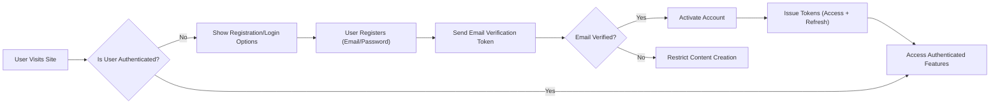
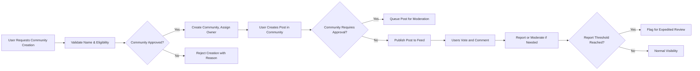
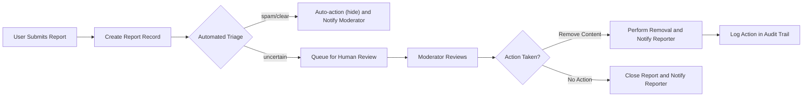

# Requirements Analysis Report — communityBbs (Reddit-like Community Platform)

## 1. Executive Summary and Scope
communityBbs enables community-driven discussion where users create topic-based communities, publish text/link/image posts, comment and reply in nested threads, vote on content, subscribe to communities, and report inappropriate content for moderation. The platform emphasizes transparent moderation, configurable community governance, measurable reputation through karma, and predictable feed behaviors (hot, new, top, controversial).

Scope: Business-level functional and non-functional requirements for core features: user registration and login, community creation and management, post creation and lifecycle, comment threads with nested replies, voting and karma, feed sorting and pagination, subscriptions and notifications, user profiles, reporting and moderation workflows, data lifecycle and retention, and acceptance criteria. Implementation details (APIs, database schema, infrastructure) are intentionally out of scope and left to the development team.

Success metrics and KPIs: Monthly Active Users (MAU), Daily Active Users (DAU), posts per day, comments per post, report-to-action time, moderation resolution SLA, retention (30/60/90 days), and system availability.

## 2. Actors and Permissions
Actors (business-level):
- visitor: Unauthenticated user who can browse public communities and read posts and comments.
- communityMember: Registered authenticated user who can create posts, comments, vote, subscribe, report, and manage their profile.
- systemAdmin: Platform administrator who can act on escalated reports, suspend/ban accounts, manage community-level escalations, and access audit logs.

Permission matrix (business summary):
- Browse public content: visitor, communityMember, systemAdmin
- View private/community-restricted content: communityMember (if a member), systemAdmin
- Create community: communityMember (subject to eligibility and rate limits), systemAdmin
- Create post/comment: communityMember, systemAdmin
- Vote: communityMember, systemAdmin
- Subscribe to community: communityMember
- Report content: communityMember
- Moderate/resolve reports: community-level moderators and systemAdmin

## 3. Authentication & Account Management (EARS requirements)
- WHEN a visitor registers with email and password, THE system SHALL create an account in "unverified" state and SHALL send an email verification token valid for 7 days.
- IF a user redeems a valid email verification token, THEN THE system SHALL transition the account to "verified" state and SHALL permit content-creation actions.
- WHEN a verified user supplies valid credentials, THE system SHALL issue session tokens and SHALL allow authenticated actions for the lifetime of the token.
- WHERE session tokens are used, THE system SHALL include at minimum the userId, role, and emailVerified flag in token claims; recommended access token lifetime is 15–30 minutes and recommended refresh token lifetime is 7–30 days (business recommendation).
- WHEN a user requests password reset for a verified account, THE system SHALL send a single-use, time-limited reset token valid for 24 hours and SHALL allow password change only after token validation.
- IF a user revokes sessions or resets password, THEN THE system SHALL invalidate refresh tokens for that account within 60 seconds.
- WHEN an account is suspended by a systemAdmin, THE system SHALL prevent authentication and SHALL show a user-facing suspension message including reason code and appeal instructions.

Session and security advice (business): THE system SHALL require email verification before allowing state-changing actions, SHALL support per-device sessions with view-and-revoke capability in the account UI, and SHALL log authentication-related events (login success/failure, password-reset requests) to the audit log.

## 4. Community Management and Governance (EARS requirements)
- WHEN a verified communityMember requests to create a community, THE system SHALL validate that the community name is unique (case-insensitive) and SHALL reject names that are reserved or banned.
- WHERE a community is approved, THE system SHALL record the creating user as community owner and SHALL allow the owner to appoint moderators and set visibility to public/private/restricted.
- IF a community is set to "restricted" or "private", THEN THE system SHALL require membership approval for non-members to view or post.
- WHEN a community receives sustained validated reports or escalations, THEN THE system SHALL permit systemAdmin to place it into "quarantine" state that restricts new postings until resolved.
- THE system SHALL limit community creation to a configurable number per account (business default: 3 per 24 hours) to mitigate abuse.

## 5. Post Management (text, link, image) (EARS requirements)
- WHEN a verified communityMember creates a post, THE system SHALL accept type "text" (title + body), "link" (title + URL), or "image" (title + media attachments), and SHALL validate fields as follows:
  - Title: non-empty, max 300 characters
  - Text body (text posts): optional for link/image posts, max 40,000 characters for text posts
  - URL (link posts): must use http or https and pass syntactic validation
  - Images (image posts): allowed MIME types JPEG, PNG, GIF; single-file max 10 MB; total post payload max 20 MB; max images per post 10
- IF a post exceeds content limits or violates format rules, THEN THE system SHALL reject the submission with a clear user-facing error indicating the violated constraint.
- WHERE a community configures pre-approval for posts, THE system SHALL queue new posts in a moderation queue and SHALL mark them as unpublished until approved by moderator.
- WHEN a post is published, THE system SHALL index it for feed inclusion and SHALL make it visible according to community visibility and user subscriptions.

Edit and deletion:
- WHEN a post author edits their post within 24 hours of creation, THE system SHALL allow editing and SHALL record edit history (editorId, timestamp, previous content snapshot).
- IF a post is deleted by its author, THE system SHALL perform a soft delete and SHALL retain the content for a configurable retention window (business default: 30 days) before permanent deletion unless legal hold applies.

## 6. Commenting and Nested Replies (EARS requirements)
- WHEN a verified communityMember comments on a post or replies to a comment, THE system SHALL accept the comment (max 10,000 characters) and SHALL attach metadata: authorId, timestamp, parentCommentId when applicable.
- THE system SHALL support nested comment threads logically to unlimited depth but SHALL recommend UI-friendly rendering depth (example: collapse deeper than 8 levels). Presentation decisions are left to the frontend.
- WHEN a comment is edited within an edit window (default 1 hour), THE system SHALL record edit metadata and preserve previous versions in the audit log for moderation purposes.
- IF a comment accumulates multiple abuse reports (configurable threshold, business default: 5 reports within 48 hours), THEN THE system SHALL mark it for expedited moderator review and MAY hide it pending moderation.

## 7. Voting and Karma System (EARS requirements)
- WHEN a verified communityMember casts an upvote or downvote on a post or comment, THE system SHALL record exactly one active vote per user per target and SHALL update the content's visible vote counts immediately.
- WHEN a user changes or removes their vote, THE system SHALL adjust the content's counts and recalculate any dependent karma changes.
- THE system SHALL compute user karma using configurable point values (business example defaults: post upvote +10, post downvote -5, comment upvote +2, comment downvote -1). Point values SHALL be configurable by systemAdmin.
- IF voting patterns consistent with coordinated manipulation are detected (heuristics and thresholds defined by product), THEN THE system SHALL flag affected accounts and SHALL temporarily exclude their votes from ranking and karma until reviewed.

## 8. Feed Sorting and Pagination (hot, new, top, controversial) (EARS requirements)
- THE system SHALL present feed sorting modes: "hot" (time-decayed popularity), "new" (newest-first), "top" (highest score within a chosen time window), and "controversial" (posts with high disagreement between upvotes and downvotes).
- WHEN a feed is requested, THE system SHALL return paginated results with a default page size of 25 items and SHALL support client-requested page sizes up to 100. The system SHALL enforce a maximum page size of 100.
- IF a user requests "top" with a time window parameter (day/week/month/all), THEN THE system SHALL limit results to the selected window.
- THE system SHALL document the hot ranking parameters and SHALL make them tunable by administrators; at minimum the algorithm SHALL favor recent engagement and decay older activity.

## 9. Subscriptions and Notifications (EARS requirements)
- WHEN a communityMember subscribes to a community, THE system SHALL record the subscription and SHALL include that community's new posts in the user's personalized feed.
- THE system SHALL support in-app and email notifications. WHEN a user opts into email notifications, THE system SHALL batch notifications and SHALL not exceed 5 email digests per day by default per user.
- IF a user unsubscribes from a community, THEN THE system SHALL cease sending new content notifications for that community and SHALL remove the community's prioritized content from the user's personalized recommendations in a timely manner.

## 10. User Profiles and Privacy (EARS requirements)
- THE system SHALL provide public user profiles showing public posts and comments, cumulative karma, and community memberships.
- WHEN a user views their own profile, THE system SHALL also display private metrics (pending reports, moderation actions) visible only to that user and systemAdmin.
- IF a user sets profile privacy to private, THEN THE system SHALL not expose private fields to visitors or other members.

## 11. Content Reporting and Moderation Workflow (EARS requirements)
- THE system SHALL allow communityMember users to report posts and comments for predefined reasons (spam, harassment, illegal content, copyright infringement, other) with optional explanation up to 1,000 characters.
- WHEN a report is submitted, THE system SHALL create a report record containing reporterId, targetId, reason, explanation, and timestamp.
- IF a content item receives a report threshold within a given window (business default: 5 reports within 48 hours), THEN THE system SHALL flag the item for expedited moderator review and SHALL optionally hide it pending review.
- WHEN a moderator or systemAdmin acts on a report (remove, warn, suspend), THE system SHALL record the action in an immutable audit trail including actorId, action, reason code, and timestamp, and SHALL notify the reporting user of resolution outcome respecting privacy.
- Moderation SLAs (business objectives): expedite high-priority reports within 4 hours, resolve escalated systemAdmin reviews within 72 hours.

## 12. Business Rules and Constraints (select highlights)
- Title length: max 300 characters; text post body: max 40,000 characters; comment max 10,000 characters.
- Allowed image formats: JPEG, PNG, GIF; max single-image size 10 MB; max images per post 10; total post payload max 20 MB.
- Edit windows: posts editable by author for 24 hours; comments editable for 1 hour by default; administrators may perform edits with audit trail afterward.
- Rate limits (business defaults): max 10 posts per hour per user; max 200 comments per day per user; max 100 votes per hour per user. All limits SHALL be configurable by administrators.
- Soft-deletion retention: soft-deleted content retained for 30 days default before permanent deletion unless legal hold applies; audit logs retained for at least 2 years.

## 13. Data Lifecycle and Retention (EARS requirements)
- WHEN a user requests account deletion, THE system SHALL initiate a deletion workflow that soft-deletes the account and associated content and SHALL retain data for a configurable recovery window (business default 30 days) before permanent removal subject to legal holds.
- WHEN content is soft-deleted for moderation or by author, THE system SHALL retain content and metadata for 30 days and SHALL present restoration options to authorized actors.
- IF a legal hold or legal takedown is required, THEN THE system SHALL preserve relevant content and metadata until legal clearance is provided.

## 14. Error Handling and User-Facing Recovery (EARS requirements)
- IF authentication fails, THEN THE system SHALL present clear error reasons without exposing whether email or password was incorrect, and SHALL present remediation steps (reset password link).
- IF a content upload fails due to size or type constraints, THEN THE system SHALL reject the upload and SHALL show a clear error, e.g., "IMAGE_TOO_LARGE: image exceeds 10 MB limit".
- IF a rate-limit is hit, THEN THE system SHALL return a message with error code RATE_LIMIT_EXCEEDED and an estimated wait time.
- WHEN transient processing delays occur (image moderation/backfill), THE system SHALL mark the post as "pending processing" and SHALL notify the author when processing completes or fails.

## 15. Non-Functional Requirements and Business SLAs (high-level)
- Performance: 95% of authenticated read (feed retrieval) requests SHALL complete within 2 seconds under normal load; 95% of authenticated write requests (create post/comment/vote) SHALL complete within 3 seconds.
- Availability: target 99.9% monthly availability for core APIs; developer teams to propose architecture to meet this business SLA.
- Monitoring: THE system SHALL emit business metrics (MAU, DAU, posts/day, reports/day, moderation action rates) and SHALL alert on SLA breaches and anomalous abuse signals.
- Security & Privacy: THE system SHALL require TLS for all client-server communications, SHALL store sensitive tokens securely, and SHALL comply with applicable data subject access and deletion requests.

## 16. Acceptance Criteria and Example Scenarios (EARS formatted)
- WHEN a new user registers with a valid email and completes verification, THEN THE system SHALL allow the user to create a post; acceptance test: account transitions to verified state and the user successfully posts a text post within 30 seconds of verification.
- WHEN a verified user creates a text post with title length 250 and body 2,000 characters, THEN THE system SHALL accept and publish the post according to community visibility; acceptance test: post is retrievable in the community feed within 5 seconds.
- WHEN a user upvotes a post, THEN THE system SHALL increment the post's visible upvote count immediately; acceptance test: vote count visible to the voting user increments and author's karma reflects the configured rule within 5 seconds.
- WHEN 5 distinct users report the same post for harassment within 48 hours, THEN THE system SHALL add the post to the expedited review queue; acceptance test: moderator queue shows the aggregated reports and post is flagged for prioritized review.

## 17. Process Flows and Mermaid Diagrams
Registration/Login flow:

```mermaid
graph LR
  A["User Visits Site"] --> B{"Is User Authenticated?"}
  B -->|"No"| C["Show Registration/Login Options"]
  C --> D["User Registers (Email/Password)"]
  D --> E["Send Email Verification Token"]
  E --> F{"Email Verified?"}
  F -->|"Yes"| G["Activate Account"]
  F -->|"No"| H["Restrict Content Creation"]
  G --> I["Issue Tokens (Access + Refresh)"]
  I --> J["Access Authenticated Features"]
  B -->|"Yes"| J
```

Post creation and moderation flow:

```mermaid
graph LR
  A["User Requests Community Creation"] --> B["Validate Name & Eligibility"]
  B --> C{"Community Approved?"}
  C -->|"Yes"| D["Create Community, Assign Owner"]
  C -->|"No"| E["Reject Creation with Reason"]
  D --> F["User Creates Post in Community"]
  F --> G{"Community Requires Approval?"}
  G -->|"Yes"| H["Queue Post for Moderation"]
  G -->|"No"| I["Publish Post to Feed"]
  I --> J["Users Vote and Comment"]
  J --> K["Report or Moderate if Needed"]
  K --> L{"Report Threshold Reached?"}
  L -->|"Yes"| M["Flag for Expedited Review"]
  L -->|"No"| N["Normal Visibility"]
```

Report handling and resolution flow:

```mermaid
graph LR
  A["User Submits Report"] --> B["Create Report Record"]
  B --> C{"Automated Triage"}
  C -->|"spam/clear"| D["Auto-action (hide) and Notify Moderator"]
  C -->|"uncertain"| E["Queue for Human Review"]
  E --> F["Moderator Reviews"]
  F --> G{"Action Taken?"}
  G -->|"Remove Content"| H["Perform Removal and Notify Reporter"]
  G -->|"No Action"| I["Close Report and Notify Reporter"]
  H --> J["Log Action in Audit Trail"]
```

Note: All Mermaid labels above use double quotes on node labels and correct arrow syntax.

## 18. Appendix
Glossary, change log, and references to related documents (service overview, business rules, data lifecycle, acceptance tests).

### Glossary (selected)
- communityMember: Registered user with content creation privileges.
- karma: Numeric reputation score derived from votes and system actions.
- moderator: Community-level or system-level human reviewer.

### Change Log
- v1.0 initial business requirement consolidation and enhancement on 2025-10-31

---

End of requirements analysis for communityBbs.
