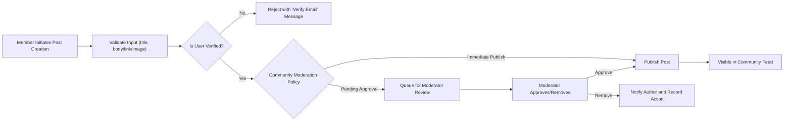
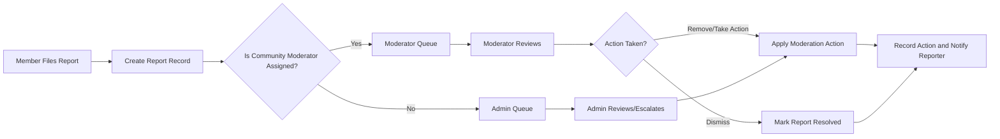
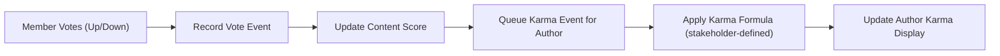

# communityPortal — Requirements Analysis and Functional Specification

## Executive summary and scope
communityPortal provides topic-focused community spaces where authenticated members create and curate content (text, links, images), engage through threaded comments and votes, and enforce community norms via reporting and moderation. The specification below defines business-level, testable requirements that enable backend teams and QA to implement and validate platform behavior for the requested feature set: registration/login, community creation, posting, voting, nested comments, karma, sorting, subscriptions, profiles, and reporting. All functional requirements use EARS language where applicable and include acceptance criteria and open decisions for stakeholders.

## Audience and goals
- Audience: product managers, backend engineers, QA, moderation leads, and operations.
- Primary goals: deliver an MVP that supports community creation, posting and interaction, robust moderation workflows, and measurable reputation mechanics while protecting platform integrity.
- Success metrics (examples): MAU, DAU, number of active communities, moderator resolution time (median), report backlog size, vote integrity rate, and retention (7/30/90 days).

## User roles and permission summary
Roles (business-level):
- guest: read-only visitor; can browse public communities and view posts/comment threads.
- member: verified authenticated user; can create posts, comment, vote, subscribe, and report.
- moderator: community-scoped role; can review reports, remove/approve content, pin/lock posts, and manage community rules in assigned communities.
- admin: global role; can manage users, resolve escalations, enforce bans, and update system-level moderation policies.

Permission rules (EARS):
- WHEN a guest attempts a member-only action, THE system SHALL deny the action and instruct the user to register and verify their email.
- WHEN a moderator attempts an action outside their assigned community scope, THE system SHALL deny the action and log the unauthorized attempt.

Appendix: permission matrix (business-level) is provided in Appendix A.

## Authentication and account lifecycle (business-level)
Authentication objectives: prevent abuse, support account recovery, ensure auditable actions, and enable role-based authorization.

EARS requirements:
- WHEN a visitor submits registration data (email, password, display name), THE system SHALL validate inputs and create an account in a "pending verification" state and send an email verification link to the provided email address.
- WHEN a user completes email verification, THE system SHALL transition the account to "active" and allow posting, voting, commenting, and subscribing.
- WHEN a user requests password reset, THE system SHALL send a single-use reset mechanism to the verified email address and ensure the token expires after a stakeholder-defined interval (recommended default: 1 hour).
- WHEN a user logs out, THE system SHALL invalidate the active session token(s) associated with the device or session in question.
- WHILE a user's account is suspended, THE system SHALL prevent the user from creating posts, comments, voting, or subscribing, and SHALL mark the account state as "suspended" in audit logs.

Session and lifecycle expectations (business-level):
- Authentication is required for actions that change platform state (create post/comment, vote, subscribe, report).
- Email verification is required before first post/comment and before voting (stakeholder may relax for certain flows; record as an open decision if different behavior is desired).

Acceptance criteria:
- Registration with valid inputs produces an unverified account and triggers verification email within 60 seconds under normal conditions.
- Verified accounts are able to perform member actions; unverified accounts are blocked from state-changing actions and receive a clear message explaining the restriction.

## Core features (each feature includes description, user stories, EARS requirements, acceptance criteria, and input validation rules)

### 1) User registration and login
Description: Secure account creation, login, logout, verification, and password recovery.
User stories: register, verify email, login, logout, reset password.

EARS requirements:
- WHEN a user submits registration information, THE system SHALL validate email format, password strength (minimum 8 characters including letters and numbers), and uniqueness of username/email and create a pending account.
- IF the provided email already exists in the system, THEN THE system SHALL reject registration and provide guidance to sign in or reset password.
- WHEN a verified user provides valid credentials, THE system SHALL authenticate and establish a session within user-facing performance expectations.

Input validation (business-level):
- Email: syntactically valid; block disposable-email domains per policy if required.  
- Password: minimum 8 characters; at least one letter and one number; recommend enforcement of breached-password lists.

Acceptance criteria:
- Valid registration results in a pending account with verification email dispatched.
- Login with valid credentials establishes session; invalid credentials return a generic error (no account enumeration).

### 2) Create communities (subreddits)
Description: Members can create communities with a unique name, description, and membership policy.

EARS requirements:
- WHEN a member requests creation of a community, THE system SHALL validate name uniqueness (case-insensitive) and enforce naming policy (allowed characters and length).  
- WHERE community creation is gated (account age or karma threshold), THE system SHALL check eligibility and deny creation when constraints are not met.
- IF a community is created as "private", THEN THE system SHALL require the creator to set membership rules (invite-only, by-request) and SHALL enforce visibility accordingly.

Input validation rules (business-level):
- Community name: recommended default 3–21 characters, lowercase letters, digits, hyphens; uniqueness is enforced case-insensitively.
- Description: max 300 characters (business default).

Acceptance criteria:
- Valid community creation yields an active community or a "pending" community if approval is required.
- Duplicate names are rejected with a descriptive reason.

### 3) Post text, links, or images in communities
Description: Members can submit posts that are text, link, or image type assigned to a single community. Community-level moderation rules apply.

EARS requirements:
- WHEN a member creates a post, THE system SHALL validate required fields: title (non-empty), and at least one of body/link/image depending on post type.
- IF a post contains images, THEN THE system SHALL enforce platform-configurable limits on image size, format, and number per post; images violating rules SHALL be rejected with a clear error message.
- WHEN a post is submitted, THE system SHALL associate the post with the author, target community, and a timestamp and set visibility according to community moderation settings (published or pending review).

Input validation (business-level):
- Title: 1–300 characters (default).  
- Text body: recommended max 40,000 characters (configurable).  
- Link: must be syntactically valid URL (http/https).  
- Images: allowed formats and size limits are stakeholder decisions; default recommendation: JPEG/PNG/GIF up to 10 MB per file.

Acceptance criteria:
- Posts with valid inputs accepted and become visible per community policy; invalid posts are rejected with field-level errors.

### 4) Upvote/downvote posts and comments
Description: Members can upvote or downvote posts/comments; voting affects content score and may affect karma.

EARS requirements:
- WHEN an authenticated member casts a vote on a post or comment, THE system SHALL record the vote and ensure one active vote per user per item.  
- IF a member casts the same vote twice, THEN THE system SHALL treat it as a no-op or a vote-removal according to configured behavior; changing vote from up to down SHALL update the recorded vote.
- WHERE voting eligibility is gated (minimum account age or karma), THE system SHALL prevent voting until eligibility is met.

Acceptance criteria:
- Single active vote per user per item is enforced; vote changes update totals deterministically.
- Unauthenticated users are denied voting with a clear call-to-action to sign in.

### 5) Comment on posts with nested replies
Description: Members can comment and reply to comments with nested threading; nesting depth is configurable for usability.

EARS requirements:
- WHEN a member submits a comment or reply, THE system SHALL associate the comment with the parent (post or comment) and record a timestamp and author identity.
- WHERE a maximum nesting depth is configured, THE system SHALL prevent deeper replies and present a clear message.
- IF a comment exceeds allowed length, THEN THE system SHALL reject it with a validation message.

Input validation: comment body 1–10,000 characters (default).

Acceptance criteria:
- Threaded retrieval preserves parent-child ordering; depth limit is enforced.

### 6) User karma system
Description: A reputation metric aggregated from votes and other actions, visible on profiles and used for gating where configured.

EARS requirements:
- WHEN a vote or other karma-affecting action occurs, THE system SHALL record the event and update a user's karma according to stakeholder-defined rules.
- IF karma thresholds gate privileges (e.g., community creation, voting), THEN THE system SHALL enforce those thresholds consistently.
- WHERE the karma formula is unspecified, THE system SHALL mark karma calculation as "stakeholder-defined" and store raw events until formula is finalized.

Acceptance criteria:
- Karma is visible on user profiles and is updated in an auditable way after vote events per the configured formula.

Open decision (must be resolved by stakeholders): the exact karma calculation formula (weights, decay, caps).

### 7) Sort posts by hot, new, top, controversial
Description: Provide community discovery by ordering posts via modes: new, top, hot, controversial.

EARS requirements:
- WHEN a user requests a sorting mode, THE system SHALL return posts ordered according to the business-defined algorithm for that mode.
- IF sorting parameters (time windows, decay) are unspecified, THEN THE system SHALL default to "new" and SHALL flag sorting algorithms as stakeholder decision items.

Acceptance criteria:
- Sorting modes produce consistent ordering according to documented business formulas; default modes available are "new" and "top" until "hot"/"controversial" formulas are finalized.

### 8) Subscribe to communities
Description: Members may subscribe/unsubscribe to communities; subscriptions influence personalized feeds and quick access lists.

EARS requirements:
- WHEN a member subscribes or unsubscribes, THE system SHALL update their subscription list and reflect changes in personalized feed logic.
- IF an unauthenticated user tries to subscribe, THEN THE system SHALL direct them to register/login.

Acceptance criteria:
- Subscriptions persist and take effect immediately in feed generation.

### 9) User profiles showing their posts and comments
Description: Profiles present public posts, comments, join date, and karma.

EARS requirements:
- WHEN a profile is requested, THE system SHALL present the user's public posts and comments and displayed karma subject to their privacy settings.
- IF privacy controls are configured, THEN THE system SHALL respect those settings in all profile views.

Acceptance criteria:
- Profiles show public activity and karma; privacy settings are enforced.

### 10) Report inappropriate content
Description: Members may file reports; reports create moderation tasks routed to community moderators and escalated to admins when appropriate.

EARS requirements:
- WHEN a member files a report, THE system SHALL record reporter identity, target item, reason, severity, and timestamp and add it to the appropriate moderation queue.
- IF the report is marked urgent or meets escalation rules (e.g., multiple reports in short time), THEN THE system SHALL escalate to admin review and flag the report for prioritized handling.
- WHEN a moderator or admin takes action on a report, THE system SHALL record the action, actor, and timestamp for audit and notify the reporter and affected author as required.

Acceptance criteria:
- Reports appear in moderator queues within a short business timeframe (recommendation: within 60 seconds) and escalations are visible to admins.

## Business processes and workflows
The platform must define complete end-to-end workflows for content lifecycle, moderation, and reputation updates.

Mermaid: Post creation to publish flow

Mermaid: Report and moderation flow

Mermaid: Vote and karma update flow

Note: All mermaid labels use double quotes and follow syntax rules.

## Data entities (business-level only)
Primary entities implied by features (business attributes):
- User: userId, username, displayName, emailVerified, createdAt, karma, roles
- Community: communityId, name, description, visibility, createdAt, moderators
- Post: postId, communityId, authorId, type, title, body/link/image references, createdAt, status, score
- Comment: commentId, postId, parentCommentId, authorId, body, createdAt, status, score
- Vote: voteId, voterId, targetType, targetId, value, createdAt
- Subscription: subscriptionId, userId, communityId, createdAt
- Report: reportId, reporterId, targetType, targetId, reason, severity, status, assignedModeratorId, createdAt
- KarmaEvent (audit): eventId, userId, delta, cause, createdAt

## Business rules and validation (selected)
- Community name uniqueness: THE system SHALL enforce case-insensitive uniqueness for community names.
- Posting eligibility: THE system SHALL require email verification before posting and voting unless stakeholder explicitly allows exceptions.
- Voting semantics: THE system SHALL allow a single active vote per user per item; vote changes update the existing vote record rather than create duplicates.
- Karma adjustments: THE system SHALL base karma on recorded events and only apply an agreed formula; if a post is removed for policy reasons, THE system SHALL reverse its karma effects per policy.
- Rate limits (business defaults to configure): posts per user per hour, comments per minute, votes per minute; default placeholders must be set by stakeholders before launch.

## Error handling and recovery (EARS examples)
- IF a user attempts to create a post with a missing title, THEN THE system SHALL reject the post and return an error message: "Title is required."  
- IF a user attempts to register with an email already in use, THEN THE system SHALL reject the registration and instruct the user to sign in or use password recovery.  
- IF moderation action fails due to transient internal error, THEN THE system SHALL inform the moderator, retry the action if safe, and log the failure for ops review.

User-facing expectations: error messages must be clear, localized, and provide actionable next steps.

## Performance and non-functional expectations (business-level)
- WHEN a user performs critical interactions (login, create post, vote), THE system SHALL respond within 2 seconds under normal load as a business target.
- WHEN loading a community page (first 25 posts), THE system SHALL return paginated results within 3 seconds under normal load.
- Moderation prioritization: THE system SHALL prioritize visibility of high-severity reports to moderators and admins; recommended target: 95% of high-severity reports visible in queues within 60 seconds.

Note: Engineering must convert these business targets into capacity planning, SLAs, and monitoring.

## Compliance, retention and privacy (business commitments)
- THE system SHALL honor lawful removal requests and data subject rights in the applicable jurisdictions (GDPR/CCPA). The legal team SHALL define retention windows and deletion semantics.
- WHEN a user requests account deletion, THE system SHALL soft-delete personal data and preserve necessary audit logs for legal holds; final purge timelines are stakeholder-defined (recommended default: 30–90 days for soft-delete window).

## Acceptance criteria and QA test cases (high level)
- Registration: valid sign-up, verification, and successful posting after verification.
- Community creation: unique name enforcement, visibility settings applied, and moderator assignment confirmed.
- Posting: valid posts accepted; invalid posts rejected with descriptive errors.
- Voting: single active vote per item enforced; vote changes update scores correctly.
- Commenting: nested replies preserved and depth limit enforced when configured.
- Reporting: report creation, moderator visibility, and audit logs for moderator actions.
- Karma: updates reflect recorded events per agreed formula (or are clearly marked pending if formula TBD).

## Open decisions required from stakeholders (prioritized)
1. Karma calculation formula (weights for post upvote/downvote, comment upvote/downvote, time decay) — BLOCKER for accuracy of reputation and gating.  
2. Community creation policy: free for verified members vs gated by karma/age — affects spam risk.  
3. Image hosting approach and size/format limits — affects operational cost and abuse surface.  
4. Default rate limits (posts/comments/votes per time window) — required to implement anti-abuse protections.  
5. Sorting algorithm definitions for "hot" and "controversial" — required for deterministic acceptance testing.  
6. Moderator SLA windows and escalation thresholds — required to meet business moderation targets.

Each open decision MUST be recorded and the stakeholder response fed into the final functional specification before engineering begins.

## Appendix A — Permission Matrix (business-level)
| Action | Guest | Member | Moderator (assigned) | Admin |
|---|---:|---:|---:|---:|
| Browse public communities | ✅ | ✅ | ✅ | ✅ |
| Register / Login | ❌ | ✅ | ✅ | ✅ |
| Create community | ❌ | ✅* | ✅ (approve) | ✅ |
| Create post | ❌ | ✅ | ✅ | ✅ |
| Comment | ❌ | ✅ | ✅ | ✅ |
| Vote | ❌ | ✅** | ✅ | ✅ |
| Report content | ❌ | ✅ | ✅ | ✅ |
| Moderate assigned community | ❌ | ❌ | ✅ | ✅ |
| Global moderation / ban | ❌ | ❌ | ❌ | ✅ |

*Community creation may be subject to rate limits or gating.  
**Voting may be gated by account age or karma thresholds.

## Appendix B — Example user-facing message templates (business-ready)
- Registration duplicate email: "An account with that email already exists. Sign in or reset your password."  
- Verification required: "Please verify your email to post or vote. A verification link was sent to your address."  
- Post pending moderation: "Your post is pending moderator review and will appear once approved."  
- Report confirmation: "Report received. Moderators will review this content; you will be notified of outcomes per community policy."

## Appendix C — Glossary
- Member: authenticated, verified platform user.  
- Community: topic-focused group (subreddit equivalent).  
- Karma: aggregate reputation metric for members derived from community interactions.  
- Moderator: community-level privileged user for moderation tasks.  
- Admin: platform-level privileged user.

