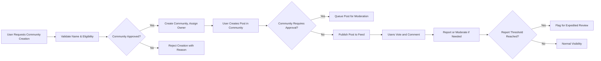

# Requirements Analysis Report — communityBbs (Reddit-like Community Platform)

## 1. Executive Summary and Scope
communityBbs provides a topic-centered, community-driven discussion platform where users create communities, share content (text, links, images), comment with nested replies, vote, accumulate karma, and manage subscriptions. The platform emphasizes transparent moderation, recoverable content lifecycles, and clear, auditable administrative actions. The following requirements describe WHAT the system must do in business terms; technical implementation (APIs, schema, libraries) is left to the engineering team.

Scope: user registration and authentication, community lifecycle, post and comment management, voting and karma, feed sorting (hot/new/top/controversial), subscriptions and notifications, reporting and moderation, media constraints, event processing, data lifecycle and retention, non-functional SLAs, acceptance criteria, and operational processes.

## 2. Business Model and Success Metrics
- Revenue: advertising, premium subscriptions, community-level monetization, analytics services.
- Key Metrics: Monthly Active Users (MAU), Daily Active Users (DAU), retention (7/30/90 days), posts per MAU, moderation resolution time, report-to-action SLA, average session length, revenue per MAU.
- Business Targets (example): 100k MAU in 12 months, report triage median < 24 hours, 99.9% data durability for user content.

## 3. Actors and Permission Matrix
Actors (business-level):
- visitor: browse public communities and read posts/comments. Cannot create content, vote, subscribe, or file authenticated reports.
- communityMember: registered, verified user able to create communities (subject to rules), create posts/comments, vote, subscribe, report, edit own content within windows.
- communityModerator: community-appointed member with moderation privileges inside a specific community (approve posts, remove content, manage membership).
- systemAdmin: platform administrators with global moderation, suspension/ban, audit, and escalation capabilities. All admin actions are auditable.

Permission matrix (business-level):
- Browse public content: visitor, communityMember, systemAdmin
- Create community: communityMember (subject to eligibility), systemAdmin
- Create post/comment: communityMember, communityModerator, systemAdmin
- Vote: communityMember, communityModerator, systemAdmin
- Moderate reports: communityModerator (community scope), systemAdmin (global)
- Suspend/ban users: systemAdmin

## 4. Authentication and Session Management (Business Workflows)
- WHEN a visitor registers with email and password, THE system SHALL create an account in "unverified" state and SHALL send an email verification token that expires by default after 7 days.
- WHEN a user redeems a verification token within its validity window, THE system SHALL mark the account as "verified" and SHALL enable content-creation privileges.
- WHEN a verified user authenticates, THE system SHALL issue short-lived access tokens and longer-lived refresh tokens. Access tokens SHOULD be 15–30 minutes and refresh tokens SHOULD be configurable between 7–30 days; engineers implement storage strategy (httpOnly cookies recommended).
- IF a user revokes sessions or changes password, THEN THE system SHALL invalidate all active refresh tokens for that account within a business-configured window (example: within 60 seconds).
- WHEN a user requests password reset, THE system SHALL issue a single-use, time-limited reset token and SHALL allow password change only after successful token validation.
- WHEN an account is suspended, THE system SHALL prevent authentication and shall show a clear suspension message with reason and appeal path.

Session and token auditability:
- THE system SHALL record session issuance and revocation events in an audit log including actorId, tokenId (or opaque session id), timestamp, and client metadata.

## 5. Functional Requirements (EARS-formatted)
All functional requirements below are written in EARS format and are testable from a business perspective.

### 5.1 Community Management
- WHEN a communityMember requests to create a new community, THE system SHALL validate that the requested community name is unique (case-insensitive) and that the description is no longer than 400 characters.
- IF the community name conflicts with reserved or banned names, THEN THE system SHALL reject the creation with a clear business error indicating the reason.
- WHEN a community is created, THE system SHALL assign the creator as community owner with owner-level controls and SHALL allow the owner to appoint communityModerators.
- WHERE a community is marked "private" or "restricted", THE system SHALL require membership approval for non-members to view or post.
- IF a community accrues repeated policy violations, THEN THE system SHALL allow systemAdmin to place the community in a "quarantine" state restricting new posts while investigation occurs.

### 5.2 Post Management (text, link, image)
- WHEN a communityMember creates a post, THE system SHALL accept post types: text, link, or image and SHALL validate required fields per type.
- IF creating a text post, THEN THE system SHALL enforce a title max length of 300 characters and body max length of 40,000 characters.
- IF creating a link post, THEN THE system SHALL validate the URL uses an allowed scheme (http or https) and SHALL sanitize or preview metadata without executing remote scripts.
- IF an image is attached, THEN THE system SHALL enforce allowed MIME types (JPEG, PNG, GIF) and per-image file size limit default 10 MB and max 10 images per post; uploads violating these limits SHALL be rejected with a clear error.
- WHEN a community requires pre-approval for new posts, THEN THE system SHALL queue new posts for moderator approval and SHALL mark them unpublished until mod action is taken.

### 5.3 Commenting and Nested Replies
- WHEN a communityMember posts a comment, THE system SHALL accept comments up to 10,000 characters and SHALL attach metadata (authorId, timestamp, parentCommentId optional).
- IF a comment receives replies, THEN THE system SHALL maintain logical nesting; the UI may collapse beyond a rendering depth for readability but backend must store full thread relationships.
- WHEN a comment receives multiple abuse reports, THE system SHALL mark it for moderator review and MAY hide it pending review per moderation rules.

### 5.4 Voting and Karma
- WHEN a communityMember casts an upvote or downvote on a post or comment, THE system SHALL record the vote and SHALL ensure one active vote per user per target; changing or removing votes SHALL update counts and karma accordingly.
- THE system SHALL compute a user's karma using configurable weights (business example defaults: post upvote +10, post downvote -5, comment upvote +2, comment downvote -1). Karma calculation parameters SHALL be tunable by administrators.
- IF coordinated or suspicious voting patterns are detected, THEN THE system SHALL flag involved accounts, temporarily suspend vote effects from those accounts, and create cases for human review.

### 5.5 Feed Sorting (hot, new, top, controversial)
- WHEN a feed is requested, THE system SHALL support sorting modes: "hot" (time-decay popularity), "new" (most recent), "top" (highest score within window), and "controversial" (high upvote/downvote disagreement).
- WHEN pagination is used, THE system SHALL return pages with default size 25 and support up to 100 items per page at client request.
- IF a client selects "top" with a time window, THEN THE system SHALL constrain results to that window.

### 5.6 Subscriptions and Notifications
- WHEN a user subscribes to a community, THE system SHALL include the community's new posts in the user's personalized feed and SHALL schedule notifications per the user's preferences.
- IF a user opts into email notifications, THEN THE system SHALL batch email digests to a configurable frequency (default max 5 email digests per day) to avoid excessive emails.
- WHEN a user unsubscribes, THEN THE system SHALL immediately cease prioritized surfacing for that community in personalized recommendations.

### 5.7 User Profiles and Privacy
- WHEN a user views another user's public profile, THE system SHALL display public posts and comments, aggregate karma, and community memberships; private profile fields SHALL be hidden per privacy settings.
- IF the profile owner views their own profile, THEN THE system SHALL display private metrics (pending reports, moderation actions) for their account and for systemAdmin.

### 5.8 Reporting and Moderation
- WHEN a user files a report, THE system SHALL create a report record capturing reporterId (nullable if anonymous reporting for public safety is allowed), targetId, reason code from a taxonomy (spam, harassment, illegal, copyright, other), optional explanation (<=1000 characters), and timestamp.
- IF a content item receives a configurable threshold of reports within a time window (e.g., 5 reports within 48 hours), THEN THE system SHALL flag it for expedited moderator review and MAY hide it pending review.
- WHEN moderators or systemAdmin act on reports, THE system SHALL record the action, outcome, acting user, and timestamp in an immutable audit trail and SHALL notify the reporter of the resolution per privacy rules.

## 6. Business Rules and Validation
- Title length: THE system SHALL enforce max title length 300 characters.
- Text body length: THE system SHALL enforce max text body length 40,000 characters.
- Comment length: THE system SHALL enforce max comment length 10,000 characters.
- Image policy: THE system SHALL accept JPEG, PNG, GIF; per-image max size 10 MB; max 10 images per post; disallowed types SHALL be rejected.
- Edit windows: THE system SHALL allow creators to edit their posts/comments for 24 hours after creation; edits after that require moderator action and SHALL be logged as admin edits.
- Soft delete: THE system SHALL perform soft deletes with a default retention period of 30 days before permanent removal unless legal hold applies.
- Rate limits (business defaults): create posts max 10/hour, comments max 200/day, votes max 100/hour; limits SHALL be configurable by administrators.

## 7. Moderation and Escalation Workflow
Mermaid: Create Community -> Post -> Moderation flow

```mermaid
graph LR
  A["User Requests Community Creation"] --> B["Validate Name & Eligibility"]
  B --> C{"Community Approved?"}
  C -->|"Yes"| D["Create Community, Assign Owner"]
  C -->|"No"| E["Reject Creation with Reason"]
  D --> F["User Creates Post in Community"]
  F --> G{"Community Requires Approval?"}
  G -->|"Yes"| H["Queue Post for Moderation"]
  G -->|"No"| I["Publish Post to Feed"]
  I --> J["Users Vote and Comment"]
  J --> K["Report or Moderate if Needed"]
  K --> L{"Report Threshold Reached?"}
  L -->|"Yes"| M["Flag for Expedited Review"]
  L -->|"No"| N["Normal Visibility"]
```

Triage and escalation:
- WHEN a report is submitted, THE system SHALL apply automated triage heuristics (spam scoring, image safety, prior history) and SHALL route to community moderators or systemAdmin based on priority.
- IF automated heuristics indicate probable illegal content, THEN THE system SHALL prioritize human review, preserve evidence for legal compliance, and SHALL not disclose details publicly until review completes.
- Moderators actions SHALL include: remove content (soft delete), warn user, temporary ban, escalate to systemAdmin; all actions SHALL be logged with actorId and reason.

Appeals:
- WHEN content is removed, THE system SHALL notify the content author with rationale and SHALL allow an appeal submission; appeals SHALL be reviewed by systemAdmin or delegated staff within an SLA (business example: initial response within 7 business days).

## 8. Event Processing, Notifications, and Real-time Expectations
- Event categories: user actions (post/comment/vote), moderation events (reports, actions), system events (digest ready, delivery failures).
- WHEN a significant event occurs (reply to a user's post, moderation action on a user's content), THE system SHALL create notifications and attempt in-app delivery within 5 seconds for active sessions; if not active, THE system SHALL schedule push/email per user preferences.
- Deduplication: THE system SHALL deduplicate notifications by canonical event id to avoid duplicates; aggregated digests SHALL present grouped events.
- Retries: IF external delivery fails, THEN THE system SHALL retry with exponential backoff for a configurable number of attempts and SHALL escalate failures for Critical events to systemAdmin after retries are exhausted.

## 9. Data Lifecycle, Retention, and Auditability
- User accounts: unverified -> verified -> suspended/banned -> deleted_soft -> deleted_hard. THE system SHALL allow users to request deletion; soft-deleted accounts and associated content SHALL be retained for 30 days by default for recovery, then permanently deleted unless legal hold applies.
- Content: published -> edited -> soft_deleted -> archived -> hard_deleted. Soft-deleted content SHALL be retained 30–90 days (configurable) before hard deletion.
- Audit logs: THE system SHALL retain moderation and admin audit logs for at least 2 years (business default) and SHALL include actorId, action, targetId, timestamp, and reason.
- Legal holds: WHEN legal hold applies, THE system SHALL preserve related data indefinitely until cleared and SHALL suspend normal retention-driven deletion.

## 10. Non-Functional Requirements and SLAs (Business Targets)
- Read latency (feed retrieval): THE system SHALL return first page of community feed (20 items) within 2 seconds 95% of the time under normal load.
- Write latency (post/comment creation): THE system SHALL persist writes and return acknowledgment within 3 seconds 95% of the time under normal load.
- Moderation SLAs: critical reports initial triage within 4 hours; high priority within 24 hours; normal reports within 72 hours.
- Availability targets: core APIs for reads and writes target 99.9% availability monthly; overall platform business objective 99.95% for read-only browsing.
- Scalability targets: initial capacity to support 100k MAU with headroom; capacity planning and scaling triggers documented operationally.

## 11. Security, Privacy and Compliance Considerations
- THE system SHALL require encrypted transport for all authenticated interactions.
- THE system SHALL follow data minimization principles; only required PII collected at registration.
- THE system SHALL implement GDPR/CCPA business-level rights: data access/export within 30 days, deletion requests handled within 30 days subject to legal hold exceptions.
- DMCA and copyright: THE system SHALL implement takedown workflow and notification to content owners and complainants, and SHALL preserve records for disputes.
- Audit and monitoring: THE system SHALL log admin actions and moderation decisions for compliance review.

## 12. Acceptance Criteria and Example Scenarios
- Registration: WHEN a user registers and redeems verification token, THE system SHALL activate the account and allow posting. Acceptance: account becomes active and posting succeeds.
- Post creation: WHEN a verified user submits a text post within size limits, THE system SHALL publish it (or queue per community rules) and make it retrievable via feed queries. Acceptance: post visible to authorized viewers.
- Voting: WHEN a user upvotes a post, THE system SHALL increment the visible score and update author karma per weights. Acceptance: visible score and karma change within 5 seconds.
- Reporting: WHEN 5 distinct users report the same post within 48 hours for harassment, THEN THE system SHALL flag for expedited moderator review. Acceptance: post appears in expedited queue and moderator sees aggregated reports.

## 13. Operational Considerations and Monitoring
- Metrics: signups/hour, MAU/DAU, posts/hour, comments/hour, votes/hour, reports/hour, moderation queue size, report-to-action time, error rates by endpoint.
- Alerts: high-severity incidents for content safety, mass-report spikes, sudden voting anomalies, or service degradation.
- Operations: scheduled maintenance windows with notifications 72 hours in advance; emergency maintenance allowed with rapid stakeholder notification.

## 14. Appendices
### 14.1 Glossary
- communityMember: registered user with posting privileges
- karma: reputation score derived from votes and system actions
- moderator: community-assigned reviewer for content in a community
- systemAdmin: platform operator with global privileges

### 14.2 Example User-Facing Messages
- AUTH_REQUIRED: "Please verify your email or sign in to perform this action."
- TITLE_TOO_LONG: "Title exceeds 300 characters. Please shorten it." 
- IMAGE_TOO_LARGE: "One or more images exceed the 10 MB limit." 
- RATE_LIMIT_EXCEEDED: "You have reached the action limit. Please try again in X minutes."

### 14.3 Mermaid Diagrams (Validation Note)
All Mermaid diagrams in this document use double-quoted labels and correct arrow syntax to ensure diagram validity.

---

Change Log:
- 2025-10-31: Initial complete business requirements and EARS conversions for communityBbs.