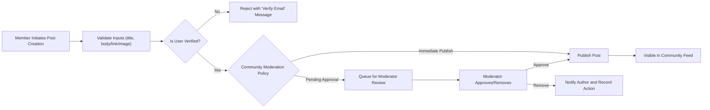
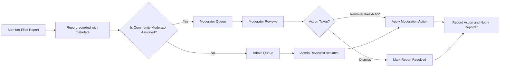

# 03 - Core Features for communityPortal

## Document Purpose and Scope
Provide business-level, developer-actionable requirements for the core feature set requested for the communityPortal platform (a Reddit-like community platform). Include feature descriptions, representative user stories, explicit functional requirements using EARS templates, acceptance criteria, validation rules, processing logic, error scenarios, data entities, and priority open questions for stakeholders. Avoid implementation-level details (no APIs, no DB schema). Target audience: product owners, backend developers, QA engineers, and moderators.

## System Purpose and High-Level Goals
Enable community-driven discussions organized into named communities. Support content creation (text, links, images), nested discussion threads, voting, community formation, subscription, and moderation workflows. Surface quality content through voting and provide tools for moderation and reporting.

High-level goals:
- Enable secure, verified participation for members; guests view public content.
- Provide deterministically testable business behaviors (EARS-formatted requirements).
- Support moderation workflows and auditable actions for safety and compliance.
- Deliver an MVP scope that enables community formation, posting, commenting, voting, subscriptions, profiles, and reporting.

Success metrics (business-level):
- Monthly Active Users (MAU)
- Daily Active Users (DAU)
- Active communities count
- Average posts per community per week
- Moderator report resolution median time
- Vote integrity and fraud incident rate

## User Roles and Authentication (Business-Level)
Roles and responsibilities:
- guest: read-only access to public communities; cannot post, comment, vote, subscribe, or report.
- member: authenticated, verified user able to create posts (text/link/image), comment, vote, subscribe, report, and view/edit profile.
- moderator: appointed to specific communities; can review and act on reports, remove/approve posts/comments, pin/lock posts, and manage community rules in assigned communities.
- admin: global administrator with platform-wide privileges including bans, escalations, and system policy management.

EARS authentication summary:
- WHEN a visitor registers with email and password, THE system SHALL create an account in "pending verification" state and send a verification mechanism to the provided email address.
- WHEN a user verifies their email, THE system SHALL transition the account to "active" and grant posting, commenting, voting, and subscription privileges.
- WHILE a user's account is suspended, THE system SHALL prevent the user from creating posts, comments, votes, or subscriptions.
- WHEN a user requests a password reset, THE system SHALL send a single-use reset mechanism to the verified email address.

Permission matrix (business-level):
- Guests: browse public content
- Members: create posts, comments, votes, subscriptions, reports
- Moderators: community-scoped moderation actions
- Admins: platform-scoped moderation and account management

## Core Feature List
1. User registration and login
2. Create communities (subreddits)
3. Post text, links, or images in communities
4. Upvote/downvote posts and comments
5. Comment on posts with nested replies
6. User karma system
7. Sort posts by hot, new, top, controversial
8. Subscribe to communities
9. User profiles showing their posts and comments
10. Report inappropriate content

For each feature below: description, representative user stories, functional requirements (EARS), validation rules, processing steps, acceptance criteria, error scenarios, and open questions.

---

### 1) User registration and login
Description: Allow visitors to register and authenticate so they may participate as members. Require email verification before posting and voting.

User stories:
- As a visitor, I want to register with email and password so I can post.
- As a member, I want to log in and log out so my actions are attributed to me.
- As a member, I want to reset my password when forgotten.

Functional requirements (EARS):
- WHEN a visitor submits registration data (email, password, displayName), THE system SHALL validate email format, enforce password strength rules, create an account in "pending verification" state, and send a verification mechanism to the provided email.
- IF the email is already in use, THEN THE system SHALL reject registration and instruct the visitor to sign in or use password recovery.
- WHEN a verified user presents valid credentials, THE system SHALL establish an authenticated session (business-level session behavior left to implementers) and allow member actions.
- IF authentication fails, THEN THE system SHALL return a generic authentication failure message and increment a failed-attempt counter for rate-limiting and anti-abuse.

Input validation rules and examples:
- Email: syntactically valid email (example: user@example.com). Reject disposable email domains if configured (STAKEHOLDER-DECISION).
- Password: minimum 8 characters with at least one letter and one number by default (configurable).
- DisplayName: 3-30 characters; disallow profanity and reserved names.

Processing logic (high-level):
1. Receive registration payload.
2. Validate inputs.
3. Create account in "pending verification" state.
4. Send verification email.
5. On verification, transition account to active.

Acceptance criteria:
- Valid registration triggers verification and account creation in pending state.
- Valid credentials for verified users result in active sessions and access to member features.
- Invalid inputs return field-level errors.

Error scenarios and recovery (EARS):
- IF registration submission misses required fields, THEN THE system SHALL reject with field-specific messages and guidance.
- IF verification link expires, THEN THE system SHALL allow resending verification and present guidance.

Open questions:
- Should disposable email domains be blocked? (STAKEHOLDER-DECISION)
- Password complexity exact policy (STAKEHOLDER-DECISION)

---

### 2) Create Communities (Subreddits)
Description: Allow authenticated members to create topic-focused communities with a unique name, description, and moderation settings.

User stories:
- As a member, I want to create a new community so others can join.

Functional requirements (EARS):
- WHEN a member requests community creation with a proposed name and description, THE system SHALL validate name uniqueness and allowed character set and either create the community or reject with a clear reason.
- IF community creation is subject to quota or approval, THEN THE system SHALL mark the community as "pending" and notify the creator of the status.

Validation rules and recommendations:
- Community name: 3-21 characters, lowercase letters, digits, hyphens; uniqueness enforced case-insensitive. (Recommend this default; stakeholders may change.)
- Description: max 300 characters.
- Quotas: Default allow 1 community creation per 30 days per account unless stakeholders define otherwise (STAKEHOLDER-DECISION).

Processing logic:
1. Receive create request.
2. Validate name format and uniqueness.
3. If allowed, create community and assign creator as initial moderator; otherwise, record as pending for approval.

Acceptance criteria:
- Unique, valid names create communities; duplicates are rejected with a clear message.
- Creation rate limits (if configured) prevent excessive creation and return explanatory messages.

Error scenarios (EARS):
- IF the community name already exists, THEN THE system SHALL reject creation and provide alternatives or guidance.

Open questions:
- Should community creation be limited by account age or karma? (STAKEHOLDER-DECISION)
- Should private/invite-only communities be supported in MVP? (STAKEHOLDER-DECISION)

---

### 3) Post text, links, or images in communities
Description: Members may submit posts of type text, link, or image. Posts belong to a single community and inherit its moderation settings.

User stories:
- As a member, I want to create text, link, or image posts in a community.

Functional requirements (EARS):
- WHEN a verified member creates a post, THE system SHALL validate required fields (title and at least one of body/link/image) and confirm the target community exists and the member has posting rights.
- IF the post contains images, THEN THE system SHALL validate image type and size per business-configured limits and reject disallowed uploads.
- WHEN a post is created, THE system SHALL record author, community, post type, and timestamp and set visibility per community moderation settings.

Validation rules and recommendations:
- Title: required, 1-300 characters.
- Body (text): optional for link/image posts; max 40,000 characters recommended.
- Link: must be a valid URL; if link previews are enabled, preview generation is a UI/implementation detail.
- Images: allow formats JPEG, PNG, GIF, WEBP; max size default 10 MB (STAKEHOLDER-DECISION).

Processing logic:
1. Receive post payload.
2. Validate fields and media.
3. Check community moderation settings: publish immediately or queue for review.
4. Persist post record and notify community moderators if pending review.

Acceptance criteria:
- Valid posts accepted and visible per community rules; invalid posts rejected with clear error messages.
- Image uploads exceeding size or unsupported formats rejected with explanations.

Error scenarios and recovery (EARS):
- IF a post submission lacks required title, THEN THE system SHALL reject with "Title is required." and allow the author to correct and resubmit.
- IF image upload fails due to size or format, THEN THE system SHALL present allowed types and size and allow reupload.

Open questions:
- Image hosting strategy (in-house vs third-party CDN)? (STAKEHOLDER-DECISION)
- Should markdown be supported for post bodies? (Recommend a sanitized markdown subset; STAKEHOLDER-DECISION)

---

### 4) Upvote/Downvote Posts and Comments
Description: Members can upvote or downvote posts and comments. Each user may have one active vote per item; changing a vote updates the existing vote.

User stories:
- As a member, I want to upvote useful content and downvote low-quality content.

Functional requirements (EARS):
- WHEN an authenticated member casts a vote on a post or comment, THE system SHALL record the vote and ensure a single active vote per member per target, updating aggregated totals.
- IF a member attempts to vote while unauthenticated or unverified, THEN THE system SHALL reject the action and prompt authentication or verification.
- WHERE voting restrictions apply (e.g., account age or karma threshold), THE system SHALL prevent voting until restrictions are met.

Validation rules:
- Vote value: +1 (upvote), -1 (downvote), or 0 (remove).
- Vote rate-limiting: default throttle of N votes per minute (recommend 30; STAKEHOLDER-DECISION).

Processing logic:
1. Receive vote intent.
2. Verify user eligibility and previous vote state.
3. Update vote record and content score.
4. Queue or compute karma effects per karma calculation rules.

Acceptance criteria:
- One active vote per user per item; vote changes update totals accordingly.
- Voting prohibited for unauthenticated/unverified users.

Error scenarios (EARS):
- IF a user attempts to vote too frequently, THEN THE system SHALL return a rate-limit message and suggest retry time.

Open questions:
- Should vote weight vary by karma or account age? (STAKEHOLDER-DECISION)
- Exact vote rate limits (STAKEHOLDER-DECISION)

---

### 5) Comment on Posts with Nested Replies
Description: Members can comment on posts and reply to comments, supporting nested threads with configurable depth limits for usability.

User stories:
- As a member, I want to reply to comments to continue focused discussions.

Functional requirements (EARS):
- WHEN a member submits a comment or a reply, THE system SHALL associate it with the parent post and optional parent comment and record timestamp and author.
- IF a reply would exceed maximum allowed nesting depth, THEN THE system SHALL reject the reply and instruct the user to post a new top-level comment.
- IF a comment exceeds max length, THEN THE system SHALL reject and return a validation message.

Validation rules and recommendations:
- Comment body: 1-10,000 characters recommended (STAKEHOLDER-DECISION).
- Nesting depth: default display nesting limit of 6 with ability to collapse deeper threads (recommendation; STAKEHOLDER-DECISION).

Processing logic:
1. Receive comment payload with parent references.
2. Validate length, depth, and community posting rights.
3. Persist comment and update post comment counts.

Acceptance criteria:
- Comments appear correctly threaded and attempts to exceed depth or length are rejected with clear messages.

Error scenarios and recovery (EARS):
- IF a reply exceeds nesting depth, THEN THE system SHALL return "Reply depth limit reached; post a new comment instead." and allow the user to recompose.

Open questions:
- Maximum nesting depth to store and to display (STAKEHOLDER-DECISION)

---

### 6) User Karma System
Description: Provide a reputation metric that reflects a user's contributions based on votes and other actions. Karma may gate privileges per business rules.

User stories:
- As a member, I want to see my karma to understand how the community perceives my contributions.
- As a moderator, I want to use karma as one indicator during moderation decisions.

Functional requirements (EARS):
- WHEN a vote affecting a user's content is processed, THE system SHALL create a KarmaEvent recording the effect and SHALL update the user's displayed karma according to stakeholder-defined rules.
- IF karma gates are configured (e.g., minimum karma to create communities), THEN THE system SHALL enforce those gates and deny actions that require higher karma.
- IF a post/comment is removed for violation and policy dictates karma reversal, THEN THE system SHALL reverse karma deltas caused by that content.

Recommended placeholder calculation (must be approved or replaced by stakeholder):
- Post upvote: +10
- Post downvote: -2
- Comment upvote: +3
- Comment downvote: -1

Processing logic:
1. Record vote event.
2. Create KarmaEvent with delta and reason.
3. Apply delta to user's visible karma and persist audit record.

Acceptance criteria:
- Karma updates reflect vote events within a reasonable processing window (recommend: within 10 seconds for UX; exact timing is implementation-specific).

Error scenarios (EARS):
- IF the karma calculation method is undefined, THEN THE system SHALL mark karma as "pending" and queue events until stakeholder provides the formula.

Open questions:
- Final karma formula and whether to use time decay or weighting (STAKEHOLDER-DECISION)

---

### 7) Sort Posts by Hot, New, Top, Controversial
Description: Provide sorting modes: new (chronological), top (score-based), hot (score + recency), controversial (high mixed votes). Exact algorithms must be stakeholder-approved.

User stories:
- As a member, I want to switch sorting to "Top" to see highest-scoring posts.

Functional requirements (EARS):
- WHEN a user requests posts in a given sort mode, THE system SHALL return posts ordered per the business-defined algorithm for that mode.
- IF time-window filters are requested (e.g., top in week), THEN THE system SHALL compute ordering restricted to that window.

Recommended defaults until stakeholder decision:
- New: newest first.
- Top: highest net score in the selected time window.
- Hot: apply score weighted by a time decay function (recommend classic score/time decay formula; STAKEHOLDER-DECISION).
- Controversial: surface items with high engagement and near-neutral net score.

Acceptance criteria:
- Sorting modes return deterministically ordered lists per the selected business algorithm and honor pagination.

Error scenarios:
- IF sorting algorithm parameters are missing, THEN THE system SHALL default to "New" ordering and log the missing parameter requirement for stakeholder decision.

Open questions:
- Approve hot/controversial formulas or accept defaults (STAKEHOLDER-DECISION)

---

### 8) Subscribe to Communities
Description: Members may subscribe/unsubscribe to communities; subscriptions affect personalized feeds and notifcations.

User stories:
- As a member, I want to subscribe to a community so its posts appear in my feed.

Functional requirements (EARS):
- WHEN a member subscribes to a community, THE system SHALL record the subscription and surface the community's posts in the member's subscription feed according to feed rules.
- WHEN a member unsubscribes, THEN THE system SHALL remove the subscription and stop including its posts in the personalized feed.

Validation rules:
- Subscription request must reference existing community and authenticated user.

Acceptance criteria:
- Subscribe/unsubscribe updates persist and reflect in personalized feed behavior within the agreed propagation window (recommend within 5 seconds under normal load).

Error scenarios:
- IF a guest attempts to subscribe, THEN THE system SHALL deny the action and instruct the user to authenticate.

Open questions:
- Notification model for subscriptions (email, in-app, digest frequency) (STAKEHOLDER-DECISION)

---

### 9) User Profiles Showing Their Posts and Comments
Description: Each member has a profile displaying public posts, comments, join date, and karma. Privacy controls may limit visibility.

User stories:
- As a member, I want to view my public activity and karma.

Functional requirements (EARS):
- WHEN a profile is requested, THE system SHALL return the member's public posts and comments, join date, and displayed karma subject to privacy settings.
- IF privacy options are configured, THEN THE system SHALL respect visibility rules when rendering profiles.

Acceptance criteria:
- Profiles display public posts and comments in chronological order and current karma.
- Privacy settings, if enabled, correctly affect visibility.

Error scenarios:
- IF a profile is private and a non-authorized viewer requests it, THEN THE system SHALL return a clear access-denied message with guidance about requesting access.

Open questions:
- What privacy granularity is required (profile fields, contributions, subscription list)? (STAKEHOLDER-DECISION)

---

### 10) Report Inappropriate Content
Description: Members can report posts or comments; reports produce moderation workflows and escalation capabilities.

User stories:
- As a member, I want to report content that violates rules for moderator review.

Functional requirements (EARS):
- WHEN a member files a report, THE system SHALL record reporter identity, target item, reason code, details, and timestamp and route it to the appropriate community moderator queue.
- IF a report is marked urgent, THEN THE system SHALL flag it for elevated review by admins.
- WHEN a moderator or admin acts on a report, THE system SHALL record the action, actor, and timestamp for auditability.

Validation rules:
- Report reason must be chosen from a configured list (spam, harassment, sexual content, illegal content, other). Free-text detail allowed up to 1000 characters.

Processing logic:
1. Record report with metadata.
2. Assign to community moderators or escalate to admin based on severity and configured thresholds.
3. Moderator acts and records resolution.

Acceptance criteria:
- Reports appear in moderator queues with all metadata and escalate according to configured rules.
- Moderator actions are auditable and notify reporter and content author as per notification policy.

Error scenarios:
- IF report submission fails due to transient error, THEN THE system SHALL allow retry and provide a case reference on successful submission.

Open questions:
- Exact escalation thresholds and moderator SLA (STAKEHOLDER-DECISION)

---

## Business Rules and Constraints (Global)
- Posting eligibility: only verified members may create posts and comments; guests are read-only.
- Community creation: allowed to authenticated members by default with configurable quotas.
- Voting: one active vote per user per item; repeat votes toggle or change the vote.
- Karma calculation: method is stakeholder-defined; until decided, display vote counts and mark karma as provisional if necessary.
- Moderation scope: moderators operate only within assigned communities; admins have global scope.
- Content visibility default: public unless community or moderation state indicates otherwise.
- Auditability: all moderation and administrative actions SHALL be recorded with actor, timestamp, reason, and scope.

## Main Data Entities (Business-Level)
- User: userId, username, displayName, emailVerified, joinDate, karma, roles, privacySettings
- Community: communityId, name, description, visibility, creatorUserId, moderators
- Post: postId, communityId, authorUserId, type, title, body, link, images (references), createdAt, status, score
- Comment: commentId, postId, parentCommentId, authorUserId, body, createdAt, status, score
- Vote: voteId, voterUserId, targetType, targetId, voteValue, createdAt
- Subscription: subscriptionId, userId, communityId, createdAt
- Report: reportId, reporterUserId, targetType, targetId, reasonCode, details, createdAt, status, assignedModeratorId
- KarmaEvent: eventId, userId, delta, reason, createdAt

Note: These are business-level attributes. Do not assume DB schema or indexes; implementation teams will design technical schemas.

## Moderation and Reporting Workflows (Mermaid diagrams)
Post creation and moderation flow:

Report and moderation escalation flow:

(Ensure mermaid labels use double quotes and proper arrow syntax.)

## Non-Functional Expectations (Business-Level)
Performance expectations (business targets):
- User-facing response times under normal load: login within 2 seconds, initial community page (20 items) within 2 seconds, post/comment creation acknowledgement within 3 seconds.
- Karma update propagation: visible within 10 seconds of vote event as a business target.
- Moderation visibility: new reports appear in moderator queues within 10 seconds.

Operational KPIs:
- Report resolution median time (target: <48 hours for community moderators; escalate to admin within 72 hours for high-severity reports).
- Vote fraud detection rate and false-positive rate thresholds to be defined by operations.

Security and compliance (business commitments):
- Email verification required for posting and voting.
- Moderation and administrative actions auditable and retained per retention policy (STAKEHOLDER-DECISION).
- Respect data subject rights (deletion/export) as required by applicable regulations.

## MVP Recommendation and Roadmap
MVP scope (minimum to validate product-market fit):
- Authentication (register, verify, login)
- Create communities (basic)
- Post text and link posts (image upload optional depending on hosting decision)
- Commenting with nested replies (depth limit configurable)
- Upvote/downvote
- Subscribe to communities
- User profiles and basic karma display (placeholder calculation)
- Reporting and basic moderator queue

Phase 2 (post-MVP):
- Image uploads and hosting
- Advanced sorting algorithms (hot/controversial tuning)
- Moderator tooling improvements and analytics
- Rate-limiting and anti-abuse refinements

## Open Questions (Prioritized)
1. Karma calculation formula and weighting (HIGH) — define exact point values and decay/weighting.
2. Image hosting strategy and size limits (HIGH) — host in-platform or use third-party CDN?
3. Community creation policy (HIGH) — who can create, rate-limits, and approval workflows.
4. Moderation SLAs and escalation thresholds (HIGH) — target times and priority routing.
5. Sorting algorithm definitions for "hot" and "controversial" (MEDIUM).
6. Vote eligibility gating (account age, karma thresholds) (MEDIUM).
7. Profile privacy granularity (MEDIUM).
8. Retention policy for removed content and audit logs (HIGH).

## Appendix: Permission Matrix and Glossary
Permission matrix (business-level quick reference):
- Browse public content: guest/member/moderator/admin
- Create post/comment/vote/subscribe: member/moderator/admin (not guest)
- Create community: member (subject to quotas/approval)
- Moderate community: moderator (assigned), admin (global)

Glossary:
- communityPortal: the platform
- community: topic-based discussion group
- post: user-submitted content (text/link/image)
- comment: reply to post or comment
- karma: user reputation metric
- moderator: community-level manager
- admin: platform administrator

End of core-features content.