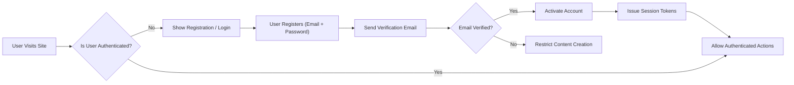
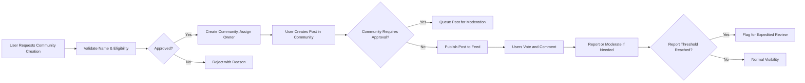
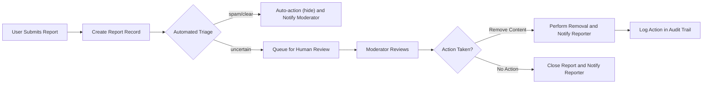

# Functional Requirements — communityBbs (Reddit-like Community Platform)

## Overview and Purpose
communityBbs enables community-driven discussion and content curation. The platform must support user registration and login, creation and management of communities, posting of text/link/image content, nested comments, upvote/downvote mechanics, a karma reputation system, subscription-based feeds, content sorting (hot, new, top, controversial), user profiles, and report/moderation workflows. Requirements below specify WHAT the system must deliver in business terms and are written to be testable and actionable for developers.

Audience: product owners, backend developers, QA, security, and operations.

Conventions: Requirements use EARS formatting where applicable (WHEN, THE, SHALL, IF, THEN, WHERE). Numeric thresholds are given as business defaults and labeled as configurable.

---

## Actors and Permission Matrix
Actors (business-level):
- visitor: Unauthenticated person who can browse public communities and read posts and comments.
- communityMember: Authenticated registered user who may create content, comment, vote, subscribe, and report.
- communityModerator: Member assigned moderation privileges within a specific community (can approve/remove posts, approve membership where applicable).
- systemAdmin: Platform administrator with global moderation, user management, and auditing privileges.

Permissions (business summary):
- visitor: browse public content, view community descriptions, access registration flow.
- communityMember: create communities (subject to business rules), create posts and comments, vote, subscribe, report, edit/delete own content within edit windows.
- communityModerator: all communityMember rights plus approval/rejection of pending posts, member management, and escalation to systemAdmin.
- systemAdmin: full platform actions (suspend/ban users, quarantine communities, perform hard deletes when legally required) and access to audit logs.

Permission Matrix (business-level table):
- Browse public content: visitor, communityMember, communityModerator, systemAdmin
- Create community: communityMember (subject to rate limits, name uniqueness), systemAdmin
- Create post/comment: communityMember, communityModerator, systemAdmin
- Vote: communityMember, communityModerator, systemAdmin
- Moderate reports: communityModerator (community scope), systemAdmin (global)
- Suspend/ban user: systemAdmin only

---

## Authentication & Session Management (EARS)
- WHEN a visitor registers with an email and password, THE system SHALL create an account in a "registered_unverified" state and SHALL send a time-limited verification token to the supplied email (default expiry: 7 days). Acceptance: verification email sent and account remains restricted from state-changing actions until verified.

- WHEN a user redeems a valid verification token, THE system SHALL transition the account to "registered_verified" and SHALL allow posting, voting, subscribing, and reporting.

- WHEN a registered_verified user provides valid credentials, THE system SHALL issue session tokens and permit authenticated actions for the session lifetime. Business recommendation: access token lifetime 15 minutes, refresh token lifetime 14 days; tokens are configurable by administrators.

- IF a user requests password reset, THEN THE system SHALL send a single-use, time-limited password-reset token to the verified email (token expiry default: 24 hours) and SHALL invalidate used tokens.

- WHEN a user requests global session revocation (sign out from all devices), THE system SHALL invalidate all refresh tokens associated with the account within 60 seconds.

- WHEN an account is suspended by systemAdmin, THE system SHALL prevent authentication and SHALL present a user-facing suspension message containing reason code and appeal instructions.

Notes: Developers choose token format and storage. All session lifecycle expectations above are business requirements.

---

## Core Functional Requirements (EARS)
All functional rules below are written in EARS format to be testable and unambiguous.

### Community Management
- WHEN a communityMember requests community creation, THE system SHALL validate the requested community name for uniqueness (case-insensitive) and pattern rules and SHALL create the community if validation passes. Name rules: 3-50 characters; allowed characters: letters, numbers, hyphen, underscore; reserved names blocked.

- IF a user with account age < 7 days and karma < configurable threshold attempts to create communities, THEN THE system SHALL queue the request for manual review by systemAdmin (configurable auto-approve threshold).

- WHEN a community is created, THE system SHALL record the creator as the community owner and SHALL allow them to appoint communityModerators.

- WHERE a community is marked as "private" or "restricted", THE system SHALL require membership approval before non-members may view or post content.

### Post Management (text, link, image)
- WHEN a communityMember creates a post, THE system SHALL accept one of three post types: "text", "link", or "image" and SHALL validate required fields per type.

- WHEN a text post is submitted, THE system SHALL enforce: title (1-300 characters), body (max 40,000 characters). Posts exceeding limits SHALL be rejected with a validation error describing the violated constraint.

- WHEN a link post is submitted, THE system SHALL validate the URL uses http or https scheme and SHALL attempt a safe-preview generation asynchronously; invalid URLs SHALL be rejected.

- WHEN an image post is submitted, THE system SHALL enforce allowed MIME types (JPEG, PNG, GIF) and business default file-size limits (10 MB per image, max 10 images per post). Exceeding files SHALL be rejected with a clear error.

- IF community settings require pre-approval, THEN newly created posts SHALL be placed in a moderator queue and SHALL not be public until approved.

### Commenting and Nested Replies
- WHEN a communityMember posts a comment, THE system SHALL validate comment body length (max 10,000 characters) and SHALL attach metadata: authorId, timestamp, parentId optional.

- WHEN nested replies occur, THE system SHALL allow logical nesting depth unlimited, but THE system SHALL recommend and enforce a rendering-friendly depth cap (default 8) for client presentation; deeper replies are logically stored but may be flattened in UI.

- IF a comment receives multiple abuse reports reaching an escalation threshold (default: 5 reports in 48 hours), THEN THE system SHALL flag it for expedited moderator review and MAY hide it from public view pending review.

### Voting and Karma System
- THE system SHALL permit communityMember to upvote or downvote posts and comments with exactly one active vote per (user, target) pair.

- WHEN a vote occurs, THE system SHALL update the target's score and SHALL reflect the change in the user's visible feed within a short business window (default: within 5 seconds).

- THE system SHALL compute karma using configurable point values (business defaults provided): post upvote +10, post downvote -2, comment upvote +2, comment downvote -1. Administrators SHALL be able to tune these values.

- IF vote-manipulation patterns are detected (heuristic: coordinated votes from related accounts or rapid repeated votes exceeding configurable thresholds such as 500 votes/day across targets), THEN THE system SHALL flag involved accounts, suspend affected vote effects, and queue accounts for investigation; karma recalculation SHALL occur after review.

### Sorting and Feed Modes
- THE system SHALL provide sorting modes: "new" (created_at desc), "top" (score desc within time window: 24h/7d/30d/all), "hot" (time-decayed ranking combining score and recency), and "controversial" (high variance between upvotes and downvotes relative to total votes).

- WHEN a client requests feed page, THE system SHALL return paginated results with default page size 25 and support up to 100 items per page upon request, enforcing a maximum page size of 100.

- THE system SHALL document algorithmic parameters and provide admin controls to tune hot-score decay constants.

### Subscriptions and Notifications
- WHEN a communityMember subscribes to a community, THE system SHALL include new community posts in the member's personalized feed and SHALL respect notification preferences (in-app immediate, email digest, push, or off).

- THE system SHALL batch email notifications per user to a maximum of 5 email digests per day by default; users SHALL be able to opt for immediate emails for up to 10 communities.

- IF a user unsubscribes from a community, THEN THE system SHALL remove community posts from personalized prioritized recommendations within 24 hours.

### User Profiles and Activity
- THE system SHALL expose public profiles showing displayName, public posts, public comments, and cumulative karma.

- WHEN a user views their own profile, THE system SHALL show private items (pending reports, moderation actions) visible only to that user and systemAdmin.

- IF a user elects to privatize profile data, THEN THE system SHALL hide private fields from visitors and non-authorized members.

### Reporting and Moderation
- WHEN a user files a report, THE system SHALL create a report record containing reporterId, targetId, reasonCode (standardized categories), optional explanation (max 1000 chars), and timestamp.

- IF a content item receives >= configurable threshold of reports (default 5) within a configurable window (default 48 hours), THEN THE system SHALL automatically flag the item for expedited review and MAY hide it pending moderator action.

- WHEN a moderator or admin acts on a report, THE system SHALL record the action in an immutable audit trail including actorId, actionType, reasonCode, and timestamp and SHALL notify the reporter of the outcome with a privacy-preserving message.

---

## Business Rules and Validation (Numeric Defaults; configurable)
- Title max length: 300 characters
- Text post body max: 40,000 characters
- Comment max length: 10,000 characters
- Image per-file max size: 10 MB; max images per post: 10
- Edit window: posts 24 hours; comments 1 hour (default; community-configurable up to 168 hours)
- Soft-delete retention: 90 days default; audit logs retention: 2 years default
- Rate limits (business defaults): create posts: 10/hour; comments: 200/day; votes: 100/hour; account creations per IP: 10/24h
- Report escalation threshold: 5 reports within 48 hours triggers expedited review

All numeric defaults MUST be configurable by administrators at runtime.

---

## Workflows and Mermaid Diagrams
Registration and Login Flow:

Create Community -> Post -> Moderation Flow:

Report Handling and Resolution:

Note: All mermaid labels use double-quoted strings and valid arrow syntax per diagram rules.

---

## Error Handling and User-Facing Recovery (EARS)
- IF a user attempts to create content while unverified, THEN THE system SHALL reject the action and SHALL return error code AUTH_EMAIL_VERIFICATION_REQUIRED with a human-readable message and a link to resend verification.

- WHEN an upload fails due to size or type, THEN THE system SHALL reject the upload and SHALL return an error describing allowed types and sizes (e.g., "Image exceeds 10 MB limit; allowed types: JPEG, PNG, GIF").

- IF a background processing service (image moderation or CDN) is temporarily unavailable, THEN THE system SHALL accept the submission as "pending processing", SHALL notify the user of the pending state, and SHALL process the content when services recover; final visibility SHALL reflect processing outcome.

- WHEN a rate-limit is hit, THEN THE system SHALL return RATE_LIMIT_EXCEEDED with remaining wait time and instructions; repeated violations SHALL trigger temporary action restrictions and an investigation flag.

---

## Non-Functional Business SLAs
- Read latency: community feed page (25 items) SHALL be returned within 2 seconds for 95% of requests under normal load.
- Write latency: post/comment/vote acknowledgement SHALL be returned within 3 seconds for 95% of requests under normal load; user-visible feed reflection SHALL occur within 5 seconds.
- Availability target: 99.9% monthly for core APIs (business goal).
- Moderation SLA: high-priority reports SHALL receive human triage within 4 hours and standard escalations SHALL be addressed within 48–72 hours.

---

## Acceptance Criteria and Example Scenarios
- Registration: WHEN a new user registers and verifies email, THEN the account SHALL be active and capable of creating posts. Acceptance: successful verification and successful post creation within 2 minutes.

- Posting: WHEN a verified user creates a text post with title 250 chars and body 2,000 chars, THEN the system SHALL accept and publish according to community visibility. Acceptance: post appears in community feed and is retrievable via feed query.

- Voting: WHEN a user upvotes a post, THEN the system SHALL increment the post's upvote count and update the author's karma per configured rules within 5 seconds. Acceptance: visible vote count and karma updated accordingly.

- Reporting: WHEN 5 distinct users report the same post for harassment within 48 hours, THEN the system SHALL flag the post for expedited review. Acceptance: post appears in expedited review queue and moderator receives aggregated report.

---

## Appendix
Glossary: communityMember, communityModerator, systemAdmin, karma, soft-delete, hard-delete, audit trail.

Mapping to related artifacts: service overview, business rules, data lifecycle, and operational runbooks.

Configuration notes: All numeric business defaults above are configurable by administrators; specific configuration UI and persistence are implementation responsibilities.

