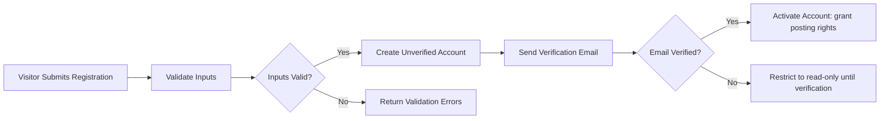
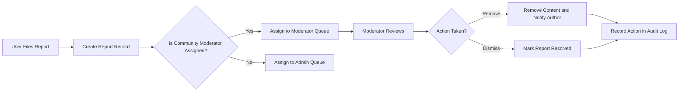

# User Roles and Authentication Requirements for communityPortal

## Scope and Audience

These requirements define business-level user roles, authentication behaviors, account lifecycle rules, and permission expectations for communityPortal. Intended readers are product managers, security leads, backend developers, QA engineers, and operations staff responsible for implementing and validating authentication and role-based behaviors.

## Goals and Business Context

- Provide a low-friction registration experience while ensuring baseline trust through email verification.
- Ensure role-based permissions support community self-governance while preserving platform-wide safety controls.
- Define auditable, testable authentication and authorization behaviors so moderation and compliance can be executed reliably.

## Roles and Responsibilities (Business-Level)

guest
- Read-only visitor of public communities and content discovery.
- CAN: browse public communities, view public posts and comments, use search.
- CANNOT: create posts, create comments, vote, subscribe, or report content.

member
- Authenticated user with verified email who can participate in communities.
- CAN: create posts (text/link/image), create comments and nested replies, upvote/downvote posts and comments, subscribe/unsubscribe to communities, report content, edit own profile and contributions (subject to edit policy).
- CANNOT: perform moderator-scoped or admin-scoped actions unless explicitly granted.

moderator (scoped)
- Member appointed to manage one or more specific communities.
- CAN (within assigned communities only): review and resolve reports, remove or reinstate posts/comments, pin or lock posts, edit community rules, invite or remove members where community policy allows.
- Actions MUST be auditable and scoped to the community identifiers assigned to the moderator.

admin
- Platform-level operator with global authority for urgent and escalated moderation.
- CAN: ban or suspend accounts, resolve escalated reports, modify platform-wide policies, assign or revoke moderator appointments, and access audit logs.
- Admin actions MUST follow audit and escalation rules and include required justification fields.

### Role Assignment Rules
- WHEN a new community is created, THE system SHALL assign the creating user as the initial community owner and initial moderator unless stakeholder policy states otherwise.
- WHEN a moderator is appointed or removed, THE system SHALL record the appointing actor and timestamp and the community scope of the appointment for audit.
- WHERE moderator appointments are community-managed, THE system SHALL present an approval workflow for elevated roles (owner approval or admin confirmation) as defined by stakeholder policy.

## Permission Matrix (Business-Level)

| Action | guest | member | moderator (assigned) | admin |
|--------|:-----:|:------:|:--------------------:|:-----:|
| Browse public content | ✅ | ✅ | ✅ | ✅ |
| Register / Login | ❌ | ✅ | ✅ | ✅ |
| Create community | ❌ | ✅* | ✅ | ✅ |
| Create post | ❌ | ✅ | ✅ | ✅ |
| Comment / reply | ❌ | ✅ | ✅ | ✅ |
| Vote (up/down) | ❌ | ✅** | ✅ | ✅ |
| Subscribe / Unsubscribe | ❌ | ✅ | ✅ | ✅ |
| Report content | ❌ | ✅ | ✅ | ✅ |
| Moderate assigned community | ❌ | ❌ | ✅ | ✅ |
| Global moderation / ban | ❌ | ❌ | ❌ | ✅ |

*Community creation MAY be rate limited or gated by karma/account age (stakeholder-defined).  
**Voting MAY be gated by account age or karma thresholds (stakeholder-defined).

## Authentication Workflows (EARS and Business-Level)

### Registration and Email Verification
- WHEN a visitor registers with an email and password, THE system SHALL validate inputs and create an account in a "pending verification" state and SHALL send a verification email to the provided address within 60 seconds.
- IF the supplied email address is already associated with an active account, THEN THE system SHALL reject the registration and instruct the user to sign in or use password recovery.
- WHEN the user completes email verification, THE system SHALL transition the account to "active" and grant posting, commenting, voting, and subscription privileges unless other gating rules apply.

Validation rules (business-level):
- Email: syntactically valid; disposable-email blocking optional (stakeholder decision).
- Password: minimum 8 characters and include at least one uppercase, one lowercase, and one number (stakeholder may tighten rule).
- Username/display name: 3–30 characters; allowed characters: letters, digits, underscore, hyphen; uniqueness must be enforced case-insensitively.

Acceptance criteria:
- GIVEN a valid registration submission, WHEN verification email is delivered within 60 seconds and verification is completed, THEN account becomes active and the user may create content.
- GIVEN duplicate email on registration, WHEN user attempts to register, THEN system returns an "email already used" business-facing error.

### Login
- WHEN a user submits valid credentials for an active account, THE system SHALL authenticate and establish an authenticated session and return success within 2 seconds under normal load.
- IF authentication fails due to invalid credentials, THEN THE system SHALL record the failed attempt for rate-limiting/anti-abuse and return a generic authentication failure message that does not disclose whether the email exists.
- WHEN repeated failed login attempts exceed a stakeholder-configured threshold (recommended default: 5 attempts in 15 minutes), THEN THE system SHALL apply temporary account lockout or present an additional challenge (e.g., CAPTCHA or MFA) and notify the account email of suspicious activity.

Acceptance criteria:
- Successful login results in an authenticated session allowing member-level actions; failed login does not leak account existence.

### Password Reset and Account Recovery
- WHEN a user requests password reset, THE system SHALL send a single-use password reset token to the verified email and SHALL expire the token after a business-configurable window (recommend 1 hour).
- IF multiple password reset requests occur in short succession, THEN THE system SHALL throttle requests and provide a notice describing the wait period.

Acceptance criteria:
- Password reset tokens are delivered within 5 minutes under normal load and expire after the configured window.

### Logout and Session Revocation
- WHEN a user logs out, THE system SHALL invalidate the current session token and prevent further actions using the invalidated token.
- WHEN a user requests global session revocation ("log out of all devices"), THE system SHALL invalidate all active sessions and refresh tokens for that user and log the revocation event for audit.

Acceptance criteria:
- Post-logout actions with invalidated tokens are rejected with authentication-required response.

## Session and Token Lifecycle (Business-Level Expectations)
- THE system SHALL use short-lived access tokens and longer-lived refresh tokens to balance security and UX; the exact time-to-live (TTL) values are an implementation decision but THE system SHALL support configurable TTL values.
- WHEN a refresh token is used to obtain a new access token, THE system SHALL rotate the refresh token according to a refresh-rotation policy and revoke the old refresh token.
- WHEN a token is revoked (manual revocation, password reset, account suspension), THE system SHALL prevent future use of the revoked token and log the revocation event for audit.
- THE system SHALL require reauthentication for sensitive operations (email change, password change, account deletion) to reduce risk.

Recommended default values (business recommendations to be confirmed by stakeholders):
- Access token TTL: 15 minutes
- Refresh token TTL: 30 days (with rotation)
- Idle session expiration: 14 days by default for remembered sessions; shorter for sensitive roles (admins, moderators)

## Multi-Factor Authentication (MFA) and Privileged Roles
- WHEN a user is assigned an admin role, THE system SHALL require MFA enrollment and enforcement before allowing admin-scoped actions.
- WHEN a moderator is assigned to a high-risk community (as defined by stakeholder policy), THE system SHALL recommend MFA for the moderator account and SHALL enforce MFA upon moderation actions that remove content or ban users (stakeholder decision).
- WHERE MFA is enabled, THE system SHALL provide account recovery and MFA reset flows that include verification and support options to prevent account lockout.

Acceptance criteria:
- Admins must have MFA enabled before performing admin actions; attempts without MFA must be denied and instructive guidance provided.

## Role-Based Access Controls and Scoped Moderator Authority
- WHEN a moderator attempts to act on content, THE system SHALL enforce that the action applies only to communities for which the moderator has explicit assignments (communityId list must be checked for authorization).
- IF a moderator attempts to act outside assigned scope, THEN THE system SHALL deny the action and log the unauthorized attempt for review.
- WHEN an admin takes a global action, THE system SHALL require an explicit justification field that is logged and visible in audit trails.

## EARS-Formatted Functional Requirements (Selected Key Items)
- WHEN a guest attempts to perform a member-only action (post, comment, vote, subscribe), THE system SHALL deny the action and present a message instructing the user to register and verify their email.
- WHEN a user registers with valid data, THE system SHALL send a verification email and create an account in pending verification state within 60 seconds of submission.
- WHEN a verified user submits valid credentials, THE system SHALL authenticate and create an active session within 2 seconds under normal load.
- IF a user exceeds failed login attempts threshold, THEN THE system SHALL apply temporary lockout and notify the user with recovery options.
- WHEN a moderator acts on content in their assigned community, THE system SHALL record moderator identity, community scope, action type, and reason for audit purposes.

## Error Handling and Recovery (EARS)
- IF a registration email is already in use, THEN THE system SHALL reject registration and instruct the user to sign in or use password recovery.
- IF a verification token is expired or invalid, THEN THE system SHALL present an option to resend verification and rate-limit resends to prevent abuse.
- IF a password reset token is used after expiry, THEN THE system SHALL reject the request and require a fresh reset request.
- IF an authenticated session expires during an in-progress post, THEN THE system SHALL preserve the draft client-side (where feasible) and prompt the user to reauthenticate to resume.

User-facing message guidance (business-level examples):
- "Please verify your email to post and comment. A verification link was sent to your inbox."  
- "Invalid credentials. Please try again or reset your password."  
- "Your account is temporarily locked due to multiple failed sign-in attempts. Please reset your password or wait XX minutes."  
- "You must be a verified member to perform that action. Verify your email to continue."  

## Audit, Logging, and Compliance (Business Requirements)
- WHEN a moderation or admin action occurs (remove, reinstate, ban, suspension), THE system SHALL record an audit entry containing: actionId, actorUserId, actorRole, targetType (post/comment/user), targetId, communityId (if applicable), actionType, reasonText (from a controlled list or free-text), timestamp, and any attached evidence reference.
- THE system SHALL retain moderation audit logs for a stakeholder-configurable retention period (recommended minimum: 2 years for auditability) and SHALL provide export and access controls for compliance review.
- WHEN account changes occur (email change, password reset, role changes), THE system SHALL log the event with actor identity and timestamp for traceability.

## Acceptance Criteria and KPIs (Business-Facing)
- Authentication responsiveness: 95% of successful logins complete in <= 2 seconds under normal load.
- Verification delivery: 95% of verification emails are delivered within 60 seconds under normal conditions.
- Moderator auditability: 100% of moderator actions produce a logged audit record with required fields.
- Session revocation: When a user triggers global session revocation, THE system SHALL invalidate all sessions within a short business-observable window (recommend < 60 seconds) and record the revocation event.

## Security and Operational Expectations (Business-Level)
- Rate-limiting: THE system SHALL enforce rate limits on authentication and account management flows to mitigate abuse (recommend default: 5 registration attempts per hour per IP, 5 failed login attempts per 15 minutes per account; stakeholder confirmation required).
- Account suspension: WHEN an account is suspended for policy violations, THE system SHALL prevent content creation and voting while allowing read access per policy and SHALL notify the user of suspension reason and appeal process.
- Administrative controls: THE system SHALL provide admin dashboards for role management, user search, and escalation handling; admin actions SHALL require justification and be auditable.

## Open Questions and Stakeholder Decisions (Prioritized)
1. Karma and gating policies: Should account capabilities (create community, vote) require minimum karma or account age? (High priority)
2. Exact password and token TTL values: Confirm or adjust recommended defaults (Medium priority)
3. MFA enforcement for moderators: Required for all moderators or only for high-risk scopes? (Medium priority)
4. Audit log retention window: Confirm the business retention period (High priority)
5. Disposable email blocking and sign-up throttling thresholds (Medium priority)
6. Whether session revocation must reach all edge caches within a guaranteed timeframe (Operational decision) (Low priority)

## Appendices

### Registration Flow (Mermaid)

### Moderator Report Handling (Mermaid)

### Glossary
- active: Account state that permits content creation and interaction.  
- pending verification: Account state after registration and before successful email verification.  
- moderator (scoped): Member with moderation privileges limited to specified communities.  
- admin: Platform-level privileged user.

### Contact and Escalation
- For policy clarification and role assignment decisions, product and legal stakeholders should be consulted to finalize gating policies and retention windows.  

