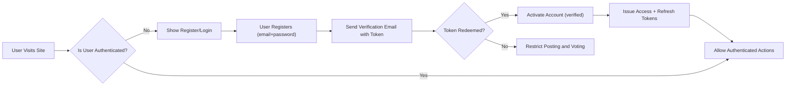
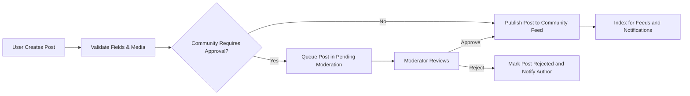
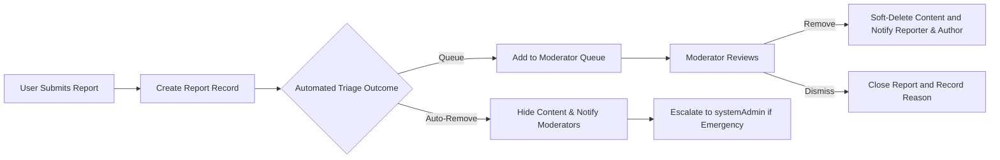

# Functional Requirements — communityBbs

## 1. Scope and Audience

communityBbs is a Reddit-like community platform that enables registered users to create and manage communities, publish text/link/image posts, comment with nested replies, vote on content, accumulate karma, subscribe to communities, and report inappropriate content. The following requirements describe WHAT the backend must provide in business and functional terms. The audience for these requirements is backend engineers, QA, product managers, and operations staff.

## 2. Table of Contents

- Actors and Permissions
- Authentication & Session Management
- Community Management
- Post Management (text, link, image)
- Commenting and Nested Replies
- Voting and Karma System
- Sorting and Feed Requirements
- Subscriptions and Notifications
- User Profiles and Privacy
- Reporting and Moderation Workflows
- Business Rules and Validation
- Workflows and Diagrams
- Error Handling and Recovery
- Performance, Reliability and SLAs
- Auditability, Logging and Retention
- Acceptance Criteria and Example Scenarios
- Appendix: Defaults and Glossary

## 3. Actors and Permissions

Actors (business-level):
- visitor: Unauthenticated user who can browse public communities and read posts and comments. Visitors cannot create content, vote, subscribe, or report.
- communityMember: Authenticated user who can create and edit their own posts and comments within business-defined windows, vote, subscribe, report content, and manage their profile.
- systemAdmin: Platform administrators with authority to act on escalated moderation, suspend/ban accounts, manage global settings, and access audit logs. Admin actions are auditable.

Permission Matrix (business-level):

| Action | visitor | communityMember | systemAdmin |
|--------|---------|-----------------|-------------|
| Browse public communities | ✅ | ✅ | ✅ |
| View private/restricted community | ❌ | Depends on membership | ✅ |
| Register / Login | ✅ | ✅ | ✅ |
| Create community | ❌ | ✅ (subject to eligibility) | ✅ |
| Create post | ❌ | ✅ (subject to community rules) | ✅ |
| Comment / reply | ❌ | ✅ | ✅ |
| Upvote / Downvote | ❌ | ✅ | ✅ |
| Subscribe to community | ❌ | ✅ | ✅ |
| Report content | ❌ | ✅ | ✅ |
| Moderate reports / take action | ❌ | Limited (community moderators) | ✅ |
| Suspend/ban user | ❌ | ❌ | ✅ |

## 4. Authentication & Session Management (Business-Level)

Authentication principles:
- THE system SHALL require registration and email verification before allowing actions that modify state (create community, create post, comment, vote, subscribe, report).
- THE system SHALL support optional third-party authentication providers (social login) but SHALL still require a verified email for state-changing actions unless the third-party provider supplies verified email claims.

Session & token behavior (business-level):
- WHEN a user authenticates, THE system SHALL issue an access token and a refresh token. Access tokens SHALL be short-lived and refresh tokens SHALL be long-lived; defaults (configurable by admin): access token lifetime 15 minutes, refresh token lifetime 14 days.
- WHEN a refresh token is used, THE system SHALL issue a new access token and MAY rotate the refresh token.
- IF a user revokes sessions or changes their password, THEN THE system SHALL invalidate all refresh tokens for that user within 60 seconds.

Registration and email verification (EARS):
- WHEN a visitor creates an account with email and password, THE system SHALL create the account in an "unverified" state and SHALL send a verification email containing a single-use token.
- IF the verification token is redeemed within its time window (configurable default: 7 days), THEN THE system SHALL mark the account as verified and SHALL enable state-changing actions.
- IF an unverified user attempts to create content, THEN THE system SHALL deny the action and return an error code AUTH_EMAIL_UNVERIFIED with guidance to verify email.

Password reset (EARS):
- WHEN a user requests a password reset for a verified email, THE system SHALL issue a single-use, time-limited reset token (default expiry: 24 hours) and SHALL allow password change only after token validation.

Account lifecycle (business rules):
- WHEN a user requests account deletion, THE system SHALL soft-delete the account and schedule hard-deletion according to retention policy (default soft-delete retention: 30 days). During soft-delete the account is inactive and cannot authenticate.
- IF a systemAdmin suspends an account, THEN THE system SHALL prevent authentication and SHALL record the suspension reason and duration in an audit entry.

Access claims and RBAC (business-level):
- THE system SHALL include role indicators in session payloads (e.g., "role": "communityMember" or "systemAdmin") and SHALL rely on role checks for authorization of protected actions.

## 5. Community Management

Overview:
- THE system SHALL enable communityMember users to create communities subject to naming rules, uniqueness, and rate limits.

Community creation (EARS):
- WHEN a communityMember requests to create a community, THE system SHALL validate the requested name for uniqueness (case-insensitive) and content policy, and SHALL reject names that conflict with reserved terms or violate naming policy.
- WHEN a community is created, THE system SHALL assign the creating user as community owner and SHALL record ownerId and initial settings including visibility (public/private/restricted), posting policy (open/pre-approval), and membership rules.

Community visibility and membership (EARS):
- WHERE a community is marked as "private", THE system SHALL prevent non-members and visitors from viewing posts and comments.
- WHERE a community is marked as "restricted", THE system SHALL allow visitors to view content but SHALL require membership approval for posting.

Moderation and governance (EARS):
- WHEN a community owner appoints moderators, THE system SHALL record moderators with their assigned scopes (e.g., approve posts, remove posts, manage flairs).
- IF community receives sustained reports or violates platform rules, THEN THE system SHALL permit systemAdmin to place the community in "quarantine" mode restricting new posts until investigation completes.

Rate limits on creation (business rule):
- THE system SHALL limit community creation to configurable thresholds (default: 3 communities per account per 30 days) to prevent abuse.

## 6. Post Management (Text, Link, Image)

Post types and required fields:
- THE system SHALL support three post types: "text", "link", and "image".
- WHEN a post is created, THE system SHALL require a title (non-empty, max 300 characters) and SHALL validate other fields based on post type.

Validation rules (EARS):
- WHEN a user submits a text post, THE system SHALL validate body length <= 40,000 characters; if violated, THE system SHALL reject with error POST_BODY_TOO_LONG.
- WHEN a user submits a link post, THE system SHALL validate the URL is http or https and syntactically valid; invalid URLs SHALL be rejected with error POST_URL_INVALID.
- WHEN a user submits an image post, THE system SHALL validate file types against a whitelist (JPEG, PNG, GIF) and SHALL enforce per-image maximum size default 10 MB and maximum total post payload 20 MB; violations SHALL result in IMAGE_TOO_LARGE or IMAGE_TYPE_NOT_ALLOWED errors.

Post lifecycle (EARS):
- WHEN a post is created in a community that requires moderator approval, THEN THE system SHALL place the post in a moderation queue in state "pending_moderation" and SHALL not make it visible to non-moderators until approved.
- WHEN a post is approved, THE system SHALL transition it to "published" and SHALL index it for feed inclusion per sorting rules.

Edit and deletion (EARS):
- WHEN an author edits their post within the edit window (default 24 hours), THE system SHALL persist the new content and SHALL record an edit history entry with timestamp and previous content for audit.
- WHEN an author deletes their post, THE system SHALL perform a soft-delete that hides the post from public view but retains it for retention and moderation audit for default 90 days.

Attachments and media processing (EARS):
- WHEN an image is uploaded, THE system SHALL validate and schedule content-safety checks (automated moderation). IF automated checks flag the image as high-risk, THEN THE system SHALL mark the post as "quarantined" pending human review.

## 7. Commenting and Nested Replies

Comments and replies (EARS):
- THE system SHALL allow communityMember users to comment on posts and reply to comments, capturing parentCommentId when applicable.
- WHEN a comment is created, THE system SHALL enforce a maximum comment length of 10,000 characters and SHALL attach metadata authorId, timestamp, parentCommentId (nullable), and contentId.

Nesting and display rules:
- THE system SHALL support logical nesting of replies without a hard backend depth limit, but THE system SHALL provide a rendering-friendly maximum depth recommendation for front-end (default: 8 levels). Comments beyond rendering depth SHALL be stored normally and presented collapsed by clients.

Edit and deletion windows:
- WHEN a comment is edited, THE system SHALL permit edits within 1 hour of creation by default; edits beyond that window SHALL require moderator action and SHALL be recorded in edit history.
- WHEN a comment is removed by moderation, THE system SHALL soft-delete it and SHALL notify the author when appropriate.

Performance expectations for comments:
- WHEN loading top-level comments for a post, THE system SHALL return the first page of up to 50 top-level comments within 2 seconds for 95% of requests under normal load.

## 8. Voting and Karma System

Voting mechanics (EARS):
- THE system SHALL allow communityMember users to upvote or downvote posts and comments provided they are not the content author.
- WHEN a user votes, THE system SHALL record a single active vote per (user, content) pair; subsequent votes SHALL update the existing vote record (e.g., switch upvote to downvote) rather than creating duplicates.
- WHEN a user retracts a vote, THE system SHALL remove the vote record and recalculate affected scores.

Karma calculation (business defaults):
- THE system SHALL compute user karma using configurable weights. Default weight examples (configurable): post upvote +10, post downvote -2, comment upvote +2, comment downvote -1.
- WHEN votes are invalidated due to abuse detection or content removal, THEN THE system SHALL adjust karma retroactively to reflect the corrected vote state.

Abuse detection (EARS):
- WHEN voting patterns indicate coordinated manipulation (example threshold: more than 50 votes from a single actor targeting a single author's content within 24 hours), THEN THE system SHALL flag the accounts for review, SHALL temporarily suspend vote effects from flagged accounts, and SHALL notify moderators.

## 9. Sorting and Feed Requirements (hot, new, top, controversial)

Sorting definitions (business-level):
- "new": order by creation timestamp descending.
- "top": order by score descending within selected time window (day/week/month/all) with configurable time windows.
- "hot": order by time-decayed popularity metric combining score and recency; algorithm parameters SHALL be configurable.
- "controversial": surface posts with high variance between upvotes and downvotes relative to total votes.

Feed pagination and limits (EARS):
- WHEN a client requests a feed, THE system SHALL return paginated results with a default page size of 25 and SHALL support page sizes up to 100 with backend-enforced maximum to protect performance.
- WHEN users request "top" with a time window, THE system SHALL limit results to the selected time window.

Consistency expectations:
- THE system SHALL aim to reflect recent votes and comments in feed ordering within 10 seconds of the event under normal load, and SHALL document any eventual consistency behavior.

## 10. Subscriptions and Notifications

Subscriptions (EARS):
- THE system SHALL allow communityMember users to subscribe to communities. WHEN a user subscribes, THE system SHALL record subscription and SHALL prioritize community posts in the user's personalized feed.

Notifications and delivery rules:
- THE system SHALL support in-app notifications, optional push notifications, and email digests. Notification preferences SHALL be configurable by users.
- WHEN a subscribed community posts new content, THE system SHALL schedule notifications based on user preferences and SHALL batch email notifications to a default maximum of 5 digest emails per day unless the user opts into higher frequency.

Notification reliability (EARS):
- WHEN an in-app notification is created, THE system SHALL make it retrievable via the user's notification inbox within 5 seconds for 95% of events under nominal load.
- IF notification delivery to a channel fails, THEN THE system SHALL retry with exponential backoff and SHALL log each attempt for audit.

## 11. User Profiles and Privacy

Profile contents and visibility (EARS):
- THE system SHALL expose user profiles that display public posts, public comments, and aggregate karma.
- WHEN a user sets profile privacy to private, THE system SHALL prevent visitors and non-authorized members from viewing private fields (email, subscription list, private posts) and SHALL enforce privacy across APIs and UI.

Account self-service rules:
- WHEN a user requests a data export, THE system SHALL provide an export of public profile, posts, comments, and subscription metadata in a machine-readable format within 30 days of a verified request.

## 12. Content Reporting and Moderation Workflows

Report submission (EARS):
- THE system SHALL allow communityMember users to report posts and comments using predefined reason codes (spam, harassment, illegal content, copyright, other) and optional explanation text (max 1000 characters).
- WHEN a report is submitted, THE system SHALL persist a report record with reporterId, targetId, reasonCode, explanation, and timestamp.

Automated triage and escalation (EARS):
- WHEN the number of distinct reports on a content item crosses a configurable threshold (default: 5 reports within 48 hours) or automated heuristics indicate a high-severity violation, THEN THE system SHALL flag the item for expedited human review and MAY hide it from public view pending review.
- IF a community has active moderators, THEN THE system SHALL route triaged reports to community moderator queues; IF no moderator acts within the community SLA, THEN THE system SHALL escalate to systemAdmin.

Moderator actions and audit (EARS):
- WHEN a moderator or systemAdmin takes action on a report (remove content, warn user, suspend user), THE system SHALL record the action, actor id, reason code, and timestamp in an immutable audit trail and SHALL notify the reporter of the outcome subject to privacy constraints.

Appeals and retention:
- WHEN content is removed, THE system SHALL provide the content owner an appeal path and SHALL retain the removed content for an appeal window (default 30 days) before permanent deletion subject to retention policy.

## 13. Business Rules and Validation

Default validation constraints (configurable by admin):
- Title max length: 300 characters.
- Text post max length: 40,000 characters.
- Comment max length: 10,000 characters.
- Max images per post: 10; allowed mime types: image/jpeg, image/png, image/gif.
- Max single-image size: 10 MB; max total post payload: 20 MB.

Edit/delete windows:
- Post edit window: 24 hours by default.
- Comment edit window: 1 hour by default.
- Soft-delete retention window: 90 days default before eligible for hard delete.

Rate limits and abuse prevention (business defaults):
- Create posts: default max 10 per hour per user.
- Create comments: default max 200 per hour per user.
- Vote actions: default max 100 votes per hour per user.
- Automated abuse detection: WHEN patterns exceed configured thresholds (e.g., >50 coordinated votes in 24 hours), THEN THE system SHALL flag and suspend suspected accounts pending review.

Karma policies:
- Default karma weights: post upvote +10, post downvote -2, comment upvote +2, comment downvote -1. Administrators SHALL be able to configure weights globally.
- WHEN content is removed for policy violations, THEN THE system SHALL reverse karma impacts if governed by the configured reversal policy.

## 14. Workflows and Diagrams

### 14.1 Registration and Login Flow

### 14.2 Post Creation → Moderation → Publication

### 14.3 Report Triage & Escalation

## 15. Error Handling and Recovery (EARS)

Authentication errors:
- WHEN authentication fails due to invalid credentials, THEN THE system SHALL return error AUTH_INVALID_CREDENTIALS and SHALL apply progressive throttling after repeated failures.
- WHEN email verification token is expired, THEN THE system SHALL return error AUTH_VERIFICATION_EXPIRED and SHALL allow re-requesting verification up to a configurable limit.

Content validation errors:
- IF a post exceeds allowed limits (title length, body length, image size), THEN THE system SHALL reject submission with specific error codes (POST_TITLE_TOO_LONG, POST_BODY_TOO_LONG, IMAGE_TOO_LARGE) and SHALL return the allowed limits.

Processing and transient failures:
- WHEN a media processing service is temporarily unavailable, THEN THE system SHALL accept the post as "pending processing" and SHALL notify the author of the pending status and expected retry behavior (business default retry attempts: 5 over 24 hours).

Rate-limit handling:
- IF a user exceeds action rate limits, THEN THE system SHALL return RATE_LIMIT_EXCEEDED with remaining wait time and SHALL log the incident for monitoring.

Moderation and reporting errors:
- IF an automated triage incorrectly hides content and a moderator restores it, THEN THE system SHALL notify the author of restoration and SHALL record the reversal in the audit trail.

## 16. Performance, Reliability and SLAs (Business Targets)

Read and write SLAs (business-level targets):
- THE system SHALL respond to common authenticated reads (feed retrieval, post read) within 2 seconds for 95% of requests under normal load.
- THE system SHALL complete authenticated writes (create post/comment/vote) within 3 seconds for 95% of requests under normal load and SHALL reflect write results in user-visible feeds within 5 seconds.
- Moderation SLA: THE system SHALL escalate high-priority reports to systemAdmin within 4 business hours and SHALL ensure initial human review of escalated reports within 24 hours in 90% of cases.

Availability targets:
- THE platform SHALL target 99.9% availability for write-capable APIs and 99.95% for read APIs as a business objective.

Notification SLAs:
- In-app notification visibility: 95% within 5 seconds of event ingestion under normal load.
- Email transactional delivery (verification, password reset): 95% within 2 minutes under normal conditions.

## 17. Auditability, Logging and Retention

Audit log requirements (EARS):
- WHEN a moderator or systemAdmin takes an action that affects content or user accounts (remove, suspend, ban), THE system SHALL record an immutable audit entry containing: actorId, actorRole, actionType, targetId, reasonCode, optional human-readable reason, and timestamp.
- THE system SHALL retain moderation audit logs for at least 2 years and SHALL retain operational logs useful for incident investigation for a minimum of 90 days subject to privacy and legal constraints.

Retention policy (business defaults):
- Soft-deleted content retained: 90 days before eligible for hard deletion unless legal hold applies.
- Audit logs retained: 2 years.
- User data exports and portability: provide within 30 days of verified request.

## 18. Acceptance Criteria and Example Scenarios

Acceptance criteria are expressed in EARS format to be testable by QA.

Registration & verification:
- WHEN a visitor registers with valid credentials and redeems a verification token, THEN THE system SHALL mark the account as verified and SHALL allow content creation. Acceptance: user can create a post within 2 minutes of verification.

Post creation & publication:
- WHEN a verified user creates a text post with title length 250 and body 2000 characters in a public community, THEN THE system SHALL publish the post and make it retrievable in the community feed. Acceptance: post appears in feed queries within 5 seconds.

Voting & karma:
- WHEN a user upvotes a post, THEN THE system SHALL increment displayed post score immediately and adjust the author's karma per configured weights. Acceptance: visible score and karma update for the acting user within 3 seconds.

Reporting & moderation:
- WHEN 5 distinct verified users report the same post for harassment within 48 hours, THEN THE system SHALL flag the post for expedited review and MAY hide it pending moderator action. Acceptance: post appears in expedited review queue and associated reports aggregate in the moderator UI.

## 19. Appendix: Defaults and Glossary

Default configuration values (administrators may change):
- Access token lifetime: 15 minutes
- Refresh token lifetime: 14 days
- Post title max length: 300 characters
- Text post max length: 40,000 characters
- Single image max size: 10 MB
- Max images per post: 10
- Post edit window: 24 hours
- Comment edit window: 1 hour
- Soft-delete retention: 90 days
- Moderator escalation threshold: default 5 reports in 48 hours

Glossary:
- communityMember: Registered user with posting and voting privileges.
- Karma: Numeric reputation derived from votes and configurable platform rules.
- Soft-delete: Hidden from public but retained for recovery/appeal.
- systemAdmin: Platform-level administrative actor with audit privileges.

---

