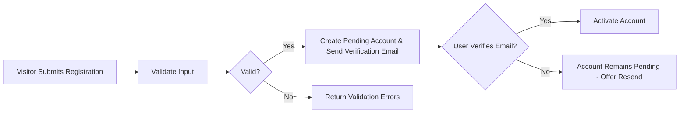
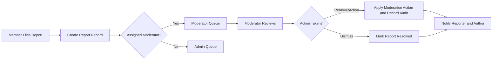
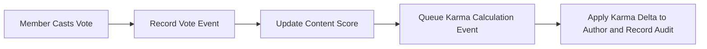

# User Stories and End-to-End Journeys

## Purpose and scope
Provide concrete, testable user journeys for communityPortal covering the core user interactions required for the platform: account lifecycle, community creation, posting, commenting with nested replies, voting, subscriptions, profile interactions, reporting and moderation workflows. Requirements are expressed in EARS format where applicable and include acceptance criteria, error scenarios, recovery steps, and traceability to implied business entities. The content is intended for product owners, QA, and backend developers.

## Audience
Product managers, QA engineers, backend developers, moderation leads, and operations staff responsible for implementing, testing, and operating communityPortal.

## Roles and personas
- Guest: Unauthenticated visitor with read-only access to public communities and search. Can browse posts and read comments but cannot subscribe, vote, comment, post, or report.
- Member: Authenticated, email-verified user who can create posts (text/link/image), comment and reply, vote, subscribe to communities, and report content. Earns karma.
- Moderator: Appointed community-level manager authorized to review reports, remove or approve content, pin or lock posts, and manage community rules for assigned communities. Moderator actions are auditable.
- Admin: Global administrator with platform-level privileges (resolve escalations, ban users, configure high-level policies).

## Primary user journeys
Each journey below includes representative user stories, EARS-format functional requirements, acceptance criteria, input validation, processing steps, error scenarios, and recovery guidance.

### Journey 1: User registration, verification, login, and password recovery
User stories:
- As a visitor, I want to register an account with email and password so I can post and vote after verification.
- As a verified user, I want to sign in so I can access my account and contributions.
- As a user who forgot my password, I want to reset it so I can regain access.

EARS requirements:
- WHEN a visitor submits registration details (email, password, display name), THE system SHALL validate inputs and create an account in a "pending verification" state and SHALL send a verification message to the provided email address.
- IF the submitted email is already associated with an existing account, THEN THE system SHALL reject the registration and present an actionable message instructing the user to sign in or recover the password.
- WHEN a user completes email verification, THE system SHALL transition the account to "active" and grant posting, commenting, voting, and subscription privileges.
- WHEN an active user supplies valid credentials, THE system SHALL authenticate the user and establish a session for member actions within expected response times.
- WHEN a user requests a password reset, THE system SHALL send a single-use reset mechanism to the verified email and SHALL allow the user to set a new password after verification.

Acceptance criteria:
- Given valid registration inputs, WHEN the user submits them, THEN a verification communication is sent and the account is created in pending state within a business-observable timeframe (example: 60 seconds).
- Given an already-registered email, registration attempts MUST be rejected with a clear user message.
- Successful verification transitions the account to active and allows member actions.
- Password reset link or token is delivered and usable according to platform policy (example: 24-hour validity).

Input validation (business rules):
- Email: syntactically valid; unique across active accounts.
- Password: meets configured strength policy (minimum 8 characters and mix of character types) — stakeholder to finalize exact policy.

Processing steps:
1. Visitor submits registration form.
2. System validates inputs.
3. System creates account record in pending verification state and sends verification email.
4. User clicks verification link and system upgrades account to active state.

Error scenarios and recovery (EARS examples):
- IF email delivery fails, THEN THE system SHALL surface an in-app message allowing the user to resend the verification and provide an alternate support contact if repeated delivery fails.
- IF a user attempts member-only actions while unverified, THEN THE system SHALL block the action and direct the user to verify their email.

### Journey 2: Create a community (subreddit)
User stories:
- As a member, I want to create a community to gather users around a topic and define basic rules.

EARS requirements:
- WHEN an authenticated member requests creation of a community with a name and description, THE system SHALL validate uniqueness and naming rules and either create the community in active or pending-approval state depending on platform policy.
- IF the requested name is duplicate or violates naming rules, THEN THE system SHALL reject the creation and provide suggestions or guidance for acceptable names.
- WHERE creation limits are configured (e.g., communities per account per 30 days), THE system SHALL enforce the limits and inform the requester when they have reached the quota.

Acceptance criteria:
- Valid community creation results in a community record and assignment of the creator as initial moderator (if policy mandates) and is visible per visibility settings.
- Duplicate-name attempts are rejected with a clear error and suggested alternatives.

Input validation:
- Community name: unique (case-insensitive) and within allowed character set; stakeholders to confirm exact constraints.

Error scenarios and recovery:
- IF community creation is rejected for quota reasons, THEN THE system SHALL present the quota limit and the earliest date/time the user may try again.
- IF a pending-approval workflow exists, THEN THE system SHALL notify the creator about the pending status and expected review timeframe.

### Journey 3: Create a post (text, link, image)
User stories:
- As a member, I want to submit text, link, or image posts into a community so others can engage.

EARS requirements:
- WHEN a verified member submits a post, THE system SHALL validate required fields based on post type (title required; for text posts a body or summary; for link posts a valid URL; for image posts valid image metadata) and SHALL associate the post with the target community and author.
- IF an uploaded media exceeds configured business limits (size, quantity, file type), THEN THE system SHALL reject the upload and present an explanation of permitted formats and limits.
- WHERE a community enforces pre-approval for posts, THE system SHALL set new posts to "pending" until a moderator approves them.

Acceptance criteria:
- Valid posts appear in the community feed per community moderation settings.
- Posts with missing required fields are rejected with field-level errors.
- Image or link validation failures are reported with actionable messages.

Processing steps:
1. User selects community and fills post form.
2. System validates inputs and enforces content rules.
3. System creates post with status (published/pending) and notifies moderators if needed.

Error scenarios and recovery:
- IF a post is flagged by automated filters, THEN THE system SHALL notify the author about the flag and record the item in the moderation queue.
- IF image upload fails due to size/type, THEN THE system SHALL provide guidance on resizing or acceptable formats.

### Journey 4: Commenting and nested replies
User stories:
- As a member, I want to comment and reply to comments so conversations can branch in context.

EARS requirements:
- WHEN a member submits a comment or reply, THE system SHALL attach it to the parent post or parent comment and record a timestamp and author.
- IF platform or community policies set a maximum nesting depth, THEN THE system SHALL reject replies that exceed the limit and instruct the user to create a new top-level comment or modify content.
- IF a comment exceeds length constraints, THEN THE system SHALL reject the comment and return the maximum allowed length.

Acceptance criteria:
- Comments and replies are retrievable in correct parent-child relationships and displayed in threaded order.
- Attempts to exceed nesting depth or length result in rejection with clear messages.

Input validation:
- Comment body required and max length (example 10,000 characters) — stakeholders to finalize exact limits.

Error scenarios and recovery:
- IF a reply exceeds nesting depth, THEN THE system SHALL offer to post as a new top-level comment or notify the user to shorten thread depth.

### Journey 5: Upvote / downvote (posts and comments) and single-vote semantics
User stories:
- As a member, I want to upvote helpful content and downvote low-quality content and be able to change my vote.

EARS requirements:
- WHEN an authenticated member casts a vote on a post or comment, THE system SHALL record or update a single active vote for that (user, target) pair and update the displayed aggregate score.
- IF an unauthenticated user attempts to vote, THEN THE system SHALL reject the action and prompt for authentication.
- WHERE voting eligibility is gated (account age, karma), THE system SHALL prevent voting until eligibility criteria are met.

Acceptance criteria:
- Single active vote per user per target is enforced; vote changes update scores accordingly.
- Votes by ineligible accounts are rejected with an explanatory message.

Processing logic and edge cases:
- Changing vote from up to down produces the appropriate net delta on score.
- Repeated identical vote attempts do not create duplicate records and are idempotent.

### Journey 6: User karma and reputation visibility
User stories:
- As a member, I want to see my karma so I understand how the community perceives my contributions.
- As a moderator, I want karma context when reviewing reports.

EARS requirements:
- WHEN vote events occur, THE system SHALL record vote events and update displayed karma based on the stakeholder-approved formula.
- IF the karma formula is not yet decided, THEN THE system SHALL queue events and present a clear placeholder indicating karma calculation is pending stakeholder approval.
- WHEN moderator actions (removal, penalty) affect karma per policy, THEN THE system SHALL apply or reverse karma deltas and record the action for audit.

Acceptance criteria:
- Karma is visible on user profiles and adjacent to posts/comments when calculation rules are in effect.
- Karma updates are auditable and reversible per moderation rules.

Open item (stakeholder decision required): final karma formula (weights for post upvote/downvote, comment upvote/downvote, caps, decay).

### Journey 7: Sort posts (new, top, hot, controversial)
User stories:
- As a user, I want to change the sort mode to discover content by recency, score, or trending status.

EARS requirements:
- WHEN a user selects a sort mode, THE system SHALL return posts ordered according to the business-defined algorithm for that mode (new: newest-first; top: highest score in selected window; hot: score/time blend; controversial: high engagement with mixed votes).
- IF algorithm parameters are unspecified, THEN THE system SHALL default to new=latest-first and top=score-desc for MVP and SHALL mark hot/controversial as stakeholder-defined features.

Acceptance criteria:
- Sorting options return deterministic results and persist the user selection for the browsing session where applicable.

### Journey 8: Subscribe to communities and personalized feed
User stories:
- As a member, I want to subscribe to communities to receive a personalized feed of content.

EARS requirements:
- WHEN a member subscribes or unsubscribes to a community, THE system SHALL record the subscription state and reflect it in the user's subscription list and personalized feed rules.
- IF a member unsubscribes, THEN THE system SHALL stop including that community's posts in the personalized feed unless user re-subscribes.

Acceptance criteria:
- Subscriptions update immediately in the user's profile and affect feed generation.

### Journey 9: Profiles showing posts and comments
User stories:
- As a member, I want a profile that lists my public posts and comments and displays my karma and join date.

EARS requirements:
- WHEN a profile is requested, THE system SHALL present the member's public posts and comments, join date, and displayed karma subject to privacy settings.
- IF a user has privacy controls enabled for profile contents, THEN THE system SHALL honor those settings and hide information accordingly.

Acceptance criteria:
- Profile pages show public contributions in chronological order with clear counts and metadata.

### Journey 10: Reporting inappropriate content and moderation workflows
User stories:
- As a member, I want to report abusive or rule-violating content so moderators can review it.
- As a moderator, I want a prioritized queue of reports scoped to my communities.

EARS requirements:
- WHEN a member files a report, THE system SHALL record the report with reporter identity, target item, reason, timestamp, and optional details and SHALL route it to the appropriate community moderator queue.
- IF multiple reports target the same content exceeding a configured threshold, THEN THE system SHALL escalate priority for moderator review and optionally auto-hide per stakeholder rules.
- WHEN a moderator takes an action on a report (approve, remove, dismiss, escalate), THE system SHALL record the action, the actor, and a timestamp for audit.

Acceptance criteria:
- Reports appear in moderator queues and are auditable; escalations route to admins per policy.

Processing and escalation steps:
1. Reporter files report with required metadata.
2. System associates report with target and routes to moderator queue.
3. Moderator triages and takes action; admin receives escalations.
4. System records all actions and notifies reporter and author per notification policy.

Error scenarios and recovery:
- IF a moderator fails to act within SLA, THEN THE system SHALL escalate automatically to admin and notify stakeholders.
- IF a report is misfiled, THEN THE system SHALL allow moderators to reclassify or close with a reason and notify reporter.

## Secondary journeys: appeals, suspension, account deletion
- WHEN a content author appeals a removal, THE system SHALL create an appeal record linked to the original moderation action and route it to admins for final review. The appeal lifecycle SHALL be auditable.
- WHEN an account is suspended, THE system SHALL mark account status as suspended and prevent content creation and voting while retaining read access unless policy requires full lockout.
- WHEN an account deletion request is submitted, THE system SHALL start a soft-delete lifecycle (configurable retention window) and SHALL confirm deletion with the user prior to permanent purge.

## Error catalog and user-facing messages (selected examples)
- "Title is required." — shown when post title missing.
- "Please verify your email to post or vote." — shown when unverified user attempts member-only action.
- "Image exceeds maximum allowed size of 10 MB." — shown when image upload fails size check (example limit; stakeholder to confirm).
- "You cannot vote on your own content." — shown when user attempts self-vote.
- "You have reached the posting rate limit. Try again in X minutes." — shown when rate-limits apply.

For each error above: the system SHALL provide next-step guidance and an option to contact support if automated recovery fails.

## Data entities (business-level mapping)
- User: userId, username, displayName, emailVerified, joinDate, karma, role, accountStatus
- Community: communityId, name, description, createdAt, creatorUserId, visibility, moderators
- Post: postId, communityId, authorUserId, type, title, body, linkUrl, mediaReferences, createdAt, status, score
- Comment: commentId, postId, parentCommentId, authorUserId, body, createdAt, status, score
- Vote: voteId, voterUserId, targetType, targetId, value, createdAt
- Subscription: subscriptionId, userId, communityId, createdAt
- Report: reportId, reporterUserId, targetType, targetId, reasonCode, details, createdAt, status

These entities are intended for traceability between user stories and functional requirements; they are business-level descriptors only.

## Mermaid diagrams (business flows)
Registration and verification flow:

Report and moderation escalation flow:

Voting and karma update flow:

All mermaid labels use double quotes and proper arrow syntax.

## Acceptance test examples (given / when / then)
- Registration test: GIVEN a visitor with valid email and password, WHEN registration is submitted, THEN an account is created in pending verification and a verification email is sent.
- Post creation test: GIVEN a verified member and valid post payload, WHEN post is submitted, THEN the post appears in the community feed within the configured visibility rules.
- Vote test: GIVEN a verified member, WHEN the member upvotes a post, THEN the post's displayed score increments and the vote is recorded as a single active vote for that user-target pair.
- Report escalation test: GIVEN multiple distinct reports exceed escalation threshold for a post, WHEN threshold is reached, THEN the system escalates the item into admin queue and notifies relevant staff.

## Open questions and stakeholder decisions (prioritized)
1. Karma calculation formula and whether vote weights differ by post vs comment (HIGH).  
2. Image hosting approach and exact upload size/type limits (HIGH if images included in MVP).  
3. Community creation eligibility and default rate limits (e.g., communities per account per time window) (HIGH).  
4. Exact maximum comment nesting depth and edit windows for posts/comments (MEDIUM).  
5. Sorting algorithm specifics for "hot" and "controversial" (MEDIUM).

## QA checklist
- [ ] All EARS requirements present and testable.
- [ ] Acceptance tests defined for each primary journey.
- [ ] Error messages and recovery paths validated.
- [ ] Mermaid diagrams render and use double quotes for labels.
- [ ] Stakeholder decisions recorded for open questions.

## Glossary
- Karma: aggregate reputation score for a user derived from votes and moderator adjustments (formula pending).
- Pending: content state indicating awaiting moderator approval.
- Audit: recorded history of moderation and administrative actions for accountability.

# End of user stories and journeys content
