# 06-functional-requirements.md — Functional Requirements for communityPortal

## Purpose, Scope, and Audience
Provide clear, testable business-level functional requirements for communityPortal (a Reddit-like community platform). The document defines WHAT the system must do for core features requested by stakeholders and is intended for backend engineers, QA, product owners, and operational staff. Technical implementation details (APIs, database schemas, infrastructure) are intentionally excluded.

Scope: user registration and login, community creation, posting text/link/image content, nested comments, voting on posts and comments, karma, sorting (hot/new/top/controversial), community subscriptions, user profiles, and reporting/moderation workflows.

Related documents: Service Overview (01-service-overview.md), Core Features (03-core-features.md), User Roles and Authentication (04-user-roles-and-authentication.md), Business Rules and Validation (07-business-rules-and-validation.md), Exception Handling (08-exception-handling-and-error-recovery.md).

## Executive summary and high-level goals
- Deliver an MVP that enables authenticated communities to form, publish, and self-moderate content.  
- Provide deterministic, testable behaviors expressed in EARS format.  
- Ensure core user actions are auditable and moderated with clear escalation paths.

Success metrics (business-level): MAU, DAU/MAU, active communities, posts per community, median report resolution time, and vote/karma integrity metrics.

## Roles and permission summary
Roles (business definitions):
- guest: read-only access to public communities. Cannot post, comment, vote, subscribe, or report.  
- member: authenticated and verified user. Can create posts, comment, vote, subscribe, report, and edit own profile. Earns karma.  
- moderator: community-scoped manager. Can review and act on reports, approve/remove content, pin/lock posts in assigned communities.  
- admin: global administrator. Can ban users, resolve escalations, and configure platform policies.

Permission matrix (business-level):
- Browse public communities: guest ✅, member ✅, moderator ✅, admin ✅
- Register/login: guest -> member ✅
- Create community: member ✅* (stakeholder decision for limits), moderator/admin ✅
- Create post/comment: guest ❌, member ✅, moderator ✅, admin ✅
- Vote: guest ❌, member ✅ (may be gated), moderator ✅, admin ✅
- Report content: guest ❌, member ✅, moderator ✅, admin ✅
- Moderate (community-scoped): moderator ✅ (only assigned communities), admin ✅

Note: Items marked with * require stakeholder-provided rate limits or eligibility thresholds.

## How EARS is used in this document
All functional requirements use EARS language (WHEN/IF/THEN/WHERE/WHILE/THE) to specify conditions and observable outcomes. Each requirement is accompanied by acceptance criteria and, where necessary, recommended defaults with a clear note when stakeholder decisions are required.

---
## Detailed Functional Requirements (EARS) by Feature
Each feature below contains: a brief description, EARS-format requirements, input validation guidance, processing steps, and acceptance criteria.

### 1) User registration and login
Description: Allow users to create accounts, verify email, authenticate, recover passwords, and manage sessions.

EARS requirements:
- WHEN a visitor submits registration data (email, password, display name), THE system SHALL validate input and create an account in "unverified" state and SHALL send a verification email within 60 seconds.
- IF the registration email is already associated with an account, THEN THE system SHALL reject the registration and return a clear error message "Email already registered.".
- WHEN a verified user supplies valid login credentials, THE system SHALL authenticate the user and establish an active session enabling member actions.
- IF authentication fails, THEN THE system SHALL return an authentication failure message without revealing whether the email exists, and SHALL increment a failed-attempt counter for abuse detection.
- WHEN a user requests password reset, THE system SHALL send a single-use reset mechanism to the user's verified email and SHALL make the token expire within a stakeholder-defined window (recommended default: 1 hour).
- WHEN a user logs out, THE system SHALL invalidate the current session token so that the session cannot be reused.

Input validation rules:
- Email: syntactically valid email address; optionally block disposable domains (stakeholder decision).  
- Password: minimum 8 characters; must contain at least one letter and one number (stakeholder can tighten rules).  
- Display name (username): 3–30 characters; allowed characters: letters, digits, underscores, hyphens.

Processing steps:
1. Validate inputs.  
2. Create account in unverified state.  
3. Dispatch verification email.  
4. Upon verification, transition account to active state.

Acceptance criteria:
- Registration with valid inputs results in unverified account and a verification email sent within 60 seconds.  
- Verified users can log in successfully and perform member actions; invalid credentials produce standardized failure.

Security & abuse notes (business-level):
- WHEN failed login attempts exceed N within a rolling window (N is stakeholder-defined; recommended default 5), THEN THE system SHALL temporarily lock authentication attempts and require password reset or rate-limiting challenge.

---
### 2) Create communities (subreddits)
Description: Members can create named communities with a description and initial moderation settings.

EARS requirements:
- WHEN an authenticated member requests community creation with a name and description, THE system SHALL validate name uniqueness (case-insensitive) and allowed characters and create the community unless rate limits or policy deny it.
- IF the community name is duplicate or uses banned words, THEN THE system SHALL reject creation and return a clear error explaining the violation.
- WHERE community creation is rate-limited by policy (e.g., X communities per 30 days), THE system SHALL enforce the limit and notify the requester with the remaining allowance.

Input validation rules:
- Community name: 3–21 characters, lowercase letters, digits, hyphens; uniqueness enforced case-insensitively.  
- Description: max 300 characters (stakeholder-adjustable).

Processing steps:
1. Validate name against pattern and check uniqueness.  
2. Enforce rate limits or eligibility.  
3. Create community record and assign creator as initial moderator.

Acceptance criteria:
- Unique valid names result in created communities visible per community visibility rules.  
- Duplicate or invalid names rejected with actionable messages.

Open decision required: exact rate limits for community creation must be provided by stakeholders (marked STAKEHOLDER-DECISION REQUIRED).

---
### 3) Post text, links, or images in communities
Description: Verified members can submit posts of type text, link, or image to a community.

EARS requirements:
- WHEN a verified member submits a post, THE system SHALL validate required fields for the post type (title always required; text posts must have body OR text content; link posts must include a syntactically valid URL; image posts must include image references) and SHALL associate the post with the target community and author.
- IF the image(s) exceed platform-configured size or format constraints, THEN THE system SHALL reject the upload and return a user-facing error listing allowed formats and size limits.
- WHERE the target community requires moderator pre-approval for new posts, THE system SHALL create the post in a pending state and notify the community moderators.

Input validation rules and recommended defaults:
- Title: required, 1–300 characters.  
- Text body: max 40,000 characters (recommended).  
- Link: must be valid http/https URL, max 2,048 characters.  
- Image: allowed formats and max file size are STAKEHOLDER-DECISION REQUIRED (recommended default: JPEG/PNG/GIF/WebP, max 10 MB per image).

Processing steps:
1. Validate user eligibility and inputs.  
2. Apply community-level moderation policy (publish or pending).  
3. Store the post record and return the new post ID and visibility state.

Acceptance criteria:
- Valid posts accepted and visible per community moderation state.  
- Invalid submissions rejected with specific validation errors.

---
### 4) Comment on posts with nested replies
Description: Verified members can add comments to posts and reply to other comments creating nested threads.

EARS requirements:
- WHEN a member adds a comment to a post or replies to an existing comment, THE system SHALL record the comment with a parent reference (post or comment), author, and timestamp.
- IF a reply would exceed the configured maximum nesting depth, THEN THE system SHALL reject the reply and return a message suggesting to create a new top-level comment or shorten nesting (default maximum nesting depth recommended: 6; STAKEHOLDER-DECISION REQUIRED).
- IF a comment exceeds the maximum allowed length, THEN THE system SHALL reject the submission and inform the user of the maximum length.

Input validation rules:
- Comment body: required, 1–10,000 characters (recommended default).

Processing steps:
1. Validate the target post/comment exists and is visible to the commenter.  
2. Validate comment length and nesting depth.  
3. Record comment and update post comment counts.

Acceptance criteria:
- Comments stored with parent/child relationships and retrievable in threaded order.  
- Exceeding nesting or length constraints rejected with clear messages.

---
### 5) Upvote/Downvote posts and comments
Description: Voting expresses content quality. Each authenticated member may cast at most one active vote per item.

EARS requirements:
- WHEN an authenticated member casts a vote (+1 or -1) on a post or comment, THE system SHALL record the vote as the single active vote for that user and target and SHALL update the aggregated score accordingly.
- IF a member changes their vote (e.g., from upvote to downvote or removes a vote), THEN THE system SHALL update the stored vote and adjust the aggregated score consistently.
- WHERE voting eligibility is gated (e.g., account age, minimum karma), THE system SHALL block voting for ineligible accounts and present an explanatory message.

Input validation rules:
- Vote value: allowed values +1 or -1.  
- Voting rate limits: STAKEHOLDER-DECISION REQUIRED (recommended: protective throttles to prevent automation).

Processing steps:
1. Verify authentication and eligibility.  
2. Fetch existing vote record (if any) and apply delta update.  
3. Update target's aggregated score and emit events for downstream processing (ranking, karma updates).

Acceptance criteria:
- Single active vote per user per target enforced; vote changes applied atomically and reflected in subsequent reads.

Security note: Votes from suspended or banned accounts shall be excluded from public tallies per stakeholder policy.

---
### 6) User karma system
Description: Karma is an aggregated reputation score for users influenced by votes on their posts and comments.

EARS requirements:
- WHEN votes or other karma-affecting events occur, THE system SHALL record vote events and apply the stakeholder-defined karma calculation to update the user's karma.
- IF the karma calculation formula is not yet defined, THEN THE system SHALL queue events and display a placeholder label (e.g., "karma pending policy") until stakeholders provide the formula.
- WHERE content removal invalidates prior votes, THE system SHALL reverse the karma effects of those votes if the policy requires it and SHALL record the reversal as an auditable event.

Stakeholder action required: Exact karma calculation (weights for post vs comment, upvote vs downvote, decay) is STAKEHOLDER-DECISION REQUIRED. Recommended default for MVP: upvote +1, downvote -1 for both posts and comments (temporary placeholder only).

Acceptance criteria:
- Karma values reflect processed karma events according to the agreed formula and are visible on user profiles within a reasonable propagation window (recommendation: within 10 seconds for event-driven updates).

---
### 7) Sort posts by hot, new, top, controversial
Description: Provide ordering modes for community post listings.

EARS requirements:
- WHEN a user requests a list of posts with a specific sort mode (new, top, hot, controversial), THE system SHALL return posts ordered according to the business-defined sorting algorithm for each mode and within the requested pagination window.
- IF sorting algorithms require configuration (e.g., time decay constants), THEN THE system SHALL use stakeholder-provided parameters and document the applied formulas in a platform configuration file.

Business definitions (recommendations):
- new: newest first (timestamp descending).  
- top: highest score within specified time window (day, week, month, all).  
- hot: score weighted by recency (time decay) to surface trending posts (exact formula STAKEHOLDER-DECISION REQUIRED — recommended to adopt known heuristic such as score/(age+2)^G where G is gravity).  
- controversial: high combined upvote+downvote count with low net score (algorithm STAKEHOLDER-DECISION REQUIRED).

Acceptance criteria:
- Each sorting mode returns deterministically ordered results according to the documented formula.  
- Sorting operations for a default page size (20 items) shall return within business-facing response targets (recommendation: 2 seconds under normal load).

---
### 8) Subscribe to communities
Description: Members can subscribe/unsubscribe to communities and manage subscription lists.

EARS requirements:
- WHEN a member subscribes to a community, THE system SHALL record the subscription and include the community's posts in the user's personalized feed according to feed rules.  
- WHEN a member unsubscribes, THEN THE system SHALL remove the subscription and stop surfacing that community's posts in their personalized feed.

Processing steps:
1. Validate community exists and the member is allowed to subscribe.  
2. Persist subscription state and return confirmation.

Acceptance criteria:
- Subscriptions are persisted and reflected in the user's subscription list and feed within a short propagation window (recommendation: within 2 seconds under normal load).

---
### 9) User profiles showing their posts and comments
Description: Profiles display public posts, comments, join date, and karma.

EARS requirements:
- WHEN a profile is requested, THE system SHALL return the user's public posts and comments, displayed karma, and join date according to privacy settings.  
- IF a user has configured privacy settings restricting visibility, THEN THE system SHALL respect those settings when rendering profile data.

Processing steps:
1. Resolve profile visibility.  
2. Query and return paginated lists of posts and comments.

Acceptance criteria:
- Profile pages return paginated content (default page size 20) within business-facing performance targets (recommendation: initial page within 2 seconds under normal load).

---
### 10) Report inappropriate content and moderation workflows
Description: Members can report content for moderator review. Moderation workflows route reports to community moderators and escalate to admins when required.

EARS requirements:
- WHEN a member files a report, THE system SHALL record the reporter identity (if authenticated), target item, reason code, optional details, and timestamp, and SHALL route the report to assigned community moderators within 10 seconds.  
- IF a report is marked "urgent" by the reporter, THEN THE system SHALL flag it for expedited moderator and admin attention and SHALL surface it in admin queues immediately.  
- WHEN a moderator or admin takes action on a report (approve, remove, dismiss, escalate), THEN THE system SHALL record the action, actor, and timestamp for auditability and SHALL notify the reporter (and optionally the content author) per notification policy.

Processing steps:
1. Validate report payload and ensure target exists.  
2. Persist report and route to moderation queue.  
3. Moderator reviews and records actions; escalate if necessary.

Acceptance criteria:
- Reports are visible to assigned moderators within 10 seconds; urgent escalations surface in admin queues immediately.  
- Moderator actions update report state and are auditable with actor identity and timestamps.

Moderation SLA recommendations: initial moderator review within 24–48 hours (stakeholder-defined). Escalation SLA to admins for high-severity reports: within 24 hours.

---
## Input validation summary and examples
Provide representative valid and invalid examples for common inputs:

- Valid registration: {"email": "alice@example.com", "password": "Secur3Pass", "displayName": "alice_01"}
- Invalid registration (email): {"email": "alice@", "password": "Secur3Pass"} => "Invalid email format"
- Valid community creation: name "photography-101" (matches allowed pattern)
- Invalid community creation: name "Photography!" => "Invalid characters in community name"
- Valid link post: {"title": "Latest Research", "url": "https://example.com/article"}
- Invalid image upload: file > 10 MB => "Image exceeds maximum allowed size of 10 MB"

## Processing workflows with diagrams
User registration and verification flow:

Content posting and moderation flow:

Report and moderation escalation flow:

```mermaid
graph LR
  A["User Files Report"] --> B["Create Report Record"]
  B --> C{"Is Community Moderator Assigned?"}
  C -->|"Yes"| D["Moderator Queue"]
  C -->|"No"| E["Admin Queue"]
  D --> F["Moderator Reviews"]
  F --> G{"Action Taken?"}
  G -->|"Remove/Take Action"| H["Apply Moderation Action"]
  G -->|"Dismiss"| I["Mark Report Resolved"]
  H --> J["Record Action and Notify Reporter/Author"]
  I --> J
  E --> K["Admin Reviews/Escalates"]
  K --> H
```

(All Mermaid labels use double quotes per mermaid rules.)

## Acceptance criteria and test checklist (feature-level)
Each feature must have automated and manual acceptance tests that verify EARS statements below.

Sample checklist items by feature:
- Registration: valid registration creates unverified account and sends verification email within 60 seconds; invalid email returns error.  
- Login: valid credentials authenticate and create a session; failed attempts increment counter and lockout triggers after configured threshold.  
- Community creation: duplicate names rejected; valid names create community assigned to creator as moderator.  
- Post creation: required fields enforced; posts honor community moderation settings.  
- Comments: parent relationship preserved; nesting limit enforced.  
- Voting: single active vote per user per item; vote changes update aggregated score.  
- Karma: karma updates for vote events reflect configured formula (or placeholder) and reversals when content removed.  
- Reporting: reports are recorded and routed to moderation queues within 10 seconds; urgent flags escalate to admins immediately.

Each acceptance test SHALL include: test steps, preconditions, expected system state, and postconditions.

## Error handling and user-facing recovery (EARS)
User-facing errors MUST be actionable and include explicit next steps. Examples below are EARS-formatted:

- IF a user submits a post with a missing title, THEN THE system SHALL reject the submission and return the message "Title is required." and preserve the user's draft if possible.
- IF a user attempts to vote while unauthenticated, THEN THE system SHALL deny the action and return the message "Please sign in to vote." with a link to the sign-in page.
- WHEN a report submission fails due to transient service error, THEN THE system SHALL present "Unable to submit report. Please try again in a few minutes." and offer a retry action.
- IF a moderator action fails due to state conflict (content already removed), THEN THE system SHALL inform the moderator: "Action failed — content state changed. Refresh the queue and retry or escalate." and SHALL log the conflict for ops review.

## Data entities (business-level) and primary attributes
Do not treat these as schema definitions. They are business-level entity descriptions for implementation planning.

- User: userId, username, displayName, email (verified flag), joinDate, currentKarma, role(s), accountStatus
- Community: communityId, name, description, visibility, creatorUserId, createdAt, moderators
- Post: postId, communityId, authorUserId, type (text/link/image), title, body, url (if link), mediaRefs (if images), createdAt, state (published/pending/removed), score
- Comment: commentId, postId, parentCommentId (nullable), authorUserId, body, createdAt, state, score
- Vote: voteId, voterUserId, targetType (post/comment), targetId, value (+1/-1), createdAt
- Subscription: subscriptionId, userId, communityId, createdAt
- Report: reportId, reporterUserId (nullable), targetType, targetId, reasonCode, details, severity, status, assignedModeratorId, createdAt, resolvedAt
- KarmaEvent: eventId, userId, sourceType, delta, timestamp

## Performance and non-functional expectations (business-facing)
These are business-level performance targets (for capacity planning and SLAs):
- WHEN a user requests the first page of community posts (20 items), THE system SHALL return results within 2 seconds under normal production load (normal load definition to be provided by stakeholders).  
- WHEN a user submits a small text post, THE system SHALL acknowledge success within 3 seconds under normal conditions.  
- WHEN a vote is cast, THE system SHALL update visible scores within 2 seconds under normal conditions.

Note: Engineers MUST translate these business targets into architecture, caching, and scale designs.

## Open questions and stakeholder decisions (prioritized)
1. Karma calculation formula (weights, decay): STAKEHOLDER-DECISION REQUIRED (High). Recommended temporary default: +1/-1 per up/down vote.  
2. Image hosting strategy and size limits: STAKEHOLDER-DECISION REQUIRED (High). Recommended default: allow JPEG/PNG/GIF/WebP, max 10 MB per image.  
3. Community creation eligibility and per-user rate limits: STAKEHOLDER-DECISION REQUIRED (High).  
4. Voting gating (minimum account age or karma to vote): STAKEHOLDER-DECISION REQUIRED (Medium).  
5. Exact formulas for hot and controversial sorting modes: STAKEHOLDER-DECISION REQUIRED (Medium).  
6. Retention policy for removed content and audit logs: STAKEHOLDER-DECISION REQUIRED (High).

Each open item must be resolved prior to final QA sign-off for features that depend on them.

## Appendix A — Permission matrix (concise)
- Browse: guest ✅, member ✅, moderator ✅, admin ✅  
- Post: guest ❌, member ✅, moderator ✅, admin ✅  
- Comment: guest ❌, member ✅, moderator ✅, admin ✅  
- Vote: guest ❌, member ✅, moderator ✅, admin ✅  
- Report: guest ❌, member ✅, moderator ✅, admin ✅  
- Moderate (community): moderator ✅ (assigned only), admin ✅

## Appendix B — Sample EARS test case (registration)
Test: Registration with valid email and password
- Precondition: system reachable, email delivery system operating.  
- WHEN the user submits a valid email and password, THE system SHALL create an unverified account and send a verification email.  
- Expected outcome: unverified account created, verification email received within 60 seconds, user cannot post until verification completes.

# End of functional requirements content

