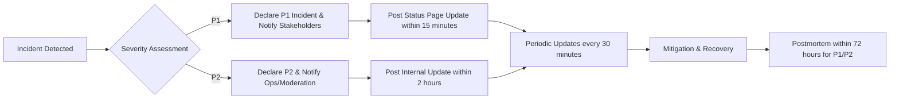
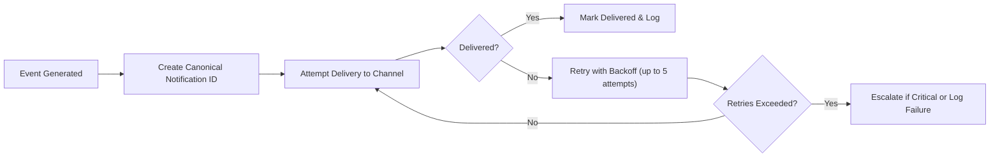

# Non-Functional Requirements — communityBbs

## Executive Summary and Purpose

communityBbs is a community-driven discussion platform that connects users through topic-based communities. Non-functional capabilities are critical to delivering a reliable, secure, and performant experience that supports growth while protecting users and meeting legal obligations. The requirements below define measurable service-level objectives (SLOs), availability and recovery expectations, security and privacy mandates, monitoring and observability needs, incident and communication procedures, data-retention and legal-hold behaviors, and operational constraints that the platform MUST satisfy from a business perspective.

## Scope and Audience

Scope: All platform services supporting core user experiences described in functional requirements: registration/login, community creation, posting (text/link/image), nested commenting, voting, subscription feeds, reporting, moderation, and user profiles. The document excludes low-level implementation details (no database schemas, no vendor-specific configurations) and focuses on what the service MUST deliver.

Audience: Product owners, backend engineers, SRE, security/compliance teams, QA, and operations.

## Definitions and Actors

- visitor: Unauthenticated user who may browse public communities and read posts and comments.
- communityMember: Registered, verified user who can create posts, comment, vote, subscribe, report, and edit their own content within configured windows.
- systemAdmin: Platform administrator with audit-level privileges who can take moderation actions, suspend accounts, and access administrative dashboards.

All requirements below use business-level language. Where applicable, requirements are expressed in EARS format (WHEN, THE, SHALL, IF, THEN, WHERE) to be testable and unambiguous.

---

## 1. Performance SLAs (User-facing)

### 1.1 Response Time Targets
- WHEN an authenticated user requests an interactive page (community feed, post page), THE system SHALL return the primary payload (visible content) within 2.0 seconds at the 95th percentile under normal load conditions.
- WHEN an unauthenticated visitor requests a public feed page, THE system SHALL return the primary payload within 2.5 seconds at the 95th percentile under normal load conditions.
- WHEN a user submits a text-only post or comment, THE system SHALL persist the write and return an acknowledgement within 1.5 seconds at the 95th percentile under normal load.
- WHEN a user casts a vote, THE system SHALL reflect the vote effect in the author's visible feed and in the actor's UI within 3 seconds for 95% of events under normal load.

### 1.2 Throughput and Capacity Planning
- THE platform SHALL be designed to support an initial baseline of 100,000 Monthly Active Users (MAU) and sustain 5,000 concurrent active sessions without breaching defined SLAs. WHEN sustained traffic exceeds 80% of provisioned capacity for three consecutive days, THE business SHALL treat this as a scale trigger for capacity planning.
- WHEN a marketing or event-driven spike is scheduled, THE product team SHALL provide at least 14 days' notice to operations to scale resources.

### 1.3 Performance Acceptance Criteria
- Acceptance Test: Under a representative load test (including reads and writes proportional to expected traffic), 95th percentile interactive page latencies SHALL be <= 2.0s and 99th percentile write latencies SHALL be <= 5.0s.

---

## 2. Scalability and Availability

### 2.1 Availability Targets
- THE system SHALL target the following availability SLOs measured monthly: read (browse) endpoints 99.95% availability; write endpoints (create post/comment/vote) 99.9% availability.
- WHEN availability falls below SLO thresholds for a rolling 7-day window, THEN the incident response process SHALL be triggered and a remediation plan produced.

### 2.2 Recovery Objectives
- THE platform SHALL target a Recovery Time Objective (RTO) of 2 hours for restoring read-only access for a major outage and an RTO of 6 hours for restoring full read-write capability for Priority-1 incidents.
- THE platform SHALL target a Recovery Point Objective (RPO) of 15 minutes for user content (posts/comments/votes) under normal operations; where exact RPO cannot be guaranteed for certain queued/async operations, user-visible messaging SHALL indicate eventual consistency.

### 2.3 Graceful Degradation
- WHEN a non-critical subsystem fails (for example image processing, advanced search indexing), THE system SHALL gracefully degrade by preserving text-based reads and by showing clear user-facing messaging ("Image processing delayed") without blocking core reading and writing flows.
- IF moderation queue processing is delayed, THEN THE system SHALL continue to accept submissions and SHALL mark new items as "pending moderation" until triage completes.

---

## 3. Security and Privacy (Business Requirements)

### 3.1 Authentication and Session Management (EARS)
- WHEN a user registers, THE system SHALL require email verification before allowing actions that mutate platform state (create community, create post, comment, vote, subscribe, report).
- WHEN a user authenticates successfully, THE system SHALL issue session tokens and SHALL make token lifetimes explicit to the user (access token lifetime recommended 15–30 minutes; refresh token lifetime recommended 7–30 days as a business guideline).
- WHEN a user explicitly revokes sessions ("log out everywhere"), THE system SHALL invalidate active refresh tokens and SHALL prevent further use of revoked tokens within 60 seconds.
- IF a user resets their password, THEN THE system SHALL revoke all active refresh tokens and require reauthentication for previously active sessions.

### 3.2 Role Separation and Admin Auditability
- THE system SHALL treat systemAdmin actions as auditable events. WHEN a systemAdmin or moderator performs a moderation action (remove content, suspend user), THE system SHALL record an immutable audit log entry including actor id, action type, target id, reason code, and timestamp.
- IF escalation to external legal or enforcement authorities is required, THEN THE system SHALL preserve relevant logs and metadata for the duration of any legal hold.

### 3.3 Data Protection & Privacy Requirements
- THE system SHALL require encrypted transport (HTTPS/TLS) for all user-facing operations and administrative accesses. (Business mandate; cipher choices are an implementation detail.)
- WHEN storing personal data, THE system SHALL apply data minimization principles and SHALL store only data required for platform operation.
- IF a verified user requests data export, THEN THE system SHALL provide a machine-readable data portability export containing posts, comments, subscriptions, and non-sensitive profile data within 30 calendar days of verification of the request.
- WHEN a verified user requests account deletion under applicable privacy laws, THEN THE system SHALL perform a soft-delete and begin a deletion workflow; the system SHALL permanently remove or anonymize personal data within 30 calendar days unless a legal hold applies.

### 3.4 Breach Notification and Legal Compliance
- WHEN a data breach affecting personal data is confirmed, THE system SHALL notify affected users and relevant supervisory authorities according to applicable laws (example: GDPR requires notification within 72 hours of becoming aware of a reportable breach).
- IF the breach involves sensitive categories or large-scale exposure, THEN THE business SHALL follow an escalated corporate incident response and communication plan, including externally visible status updates and regulatory filings where required.

---

## 4. Reliability and Fault Tolerance

### 4.1 Data Durability and Backup Objectives
- THE business SHALL mandate daily backups for primary user content (posts, comments, votes) and metadata. Backups SHALL be retained for a minimum of 90 days for operational recovery and for up to one year for audit/legal reasons when required.
- THE platform SHALL target an RTO for restoring critical services from backups of 4 hours for targeted restores (single community or account) and 24 hours for full-service recoveries, subject to incident classification.

### 4.2 Processing Semantics and Consistency
- FOR reporting intake and moderation actions, THE system SHALL ensure at-least-once processing semantics and SHALL implement deduplication at the business-event level (canonical event id) to avoid duplicate processing effects.
- FOR feed ranking and eventual consistency scenarios, THE system SHALL document expected propagation windows and SHALL present user-facing indicators ("some content may appear shortly") where strong consistency cannot be guaranteed.

### 4.3 Degraded Mode Behavior
- WHEN image processing or CDN integration fails, THE system SHALL still return textual content and SHALL display placeholders for images with explanatory status.
- WHEN write-heavy spikes threaten stability, THE system SHALL temporarily rate-limit non-critical write operations (for example, bulk cross-posting or automated high-frequency jobs) while preserving interactive writes from typical users.

---

## 5. Monitoring, Observability and Auditability

### 5.1 Metrics and Dashboards (Business KPIs)
- THE system SHALL emit the following business-level metrics:
  - MAU/DAU (daily and monthly active users)
  - Concurrent active sessions
  - Posts per minute and comments per minute
  - Votes per minute
  - Report submissions per hour and moderation queue size
  - API error rate (4xx/5xx) and per-endpoint latency percentiles (p50, p95, p99)
  - Background job failure rates (image processing, moderation heuristics)

- WHEN any critical metric exceeds configured thresholds, THE system SHALL trigger alerts and remedial actions per the alerting policy below.

### 5.2 Alerting and Escalation Rules
- Alert thresholds (business defaults):
  - API error rate > 2% sustained for 5 minutes -> alert SRE
  - P95 page latency > 2.5s sustained for 10 minutes -> alert performance on-call
  - Moderation queue length > 500 unresolved high-priority reports -> alert moderation leads and ops
  - Failed background job ratio > 5% over 10 minutes -> alert engineering

- WHEN an alert fires, THE system SHALL escalate according to severity: page on-call -> engineering lead -> product/ops -> executive stakeholders based on elapsed time without remediation.

### 5.3 Synthetic Checks and User Journey Monitoring
- THE system SHALL run synthetic checks for key user journeys (register/login, fetch feed, create post, vote) every 5 minutes and SHALL alert on failures above a configured threshold.

### 5.4 Logging and Retention
- THE system SHALL retain audit logs for moderation and admin actions for at least 3 years and SHALL retain operational logs for 90 days for incident investigation.
- WHEN access to audit logs occurs, THE system SHALL record who accessed logs, why, and timestamp for compliance purposes.

---

## 6. Incident Management and Communication

### 6.1 Incident Classification and SLAs
- Incident Severity Definitions (business-level):
  - Priority-1 (P1): Global outage or data loss affecting large portions of users where core functionality is unavailable.
  - Priority-2 (P2): Partial outage or severe degradation (for example moderation pipelines down causing long backlogs) affecting a subset of users.
  - Priority-3 (P3): Non-critical issues or localized errors with limited user impact.

- WHEN a P1 incident is declared, THE system SHALL publish an initial status update on the public status page within 15 minutes and SHALL provide regular updates at least every 30 minutes until mitigated.
- WHEN a P2 incident is declared, THE system SHALL publish an internal notification and provide an external status update within 2 hours.

### 6.2 Communication and Status Page Protocol
- THE system SHALL maintain a public status page that indicates system-wide availability, scheduled maintenance, and ongoing major incidents. Public updates SHALL be factual, non-technical, and provide estimated times for the next update.
- WHEN a customer-facing incident occurs that affects moderation or content availability, THE system SHALL notify impacted community owners and moderators via in-app messages and email if they are opted-in to incident notifications.

### 6.3 Postmortem and Continuous Improvement
- WHEN an incident classified as P1 or P2 is resolved, THE system SHALL produce a business-oriented postmortem within 72 hours that includes root cause, impact summary, remediation actions, and timeline of events.

### 6.4 Incident Flow Diagram (Mermaid)

---

## 7. Data Retention, Archival and Legal Holds

### 7.1 Retention Windows (Business Defaults)
- Soft-deleted content (posts/comments): retained for 90 days before eligible for permanent deletion.
- Audit logs and moderation records: retained for a minimum of 3 years; retention may be extended for legal holds.
- Backups: retained for 90 days for operational restores; archival backups for legal requests may be kept for up to 1 year or as required by law.

### 7.2 Legal Holds and Compliance
- WHEN a legal hold is placed (court order, investigation), THE system SHALL suspend deletion and retention expiry for affected objects and SHALL preserve all related metadata and logs until the hold is lifted.
- IF a jurisdiction requires stricter privacy timelines (for example, local regulations), THEN THE system SHALL support jurisdiction-specific retention overrides to comply with local laws.

### 7.3 Data Portability and Deletion Requests
- WHEN a verified user requests a portability export, THE system SHALL provide a machine-readable export within 30 days that includes the user's posts, comments, subscriptions, and non-sensitive profile meta.
- WHEN a verified user requests account deletion, THE system SHALL perform soft-delete immediately and SHALL complete hard deletion or anonymization within 30 calendar days unless legal hold prevents deletion.

---

## 8. Operational Constraints and Maintenance

### 8.1 Maintenance Windows and Notifications
- THE system SHALL schedule planned maintenance during low-traffic windows and SHALL notify users at least 72 hours in advance via in-app banners and email.
- FOR emergency maintenance required to remediate critical security vulnerabilities, THE system SHALL notify stakeholders as soon as possible and publish a post-event summary.

### 8.2 Deployment and Change Management
- WHEN deploying potentially disrupting changes, THE system SHALL require a staged rollout and automated smoke tests to verify core user journeys post-deploy before full traffic cutover.
- THE system SHALL not exceed a 1% increase in error rates for core flows in the first 24 hours after a deploy; deviations SHALL trigger automated rollback and investigation.

---

## 9. Testing, Validation and Acceptance

### 9.1 Load and Performance Testing
- Acceptance Test: THE system SHALL demonstrate via load testing that it meets the performance SLAs (Section 1) under representative load including read/write mixes and background moderation activity.

### 9.2 Chaos and Resilience Testing
- WHEN conducting resilience exercises (chaos tests), THE system SHALL verify graceful degradation behavior for non-critical subsystems and SHALL ensure core reads/writes remain available or provide clear messaging when they cannot.

### 9.3 Security and Compliance Testing
- THE system SHALL perform periodic security testing (vulnerability scans, authenticated penetration testing for critical flows) and SHALL remediate high-severity findings within agreed operational timelines.

### 9.4 Acceptance Criteria (EARS examples)
- WHEN the platform is subjected to a representative load test with 5,000 concurrent active sessions, THE system SHALL maintain 95th percentile page latencies <= 2.0s; test shall PASS if metrics meet these thresholds.
- WHEN a simulated moderation spike of 1,000 reports/hour is ingested, THE system SHALL process high-priority reports within the SLA (initial triage within 1 hour) for 90% of cases.

---

## 10. Notification and Event Processing Requirements (retry & deduplication)

- WHEN an in-app or email notification fails to deliver due to transient errors, THE system SHALL retry with exponential backoff up to 5 attempts and SHALL escalate failures for Critical notifications to systemAdmin after the final retry.
- WHEN duplicate notifications are generated for the same canonical event, THE system SHALL deduplicate using a canonical notification id and SHALL ensure end-users receive at most one notification per event per channel.

Mermaid: Notification Retry and Deduplication Flow

---

## 11. Appendix: Glossary, KPIs, and Templates

### 11.1 Glossary
- RTO: Recovery Time Objective
- RPO: Recovery Point Objective
- MAU/DAU: Monthly/Daily Active Users
- P95/P99: 95th/99th percentile latency

### 11.2 Key Business KPIs
- Target MAU for year 1: 100,000 (business planning target)
- Target moderation SLA: 90% of high-priority reports reviewed within 24 hours
- Target availability: read 99.95%, write 99.9% monthly

### 11.3 Notification Templates (Business Examples)
- Report acknowledgment (in-app/email): "Thank you — your report about '{contentSummary}' has been received. Our moderation team will review it and follow up if additional information is required."
- Incident status update: "We are aware of an issue affecting parts of the service. Our engineers are investigating. Next update: {time}."

---

End of non-functional requirements for communityBbs.
