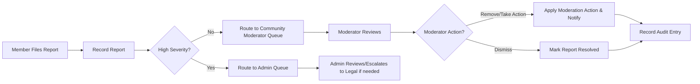

# Business Rules and Validation — communityPortal

## Executive Summary
The platform operates as a moderated, community-driven content service enabling topic-focused communities, posts (text/link/image), nested comments, voting, subscriptions, user profiles, and reporting. Requirements below define business rules, validations, error behaviors, moderation workflows, retention expectations, and acceptance criteria that are actionable and testable by backend and QA teams. Items requiring stakeholder policy decisions are explicitly labeled "STAKEHOLDER DECISION REQUIRED".

## Scope and Purpose
Scope: Define all business-level rules and validation constraints required to implement the features specified for communityPortal: community creation, posting, commenting, voting, karma, sorting, subscriptions, profiles, reporting, and moderation. The document excludes low-level technical design (APIs, schemas) but specifies data entities and expected attributes in business terms.

Purpose: Provide unambiguous, testable requirements (use EARS format) that allow development and QA teams to implement and verify platform behavior.

## Audience
Product owners, backend engineers, QA engineers, moderation leads, and operations staff.

## Roles and Permission Summary (Business-Level)
- guest: Read-only access to public communities and posts.
- member: Authenticated and verified user able to create posts, comments, vote, subscribe, and report.
- moderator: Assigned per community; can review reports and take moderation actions within assigned community scope.
- admin: Global platform operator with escalation and system-wide moderation authority.

Permission matrix (business view):
- Browse public content: guest/member/moderator/admin — allowed
- Register / Login / Verify: guest -> register -> member
- Create community: member (subject to policy)
- Create post/comment: member (verified)
- Vote: member (verified)
- Report content: member (verified)
- Moderate content: moderator (assigned) / admin (global)

## Primary Business Entities (Business Attributes Only)
- User: userId, username, displayName, emailVerified (boolean), joinDate, accountStatus, roles, displayedKarma
- Community: communityId, name, description, visibility (public/private), creationDate, creatorUserId, moderators
- Post: postId, communityId, authorUserId, type (text/link/image), title, body, linkUrl, imageRefs, createdAt, status (published/pending/removed), score
- Comment: commentId, postId, parentCommentId, authorUserId, body, createdAt, status, score
- Vote: voterUserId, targetType, targetId, voteValue (+1/-1), createdAt
- Subscription: userId, communityId, createdAt
- Report: reportId, reporterUserId, targetType, targetId, reasonCode, detailText, createdAt, status, assignedModeratorId
- KarmaEvent (audit): eventId, userId, delta, cause, createdAt

## Business Rules and Validation (Detailed)
Each rule below uses EARS where applicable and includes acceptance criteria.

### 1. Community Creation
- WHEN a verified member requests creation of a new community, THE system SHALL validate the proposed community name for uniqueness (case-insensitive) and allowed character set and SHALL either create the community or reject the request with a clear reason.
- IF the community name duplicates an existing name (case-insensitive), THEN THE system SHALL reject the request and return a "name already in use" reason and a suggested set of available name variants.
- WHERE community creation is rate-limited, THE system SHALL deny further creation attempts once the limit is reached and SHALL present an explanatory message including how long until the user may retry.

Acceptance criteria:
- Unique name enforcement: attempts to create duplicate names are rejected with a deterministic error code and message.
- Creator assignment: successful creation assigns the creator as initial moderator and records the appointment in audit logs.

STAKEHOLDER DECISIONS REQUIRED:
- Minimum account age or karma required to create communities (default: none, recommended: account age >= 7 days OR karma >= X).
- Per-user community creation rate limit (recommended placeholder: 1 per 7 days).

### 2. Posting: Text, Link, Image
Validation rules (business-level):
- WHEN a verified member submits a post, THE system SHALL validate that the post contains a non-empty title and at least one content payload appropriate for the post type (text body for text posts, valid URL for link posts, one or more images for image posts).
- IF the title is empty or only whitespace, THEN THE system SHALL reject the submission with the error "Title is required.".
- IF the post type is link and the URL is syntactically invalid, THEN THE system SHALL reject the post and return "Invalid URL format.".
- IF the post type is image, THEN THE system SHALL enforce business-configured limits on image count and image file size and reject uploads that exceed limits with an explicit message describing the limit.

Business-configurable defaults (recommendation, STAKEHOLDER DECISION REQUIRED):
- Title max length: 300 characters.
- Text body max length: 40,000 characters.
- Comment max length: 10,000 characters.
- Max images per post: 10.
- Max image file size: 10 MB per image; allowed formats: JPEG, PNG, GIF, WEBP.

Publishing behavior:
- WHEN a post is created, THE system SHALL set its state to "published" or "pending" depending on the community's moderation setting. Communities may require pre-approval for new posts (community-level setting). The choice of pre-approval is a community policy.

Acceptance criteria:
- Posts with required fields pass validation and change state according to community settings.
- Posts violating size/format rules are rejected with explicit messages.

### 3. Commenting and Nested Replies
- WHEN a verified member submits a comment, THE system SHALL attach the comment to the indicated post and optional parent comment and SHALL record the creation timestamp and author identity.
- WHERE the platform enforces a maximum comment nesting depth, THE system SHALL reject replies that would exceed the configured maximum and return "Reply depth exceeded" with the configured depth value.

STAKEHOLDER DECISION REQUIRED: maximum nesting depth (recommended default: 6 for MVP).

Acceptance criteria:
- Valid comments are visible in threaded order; replies beyond maximum depth are rejected.

### 4. Voting and Vote Integrity
- WHEN an authenticated, verified member casts an upvote or downvote on a post or comment, THE system SHALL record at most one active vote per (user, target) pair and SHALL update the authoritative content score accordingly.
- IF the same user attempts to vote again in the same direction, THEN THE system SHALL ignore duplicate votes and return the current vote state.
- WHEN a user changes their vote (for example upvote -> downvote or removes their vote), THE system SHALL update the recorded vote and adjust the content score and any associated karma deltas.
- IF a user attempts to vote on their own content, THEN THE system SHALL prevent the vote and return "Self-voting not allowed.".

Anti-abuse rules:
- WHEN suspicious voting patterns are detected (rapid votes from related accounts or IP clustering), THE system SHALL mark the votes as suspect, exclude them from public tallies while under review, and add the case to the moderation/audit queue. (Thresholds: STAKEHOLDER DECISION REQUIRED.)

Acceptance criteria:
- One active vote per user per target enforced; vote change updates reflected in content score and vote history.

### 5. User Karma
- WHEN votes affecting a user's content are finalized, THE system SHALL create a KarmaEvent for each vote event and SHALL update the user's displayed karma according to the stakeholder-approved karma calculation method.
- IF karma calculation rules are not yet finalized, THEN THE system SHALL queue KarmaEvents and label displayed karma as "pending" or display raw vote aggregates until the formula is approved.

STAKEHOLDER DECISION REQUIRED: the exact karma formula (weights for post vs comment, upvote vs downvote, decay, caps). Recommended default for MVP (temporary): upvote on post +1, downvote on post -1, upvote on comment +1, downvote on comment -1 — but must be approved.

Acceptance criteria:
- Karma events are auditable and applied consistently once the formula is agreed.

### 6. Sorting and Ranking Modes
Business definitions:
- new: posts ordered newest-first.
- top: posts ordered by absolute score within the selected time window.
- hot: algorithmically ranked combining recency and score (stakeholder must provide parameterization or accept recommended heuristic).
- controversial: posts with high upvote and downvote activity producing high engagement but lower net score.

EARS requirement:
- WHEN a user requests a post list with a given sort mode, THE system SHALL return posts ordered according to the chosen mode's documented business definition and SHALL persist tie-breaker rules (e.g., newest-first for identical scores).

STAKEHOLDER DECISION REQUIRED: exact hot and controversial formulas. Recommended default: adopt an industry-standard hot scoring heuristic until stakeholders define custom weights.

### 7. Reporting and Moderation Workflows
- WHEN a user files a report on content, THE system SHALL record the report with reporter identity (if authenticated), target reference, reason code (from a controlled taxonomy), optional details, and timestamp, and SHALL route the report to the relevant community moderator queue.
- IF a report is marked high-severity by the reporter or automated triage, THEN THE system SHALL elevate the report to the admin queue immediately.
- WHEN a moderator takes action (remove, warn, lock, pin, escalate), THE system SHALL record the action, actor identity, action reason, and timestamp for audit.
- WHERE a moderator fails to act within configured SLA, THE system SHALL automatically escalate the report to admin and notify relevant stakeholders. (Default SLA: initial moderator review within 48 hours; escalation to admin after 48 hours — STAKEHOLDER DECISION REQUIRED.)

Report reason taxonomy (recommended initial set, STAKEHOLDER DECISION REQUIRED): spam, harassment, hate speech, sexual content, personal data leak, illegal content, other.

Mermaid diagram: report and moderation flow

Acceptance criteria:
- Reports appear in moderator queues within 10 seconds of filing; high-severity reports are routed to admins immediately.
- All moderator/admin actions are auditable and linked to the original report.

### 8. Retention, Legal Hold, and Deletion
- WHEN content is removed by moderation or by a user's deletion request, THE system SHALL perform a soft-delete that hides the content from public views but retains an auditable record for the retention period required by stakeholders or legal obligations.
- IF a legal hold is imposed, THEN THE system SHALL prevent permanent deletion of the related content until the legal hold is released.

STAKEHOLDER DECISION REQUIRED: retention durations and deletion policies. Recommended defaults: soft-delete retention for audit — 2 years; user-initiated deletion move to pending deletion for 30 days before permanent purge unless legal hold applies.

Acceptance criteria:
- Soft-deleted content is hidden publicly but preserved for audit and potential reinstatement during retention window.

### 9. Error Handling and User-Facing Recovery (EARS examples)
- IF a user attempts to create a post with a missing title, THEN THE system SHALL reject the submission and display "Title is required." within the posting UI.
- IF a user attempts to upload an image larger than the allowed size, THEN THE system SHALL reject the upload and display "Image exceeds maximum allowed size of X MB." where X is the configured limit.
- IF an unauthenticated user attempts to vote or comment, THEN THE system SHALL prompt the user to sign in and preserve any draft content where feasible.
- IF a moderator action fails due to transient system error, THEN THE system SHALL notify the moderator of the failure, retry the action once, and create an audit log entry for operational follow-up.

Acceptance criteria:
- User-facing error messages are actionable, localized, and include next-step guidance. QA will verify all representative messages.

### 10. Auditability and Logging (Business Requirements)
- WHEN moderation or account-sensitive actions occur (suspension, ban, content removal, role changes), THE system SHALL record an audit entry that includes the actor identity, action type, target identifier, timestamp, and action reason.
- THE retention of audit logs is a stakeholder decision; recommended minimum retention for moderation/audit logs: 2 years unless legal constraints require longer retention.

Acceptance criteria:
- All moderation and escalation actions are visible in audit reports and include required metadata for review.

### 11. Performance and Non-Functional Expectations (Business-Level)
- WHEN a member requests the first page of a community feed (20 items), THE system SHALL return results within 2 seconds under normal operating conditions.
- WHEN a member submits a post, comment, vote, or report, THE system SHALL reflect the action in UI-visible state within 3-5 seconds under normal load.
- WHERE spikes occur, THE system SHALL prioritize moderation queue visibility for moderators and admins to surface abusive content rapidly.

Operational constraints (business):
- Default page size for feeds: 20 items (configurable).
- Define "normal operating conditions" as the platform's initial target scale and agree to explicit concurrency numbers in architecture planning.

### 12. Acceptance Criteria and Testable Validation Points
QA test checklist (business-level):
- Community creation: unique-name enforcement, creator assigned as moderator, rate-limit enforced when configured.
- Posting: title and content validation, URL validation, image size/format validation.
- Commenting: nesting depth enforcement, length enforcement.
- Voting: single active vote per user per item, vote change behavior, self-vote prevention.
- Reporting: report record creation, queue routing, SLA escalation behavior.
- Karma: KarmaEvent creation and queueing; final calculation once formula provided.
- Retention: soft-delete hides content publicly and preserves audit data until retention expires.

## Open Questions and Stakeholder Decisions (Prioritized)
1. Karma calculation formula and whether negative karma is allowed (HIGH).  
2. Image hosting approach and precise file-size/format limits (HIGH).  
3. Community creation eligibility and rate limits (HIGH).  
4. Retention durations for content and audit logs (HIGH).  
5. Exact thresholds for vote-fraud detection and automatic withholding (MEDIUM).  
6. Moderator SLA windows for different report severities (MEDIUM).  
7. Maximum comment nesting depth (MEDIUM).

For each open question, include a decision register entry with decision ID, options considered, selected option, rationale, and sign-off.

## Appendix A — Mermaid Diagrams (Corrected Syntax)
- All diagrams in this document use double quotes for labels and proper arrow syntax.

## Appendix B — Glossary
- Community: topic-focused grouping of posts.  
- Post: a content item of type text, link, or image.  
- Comment: a reply to a post or another comment.  
- Karma: user reputation score derived from community interactions.  
- Moderator: community-appointed user with scoped moderation privileges.  
- Admin: platform-level user with global privileges.

