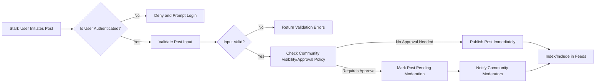
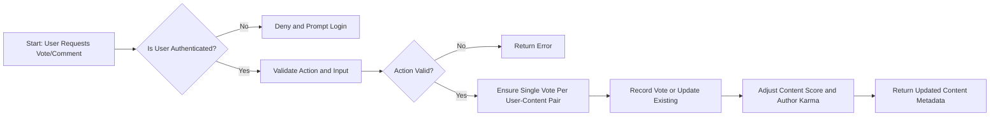
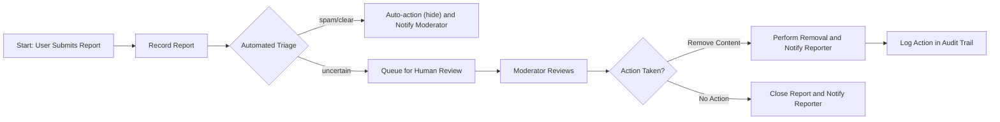

 # Functional Requirements for communityBbs

## 1. Introduction and Scope

This document captures the complete set of business-level functional requirements for the communityBbs platform — a Reddit-like community service for creating, sharing, and moderating posts across named communities. The document defines WHAT the system must do from the user's and product's perspective. It does not prescribe HOW features must be implemented (no API definitions, database schemas, infrastructure, or frontend UI details).

Scope: core user flows required by the product owner: user registration and login, community creation and management, creating posts (text, link, image), commenting with nested replies, voting (upvote/downvote) for posts and comments, user karma, content sorting (hot, new, top, controversial), subscriptions to communities, user profiles, and reporting/investigation flows for inappropriate content.

Audience: backend developers, QA engineers, product owners.

This document provides business requirements only. All technical implementation decisions (architecture, APIs, database design, storage, authentication token formats, and protocols) are at the discretion of the development team.

## 2. Actors and Permission Summary (reference)

Actors (business-level descriptions):
- visitor (guest): Unauthenticated users who can browse public communities and read posts and comments. They cannot create content, vote, or subscribe. They can access registration and login features.
- communityMember (member): Registered and authenticated users who can create and manage their account, create and edit their own posts and comments within defined windows, vote, subscribe, report content, and view their profile and activity history.
- systemAdmin (admin): Platform administrators who can manage global settings, review and act on reports, suspend or ban user accounts, manage community-level moderation escalations, and access system-wide analytics and audit logs. Administrative actions are auditable.

Permission summary (business terms):
- Only communityMember and systemAdmin can create posts and comments.
- Only communityMember and systemAdmin can cast votes.
- Only communityMember and systemAdmin can subscribe to communities.
- Visitors can browse and read public content but cannot interact beyond registration/login endpoints.

## 3. Authentication & Account Management Requirements

WHEN a user submits a registration request, THE system SHALL create a new account in a pending verification state if the provided email is syntactically valid and the password meets strength rules.

WHEN a user completes email verification, THE system SHALL transition the account from pending verification to active.

IF the provided email is already associated with an existing active account, THEN THE system SHALL refuse registration and present an error indicating duplicate email.

WHEN a user attempts to log in with email and password, THE system SHALL validate credentials and allow access only for active accounts.

WHEN authentication succeeds, THE system SHALL create a session artifact enabling the user to act as an authenticated communityMember and SHALL make clear the session lifetime and renewal behavior in user-visible terms.

IF an account is suspended by an admin, THEN THE system SHALL prevent login attempts and SHALL surface a suspension message explaining the state and steps to appeal.

Ubiquitous requirement: THE system SHALL allow users to request password reset and SHALL require email confirmation for password reset actions.

Ubiquitous requirement: THE system SHALL support account deactivation and account deletion requests initiated by communityMember. THE system SHALL mark deleted accounts as deleted from a business perspective and SHALL retain anonymized activity per retention policy (see Data Flow & Lifecycle document). 

Input validation and strength rules (business-level):
- WHEN a user submits a password during registration or change, THE system SHALL enforce a minimum length of 8 characters, and SHALL require at least one uppercase letter, one lowercase letter, and one numeric character. Noncompliant passwords SHALL be rejected with a clear error code.
- WHEN a user supplies an email, THE system SHALL validate email format and SHALL reject addresses that fail standard syntactic validation.

Performance expectation (authentication):
- WHEN a user submits login credentials, THE system SHALL respond with success or failure within 2 seconds for 95% of requests under normal load.

Session handling and security (business-level):
- WHERE multi-device access is used, THE system SHALL allow users to view and revoke active sessions from their account management view.

Error handling examples:
- IF credential validation fails, THEN THE system SHALL return a clear, consistent error message indicating authentication failed and SHALL not disclose whether the email exists.
- IF email verification token is expired or invalid, THEN THE system SHALL present a clear remediation flow (resend verification) and SHALL not activate the account.

## 4. Community Management Requirements

Ubiquitous requirement: THE system SHALL allow communityMember to create a new community (also known as subreddit) when the member provides a unique community name and description, subject to naming rules and rate limits.

WHEN a community is created, THE system SHALL mark the creator as the initial community owner and SHALL create an initial moderation role scope for that community.

Business rules and validations for community creation:
- WHEN creating a community, THE system SHALL require community names to be 3-21 characters long, consisting of alphanumeric characters, hyphens, and underscores only, and SHALL enforce uniqueness across active communities.
- IF a requested community name conflicts with a reserved or banned list (trademarked names or prohibited terms), THEN THE system SHALL refuse creation and return an appropriate business error code.
- WHEN a community is created, THE system SHALL require a short description (max 300 characters). Descriptions exceeding this limit SHALL be rejected with a validation error.

Membership and visibility:
- WHERE a community is created, THE system SHALL support public and private visibility states as business options. THE community creator SHALL choose visibility at creation.
- WHEN a community is private, THE system SHALL prevent visitors and non-member communityMembers from viewing or subscribing to it unless explicitly granted access by community moderators or owners.

Moderation roles and escalation rules:
- WHEN a community is created, THE system SHALL allow the community owner to assign community moderators from communityMembers.
- WHEN a report is escalated beyond community moderator capacity, THEN THE system SHALL provide a business path for escalation to systemAdmin review.

Rate limiting and abuse prevention (business-level):
- WHERE community creation is invoked, THE system SHALL limit new community creation to no more than 3 communities per 24-hour period per account to prevent abuse. Attempts beyond this limit SHALL be rejected with a rate-limit error message.

## 5. Post Management Requirements (text, link, image)

Ubiquitous requirement: THE system SHALL allow communityMember to create posts in communities where they have posting permission and in which the community is visible to them.

Post types and required fields (business-level):
- WHERE a post is created, THE system SHALL require one of three post types: text post, link post, or image post. The creator SHALL select the type at creation.
- WHEN a text post is created, THE system SHALL require a title (max 300 characters) and body text (max 40,000 characters). Titles and body text exceeding limits SHALL be rejected with a clear validation error.
- WHEN a link post is created, THE system SHALL require a title (max 300 characters) and a URL. THE system SHALL validate URL syntactic correctness and SHALL reject non-HTTP(S) schemes.
- WHEN an image post is created, THE system SHALL require a title (max 300 characters) and at least one image attachment. THE system SHALL enforce allowed media types and business size limits.

Media constraints (business-level):
- WHERE images are accepted, THE system SHALL allow common image MIME types (JPEG, PNG, GIF). THE system SHALL reject unsupported file types with a clear error.
- WHERE image file size is subject to policy, THE system SHALL limit individual image files to a configured business limit (example business default: 10 MB). Uploads above the limit SHALL be rejected with an error indicating file too large.

Edit and deletion windows:
- WHEN a post is created, THE system SHALL allow the author to edit the post content and title for up to 24 hours after creation. Edits beyond that window SHALL be disallowed except by moderators or admins with justification and audit trail.
- WHEN a post is deleted by its author within the allowed window, THE system SHALL mark the post as deleted from public view while preserving an audit record for moderation and retention policy.

Post visibility rules:
- WHEN a post is created in a public community, THE system SHALL make the post visible immediately unless the community mandates moderator approval before public display.
- WHERE a community requires pre-approval, THE system SHALL mark newly created posts as pending moderation and SHALL not show them to the wider community until approved.

Performance expectations:
- WHEN retrieving a paginated feed of posts, THE system SHALL return each page of up to 20 posts within 2 seconds for 95% of requests under normal load.

## 6. Voting and Commenting Requirements (including nested replies)

Voting rules:
- Ubiquitous requirement: THE system SHALL allow communityMember to upvote or downvote posts and comments in communities where they have access.
- WHEN a member votes on content, THE system SHALL ensure a single active vote per (user, content) pair. Subsequent votes SHALL update the existing vote (e.g., switching from upvote to downvote) rather than creating duplicate votes.
- IF a user attempts to vote while unauthenticated, THEN THE system SHALL deny the action and prompt authentication.
- WHERE a user removes their vote, THE system SHALL remove the user's vote effect from the content score.

Vote abuse prevention (business-level):
- WHERE vote patterns indicate possible manipulation (for example, many votes from a single account on many items in a short time), THE system SHALL mark the behavior for review and SHALL apply a temporary suspension of vote effect while under review.

Commenting rules:
- Ubiquitous requirement: THE system SHALL allow communityMember to add comments to posts where commenting is permitted.
- WHEN adding a comment, THE system SHALL allow nested replies to arbitrary depth from a business perspective. However, THE system SHALL impose a rendering-friendly maximum nesting level for client display (example business default: 8 levels). Comment creation beyond the maximum rendering level SHALL be accepted but SHALL record the nesting for moderation and may be rendered in a flattened form by clients.
- WHEN a comment is created, THE system SHALL enforce a maximum character limit of 10,000 characters. Comments longer than this SHALL be rejected with a validation error.

Edit and deletion of comments:
- WHEN a user creates a comment, THE system SHALL allow edits for 1 hour after creation. After the edit window, only moderators or admins may edit content, and such edits SHALL create an auditable change record.
- WHEN a user deletes their own comment, THE system SHALL mark the comment as deleted publicly while preserving it in retention stores for investigation and compliance.

Comment threading and ordering:
- WHERE comments are displayed, THE system SHALL support both chronological and 'best' (score-based) ordering. Sorting behavior is a presentation concern, but the system SHALL provide the necessary data (timestamps, scores) for the chosen ordering.

Performance expectations:
- WHEN loading the top-level comments for a post, THE system SHALL return the first page of 50 top-level comments (with minimal metadata for nested replies) within 2 seconds for 95% of requests under normal load.

## 7. Karma System Requirements

Business goal: karma provides lightweight reputation signals attached to user accounts and is used for moderation signals, optional gating, and user profile displays.

Karma calculation rules (business-level):
- WHEN a post or comment receives an upvote, THE system SHALL increment the author's karma by a configured positive value (example business default: +1 per upvote on posts, +0.5 per upvote on comments). WHEN a downvote is recorded, THE system SHALL decrement the author's karma by a configured negative value (example business default: -1 per downvote).
- WHERE votes are later reversed or invalidated due to abuse detection, THE system SHALL adjust karma retroactively to reflect the corrected voting state.

Constraints and limits:
- WHERE a user's karma becomes negative beyond a configured threshold (example business default: -100), THE system SHALL flag the account for moderation review and SHALL place rate limits on content creation until reviewed.

Transparency:
- THE system SHALL show the cumulative karma in user profiles and SHALL provide historical granularity for administrators to audit changes (for example: karma by month, or by type of content), subject to retention policy.

## 8. Sorting and Feed Requirements (hot, new, top, controversial)

Business definitions (for backend behavior):
- THE "new" sort SHALL order posts by creation timestamp descending.
- THE "top" sort SHALL order posts by a time-windowed score metric (business-level: score aggregated from votes within the chosen time window) with support for time frames such as 24 hours, 7 days, 30 days, and all time.
- THE "controversial" sort SHALL prioritize posts with a high variance between upvotes and downvotes relative to total votes in a given time window.
- THE "hot" sort SHALL be a time-decayed ranking that balances recency and score; THE system SHALL document the chosen decay parameters in an internal design but at business-level it SHALL ensure that recently active content surfaces higher while older high-score content can still appear.

Feed and pagination:
- WHEN a client requests a feed, THE system SHALL supply paginated results with page sizes of up to 20 items by default. Clients MAY request larger page sizes up to 50 items; THE system SHALL enforce a maximum page size of 100 to limit impact on performance.
- PERFORMANCE: WHEN requesting any paginated feed page, THE system SHALL return results within 2 seconds for 95% of requests under normal load.

Consistency guarantees:
- WHERE feed ordering depends on near-real-time events (votes, comments), THE system SHALL eventually reflect those events in the ranking within 10 seconds for typical small-scale activity and within reasonable windows during high load with appropriate business messaging about propagation delays.

## 9. Subscription and Notification Requirements

Subscription semantics:
- Ubiquitous requirement: THE system SHALL allow communityMember to subscribe and unsubscribe to communities they can view.
- WHEN a member subscribes to a community, THE system SHALL record the subscription and SHALL include the community in the user's personalized feed aggregation.

Notification types and business rules:
- THE system SHALL support in-app notification as the primary delivery channel for: replies to a user's post or comment, moderator messages to a user, reports about content affecting the user, and important community announcements.
- WHERE email notification is enabled by user preference, THE system SHALL send email summaries subject to frequency caps.

Notification frequency and caps (business-level):
- WHEN generating user-facing notifications, THE system SHALL cap email notifications to no more than one summary email per user per hour and no more than 8 per day unless the user opts into higher frequency.
- IF a user has suppressed notifications for a community, THEN THE system SHALL not include that community's events in their aggregated notifications.

Delivery expectations:
- WHEN an in-app notification is created, THE system SHALL make it available for retrieval in the user's notification inbox within 5 seconds for 95% of events under normal load.

## 10. User Profile Requirements

Profile contents (business-level):
- Ubiquitous requirement: THE system SHALL provide each communityMember with a profile page that displays public-facing username, bio (max 500 characters), cumulative karma, counts of posts and comments, and a chronological activity list.
- WHEN a user views another user's profile, THE system SHALL display only those activities that are public (posts in public communities, non-moderator-hidden comments) and SHALL not display private community activity to unauthorized viewers.

Privacy and account controls:
- THE system SHALL allow communityMember to set profile privacy preferences (public or limited). If a profile is limited, THE system SHALL restrict profile visibility as per the user's selection.
- WHEN a user requests data export of their profile activity, THE system SHALL provide a mechanism (business-level requirement) to export personal activity in a portable format consistent with retention and privacy policy.

Performance expectations:
- WHEN retrieving a user's profile and first page of activity (20 items), THE system SHALL respond within 2 seconds for 95% of requests under normal load.

## 11. Content Reporting and Moderation Requirements

Report submission:
- Ubiquitous requirement: THE system SHALL allow communityMember to report posts and comments for a set of standardized reasons (spam, harassment, sexual content, copyright, other) and provide optional freeform text for details (max 1000 characters).
- WHEN a report is submitted, THE system SHALL record the report with reporter, target content identifier, reason code, and timestamp.

Triage and escalation rules:
- WHEN a report is submitted for content in a community with active moderators, THE system SHALL notify community moderators for triage.
- WHERE multiple independent reports accumulate on the same content above a configured threshold (example business default: 3 reports within 24 hours), THE system SHALL automatically escalate the content to systemAdmin review and SHALL place a temporary visibility restriction (soft-hold) pending review.

Moderation actions and auditing:
- WHEN moderators or systemAdmin take moderation actions (approve, remove, warn user, suspend account), THE system SHALL record an auditable action with actor, action type, rationale, and timestamp.
- IF a moderator removes content, THEN THE system SHALL notify the content author with reason and allow them to appeal through a defined business appeal flow.

Automated moderation triggers (business-level):
- WHERE automated content safety services indicate high probability of policy violation (for example explicit sexual content, known malicious links), THE system SHALL flag content for human review and MAY apply temporary holds pending review.

Reporting outcomes and timelines:
- WHEN a report is escalated to systemAdmin, THE system SHALL ensure that 90% of escalated reports receive an initial admin review action within 72 hours.

## 12. Acceptance Criteria and Example Scenarios

Overall acceptance criteria (definition of done for features):
- WHEN a feature is implemented, THE system SHALL satisfy all EARS requirements listed in this document, pass functional acceptance tests, and meet stated performance expectations under normal load.

Example scenarios (with testable outcomes):
Scenario 1: Registration and login success
- WHEN a new user registers with a valid email and compliant password and completes verification, THEN the account SHALL be active and the user SHALL be able to log in. Acceptance: user can log in within 2 seconds 95% of attempts.

Scenario 2: Create a public community and a post
- WHEN a communityMember creates a public community with a unique valid name and description, THEN the community SHALL be created and the creator SHALL be the owner. WHEN the owner creates a text post within the community, THEN the post SHALL be visible immediately in the community for other visitors and communityMembers.

Scenario 3: Voting and karma update
- WHEN user A upvotes a post by user B, THEN user B's karma SHALL be incremented by the configured positive value. WHEN user A removes the upvote, THEN user B's karma SHALL be decremented accordingly.

Scenario 4: Reporting and escalation
- WHEN three distinct communityMembers report the same post within 24 hours for harassment, THEN THE system SHALL automatically escalate the post to systemAdmin review and SHALL place a temporary soft-hold on public visibility pending review.

Scenario 5: Edit window enforcement
- WHEN a user attempts to edit a post after 24 hours from creation, THEN THE system SHALL reject the edit unless the acting user is a moderator or admin; the rejection SHALL include the edit-window error code.

Acceptance test examples (pass/fail criteria):
- Test: Pagination of feeds returns 20 items and responds within 2 seconds => PASS if <=2s and exactly 20 items when page size requested is 20 and enough items exist.
- Test: Comment nesting beyond rendering max is recorded and accepted by the system => PASS if system stores nesting without rejecting and clients can request flattened view.

## 13. Appendix: Glossary and Metrics

Glossary (business terms):
- Post: a piece of user-created content that can be a text entry, a link, or an image.
- Community: a named group or topic area where posts are aggregated.
- Karma: cumulative reputation measure for a user based on votes and system actions.
- Soft-hold: a temporary visibility restriction applied to content pending moderation.

Key business metrics and SLAs:
- Authentication success/failure response time: <= 2 seconds for 95% of requests under normal load.
- Feed and post list page response time: <= 2 seconds for 95% of requests under normal load.
- Post creation latency: <= 3 seconds for text posts in 95% of cases.
- Admin escalation initial review SLA: 72 hours for 90% of escalated reports.

## Mermaid Diagrams (Core Flows)

Post creation flow:

Voting and commenting flow:

Report triage flow:

---

This document defines the business requirements for communityBbs and uses clear, testable EARS statements for each actionable rule. Developers are expected to translate these requirements into technical designs, APIs, schemas, and operational procedures as appropriate for the chosen architecture.