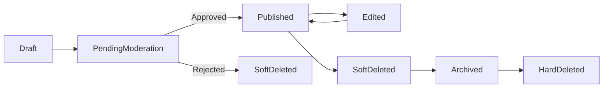
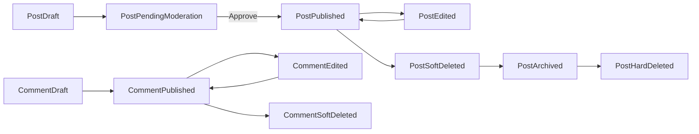
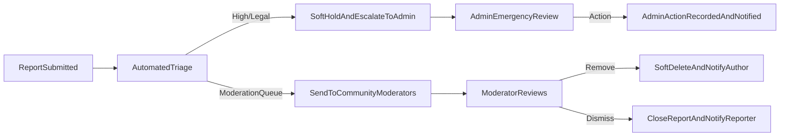

# Data Flow & Lifecycle Requirements — communityBbs

## 1. Purpose and Audience

Provide precise, business-level rules and lifecycle definitions for all core domain objects used by communityBbs: user accounts, communities, posts, comments, votes, and reports. The target audience is backend engineering, QA, moderation operations, compliance, and product owners. All requirements below are stated as operational, measurable business rules. Implementation choices (APIs, schemas, storage) are at the discretion of engineers, but the behaviors below are mandatory.

## 2. Actors and Permission Summary

- visitor: Unauthenticated user who may browse public content. Cannot perform state changes.
- communityMember: Authenticated, verified user able to create communities (subject to rules), post, comment, vote, subscribe, and report.
- moderator: Community-level role (appointed by community owner) that may review reports, approve posts where pre-moderation is enabled, and take community-scoped moderation actions.
- systemAdmin: Platform administrator with global moderation authority, account suspension powers, and audit access. All admin actions are auditable.

Permission implication notes:
- WHEN an actor transitions into suspended/banned state, THE system SHALL block all state-changing operations for that actor until reinstated.
- WHEN a community is private, THE system SHALL prevent visitors and non-members from viewing or subscribing to the community.

## 3. Common State Model and Definitions

States used across objects:
- draft: created but not yet published (user may save draft)
- pending_moderation: awaiting moderator approval (community-level or global)
- published: visible to permitted viewers
- edited: content updated after initial publication (edit history recorded)
- soft_deleted: hidden from public view, retained for recovery and audit
- archived: inactive but preserved for compliance or reactivation
- hard_deleted: permanently removed and no longer retrievable (except where legal hold prevents purge)
- quarantined/restricted: temporary visibility or action restrictions applied for investigation

WHEN a state transition occurs, THE system SHALL record an immutable audit entry capturing: actorId, actorRole, actionType, targetId, previousState, newState, timestamp, and reasonCode (when applicable).

Mermaid: High-level object state transitions

## 4. User Account Lifecycle

States: visitor -> registered_unverified -> registered_verified -> suspended -> banned -> deleted_soft -> deleted_hard.

EARS Requirements:
- WHEN a new user registers with a valid email and compliant password, THE system SHALL create an account in state "registered_unverified" and SHALL send an email verification token that expires after a configurable period (default 7 days).
- WHEN a user redeems a valid verification token, THE system SHALL transition the account to state "registered_verified" and THE system SHALL permit state-changing member actions (posting, voting, subscribing).
- IF a verification token expires, THEN THE system SHALL allow the user to request a new verification token up to a configurable limit per day (default 5 requests/day).
- WHEN suspicious or abusive behavior is detected (per abuse thresholds), THEN THE system SHALL transition the account to state "suspended" pending manual review and SHALL notify the account via verified email with instructions for appeal.
- WHEN a systemAdmin bans an account for violation, THE system SHALL transition the account to state "banned" and SHALL prevent all authentication and state-changing actions until reinstated by systemAdmin.
- WHEN a user requests account deletion, THE system SHALL transition the account to "deleted_soft", BEGIN the soft-delete retention timer (default 30 days), and SHALL remove public-facing personal identifiers while preserving audit and moderation records. IF the user confirms permanent deletion or the retention timer elapses without recovery action and no legal hold applies, THEN THE system SHALL transition the account to "deleted_hard" and purge data per legal and backup retention rules.

Auditability and Session Revocation:
- WHEN an account is suspended, banned, or deleted_soft, THE system SHALL revoke active refresh tokens and SHALL ensure session revocation effects propagate within 60 seconds.
- THE system SHALL provide an auditable list of active sessions per user and SHALL record session revocation events with actorId, revocationReason, and timestamp.

Acceptance examples (testable):
- WHEN a user verifies their email, THE system SHALL show the account as verified in the user management view within 2 seconds and SHALL permit the first post within 5 seconds.
- WHEN an admin suspends an account, THE system SHALL prevent login attempts within 60 seconds.

## 5. Community Lifecycle

States: proposed -> active -> restricted/quarantined -> archived -> deleted_hard.

EARS Requirements:
- WHEN a registered_verified user requests community creation, THE system SHALL create a community record in state "proposed" and SHALL validate name uniqueness, naming rules, and initial settings within 3 seconds.
- WHERE community name conflicts with reserved or banned terms, THEN THE system SHALL reject creation and present a clear error code COMMUNITY_NAME_INVALID.
- WHEN community-level pre-moderation is enabled, THE system SHALL place a new creator's posts into "pending_moderation" until a moderator approves.
- IF a community triggers policy escalation (sustained reports or legal concern), THEN THE system SHALL transition the community to "quarantined" state, restrict new posting, and SHALL notify moderators and systemAdmin with audit information.
- WHEN a community becomes inactive for a configurable window (default 12 months of low activity), THEN THE system SHALL notify owners and SHALL transition the community to "archived" after 30 days unless reactivated.

Moderator roles and ownership:
- WHEN a community is created, THE creator SHALL be recorded as owner and SHALL be able to assign moderators. Moderator acceptance SHALL be auditable.

## 6. Post and Comment Lifecycle (including nested replies)

Domain objects: Post, Comment. Both share core lifecycle states but have object-specific behaviors.

Constraints (business):
- Post title max length: 300 characters; text body max length: 40,000 characters.
- Comment max length: 10,000 characters.
- Image attachments: allowed MIME types JPEG, PNG, GIF; per-image max size default 10 MB; max images per post default 10.

EARS Requirements (Post creation):
- WHEN a communityMember creates a post, THE system SHALL validate required fields and media constraints and SHALL either publish the post or mark it "pending_moderation" based on community settings.
- WHEN a post is published, THE system SHALL create a publish audit entry with authorId, communityId, postId, timestamp, and initial visibility state.
- WHEN a post is edited within the allowed edit window (default 24 hours), THE system SHALL preserve the prior content in the edit history and SHALL record editorId and editTimestamp.

EARS Requirements (Commenting & nesting):
- WHEN a communityMember submits a comment or reply, THE system SHALL attach parentCommentId (nullable) and SHALL record thread relationships.
- WHERE a nested depth exceeds rendering-recommendation thresholds (UI-level; business default 8), THE system SHALL accept and store deeper replies but SHALL allow clients to present a flattened view; the backend SHALL preserve parent linkage for audit and moderation.
- WHEN a comment is edited, THE system SHALL allow edits within 1 hour of creation by default and SHALL record edit history entries.

Deletion behavior:
- WHEN content is soft_deleted (author or moderator), THE system SHALL hide it from public feeds immediately, retain the content and metadata for the soft-delete retention window (default 90 days), and SHALL permit restoration only by author (within restrictions) or moderator as appropriate.
- IF content is removed for policy violations, THEN THE system SHALL place the content into a moderated removal state and SHALL notify the author with reasonCode and appeal instructions.

Mermaid: Post & Comment lifecycle

## 7. Voting and Karma Lifecycle

Vote semantics and durability:
- THE system SHALL record votes as first-class, durable events with fields: voterId, targetType (post/comment), targetId, voteValue (1 for upvote, -1 for downvote), timestamp, and sourceIp (for abuse detection).
- WHEN a vote is cast, THE system SHALL enforce single-active-vote-per-user-per-target; subsequent votes SHALL update the existing vote record rather than create duplicates.
- WHEN a vote is changed or retracted, THE system SHALL update public score calculations and record voteChange entries in the audit trail.

Karma rules (business defaults, configurable):
- Post upvote: +10 karma; post downvote: -2 karma.
- Comment upvote: +2 karma; comment downvote: -1 karma.
- WHEN votes are invalidated due to fraud detection, THE system SHALL reverse the affected karma changes and SHALL record the reversal with reasonCode and investigatorId.

Anti-abuse and reconciliation:
- IF coordinated voting manipulation is suspected (heuristic thresholds: e.g., many votes from small cluster of accounts within short window), THEN THE system SHALL temporarily nullify suspect votes for public ranking and SHALL queue implicated votes for human audit.
- THE system SHALL perform periodic reconciliation jobs (business default daily) to verify vote aggregates against durable vote events and SHALL generate discrepancies report for systemAdmin review.

Acceptance criteria (testable):
- WHEN a user upvotes, THE public score SHALL reflect the change within 3 seconds for 95% of normal operations.
- WHEN fraud is detected and votes are nullified, THE reversal of karma shall be visible in admin audit logs with a reversal record.

## 8. Report Lifecycle and Escalation

Report states: submitted -> triaged -> in_review -> action_taken/dismissed -> escalated (to admin) -> resolved.

EARS Requirements:
- WHEN a user files a report, THE system SHALL create a report record containing reporterId (nullable for permitted anonymous reports), targetId, reasonCode, optional explanation (max 1000 chars), evidence references (attachments or links), and creation timestamp.
- WHEN automated triage classifies a report as "high" or matching legal/illegal content signatures, THE system SHALL automatically apply a soft-hold to the content (hide from public) and SHALL escalate immediately to systemAdmin for emergency review.
- WHEN a report is routed to community moderators, THE system SHALL ensure that moderators receive the report in their queue and THAT the system tracks time-to-first-action; high-priority reports SHALL have a time-to-first-action SLA (business default: 4 hours).
- WHEN a moderator or admin resolves a report with an action, THE system SHALL record the action, actorId, reasonCode, and outcome and SHALL notify the original reporter with a non-sensitive summary of the outcome.

Mermaid: Report triage & escalation

Reports retention and evidence preservation:
- THE system SHALL retain report records and associated evidence for at least 2 years for compliance and dispute resolution, except where longer retention is required by legal hold.
- WHEN a report involves potential legal evidence, THE system SHALL preserve all related content and metadata immutably until legal hold clearance.

## 9. Retention, Archival and Legal Hold Rules

Default retention windows (business defaults, configurable by jurisdiction):
- Soft-deleted posts/comments: 90 days retained then eligible for hard deletion.
- Soft-deleted accounts: 30 days for recovery before hard deletion (unless legal hold).
- Audit logs and moderation records: minimum retention 2 years; systemAdmin logs retained 5 years.
- Vote event records: retained for 1 year (longer if required for ongoing investigations).

Legal holds and overrides:
- WHEN a legal hold is placed (e.g., law enforcement request), THE system SHALL suspend normal retention and purge processes for the affected records and SHALL mark the hold with holdId, reason, initiatingAuthority, startTimestamp, and expectedRelease.
- THE system SHALL not hard-delete any item under legal hold until the hold is explicitly released by authorized compliance personnel.

Archival behavior:
- WHEN content becomes archived, THE system SHALL remove it from standard user-facing indices and feeds but SHALL preserve full fidelity for authorized queries. Archival retention default 2 years.
- THE system SHALL provide an admin-level archival search capability for compliance investigations and appeals.

## 10. Data Durability, Event Semantics and Reconciliation

Durability expectations:
- THE system SHALL treat posts, comments, votes, reports, and moderation actions as durable events and SHALL persist them to storage with durability guarantees consistent with business SLAs.
- THE system SHALL ensure that user-facing acknowledgements for writes (post/comment/vote/report) are returned only after the event is durably recorded or queued in a durable, recoverable write-ahead queue.

Processing semantics and idempotency:
- THE system SHALL aim for at-least-once ingestion of events from clients but SHALL ensure idempotent processing in the backend by using unique client-generated identifiers where appropriate.
- WHEN events are retried due to transient failures, THE system SHALL detect duplicates and ensure only one logical effect is applied (idempotency) for operations such as post creation or vote application.

Reconciliation cadence and responsibilities:
- THE system SHALL run daily reconciliation jobs that compare aggregated counters (scores, voteCounts, karma totals) against durable event logs and SHALL surface discrepancies exceeding thresholds (e.g., >0.5% relative drift) to systemAdmin.
- WHEN discrepancies are detected, THE system SHALL schedule an investigation ticket and SHALL not auto-purge data until reconciliation completes.

## 11. Error Handling, Recovery and Operator Escalation

User-facing errors and messages (business templates):
- AUTH_REQUIRED: "You must verify your email address before creating posts." (used when unverified users attempt state changes)
- IMAGE_TOO_LARGE: "One or more images exceed the 10 MB limit. Please resize and try again." (used on image upload failures)
- RATE_LIMIT_EXCEEDED: "You're doing that too often. Please wait X minutes before retrying." (used when activity thresholds exceed limits)
- MODERATION_PENDING: "Your content is pending moderator review. You will be notified when a decision is made." (used when pre-moderation applies)

Recovery flows and operator actions:
- IF background image moderation pipeline fails, THEN THE system SHALL mark the post as "pending_processing" and SHALL notify the author; operators SHALL be alerted if the backlog exceeds business thresholds (default backlog threshold 1,000 items).
- IF the moderation queue backlog exceeds safe thresholds, THEN THE system SHALL escalate to systemAdmin to enable temporary safe defaults (e.g., auto-hide new posts in affected communities) and SHALL send automated notices to community owners.
- WHEN the reconciliation job finds persistent discrepancies, THEN THE system SHALL pause non-critical purges and create an incident with systemAdmin and engineering on-call until resolved.

## 12. KPIs, SLAs and Acceptance Criteria

Key measurable business SLAs:
- Report-to-first-action (High priority): 4 hours (90th percentile).
- Soft-delete recovery window: 30 days for accounts, 90 days for content.
- Session revocation propagation upon suspension: 60 seconds.
- Feed propagation of small writes (post/comment/vote) to subscribed users: 10 seconds (typical, 95th percentile).
- Audit log retention: 2 years minimum; systemAdmin logs 5 years.

Acceptance test examples (EARS):
- WHEN a user files 5 independent reports on the same content within 48 hours, THEN THE system SHALL mark the content for expedited review and SHALL create an admin escalation ticket.
- WHEN a moderator removes content for policy violations, THEN THE system SHALL record the action in the audit trail and SHALL notify the content author with a reason code within 24 hours.
- WHEN a user requests account deletion, THEN THE system SHALL mark the account as deleted_soft immediately and SHALL make the public data unavailable within 1 minute; the hard deletion SHALL occur after the retention timer if no legal hold applies.

## 13. Examples and Test Scenarios

Scenario: Fraudulent voting detection
- GIVEN multiple accounts concentrate votes on a small set of posts in short time window,
- WHEN threshold rules detect coordinated voting, THEN THE system SHALL nullify suspected votes for ranking and schedule human review; the audit log SHALL contain reversal records and affected vote ids.

Scenario: Emergency report escalation
- GIVEN a report matches legal/illegal content patterns,
- WHEN automated triage detects a match, THEN THE system SHALL apply soft-hold immediately, escalate to systemAdmin, and preserve evidence immutably until review.

Scenario: Account deletion with legal hold
- GIVEN user requests deletion and a legal hold is subsequently placed,
- WHEN the legal hold exists, THEN THE system SHALL not perform hard deletion and SHALL preserve data until the hold is released; the user SHALL be notified that deletion is delayed for legal reasons.

## 14. Glossary and Reason Codes

Common reason codes (structured):
- HATE_SPEECH
- ILLEGAL_CONTENT
- COPYRIGHT_TAKEDOWN
- SPAM
- HARASSMENT
- PRIVACY_VIOLATION
- FRAUDULENT_ACTIVITY

Audit entry schema (business fields required): actorId, actorRole, actionType, targetType, targetId, previousState, newState, timestamp, reasonCode, note (optional).

## 15. Appendix: Implementation Guidance (Business Constraints Only)

- All time windows, thresholds, and retention defaults stated above are configurable by systemAdmin and MUST be explicit in platform configuration UI or admin interfaces.
- Jurisdictional overrides: Where local law requires different retention, notification, or deletion behavior, the platform SHALL honor local law and SHALL document jurisdictional exceptions in the compliance log.

---

End of lifecycle rules for communityBbs. All requirements above are business-level rules to be implemented and validated by the engineering and QA teams. Concrete API design, database schema, and infrastructure selection are left to implementation teams but must meet these rules, audit requirements, and SLAs.