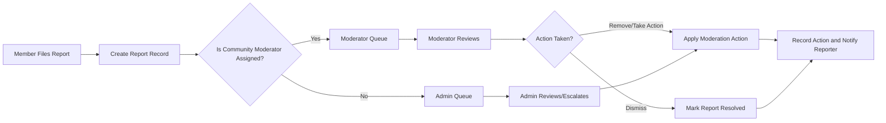
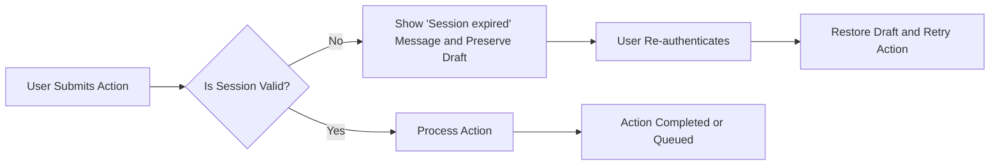

# Exception Handling and Error Recovery

## Purpose and Scope
The platform SHALL present consistent, actionable, and privacy-preserving error handling for all user-facing and moderation workflows. The document defines business-level requirements and recovery workflows for common error conditions across account lifecycle, content submission, interactions (voting/subscriptions), reporting/moderation, and system failures. All requirements that can be expressed using EARS are written in EARS format to ensure testability and unambiguous acceptance criteria.

Audience: backend developers, QA engineers, support staff, moderation leads, and product owners.

## Key Principles
- User-first messages: Error texts SHALL be concise, non-technical, localized-ready, and include a next step.
- Privacy-preserving: System SHALL avoid leaking account existence in public flows unless explicitly required by policy.
- Measurable SLAs: Business-level timeframes for retries, escalations, and confirmations SHALL be provided and testable.
- Auditability: All moderation and security-sensitive events SHALL be auditable (actor, action, reason, timestamp).
- EARS compliance: All functional and error-handling requirements use EARS constructs (WHEN/IF/THEN/WHERE/WHILE).

## Error Scenario Catalog and Requirements
Each scenario below includes user stories, EARS requirements, example messages, acceptance criteria, and recovery steps.

### 1) Content Submission Errors (posts, comments, images, links)
User stories:
- As a member, I want clear feedback when my post or image upload fails so I can correct and retry.

EARS requirements:
- WHEN a user submits a post with a missing title, THE system SHALL reject the submission and return the field error "Title is required.".
- WHEN a user submits a post whose body exceeds the configured maximum length, THE system SHALL reject the submission and indicate "Post body exceeds maximum length of {N} characters.".
- WHEN an uploaded image exceeds the business-configured file size or unsupported format, THE system SHALL reject the upload and present a message that lists allowed formats and the maximum size.
- IF a community requires moderator approval for new posts, THEN THE system SHALL accept the submission into a pending state and return "Your post is pending moderator review." to the author.

Examples of user-facing messages:
- "Title is required. Please add a short title (max 300 characters)."
- "Image upload failed: allowed formats JPG, PNG, GIF; maximum size 10 MB."
- "Your post is pending moderator review. Expect a decision within 48 hours."

Acceptance criteria:
- Submissions missing required fields are rejected with field-level messages.
- Oversized or unsupported uploads are rejected and specify allowed parameters.
- Pending posts are visible to the author with a pending status and an estimated review timeframe.

Recovery steps:
- Present inline edit controls with preserved draft data for user to correct and resubmit.
- Allow retry of image uploads with explicit guidance on resizing or format conversion.

### 2) Authentication, Session, and Account Errors
User stories:
- As a member, I want to be informed when my session expires so I can reauthenticate without losing work.

EARS requirements:
- WHEN an authenticated user's session token expires while performing an action, THEN THE system SHALL prevent the action, present "Session expired. Please sign in again." and preserve any in-flight draft for convenient retry where feasible.
- WHEN a user requests a password reset, THE system SHALL send a reset link to the verified email and the reset link SHALL expire after a business-configurable window (recommended default: 24 hours) unless stakeholders define otherwise.
- IF a user exceeds the configured failed login attempts threshold, THEN THE system SHALL temporarily lock the account, present a lockout message with recovery options, and notify the user by email.

User-facing messages examples:
- "Session expired. Sign in again to continue. Your draft has been saved." (session expiry)
- "If an account exists for that email, a password reset link has been sent." (privacy-preserving reset notice)
- "Your account is temporarily locked due to multiple failed sign-in attempts. Reset your password to regain access or wait 30 minutes." (lockout)

Acceptance criteria:
- Session expiry prompts the user to reauthenticate and preserves drafts where possible.
- Password reset emails are sent within 5 minutes in normal conditions; reset tokens expire per policy and cannot be reused.
- Account lockouts trigger a secure recovery path and are logged for audit.

Recovery steps:
- Offer immediate reauthentication and, after success, resume the interrupted action where possible.
- Provide password reset and support escalation if automated recovery fails.

### 3) Voting and Interaction Errors
User stories:
- As a user, I want to know if my vote was not applied and why (authentication, rate limit).

EARS requirements:
- WHEN a guest attempts to vote or perform member-only actions, THEN THE system SHALL deny the action with the message "Please sign in to vote." and provide a link to the sign-in page.
- WHEN a member's voting request fails due to rate limits, THEN THE system SHALL reject the action and return "You have reached the voting limit. Try again in {T} minutes." where {T} is calculated from rate-limit policies.
- IF a vote is detected as suspicious by automated fraud detection, THEN THE system SHALL withhold the vote from public tallies pending review and notify moderators if thresholds are exceeded.

Acceptance criteria:
- Guests cannot cast votes and receive the sign-in prompt.
- Rate-limit rejections provide an approximate retry time.
- Suspected vote fraud results in withheld tallies and a moderation investigation entry.

Recovery steps:
- Allow users to retry after rate limit windows or submit a support ticket if they believe they were wrongly throttled.

### 4) Reporting and Moderation Errors
User stories:
- As a member, I want confirmation that my report was received and to know if duplicates exist.

EARS requirements:
- WHEN a user files a report, THE system SHALL create a report record with reporter identity (if authenticated), target reference, reason code, and timestamp and return a confirmation with a case reference.
- IF a duplicate report for the same content and reason is filed within a configured timeframe, THEN THE system SHALL consolidate the duplicate into the existing report and inform the reporter: "A similar report already exists; it is under review.".
- WHEN a report is assigned to a moderator and it is not acted upon within the configured SLA (default: 48 hours unless stakeholders specify otherwise), THEN THE system SHALL escalate the report to an admin queue and notify moderation leads.

Mermaid diagram: report and moderation flow

Acceptance criteria:
- Reports produce a case reference and appear in the correct moderator or admin queues within 10 seconds.
- Duplicate reports are consolidated with a single case and reporters are informed.
- SLA breaches automatically escalate and generate notifications.

Recovery steps:
- Moderator actions are auditable and, if an error occurs applying an action, the system SHALL raise an automated escalation to admins with a failure reason.

### 5) System/Transient Failures and Outages
User stories:
- As a user, I need clear guidance when the system is temporarily unavailable and reassurance on retries.

EARS requirements:
- WHEN a transient system error occurs during a user-initiated action (e.g., 5xx), THEN THE system SHALL present a friendly message "Temporary service disruption. Please try again in a few minutes." and optionally queue the operation for retry if safe.
- IF the system detects broad service degradation affecting write operations, THEN THE system SHALL switch to a read-only mode for non-essential write operations and display a banner explaining the limited mode and expected resolution time.

Acceptance criteria:
- Transient errors provide immediate, actionable messages and, where safe, automatic retries are implemented.
- Major outages provide a clear banner and operational status updates.

Recovery steps:
- Implement exponential backoff client retries for idempotent operations and provide user-facing guidance for non-idempotent actions.

## Communication Templates (UI and Email)
All templates below are business-facing and localized-ready. Placeholders in curly braces are to be replaced by runtime values.

- Report confirmation (UI/email): "Thank you. Your report (Case #{caseId}) has been received and will be reviewed by moderators. Estimated first review within {slaHours} hours."
- Post pending (UI): "Your post is pending moderator review. You will be notified when the review completes."
- Verification email subject: "Verify your {serviceName} account" Body excerpt: "Click the link below to verify your email. The link expires in {hours} hours.".
- Password reset email subject: "Reset your {serviceName} password" Body excerpt: "This link expires in {hours} hours. If you did not request this, ignore this message.".
- Account suspension notice: "Your account has been suspended for reason: {reason}. You may appeal at {appealUrl}."

## Audit, Logging, and Retention (Business-Level)
EARS requirements:
- WHEN a moderator or admin takes an action affecting content visibility or user status, THE system SHALL record an immutable audit entry containing actorId, actionType, targetId, reasonCode, and timestamp.
- WHEN a security-sensitive event occurs (e.g., account lockout, failed login thresholds, suspicious vote patterns), THE system SHALL create an incident record and surface it to security operations for review.

Retention guidance (stakeholder decisions required):
- Recommended defaults (to be confirmed): moderation/audit logs retained for minimum 180 days; removed content records retained for 2 years for dispute and legal hold reasons. Stakeholders MUST finalize retention windows prior to production launch.

Access controls:
- Audit logs SHALL be accessible only to authorized roles (moderation leads, admins, security) and SHALL include a clear record of any access for accountability.

## Monitoring, KPIs, and Operational SLAs
Business-level KPIs and SLA targets:
- Report ingestion: 95% of reports appear in moderator queues within 10 seconds under normal load.
- Moderator initial response: median initial action within 24–48 hours depending on community policy (stakeholder to finalize exact SLA).
- Email delivery: 95% of verification and reset emails delivered to valid addresses within 5 minutes under normal conditions.
- Error rate: platform error-rate (5xx) alert threshold set by ops (stakeholder to confirm numeric threshold).

## Acceptance Criteria and QA Test Cases
Provide QA with EARS-based test scenarios:
- WHEN a user submits a post with no title, THEN the submission is rejected and the UI shows "Title is required.".
- WHEN a guest attempts to vote, THEN the system denies the action and displays "Please sign in to vote.".
- WHEN a report is filed, THEN a case is created and appears in moderator queue within 10 seconds.
- WHEN a user's session expires mid-draft, THEN after reauthentication the draft is restored and the action can be retried.

Each test SHALL assert the exact user-facing message, the presence of an audit record where applicable, and timing requirements where specified.

## Open Questions and Stakeholder Decisions (Prioritized)
1. Final token/session lifetimes and idle timeouts (required).
2. Exact file-size limits and allowed formats for image uploads (required if image uploads enabled).
3. Retention windows for audit logs and removed content (required for compliance).
4. Moderator SLA for initial report review and escalation thresholds (required).
5. Allowed visibility of report statuses to reporters (optional decision).

## Appendix A — Error Code & Message Catalog (examples)
- ERR_VALIDATION_TITLE_REQUIRED -> "Title is required."
- ERR_UPLOAD_SIZE_EXCEEDED -> "Image size exceeds {maxMB} MB."
- ERR_SESSION_EXPIRED -> "Session expired. Please sign in again."  
- ERR_RATE_LIMIT_VOTE -> "You have reached the voting limit. Try again in {minutes} minutes."
- INFO_REPORT_RECEIVED -> "Report received. Case #{caseId}."

## Appendix B — Additional Mermaid Diagram (Session & Recovery Flow)

## Final Notes
All requirements above are business-level and intended to be directly testable by QA. Technical implementation details (storage formats, APIs, or exact logging mechanics) are delegated to the engineering team. Stakeholders MUST answer the open questions before final sign-off to avoid rework during implementation.

