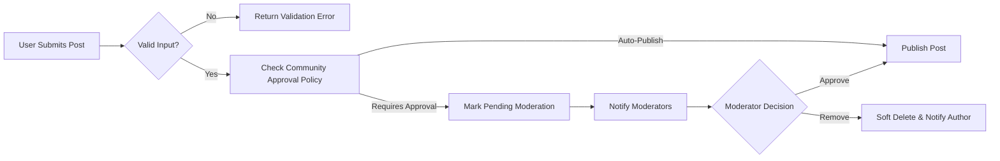
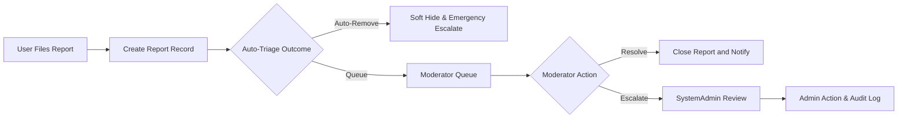
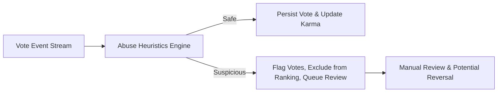

# Business Rules and Constraints — communityBbs

## 1. Executive Summary
communityBbs is a moderated, topic-based community platform that enables users to create communities, submit posts (text, link, image), participate in nested threaded discussions, vote on content, and escalate reports for moderation. These business rules and constraints define measurable, testable policies that the platform SHALL enforce to ensure safety, fairness, discoverability, and legal compliance. All thresholds below are business defaults and SHALL be configurable by system administrators.

Scope: This document covers the business-level rules for content creation, media constraints, edit and deletion policies, voting and karma calculation, subscription and notification behavior, moderation and report handling, rate limits, audit and retention, legal compliance, and acceptance criteria. Implementation details (APIs, database schemas, protocol choices) are intentionally out of scope.

Audience: product managers, backend developers, QA engineers, moderators, compliance officers.

## 2. Glossary and Actors
- visitor: Unauthenticated user who can browse public communities and read posts/comments. Cannot create content, vote, or subscribe.
- communityMember: Registered user who has verified email and can create posts, comments, vote, subscribe, and report content unless restricted.
- moderator: Community-level member granted moderation privileges for a specific community.
- systemAdmin: Platform administrator with global moderation authority, audit access, and the ability to suspend/ban accounts.
- karma: Numeric reputation score derived from votes and administrative awards/penalties.

## 3. Business Principles
- Safety First: Protect users by enabling rapid triage and escalation for policy-violating content.
- Fairness: Ensure reputation (karma) and ranking reflect genuine community contributions and include anti-abuse protections.
- Recoverability: Use soft-deletes and audit trails so removals are reversible within a retention window.
- Predictability: Publish clear, consistent rules and error messages so users understand platform behavior.
- Legal & Privacy Compliance: Retain and remove data in accordance with legal holds and user rights.

## 4. High-Level Object Lifecycles
Common object states: draft, pending_moderation, published, edited, soft_deleted, archived, hard_deleted.

EARS examples:
- WHEN a new post is submitted, THE system SHALL create the post in state "published" or "pending_moderation" depending on community settings. (Configurable)
- WHEN content is soft_deleted, THE system SHALL retain it in storage for the retention window and SHALL hide it from public feeds.

## 5. Content Creation Rules
All creation rules are EARS-formatted and include numeric defaults.

5.1 Post Types and Validation
- WHEN a communityMember creates a post, THE system SHALL accept exactly one of the following post types: "text", "link", or "image".
- WHEN a "text" post is submitted, THE system SHALL require a title between 1 and 300 characters and SHALL accept a body up to 40,000 characters. (Default limits)
- WHEN a "link" post is submitted, THE system SHALL require a title (1–300 chars) and a syntactically valid URL using http or https scheme; invalid scheme SHALL result in LINK_INVALID error.
- WHEN an "image" post is submitted, THE system SHALL require a title (1–300 chars) and at least one image meeting media constraints in Section 5.2.

5.2 Media Constraints
- WHEN images are uploaded, THE system SHALL accept only MIME types: image/jpeg, image/png, image/gif (defaults). Additional formats like webp are OPTIONAL and SHALL be configurable.
- THE system SHALL enforce a maximum single-image file size of 10 MB by default and a total post payload limit of 20 MB by default. If exceeded, THE system SHALL reject upload with error IMAGE_TOO_LARGE.
- THE system SHALL restrict maximum images per post to 10 by default.
- WHEN an image triggers an automated safety signal from moderation services, THE system SHALL mark the post pending_moderation and SHALL not display the image publicly until cleared.

5.3 Content Policy Violations (automated signals)
- IF automated content-safety services flag content as high-probability illegal/abusive, THEN THE system SHALL immediate soft-hide the content and escalate as an Emergency report to systemAdmin for human review within the Emergency SLA (Section 8).

5.4 Community-specific Policies
- WHERE a community sets "no-images" policy, THE system SHALL reject image posts to that community with message COMMUNITY_POLICY_REJECT_IMAGE.
- WHERE a community sets post-approval mode for new members, THE system SHALL place posts from those members into pending_moderation until a moderator approves.

## 6. Edit and Deletion Policies
6.1 Edit Windows
- WHEN a communityMember edits their own post, THE system SHALL allow edits within 24 hours from creation by default. Post edit window is configurable by community owners between 0 and 168 hours.
- WHEN a communityMember edits their own comment, THE system SHALL allow edits within 1 hour by default; this window is configurable up to 24 hours.
- IF an edit occurs after the initial window, THEN THE system SHALL only permit moderator/admin edits and SHALL record an explicit audit entry.

6.2 Soft Delete and Hard Delete
- WHEN a user deletes their own content, THE system SHALL perform a soft_delete that hides content from public view immediately and preserves it for 90 days by default for recovery/appeals.
- WHEN soft-deleted content is not restored within the retention window and not subject to legal hold, THEN THE system SHALL hard_delete it during scheduled hard-delete windows. Hard delete SHALL permanently remove content from primary indexes; backups purge schedules are defined in retention policy.
- WHEN systemAdmin removes content for policy reasons, THE system SHALL soft_delete content and record reason code and adminId in an immutable audit log. Appeals MAY reinstate content per appeals process.

6.3 Edit History
- WHEN any edit is performed, THE system SHALL record editorId, editTimestamp, and previous content snapshot. Edit history SHALL be available to moderators and systemAdmin and retained per audit retention rules.

## 7. Commenting and Threading
- WHEN a communityMember posts a comment, THE system SHALL accept comments up to 10,000 characters by default.
- THE system SHALL allow logical nesting depth without hard truncation for data model reasons, but the UI SHALL recommend rendering depth of 8 levels and MAY collapse beyond that. From business/enforcement perspective, there is no prohibition on deeper replies; moderation SHALL treat deeply nested threads the same as shallower ones.
- WHEN comments are paginated, THE system SHALL return top-level comments in pages of 20 by default with lazy-loading of nested replies to optimize UX.

## 8. Voting and Karma Mechanics
8.1 Voting Semantics
- WHEN a communityMember votes on content, THE system SHALL allow one effective vote per user per content item (upvote, downvote, or none). Subsequent votes replace the prior state.
- IF a visitor attempts to vote, THEN THE system SHALL reject the action with error AUTH_REQUIRED.

8.2 Karma Calculation (business defaults)
- THE system SHALL compute karma per-account as:
  - +10 for each post upvote (default)
  - -2 for each post downvote (default)
  - +2 for each comment upvote (default)
  - -1 for each comment downvote (default)
- Karma weights are platform-configurable; changes to global karma policy SHALL be logged and administratively reviewed before activation.

8.3 Abuse Detection and Vote Reversal
- IF suspicious voting patterns are detected (default heuristic: one account casts >200 votes across unrelated targets within 10 minutes, or >50 votes directed at a single author within 24 hours), THEN THE system SHALL flag the behavior, temporarily exclude implicated votes from ranking/karma, and queue accounts for manual review. Flagged votes SHALL be reversible and SHALL not permanently affect karma until cleared.
- WHEN votes are reversed, THE system SHALL recalculate affected karma and SHALL notify impacted users of the correction with a non-sensitive explanation.

## 9. Sorting and Feed Behavior (Business Definitions)
- "new": THE system SHALL order posts by creationTimestamp descending.
- "top": THE system SHALL order by score within the selected time window (24h/7d/30d/all). Time-window selection is user-provided.
- "hot": THE system SHALL use a time-decay ranking that balances score and recency; decay parameters are configurable by platform admins and SHALL be documented for transparency.
- "controversial": THE system SHALL prioritize posts with high variance between upvotes and downvotes relative to total votes.
- WHEN feed pages are requested, THE system SHALL support pagination with default page size 25 and client-requestable up to 100; server SHALL enforce a maximum page size of 100.

## 10. Subscription and Notification Rules
10.1 Subscriptions
- WHEN a communityMember subscribes to a community, THE system SHALL include that community in personalized feed aggregation and SHALL record subscriptionTimestamp.
- EDGE CASE: A user may subscribe to up to 2,000 communities; above this limit THE system SHALL require manual review to protect account behavior.

10.2 Notification Channels and Frequency
- Default user preferences: In-app immediate, Email digest hourly, Push disabled. Users SHALL be able to override per-community and per-event-type.
- Email frequency cap: default 5 email digests/day per user (configurable).
- WHEN multiple low-priority events occur within 10 minutes for one recipient, THE system SHALL aggregate into a single digest notification to reduce noise.

10.3 Notification Failures
- WHEN delivery via preferred channel fails repeatedly, THE system SHALL attempt alternative channels per user preferences and SHALL log failure attempts. Persistent failures SHALL be visible to operations.

## 11. Reporting, Moderation, Escalation and Appeals
11.1 Report Submission
- WHEN a user files a report, THE system SHALL capture reporterId (nullable for anonymous reports if allowed), targetId, targetType (post/comment), reasonCode (enumerated), optional details (max 1000 chars), and timestamp.

11.2 Triage and Thresholds
- THE system SHALL perform automated triage on incoming reports and classify severity: Low, Medium, High, Emergency using business heuristics and vendor moderation signals.
- Default escalation thresholds:
  - If content receives 3+ distinct reports within 24 hours => automatic expedited review.
  - If content receives 10+ distinct reports within 24 hours => auto-escalate to systemAdmin and apply temporary visibility restriction.

11.3 Moderator Actions and Admin Escalation
- WHEN a moderator acts (remove/warn/approve), THE system SHALL record moderatorId, actionType, reasonCode, and timestamp in an immutable audit entry.
- IF a moderator fails to act on High or Emergency reports within 24 hours, THEN THE system SHALL auto-escalate to systemAdmin.

11.4 Appeals
- WHEN content is removed by moderator or admin, THE system SHALL notify the content author with reasonCode and an appeals link. THE author SHALL be allowed to submit an appeal within 30 days. Appeals SHALL be reviewed by systemAdmin or designated appeals reviewers within 7 business days (default SLA).

11.5 Emergency Handling
- IF automated services detect content that may be illegal or life-threatening (self-harm, imminent violence, CSAM), THEN THE system SHALL immediate soft-hide content and ensure human review by systemAdmin within 4 hours (Emergency SLA).

## 12. Rate Limits and Abuse Prevention Defaults
All rate limits are defaults and SHALL be configurable by administrators.

- Posting: max 10 posts per hour per account.
- Comments: max 200 comments per hour per account.
- Votes: max 1000 votes per day per account.
- Reports: max 100 reports per day per account.
- Account creation per IP: max 10 accounts per 24 hours.
- If any account exceeds rate limits, THE system SHALL place progressive throttling on actions and SHALL notify user with RATE_LIMIT_EXCEEDED and retry-after seconds.

## 13. Legal, Privacy, and Retention Policies
13.1 Retention Defaults
- Soft-deleted content retention: 90 days (default) before eligible hard_delete.
- Audit logs (moderation actions, admin operations): retained for minimum 5 years.
- Reports: retained for minimum 2 years.
- User data subject to deletion requests: THE system SHALL begin soft-delete immediately and complete hard-delete within 30 days unless legal hold applies.

13.2 Legal Holds and Takedowns
- WHEN a legal hold or takedown is required, THE system SHALL preserve relevant content and metadata in immutable storage and SHALL suspend normal retention expiration until hold is cleared.
- WHEN a valid DMCA-style takedown is received, THEN THE system SHALL remove or disable access to the alleged infringing content pending counter-notice processes and SHALL notify affected parties per legal obligations.

13.3 Data Portability
- WHEN a verified user requests data export, THE system SHALL provide a machine-readable export of the user's posts, comments, subscriptions, and non-sensitive profile data within 30 days.

## 14. Auditability and Logging
- THE system SHALL log every moderation-related action (remove, warn, suspend), account-suspension, and administrative override with actorId, targetId, reasonCode, and timestamp.
- Audit logs SHALL be immutable and retained according to retention policy (5 years default). Access to logs SHALL be limited to authorized roles and SHALL be audited.

## 15. Error Handling and User-Facing Messages
Provide example error codes and messages for common business failures. Messages SHALL be localized by the product UI.

- AUTH_REQUIRED: "Please sign in or create an account to perform this action."
- EMAIL_UNVERIFIED: "Please verify your email to post or vote. Check your inbox for a verification link."
- POST_INVALID_FIELDS: "Your post could not be published: {field} {reason}." (e.g., "Title exceeds 300 characters")
- IMAGE_TOO_LARGE: "Image exceeds the maximum allowed size of 10 MB."
- IMAGE_INVALID_FORMAT: "Unsupported image type. Allowed types: JPEG, PNG, GIF."
- RATE_LIMIT_EXCEEDED: "You are doing that too often. Try again in {retry_after} seconds." 
- COMMUNITY_POLICY_REJECT_IMAGE: "This community does not allow images." 
- REPORT_SUBMITTED: "Thank you. Your report has been received and will be reviewed."

## 16. Performance and Operational SLAs (Business-Facing)
- Read operations (feed retrieval): 95th percentile <= 2 seconds under nominal load.
- Write operations (create post/comment/vote): 95th percentile <= 3 seconds under nominal load; user-visible reflection within 5 seconds.
- High-priority report initial human triage: within 4 hours.
- Emergency reports: human review by systemAdmin within 4 hours.
- Availability goals: Target 99.95% read availability; 99.9% write availability (business goals).

## 17. Acceptance Criteria and Example Scenarios
EARS-formatted acceptance criteria for QA teams and product owners.

- WHEN a verified user creates a text post with title of 250 chars and a body of 2,000 chars, THEN THE system SHALL publish the post and it SHALL be visible in the community feed within 3 seconds. Acceptance: post retrievable via community feed API/UI and appears in logs with created state "published".

- WHEN 3 distinct verified users report a post for harassment within 24 hours, THEN THE system SHALL mark the post for expedited review and SHALL place it in the moderator queue with priority flag. Acceptance: report aggregates show count >=3 and queued item flagged.

- WHEN a user exceeds posting limit (10 posts/hour), THEN THE system SHALL reject the 11th post with RATE_LIMIT_EXCEEDED and provide retry-after header. Acceptance: write denied and error code returned.

- WHEN automated moderation marks an image as probable illegal content, THEN THE system SHALL soft-hide the image and escalate to Emergency queue. Acceptance: image not visible publicly and emergency report visible to systemAdmin.

## 18. Mermaid Diagrams (Corrected Syntax)
### 18.1 Post Creation and Moderation Flow

### 18.2 Report Triage and Escalation

### 18.3 Voting Abuse Detection (Simplified)

## 19. Appendix
19.1 Default Thresholds & Configurable Parameters (summary table)
- Max post title length: 300 chars (configurable)
- Max post body: 40,000 chars (configurable)
- Max comment length: 10,000 chars (configurable)
- Max image size: 10 MB per image (configurable)
- Max images per post: 10 (configurable)
- Post edit window: 24 hours default (configurable)
- Comment edit window: 1 hour default (configurable)
- Soft-delete retention: 90 days default (configurable)
- Audit log retention: 5 years default (configurable)

19.2 Reason Codes (examples)
- HATE_SPEECH, HARASSMENT, SPAM, COPYRIGHT_TAKEDOWN, ILLEGAL_CONTENT, SELF_HARM, OTHER

19.3 Messaging Templates (business examples)
- Report acknowledgment email: "We received your report for '{contentSummary}'. Our moderation team will review it and follow up as needed." 
- Suspension notice: "Your account has been suspended for {duration} due to {reasonCode}. Appeal: {appealLink}."

---

End of Business Rules and Constraints — communityBbs
