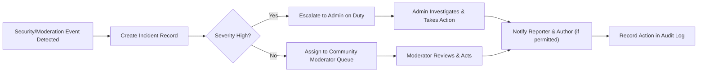
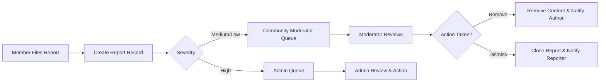

# Performance, Security and Compliance Requirements — communityPortal

## Scope and Purpose
Define business-level non-functional requirements and operational policies for communityPortal covering performance targets, security controls, privacy and compliance obligations, moderation and incident workflows, and monitoring and audit expectations. Requirements are expressed in measurable terms using EARS where applicable and include acceptance criteria for QA, security review, and operations readiness. Stakeholder-configurable defaults are provided and marked clearly.

## Audience
Product stakeholders, engineering leads, security and compliance teams, operations, QA, and moderation ops.

## Key Definitions
- Normal load: baseline production operating condition used for SLAs (default: 10,000 concurrent users; stakeholder to confirm).  
- SLA: business-facing response-time and availability targets.  
- Report severity: {"low","medium","high"} used to triage moderation; mapping defined in Reporting section.  
- KarmaEvent: auditable record representing vote effects requiring eventual reconciliation.

## 1. Executive Requirements (EARS-format)
- WHEN a user requests user-facing content (community feed page), THE system SHALL return the first page (default 20 items) within 2 seconds under normal load, WHERE "normal load" is the agreed baseline for launch.  
- WHEN a user submits a post or comment, THE system SHALL acknowledge the submission within 3 seconds and make the content visible according to community moderation rules within 5 seconds under normal load.  
- WHEN an authenticated user casts a vote, THE system SHALL update the visible tally within 2 seconds and create a persistent KarmaEvent for authoritative processing within 10 seconds.

Acceptance criteria: Each EARS requirement above must have automated tests verifying response times under defined load profiles in staging and synthetic production-like environments.

## 2. Performance and Capacity
2.1 Response-time Targets (business-level)
- Login: 95% of successful logins return in <= 2s under normal load.  
- Fetch community feed (20 items): 95% <= 2s under normal load.  
- Post creation acknowledgement: 95% <= 3s. Visibility propagation: 95% <= 5s.  
- Vote update propagation: 95% <= 2s for UI-visible counts; authoritative karma within 10s.

2.2 Throughput Targets
- Initial engineering target: support at least 1,000 writes/sec aggregate (posts + comments + votes) and 5,000 reads/sec for community/listing endpoints at target scale. (Stakeholder to confirm peak scale.)

2.3 Rate-limiting (stakeholder-configurable defaults)
- Posts per user per minute: 5 (default).  
- Comments per user per minute: 20 (default).  
- Community creations per account per 30 days: 1 (default).  
- Reports per user per day: 200 (default).  
- Excessive usage SHALL produce a user-facing rate-limit error indicating limit and retry window.

EARS example:
- WHEN a user exceeds the posting rate limit, THE system SHALL return a rate-limit error that includes the retry-after duration and log the event for abuse monitoring.

## 3. Security Requirements (business-level, EARS)
Authentication and Sessions
- WHEN a user registers, THE system SHALL require email verification before enabling content creation, voting, or reporting.
- WHEN a user authenticates, THE system SHALL establish a time-limited session token and provide a refresh mechanism; the session lifetime SHALL be configurable (recommended default: 14 days for refresh tokens, 1 hour for access tokens).
- WHEN a user requests a sensitive action (change email, delete account), THE system SHALL require re-authentication or MFA where MFA is enabled.

MFA and elevated roles
- WHERE a user is assigned admin or moderator roles, THE system SHALL require MFA for initial privileged-session establishment and recommend recurring MFA challenges for elevated actions.

Secrets and cryptography (business expectation)
- THE system SHALL store secrets and credentials using secure secret management controlled by operations; cryptographic choices (algorithms, key sizes) are engineering decisions but SHALL follow industry best practices and compliance guidance.

Account lockout and brute-force protection
- IF repeated failed authentication attempts exceed 5 failures in 15 minutes for a given account, THEN THE system SHALL apply a temporary lockout of 30 minutes and require password reset or support intervention; all lockout events SHALL be logged and available for review.

Incident detection and response (high level)
- WHEN suspicious activity is detected (credential stuffing, mass account creation, coordinated voting), THE system SHALL flag events to an automated detection queue, notify ops/security, and apply automated mitigations (rate limits, temporary hold) pending investigation.

Audit and traceability
- WHEN any moderation or administrative action occurs, THE system SHALL record an immutable audit record with actor, action, target, timestamp, and reason. Audit records SHALL be searchable by authorized roles for investigations.

## 4. Privacy and Compliance Requirements (EARS)
Data subject rights and DSARs
- WHEN an authenticated user submits a data subject access request (DSAR) for portability or deletion, THE system SHALL acknowledge receipt within 48 hours and complete the approved action within 30 calendar days, unless extended for legal reasons, in which case the system SHALL notify the requester with a reason and expected timeline.

Lawful processing and minimal data collection
- THE system SHALL collect only necessary PII for account operation (email, displayName) and SHALL present a clear privacy notice at registration describing processing, retention, and contact points for privacy requests.

Takedown and legal requests
- WHEN a valid legal takedown request targeting content is received, THE system SHALL act to restrict access to the specified content within 72 hours, record the takedown action, and notify the requesting party and the content author where permitted by law.

Cross-border data handling
- IF production data is transferred across jurisdictions, THEN THE system SHALL ensure contractual safeguards (e.g., standard contractual clauses) or local legal basis is in place prior to transfer. The legal/compliance owner SHALL maintain a registry of data flows and jurisdictions.

Breach notification
- WHEN a data breach affecting PII is confirmed, THEN THE system SHALL notify affected users and relevant authorities consistent with jurisdictional law (e.g., within 72 hours for GDPR, where required) and publish a post-incident summary to stakeholders.

Retention and deletion (business defaults)
- User-requested deletion: soft-delete with 30-day recovery window; permanent purge after 30 days unless legal hold applies.  
- Moderation logs and audit trail: retain for 2 years by default (configurable).  
- Transient caches: retain no longer than necessary and purge within 30 days unless required for investigations.

## 5. Moderation, Reporting, and Incident Workflows
5.1 Report lifecycle (EARS)
- WHEN a user files a report, THE system SHALL create a report record capturing reporter identity, target, category, free-text details, timestamp, and attach contextual content snapshot; THE system SHALL route the report to the community's moderator queue within 10 seconds.
- IF a report is labeled high severity (e.g., illegal content, imminent harm), THEN THE system SHALL escalate to admins immediately and mark the report for priority review.

5.2 Moderator SLA (business defaults)
- Moderators SHALL acknowledge new reports within 24 hours; moderators or admin SHALL resolve high-severity reports within 24 hours and medium/low within 72 hours. These timings are stakeholder-configurable.

5.3 Incident response and escalation (Mermaid)

5.4 Appeal and reinstatement
- WHEN a user appeals a moderation action, THE system SHALL open an appeal case and route it to an admin queue; THE system SHALL acknowledge the appeal within 48 hours and provide a decision timeline.

## 6. Monitoring, Metrics, and Alerting
6.1 Required metrics (business-level)
- Availability (Uptime) of core platform endpoints (login, feed, posting) — target 99.9% monthly.  
- Median and 95th percentile response times for login, feed retrieval, post creation, voting.  
- Report queue backlog and average time-to-resolution by severity.  
- Abuse detection counts (suspicious voting patterns, mass-account creation).  
- Security events: failed login rate, lockouts, MFA failures, suspicious bursts.

6.2 Alerting thresholds (recommended defaults)
- Page error rate > 1% for 5 minutes -> P1 alert.  
- Report backlog growth > 2x baseline for 1 hour -> P2 alert to moderation ops.  
- Unusual spike in failed logins (>5x baseline within 10 minutes) -> security alert.

6.3 Observability expectations
- THE system SHALL expose these metrics to authorized dashboards and maintain 90 days of high-resolution telemetry and 2 years of aggregated metrics for trend analysis.

## 7. Acceptance Criteria and QA Guidance (testable items)
- Performance: Under a pre-defined normal-load scenario, 95% of feed requests (20 items) meet <= 2s response target in staging; violators must be addressed before release.  
- Security: MFA enabled for admin/moderator accounts; verified login lockout behavior; audit log entries recorded for moderation actions.  
- Compliance: DSAR workflow tested through request lifecycle; legal takedown processed within configured time window; retention and deletion flows validated.  
- Moderation: Reports create queue entries within 10s; moderator action audit entries produced for each action.

QA test types: load/performance tests, security acceptance tests (SAST/DAST results), privacy/DSAR functional tests, moderation workflow and audit tests.

## 8. Implementation Guidance and Recommended Defaults
- Use configurable feature flags for rate-limits, SLAs, and retention policies so stakeholders can tune behavior without code changes.  
- Queue design: separate near-real-time queues (visible UI updates) and authoritative processing queues (e.g., KarmaEvent reconciliation) to balance responsiveness and eventual consistency.  
- Moderation tooling: provide bulk actions, search by user/content, and export for compliance reviews.  
- Legal processes: maintain a request registry and track jurisdictional constraints for takedowns and DSARs.

## 9. Open Questions and Stakeholder Decisions (prioritized)
1. Confirm "normal load" concurrency baseline (default 10k concurrent).  
2. Finalize karma calculation and whether votes from new/low-karma accounts are weighted or excluded.  
3. Confirm image hosting strategy and max image size/formats.  
4. Approve moderator SLA targets and escalation windows.  
5. Confirm retention windows for audit logs and content removals versus legal hold requirements.

## 10. Appendix
10.1 Retention matrix (recommended defaults)
- User soft-delete retention: 30 days.  
- Audit/moderation logs: 2 years.  
- Report records: 2 years.  
- Cached indexing data: 90 days.

10.2 Sample user-facing error messages (business templates)
- Rate limit: "You have reached the posting limit. Please try again after {retry_after} minutes."  
- Verification required: "Please verify your email to create posts and vote. Resend verification link."  
- Account lockout: "Your account has been temporarily locked due to multiple failed sign-ins. Follow password reset to recover." 

10.3 Mermaid diagram: Report-to-moderation flow

## Final checklist for stakeholder signoff
- [ ] Confirm normal-load baseline and peak projections.  
- [ ] Approve or provide final values for karma formula and vote weighting.  
- [ ] Confirm image hosting policy and media constraints.  
- [ ] Approve moderator and escalation SLAs.  
- [ ] Confirm retention policy for logs and removed content.

