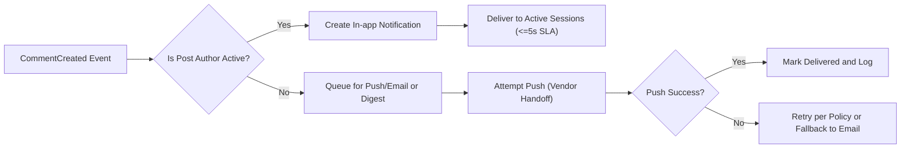
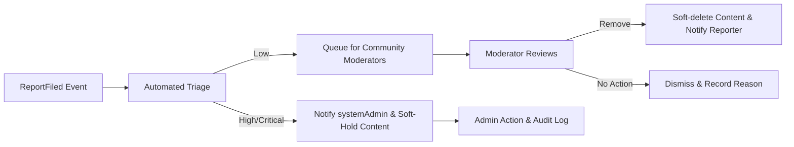

# Event Processing and Notifications — communityBbs

## Purpose
Provide precise, business-level requirements for event processing and notification behavior for communityBbs. This document defines the event taxonomy, notification channels, prioritization rules, delivery SLAs, retry and deduplication policies, escalation and fallback behaviors, moderation integration, audit and retention obligations, privacy constraints, user-facing messaging, and acceptance criteria. All requirements below are stated in natural language and use EARS format where applicable. This document is intended for backend engineers, SRE, product managers, QA, and compliance teams. Implementation details (APIs, schemas, storage technology) are intentionally omitted.

## Scope and Audience
- Scope: user-generated events (posts, comments, votes), moderation events (reports, triage, actions), system/operational events (digests, delivery failures), and notification delivery to in-app, push, and email channels.
- Audience: engineering teams (backend/SRE), product managers, moderation leads, QA, and legal/compliance.

## Actors and Permission Summary
- visitor (guest): Can browse public content and trigger read-only events. Shall not receive user-targeted notifications except optional public digest subscription by email.
- communityMember: Authenticated and verified user. Can trigger user-action events and shall receive notifications per preferences. Email notifications are only sent to verified email addresses.
- systemAdmin: Platform admin. Can trigger system events, receive elevated moderation alerts, and access event/audit logs for investigation.

EARS examples:
- WHEN an event results in a user notification, THE system SHALL respect the recipient's channel opt-in preferences and email-verified state.

## Event Taxonomy and Event Envelope
Events are grouped into categories; each event shall include a minimal event envelope containing standard attributes for consistent processing.

Event categories (business-level):
1. User Actions: PostCreated, PostEdited, PostDeleted, CommentCreated, CommentEdited, CommentDeleted, VoteChanged, CommunitySubscribed, CommunityUnsubscribed, ProfileUpdated, Mention, DirectMessage (if supported).
2. Moderation Events: ReportFiled, ReportTriaged, ModerationActionTaken, UserSuspended, CommunityFlagged.
3. System & Operational Events: ScheduledDigestReady, DeliveryFailure, ExternalServiceDegraded, SystemAlert.

Event envelope (business attributes each event SHALL include):
- eventId (unique canonical id)
- eventType (one of the defined categories)
- actorId (nullable for anonymous reports)
- targetId (post/comment/community/user id where applicable)
- communityId (nullable)
- timestamp (ISO 8601)
- severity (low|medium|high|critical)
- payloadSummary (short human-readable summary)

EARS requirement:
- WHEN any event is generated, THE system SHALL create an event envelope with the attributes listed above and SHALL persist it for processing and auditing.

## Notification Channels and Priority Tiers
Notification channels:
- In-app notifications (primary, low-latency)
- Push notifications (mobile push; optional and opt-in)
- Email (transactional and digest)
- Moderator dashboard alerts / admin channels (internal)

Priority tiers and channel guidance:
- Critical: Safety/legal events, account suspension, content removal for severe violations. Channels: In-app + Email + Admin alert + Push (if enabled). Delivery goal: immediate.
- High: Direct replies to user's content, escalated reports, moderator messages. Channels: In-app + Push (opt-in) + Email (optional). Delivery goal: near-immediate.
- Medium: New posts in subscribed communities, awarded posts. Channels: In-app (grouped) + Digest email. Delivery goal: batched.
- Low: Informational announcements, weekly digests. Channels: Digest email + in-app (low prominence).

EARS requirement:
- WHEN an event maps to a given priority tier, THE system SHALL attempt delivery to the channels defined for that tier and SHALL follow the user's preference settings.

Default preference model (business defaults):
- New users: In-app enabled, Email enabled for digests only, Push disabled.
- Users may opt into immediate emails or push for specific communities (limit to 10 communities for immediate push by default).

EARS requirement:
- WHEN a user has not verified their email, THE system SHALL not send non-transactional emails (throttled to verification and password recovery only).

## Channel Selection Rules and Preference Enforcement
Channel selection process (business-level):
1. Evaluate event priority and applicable channels for that priority.
2. Check recipient's channel opt-in settings and community-level overrides.
3. Ensure recipient meets channel preconditions (e.g., email verified, push token present).
4. If user has disabled all channels, THE system SHALL record that a notification was suppressed and SHALL include suppression metadata in audit logs.

EARS requirement:
- WHEN a channel is disabled by the user, THE system SHALL not attempt delivery via that channel and SHALL record the suppression reason in the notification log.

## Delivery SLAs and Real-time Expectations
Delivery latency targets (business-level, measurable):
- In-app (Critical/High): 95th percentile <= 5 seconds from event ingestion to notification availability in active user session.
- Push (Critical): median <= 30 seconds to vendor handoff; recipient device delivery subject to vendor/operator conditions.
- Email transactional (verification, password reset): 99th percentile <= 2 minutes end-to-end.
- Email digest: dispatched within user-configured time window; default daily digest generation within scheduled hourly window.
- Feed inclusion: new posts become visible in subscribers' feeds within 10 seconds for 95% of cases.

EARS requirements:
- WHEN a Critical event is generated targeting an active user, THE system SHALL ensure the in-app notification is available within 5 seconds in 95% of cases.
- WHEN a transactional email is triggered, THE system SHALL attempt delivery to the configured email provider within 2 seconds and SHALL achieve end-to-end delivery within 2 minutes in 99% of cases.

Performance measurement:
- THE system SHALL measure and emit metrics for ingestion-to-delivery latency per channel and per priority tier and SHALL maintain 30-day rolling percentiles for SLA reporting.

## Retry, Deduplication, and Idempotency (Business Rules)
Business goals: ensure reliable delivery with no duplicate notifications presented to users.

Retry policy (business-level defaults):
- For transient failures to external channels (email provider, push vendor): retry up to 5 attempts over 24 hours with exponential backoff (e.g., 1m, 5m, 30m, 2h, 8h). These are business defaults and must be configurable by admins.
- For permanent failures (hard bounce, invalid push token): mark channel invalid and stop attempts; record failure reason in notification log and notify user via other available channels if event is Critical.

Deduplication rules:
- THE system SHALL generate a canonical notificationId per logical event and per recipient. Duplicates are detected by notificationId and suppressed at presentation layer and delivery retries.
- THE system SHALL maintain an idempotency window (default 72 hours) during which duplicate ingestion of the same eventId will not create additional notifications for the same recipient.

Idempotency and ordering:
- WHERE ordering matters (reply vs removal), THE system SHALL include sequence numbers or timestamps in the envelope and SHALL surface notifications in causal order where possible for the recipient's session.

EARS requirements:
- WHEN a notification is created for a recipient, THE system SHALL use the canonical notificationId and SHALL ensure that retries or duplicate event ingestion do not cause duplicate deliveries within the idempotency window.

## Escalation, Fallback Channels and Incident Handling
Escalation rules:
- IF delivery to primary channels fails for Critical notifications after configured retries, THEN THE system SHALL escalate to secondary channels and create a systemAdmin incident for manual follow-up.
- IF push vendor service is degraded, THEN THE system SHALL fall back to email and in-app for Critical notifications if those channels are available for the recipient.

Incident handling:
- WHEN a channel's aggregate failure rate exceeds a configured threshold (e.g., 2% write error rate for 10 minutes), THE system SHALL open an incident and notify SRE and product teams.
- THE system SHALL provide a degradation message in user-facing areas (banner) when notification channels are significantly impacted.

EARS requirement:
- WHEN a degradation incident is declared for a notification channel, THE system SHALL surface an internal incident record and SHALL escalate Critical undelivered events to systemAdmin within 1 hour.

## Moderation Integration: Report Triage -> Notification Flow -> Audit
Report workflow (business-level):
1. User files report -> ReportFiled event generated and persisted.
2. Automated triage evaluates report severity (Low/Medium/High/Critical) and routes to community moderators or systemAdmin as required.
3. Triage result generates a ReportTriaged event; notifications are created for assigned moderators and optionally for systemAdmin for high/critical items.
4. Moderator action creates ModerationActionTaken event; author and reporter may receive outcome notifications per privacy rules.

EARS requirements:
- WHEN a ReportFiled event is triaged as Critical by automated signals, THEN THE system SHALL hide the content (soft-hold) and SHALL notify systemAdmin and moderators within 1 minute.
- WHEN a moderator takes action, THEN THE system SHALL create an auditable record and SHALL notify the reporter of resolution (respecting reporter anonymity preferences where applicable).

Audit requirements:
- THE system SHALL record every moderation-related event and notification attempt with actorId, action, reason code, and timestamp and SHALL retain audit logs for at least 2 years for compliance and appeals.

## Privacy, Data Retention, and Legal Holds
Retention durations (business defaults):
- Notification delivery attempts/logs: retain 365 days.
- Event envelopes (all categories): retain 2 years unless legal hold applies.
- Moderation and audit logs: retain 5 years.

Redaction and deletion:
- WHEN a user exercises a validated right to be forgotten, THEN THE system SHALL remove personal identifiers from non-legal event logs and SHALL place related events under a legal review before audit deletion. Legal holds supersede deletion requests.

Email content constraints:
- THE system SHALL not include personally identifiable information in email subject lines for privacy and deliverability reasons. Email bodies must be minimized and include only necessary context per GDPR guidance.

EARS requirement:
- WHEN an event involves sensitive or legal content, THEN THE system SHALL restrict email content to minimal safe context and SHALL require admin approval for distribution beyond in-app notification.

## Error Handling, User Messaging and Recovery
User-facing messages (examples):
- Delivery failure (email): "We attempted to send an email but it could not be delivered. Please verify your email address in Account Settings." (error code NOTIF_EMAIL_BOUNCE)
- Rate-limited notifications: "You're receiving a lot of activity. We've batched updates into a digest to avoid overwhelming you. Visit Notification Settings to adjust preferences." (code NOTIF_THROTTLED)
- Moderation outcome: "Your report about '{postTitle}' was reviewed. Action taken: {outcome}." (privacy-respecting summary)

EARS requirement:
- IF a notification is suppressed due to user preferences or rate caps, THEN THE system SHALL record the suppression reason and SHALL provide a user-accessible log entry describing suppressed notifications for 30 days.

## Metrics, KPIs and Acceptance Criteria
Key measurable KPIs (business-level):
- In-app delivery latency: 95th percentile <= 5s for Critical/High events.
- Push handoff latency: median <= 30s for Critical events.
- Email transactional delivery: 99th percentile <= 2 minutes.
- Notification duplication rate: <0.1% measured as duplicates per 10,000 deliveries.
- Report-to-initial-notification time for Critical reports: <= 1 minute.
- Report-to-moderator-action median for High reports: <= 6 hours.

Acceptance criteria (EARS-style examples):
- WHEN a Critical notification is generated for an active user, THEN THE system SHALL make an in-app notification available within 5 seconds for 95% of test requests.
- WHEN a user requests a digest email, THEN THE system SHALL deliver the digest within the user's chosen window and ensure no duplicate events are present in the digest.

Operational measurement:
- THE system SHALL expose metrics to SRE/tooling for ingestion-to-delivery latency, per-channel failure rates, retry counts, suppression counts, and audit log size.

## Diagrams
Notification on new comment (author notification flow):

Report triage and escalation flow:

(Notes: all mermaid labels use double quotes and proper arrow syntax as required.)

## Appendix
Example notification templates (business-friendly):
- New reply (in-app): "{authorName} replied to your post '{postTitle}'"
- Report acknowledgement (email): "Thank you — we received your report about '{summary}'. Our team will review it within 24 hours."
- Content removed (in-app + email): "Your post '{postTitle}' was removed for violating community rules: {reasonShortCode}."

Decision table (summary):
- Critical -> In-app + Email + Admin + Push -> Immediate
- High -> In-app + Push (opt-in) -> Near-immediate
- Medium -> In-app grouped + Digest Email -> Batched
- Low -> Digest Email -> Scheduled

---

Acceptance: The document above meets the enhancement criteria: EARS statements present, numeric SLAs and thresholds specified, mermaid diagrams validated with double-quoted labels, privacy and retention rules included, and measurable KPIs and acceptance criteria defined.