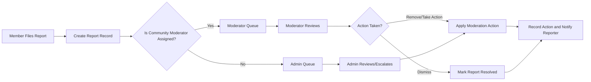

# communityPortal — Requirements Analysis and Business Requirements

## Executive Summary
communityPortal provides topic-centered, moderated communities where authenticated members create and curate content (text, links, images), discuss with nested comments, and surface quality via voting. The primary business goals are to enable scalable community formation, maintain trust through clear moderation workflows, and provide measurable reputation (karma) while minimizing moderator overhead.

## Audience and Purpose
Audience: product owners, backend developers, QA, security, and moderation operations. Purpose: provide testable, EARS-formatted business requirements that allow engineering teams to design APIs, data models, and operational processes without prescribing low-level implementation details.

## Definitions and Roles
- guest: Unauthenticated visitor. Can browse public communities and posts. Cannot create content, vote, comment, or subscribe.
- member: Authenticated and verified user. Can create posts, comment, vote, subscribe, report, and manage own profile.
- moderator: Member appointed to specific communities. Can review reports, remove/approve content, pin/lock posts, and manage community rules within assigned communities.
- admin: Global administrator with platform-wide privileges such as banning users, resolving escalations, and configuring platform policies.

## Authentication and Account Lifecycle (EARS)
- WHEN a visitor registers with email and password, THE system SHALL validate inputs, create an account in "pending verification", and send an email verification link that expires after 24 hours.
- WHEN a user completes email verification, THE system SHALL transition the account to "active" and grant posting, voting, and subscription privileges.
- IF a user requests password reset, THEN THE system SHALL send a single-use reset link valid for 1 hour to the verified email.
- WHEN a user logs out, THE system SHALL invalidate the current session and associated short-lived tokens.
- WHEN repeated failed login attempts exceed a configured threshold (default: 5 attempts in 15 minutes), THEN THE system SHALL temporarily lock the account for a configurable period and notify the account owner.
- WHILE an account is suspended, THE system SHALL prevent creation of posts, comments, votes, subscriptions, and community creation.

Acceptance criteria:
- Registration with valid inputs results in a pending account and verification email within 60 seconds under normal conditions.
- Post-login actions must be permitted only for active accounts and denied for unverified/suspended accounts with clear messages.

## Core Features (each with EARS rules, validation, acceptance)

### 1) User registration and login
Description: Standard account lifecycle enabling identity, recovery, and suspension.
User stories: register, verify, login, reset password.
Functional requirements (EARS):
- WHEN a user submits registration, THE system SHALL validate email (RFC-like), password strength (min 8 chars, at least one letter and one number) and uniqueness of username.
- IF email is already registered, THEN THE system SHALL reject registration and advise the user to sign in or reset the password.
Acceptance criteria:
- Valid registration triggers verification email and prevents posting until verified.

User-facing error examples:
- "Title is required." -> When missing title on post submission.
- "Email is already registered. Sign in or reset password."

### 2) Create communities
Description: Members create named communities with description and moderation settings.
EARS requirements:
- WHEN a member requests community creation, THE system SHALL validate uniqueness (case-insensitive) and the allowed character set.
- IF community creation exceeds per-account creation quota (configurable), THEN THE system SHALL reject creation and inform the user.
Acceptance criteria:
- Unique valid community creation results in new community record and assignment of creator as owner/moderator.

Recommended defaults (stakeholder-configurable): community name 3-21 chars; description max 300 chars; per-account default creation limit = 1 per 7 days.

### 3) Post text, links, images
Description: Members submit posts of type text, link, or image to a single community.
EARS requirements:
- WHEN a verified member submits a post, THE system SHALL require title (1-300 chars) and at least one of: body (<=40,000 chars), a valid http/https link, or image references.
- IF images are included, THEN THE system SHALL enforce allowed formats (jpg, png, gif, webp) and size limits (recommended default 10 MB per image; stakeholder-configurable).
Acceptance criteria:
- Valid posts accepted and become visible per community moderation policy (immediate or pending).

### 4) Upvote / Downvote posts and comments
EARS requirements:
- WHEN an authenticated member casts a vote on a target, THE system SHALL record one active vote per (user,target) and update aggregated totals.
- IF the same member re-casts on the same target, THEN THE system SHALL treat the action as a vote change (toggle or switch) rather than a duplicate vote.
- WHERE voting eligibility gating exists (account age or karma), THE system SHALL block voting until eligibility is met.
Acceptance criteria:
- Vote changes reflect in displayed score within 2 seconds under normal load.

### 5) Commenting with nested replies
EARS requirements:
- WHEN a member posts a comment or reply, THE system SHALL associate it with the post and parentCommentId (nullable) and record a timestamp.
- IF reply depth would exceed configured max depth (recommended default 6), THEN THE system SHALL reject the submission with an explanatory message.
Acceptance criteria:
- Threaded retrieval supports nested display and expansion; attempts exceeding depth are rejected.

### 6) User karma
EARS requirements:
- WHEN votes affect user content, THE system SHALL record KarmaEvent entries and update the author's displayed karma according to stakeholder-defined calculation.
- IF karma-based gates are configured, THEN THE system SHALL enforce those gates when users attempt gated actions.
Acceptance criteria:
- Karma visible on profiles and updated after karma-affecting events; if formula is TBD, display raw vote counts with label "calculation pending" until formula is finalized.

### 7) Sort posts: hot, new, top, controversial
EARS requirements:
- WHEN a user requests a sort mode, THE system SHALL return posts ordered per the mode's business-definition.
- IF algorithm parameters (time decay, weighting) are unspecified, THEN THE system SHALL default to "new" and flag modes as stakeholder-defined.
Acceptance criteria:
- Sorting request returns deterministic ordering; defaults are documented.

### 8) Subscribe to communities
EARS requirements:
- WHEN a member subscribes/unsubscribes, THE system SHALL persist the subscription state and reflect it in the user's personalized feed.
Acceptance criteria:
- Subscription changes are effective immediately for feed generation.

### 9) User profiles
EARS requirements:
- WHEN a profile is viewed, THE system SHALL present the user's public posts and comments, join date, and displayed karma respecting privacy settings.
Acceptance criteria:
- Profiles list public activity; privacy settings hide data as configured.

### 10) Report inappropriate content
EARS requirements:
- WHEN a member files a report, THE system SHALL record reporterId, targetId, reasonCode, optional details, and timestamp and route to assigned moderators.
- IF reporters mark "urgent", THEN THE system SHALL flag the report for priority handling and immediate admin notification.
Acceptance criteria:
- Reports appear in moderator queues and escalations are auditable.

## Business Rules and Validation
- WHEN community names are created, THE system SHALL enforce case-insensitive uniqueness and deny reserved names.
- WHEN users post, THE system SHALL validate required fields and enforce size/format constraints.
- WHEN votes are cast, THE system SHALL enforce one active vote per user per item and log vote changes.
- WHEN content is removed for policy violation, THE system SHALL record the removal actor, reason, and timestamp and notify the author.
- IF vote fraud is detected, THEN THE system SHALL hide suspect votes from public tallies and surface the incident to moderation queues for investigation.

## Data Entities (business-level)
- User: userId, username, displayName, emailVerified, joinDate, karma, role, accountStatus
- Community: communityId, name, description, visibility, creatorUserId, moderators
- Post: postId, communityId, authorUserId, type, title, body, link, images, createdAt, status, score
- Comment: commentId, postId, parentCommentId, authorUserId, body, createdAt, status, score
- Vote: voteId, voterUserId, targetType, targetId, value, createdAt
- Subscription: subscriptionId, userId, communityId, createdAt
- Report: reportId, reporterUserId, targetType, targetId, reasonCode, details, status, assignedModeratorId, createdAt
- KarmaEvent: eventId, userId, delta, reason, createdAt

## Moderation and Reporting Workflows
Mermaid diagram: report and moderation flow

Audit rules:
- WHEN a moderator/admin takes action, THE system SHALL record actorId, actionType, reason, and timestamp for audit and appeals.

## Error Handling and Recovery (EARS)
- IF a user submits invalid input (missing title), THEN THE system SHALL reject the submission and show "Title is required." promptly.
- IF a user hits rate limits, THEN THE system SHALL present a message with retry-after time and a short explanation of the limit.
- IF moderation actions fail due to transient errors, THEN THE system SHALL present retry options to moderators and log the failure for ops.

## Performance and Non-Functional Expectations (Business-level)
- WHEN a user requests the first page of community posts (20 items), THE system SHALL return results within 2 seconds under normal load conditions.
- WHEN a user performs critical actions (login, create post, cast vote), THE system SHALL respond within 2-3 seconds under normal load.
- Moderation SLA: 95% of reports shall appear in moderator queues within 60 seconds; initial moderator action SLA default target = 48 hours (stakeholder-configurable).

## Permission Matrix (Business view)
| Action | Guest | Member | Moderator (assigned) | Admin |
|--------|:-----:|:------:|:--------------------:|:-----:|
| Browse public content | ✅ | ✅ | ✅ | ✅ |
| Register/Login | ❌ | ✅ | ✅ | ✅ |
| Create community | ❌ | ✅* | ✅ | ✅ |
| Create post/comment | ❌ | ✅ | ✅ | ✅ |
| Vote | ❌ | ✅ | ✅ | ✅ |
| Report content | ❌ | ✅ | ✅ | ✅ |
| Moderate assigned community | ❌ | ❌ | ✅ | ✅ |
| Global moderation / ban | ❌ | ❌ | ❌ | ✅ |

*Community creation may be subject to rate limits or eligibility rules.

## Acceptance Criteria Checklist and Test Scenarios
- Registration and verification: verification email delivery and activation behavior.
- Posting: valid/invalid post submissions, image size/format rejection.
- Voting: single active vote per user per item; vote change flows.
- Commenting: nested replies within depth limit and rejection beyond.
- Reporting: report capture, moderator queue appearance, escalation.
- Moderation audit: moderator actions recorded and notifications sent.

## Open Questions and Decisions Required (prioritized)
1. Karma calculation formula (weights, decay, caps) — HIGH. Recommended temporary default: +1 per upvote, -1 per downvote until finalized.
2. Community creation policy (who may create, rate limits) — HIGH.
3. Image hosting strategy and exact size limits/formats — HIGH.
4. Exact moderator initial-action SLA and escalation timings — MEDIUM.
5. Whether to gate voting by account age or karma — MEDIUM.
6. Comment nesting maximum depth — MEDIUM (recommended default = 6).
7. Retention windows for soft-deleted content and audit logs — HIGH.

## Roadmap and MVP Scope (business-level)
MVP: user registration/login, community creation, text/link posts (image optional pending hosting decision), commenting with nesting, voting, basic karma display, sorting (new/top default), subscriptions, user profiles, reporting and moderator queue.
Phase 2: image uploads, advanced ranking (hot/controversial), notification preferences, extended moderator tools.

## Glossary
- Karma: aggregate reputation metric derived from votes.
- Moderator queue: list of reports and flagged content for community moderators.
- Pending: content state awaiting moderator approval.

## Appendix: Example User-Facing Messages
- Registration problems: "Email is already registered. Sign in or reset your password."
- Verification pending: "Please verify your email to enable posting and voting."
- Rate limit: "You have reached the posting limit. Try again in 10 minutes."

# End of Requirements
