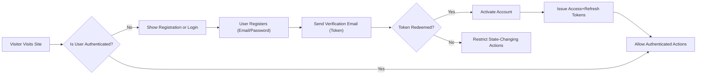
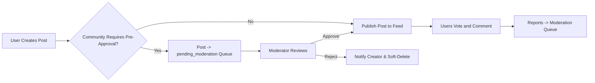
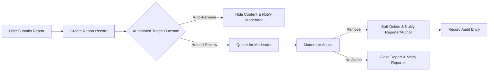

# Requirements Analysis Report — communityBbs (Reddit-like Community Platform)

## 1 Executive Summary and Scope
communityBbs enables topic-based communities where verified users create and curate posts (text, link, image), discuss via nested comments, and surface quality content through voting. The platform requires robust authentication, community governance, content moderation and reporting workflows, reputation (karma), subscription/notification systems, and auditability. All statements below are business-level requirements intended to be translated into technical designs by the engineering team.

Scope: registration and login, community lifecycle, post/comment lifecycle, voting and karma, sorting and feeds (hot/new/top/controversial), subscriptions, user profiles, reporting and moderation, event processing and notifications, data lifecycle and retention, SLAs and acceptance criteria.

Audience: product owners, backend developers, QA engineers, security, operations, and compliance.

## 2 Actors and Permission Matrix
Actors and business capabilities:
- visitor: browse public communities and read posts/comments only.
- communityMember: authenticated, verified user; create communities (subject to policy), posts, comments, votes, subscriptions, and reports; edit/delete own content within edit windows.
- moderator: community-scoped role appointed by communityOwner; review community reports, approve pending posts, perform moderator actions (remove, lock, warn) within community scope.
- systemAdmin: platform administrator; escalate moderator decisions, suspend/ban accounts, perform legal hard-deletes, and access immutable audit logs.

Permission matrix (summary):
- Browse public content: visitor, communityMember, moderator, systemAdmin
- Create community: communityMember (subject to creation rules), systemAdmin
- Create post/comment: communityMember, moderator, systemAdmin
- Vote: communityMember, moderator, systemAdmin
- Subscribe: communityMember, moderator, systemAdmin
- Report content: communityMember, moderator, systemAdmin
- Moderate reports: moderator, systemAdmin
- Suspend/ban/hard-delete: systemAdmin only

## 3 Authentication & Session Requirements
- WHEN a user registers, THE system SHALL create an account in state "registered_unverified" and SHALL issue a verification email containing a single-use token that expires after 7 days.
- WHEN the verification token is redeemed, THE system SHALL transition the account to "registered_verified" and SHALL permit state-changing actions (create community, post, comment, vote, report).
- WHEN a user authenticates successfully, THE system SHALL issue an access token and a refresh token. THE access token SHALL contain userId and role, SHALL expire by default after 15 minutes, and THE refresh token SHALL expire by default after 14 days; both lifetimes SHALL be configurable by systemAdmin.
- IF a user requests password reset, THEN THE system SHALL send a one-time reset token valid for 24 hours to the verified email address and SHALL invalidate used tokens.
- WHEN a user revokes sessions or changes their password, THE system SHALL invalidate all refresh tokens for that user within 60 seconds.
- WHEN a suspended or banned user attempts to authenticate, THE system SHALL deny authentication and SHALL return an error code (ACCOUNT_SUSPENDED or ACCOUNT_BANNED) with appeal instructions where appropriate.
- THE system SHALL provide endpoints for session listing and revocation for users to view and revoke active sessions.

## 4 Functional Requirements (EARS)
All functional requirements below are written to be testable and measurable.

### 4.1 Community Management
- WHEN a communityMember requests community creation, THE system SHALL validate community name uniqueness (case-insensitive), length 3–21 characters, and allowed characters (alphanumeric, hyphen, underscore); invalid requests SHALL return COMMUNITY_NAME_INVALID or COMMUNITY_NAME_TAKEN.
- WHEN a community is created, THE system SHALL assign the creator as communityOwner and SHALL allow the owner to appoint up to 10 moderators initially.
- WHEN a community is set to "private" or "restricted", THE system SHALL require membership approval before non-members may view or post.
- IF a community receives sustained policy violations or high-severity reports, THEN THE system SHALL allow systemAdmin to set community state to "quarantined" restricting new posting until cleared.

### 4.2 Post Management (text, link, image)
- WHEN a communityMember creates a post, THE system SHALL require a title with maxLength 300 characters.
- WHEN a "text" post is created, THE system SHALL accept body length <= 40,000 characters.
- WHEN a "link" post is created, THE system SHALL validate URL scheme is http or https; invalid URLs SHALL be rejected with LINK_INVALID.
- WHEN an "image" post is created, THE system SHALL accept images with MIME types {"image/jpeg","image/png","image/gif"}, maximum single-file size 10 MB, maximum images per post 10, and maximum total image payload per post 20 MB; non-conforming uploads SHALL be rejected with IMAGE_INVALID or IMAGE_TOO_LARGE.
- IF community settings require pre-approval, THEN new posts SHALL be inserted into a moderation queue in state "pending_moderation" until approved by a moderator.
- WHEN a post is published, THE system SHALL index it for feed inclusion and SHALL notify subscribers per their notification preferences.

### 4.3 Commenting and Nested Replies
- WHEN a communityMember submits a comment, THE system SHALL accept content length <= 10,000 characters and SHALL record parentCommentId when provided.
- WHEN nested replies are created, THE system SHALL permit logical nesting without a hard data-model limit but SHALL recommend a client rendering depth (default 8); clients MAY flatten deeper replies for readability.
- IF a comment accumulates reports exceeding the configured threshold (default 5 within 48 hours), THEN THE system SHALL mark the comment as "under_review" and MAY hide it pending moderator action.

### 4.4 Voting and Karma
- WHEN a communityMember votes on a post or comment, THE system SHALL ensure one active vote per (user, content) pair; subsequent votes SHALL update existing vote state.
- WHEN a vote is recorded, THE system SHALL update the visible vote counts for that content for the actor immediately and SHALL enqueue score recalculation for ranking services.
- THE system SHALL compute karma using default weights: postUpvote +10, postDownvote -5, commentUpvote +2, commentDownvote -1. THE weights SHALL be configurable by systemAdmin.
- IF coordinated voting manipulation is detected (business rule examples: >500 votes/day from one account, suspicious reciprocal voting between small clusters), THEN THE system SHALL quarantine implicated votes and flag accounts for investigation.

### 4.5 Sorting and Feed Requirements
- WHEN a user requests a feed, THE system SHALL support sorting modes: "new" (creation timestamp desc), "top" (score desc within a time window), "hot" (time-decayed score algorithm), and "controversial" (high disagreement metric). THE default page size SHALL be 25; clients may request up to 100 items per page.
- WHEN "top" is requested with timeWindow ∈ {"day","week","month","all"}, THE system SHALL restrict the considered votes and posts to that window.
- THE "hot" algorithm parameters SHALL be documented and tunable; systemAdmin SHALL be able to adjust decay and weighting coefficients.

### 4.6 Subscriptions and Notifications
- WHEN a user subscribes to a community, THE system SHALL add the community to the user's subscription list and SHALL include new posts in the user's personalized feed.
- WHEN notifications are enabled for email, THE system SHALL batch email digests to at most 5 per day per user by default; users SHALL be able to configure frequency (immediate/hourly/daily/weekly).
- IF a user unsubscribes, THEN notification delivery for that community SHALL cease within 5 minutes and personalized recommendations SHALL deprioritize the community.

### 4.7 User Profiles
- WHEN a profile is viewed, THE system SHALL display public posts and comments, cumulative karma, counts for posts and comments, and subscription list as permitted by privacy settings.
- WHEN the profile owner views their own profile, THE system SHALL display private moderation notes and pending appeals visible only to that owner and systemAdmin.

### 4.8 Reporting and Moderation
- WHEN a communityMember files a report, THE system SHALL capture reporterId, targetId, reasonCode ∈ {"spam","harassment","illegal","copyright","other"}, optional explanation <=1000 characters, and timestamp.
- IF a content item receives reportCount >= configuredThreshold (default 5) within timeWindow 48 hours, THEN THE system SHALL flag the item for expedited review and MAY hide it pending moderator decision.
- WHEN a moderator or systemAdmin takes action on a report, THE system SHALL record the action, actingModeratorId, reasonCode, and timestamp into an immutable audit log and SHALL notify the reporter of the non-sensitive resolution outcome.

## 5 Business Rules & Constraints
- Content limits: title ≤300 chars, text post ≤40,000 chars, comment ≤10,000 chars.
- Media rules: allowed image MIME types {JPEG,PNG,GIF}; max per-image 10 MB; max images per post 10; max total image payload per post 20 MB.
- Edit windows: posts editable by author for 24 hours; comments editable for 1 hour; moderators/admins may edit later with audit record.
- Deletion behavior: soft-delete hides content from public view and preserves it for retentionPeriod default 30 days; hard-delete occurs after retention expiry or per legal instruction.
- Rate limits (defaults): posts 10/hour/user; comments 200/day/user; votes 100/hour/user. Exceeding limits SHALL trigger RATE_LIMIT_EXCEEDED with cooldown information.
- Fraud detection: examples of suspicious activity include >500 votes/day from a single account or tight reciprocal vote clusters; detected patterns SHALL quarantine votes and trigger manual review.

## 6 Data Lifecycle, Retention, and Compliance
- WHEN a user requests account deletion, THE system SHALL transition the account to soft-deleted and schedule hard deletion after 30 days unless legal hold is present.
- WHEN content is soft-deleted, THE system SHALL retain content and metadata for audit and appeals for retentionPeriod default 30 days.
- Audit trails for moderation/admin actions SHALL be immutable and retained for at least 2 years; retention durations SHALL be configurable per jurisdictional requirements.
- WHEN a valid DMCA or legal takedown is received, THE system SHALL remove or hide the content, SHALL notify the content owner, and SHALL record takedown evidence for compliance.

## 7 Event Processing & Notification Semantics
- Event taxonomy: PostCreated, CommentCreated, VoteChanged, ReportFiled, ReportTriaged, ModerationActionTaken, UserSuspended, CommunityQuarantined.
- WHEN a high-priority event occurs (e.g., emergency report), THE system SHALL deliver in-app notifications to target moderators within 5 seconds for 95% of normal-load cases and SHALL attempt email/push delivery per preferences.
- Notification aggregation: THE system SHALL aggregate related low-priority events into digest notifications to reduce noise; aggregation windows SHALL be configurable.
- Retry and dedup: THE system SHALL retry transient delivery failures with exponential backoff up to 5 attempts and SHALL deduplicate on canonical event id to avoid duplicate user deliveries.

## 8 Non-Functional Requirements (SLAs & KPIs)
- Read latency SLA: community feed page (25 items) SHALL be returned within 2 seconds for 95% of requests under normal load.
- Write latency SLA: create post/comment SHALL acknowledge within 3 seconds for 95% of requests under normal load.
- Availability goals: read APIs 99.95% monthly; write APIs 99.9% monthly (business targets).
- Moderation SLA: high-priority reports SHALL receive initial human review within 4 business hours; normal reports within 48 hours.
- Monitoring metrics: signup rate, MAU, DAU, posts/day, comments/day, reports/day, moderation queue depth, false-positive automated moderation rate.

## 9 Acceptance Criteria & Example Scenarios
- Registration: WHEN a new user registers with valid email and redeems verification token, THEN account SHALL be active and able to post. Acceptance: verification email delivered within 60 seconds 95% of trials; account active within 2 minutes.
- Posting: WHEN a verified user submits a valid text post, THEN post SHALL be published or queued per community rules; Acceptance: post appears in feed and is retrievable via feed query.
- Voting: WHEN a user upvotes a post, THEN post score and author karma SHALL be updated per configured weights and shall be visible in UI within 5 seconds to the voting user.
- Reporting escalation: WHEN 5 distinct users report a post for harassment within 48 hours, THEN the post SHALL be flagged for expedited review and SHALL be visible in moderator expedited queue.

## 10 Diagrams
Registration/Login flow:

Post lifecycle:

Report & moderation flow:

## 11 Glossary
- communityMember: verified user with posting privileges
- moderator: community-appointed reviewer
- systemAdmin: platform administrator
- karma: reputation metric derived from votes
- soft-delete: reversible removal from public view retained for appeals

## 12 Appendix and Configurable Defaults
- Title maxLength: 300
- Text post maxLength: 40,000
- Comment maxLength: 10,000
- Max images per post: 10
- Max image size (per file): 10 MB
- Max total image payload per post: 20 MB
- Default edit window: posts 24 hours; comments 1 hour
- Default soft-delete retention: 30 days
- Audit log retention: 2 years
- Default rate limits: posts 10/hour; comments 200/day; votes 100/hour

