# Prisma Markdown

> Generated by [`prisma-markdown`](https://github.com/samchon/prisma-markdown)

- [Systematic](#systematic)
- [Actors](#actors)
- [Sales](#sales)
- [Carts](#carts)
- [Orders](#orders)
- [Inventory](#inventory)
- [Coupons](#coupons)
- [Financial](#financial)
- [Inquiries](#inquiries)
- [Articles](#articles)
- [default](#default)

## Systematic

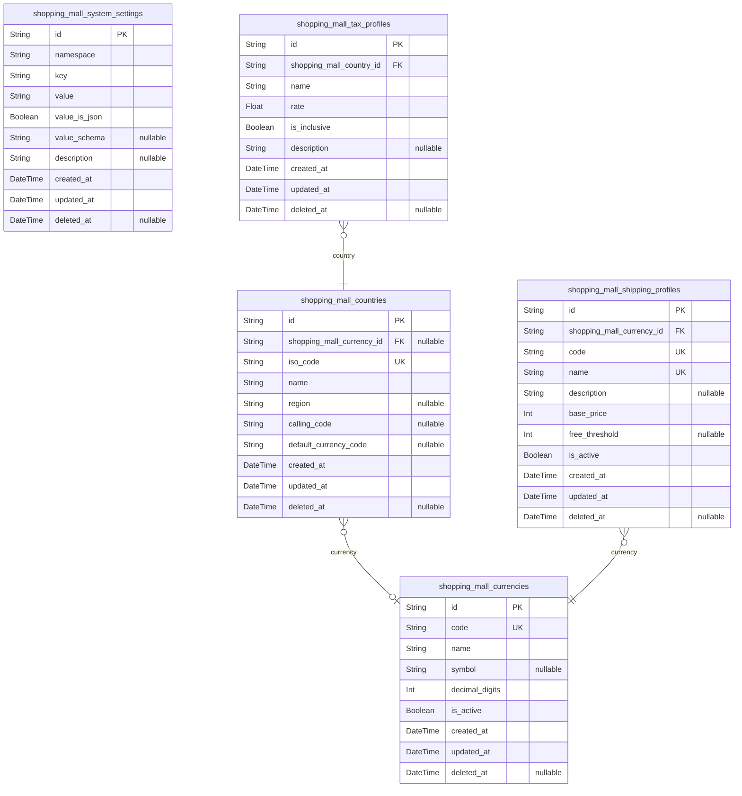
```mermaid
erDiagram
"shopping_mall_system_settings" {
  String id PK
  String namespace
  String key
  String value
  Boolean value_is_json
  String value_schema "nullable"
  String description "nullable"
  DateTime created_at
  DateTime updated_at
  DateTime deleted_at "nullable"
}
"shopping_mall_currencies" {
  String id PK
  String code UK
  String name
  String symbol "nullable"
  Int decimal_digits
  Boolean is_active
  DateTime created_at
  DateTime updated_at
  DateTime deleted_at "nullable"
}
"shopping_mall_countries" {
  String id PK
  String shopping_mall_currency_id FK "nullable"
  String iso_code UK
  String name
  String region "nullable"
  String calling_code "nullable"
  String default_currency_code "nullable"
  DateTime created_at
  DateTime updated_at
  DateTime deleted_at "nullable"
}
"shopping_mall_shipping_profiles" {
  String id PK
  String shopping_mall_currency_id FK
  String code UK
  String name UK
  String description "nullable"
  Int base_price
  Int free_threshold "nullable"
  Boolean is_active
  DateTime created_at
  DateTime updated_at
  DateTime deleted_at "nullable"
}
"shopping_mall_tax_profiles" {
  String id PK
  String shopping_mall_country_id FK
  String name
  Float rate
  Boolean is_inclusive
  String description "nullable"
  DateTime created_at
  DateTime updated_at
  DateTime deleted_at "nullable"
}
"shopping_mall_countries" }o--o| "shopping_mall_currencies" : currency
"shopping_mall_shipping_profiles" }o--|| "shopping_mall_currencies" : currency
"shopping_mall_tax_profiles" }o--|| "shopping_mall_countries" : country
```

### `shopping_mall_system_settings`

Platform-wide configuration key/value store. Stores namespaced settings
used by administrative and operational flows (feature flags, thresholds,
toggles). Added explicit value format metadata to make structured
settings (JSON) and schema versioning explicit for safe evolution and
validation.

Properties as follows:

- `id`: Primary Key.
- `namespace`
  > Logical namespace for the setting (e.g., "shopping", "payments",
  > "notifications").
- `key`: Setting key within the namespace (unique per namespace).
- `value`
  > Serialized setting value (string). For structured content the
  > `value_is_json` flag indicates JSON payload.
- `value_is_json`
  > Indicates whether `value` contains JSON serialized text (true) or plain
  > string (false). Allows safe parsing by consumers during migration to Json
  > column.
- `value_schema`
  > Optional schema identifier or version for structured JSON config (e.g.,
  > "featureFlag:v1"). Useful for validation and migration tooling.
- `description`: Human-friendly description and operational guidance for the setting.
- `created_at`: Record creation timestamp.
- `updated_at`: Record last modification timestamp.
- `deleted_at`: Soft-delete timestamp; null when active.

### `shopping_mall_currencies`

Currency reference table. Contains ISO currency code, display name,
symbol, decimal precision and active flag. Serves as authoritative
currency metadata for pricing, formatting, and settlement flows.

Properties as follows:

- `id`: Primary Key.
- `code`: ISO 4217 currency code (e.g., "USD", "KRW"). Unique business key.
- `name`: Human-readable currency name (e.g., "US Dollar").
- `symbol`: Display symbol for the currency (e.g., "$", "₩").
- `decimal_digits`
  > Number of decimal digits used for the currency (e.g., 2 for USD, 0 for
  > JPY).
- `is_active`: Whether this currency is currently enabled for use on the platform.
- `created_at`: Record creation timestamp.
- `updated_at`: Last update timestamp.
- `deleted_at`: Soft-delete timestamp; null when active.

### `shopping_mall_countries`

Country and region metadata used by shipping, tax, and localization
subsystems. Added nullable FK to shopping_mall_currencies to avoid drift
between string codes and canonical currency records while preserving
`default_currency_code` for compatibility.

Properties as follows:

- `id`: Primary Key.
- `shopping_mall_currency_id`
  > Optional canonical currency reference for the country. {@link
  > shopping_mall_currencies.id}. Nullable for countries without assigned
  > currency in platform configuration.
- `iso_code`: ISO 3166-1 alpha-2 country code (e.g., "KR", "US"). Unique key.
- `name`: Country display name.
- `region`: Geographic region grouping (e.g., "Asia", "Europe").
- `calling_code`: International dialing code (E.164 prefix, e.g., "+82").
- `default_currency_code`
  > Optional ISO currency code commonly used in the country. Retained for
  > backward compatibility; prefer shopping_mall_currency_id when present.
- `created_at`: Record creation timestamp.
- `updated_at`: Last update timestamp.
- `deleted_at`: Soft-delete timestamp; null when active.

### `shopping_mall_shipping_profiles`

Shipping profile definitions that describe carrier rules, base pricing,
and optional free-shipping thresholds. Added explicit currency FK and
store monetary amounts in minor units (int) to avoid floating point
rounding and multi-currency ambiguity.

Properties as follows:

- `id`: Primary Key.
- `shopping_mall_currency_id`: Currency used for profile amounts. [shopping_mall_currencies.id](#shopping_mall_currencies).
- `code`
  > Unique machine-friendly code for the shipping profile (e.g.,
  > "standard_domestic").
- `name`: Human-friendly shipping profile name.
- `description`: Operational notes describing the profile behavior and carrier mapping.
- `base_price`
  > Base shipping price in minor currency units (e.g., cents) to avoid
  > floating-point rounding issues.
- `free_threshold`
  > Order subtotal threshold in minor currency units above which shipping is
  > free for this profile; null if not applicable.
- `is_active`: Whether the shipping profile is currently available for selection.
- `created_at`: Record creation timestamp.
- `updated_at`: Last update timestamp.
- `deleted_at`: Soft-delete timestamp; null when active.

### `shopping_mall_tax_profiles`

Tax profile definitions used to compute taxes during checkout. Each tax
profile is associated with a country (shopping_mall_countries) and
defines a percentage rate and whether the tax is inclusive. Profiles are
versionable by creating new records (historical snapshots handled by
separate components if needed).

Properties as follows:

- `id`: Primary Key.
- `shopping_mall_country_id`: Referenced country's {@\link shopping_mall_countries.id}.
- `name`: Tax profile name (e.g., "VAT 10% - Domestic").
- `rate`: Tax rate expressed as a percentage (e.g., 10.0 for 10%).
- `is_inclusive`: Whether tax is price-inclusive (true) or added on top of price (false).
- `description`: Operational notes and jurisdictional guidance for the tax profile.
- `created_at`: Record creation timestamp.
- `updated_at`: Last update timestamp.
- `deleted_at`: Soft-delete timestamp; null when active.

## Actors

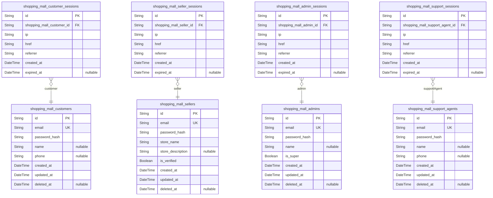
```mermaid
erDiagram
"shopping_mall_customers" {
  String id PK
  String email UK
  String password_hash
  String name "nullable"
  String phone "nullable"
  DateTime created_at
  DateTime updated_at
  DateTime deleted_at "nullable"
}
"shopping_mall_customer_sessions" {
  String id PK
  String shopping_mall_customer_id FK
  String ip
  String href
  String referrer
  DateTime created_at
  DateTime expired_at "nullable"
}
"shopping_mall_sellers" {
  String id PK
  String email UK
  String password_hash
  String store_name
  String store_description "nullable"
  Boolean is_verified
  DateTime created_at
  DateTime updated_at
  DateTime deleted_at "nullable"
}
"shopping_mall_seller_sessions" {
  String id PK
  String shopping_mall_seller_id FK
  String ip
  String href
  String referrer
  DateTime created_at
  DateTime expired_at "nullable"
}
"shopping_mall_admins" {
  String id PK
  String email UK
  String password_hash
  String name "nullable"
  Boolean is_super
  DateTime created_at
  DateTime updated_at
  DateTime deleted_at "nullable"
}
"shopping_mall_admin_sessions" {
  String id PK
  String shopping_mall_admin_id FK
  String ip
  String href
  String referrer
  DateTime created_at
  DateTime expired_at "nullable"
}
"shopping_mall_support_agents" {
  String id PK
  String email UK
  String password_hash
  String name "nullable"
  String phone "nullable"
  DateTime created_at
  DateTime updated_at
  DateTime deleted_at "nullable"
}
"shopping_mall_support_sessions" {
  String id PK
  String shopping_mall_support_agent_id FK
  String ip
  String href
  String referrer
  DateTime created_at
  DateTime expired_at "nullable"
}
"shopping_mall_customer_sessions" }o--|| "shopping_mall_customers" : customer
"shopping_mall_seller_sessions" }o--|| "shopping_mall_sellers" : seller
"shopping_mall_admin_sessions" }o--|| "shopping_mall_admins" : admin
"shopping_mall_support_sessions" }o--|| "shopping_mall_support_agents" : supportAgent
```

### `shopping_mall_customers`

Customer accounts: authentication credentials, basic profile, and
lifecycle timestamps. Customers are platform shoppers who own carts,
orders, wishlists, and reviews. This table stores PII and authentication
data; password hashes only, never plain passwords. Related entities:
[shopping_mall_carts](#shopping_mall_carts), [shopping_mall_orders](#shopping_mall_orders), {@link
shopping_mall_wishlists}.

Properties as follows:

- `id`: Primary Key.
- `email`: Customer's verified email address used for login and notifications.
- `password_hash`
  > Hash of the customer's password (bcrypt/argon2). Never store plaintext
  > passwords.
- `name`: Full name or display name of the customer.
- `phone`: Phone number in E.164 format when provided by the customer.
- `created_at`: Record creation timestamp.
- `updated_at`: Record last update timestamp.
- `deleted_at`: Soft-delete timestamp. Null if active.

### `shopping_mall_customer_sessions`

Session records for customers. Stores per-session connection context for
auditing and session management. Fields are strictly limited to the
session table pattern: actor FK, ip, href, referrer, created_at,
expired_at.

Properties as follows:

- `id`: Primary Key.
- `shopping_mall_customer_id`: Belonged customer's [shopping_mall_customers.id](#shopping_mall_customers).
- `ip`: IP address of the session origin.
- `href`: Connection URL or origin href associated with the session.
- `referrer`: Referrer URL for the session.
- `created_at`: Session creation timestamp.
- `expired_at`: Optional expiration timestamp for the session.

### `shopping_mall_sellers`

Seller accounts representing marketplace merchants. Stores
authentication, basic storefront metadata, verification flag, and
lifecycle timestamps. Sellers manage products, SKUs, inventory, and
orders for their catalog. Related entities: {@link
shopping_mall_products}, [shopping_mall_payouts](#shopping_mall_payouts).

Properties as follows:

- `id`: Primary Key.
- `email`: Seller account email used for login and notifications.
- `password_hash`: Hash of the seller's password.
- `store_name`: Public name of the seller's store.
- `store_description`: Optional seller-provided store description.
- `is_verified`: Indicator whether seller onboarding verification is complete.
- `created_at`: Record creation timestamp.
- `updated_at`: Record last update timestamp.
- `deleted_at`: Soft-delete timestamp for seller accounts.

### `shopping_mall_seller_sessions`

Session records for sellers. Conforms exactly to the Session Table
Pattern: includes actor FK, ip, href, referrer, created_at, expired_at.
Used for seller session auditing and per-device session management.

Properties as follows:

- `id`: Primary Key.
- `shopping_mall_seller_id`: Belonged seller's [shopping_mall_sellers.id](#shopping_mall_sellers).
- `ip`: IP address for the seller session.
- `href`: Connection URL or origin for the session.
- `referrer`: Referrer URL for the session.
- `created_at`: Session creation timestamp.
- `expired_at`: Optional expiration timestamp for the session.

### `shopping_mall_admins`

Platform administrators and their authentication profile. Admins manage
moderation, refunds, and platform settings. High-privilege roles require
audit trails and can be flagged as super_admin for emergency overrides.

Properties as follows:

- `id`: Primary Key.
- `email`: Admin login email address.
- `password_hash`: Hash of the admin's password.
- `name`: Admin full name for audit and display.
- `is_super`: Flag identifying super_admins who can perform emergency overrides.
- `created_at`: Record creation timestamp.
- `updated_at`: Record last update timestamp.
- `deleted_at`: Soft-delete timestamp for admin accounts.

### `shopping_mall_admin_sessions`

Session records for admin accounts. Conforms to the required session
table field set for auditing admin sessions and ensuring per-device
session revocation.

Properties as follows:

- `id`: Primary Key.
- `shopping_mall_admin_id`: Belonged admin's [shopping_mall_admins.id](#shopping_mall_admins).
- `ip`: IP address of the admin session.
- `href`: Connection URL associated with the admin session.
- `referrer`: Referrer URL for the session.
- `created_at`: Session creation timestamp.
- `expired_at`: Optional expiration timestamp for the admin session.

### `shopping_mall_support_agents`

Support agent accounts (business-operator) used for customer-support
workflows and limited impersonation operations. Actions by support agents
must be auditable. Support agents have distinct accounts separate from
admins and sellers.

Properties as follows:

- `id`: Primary Key.
- `email`: Support agent email used for login and audit identification.
- `password_hash`: Hash of the support agent's password.
- `name`: Agent display name for audit records.
- `phone`: Optional contact phone number for the agent.
- `created_at`: Record creation timestamp.
- `updated_at`: Record last update timestamp.
- `deleted_at`: Soft-delete timestamp for support agent accounts.

### `shopping_mall_support_sessions`

Session table for support agents. Records per-device/session connection
metadata for auditing impersonation and support actions. Adheres to the
exact session table pattern for the Actors component.

Properties as follows:

- `id`: Primary Key.
- `shopping_mall_support_agent_id`: Belonged support agent's [shopping_mall_support_agents.id](#shopping_mall_support_agents).
- `ip`: Session origin IP address.
- `href`: Connection URL or originating href.
- `referrer`: Referrer URL for the session.
- `created_at`: Session creation timestamp.
- `expired_at`: Optional expiry timestamp for the session.

## Sales

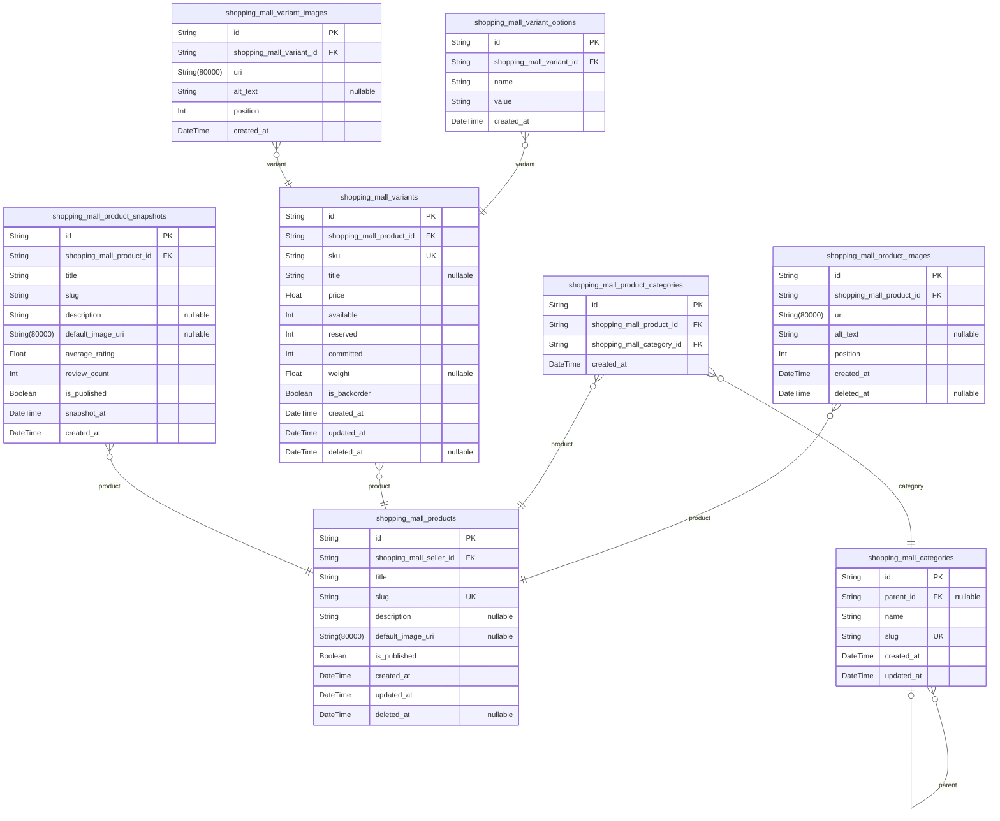
```mermaid
erDiagram
"shopping_mall_products" {
  String id PK
  String shopping_mall_seller_id FK
  String title
  String slug UK
  String description "nullable"
  String(80000) default_image_uri "nullable"
  Boolean is_published
  DateTime created_at
  DateTime updated_at
  DateTime deleted_at "nullable"
}
"shopping_mall_product_images" {
  String id PK
  String shopping_mall_product_id FK
  String(80000) uri
  String alt_text "nullable"
  Int position
  DateTime created_at
  DateTime deleted_at "nullable"
}
"shopping_mall_categories" {
  String id PK
  String parent_id FK "nullable"
  String name
  String slug UK
  DateTime created_at
  DateTime updated_at
}
"shopping_mall_product_categories" {
  String id PK
  String shopping_mall_product_id FK
  String shopping_mall_category_id FK
  DateTime created_at
}
"shopping_mall_variants" {
  String id PK
  String shopping_mall_product_id FK
  String sku UK
  String title "nullable"
  Float price
  Int available
  Int reserved
  Int committed
  Float weight "nullable"
  Boolean is_backorder
  DateTime created_at
  DateTime updated_at
  DateTime deleted_at "nullable"
}
"shopping_mall_variant_options" {
  String id PK
  String shopping_mall_variant_id FK
  String name
  String value
  DateTime created_at
}
"shopping_mall_variant_images" {
  String id PK
  String shopping_mall_variant_id FK
  String(80000) uri
  String alt_text "nullable"
  Int position
  DateTime created_at
}
"shopping_mall_product_snapshots" {
  String id PK
  String shopping_mall_product_id FK
  String title
  String slug
  String description "nullable"
  String(80000) default_image_uri "nullable"
  Float average_rating
  Int review_count
  Boolean is_published
  DateTime snapshot_at
  DateTime created_at
}
"shopping_mall_product_images" }o--|| "shopping_mall_products" : product
"shopping_mall_categories" }o--o| "shopping_mall_categories" : parent
"shopping_mall_product_categories" }o--|| "shopping_mall_products" : product
"shopping_mall_product_categories" }o--|| "shopping_mall_categories" : category
"shopping_mall_variants" }o--|| "shopping_mall_products" : product
"shopping_mall_variant_options" }o--|| "shopping_mall_variants" : variant
"shopping_mall_variant_images" }o--|| "shopping_mall_variants" : variant
"shopping_mall_product_snapshots" }o--|| "shopping_mall_products" : product
```

### `shopping_mall_products`

Product container representing a seller-owned catalog item. Removed
derived aggregate fields (average_rating, review_count) to avoid storing
calculated metrics in the primary business table. Aggregate metrics are
provided by a materialized view (mv_shopping_mall_product_ratings).
Product remains the canonical product metadata store and links to seller
and snapshots.

Properties as follows:

- `id`: Primary Key.
- `shopping_mall_seller_id`: Owning seller reference. [shopping_mall_sellers.id](#shopping_mall_sellers).
- `title`: Human-readable product title used in listings and search.
- `slug`: Unique URL-friendly product slug.
- `description`: Long-form product description for detail pages.
- `default_image_uri`: Canonical product image URI used as thumbnail.
- `is_published`: Whether the product is visible to customers.
- `created_at`: Record creation time.
- `updated_at`: Last update time.
- `deleted_at`: Soft-delete timestamp; null when active.

### `shopping_mall_product_images`

Product-level media assets. Each image references a product and provides
ordering and accessibility metadata.

Properties as follows:

- `id`: Primary Key.
- `shopping_mall_product_id`: Referenced product. [shopping_mall_products.id](#shopping_mall_products).
- `uri`: Image resource URI.
- `alt_text`: Alternative text for accessibility.
- `position`: Display order; lower values shown first.
- `created_at`: Creation time.
- `deleted_at`: Soft-delete timestamp for the image entry.

### `shopping_mall_categories`

Hierarchical product taxonomy used for navigation and faceted search.
Parent relationship supports nested categories.

Properties as follows:

- `id`: Primary Key.
- `parent_id`
  > Parent category reference. [shopping_mall_categories.id](#shopping_mall_categories). Nullable
  > for root categories.
- `name`: Category display name.
- `slug`: Unique slug for category URLs.
- `created_at`: Creation timestamp.
- `updated_at`: Last modification timestamp.

### `shopping_mall_product_categories`

Junction table linking products and categories (many-to-many). Ensures
unique associations per product/category pair.

Properties as follows:

- `id`: Primary Key.
- `shopping_mall_product_id`: Product reference. [shopping_mall_products.id](#shopping_mall_products).
- `shopping_mall_category_id`: Category reference. [shopping_mall_categories.id](#shopping_mall_categories).
- `created_at`: Association creation time.

### `shopping_mall_variants`

SKU (variant) entities representing sellable units with independent price
and inventory. Added explicit inventory counters
(available/reserved/committed) as canonical low-latency fields. The
transactional inventory log (shopping_mall_inventory_transactions) and
reservation table remain the audit and reservation sources; these
counters are the fast-access snapshot used by storefront and availability
checks.

Properties as follows:

- `id`: Primary Key.
- `shopping_mall_product_id`: Parent product reference. [shopping_mall_products.id](#shopping_mall_products).
- `sku`: Platform-unique SKU code.
- `title`: Variant display title (e.g., 'Red / L').
- `price`: Current price for this variant.
- `available`
  > Units currently available for sale (not reserved/committed). This is the
  > canonical availability counter used by storefront queries.
- `reserved`
  > Quantity currently reserved (checkout holds) for this variant.
  > Reservation lifecycle maintained in shopping_mall_inventory_reservations;
  > this counter is a snapshot to speed availability checks.
- `committed`
  > Quantity permanently committed to paid orders (not yet shipped). Used for
  > settlement and reconciliation calculations.
- `weight`: Optional weight for shipping calculations.
- `is_backorder`: Flag indicating whether backorders are allowed.
- `created_at`: Creation timestamp.
- `updated_at`: Last modification timestamp.
- `deleted_at`: Soft-delete timestamp.

### `shopping_mall_variant_options`

Normalized key/value option records for variant attributes (color, size,
material). Prevents repeating groups and supports flexible attribute
sets.

Properties as follows:

- `id`: Primary Key.
- `shopping_mall_variant_id`: Referenced variant. [shopping_mall_variants.id](#shopping_mall_variants).
- `name`: Option name (e.g., 'color').
- `value`: Option value (e.g., 'red').
- `created_at`: Creation timestamp.

### `shopping_mall_variant_images`

Variant-specific image resources for SKUs that require dedicated imagery
(color swatches, texture).

Properties as follows:

- `id`: Primary Key.
- `shopping_mall_variant_id`: Referenced variant. [shopping_mall_variants.id](#shopping_mall_variants).
- `uri`: Image resource URI.
- `alt_text`: Alternative text.
- `position`: Display order position.
- `created_at`: Creation timestamp.

### `shopping_mall_product_snapshots`

Append-only snapshots of product state for audit, historical
price/attribute queries, and rollbacks. Each snapshot records product
fields at snapshot time.

Properties as follows:

- `id`: Primary Key.
- `shopping_mall_product_id`: Referenced product. [shopping_mall_products.id](#shopping_mall_products).
- `title`: Product title at snapshot time.
- `slug`: Product slug at snapshot time.
- `description`: Product description at snapshot time.
- `default_image_uri`: Product default image URI at snapshot time.
- `average_rating`: Average rating at snapshot time.
- `review_count`: Review count at snapshot time.
- `is_published`: Published flag at snapshot time.
- `snapshot_at`: When this snapshot was taken.
- `created_at`: Record creation time.

## Carts

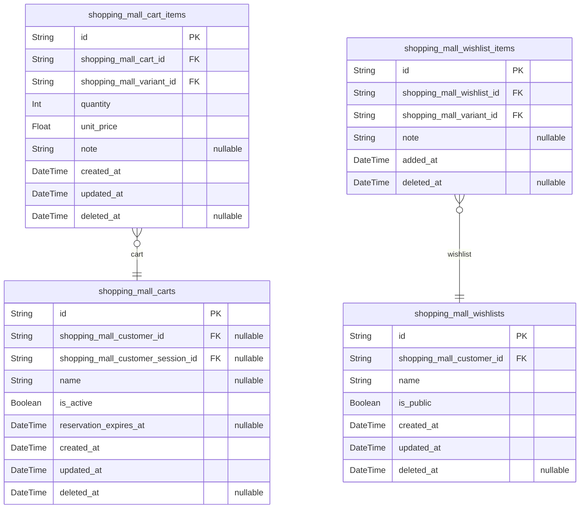
```mermaid
erDiagram
"shopping_mall_carts" {
  String id PK
  String shopping_mall_customer_id FK "nullable"
  String shopping_mall_customer_session_id FK "nullable"
  String name "nullable"
  Boolean is_active
  DateTime reservation_expires_at "nullable"
  DateTime created_at
  DateTime updated_at
  DateTime deleted_at "nullable"
}
"shopping_mall_cart_items" {
  String id PK
  String shopping_mall_cart_id FK
  String shopping_mall_variant_id FK
  Int quantity
  Float unit_price
  String note "nullable"
  DateTime created_at
  DateTime updated_at
  DateTime deleted_at "nullable"
}
"shopping_mall_wishlists" {
  String id PK
  String shopping_mall_customer_id FK
  String name
  Boolean is_public
  DateTime created_at
  DateTime updated_at
  DateTime deleted_at "nullable"
}
"shopping_mall_wishlist_items" {
  String id PK
  String shopping_mall_wishlist_id FK
  String shopping_mall_variant_id FK
  String note "nullable"
  DateTime added_at
  DateTime deleted_at "nullable"
}
"shopping_mall_cart_items" }o--|| "shopping_mall_carts" : cart
"shopping_mall_wishlist_items" }o--|| "shopping_mall_wishlists" : wishlist
```

### `shopping_mall_carts`

Persistent shopping carts. Represents a customer's active or saved cart
or a guest session cart. Links optionally to a {@link
shopping_mall_customers.id} for authenticated users or to {@link
shopping_mall_customer_sessions.id} for guest/cart-session scenarios.
Used to support cart merging, device sync, and checkout preparation.
Contains soft-delete and temporal fields for audit and retention.

Properties as follows:

- `id`: Primary Key.
- `shopping_mall_customer_id`
  > Owning customer's [shopping_mall_customers.id](#shopping_mall_customers). Nullable to allow
  > guest carts tied to a session.
- `shopping_mall_customer_session_id`
  > Guest session reference [shopping_mall_customer_sessions.id](#shopping_mall_customer_sessions).
  > Nullable when cart is owned by an authenticated customer.
- `name`: Optional human-friendly name for a saved cart (e.g., 'Holiday gifts').
- `is_active`: Flag indicating whether the cart is active (not archived).
- `reservation_expires_at`
  > Optional reservation expiry timestamp when cart holds reservations
  > (seller opt-in scenarios).
- `created_at`: Creation timestamp.
- `updated_at`: Last update timestamp.
- `deleted_at`: Soft-delete timestamp.

### `shopping_mall_cart_items`

Line items contained in a shopping cart. Each item references a specific
SKU variant ([shopping_mall_variants.id](#shopping_mall_variants)) and records desired
quantity and the captured unit price at time of add-to-cart for
price-consistency checks during checkout. Managed through the parent cart
lifecycle. (MODIFIED: unit_price type changed to double to align with SKU
price representation.)

Properties as follows:

- `id`: Primary Key.
- `shopping_mall_cart_id`: Parent cart reference. [shopping_mall_carts.id](#shopping_mall_carts).
- `shopping_mall_variant_id`: Referenced SKU variant [shopping_mall_variants.id](#shopping_mall_variants).
- `quantity`
  > Requested quantity for this cart line. Must be >= 1; business logic
  > enforces non-negative quantities.
- `unit_price`
  > Unit price captured when the item was added to cart for price consistency
  > checks. Changed to double precision to align with SKU price
  > representation (shopping_mall_variants.price).
- `note`
  > Optional buyer note for this cart line (stored for UX, not for business
  > logic).
- `created_at`: Item added timestamp.
- `updated_at`: Last modification timestamp for this cart item.
- `deleted_at`: Soft-delete timestamp for item removal history.

### `shopping_mall_wishlists`

Named wishlists owned by authenticated customers. Wishlists are
first-class user-managed collections intended for saving product variants
for future consideration. Each wishlist belongs to a {@link
shopping_mall_customers.id} and supports soft-delete and privacy control.

Properties as follows:

- `id`: Primary Key.
- `shopping_mall_customer_id`
  > Owning customer's [shopping_mall_customers.id](#shopping_mall_customers). Wishlists require
  > an account and therefore this FK is non-nullable.
- `name`: Wishlist name (e.g., 'Favorites', 'Birthday Ideas'). Unique per customer.
- `is_public`
  > Whether wishlist is visible to others. Business may restrict sharing
  > based on policy.
- `created_at`: Creation timestamp.
- `updated_at`: Last update timestamp.
- `deleted_at`: Soft-delete timestamp.

### `shopping_mall_wishlist_items`

Entries for items stored in a wishlist. References a wishlist ({@link
shopping_mall_wishlists.id}) and a variant ({@link
shopping_mall_variants.id}). Duplicate entries are prevented by a
composite unique constraint.

Properties as follows:

- `id`: Primary Key.
- `shopping_mall_wishlist_id`: Parent wishlist reference [shopping_mall_wishlists.id](#shopping_mall_wishlists).
- `shopping_mall_variant_id`: Referenced SKU variant [shopping_mall_variants.id](#shopping_mall_variants).
- `note`: Optional note attached by the user for this wishlist entry.
- `added_at`: Timestamp when the item was added to the wishlist.
- `deleted_at`: Soft-delete timestamp for removed wishlist entries.

## Orders

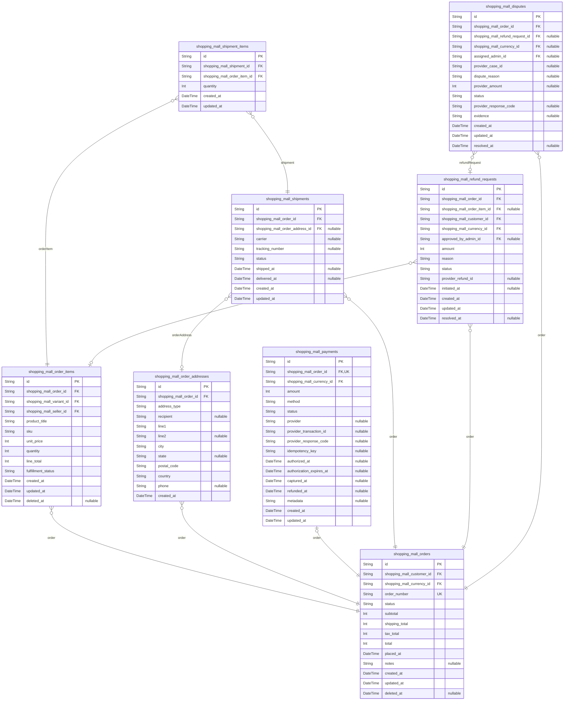
```mermaid
erDiagram
"shopping_mall_orders" {
  String id PK
  String shopping_mall_customer_id FK
  String shopping_mall_currency_id FK
  String order_number UK
  String status
  Int subtotal
  Int shipping_total
  Int tax_total
  Int total
  DateTime placed_at
  String notes "nullable"
  DateTime created_at
  DateTime updated_at
  DateTime deleted_at "nullable"
}
"shopping_mall_order_items" {
  String id PK
  String shopping_mall_order_id FK
  String shopping_mall_variant_id FK
  String shopping_mall_seller_id FK
  String product_title
  String sku
  Int unit_price
  Int quantity
  Int line_total
  String fulfillment_status
  DateTime created_at
  DateTime updated_at
  DateTime deleted_at "nullable"
}
"shopping_mall_order_addresses" {
  String id PK
  String shopping_mall_order_id FK
  String address_type
  String recipient "nullable"
  String line1
  String line2 "nullable"
  String city
  String state "nullable"
  String postal_code
  String country
  String phone "nullable"
  DateTime created_at
}
"shopping_mall_payments" {
  String id PK
  String shopping_mall_order_id FK,UK
  String shopping_mall_currency_id FK
  Int amount
  String method
  String status
  String provider "nullable"
  String provider_transaction_id "nullable"
  String provider_response_code "nullable"
  String idempotency_key "nullable"
  DateTime authorized_at "nullable"
  DateTime authorization_expires_at "nullable"
  DateTime captured_at "nullable"
  DateTime refunded_at "nullable"
  String metadata "nullable"
  DateTime created_at
  DateTime updated_at
}
"shopping_mall_shipments" {
  String id PK
  String shopping_mall_order_id FK
  String shopping_mall_order_address_id FK "nullable"
  String carrier "nullable"
  String tracking_number "nullable"
  String status
  DateTime shipped_at "nullable"
  DateTime delivered_at "nullable"
  DateTime created_at
  DateTime updated_at
}
"shopping_mall_shipment_items" {
  String id PK
  String shopping_mall_shipment_id FK
  String shopping_mall_order_item_id FK
  Int quantity
  DateTime created_at
  DateTime updated_at
}
"shopping_mall_refund_requests" {
  String id PK
  String shopping_mall_order_id FK
  String shopping_mall_order_item_id FK "nullable"
  String shopping_mall_customer_id FK
  String shopping_mall_currency_id FK
  String approved_by_admin_id FK "nullable"
  Int amount
  String reason
  String status
  String provider_refund_id "nullable"
  DateTime initiated_at "nullable"
  DateTime created_at
  DateTime updated_at
  DateTime resolved_at "nullable"
}
"shopping_mall_disputes" {
  String id PK
  String shopping_mall_order_id FK
  String shopping_mall_refund_request_id FK "nullable"
  String shopping_mall_currency_id FK "nullable"
  String assigned_admin_id FK "nullable"
  String provider_case_id "nullable"
  String dispute_reason "nullable"
  Int provider_amount "nullable"
  String status
  String provider_response_code "nullable"
  String evidence "nullable"
  DateTime created_at
  DateTime updated_at
  DateTime resolved_at "nullable"
}
"shopping_mall_order_items" }o--|| "shopping_mall_orders" : order
"shopping_mall_order_addresses" }o--|| "shopping_mall_orders" : order
"shopping_mall_payments" |o--|| "shopping_mall_orders" : order
"shopping_mall_shipments" }o--|| "shopping_mall_orders" : order
"shopping_mall_shipments" }o--o| "shopping_mall_order_addresses" : orderAddress
"shopping_mall_shipment_items" }o--|| "shopping_mall_shipments" : shipment
"shopping_mall_shipment_items" }o--|| "shopping_mall_order_items" : orderItem
"shopping_mall_refund_requests" }o--|| "shopping_mall_orders" : order
"shopping_mall_refund_requests" }o--o| "shopping_mall_order_items" : orderItem
"shopping_mall_disputes" }o--|| "shopping_mall_orders" : order
"shopping_mall_disputes" }o--o| "shopping_mall_refund_requests" : refundRequest
```

### `shopping_mall_orders`

Order header capturing financial totals, lifecycle status and references
to customer. Monetary fields stored in smallest currency unit (integer)
and explicit currency reference for reconciliation. Preserves placed_at
and temporal audit fields. References [shopping_mall_customers.id](#shopping_mall_customers)
and [shopping_mall_currencies.id](#shopping_mall_currencies).

Properties as follows:

- `id`: Primary Key.
- `shopping_mall_customer_id`: Purchasing customer's [shopping_mall_customers.id](#shopping_mall_customers).
- `shopping_mall_currency_id`: Order currency reference. [shopping_mall_currencies.id](#shopping_mall_currencies).
- `order_number`: Business-facing order number (unique).
- `status`
  > Order lifecycle status
  > (pending/authorized/paid/processing/shipped/delivered/cancelled/refunded/disputed).
- `subtotal`
  > Sum of line prices before shipping, tax, and discounts, stored in
  > smallest currency unit (e.g., cents).
- `shipping_total`: Total shipping charge for the order in smallest currency unit.
- `tax_total`: Total tax amount for the order in smallest currency unit.
- `total`: Gross order total charged to the customer in smallest currency unit.
- `placed_at`: Timestamp when the order was placed.
- `notes`: Optional order-level notes or instructions.
- `created_at`: Record creation time.
- `updated_at`: Record last update time.
- `deleted_at`: Soft-delete timestamp.

### `shopping_mall_order_items`

Order line items capturing SKU snapshot, quantities and per-line monetary
values in smallest currency unit for accurate refunds and reconciliation.
References variant and seller and belongs to an order. Kept as subsidiary
entity managed through order lifecycle.

Properties as follows:

- `id`: Primary Key.
- `shopping_mall_order_id`: Parent order. [shopping_mall_orders.id](#shopping_mall_orders).
- `shopping_mall_variant_id`: Referenced SKU variant. [shopping_mall_variants.id](#shopping_mall_variants).
- `shopping_mall_seller_id`: Owning seller of the SKU. [shopping_mall_sellers.id](#shopping_mall_sellers).
- `product_title`: Snapshot of the product title at time of order.
- `sku`: SKU code snapshot.
- `unit_price`: Unit price at time of ordering in smallest currency unit.
- `quantity`: Quantity ordered for this line.
- `line_total`
  > Computed line total (unit_price * quantity minus discounts) in smallest
  > currency unit.
- `fulfillment_status`: Per-line fulfillment status (pending/processing/shipped/etc.).
- `created_at`: Creation timestamp.
- `updated_at`: Last update timestamp.
- `deleted_at`: Soft-delete timestamp.

### `shopping_mall_order_addresses`

Immutable snapshots of shipping or billing addresses for orders. Each
record preserves the address state at the time of order placement. Use
for audit and dispute evidence. Related: [shopping_mall_orders](#shopping_mall_orders).

Properties as follows:

- `id`: Primary Key.
- `shopping_mall_order_id`: Associated order. [shopping_mall_orders.id](#shopping_mall_orders).
- `address_type`: Type of address: 'shipping' or 'billing'.
- `recipient`: Recipient name snapshot.
- `line1`: Address line 1 snapshot.
- `line2`: Address line 2 snapshot (optional).
- `city`: City snapshot.
- `state`: State/region snapshot.
- `postal_code`: Postal code snapshot.
- `country`: Country code (ISO 3166-1 alpha-2) snapshot.
- `phone`: Contact phone snapshot.
- `created_at`: Snapshot creation time.

### `shopping_mall_payments`

Payment records linked to orders. Amount stored in smallest currency unit
(int) and explicit currency reference included. Extended lifecycle
metadata (authorization and capture timestamps), idempotency and provider
response fields are included to support retries, reconciliation and
dispute handling.

Properties as follows:

- `id`: Primary Key.
- `shopping_mall_order_id`: Linked order. [shopping_mall_orders.id](#shopping_mall_orders).
- `shopping_mall_currency_id`: Currency for this payment. [shopping_mall_currencies.id](#shopping_mall_currencies).
- `amount`: Amount charged in transaction currency stored in smallest currency unit.
- `method`: Payment method identifier (credit_card, paypal, etc.).
- `status`: Payment status (pending/authorized/captured/failed/refunded).
- `provider`: External payment provider name.
- `provider_transaction_id`: Provider transaction id for reconciliation.
- `provider_response_code`: Provider response or reason code for the last attempt.
- `idempotency_key`: Idempotency key used for provider requests to prevent duplicates.
- `authorized_at`: When authorization was granted (if applicable).
- `authorization_expires_at`: Authorization expiry timestamp (provider/merchant window).
- `captured_at`: When funds were captured.
- `refunded_at`: When refund was completed for this payment, if applicable.
- `metadata`: Opaque provider metadata or JSON string for reconciliation.
- `created_at`: Payment creation time.
- `updated_at`: Payment update time.

### `shopping_mall_shipments`

Shipment records for order fulfillment. Added link to immutable order
address snapshot to preserve audit evidence of shipped-to address. Keeps
carrier, tracking, and per-shipment timestamps.

Properties as follows:

- `id`: Primary Key.
- `shopping_mall_order_id`: Order associated with this shipment. [shopping_mall_orders.id](#shopping_mall_orders).
- `shopping_mall_order_address_id`
  > Immutable order address snapshot used for this shipment (shipping
  > address). [shopping_mall_order_addresses.id](#shopping_mall_order_addresses).
- `carrier`: Carrier name (e.g., UPS, DHL).
- `tracking_number`: Carrier tracking number.
- `status`: Shipment status (pending/shipped/in_transit/delivered/exception).
- `shipped_at`: Timestamp when carrier accepted shipment.
- `delivered_at`: Timestamp when carrier reported delivery.
- `created_at`: Shipment creation time.
- `updated_at`: Shipment last update time.

### `shopping_mall_shipment_items`

Junction table linking shipments to order items. Records which order
items are included in a shipment and the shipped quantity. Related:
[shopping_mall_shipments](#shopping_mall_shipments), [shopping_mall_order_items](#shopping_mall_order_items).

Properties as follows:

- `id`: Primary Key.
- `shopping_mall_shipment_id`: Parent shipment. [shopping_mall_shipments.id](#shopping_mall_shipments).
- `shopping_mall_order_item_id`: Linked order item. [shopping_mall_order_items.id](#shopping_mall_order_items).
- `quantity`: Quantity of the order item included in this shipment.
- `created_at`: Creation timestamp.
- `updated_at`: Last update timestamp.

### `shopping_mall_refund_requests`

Refund request lifecycle records initiated by customers or support.
Amount in smallest currency unit and currency explicit. Tracks approver
metadata and provider initiation timestamps to support SLA and
reconciliation.

Properties as follows:

- `id`: Primary Key.
- `shopping_mall_order_id`: Order for which refund is requested. [shopping_mall_orders.id](#shopping_mall_orders).
- `shopping_mall_order_item_id`
  > Optional specific order item being refunded. {@link
  > shopping_mall_order_items.id}.
- `shopping_mall_customer_id`: Customer who requested the refund. [shopping_mall_customers.id](#shopping_mall_customers).
- `shopping_mall_currency_id`: Currency of the refund amount. [shopping_mall_currencies.id](#shopping_mall_currencies).
- `approved_by_admin_id`
  > Admin who approved the refund (nullable until approval). {@link
  > shopping_mall_admins.id}.
- `amount`: Requested refund amount in smallest currency unit.
- `reason`: Customer-provided reason for the refund request.
- `status`: Refund workflow status (pending/approved/rejected/completed/failed).
- `provider_refund_id`: External provider refund id once initiated.
- `initiated_at`: When refund was initiated to the provider.
- `created_at`: Request creation time.
- `updated_at`: Last update time.
- `resolved_at`: Time when refund request was resolved.

### `shopping_mall_disputes`

Dispute records from payment providers or customers. Added currency,
provider amount and assigned admin to aid reconciliation and case
ownership. Stores evidence references and resolution lifecycle metadata.

Properties as follows:

- `id`: Primary Key.
- `shopping_mall_order_id`: Order under dispute. [shopping_mall_orders.id](#shopping_mall_orders).
- `shopping_mall_refund_request_id`: Optional linked refund request. [shopping_mall_refund_requests.id](#shopping_mall_refund_requests).
- `shopping_mall_currency_id`: Currency relevant to dispute amounts. [shopping_mall_currencies.id](#shopping_mall_currencies).
- `assigned_admin_id`: Admin assigned to manage the dispute. [shopping_mall_admins.id](#shopping_mall_admins).
- `provider_case_id`: External provider dispute/case id.
- `dispute_reason`: Short description of the dispute reason.
- `provider_amount`: Monetary amount reported by provider in smallest currency unit (nullable).
- `status`: Dispute status (open/responded/closed/won/lost).
- `provider_response_code`: Provider response or resolution code for dispute lifecycle events.
- `evidence`: Reference or JSON blob describing evidence links for dispute resolution.
- `created_at`: Dispute creation time.
- `updated_at`: Dispute last update time.
- `resolved_at`: Time dispute was resolved.

## Inventory

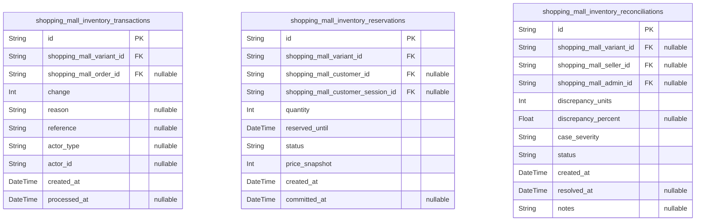
```mermaid
erDiagram
"shopping_mall_inventory_transactions" {
  String id PK
  String shopping_mall_variant_id FK
  String shopping_mall_order_id FK "nullable"
  Int change
  String reason "nullable"
  String reference "nullable"
  String actor_type "nullable"
  String actor_id "nullable"
  DateTime created_at
  DateTime processed_at "nullable"
}
"shopping_mall_inventory_reservations" {
  String id PK
  String shopping_mall_variant_id FK
  String shopping_mall_customer_id FK "nullable"
  String shopping_mall_customer_session_id FK "nullable"
  Int quantity
  DateTime reserved_until
  String status
  Int price_snapshot
  DateTime created_at
  DateTime committed_at "nullable"
}
"shopping_mall_inventory_reconciliations" {
  String id PK
  String shopping_mall_variant_id FK "nullable"
  String shopping_mall_seller_id FK "nullable"
  String shopping_mall_admin_id FK "nullable"
  Int discrepancy_units
  Float discrepancy_percent "nullable"
  String case_severity
  String status
  DateTime created_at
  DateTime resolved_at "nullable"
  String notes "nullable"
}
```

### `shopping_mall_inventory_transactions`

Append-only inventory transaction log. Records adjustments to
variant-level inventory and links (when applicable) to orders for
reconciliation. Uses polymorphic actor attribution (actor_type +
actor_id) to avoid multiple nullable foreign keys. Follows canonical FK
naming for cross-namespace consistency.

Properties as follows:

- `id`: Primary Key.
- `shopping_mall_variant_id`: Affected variant's [shopping_mall_variants.id](#shopping_mall_variants).
- `shopping_mall_order_id`
  > Related order's [shopping_mall_orders.id](#shopping_mall_orders) when transaction was
  > caused by an order.
- `change`: Quantity change (positive to increase, negative to decrease).
- `reason`
  > Business reason for the adjustment (e.g., "sale", "manual_adjustment",
  > "reconciliation_correction").
- `reference`
  > External reference id to correlate to payments, adjustments, or
  > third-party systems.
- `actor_type`
  > Actor type that initiated the transaction (recommended: one of
  > 'system','seller','admin').
- `actor_id`
  > Opaque actor identifier (UUID). Combine with actor_type to locate actor
  > in relevant table.
- `created_at`: Transaction timestamp.
- `processed_at`: Optional processing/completion timestamp for async workflows.

### `shopping_mall_inventory_reservations`

Checkout reservation holds (short-lived). Tied to variant and optionally
to authenticated customer or customer session for guest flows. Includes
price snapshot and reservation expiry. Uses canonical FK names for
consistency with other namespaces.

Properties as follows:

- `id`: Primary Key.
- `shopping_mall_variant_id`: Reserved variant's [shopping_mall_variants.id](#shopping_mall_variants).
- `shopping_mall_customer_id`
  > Owning customer's [shopping_mall_customers.id](#shopping_mall_customers) when tied to
  > authenticated customer.
- `shopping_mall_customer_session_id`
  > Owning session [shopping_mall_customer_sessions.id](#shopping_mall_customer_sessions) for
  > guest/device-scoped reservations.
- `quantity`: Quantity reserved for this reservation.
- `reserved_until`: Expiration timestamp for the reservation; used by expiration/cleanup jobs.
- `status`: Reservation lifecycle status (e.g., 'active','committed','expired').
- `price_snapshot`
  > Unit price at time of reservation in smallest currency unit (e.g., cents)
  > to preserve pricing for checkout flows.
- `created_at`: Reservation creation timestamp.
- `committed_at`: Timestamp when reservation was converted to committed allocation.

### `shopping_mall_inventory_reconciliations`

Operational reconciliation cases produced by daily or ad-hoc
reconciliation jobs. Tracks deltas, severity, assignment, investigation
notes, and resolution timestamps to support merchant operations
workflows.

Properties as follows:

- `id`: Primary Key.
- `shopping_mall_variant_id`
  > Impacted variant's [shopping_mall_variants.id](#shopping_mall_variants) (nullable when case
  > is seller-scoped).
- `shopping_mall_seller_id`
  > Impacted seller's [shopping_mall_sellers.id](#shopping_mall_sellers) (nullable when case is
  > variant-specific or system-scoped).
- `shopping_mall_admin_id`
  > Assigned admin [shopping_mall_admins.id](#shopping_mall_admins) for triage (nullable until
  > assigned).
- `discrepancy_units`: Absolute unit delta discovered by the reconciliation run.
- `discrepancy_percent`: Relative discrepancy percentage against expected stock level.
- `case_severity`: Severity classification ("low","medium","high").
- `status`: Case lifecycle status ("open","investigating","resolved","closed").
- `created_at`: Case creation timestamp.
- `resolved_at`: Resolution timestamp (nullable until resolved).
- `notes`: Free-text notes and summary of investigation results.

## Coupons

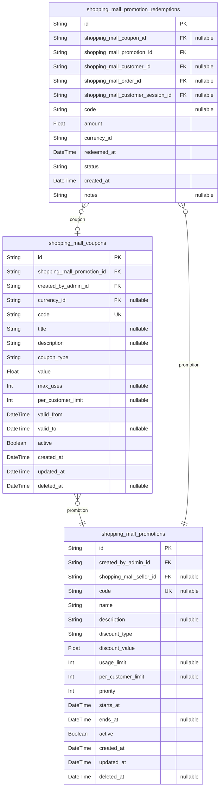
```mermaid
erDiagram
"shopping_mall_promotions" {
  String id PK
  String created_by_admin_id FK
  String shopping_mall_seller_id FK "nullable"
  String code UK "nullable"
  String name
  String description "nullable"
  String discount_type
  Float discount_value
  Int usage_limit "nullable"
  Int per_customer_limit "nullable"
  Int priority
  DateTime starts_at
  DateTime ends_at "nullable"
  Boolean active
  DateTime created_at
  DateTime updated_at
  DateTime deleted_at "nullable"
}
"shopping_mall_coupons" {
  String id PK
  String shopping_mall_promotion_id FK
  String created_by_admin_id FK
  String currency_id FK "nullable"
  String code UK
  String title "nullable"
  String description "nullable"
  String coupon_type
  Float value
  Int max_uses "nullable"
  Int per_customer_limit "nullable"
  DateTime valid_from
  DateTime valid_to "nullable"
  Boolean active
  DateTime created_at
  DateTime updated_at
  DateTime deleted_at "nullable"
}
"shopping_mall_promotion_redemptions" {
  String id PK
  String shopping_mall_coupon_id FK "nullable"
  String shopping_mall_promotion_id FK
  String shopping_mall_customer_id FK "nullable"
  String shopping_mall_order_id FK "nullable"
  String shopping_mall_customer_session_id FK "nullable"
  String code "nullable"
  Float amount
  String currency_id
  DateTime redeemed_at
  String status
  DateTime created_at
  String notes "nullable"
}
"shopping_mall_coupons" }o--|| "shopping_mall_promotions" : promotion
"shopping_mall_promotion_redemptions" }o--o| "shopping_mall_coupons" : coupon
"shopping_mall_promotion_redemptions" }o--|| "shopping_mall_promotions" : promotion
```

### `shopping_mall_promotions`

Promotional campaign definitions used to drive discounts, coupon
issuance, and program-level rules. A promotion defines the business-level
parameters (name, discount type, value, validity window, and usage
limits). Promotions may be created by platform administrators and
optionally associated with a seller when promotions are seller-scoped.
Promotion definitions are ground-truth for coupon generation and
evaluation during checkout. Related entities: {@link
shopping_mall_coupons.id}, {@link
shopping_mall_promotion_redemptions.id}.

Properties as follows:

- `id`: Primary Key.
- `created_by_admin_id`
  > Creator administrator's [shopping_mall_admins.id](#shopping_mall_admins). The admin
  > account that created or last approved the promotion.
- `shopping_mall_seller_id`
  > Optional owning seller's [shopping_mall_sellers.id](#shopping_mall_sellers) when the
  > promotion is seller-scoped. Null for global/platform promotions.
- `code`
  > Optional promotion-level code (human-friendly identifier) used for
  > administrative lookup. Not required for every promotion.
- `name`: Display name of the promotion used in admin UIs and reports.
- `description`
  > Long-form description explaining business rules, targeting and usage
  > notes for the promotion.
- `discount_type`
  > Discount type (e.g., 'percentage' or 'fixed'). Handled as business enum
  > in application logic.
- `discount_value`
  > Discount magnitude: percentage (0-100) when discount_type='percentage',
  > or currency amount when discount_type='fixed'.
- `usage_limit`
  > Total allowed redemptions across all coupons under this promotion. Null
  > means unlimited.
- `per_customer_limit`
  > Maximum redemptions allowed per customer for this promotion. Null means
  > unlimited per customer.
- `priority`
  > Priority for promotion application when multiple promotions apply. Higher
  > values indicate higher precedence.
- `starts_at`: UTC start datetime when the promotion becomes active.
- `ends_at`
  > UTC end datetime when the promotion expires. Null indicates no automatic
  > expiry.
- `active`
  > Whether the promotion is currently active for evaluation. Administrators
  > can toggle this to pause promotion evaluation.
- `created_at`: Record creation timestamp (snapshot of when promotion was created).
- `updated_at`: Record last-modified timestamp.
- `deleted_at`: Soft-delete timestamp. Non-null if promotion was soft-deleted/archived.

### `shopping_mall_coupons`

Coupon entities issued under promotions. Coupons represent redeemable
codes (single-use or multi-use) and carry usage limits, validity windows,
and optional currency scoping. Coupons reference their parent {@link
shopping_mall_promotions.id} and record administrative metadata for
auditing.

Properties as follows:

- `id`: Primary Key.
- `shopping_mall_promotion_id`: Belonged promotion's [shopping_mall_promotions.id](#shopping_mall_promotions).
- `created_by_admin_id`: Administrator who created the coupon [shopping_mall_admins.id](#shopping_mall_admins).
- `currency_id`
  > Optional currency reference for fixed-value coupons {@link
  > shopping_mall_currencies.id}. Null if coupon uses promotion-level
  > currency rules or percentage discount.
- `code`
  > Coupon code string used by customers at checkout. Unique across platform
  > to prevent ambiguity.
- `title`: Short title for the coupon for admin display.
- `description`: Administrative notes and business rules associated with the coupon.
- `coupon_type`
  > Coupon issuance type (e.g., 'single_use', 'multi_use',
  > 'one_time_per_customer'). Application logic enforces behavior.
- `value`
  > Numeric value used by coupon evaluation. Interpretation depends on
  > promotion.discount_type (percentage or fixed amount).
- `max_uses`
  > Maximum total uses for this coupon across all customers. Null indicates
  > unlimited uses.
- `per_customer_limit`
  > Maximum uses per single customer for this coupon. Null indicates no
  > per-customer limit.
- `valid_from`: UTC datetime from which the coupon is redeemable.
- `valid_to`
  > UTC datetime after which the coupon is no longer redeemable. Null means
  > no automatic expiry.
- `active`: Whether the coupon is active and can be evaluated by the promotion engine.
- `created_at`: Coupon creation timestamp.
- `updated_at`: Coupon last-modified timestamp.
- `deleted_at`: Soft-delete timestamp for the coupon.

### `shopping_mall_promotion_redemptions`

Append-only redemption records created each time a coupon or promotion is
redeemed. Captures the acting customer, optional session information,
associated order, redeemed amount and timestamps for auditing,
reconciliation, and analysis. This table is append-only and used for
historical reporting and fraud analysis. Related entities: {@link
shopping_mall_coupons.id}, [shopping_mall_promotions.id](#shopping_mall_promotions), {@link
shopping_mall_customers.id}, [shopping_mall_orders.id](#shopping_mall_orders).

Properties as follows:

- `id`: Primary Key.
- `shopping_mall_coupon_id`: Referenced coupon that was redeemed. [shopping_mall_coupons.id](#shopping_mall_coupons)
- `shopping_mall_promotion_id`
  > Referenced promotion that triggered the redemption. {@link
  > shopping_mall_promotions.id}
- `shopping_mall_customer_id`: Customer who performed the redemption. [shopping_mall_customers.id](#shopping_mall_customers)
- `shopping_mall_order_id`
  > Order created as a result of redemption, if applicable. {@link
  > shopping_mall_orders.id}
- `shopping_mall_customer_session_id`
  > Optional customer session context for the redemption (traceability).
  > [shopping_mall_customer_sessions.id](#shopping_mall_customer_sessions)
- `code`
  > Resolved coupon or promotion code used at redemption time for quick
  > lookup and de-normalized reporting.
- `amount`
  > Monetary value applied by the redemption in the order's currency (stored
  > as double).
- `currency_id`
  > Currency of the redemption. References {@link
  > shopping_mall_currencies.id} for reconciliation.
- `redeemed_at`: Timestamp when the redemption occurred.
- `status`: Redemption lifecycle status (e.g., 'applied', 'voided', 'reversed').
- `created_at`: Record creation timestamp (same as redeemed_at for append-only events).
- `notes`: Optional administrative notes for reconciliation or fraud flags.

## Financial

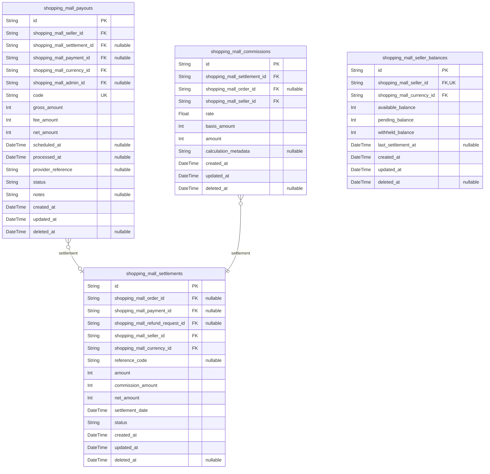
```mermaid
erDiagram
"shopping_mall_payouts" {
  String id PK
  String shopping_mall_seller_id FK
  String shopping_mall_settlement_id FK "nullable"
  String shopping_mall_payment_id FK "nullable"
  String shopping_mall_currency_id FK
  String shopping_mall_admin_id FK "nullable"
  String code UK
  Int gross_amount
  Int fee_amount
  Int net_amount
  DateTime scheduled_at "nullable"
  DateTime processed_at "nullable"
  String provider_reference "nullable"
  String status
  String notes "nullable"
  DateTime created_at
  DateTime updated_at
  DateTime deleted_at "nullable"
}
"shopping_mall_settlements" {
  String id PK
  String shopping_mall_order_id FK "nullable"
  String shopping_mall_payment_id FK "nullable"
  String shopping_mall_refund_request_id FK "nullable"
  String shopping_mall_seller_id FK
  String shopping_mall_currency_id FK
  String reference_code "nullable"
  Int amount
  Int commission_amount
  Int net_amount
  DateTime settlement_date
  String status
  DateTime created_at
  DateTime updated_at
  DateTime deleted_at "nullable"
}
"shopping_mall_commissions" {
  String id PK
  String shopping_mall_settlement_id FK
  String shopping_mall_order_id FK "nullable"
  String shopping_mall_seller_id FK
  Float rate
  Int basis_amount
  Int amount
  String calculation_metadata "nullable"
  DateTime created_at
  DateTime updated_at
  DateTime deleted_at "nullable"
}
"shopping_mall_seller_balances" {
  String id PK
  String shopping_mall_seller_id FK,UK
  String shopping_mall_currency_id FK
  Int available_balance
  Int pending_balance
  Int withheld_balance
  DateTime last_settlement_at "nullable"
  DateTime created_at
  DateTime updated_at
  DateTime deleted_at "nullable"
}
"shopping_mall_payouts" }o--o| "shopping_mall_settlements" : settlement
"shopping_mall_commissions" }o--|| "shopping_mall_settlements" : settlement
```

### `shopping_mall_payouts`

Payout batches to sellers representing disbursements from platform
settlements. Amount fields are stored in the smallest currency unit
(integer minor units, e.g., cents) to ensure financial precision.
References seller, settlement, payment, currency and approving admin for
audit and reconciliation.

Properties as follows:

- `id`: Primary Key.
- `shopping_mall_seller_id`: Belonged seller. [shopping_mall_sellers.id](#shopping_mall_sellers).
- `shopping_mall_settlement_id`: Related settlement event. [shopping_mall_settlements.id](#shopping_mall_settlements).
- `shopping_mall_payment_id`
  > Optional link to provider payment or transfer record. {@link
  > shopping_mall_payments.id}.
- `shopping_mall_currency_id`: Currency of the payout. [shopping_mall_currencies.id](#shopping_mall_currencies).
- `shopping_mall_admin_id`
  > Approving admin for manual/exception payouts. {@link
  > shopping_mall_admins.id}.
- `code`: Unique payout code for business reconciliation (e.g., payout batch id).
- `gross_amount`
  > Gross amount before fees, stored in the smallest currency unit (integer
  > minor units, e.g., cents).
- `fee_amount`
  > Platform or provider fees deducted from the gross amount, stored in
  > smallest currency unit.
- `net_amount`
  > Net amount disbursed to seller after fees, stored in smallest currency
  > unit.
- `scheduled_at`: Scheduled disbursement timestamp (business scheduled date/time).
- `processed_at`: Actual disbursement processed timestamp.
- `provider_reference`
  > Provider's transaction/reference id for the payout. Indexed for
  > reconciliation and idempotency checks.
- `status`
  > Payout lifecycle status (e.g., 'pending','processed','failed').
  > Application should enforce allowed values.
- `notes`: Optional operational notes or reason for manual adjustments.
- `created_at`: Creation timestamp for the payout record.
- `updated_at`: Last update timestamp for the payout record.
- `deleted_at`: Soft delete timestamp for the payout record.

### `shopping_mall_settlements`

Settlement ledger lines that map orders/payments/refunds to platform
settlement events. Amount fields are stored in smallest currency unit
(integer minor units) to guarantee financial precision. Settlement lines
link to orders/payments/refunds and to the receiving seller/currency for
reconciliation.

Properties as follows:

- `id`: Primary Key.
- `shopping_mall_order_id`: Associated order line or order. [shopping_mall_orders.id](#shopping_mall_orders).
- `shopping_mall_payment_id`
  > Associated payment record for reconciliation. {@link
  > shopping_mall_payments.id}.
- `shopping_mall_refund_request_id`
  > Related refund request when settlements include refunds. {@link
  > shopping_mall_refund_requests.id}.
- `shopping_mall_seller_id`
  > Seller who receives this settlement portion. {@link
  > shopping_mall_sellers.id}.
- `shopping_mall_currency_id`: Currency for the settlement line. [shopping_mall_currencies.id](#shopping_mall_currencies).
- `reference_code`
  > Business reference code used in reconciliation (external batch id or
  > similar).
- `amount`
  > Settlement gross amount for this line, stored in the smallest currency
  > unit (integer minor units).
- `commission_amount`
  > Platform commission amount deducted from this settlement line, stored in
  > smallest currency unit.
- `net_amount`
  > Net amount after commission and adjustments, stored in smallest currency
  > unit.
- `settlement_date`: Business date for the settlement line.
- `status`
  > Settlement processing status (e.g., 'pending','reconciled','disputed').
  > Application should enforce allowed values.
- `created_at`: Creation timestamp for the settlement record.
- `updated_at`: Last update timestamp for the settlement record.
- `deleted_at`: Soft delete timestamp for the settlement record.

### `shopping_mall_commissions`

Platform commission records capturing fee calculations tied to settlement
lines or orders. Monetary amounts stored in smallest currency unit
(integer minor units) to ensure precise accounting. Rate is stored as
decimal fraction (double).

Properties as follows:

- `id`: Primary Key.
- `shopping_mall_settlement_id`: Parent settlement line. [shopping_mall_settlements.id](#shopping_mall_settlements).
- `shopping_mall_order_id`
  > Optional order reference for commission origin. {@link
  > shopping_mall_orders.id}.
- `shopping_mall_seller_id`: Seller associated with the commission. [shopping_mall_sellers.id](#shopping_mall_sellers).
- `rate`
  > Commission rate applied (percentage expressed as decimal, e.g., 0.10 for
  > 10%).
- `basis_amount`
  > Monetary basis on which the commission was calculated, stored in smallest
  > currency unit.
- `amount`
  > Calculated commission amount charged to the settlement line, stored in
  > smallest currency unit.
- `calculation_metadata`
  > JSON-encoded or human-readable metadata describing the calculation
  > (rules, promotion adjustments).
- `created_at`: Record creation timestamp.
- `updated_at`: Last update timestamp.
- `deleted_at`: Soft delete timestamp for auditability.

### `shopping_mall_seller_balances`

Current balance ledger per seller used to display available and pending
funds. Monetary fields are stored in smallest currency unit (integer
minor units). This table is canonical 1:1 with sellers and updated by
financial settlement jobs; all updates must be accompanied by settlement
records for audit.

Properties as follows:

- `id`: Primary Key.
- `shopping_mall_seller_id`: Associated seller. [shopping_mall_sellers.id](#shopping_mall_sellers).
- `shopping_mall_currency_id`: Currency for the balance. [shopping_mall_currencies.id](#shopping_mall_currencies).
- `available_balance`
  > Funds immediately available for withdrawal or payout to the seller,
  > stored in smallest currency unit.
- `pending_balance`
  > Funds pending settlement (e.g., recent captures not yet settled), stored
  > in smallest currency unit.
- `withheld_balance`
  > Funds on hold due to disputes, chargebacks, or policy holds, stored in
  > smallest currency unit.
- `last_settlement_at`: Timestamp of last settlement that affected this balance.
- `created_at`: Creation timestamp for the balance row.
- `updated_at`: Last update timestamp for the balance row.
- `deleted_at`: Soft delete timestamp; preserved for audit history.

## Inquiries

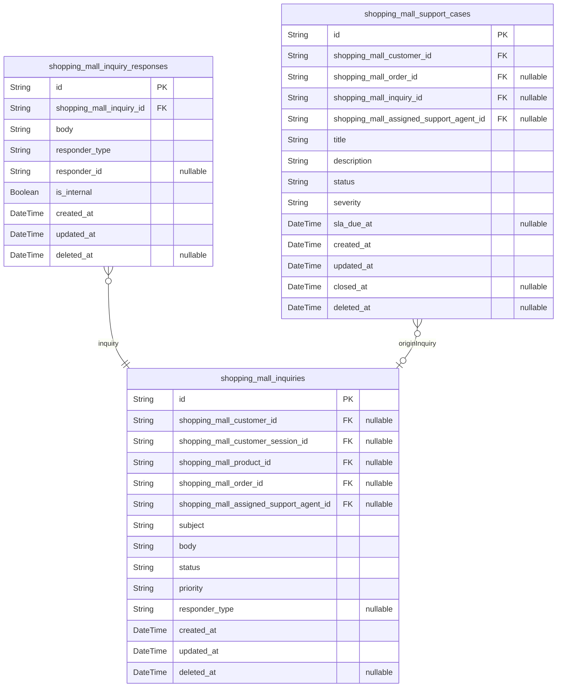
```mermaid
erDiagram
"shopping_mall_inquiries" {
  String id PK
  String shopping_mall_customer_id FK "nullable"
  String shopping_mall_customer_session_id FK "nullable"
  String shopping_mall_product_id FK "nullable"
  String shopping_mall_order_id FK "nullable"
  String shopping_mall_assigned_support_agent_id FK "nullable"
  String subject
  String body
  String status
  String priority
  String responder_type "nullable"
  DateTime created_at
  DateTime updated_at
  DateTime deleted_at "nullable"
}
"shopping_mall_inquiry_responses" {
  String id PK
  String shopping_mall_inquiry_id FK
  String body
  String responder_type
  String responder_id "nullable"
  Boolean is_internal
  DateTime created_at
  DateTime updated_at
  DateTime deleted_at "nullable"
}
"shopping_mall_support_cases" {
  String id PK
  String shopping_mall_customer_id FK
  String shopping_mall_order_id FK "nullable"
  String shopping_mall_inquiry_id FK "nullable"
  String shopping_mall_assigned_support_agent_id FK "nullable"
  String title
  String description
  String status
  String severity
  DateTime sla_due_at "nullable"
  DateTime created_at
  DateTime updated_at
  DateTime closed_at "nullable"
  DateTime deleted_at "nullable"
}
"shopping_mall_inquiry_responses" }o--|| "shopping_mall_inquiries" : inquiry
"shopping_mall_support_cases" }o--o| "shopping_mall_inquiries" : originInquiry
```

### `shopping_mall_inquiries`

Customer-facing inquiries and questions about products, orders, or the
marketplace. Stores inquiry metadata, linkage to originating customer or
session, optional context (product/order), assignment to support agent,
and lifecycle fields for SLA and moderation. Primary business entity for
inquiry creation, search, and management. Related entities: {@link
shopping_mall_inquiry_responses}, [shopping_mall_support_cases](#shopping_mall_support_cases).

Properties as follows:

- `id`: Primary Key.
- `shopping_mall_customer_id`
  > Originating customer's [shopping_mall_customers.id](#shopping_mall_customers). Nullable for
  > guest-originated inquiries (use session).
- `shopping_mall_customer_session_id`
  > Originating customer's session for anonymous or guest inquiry. {@link
  > shopping_mall_customer_sessions.id}.
- `shopping_mall_product_id`: Optional related product context. [shopping_mall_products.id](#shopping_mall_products).
- `shopping_mall_order_id`
  > Optional related order context when inquiry pertains to an order. {@link
  > shopping_mall_orders.id}.
- `shopping_mall_assigned_support_agent_id`
  > Support agent assigned to the inquiry for SLA handling. {@link
  > shopping_mall_support_agents.id}.
- `subject`: Short summary of the inquiry for quick scanning and search.
- `body`: Full inquiry text submitted by the customer or origin actor.
- `status`
  > Lifecycle status of the inquiry (e.g., 'open', 'pending',
  > 'waiting_customer', 'resolved', 'closed').
- `priority`: Business priority for SLA routing (e.g., 'low','normal','high','urgent').
- `responder_type`
  > Last responder type shortcut for quick filtering (e.g.,
  > 'support_agent','seller','admin','customer').
- `created_at`: Inquiry creation timestamp.
- `updated_at`: Last updated timestamp for the inquiry.
- `deleted_at`: Soft-delete timestamp; null when active.

### `shopping_mall_inquiry_responses`

Responses/messages for inquiries. Reworked ownership representation to a
polymorphic discriminator pattern to avoid multiple nullable foreign keys
per responder type. Use responder_type (enum-like string) and
responder_id (opaque UUID) to identify the author across actor tables:
'support_agent' | 'seller' | 'admin' | 'customer'. Application logic is
responsible for referential interpretation. Includes internal-note flag,
full-text searchable body, and temporal/audit fields.

Properties as follows:

- `id`: Primary Key.
- `shopping_mall_inquiry_id`: Parent inquiry. [shopping_mall_inquiries.id](#shopping_mall_inquiries).
- `body`: Response message body. Full-text searchable.
- `responder_type`
  > Actor type that authored the response. Allowed values: 'support_agent' |
  > 'seller' | 'admin' | 'customer'. Application layer must interpret this
  > with responder_id.
- `responder_id`
  > Opaque actor UUID combined with responder_type to identify the author.
  > Nullable for internal notes or system-originated messages.
- `is_internal`: Flag indicating this is internal note (true) not visible to the customer.
- `created_at`: Response creation timestamp.
- `updated_at`: Response last updated timestamp.
- `deleted_at`: Soft-delete timestamp for responses.

### `shopping_mall_support_cases`

Escalated support cases for issues requiring SLA tracking, multi-step
remediation, or financial operations. Cases may link to a customer,
order, or originating inquiry and are independently managed for routing,
assignment, and closure. Used for operational workflows, reporting, and
audit trails. Related entities: [shopping_mall_inquiries](#shopping_mall_inquiries).

Properties as follows:

- `id`: Primary Key.
- `shopping_mall_customer_id`
  > Customer who raised or is affected by the support case. {@link
  > shopping_mall_customers.id}.
- `shopping_mall_order_id`: Optional linked order for case context. [shopping_mall_orders.id](#shopping_mall_orders).
- `shopping_mall_inquiry_id`
  > Optional originating inquiry that escalated into a support case. {@link
  > shopping_mall_inquiries.id}.
- `shopping_mall_assigned_support_agent_id`
  > Support agent assigned to handle the case. {@link
  > shopping_mall_support_agents.id}.
- `title`: Short title describing the support case.
- `description`: Full case description and initial problem statement.
- `status`
  > Case lifecycle status (e.g.,
  > 'open','investigating','escalated','resolved','closed').
- `severity`: Business severity level (e.g., 'low','medium','high','critical').
- `sla_due_at`: SLA deadline for first response or resolution depending on case type.
- `created_at`: Case creation timestamp.
- `updated_at`: Last update timestamp for the case.
- `closed_at`: Timestamp when case was closed.
- `deleted_at`: Soft-delete timestamp for case records.

## Articles

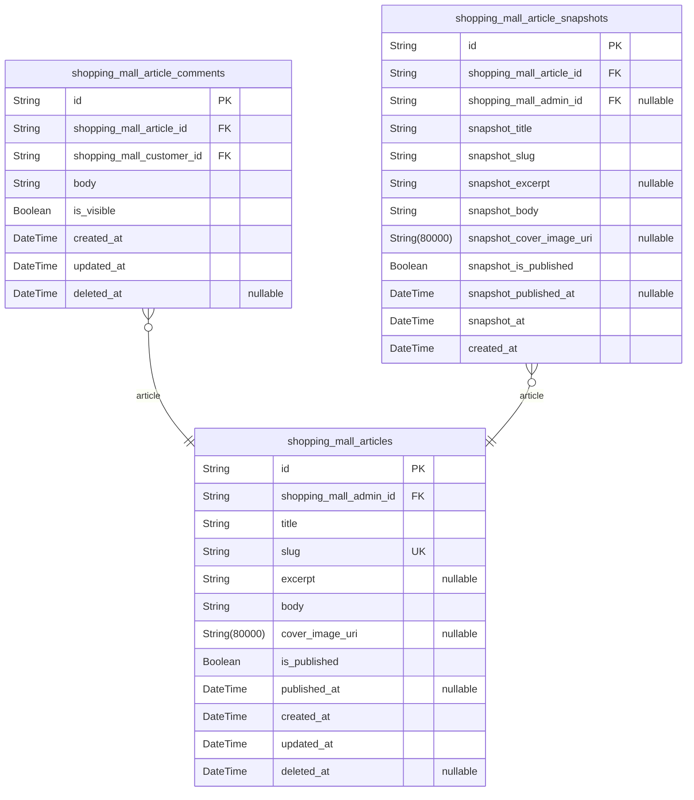
```mermaid
erDiagram
"shopping_mall_articles" {
  String id PK
  String shopping_mall_admin_id FK
  String title
  String slug UK
  String excerpt "nullable"
  String body
  String(80000) cover_image_uri "nullable"
  Boolean is_published
  DateTime published_at "nullable"
  DateTime created_at
  DateTime updated_at
  DateTime deleted_at "nullable"
}
"shopping_mall_article_comments" {
  String id PK
  String shopping_mall_article_id FK
  String shopping_mall_customer_id FK
  String body
  Boolean is_visible
  DateTime created_at
  DateTime updated_at
  DateTime deleted_at "nullable"
}
"shopping_mall_article_snapshots" {
  String id PK
  String shopping_mall_article_id FK
  String shopping_mall_admin_id FK "nullable"
  String snapshot_title
  String snapshot_slug
  String snapshot_excerpt "nullable"
  String snapshot_body
  String(80000) snapshot_cover_image_uri "nullable"
  Boolean snapshot_is_published
  DateTime snapshot_published_at "nullable"
  DateTime snapshot_at
  DateTime created_at
}
"shopping_mall_article_comments" }o--|| "shopping_mall_articles" : article
"shopping_mall_article_snapshots" }o--|| "shopping_mall_articles" : article
```

### `shopping_mall_articles`

Primary article entity storing published and draft content authored by
platform administrators. Used for CMS content, editorial workflows, and
public article listing. Related to {\@link
shopping_mall_article_snapshots} (historical snapshots) and {\@link
shopping_mall_article_comments} (user comments).

Properties as follows:

- `id`: Primary Key.
- `shopping_mall_admin_id`: Authoring admin's [shopping_mall_admins.id](#shopping_mall_admins).
- `title`: Article title used for listings and search.
- `slug`: URL-friendly unique slug for the article.
- `excerpt`: Short summary or teaser shown in lists and share cards.
- `body`: Full article body. Stored as text for rendering and snapshotting.
- `cover_image_uri`: URI to the article's cover image.
- `is_published`: Whether the article is published and visible to end users.
- `published_at`: Timestamp when article was published (nullable for drafts).
- `created_at`: Record creation timestamp.
- `updated_at`: Record last modification timestamp.
- `deleted_at`: Soft-delete timestamp; null when active.

### `shopping_mall_article_comments`

User comments on articles. Comments belong to an article and are authored
by customers. Comments are independently manageable for moderation,
search, and user activity queries. Related to {\@link
shopping_mall_articles} and {\@link shopping_mall_customers}.

Properties as follows:

- `id`: Primary Key.
- `shopping_mall_article_id`: Parent article's [shopping_mall_articles.id](#shopping_mall_articles).
- `shopping_mall_customer_id`: Comment author's customer id [shopping_mall_customers.id](#shopping_mall_customers).
- `body`: Comment body text.
- `is_visible`: Visibility flag for moderation (true = visible).
- `created_at`: Comment creation timestamp.
- `updated_at`: Comment last modification timestamp (edits).
- `deleted_at`: Soft-delete timestamp for moderation removal.

### `shopping_mall_article_snapshots`

Append-only snapshot records capturing point-in-time state of articles
for audit, moderation history, and rollback. Each snapshot preserves
article fields and snapshot metadata. Added explicit snapshot_at and
optional author reference for improved auditability and uniqueness.

Properties as follows:

- `id`: Primary Key.
- `shopping_mall_article_id`: Referenced article. [shopping_mall_articles.id](#shopping_mall_articles).
- `shopping_mall_admin_id`
  > Optional authoring admin who created the snapshot. {@link
  > shopping_mall_admins.id}. Nullable for system-generated snapshots.
- `snapshot_title`: Article title captured in this snapshot.
- `snapshot_slug`: Article slug captured in this snapshot.
- `snapshot_excerpt`: Snapshot of article excerpt.
- `snapshot_body`: Full article body at snapshot time.
- `snapshot_cover_image_uri`: Cover image URI as captured in snapshot.
- `snapshot_is_published`: Published state at snapshot time.
- `snapshot_published_at`: Published timestamp at snapshot time.
- `snapshot_at`
  > Canonical timestamp when the snapshot represents the article state
  > (useful when snapshot creation is delayed or asynchronous).
- `created_at`: Snapshot creation timestamp.

## default

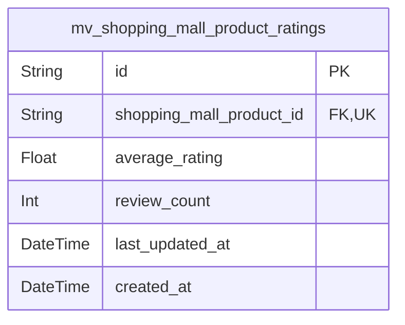
```mermaid
erDiagram
"mv_shopping_mall_product_ratings" {
  String id PK
  String shopping_mall_product_id FK,UK
  Float average_rating
  Int review_count
  DateTime last_updated_at
  DateTime created_at
}
```

### `mv_shopping_mall_product_ratings`

Materialized view (read-only) storing denormalized product rating
aggregates for fast reads. This mv replaces storing average_rating and
review_count on the product table and must be refreshed on a schedule or
updated incrementally by triggers/background jobs. Marked material: true
and stance: "subsidiary".

Properties as follows:

- `id`: Primary Key.
- `shopping_mall_product_id`: Referenced product [shopping_mall_products.id](#shopping_mall_products).
- `average_rating`
  > Computed average rating for the product (derived from reviews). Stored
  > here in the materialized view for fast reads.
- `review_count`: Count of published reviews for the product at aggregation time.
- `last_updated_at`: When this materialized row was last refreshed.
- `created_at`: Creation timestamp for this mv row (can mirror last_updated_at).
