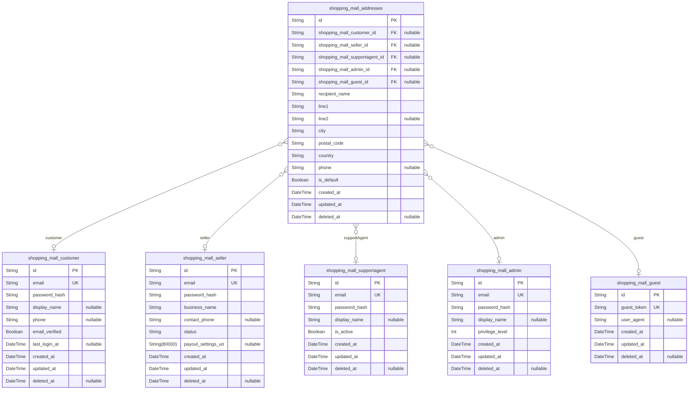

# Prisma Markdown

> Generated by [`prisma-markdown`](https://github.com/samchon/prisma-markdown)

- [Systematic](#systematic)
- [Actors](#actors)
- [Sales](#sales)
- [Carts](#carts)
- [Orders](#orders)
- [Fulfillment](#fulfillment)

## Systematic

### `shopping_mall_categories`

Hierarchical category taxonomy for the shoppingMall catalog. Categories
support optional parent-child nesting for multi-level organization. Used
by product listing, search, and navigation. Contains canonical business
identity (slug) and temporal audit fields. Related entity references:
[shopping_mall_product_categories](#shopping_mall_product_categories).

Properties as follows:

- `id`: Primary Key.
- `parent_id`
  > Self-referential parent category reference. {@link
  > shopping_mall_categories.id}.
- `name`: Human-friendly category name used in navigation and search.
- `slug`: Unique URL-friendly identifier for the category (business key).
- `description`: Optional textual description for the category used in admin and SEO.
- `created_at`: Record creation timestamp (Asia/Seoul timezone interpretation).
- `updated_at`: Record last update timestamp.
- `deleted_at`: Soft-delete timestamp; null when active.

### `shopping_mall_product_categories`

Junction table linking products to categories. Represents M:N
relationship between shopping_mall_products and shopping_mall_categories.
Enforces uniqueness per product/category pair to avoid duplicate
assignments. Managed as subsidiary data from product/category
administration flows.

Properties as follows:

- `id`: Primary Key.
- `shopping_mall_product_id`: Belonged product's [shopping_mall_products.id](#shopping_mall_products).
- `shopping_mall_category_id`: Belonged category's [shopping_mall_categories.id](#shopping_mall_categories).
- `created_at`: When the product was assigned to the category.
- `created_by`
  > Actor who created the assignment (nullable; may reference admin or system
  > user).

### `shopping_mall_audit_logs`

Append-only audit and event log for platform-level critical actions
(admin operations, moderation events, system escalations). Designed for
immutable historical records, forensic queries, and admin reporting.
Entries are append-only and include free-text details for later
investigation.

Properties as follows:

- `id`: Primary Key.
- `actor_id`
  > Identifier of the actor that caused the event (user/admin/system). May
  > reference other user tables; nullable for system events.
- `action`: Short action code or verb (e.g., 'product_publish', 'refund_approved').
- `entity`: Target entity type (e.g., 'product','order','review').
- `entity_id`: Identifier of the affected entity (if applicable).
- `details`
  > Human-readable or structured details about the event (JSON-as-string or
  > text).
- `created_at`: Event timestamp (immutable).

### `shopping_mall_inventory_events`

Append-only inventory event stream capturing SKU-level inventory changes
(adjustments, reservations, commits, releases). Each event ties to a SKU
and optionally to an order or actor. Used for inventory audit,
reconciliation, and prevention of oversells.

Properties as follows:

- `id`: Primary Key.
- `shopping_mall_sku_id`: Affected SKU reference. [shopping_mall_skus.id](#shopping_mall_skus).
- `delta`: Signed quantity change (positive for inbound, negative for outbound).
- `reason`
  > Reason for the inventory change (e.g., 'sale', 'adjustment', 'return',
  > 'reservation_expiry').
- `reference_order_id`
  > Optional order id associated with this event (if applicable). {@link
  > shopping_mall_orders.id}.
- `actor_id`: Actor who performed the change (seller/admin/system).
- `created_at`: Event timestamp (append-only).

## Actors

### `shopping_mall_guest`

Temporary guest session record used to persist guest carts and wishlists
across sessions. Stores a guest token and session metadata. Not an
authenticated user; intended for ephemeral guest state management and
merges into customer accounts on registration.

Properties as follows:

- `id`: Primary Key.
- `guest_token`
  > Opaque guest token used to associate temporary cart/wishlist sessions
  > with an unauthenticated visitor.
- `user_agent`: Optional user-agent string captured at session creation for diagnostics.
- `created_at`: Creation timestamp.
- `updated_at`: Last update timestamp.
- `deleted_at`: Soft-delete timestamp when guest session is expired or removed.

### `shopping_mall_customer`

Registered customer account. Stores authentication credentials, profile
metadata and flags required for buyer flows. Customers may have addresses
and persistent carts; this is an independent business entity (primary).

Properties as follows:

- `id`: Primary Key.
- `email`: Login email address. Unique across customers.
- `password_hash`: Password hash for authentication (do not store raw passwords).
- `display_name`: Optional display or full name for customer-facing UX.
- `phone`: Optional contact phone number.
- `email_verified`: Whether the customer's email address has been verified.
- `last_login_at`: Timestamp of the last successful login event.
- `created_at`: Account creation timestamp.
- `updated_at`: Account last update timestamp.
- `deleted_at`: Soft-delete timestamp for deactivated accounts.

### `shopping_mall_seller`

Seller (merchant) account that owns product listings and SKUs. Contains
authentication credentials, business identity fields, and operational
flags. Sellers are primary business entities responsible for inventory
and fulfillment.

Properties as follows:

- `id`: Primary Key.
- `email`: Login email for the seller account.
- `password_hash`: Password hash for seller authentication.
- `business_name`: Registered business or display name for the seller.
- `contact_phone`: Primary contact phone number for the seller.
- `status`: Seller account status (e.g., pending_verification, active, suspended).
- `payout_settings_uri`: Reference to payout settings or external settlement profile.
- `created_at`: Seller account creation timestamp.
- `updated_at`: Seller account last update timestamp.
- `deleted_at`: Soft-delete timestamp for deactivated sellers.

### `shopping_mall_supportagent`

Support agent account for platform customer service and dispute handling.
Agents have credentials and profile metadata; actions must be auditable
via separate audit logs (external).

Properties as follows:

- `id`: Primary Key.
- `email`: Login email for the support agent.
- `password_hash`: Password hash for support agent authentication.
- `display_name`: Human-readable name for the agent.
- `is_active`: Whether the support agent account is active.
- `created_at`: Agent account creation timestamp.
- `updated_at`: Agent account last update timestamp.
- `deleted_at`: Soft-delete timestamp for removed agent accounts.

### `shopping_mall_admin`

Platform administrator accounts with elevated privileges for governance
and platform configuration. Admins are primary actors and all admin
actions should be recorded in the system audit logs.

Properties as follows:

- `id`: Primary Key.
- `email`: Administrator login email.
- `password_hash`: Password hash for admin authentication.
- `display_name`: Administrator display name.
- `privilege_level`
  > Integer representing privilege tiers for admin accounts; higher value
  > implies broader privileges.
- `created_at`: Admin account creation timestamp.
- `updated_at`: Admin account last update timestamp.
- `deleted_at`: Soft-delete timestamp for deactivated admin accounts.

### `shopping_mall_addresses`

Address records for all roles (customers, sellers, guests, agents,
admins). Stores raw address fields used for shipping, billing, and
address snapshots on orders. IMPORTANT: Owner foreign keys are
intentionally nullable and must NOT cascade on owner deletion; they
should be set to NULL (or left as-is) to preserve historical snapshots.
Application-level archival / soft-delete must be used to retire actor
accounts without deleting address history.

Properties as follows:

- `id`: Primary Key.
- `shopping_mall_customer_id`
  > Belonged customer's [shopping_mall_customer.id](#shopping_mall_customer). Nullable to
  > preserve address snapshots when customer is deleted.
- `shopping_mall_seller_id`
  > Belonged seller's [shopping_mall_seller.id](#shopping_mall_seller). Nullable to preserve
  > address snapshots when seller is deleted.
- `shopping_mall_supportagent_id`
  > Belonged support agent's [shopping_mall_supportagent.id](#shopping_mall_supportagent). Nullable
  > to preserve audit trail when agent account is removed.
- `shopping_mall_admin_id`
  > Belonged admin's [shopping_mall_admin.id](#shopping_mall_admin). Nullable to preserve
  > audit trail when admin account is removed.
- `shopping_mall_guest_id`
  > Belonged guest session [shopping_mall_guest.id](#shopping_mall_guest). Nullable to allow
  > guest cleanup without removing historical address rows referenced in
  > snapshots.
- `recipient_name`: Name of the recipient for deliveries.
- `line1`: Street address line 1.
- `line2`: Optional street address line 2 (apartment, suite).
- `city`: City or locality.
- `postal_code`: Postal or ZIP code.
- `country`: ISO country code or country name for display.
- `phone`: Contact phone number for deliveries.
- `is_default`
  > Whether this address is the default for the owner. Application should
  > default to false.
- `created_at`: Address creation timestamp.
- `updated_at`: Address last update timestamp.
- `deleted_at`: Soft-delete timestamp for removed addresses.

## Sales

### `shopping_mall_products`

Product catalog entry owned by a seller. Contains product-level metadata
used on product listing and detail pages. Related entities: {@\link
shopping_mall_skus} for variant-level data and {@\link
shopping_mall_product_categories} for category membership. Business
constraints: seller-level code uniqueness enforced by (seller_id, code).

Properties as follows:

- `id`: Primary Key.
- `seller_id`: Owning seller. [shopping_mall_seller.id](#shopping_mall_seller).
- `code`: Business identifier/code scoped to seller (unique per seller).
- `name`: Human-facing product title used in listings and search.
- `short_description`: Short description used in listing cards.
- `description`: Full product description (HTML or markdown may be stored as text).
- `primary_image_uri`: Primary product image URI for listing thumbnail.
- `created_at`: Record creation timestamp.
- `updated_at`: Record last update timestamp.
- `deleted_at`: Soft delete timestamp (nullable).

### `shopping_mall_skus`

SKU (Stock Keeping Unit) representing a specific variant of a product
(color, size, option). Updated to include explicit search indexing
guidance for attributes and to document migration to JSONB for
attributes. Retains global sku_code uniqueness; attributes remain stored
as string until JSON/JsonB migration is performed.

Properties as follows:

- `id`: Primary Key.
- `product_id`: Belonged product. [shopping_mall_products.id](#shopping_mall_products).
- `sku_code`
  > Unique SKU code for external lookups (e.g., barcode, merchant SKU).
  > Remains unique globally unless business changes to seller-scoped
  > uniqueness.
- `title`: Optional short name for the SKU variant (e.g., "T-Shirt — Red / M").
- `attributes_json`
  > JSON-encoded attribute map (e.g., {"color":"red","size":"M"}). Stored as
  > text for portability in the short term; plan to migrate to native
  > JSON/JSONB and create GIN jsonb_path_ops indexes on keys used for
  > filtering.
- `price`: Current price for this SKU in platform currency.
- `currency`: ISO currency code (e.g., "USD", "KRW").
- `created_at`: Record creation timestamp.
- `updated_at`: Record last update timestamp.
- `deleted_at`: Soft delete timestamp (nullable).

### `shopping_mall_inventory`

Per-SKU inventory snapshot and operational counters. Added guidance to
support low-stock queries and recommended DB-level CHECK constraints for
non-negative inventory counts. Keeps sku_id unique to ensure one
inventory row per SKU.

Properties as follows:

- `id`: Primary Key.
- `sku_id`: Belonged SKU. [shopping_mall_skus.id](#shopping_mall_skus).
- `last_event_id`
  > Reference to last processed inventory event for auditing. {@link
  > shopping_mall_inventory_events.id}.
- `available_quantity`
  > Quantity available for sale (non-negative). Application and DB-level
  > CHECK constraints recommended to enforce >= 0.
- `reserved_quantity`: Quantity currently reserved for carts/orders (non-negative).
- `location`: Optional warehouse/location code.
- `reorder_threshold`: Suggested threshold to trigger restock alerts.
- `last_checked_at`: Last inventory reconciliation or check timestamp.
- `created_at`: Record creation timestamp.
- `updated_at`: Record last update timestamp.
- `deleted_at`: Soft delete timestamp (nullable).

### `shopping_mall_reviews`

Product/SKU reviews submitted by customers. Added unique constraint to
enforce at-most-one review per product per author. Retains moderation
flags, verified_purchase, and GIN on body for search.

Properties as follows:

- `id`: Primary Key.
- `product_id`: Reviewed product. [shopping_mall_products.id](#shopping_mall_products).
- `sku_id`
  > Optional referenced SKU for SKU-level reviews. {@link
  > shopping_mall_skus.id}.
- `author_id`: Review author as a customer. [shopping_mall_customer.id](#shopping_mall_customer).
- `moderator_admin_id`
  > Optional admin who moderated or removed the review. {@link
  > shopping_mall_admin.id}.
- `rating`: Numeric rating (e.g., 1-5).
- `title`: Optional short title for the review.
- `body`: Long-form review text.
- `photos_json`: JSON array of photo URIs attached to the review.
- `verified_purchase`: Whether purchase was verified (true/false).
- `moderated`: Whether review is moderated/hidden from public view.
- `moderation_reason`: Optional reason code or free-text for moderation decisions.
- `created_at`: Record creation timestamp.
- `updated_at`: Record last update timestamp.
- `deleted_at`: Soft delete timestamp (nullable).

## Carts

### `shopping_mall_carts`

Persistent shopping carts and guest carts. A cart may belong to either a
registered customer ([shopping_mall_customer.id](#shopping_mall_customer)) or a guest
session ([shopping_mall_guest.id](#shopping_mall_guest)). Used to persist items prior to
checkout and to support merge behavior when guests log in. Soft-delete
and timestamps maintained for auditing and lifecycle management. NOTE:
removed single-column unique constraint on shopping_mall_customer_id to
allow multiple saved carts per customer. If single active-cart semantics
are required, implement a partial unique index on
(shopping_mall_customer_id) WHERE status='active' at DB migration time.

Properties as follows:

- `id`: Primary Key.
- `shopping_mall_customer_id`
  > Belonged customer's [shopping_mall_customer.id](#shopping_mall_customer). Nullable to
  > support guest carts.
- `shopping_mall_guest_id`
  > Belonged guest session [shopping_mall_guest.id](#shopping_mall_guest). Nullable to
  > support persistent customer carts.
- `guest_token`: Optional guest token for client-side mapping of temporary guest carts.
- `reservation_token`
  > Optional reservation identifier used during checkout to correlate
  > reserved inventory or payment attempts. INDEX recommended for lookup
  > performance.
- `status`
  > Cart lifecycle status (for example: 'active', 'merged', 'abandoned').
  > Application controls valid values; consider using an enum for stronger
  > validation.
- `created_at`: Creation timestamp.
- `updated_at`: Last update timestamp.
- `deleted_at`: Soft-delete timestamp for cart recovery and audit.

### `shopping_mall_cart_items`

Line items within a shopping cart. Each item references a SKU ({@link
shopping_mall_skus.id}) and records quantity and unit price snapshot.
Items are managed via the parent cart and include optional reservation
metadata to support the checkout reservation lifecycle. Added composite
unique constraint on (shopping_mall_cart_id, shopping_mall_sku_id) to
prevent duplicate lines and simplify upsert logic.

Properties as follows:

- `id`: Primary Key.
- `shopping_mall_cart_id`: Parent cart reference. [shopping_mall_carts.id](#shopping_mall_carts)
- `shopping_mall_sku_id`: Referenced SKU for this line item. [shopping_mall_skus.id](#shopping_mall_skus)
- `quantity`
  > Requested quantity for this SKU in the cart. Must be validated against
  > inventory at checkout; non-negative at application level.
- `unit_price`
  > Snapshot of unit price at the time item was added to cart to preserve
  > pricing during checkout.
- `reservation_id`
  > Optional reservation identifier linked to inventory reservation or
  > payment attempt.
- `reserved_until`
  > Optional reservation expiry timestamp for this item when a temporary hold
  > on inventory exists.
- `created_at`: Creation timestamp.
- `updated_at`: Last update timestamp.
- `deleted_at`: Soft-delete timestamp for item removal history.

### `shopping_mall_wishlists`

User wishlists for saving SKUs for later. Wishlists may belong to a
registered customer ([shopping_mall_customer.id](#shopping_mall_customer)) or a guest
session ([shopping_mall_guest.id](#shopping_mall_guest)). Supports named lists and
soft-delete for lifecycle management. Recommendation: default is_public
to false at DB or application layer to avoid accidental public lists for
guests.

Properties as follows:

- `id`: Primary Key.
- `shopping_mall_customer_id`
  > Owning customer reference. [shopping_mall_customer.id](#shopping_mall_customer). Nullable to
  > support guest wishlists.
- `shopping_mall_guest_id`
  > Owning guest session reference. [shopping_mall_guest.id](#shopping_mall_guest). Nullable
  > to support persistent customer lists.
- `name`
  > Optional user-visible name for the wishlist (for example 'Birthday
  > ideas').
- `is_public`
  > Whether the wishlist is visible to others. Recommended default: false.
  > Application must enforce visibility semantics for guest vs. authenticated
  > lists.
- `created_at`: Creation timestamp.
- `updated_at`: Last update timestamp.
- `deleted_at`: Soft-delete timestamp.

### `shopping_mall_wishlist_items`

Items saved in a wishlist. Each record links a wishlist to a SKU ({@link
shopping_mall_skus.id}). Duplicate (wishlist, sku) pairs are prevented by
a unique index to avoid redundant entries.

Properties as follows:

- `id`: Primary Key.
- `shopping_mall_wishlist_id`: Parent wishlist reference. [shopping_mall_wishlists.id](#shopping_mall_wishlists)
- `shopping_mall_sku_id`: Referenced SKU saved in the wishlist. [shopping_mall_skus.id](#shopping_mall_skus)
- `note`
  > Optional user note attached to the wishlist item (for example 'gift for
  > mom').
- `added_at`: Timestamp when the SKU was added to the wishlist.
- `created_at`: Creation timestamp.
- `updated_at`: Last update timestamp.
- `deleted_at`: Soft-delete timestamp for history and audit.

## Orders

### `shopping_mall_orders`

Order header capturing a single buyer-facing order. Stores buyer
reference, shipping address snapshot, pricing breakdown, and lifecycle
timestamps. Modified to avoid cascading delete cycles with shipments:
primary shipment is represented via shipment records rather than a direct
foreign key on the order to prevent circular cascade delete issues.
Related entities: [shopping_mall_order_items](#shopping_mall_order_items), {@link
shopping_mall_payments}, [shopping_mall_refund_requests](#shopping_mall_refund_requests), {@link
shopping_mall_shipments}.

Properties as follows:

- `id`: Primary Key.
- `shopping_mall_customer_id`: Belonged buyer customer. [shopping_mall_customer.id](#shopping_mall_customer)
- `shipping_address_id`
  > Reference to shipping address snapshot source. {@link
  > shopping_mall_addresses.id}
- `order_number`: Business-facing unique order number (human-readable).
- `order_source`: Origin channel of the order (web, mobile, api) for reporting.
- `shipping_address_snapshot`
  > JSON-serialized shipping address snapshot captured at order time to
  > preserve historical accuracy. Consider migrating to native JSON/JsonB
  > where supported.
- `subtotal_amount`: Sum of line item amounts before taxes and shipping.
- `shipping_amount`: Shipping fee applied to the order.
- `tax_amount`: Total tax amount for the order.
- `discount_amount`: Sum of discounts applied to the order (if any).
- `total_amount`
  > Final charged amount for the order (subtotal + shipping + tax -
  > discounts).
- `currency`: Currency code (ISO) used for this order.
- `status`
  > Order lifecycle status (Created, Payment Pending, Paid, Processing,
  > Shipped, Delivered, Cancelled, Refunded, Closed).
- `payment_state`: Payment business state (authorized, captured, failed, refunded).
- `reserved_until`: Reservation expiry timestamp for inventory holds related to this order.
- `placed_at`: Timestamp when the order was created/placed.
- `paid_at`: Timestamp when payment was captured for the order.
- `closed_at`: Timestamp when the order lifecycle closed (finalized).
- `customer_note`: Free-text note provided by the customer; searchable via GIN index.
- `internal_note`: Internal note for support/admin use; not shown to customers.
- `created_at`: Record creation timestamp.
- `updated_at`: Record last update timestamp.
- `deleted_at`: Soft-delete timestamp for the order (if applicable).

### `shopping_mall_order_items`

Order line items that belong to an order. Each record captures a snapshot
of the SKU and pricing at order time for historical accuracy. Links to
[shopping_mall_orders.id](#shopping_mall_orders) and optionally to the live {@link
shopping_mall_skus.id} and [shopping_mall_seller.id](#shopping_mall_seller) for seller
attribution.

Properties as follows:

- `id`: Primary Key.
- `shopping_mall_order_id`: Belonged order header [shopping_mall_orders.id](#shopping_mall_orders).
- `shopping_mall_sku_id`
  > Referenced SKU for cross-reference [shopping_mall_skus.id](#shopping_mall_skus).
  > Nullable if SKU removed; keep snapshot for history.
- `shopping_mall_seller_id`: Seller that owns this line's SKU [shopping_mall_seller.id](#shopping_mall_seller).
- `shipment_id`
  > Optional shipment reference for this order line {@link
  > shopping_mall_shipments.id}.
- `sku_snapshot`
  > JSON-serialized snapshot of SKU fields (title, selected attributes,
  > images) at time of order for historical display.
- `name_snapshot`: Product/SKU title snapshot for quick display and indexing.
- `quantity`: Quantity ordered for this line item.
- `unit_price`: Unit price charged at order time.
- `line_total`: Quantity * unit_price before line-level discounts and taxes.
- `tax_amount`: Tax amount applied to this line.
- `currency`: Currency code used for this line.
- `status`
  > Fulfillment status for the line (Pending, Processing, Shipped, Delivered,
  > Returned, Refunded).
- `created_at`: Record creation timestamp.
- `updated_at`: Record last update timestamp.
- `deleted_at`: Soft-delete timestamp for the order item.

### `shopping_mall_payments`

Payment records tied to orders. Records authorization, capture, refund
attempts, external provider ids and minimal payment metadata for
reconciliation. Links to [shopping_mall_orders.id](#shopping_mall_orders) and payer {@link
shopping_mall_customer.id}.

Properties as follows:

- `id`: Primary Key.
- `shopping_mall_order_id`: Related order [shopping_mall_orders.id](#shopping_mall_orders).
- `shopping_mall_customer_id`: Paying customer reference [shopping_mall_customer.id](#shopping_mall_customer).
- `amount`: Amount attempted or captured for this payment event.
- `currency`: Currency code for the payment.
- `method`: Payment method label (card, wallet, bank_transfer).
- `provider`: External payment provider name.
- `provider_payment_id`: Provider-side unique payment identifier for reconciliation.
- `status`: Payment status (authorized, captured, failed, refunded).
- `authorized_at`: Timestamp when authorization occurred.
- `captured_at`: Timestamp when capture occurred.
- `refunded_at`: Timestamp when refund was processed for this payment.
- `metadata`
  > JSON-serialized minimal metadata for provider webhooks or reconciliation
  > context.
- `created_at`: Record creation timestamp.
- `updated_at`: Record last update timestamp.

### `shopping_mall_refund_requests`

Refund and cancellation request records related to orders or individual
order items. Tracks requester (customer or supportAgent), requested
amount, reason, processing status and decision metadata. Added nullable
supportAgent requester FK to preserve referential integrity for
agent-initiated requests.

Properties as follows:

- `id`: Primary Key.
- `shopping_mall_order_id`: Associated order. [shopping_mall_orders.id](#shopping_mall_orders).
- `shopping_mall_order_item_id`
  > Optional line-level association when refund targets specific item. {@link
  > shopping_mall_order_items.id}.
- `requester_id`
  > User who requested refund when requester is a customer. {@link
  > shopping_mall_customer.id}. Nullable when requester is a supportAgent or
  > system actor.
- `shopping_mall_supportagent_requester_id`
  > Optional supportAgent who requested or created the refund on behalf of a
  > customer. [shopping_mall_supportagent.id](#shopping_mall_supportagent).
- `decision_by_admin_id`: Admin who processed the refund decision. [shopping_mall_admin.id](#shopping_mall_admin).
- `requested_amount`: Amount requested for refund in order currency.
- `currency`: Currency code for the refund request.
- `reason`: Free-text reason supplied by requester; searchable with GIN.
- `status`: Refund request status (pending, approved, denied, processed).
- `initiated_at`: Timestamp when refund request was created.
- `processed_at`: Timestamp when refund was processed/completed.
- `processing_notes`: Internal processing notes for support/admins.
- `created_at`: Record creation timestamp.
- `updated_at`: Record last update timestamp.

## Fulfillment

### `shopping_mall_shipments`

Per-order shipment records. Represents a fulfillment shipment created for
an order or subset of order lines. References the parent order, the
seller fulfilling the shipment, optional recipient customer and optional
shipping address snapshot. Stores carrier and tracking metadata, current
shipment status, and temporal audit fields. Designed as a subsidiary
entity managed through order/fulfillment workflows.

Properties as follows:

- `id`: Primary Key.
- `shopping_mall_order_id`
  > Belonged order's [shopping_mall_orders.id](#shopping_mall_orders). Reference to the parent
  > order header for this shipment.
- `shopping_mall_seller_id`
  > Owner seller's [shopping_mall_seller.id](#shopping_mall_seller). The seller responsible
  > for fulfilling this shipment.
- `shopping_mall_customer_id`
  > Recipient customer reference. [shopping_mall_customer.id](#shopping_mall_customer). Nullable
  > for guest or external shipments.
- `shopping_mall_address_id`
  > Shipping address snapshot reference. [shopping_mall_addresses.id](#shopping_mall_addresses).
  > Stored for traceability to the address used at shipment time.
- `tracking_number`: Carrier-provided tracking number for this shipment.
- `carrier_name`: Human-readable carrier name (e.g., 'AcmeExpress', 'LocalPost').
- `status`
  > Current shipment status (created, ready_for_pickup, in_transit,
  > out_for_delivery, delivered, exception, returned).
- `shipped_at`
  > Timestamp when the shipment was marked as shipped by the seller (ISO 8601
  > KST).
- `delivered_at`: Timestamp when carrier reported delivery or system confirmed delivery.
- `weight`
  > Optional shipment weight in platform-standard units. Nullable when
  > unknown.
- `package_count`: Number of packages in this shipment. Business expectation: at least 1.
- `notes`
  > Operator-entered notes about the shipment; searchable via GIN index for
  > operational queries.
- `created_at`: Record creation timestamp.
- `updated_at`: Record last-updated timestamp.
- `deleted_at`: Soft-delete timestamp. Nullable when not deleted.

### `shopping_mall_shipment_events`

Append-only, time-ordered shipment event timeline. Each row represents a
single event reported by a carrier or created by system/support. Events
are immutable snapshots used for tracking feeds and audit trails.
References the parent shipment ([shopping_mall_shipments.id](#shopping_mall_shipments)) and
optionally the support agent who created/triaged the event ({@link
shopping_mall_supportagent.id}).

Properties as follows:

- `id`: Primary Key.
- `shopping_mall_shipment_id`
  > Belonged shipment's [shopping_mall_shipments.id](#shopping_mall_shipments). Parent shipment
  > reference for the timeline event.
- `shopping_mall_supportagent_id`
  > Optional supportAgent who created or triaged this event. {@link
  > shopping_mall_supportagent.id}. Nullable for carrier-originated webhooks.
- `event_type`
  > Event classification (e.g., label_created, picked_up, in_transit,
  > out_for_delivery, delivered, exception).
- `event_code`: Carrier-specific event code where available.
- `event_time`
  > Timestamp reported by carrier or system for the event (ISO 8601, KST for
  > business reporting).
- `location`: Optional location string reported with the event (city, facility).
- `description`: Human-readable event description. Indexed for search/triage.
- `carrier_status`: Carrier-provided status text; kept for preservation of original semantics.
- `raw_payload`
  > Raw webhook payload or serialized carrier event JSON for later replay and
  > debugging.
- `created_at`: Event record creation timestamp.
