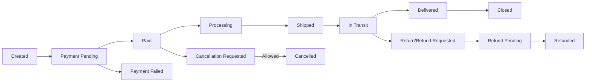
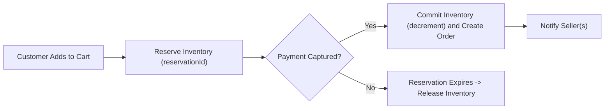
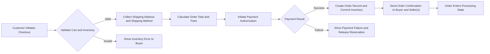
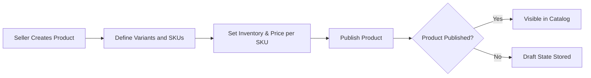

# Functional Requirements Specification — shoppingMall

## Document purpose and scope
This functional requirements specification defines business-level requirements for the shoppingMall e-commerce platform. It provides detailed, testable EARS-formatted requirements, workflows, and acceptance criteria for backend developers, QA, product managers, and operations. This document specifies WHAT the platform must do; it does not prescribe HOW to implement features (no database schema, API endpoints, or code).

Timezone: All time-related business expectations reference Asia/Seoul (KST). Durations are given in minutes, hours, or days to remain timezone-agnostic when applied.

Audience: Backend developers, product managers, QA engineers, operations, and security.

Minimum completeness target: 5,000+ characters focused on business logic and acceptance criteria.

## Executive summary
shoppingMall is a multi-vendor e-commerce marketplace enabling shoppers to discover products, select SKUs (variants such as color and size), persist carts and wishlists, place orders, and track shipments. Sellers manage product listings, SKUs, and per-SKU inventory. The platform supports order history, cancellations, refund requests, product reviews, and an admin dashboard for moderation and reporting.

Primary objectives:
- Prevent overselling through SKU-level inventory management and reservation rules.
- Provide reliable checkout with address management and payment processing that records clear payment states.
- Support sellers in listing products with multiple SKUs and managing inventory and fulfillment.
- Provide transparent order lifecycle and timely shipping/tracking updates.

Success metrics (examples; stakeholder to confirm numeric targets):
- Checkout success rate: >= 98% for valid payment attempts.
- Inventory consistency: <= 0.5% mismatch incidents per month.
- Order confirmation notification: delivered to buyer within 2 minutes of payment success for 95% of orders.

## User roles and responsibilities (business terms)
- guest: Browse catalog, use search, view products and sellers, add items to a temporary wishlist in-session. Cannot place orders or manage addresses.
- customer: Register, authenticate, manage multiple shipping addresses, manage persistent carts and wishlists, place orders and payments, track orders, request cancellations/refunds, and submit product reviews.
- seller: Register as merchant, create/manage product listings and SKUs, manage inventory per SKU, view orders containing their SKUs, update fulfillment/shipping status for their shipments, and respond to customer inquiries.
- supportAgent: Access orders for support workflows, process cancellations/refunds per policy, communicate with buyers and sellers, and escalate to admin when required.
- admin: Full platform oversight for user/seller management, product moderation, order escalations, policy configuration, and reporting.

## Authentication and Authorization (business requirements)
- WHEN a new user registers, THE shoppingMall SHALL capture email and password and SHALL send an email verification request; unverified accounts SHALL be prevented from placing orders until verification is completed (default verification window: 72 hours).
- WHEN a user authenticates successfully, THE shoppingMall SHALL create an authenticated session and SHALL allow optional persistent sessions via "remember me" with a configurable lifetime (default recommended: 30 days for refresh tokens, 15-30 minutes for access token sessions).
- IF an account experiences more than 10 failed login attempts within a 15-minute sliding window, THEN THE shoppingMall SHALL block further login attempts for 15 minutes and require password reset or admin intervention.
- WHEN a user initiates a password reset, THE shoppingMall SHALL send a single-use reset link expiring in 1 hour and SHALL invalidate existing sessions after a successful reset.

Permission matrix (business-level):
- guest: BrowseCatalog, SearchProducts, ViewProductDetails, TemporaryWishlist
- customer: All guest actions + ManageProfile, AddressManagement, PersistCart, PlaceOrder, ViewOwnOrders, WriteReview, RequestCancelRefund
- seller: All customer actions when acting as buyer + SellerProductManagement, InventoryManagement, ViewSellerOrders, UpdateShippingStatus
- supportAgent: ViewAllOrders, ProcessRefunds (limited by thresholds), UpdateOrderStatus, ModerateReviews
- admin: All permissions, including SuspendSeller, OverrideOrders, ConfigurePlatformRules

## Functional requirements (EARS where applicable)
All requirements below use EARS format where applicable. The phrase THE shoppingMall refers to the platform business system.

### 1) User registration, authentication, and address management
- WHEN a new user registers, THE shoppingMall SHALL create a user account with status "unverified" and SHALL send a verification email to the provided address. The verification token SHALL expire after 72 hours.
- IF the verification token expires, THEN THE shoppingMall SHALL prevent order placement until the user completes re-verification.
- WHEN a customer is authenticated, THE shoppingMall SHALL allow the customer to create, update, delete, and set a default shipping address. THE system SHALL allow a default maximum of 10 saved addresses per account (configurable by admin).
- IF a customer attempts to add an address missing mandatory fields (recipient name, street, city, postal code, country, phone), THEN THE shoppingMall SHALL reject the address save operation and SHALL present field-level validation errors to the user.
- WHEN a customer selects a saved address at checkout, THE shoppingMall SHALL record the address snapshot on the order to ensure historical correctness if the address changes later.

Acceptance criteria:
- Address CRUD operations SHALL complete within 2 seconds 95% of the time under normal load.
- Registration verification emails SHALL be delivered within 5 minutes of registration for 95% of attempts (subject to email provider variability).

### 2) Product catalog, categories, and search
- THE shoppingMall SHALL provide a product catalog organized into categories and subcategories that supports browsing and filtering by attributes like price, brand, rating, and availability.
- WHEN a seller publishes a product, THE shoppingMall SHALL index the product and make it searchable within 60 seconds under normal load.
- WHEN a shopper searches, THE shoppingMall SHALL return results ordered by business-configured relevance rules and SHALL provide common filters (price range, category, seller, rating, availability) with first-page results returned within 2 seconds for typical queries.
- WHEN a product has multiple SKUs, THE shoppingMall SHALL display a product-level page that allows selection of SKUs and SHALL show SKU-level availability and SKU images.

Acceptance criteria:
- Typical search queries (top 80% of queries) SHALL return first page within 2 seconds 95% of the time.
- Product publish-to-index visibility SHALL be <= 60 seconds for 95% of publishes.

### 3) Product variants (SKU) and SKU management
- THE shoppingMall SHALL model each sellable variant as an SKU with attributes map (e.g., color, size, option), price, SKU images, and inventory count.
- WHEN a seller defines variant attribute types (e.g., color, size) and values, THE shoppingMall SHALL auto-generate SKU combinations for valid permutation sets and SHALL allow sellers to edit SKU-specific fields including price override and inventory.
- IF a seller attempts to create more than 500 SKUs for a single product, THEN THE shoppingMall SHALL reject further SKU creation and SHALL return a clear error stating "SKU_LIMIT_EXCEEDED" (configurable limit).

Acceptance criteria:
- SKU edits (price or inventory) SHALL be reflected to shoppers within 60 seconds for 95% of updates.

### 4) Shopping cart and wishlist
- WHEN a guest adds items to a cart, THE shoppingMall SHALL create a temporary guest cart persisted server-side for 30 days unless converted on registration/login or cleared by the guest.
- WHEN a customer is authenticated, THE shoppingMall SHALL persist the customer's cart across sessions and devices and SHALL merge a guest cart into the customer's cart on successful login following deduplication rules (merge quantities up to available inventory).
- WHEN a customer adds an SKU to the cart, THE shoppingMall SHALL validate requested quantity against available inventory and SHALL reserve the requested quantity per inventory reservation rules (see Inventory section) and return a reservation identifier.
- WHEN a user adds items to a wishlist, THE shoppingMall SHALL support persistent wishlists for registered users and temporary session wishlists for guests; wishlists SHALL support notes and desired-quantity fields.

Acceptance criteria:
- Cart merge operation SHALL complete and be reflected to the user within 2 seconds for 95% of merges.
- Add-to-cart action SHALL complete in <= 1 second 99% of the time under normal load.

### 5) Checkout and payment processing
- WHEN a customer initiates checkout, THE shoppingMall SHALL validate cart contents, total pricing (including taxes and promotions), shipping address, and payment method before allowing payment authorization.
- WHEN the payment provider authorizes payment, THE shoppingMall SHALL create an order record capturing buyer, line items (skuId, quantity, unit price), shipping address snapshot, applied promotions, taxes, order total, and initial order status. The system SHALL move the reserved inventory into committed state according to inventory rules.
- IF payment authorization fails, THEN THE shoppingMall SHALL not finalize the order, SHALL release reserved inventory, and SHALL surface an actionable error message to the buyer describing the failure cause when available (e.g., card declined, insufficient funds, gateway error).
- WHERE partial capture is supported (multi-seller orders or split payments), THE shoppingMall SHALL represent payment state per-seller sub-order and SHALL allow per-seller capture retries per configured rules.

Acceptance criteria:
- Internal order creation and reservation step SHALL complete within 3 seconds 99% of the time excluding external gateway latency.
- Payment failure display SHALL provide a clear error and retry path and SHALL not create a finalized order record.

### 6) Order lifecycle and tracking
- THE shoppingMall SHALL expose the following customer-visible order states: "Created", "Payment Pending", "Paid", "Processing", "Shipped", "In Transit", "Delivered", "Cancelled", "Refund Pending", "Refunded", "Closed".
- WHEN a seller updates shipment status or attaches tracking (carrier name and tracking number), THE shoppingMall SHALL reflect the update to the buyer and supportAgent within 60 seconds for 95% of updates.
- WHEN carrier updates are available via integration, THE shoppingMall SHALL reconcile carrier milestones with platform shipment states and SHALL surface carrier-provided timestamps in the order timeline.

Acceptance criteria:
- Shipment/tracking updates SHALL be visible to the customer within 60 seconds of seller or carrier update in 95% of cases.

Mermaid diagram — Order Lifecycle:

### 7) Shipping status updates and notifications
- WHEN a seller marks an order-line as "Shipped" and provides carrier and tracking number, THE shoppingMall SHALL attach that tracking to the order and notify the buyer via email and in-app notification within 60 seconds (95% target).
- IF carrier integration provides event webhooks, THEN THE shoppingMall SHALL consume webhook events and update shipment state automatically; otherwise the seller SHALL update statuses manually.
- WHEN a shipment shows exception status (lost, delayed), THEN THE shoppingMall SHALL create a support task and assign a supportAgent according to SLA for manual resolution.

Acceptance criteria:
- Notification delivery for critical events (order confirmation, shipment) SHALL be attempted immediately and logged; email delivery success SHALL be >= 95% within 10 minutes accounting for provider variability.

### 8) Product reviews and ratings
- WHEN a customer purchased and received a SKU, THE shoppingMall SHALL permit the customer to submit a review and star rating for that SKU within a review eligibility window (default 365 days from delivery; configurable).
- IF a review is flagged by automated content checks (spam, profanity, PII, abusive language), THEN THE shoppingMall SHALL hide the review and queue it for manual admin moderation. Flagged reviews SHALL be labeled "Pending Moderation".
- IF a review is demonstrated to be fraudulent (e.g., evidence the reviewer did not purchase the SKU), THEN THE shoppingMall SHALL remove the review and record the action in the moderation audit log.

Acceptance criteria:
- Reviews from verified purchasers SHALL be labeled "Verified Purchase" and SHALL only appear after order delivery status is recorded.

### 9) Seller accounts and product management
- WHEN a prospective seller registers, THE shoppingMall SHALL capture required business information (business name, contact phone, business address) and SHALL set the seller account to "Pending Verification" until account checks pass.
- IF the platform requires manual approval for certain categories, THEN THE shoppingMall SHALL set product listings in those categories to "Pending Approval" until an admin approves them.
- WHEN a seller creates or updates product listings and SKUs, THE shoppingMall SHALL record the seller as the owner and SHALL prevent transfers of SKU ownership unless an admin-approved transfer occurs.

Acceptance criteria:
- Seller product creation flow SHALL return validation results (missing fields, policy violations) within 2 seconds 95% of the time.

### 10) Inventory management per SKU
- THE shoppingMall SHALL track availableInventory and reservedInventory per SKU, and SHALL provide audit records for inventory adjustments including actor (seller/system), timestamp, and reason.
- WHEN a customer initiates checkout and payment authorization, THE shoppingMall SHALL reserve the requested quantities for a configurable reservation window (default 15 minutes). Reservation records SHALL be auditable and include expiry timestamp and cart or order reference.
- IF reservation expires without payment capture, THEN THE shoppingMall SHALL release reserved quantities back to availableInventory immediately.
- IF a seller attempts to update inventory to a value less than reservedInventory for active reservations, THEN THE shoppingMall SHALL reject the update and SHALL surface a reconciliation-required state for supportAgent.

Acceptance criteria:
- Inventory reservations SHALL be visible to seller and admin dashboards and SHALL be released within 1 second of expiry in normal operations.

Mermaid diagram — Inventory Reservation Flow:

### 11) Order history, cancellation, and refund requests
- WHEN a customer views order history, THE shoppingMall SHALL list all orders with state, line-item level details, seller attribution, and timestamps for key events.
- IF a customer requests cancellation before items are shipped and within the configured cancellation window, THEN THE shoppingMall SHALL accept the cancellation and SHALL initiate refund processing according to payment provider policies.
- WHEN a refund is approved, THE shoppingMall SHALL record refund metadata (amount, reason, initiator role, timestamps) and SHALL notify buyer and seller of the refund status.
- WHEN refunds result in restocking, THE shoppingMall SHALL increase availableInventory accordingly unless the seller provides evidence that goods were not restocked.

Acceptance criteria:
- Cancellation requests when eligible SHALL be acknowledged to the customer within 10 minutes and processed per policy within 24 hours.

### 12) Admin dashboard and management operations
- THE shoppingMall SHALL provide admin actors with audit-enabled operations for viewing and filtering orders, viewing seller accounts, moderating reviews, and overriding order states as required for dispute resolution.
- WHEN an admin changes an order state or issues a refund, THE shoppingMall SHALL create an auditable entry including admin actor id, action, timestamp, and reason; audit logs SHALL be retained per platform retention policy.

Acceptance criteria:
- Admin actions SHALL be recorded and retrievable by audit queries within 2 seconds for the most recent 30 days of log entries.

## Business rules and validation constraints
- Inventory ownership: THE shoppingMall SHALL treat SKU inventory as the responsibility of the seller who listed the SKU. Sellers are responsible for accurate inventory data and replenishment.
- Reservation rules: WHEN a payment authorization occurs, THE shoppingMall SHALL reserve inventory immediately for a default 15-minute window and SHALL move reserved inventory to committed inventory on payment capture.
- Oversell prevention: IF the finalization step would cause availableInventory to become negative due to concurrent activity, THEN THE shoppingMall SHALL fail the conflicting checkout and SHALL notify the customer of the specific SKU(s) causing the failure with alternatives where possible.
- Refund eligibility: THE shoppingMall SHALL allow refund requests within 14 calendar days after delivery for standard goods by default; this window is configurable per category and per seller policy but SHALL not be shorter than platform minimum without stakeholder agreement.
- Review eligibility: THE shoppingMall SHALL allow reviews from verified purchasers only; non-purchaser reviews SHALL be rejected.

## Primary user stories and use cases
(Each story includes preconditions, flow, and success criteria — representative samples below.)

### Customer: Register and Checkout
- Preconditions: Customer has valid email and password and at least one payment method and shipping address saved.
- Flow: Register -> Verify Email -> Add Address -> Add SKU to Cart -> Checkout -> Payment Authorized -> Order Confirmed -> Receipt Sent
- Success criteria: Order created and payment authorized; order confirmation delivered to buyer within 2 minutes.

### Seller: Create Product with SKUs
- Preconditions: Seller account is active and verified for required categories.
- Flow: Create Product -> Define Variant Attributes -> Generate/Edit SKUs -> Set Inventory -> Publish
- Success criteria: Product searchable, SKUs visible with correct inventory and price.

### SupportAgent: Handle Refund
- Preconditions: Refund request created by customer and within eligibility window.
- Flow: SupportAgent reviews order and evidence -> Approves refund -> Refund processed -> Notifications sent
- Success criteria: Refund record created and payment provider refund initiated; order state updated to "Refund Pending" then "Refunded" when settled.

## Conceptual data entities and relationships (business-level)
- User (userId, role, email, verifiedFlag, displayName)
- Address (addressId, userId, recipientName, street, city, postalCode, country, phone)
- SellerProfile (sellerId, displayName, status, payoutSettingsReference)
- Product (productId, sellerId, title, description, categoryId, images)
- SKU (skuId, productId, attributesMap, price, inventoryCount)
- Cart (cartId, userId or guestToken, lineItems[skuId, quantity])
- Wishlist (wishlistId, userId or guestToken, skuEntries)
- Order (orderId, buyerId, orderItems[skuId, quantity, unitPrice, sellerId], orderTotal, shippingAddressSnapshot, status, paymentState)
- Shipment (shipmentId, orderId, sellerId, carrier, trackingNumber, status)
- Review (reviewId, skuId, buyerId, rating, text, moderatedFlag)
- RefundRequest (refundRequestId, orderId, requesterId, reason, status)

Relationships (business view):
- User may have many Addresses, Carts, Wishlists, Orders, and Reviews
- SellerProfile owns Products; Product contains multiple SKUs; SKU belongs to one Product
- Order contains one or more OrderItems referencing SKUs; each OrderItem is attributable to a Seller
- Shipment is associated with an Order (or subset of OrderItems) and a Seller

## Critical workflows and sequence flows
### Checkout and Order Placement (Business Flow)

### Seller product management

## Non-functional requirements and priorities
- Performance: THE shoppingMall SHALL return search results within 2 seconds for the top 80% of queries and SHALL complete core checkout creation/reservation steps within 3 seconds for 99% of requests under normal load.
- Availability: THE shoppingMall SHALL target 99.5% availability for buyer-facing flows during business hours in primary region.
- Reliability: THE shoppingMall SHALL ensure a successful payment results in an order record 99.9% of the time and SHALL log failures for reconciliation.
- Security & Data Protection: THE shoppingMall SHALL enforce email verification and protect PII according to applicable law; payment card data storage SHALL be minimized, with tokenization recommended by implementation team.
- Scalability: THE shoppingMall SHALL be designed to scale horizontally for catalog and order workloads; initial load assumptions to be provided by stakeholders.

## Acceptance criteria and EARS-formatted requirements (representative)
- WHEN a guest adds an SKU to cart, THE shoppingMall SHALL reserve the requested quantity for 15 minutes and return a reservation identifier.
- IF the reserved time expires without payment, THEN THE shoppingMall SHALL release the reserved inventory back to available stock within 1 second of expiry.
- WHEN a customer completes payment successfully, THE shoppingMall SHALL convert reservations into permanent decrements and mark the order as "Paid" within 30 seconds of payment confirmation.
- WHEN a seller updates an SKU inventory count, THE shoppingMall SHALL record the change with actor and timestamp and SHALL reflect new availability to customers within 60 seconds.
- WHEN a customer requests cancellation before shipment, THE shoppingMall SHALL allow cancellation if within policy and SHALL notify seller(s) and supportAgent within 10 minutes.

## Open questions and decisions required
- Payment gateway selection and whether to support authorize-then-capture or immediate capture semantics at MVP.
- Shipping carrier integrations for real-time tracking vs manual tracking by sellers.
- Final refund windows and category-specific refund rules (default recommended: 14 days post-delivery for returns, 30 days for refunds on undelivered orders).
- Seller onboarding policy and KYC threshold for mandatory verification.
- SKU-per-product upper limit and address count per customer (defaults suggested: 500 SKUs per product, 10 addresses per customer).
- Promotion/Coupon behavior and stacking rules.

## Appendix: glossary and conventions
- SKU: Stock Keeping Unit — represents a specific variant of a product.
- Reservation: Temporary hold on inventory during checkout until payment capture or expiry.
- Order-line: The item-level record inside an order representing SKU, quantity, and seller attribution.

## Implementation boundary statement
This document contains business-level functional requirements only. Detailed technical implementation (APIs, schema, vendor libraries) is left to development teams.

