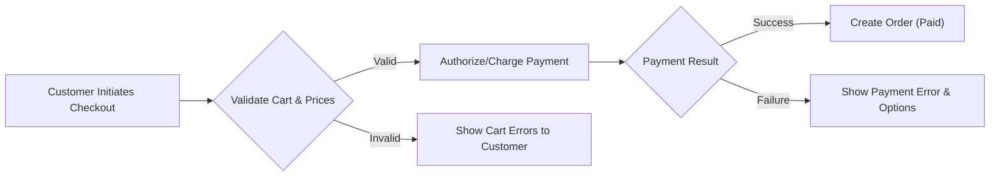

# Shopping Mall - Documentation Index

## Purpose
Provide a single entry point for the shoppingMall requirements documentation set. Use the entries below to navigate to business requirements, actor definitions, workflows, and operational guidance. The ToC is ordered for developer onboarding: start with Service Overview, then User Actors, Functional Requirements, and supporting operational documents.

## How to use this documentation set (practical guidance)
- Read artifacts in the following sequence for implementation context and traceability: 01-service-overview.md -> 02-user-actors.md -> 03-functional-requirements.md -> 04-user-stories.md -> 05-user-flows.md -> 07-external-integrations.md -> 08-order-and-payment-workflows.md -> 09-inventory-and-seller-management.md -> 10-admin-dashboard-and-reporting.md.
- Treat all requirement statements in EARS format (WHEN / THE / SHALL / IF / THEN) as the authoritative behavioral contract for the backend implementation and QA acceptance tests.
- Do not modify business requirements to include implementation details (APIs, DB schema, or UI). Implementation artifacts (API contracts, Prisma models, DB migrations) must be created in separate technical documents and reference the business requirements here.
- Map each EARS requirement to at least one automated acceptance test. Record mapping in the project test-tracking system; include requirement id or leading sentence in test case metadata for traceability.
- For any ambiguity in business statements, raise a single clarifying question in the project issue tracker and record the decision as an amendment to the requirements with a timestamp and owner.

## Quick links to project documents
- 00-toc.md — Documentation Index (this file). Start here for navigation and developer autonomy note.
- 01-service-overview.md — Service vision, objectives, MVP scope, KPIs, and launch acceptance criteria. Audience: product managers, architects, and developers. Use to align implementation priorities with business goals. Path: ./01-service-overview.md
- 02-user-actors.md — Authenticated user actors, token/session expectations, and role permission summaries. Audience: backend developers and security. Use for designing authentication, authorization, and permission checks. Path: ./02-user-actors.md
- 03-functional-requirements.md — Complete EARS-formatted functional requirements across registration, catalog, SKUs, cart, checkout, orders, payments, reviews, seller features, inventory, and admin. Audience: backend developers and QA. Use as the authoritative source for feature behavior and acceptance criteria. Path: ./03-functional-requirements.md
- 04-user-stories.md — User stories and measurable acceptance criteria mapped to epics and prioritized for MVP. Audience: product owners, developers, QA. Use to derive implementation tasks and test cases. Path: ./04-user-stories.md
- 05-user-flows.md — Detailed business process flows and mermaid diagrams for checkout, fulfillment, returns, seller onboarding, and profile management. Audience: implementation and QA teams. Use for state-machine design and integration sequencing. Path: ./05-user-flows.md
- 06-business-model.md — Revenue strategy, seller economics, monetization timeline, and KPIs. Audience: product and business stakeholders. Use to prioritize monetization and settlement features. Path: ./06-business-model.md
- 07-external-integrations.md — Business-level expectations for payments, carriers, notifications, search provider, and compliance obligations (PCI/GDPR). Audience: integration engineers and SRE. Use when selecting vendors and designing integration error handling and retries. Path: ./07-external-integrations.md
- 08-order-and-payment-workflows.md — Canonical order lifecycle, authorization/capture rules, cancellations, refunds, disputes, and chargeback handling. Audience: payments, operations, backend developers. Use for payment orchestration and order state machines. Path: ./08-order-and-payment-workflows.md
- 09-inventory-and-seller-management.md — SKU model, reservation semantics, reconciliation processes, seller SLAs, and penalties for misrepresentation. Audience: merchant operations and backend developers. Use to design inventory primitives and reconciliation jobs. Path: ./09-inventory-and-seller-management.md
- 10-admin-dashboard-and-reporting.md — Admin responsibilities, moderation workflows, reporting requirements, audit trail expectations, and export/retention rules. Audience: admins, operations, and developers. Use to implement admin tooling and reporting pipelines. Path: ./10-admin-dashboard-and-reporting.md

## Document reading order and onboarding checklist
1. Read 01-service-overview.md to align on vision, KPIs, and MVP. Note target metrics and SLAs.
2. Read 02-user-actors.md and finalize authentication/session design (JWT claims, roles, token lifetimes).
3. Read 03-functional-requirements.md and extract EARS statements into a requirements backlog (one backlog item per EARS sentence or logical group).
4. Read 04-user-stories.md to identify acceptance tests and map each story to EARS-backed requirements.
5. Read 07-external-integrations.md and identify the external provider capabilities required for payments, carriers, notifications, and search.
6. Read 08-order-and-payment-workflows.md and 09-inventory-and-seller-management.md to finalize state machines for orders and inventory reservations.
7. Read 10-admin-dashboard-and-reporting.md for audit and moderation requirements that affect data models and logging.

## Conventions and editorial rules
- Language: en-US for all human-readable content. All code samples, comments, and generated artifacts SHALL be in English.
- Timezone context: Asia/Seoul (UTC+9). Use this timezone when interpreting SLA windows and scheduling jobs in acceptance tests unless otherwise specified per jurisdiction.
- Requirement format: All behavioral requirements MUST be expressed using EARS-style statements (WHEN/IF, THE, SHALL, THEN) in functional documents. Use these statements verbatim as acceptance criteria anchors.
- Mermaid diagrams: All diagrams MUST use double-quoted labels for nodes and no spaces between brackets and quotes (example: A["User Login"]). Use the corrected arrow syntax (-->). Example corrected snippet:

```mermaid
graph LR
  A["Customer Initiates Checkout"] --> B{"Validate Cart & Prices"}
  B -->|"Valid"| C["Authorize/Charge Payment"]
  B -->|"Invalid"| D["Show Cart Errors to Customer"]
  C --> E{"Payment Result"}
  E -->|"Success"| F["Create Order (Paid)"]
  E -->|"Failure"| G["Show Payment Error & Options"]
```

- Diagrams in other files that do not follow the double-quote convention must be corrected before merging into the canonical branch.

## Versioning and change log guidance
- Use semantic versioning for documentation releases: vMAJOR.MINOR.PATCH. Update the top-level file metadata and add a brief entry to the Change Log section when requirements change.
- Record the following metadata for each change: date (ISO 8601), author (handle/email), affected files, and a short rationale. Store Change Log entries in a dedicated changelog file or in the document header of the modified files.
- For any business-logic changes after implementation begins, create an Amendments record with: original EARS text, amended text, reason, approver, and effective date.

## Ownership and contacts
- Document owner (primary): product-owner@example.com — responsible for clarifying business intent and approving requirement amendments.
- Technical owner (integration/architecture): arch-lead@example.com — responsible for technical translation of requirements into APIs and data models.
- Operations contact (payments/carriers): ops-payments@example.com — responsible for provider reconciliation and escalations.
- For security and compliance questions (PCI/GDPR): security@example.com

## QA mapping and acceptance checklist (practical)
- For each EARS requirement in 03-functional-requirements.md, create at least one automated acceptance test in the QA system. Tag tests with the requirement first line for traceability.
- Verify performance SLAs by load testing: catalog search 95th percentile <= 300ms, checkout authorization 95th percentile <= 7s, and inventory update propagation 95th percentile <= 60s.
- Create negative-path tests for each IF condition in EARS statements (e.g., WHEN payment fails, THEN show error within X seconds).
- Ensure all external integration failure modes are covered with contract tests and simulated provider error responses.

## Release and handoff checklist for developers
- Convert EARS statements into technical stories with clear acceptance criteria and test cases.
- Produce API contract drafts (OpenAPI) that align with EARS requirements; include idempotency and error-code mappings.
- Produce data model proposals (Prisma or equivalent) with SKU-level inventory primitives, order state machine, and audit trail schemas.
- Implement integration mocks for payments, carriers, and notification providers to allow end-to-end tests without vendor dependency.
- Include migration plans and data-backfill steps if schema changes affect historical records.

## Related documents and where to find them
- Service vision and overview: ./01-service-overview.md
- User actors and token expectations: ./02-user-actors.md
- Functional requirements (EARS): ./03-functional-requirements.md
- User stories and acceptance criteria: ./04-user-stories.md
- Process diagrams and flows: ./05-user-flows.md
- Business model, monetization and KPIs: ./06-business-model.md
- External integrations and compliance: ./07-external-integrations.md
- Order and payment lifecycle: ./08-order-and-payment-workflows.md
- Inventory and seller controls: ./09-inventory-and-seller-management.md
- Admin dashboard and reporting: ./10-admin-dashboard-and-reporting.md

## Document maintenance and branching rules
- Use a documentation branch per major release (example: docs/v1.0) and create pull requests for changes. All changes require one approving review from Product Owner and one from a Technical Owner for substantive requirement changes.
- Minor editorial updates (typos, formatting) may be merged by Documentation Maintainers with a record in the change log.
- For any correction that alters an EARS requirement semantics, record an amendment entry and notify the stakeholders listed in Ownership and contacts.

## Glossary (selected)
- SKU: Stock Keeping Unit — variant-level sellable unit with independent inventory and price.
- GMV: Gross Merchandise Value — total item sales value across the marketplace.
- AOV: Average Order Value.
- SLA: Service Level Agreement (business-level time bound commitment).
- PAN: Primary Account Number (card number). Platform SHALL NOT store PANs — use tokenization via PCI-certified providers.

## Legal and compliance notes (business-level)
- Follow regional laws for data retention and privacy. Default retention for transactional records is a minimum 7 years unless local law requires otherwise. GDPR rights (access/erasure) apply for EU/EEA residents and must be handled within the timeframes defined in the External Integrations document.
- Payment card data must be processed through PCI-compliant tokenization providers. The platform SHALL NOT store unencrypted PANs.

Related artifacts: API contract drafts, technical design docs, and deployment runbooks belong in the technical documentation repository. Use the mapping in the "How to use" section to convert EARS requirements into technical artifacts.

Developer autonomy note: Developers have full responsibility and autonomy to design and implement technical solutions (APIs, database schemas, service architecture, and vendor selection) that satisfy the business requirements expressed in these files. All technical designs must implement the EARS requirements verbatim, pass compiler and test-suite validation, and include traceability back to the originating EARS statements. Developers must record technical decisions in the project technical spec repository and include references to the exact requirement lines that motivated each decision.