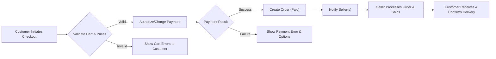
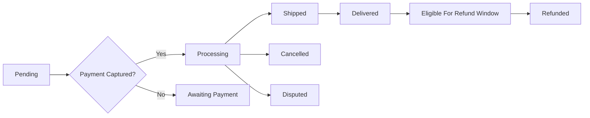
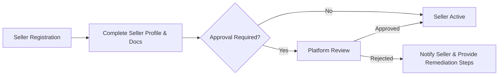
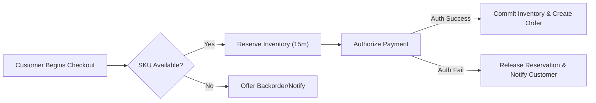

# shoppingMall — Requirements Analysis Report

## Executive Summary
shoppingMall is a multi-seller e-commerce marketplace enabling customers to discover products, choose SKU-level variants (color, size, options), and purchase items from third-party sellers. The platform provides seller tools for catalog and inventory management, an admin layer for moderation and dispute resolution, and integration points for payments, carriers, notifications, and search.

Primary business objectives:
- Achieve predictable order fulfillment and low oversell rates through SKU-level inventory and reservation semantics.
- Enable a sustainable revenue model via commissions, subscriptions, and optional fulfillment services.
- Provide clear operational SLAs for payments, shipping updates, and refunds to maintain customer trust.

Key success metrics (examples):
- Gross Merchandise Value (GMV) target and monthly growth rates
- Payment authorization success >= 98%
- Oversell incidents < 0.1% of orders/month
- Seller on-time shipment rate >= 95%
- Refund processing SLA: 95% initiated within 48 hours of approval

## Service Scope and Non-Goals
In-scope (business functions): registration and account management, product catalog and SKUs, cart and wishlist, checkout and payments, order lifecycle and shipping updates, product reviews and moderation, seller portal, SKU-level inventory, order history/cancellations/refunds, and admin dashboard for moderation and reporting.

Out-of-scope (business items left to other documents): UI/UX designs, API endpoint contracts, database schema details, vendor selection specifics (payment or shipping vendors), and low-level infra runbooks.

## Actors and Authentication (Business-Level Requirements)
Actors (business terms): customer, seller, admin.

Authentication and session rules (EARS):
- WHEN a user registers, THE system SHALL create an account in an "email_unverified" state and SHALL send a verification token that expires in 24 hours.
- WHEN a verified user authenticates successfully, THE system SHALL issue an access token and a refresh token to enable authenticated sessions.
- WHEN an access token expires, THE system SHALL allow clients to exchange a valid refresh token for a new access token and SHALL rotate the refresh token on use.
- IF a refresh token is revoked or detected reused after rotation, THEN THE system SHALL revoke all refresh tokens for the user and require reauthentication.
- WHERE an account is high-risk or under investigation, THE system SHALL prevent token issuance and suspend new session creation.

Token lifetimes (business guidance):
- Access token: short-lived (business recommendation: 15 minutes)
- Refresh token: configurable (business recommendation: 14 days standard, 30 days for "remember this device")
- MFA: optional; WHEN enabled for an account, THE system SHALL require MFA at login for sensitive actions (seller payouts, admin financial overrides)

JWT claims (business-level expectations):
- userId, role ("customer" | "seller" | "admin"), permissions array, sellerId or tenantId (if applicable), issuedAt, expiry

## Permission Matrix (Business Terms)
- customer: register/login, manage addresses and payments, add to cart/wishlist, place orders, view own order history, submit reviews for purchased SKUs, request cancellations/refunds.
- seller: register as seller, create and manage products and SKUs, update inventory, view and process orders for own catalog, update shipping/tracking, respond to refunds and buyer messages.
- admin: moderate listings and reviews, approve/suspend sellers, process refunds, access platform-wide reports, and perform escalated account and order operations.

Dual-control rules:
- WHEN a refund exceeds configured thresholds, THE system SHALL require a second admin approval before funds are released.

## Functional Requirements (EARS) — Core Areas
All requirements below use EARS phrasing and include measurable acceptance criteria where applicable.

### Registration & Account Management
- THE system SHALL allow user registration via email and password with password rules (min 10 chars, at least one upper/lowercase, digit, special char).
  - Acceptance: Successful registrations create an unverified account and issue verification token within 2 seconds.
- WHEN a user verifies email within 24 hours, THE system SHALL transition account to active and permit order placement.
- THE system SHALL retain anonymized transactional records for compliance when a user deletes account; personal PII SHALL be anonymized within 30 days while transactional records retained for 7 years.
- THE system SHALL allow up to 10 saved shipping addresses per customer and SHALL prevent deletion of addresses tied to unshipped orders (error code: ADDR_IN_USE).

### Product Catalog, Categories & Search
- THE system SHALL support hierarchical categories and multi-category assignments for products.
- WHEN a seller publishes a product, THE system SHALL require a title, primary category, at least one SKU, and a default price.
- THE system SHALL provide keyword search with filters (category, price range, brand, seller, SKU attributes) and default relevance ranking; alternative sorts: price_asc, price_desc, newest, best_seller.
- Performance acceptance: typical search queries returning top 20 results SHALL return within 300 ms 95% of the time under nominal load.

### Product Variants and SKU Model
- THE system SHALL model products as containers for SKUs; each SKU SHALL represent a unique combination of variant attributes (e.g., color, size).
- EACH SKU SHALL have: SKU code, price (or price override), inventory count, optional weight/dimensions, and optional ship profile.
- WHEN sellers create SKUs, THE system SHALL enforce attribute consistency across SKUs of the same product (same attribute set names).

### Cart, Wishlist & Reservation
- THE system SHALL provide persistent carts per customer account retained for 90 days of inactivity.
- WHEN an item is added to cart, THE system SHALL NOT reserve inventory by default; reservation SHALL occur at checkout except when seller opt-in to "hold on add-to-cart" is enabled.
- WHERE seller enables "hold on add-to-cart", THE system SHALL reserve items for a configurable hold window up to 15 minutes.
- THE system SHALL support wishlists up to 500 items and SHALL not reserve inventory for wishlist items.

### Checkout, Order Creation & Payment
- WHEN checkout is initiated, THE system SHALL validate SKU availability and price consistency and shall compute taxes and shipping.
- IF any SKU quantity exceeds sellable inventory, THEN THE system SHALL return an itemized message and prevent placement for affected lines.
- THE system SHALL support both authorize-only and immediate-capture payment flows. The chosen flow per transaction is configurable.
- Payment SLA: THE system SHALL receive payment provider authorization definitive success/failure within 7 seconds 99% of the time; timeouts shall set order state to payment_timeout_pending.

### Order Lifecycle & Shipping
- THE system SHALL model core order states: pending, authorized, paid, processing, shipped, delivered, cancelled, refunded, disputed.
- WHEN sellers mark items as shipped, THE system SHALL transition to shipped and accept carrier name and tracking number.
- WHEN carrier events indicate delay or exception, THE system SHALL notify customer and flag for seller follow-up.
- Shipping SLA: Sellers SHALL update shipping status within 72 hours of payment capture; failure metrics used for seller scoring.

### Inventory Management
- THE system SHALL maintain inventory per SKU per seller with available, reserved, committed quantities.
- WHEN an order is placed and payment captured, THE system SHALL atomically decrement inventory to avoid oversells. On concurrent update failure, THE system SHALL retry up to 3 times then revert payment and notify ops.
- THE system SHALL require audit reason for manual adjustments >10 units or >20% change.
- THE system SHALL perform daily reconciliation and flag discrepancies > configurable threshold (default 2%).

### Seller Portal & Onboarding
- THE system SHALL allow sellers to register and provide business/legal information. Seller account SHALL be 'pending' until required docs are verified.
- WHEN a seller's refund rate exceeds configured threshold within 30 days, THEN THE system SHALL flag for review and may limit promotions until resolved.
- Seller SLA: sellers SHALL respond to order inquiries within 24 hours and update shipping within 72 hours.

### Reviews & Ratings
- THE system SHALL allow verified purchasers to submit a review per SKU and record purchase verification status.
- IF review content flags as abusive or disallowed, THEN THE system SHALL hide it and place it in moderation queue for admin review within 48 hours.
- Customers SHALL be able to edit/delete review within 48 hours; after that reviews immutable unless admin intervenes.

### Returns, Cancellations & Refunds
- THE system SHALL retain order history at least 7 years for compliance.
- WHEN a cancellation request is made, THE system SHALL allow cancellations in 'pending' or 'authorized' states within 60 minutes of placement unless policy differs by seller.
- IF cancellation after fulfillment initiated, THEN system SHALL initiate return and follow refund policy timelines.
- Refund SLA: THE system SHALL initiate provider refunds within 72 hours of approval.

### Admin Dashboard & Moderation
- THE system SHALL allow admins to delist products, suspend sellers, process refunds, and access platform-wide reports.
- WHEN admin suspends seller, THE system SHALL prevent new listings/orders but preserve in-flight orders for fulfillment.
- THE system SHALL record audit trails for all admin actions with admin id, timestamp, and reason.

## Business Rules & Validation (Selected)
- THE system SHALL prevent negative inventory; any operation producing negative inventory SHALL be rejected with SKU_NEGATIVE_INVENTORY error.
- THE system SHALL ensure final item price after discounts is non-negative and within configurable platform caps.
- WHEN promotions apply, precedence rules SHALL be configurable; by default: item-level coupons override seller-level discounts which override platform promotions.
- Reviews labeled 'verified purchase' SHALL be tied to order records showing customer purchased the exact SKU.
- Input formats: email RFC5322, phone E.164, country code ISO 3166-1 alpha-2, monetary values in smallest currency unit.

## External Integrations — Business Expectations
Payments:
- Support tokenization and PCI-conformant flows; no PAN stored on-platform.
- Authorization latency target: 95th percentile <= 3s; retry transient failures up to 2 times.
- Reconciliation: daily settlement reconciliation and alerts on discrepancies >0.1% of daily GMV.

Shipping/Carriers:
- Accept carrier tracking numbers and update tracking UI; webhook-driven updates reflected within 5 minutes in 90% of events.
- Poll carriers where webhooks absent; escalation on missing updates beyond threshold.

Notifications (Email/SMS):
- Transactional messages delivered within 60s to provider; retries with exponential backoff; failover to secondary provider when required.

Search & Indexing:
- Product/SKU updates reflected in search index within 60s for 95% of changes; median search latency 150ms, 95th <= 500ms.

Compliance:
- GDPR: honor data subject requests within 30 days; provide data export and deletion flow subject to retention constraints.
- PCI-DSS: use tokenization; do not persist PANs; follow encryption-in-transit and at-rest rules.
- Retention: transactional data retained 7+ years for tax/compliance; audit logs kept per jurisdiction rules.

## Error Handling and Business-Facing Recovery Flows
Examples of business-facing error codes and behavior:
- AUTH_INVALID_CREDENTIALS: invalid login; after 10 failed attempts account locked 15 minutes.
- PAYMENT_DECLINED: payment declined; show retry options and alternative payment methods.
- PAYMENT_TIMEOUT: provider unresponsive; mark order payment_timeout_pending and offer retry.
- SKU_OUT_OF_STOCK: present itemized SKUs and suggested actions.
- RESERVATION_EXPIRED: reservation window expired; prompt re-checkout and re-reserve.

Recovery guidance:
- Transient provider errors shall be retried per configured backoff and recorded with error codes for support.
- All user-visible errors SHALL include an error code and short remediation guidance.

## Performance SLAs (Business Targets)
- Login/registration: respond within 2s for 95% of requests under nominal load.
- Product listing page (20 items): <= 500ms 95% of time.
- Search top 20 results: <= 300ms 95% of time.
- Checkout reservation: <= 5s 95% of time.
- Inventory update visibility: <= 60s 95% of time.

## Acceptance Criteria and Test Scenarios
Registration:
- GIVEN a valid email and strong password, WHEN registration submitted, THEN account created as unverified and verification email sent within 2s.

Checkout:
- GIVEN cart with sufficient inventory, WHEN checkout initiated, THEN reservation placed within 5s and authorization completed within 7s 99% of the time.

Concurrency/oversell:
- WHEN 1000 concurrent purchases attempt final unit of SKU, THEN at-most-one order shall be committed for that unit across all attempts in 100% of test runs.

Refunds:
- GIVEN refund approved, WHEN admin triggers refund, THEN refund initiation recorded and attempt made to provider within 48 hours.

## Workflows and Mermaid Diagrams
Checkout flow:

Order lifecycle:

Seller onboarding:

Inventory reservation and commit:

All mermaid labels use double-quoted node labels and standard arrow syntax; diagrams are suitable for rendering and review by implementation teams.

## Reporting, Monitoring, and Admin Controls
Reporting cadence and retention:
- Daily financial summary generated at off-peak window and retained for at least 7 years for compliance.
- Near-real-time operational dashboard (latency target 60s) for payment failures, shipping exceptions, and reconciliation alerts.

Audit and dual-control:
- Admin actions that affect financial state SHALL require dual-approval when above configured monetary thresholds and SHALL be fully auditable (admin id, timestamp, justification).

Alerts and escalation:
- Refund rate exceeds threshold -> notify operations and open investigation case.
- Inventory reconciliation discrepancy above threshold -> notify merchant ops and seller.

## Security, Compliance, and Data Retention
- PCI: THE platform SHALL not store PANs and SHALL use a PCI-certified processor for card tokenization.
- GDPR: THE platform SHALL honor data subject requests within 30 days and SHALL maintain evidence of lawful basis for processing.
- Retention: transactional data retained for minimum 7 years for tax/compliance; PII purge/anonymization rules applied on deletion requests subject to retention constraints.

## Acceptance Test Checklist (for QA)
- EARS requirements mapped to test cases and automated where feasible.
- Load tests validating checkout, search, and reservation SLAs at 2x and 5x baseline traffic.
- Reconciliation tests that create inventory variance and validate detection and remediation within defined SLAs.
- Security tests: token revocation, refresh token rotation, MFA flows, and admin dual-control paths.

## Glossary
- SKU: Stock Keeping Unit
- GMV: Gross Merchandise Value
- AOV: Average Order Value
- SLA: Service Level Agreement
- PAN: Primary Account Number

## Next Steps for Implementation
- Map EARS requirements to API contracts and database schemas.
- Create acceptance test suites for each EARS requirement and performance SLA.
- Select providers for payments, notifications, search, and carriers and configure failover/monitoring policies.
- Implement audit capture for all admin and financial actions.

## Appendix: Example Business Error Codes (Reference)
- AUTH_INVALID_CREDENTIALS
- AUTH_ACCOUNT_LOCKED
- AUTH_TOKEN_EXPIRED
- SKU_OUT_OF_STOCK
- ADDR_IN_USE
- ADDR_LIMIT_REACHED
- PAYMENT_DECLINED
- PAYMENT_TIMEOUT
- RESERVATION_EXPIRED
- REFUND_FAILED

