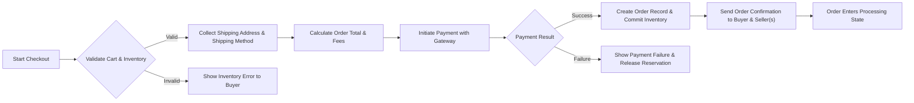
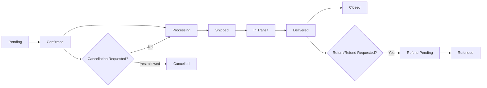

# Functional Requirements — shoppingMall

## Scope and Audience
shoppingMall is a multi-vendor e-commerce marketplace focused on SKU-level variant support, seller-managed listings, and buyer-facing reliability for checkout, shipping, and refunds. Intended audience: product managers, backend developers, QA, operations, and stakeholders responsible for accepting business-level features. Requirements use EARS format where applicable and present measurable acceptance criteria.

## Roles and High-Level Responsibilities
- guest: Browse catalog, search, view product and seller pages, create a temporary wishlist. Cannot place orders or manage addresses.
- customer: Register/login, manage profile and multiple shipping addresses, create and persist carts and wishlists, place orders and payments, track orders, request cancellations/refunds, write product reviews for purchased SKUs.
- seller: Create and manage product listings and SKUs, maintain SKU-level inventory and images, view and fulfill orders containing their SKUs, update shipment tracking and statuses.
- supportAgent: View and update orders for support purposes, process refunds and cancellations following policy, moderate flagged reviews, and escalate to admin when needed.
- admin: Platform-wide oversight, moderation, configuration, audit logs, seller suspension/approval, and dispute adjudication.

## Authentication and Authorization (Business-Level)
- WHEN a new user registers, THE shoppingMall platform SHALL create an account and SHALL send a verification email to the provided address. Accounts SHALL remain restricted from placing orders until verification completes unless an alternative verification path is approved by policy.
- WHEN a user authenticates successfully, THE shoppingMall platform SHALL establish a session and SHALL honor a business-configurable persistent login option. Authentication success responses SHALL be delivered to the user interface within 2 seconds for 95% of valid attempts under normal load.
- IF an account experiences more than 10 failed login attempts within a 15-minute sliding window, THEN THE shoppingMall platform SHALL temporarily lock authentication for that account for 15 minutes and SHALL require password reset or supportAgent intervention for reactivation.
- WHEN supportAgent or admin-level actions are performed (refunds, seller suspension), THE shoppingMall platform SHALL record the acting actor, timestamp, and reason and SHALL display this data in audit logs accessible by authorized roles.

Role Permission Matrix (business view):
- guest: BrowseCatalog, SearchProducts, ViewProduct
- customer: ManageProfile, CartManagement, PlaceOrder, ViewOwnOrders, WriteReview
- seller: SellerProductManagement, InventoryManagement, ProcessSellerOrder, UpdateShippingStatus
- supportAgent: ViewAllOrders, SupportOrderUpdate, ModerateReviews, ProcessRefunds (per policy)
- admin: AdminFull (all operations, including override and audit)

## User Registration and Address Management
- WHEN a user registers, THE shoppingMall platform SHALL require email and password and SHALL request acceptance of terms. THE platform SHALL verify email ownership before enabling order placement by default.
- WHEN a customer adds a shipping address, THE shoppingMall platform SHALL require recipient name, address line1, city, postal code, country, and phone. IF any required field is missing, THEN THE shoppingMall platform SHALL reject the input and return field-level errors.
- WHEN a customer adds or updates addresses, THE shoppingMall platform SHALL allow up to 10 saved addresses per account by default; the max SHALL be configurable by admin policy.
- IF a customer deletes an address that is currently assigned to a pending order, THEN THE shoppingMall platform SHALL prevent deletion and prompt the customer to select an alternate shipping address for the pending order.

Acceptance Criteria
- Registration verification email SHALL be delivered within 5 minutes for 99% of cases.
- Address create/update API SHALL return validation errors within 2 seconds under normal load.

## Product Catalog, Categories, and Search
- THE shoppingMall platform SHALL support hierarchical categories and tags for product discovery. Sellers SHALL assign at least one category per product.
- WHEN a product is published, THE shoppingMall platform SHALL index product metadata (title, brand, category, searchable attributes) and make the product searchable within 30 seconds in 95% of publish events under normal load.
- WHEN a customer searches, THE shoppingMall platform SHALL return paginated results (default page size 20) ordered by relevance; customers SHALL be able to filter by category, price range, seller, availability, and rating.
- WHEN search terms include typos or partial words, THE shoppingMall platform SHALL return relevant fuzzy matches and SHALL highlight matching terms in results.

Performance Expectation
- Search first-page results SHALL return within 2 seconds for 95% of typical queries under normal conditions.

## Product Variants (SKU) and SKU Management
- THE shoppingMall platform SHALL represent each unique variant combination as an SKU with unique skuId, price, inventoryCount, and images.
- WHEN a seller defines variant attributes (e.g., "color", "size"), THE shoppingMall platform SHALL allow generation of SKUs for valid combinations and SHALL allow seller edits to SKU-specific attributes including price, images, and inventory.
- IF a seller attempts to create duplicate SKU attribute combinations, THEN THE shoppingMall platform SHALL reject duplicate creation with error code "duplicate_sku_combination".
- IF a seller attempts to create more than 500 SKUs for a single product, THEN THE shoppingMall platform SHALL block creation and return a business error "sku_limit_exceeded". Admin MAY adjust this limit.

Acceptance Tests
- Seller creates a product with 3 attribute axes (color 3 values, size 4 values) → system generates 12 SKUs and allows per-SKU inventory/pricing edits.

## Shopping Cart and Wishlist Behavior
- WHEN a guest adds items to a cart, THE shoppingMall platform SHALL create a temporary guest cart associated with a guest token and SHALL retain it for 30 days by default.
- WHEN a logged-in customer adds items to a cart, THE shoppingMall platform SHALL persist the cart and SHALL merge any existing guest cart into the customer's cart upon first successful login after guest activity.
- WHEN a user adds an SKU to cart, THE shoppingMall platform SHALL validate requested quantity against available inventory and SHALL reserve the requested quantity per inventory reservation rules.
- WHERE a wishlist exists for a guest, THE shoppingMall platform SHALL offer to merge wishlist items into the customer account upon registration within the wishlist retention window.

Reservation and Quantity Validation
- WHEN quantity requested exceeds available inventory, THEN THE shoppingMall platform SHALL inform the user in real time and SHALL not allow the cart addition beyond available stock.

## Checkout, Order Placement, and Payment Processing
Mermaid diagram (checkout flow):

EARS Requirements
- WHEN a customer initiates checkout, THE shoppingMall platform SHALL validate cart contents, pricing, and shipping address and SHALL reserve inventory for the SKUs being purchased.
- WHEN payment is authorized and captured, THE shoppingMall platform SHALL create an order record capturing order lines, buyer, seller attribution, shipping address, payment state, and initial order status within 5 seconds of payment confirmation in 95% of normal cases.
- IF payment authorization fails, THEN THE shoppingMall platform SHALL not finalize the order and SHALL release any reservations created for that checkout.

Payment States and Expectations
- Payment business states: "Payment Pending", "Authorized", "Captured", "Refunded", "Failed". The platform SHALL surface payment state for each order.
- Timing expectations: Payment authorization responses SHOULD be returned within 3 seconds for synchronous gateways in 95% of cases.

Multi-seller Order Handling
- WHEN an order contains SKUs from multiple sellers, THE shoppingMall platform SHALL create a single parent order visible to buyer and SHALL create per-seller sub-orders for fulfillment and settlement purposes.

## Order Lifecycle and Shipment Tracking
Mermaid diagram (order lifecycle):

EARS Requirements
- WHEN a seller updates shipment information (carrier, tracking number), THE shoppingMall platform SHALL surface the updated shipping status to the buyer and supportAgent within 60 seconds for 95% of updates.
- WHEN a shipment is reported as delivered by carrier or seller, THE shoppingMall platform SHALL transition order line statuses to "Delivered" and SHALL allow reviewers to submit reviews within configured review windows.

Partial Shipments and Exceptions
- WHEN partial shipments occur, THE shoppingMall platform SHALL show line-level shipment statuses and SHALL show composite order status reflecting the most advanced state of line items (e.g., "Partially Shipped").
- IF a carrier reports an exception (lost, delayed), THEN THE shoppingMall platform SHALL open a support workflow and notify buyer and supportAgent with recommended next steps.

## Inventory Management per SKU
- THE shoppingMall platform SHALL track Available Inventory and Reserved Inventory for each SKU.
- WHEN a customer begins checkout and payment authorization is successful, THE shoppingMall platform SHALL move reserved quantities into Committed or decrement Available Inventory according to chosen reservation semantics and SHALL log reservation records with timestamps and owner (cartId or orderId).
- DEFAULT reservation semantics (recommended): reserve on successful payment authorization for 15 minutes; upon capture, commit inventory permanently; if capture fails or reservation expires, release reserved inventory immediately.
- IF reservation expires before payment capture, THEN THE shoppingMall platform SHALL make the quantity available for other buyers and SHALL notify the original buyer that the reservation expired.

Concurrency and Oversell Prevention
- THE shoppingMall platform SHALL enforce atomic inventory transitions at the business level to prevent oversells. Acceptance test: simulate two concurrent checkout attempts for last unit of SKU → exactly one order succeeds and other receives out-of-stock response.

## Product Reviews and Ratings
- WHEN a customer who purchased an SKU and whose order is in "Delivered" state submits a review, THE shoppingMall platform SHALL accept the review and SHALL associate a "verified purchase" flag to the review.
- IF a review is flagged for abuse or policy violation by automated filters or user reports, THEN THE shoppingMall platform SHALL hide the review from public view and SHALL queue it for supportAgent/admin moderation within 72 hours.
- Review content constraints: text up to 2,000 characters, rating 1–5, up to 5 images per review (image size and storage constraints are operational concerns).

Moderation SLA
- Flagged reviews SHALL be triaged by supportAgent or admin within 72 hours; urgent abuse cases SHALL be escalated immediately.

## Seller Account Management
- WHEN a seller registers, THE shoppingMall platform SHALL collect business name, contact info, payout details, and SHALL set seller account state to "Pending Verification" until business-required checks complete.
- IF manual verification is required for certain categories, THEN THE shoppingMall platform SHALL prevent listing publication until admin approves.
- WHEN a seller is suspended for policy violations, THE shoppingMall platform SHALL mark their listings as unavailable for new orders but SHALL allow fulfillment of existing orders unless admin decides otherwise.

Seller Listing Rules
- Required listing fields: title, category, at least one image, base price or SKU prices, and shipping origin. Listings missing required fields SHALL be rejected at publish time.

## Order History, Cancellation, and Refunds
- WHEN a customer views order history, THE shoppingMall platform SHALL list parent orders and associated per-seller order-lines with statuses and key timestamps.
- WHEN a cancellation request is received BEFORE shipment and within cancellation policy window, THE shoppingMall platform SHALL accept cancellation and SHALL initiate refund processing if payment was captured.
- Default refund windows (recommended): allow refunds for non-delivered orders up to 30 calendar days from order date; returns for delivered goods default to 14 calendar days from delivery. These defaults REQUIRE stakeholder confirmation.
- WHEN refunds are approved, THE shoppingMall platform SHALL record refund amount, reason, responsible party (seller or platform), and SHALL update order and payment states accordingly.

Refund SLA
- Approved refunds SHALL be initiated in platform records within 24 hours and SHALL be visible to customers as "refund initiated"; settlement timing depends on payment gateway.

## Admin Dashboard and Management Operations
- Admin capabilities SHALL include: view and filter all orders, manage seller accounts (approve/suspend), moderate reviews, process high-value refunds, and export reports.
- WHEN admins perform changes affecting listings or orders, THE shoppingMall platform SHALL write an auditable log entry with adminId, action, timestamp, and reason.

Audit and Compliance
- Audit logs SHALL be immutable and SHALL retain records for a period required by legal and finance (business decision; default 7 years recommended).

## Business Rules, Error Handling, and Edge Cases
EARS Examples
- WHEN a requested SKU is not available at checkout, THEN THE shoppingMall platform SHALL show a clear SKU-level message and SHALL not proceed with payment for that SKU.
- IF payment gateway returns intermittent error, THEN THE shoppingMall platform SHALL retry authorization up to 2 times with short backoff and SHALL present a clear retry/alternate-payment option if repeated failures occur.
- WHEN reconciliation detects inventory mismatch affecting fulfilled orders, THEN THE shoppingMall platform SHALL open a reconciliation ticket and notify affected buyers within 24 hours.

User-Facing Error Messages and Recovery
- Payment failure: explain reason where available, allow retry or alternate payment method, preserve cart contents and reservation where applicable.
- Inventory shortage at finalization: present options to remove item, reduce quantity, or subscribe for restock notification.

## Acceptance Criteria and Test Scenarios
- Race condition test: Two concurrent checkout attempts for the last unit of a SKU → at most one success; the losing attempt receives out-of-stock error.
- Bulk publish indexing: Publish 1000 product listings in burst → 95% searchable within 30 seconds under normal load.
- Checkout timing: 95% of successful local checkout flows (internal order creation + reservation) complete within 3 seconds excluding external gateway latency.
- Review eligibility: Attempt to submit review without purchase → response code REVIEW_NOT_ELIGIBLE and no review stored.

## Non-Functional Expectations (Summary)
- Search latency: 95th percentile <= 2s for common queries.
- Authentication and address CRUD: 95% within 2s.
- Checkout internal processing (order create/reserve): 99% within 3s (gateway excluded).
- Availability targets: browsing 99.9% monthly; critical checkout flows 99.95% during business hours.

## Open Decisions and Recommended Defaults
- Payment model: Default recommendation — platform-managed payments with captured settlement to sellers after payout window (requires finance/legal sign-off).
- Reservation semantics: Default recommendation — reserve on successful payment authorization for 15 minutes; commit on capture.
- Refund windows: Default recommendation — non-delivered cancellations up to 30 days; returns 14 days after delivery.
- SKU per-product limit: Default recommendation — 500 SKUs; admin configurable.
- Seller verification policy: Default recommendation — lightweight verification at signup; escalate to mandatory KYC if seller revenue exceeds configured thresholds.

## Appendix: Conceptual Entities and Glossary
- User, Address, SellerProfile, Product, SKU, Cart, Order, OrderLine, Shipment, PaymentRecord, Review, Refund, AuditLog.
- SKU: Stock Keeping Unit — the atomic sellable variant.

