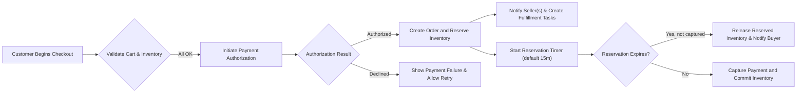
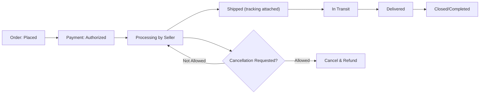
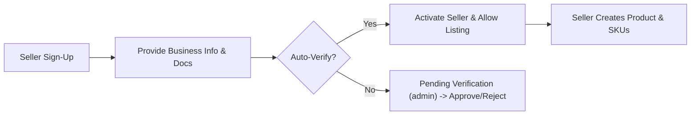

# 02 - Problem Definition for shoppingMall

## Executive Summary
shoppingMall addresses critical friction in multi-seller e-commerce marketplaces by focusing on SKU-level inventory accuracy, reliable checkout and payment flows, clear post-purchase lifecycle (tracking, cancellations, refunds), and seller usability for variant-heavy product catalogs. The platform targets regional and niche marketplaces where sellers require low-friction listing tools and buyers require clear variant selection and dependable delivery.

Assumptions and scope
- Primary launch region: stakeholder to confirm; default assumed region for business rules and KPIs is the primary country of operation (use Asia/Seoul timezone for time-based SLAs).
- MVP scope: user registration and address management; product catalog with SKU variants; shopping cart and wishlist; checkout with payment authorization; seller product management and SKU inventory; order tracking; reviews; basic admin moderation.
- Out-of-scope for MVP: global tax remittance by platform, multi-currency settlement, advanced promotions engine, warehouse-level fulfillment services.

## Market Pain Points (Validated Priorities)
1. Inventory inaccuracy and oversells
- Buyers face canceled orders due to out-of-stock SKUs. Sellers lack simple, reliable per-SKU inventory controls.
2. Checkout friction and payment uncertainty
- Shoppers abandon carts due to missing saved addresses, unclear SKU availability, or payment failures.
3. Poor post-purchase visibility
- Late or missing shipping updates increase support load and reduce repeat purchases.
4. Seller operational friction
- Sellers struggle with creating multi-variant products, setting SKU-level attributes, and handling order fulfillment across multiple sales channels.
5. Weak review trust signals
- Reviews without verified purchase indicators reduce buyer confidence.

## User (Shopper) Frustrations and Needs
- WHEN a shopper attempts checkout without a saved address, THE platform SHALL allow easy address creation and selection to minimize abandonment.
- WHEN a shopper selects a variant on product page, THE platform SHALL display SKU-specific availability and delivery estimates to reduce purchase hesitation.
- IF payment fails during checkout, THEN the platform SHALL inform the shopper of the failure reason and present retry or alternate-payment options without clearing the cart.

Edge cases and error scenarios (shopper perspective)
- Concurrent purchases of the last unit: show explicit message "Last unit claimed by another buyer" and suggest alternatives or backorder.
- Price-change mid-checkout: notify user that price has changed and require reconfirmation.

## Seller Pain Points and Needs
- WHEN a seller creates a product with variants, THE platform SHALL allow SKU-level price, images, and inventory inputs and SHALL generate unique SKUs for combinations.
- WHEN a seller updates inventory, THE platform SHALL prevent setting Available Inventory negative and SHALL log an audit entry with actor and timestamp.
- Sellers need bulk upload capability (CSV) for scaling catalogs (Phase 2), but initial MVP supports single-item creation with clear guidance and validation.

Operational seller burdens
- Manual shipment updates: sellers must provide tracking numbers; platform must surface per-seller shipments in a consolidated order view.
- Payout and refund liability visibility: sellers need clear reports of net payouts after refunds and platform fees.

## Prioritization Rationale (MVP Focus)
Primary priorities (impact vs. effort):
1. Inventory accuracy per SKU (critical to reduce cancellations and refunds)
2. Reliable checkout with address persistence and reservation semantics (critical for conversion)
3. Seller SKU management and simple onboarding (reduces time-to-first-listing)
4. Order tracking and basic notifications (reduces support load)
5. Cancellation/refund workflow and order history

Secondary priorities: reviews moderation, seller analytics, bulk upload, promotions and advertising.

## EARS-formatted Problem Statements and Requirements
(Each item below is actionable and testable)

Inventory and oversell
- WHEN multiple customers attempt to purchase the same SKU concurrently, THE shoppingMall SHALL prevent oversell by reserving SKU quantities at payment authorization time and SHALL release reservations if payment is not captured within a configurable reservation window (default 15 minutes).
- IF the reservation window expires without capture, THEN THE shoppingMall SHALL release reserved quantities to Available Inventory and notify affected buyers if they attempted payment.

Checkout and payment
- WHEN a customer begins checkout, THE shoppingMall SHALL validate cart contents, pricing, and selected shipping address and SHALL present any errors before the user submits payment.
- WHEN payment is authorized, THE shoppingMall SHALL create an order record capturing payment state (authorized/captured/failed) and reserved inventory mapping within 30 seconds of authorization confirmation.

Address and profile
- WHEN a customer adds or edits an address, THE shoppingMall SHALL validate required fields (recipient, street, city, postal code, country, phone) and SHALL reject submissions missing required fields with field-level error messages presented within 2 seconds.

Order tracking and shipping
- WHEN a seller updates shipment status with carrier and tracking number, THE shoppingMall SHALL reflect the update to the buyer and support agents within 60 seconds and SHALL log the actor and timestamp in an audit trail.

Reviews
- WHEN a buyer attempts to submit a review, THE shoppingMall SHALL accept reviews only for SKUs the buyer purchased and for which the order status is Delivered or within the permitted review timeframe (default 365 days after delivery).
- IF a review is flagged for policy violation, THEN THE shoppingMall SHALL hide it from public pages and queue it for moderator review.

Refunds and cancellations
- WHEN a customer requests cancellation prior to shipment and within configured cancellation policy, THEN THE shoppingMall SHALL allow automatic cancellation and SHALL initiate refund processing where payment capture occurred.
- IF a refund request requires manual review (amount > stakeholder threshold or ambiguous evidence), THEN THE shoppingMall SHALL route the request to supportAgent and set status to "Refund Pending".

Seller onboarding and listing visibility
- WHEN a seller registers and fails to complete mandatory verification (as defined by platform policy), THEN THE shoppingMall SHALL place new listings into "Pending Approval" and SHALL not make them publicly searchable until verification completes.

## Use Cases and Personas (with pre/post conditions)
Persona: New Shopper
- Precondition: guest browsing
- Flow: register -> verify email -> add address -> add SKU to cart -> checkout -> payment successful
- Postcondition: order created in Paid state, reservation converted to committed inventory
- Acceptance criteria: confirmation delivered to buyer and seller within 2 minutes of payment success

Persona: Small Seller
- Precondition: seller account active and basic verification completed
- Flow: create product -> define variants -> set inventory -> publish
- Postcondition: product appears in catalog, SKUs discoverable; inventory displayed to buyers
- Acceptance criteria: new listing searchable within 30 seconds in 95% cases

Edge-case scenario: Concurrent last-unit purchases
- WHEN two buyers attempt to pay for the final SKU unit concurrently, THE shoppingMall SHALL ensure exactly one capture succeeds and SHALL inform the other buyer of unavailability within the payment flow and offer alternatives.

## Workflows (Business Flows) and Mermaid Diagrams
Inventory reservation and checkout flow

Order lifecycle and shipping updates

Seller onboarding flow

## Acceptance Criteria and KPIs (Measurable)
- Inventory oversell rate: WHEN platform processes orders for a month, THE oversell incidents SHALL be < 0.5% of paid orders in the primary region for MVP.
- Checkout-to-order conversion: target uplift after address persistence and reservation of +X% (stakeholder to define numeric X within planning); measure baseline and post-launch.
- Payment-to-order creation consistency: 99.9% of successful payments shall result in an order record and reservation within 30 seconds.
- Seller activation time: median time from seller registration to first published listing <= 48 hours for self-service onboarding in MVP (or stakeholder to confirm verification SLA).
- Refund SLA: auto-approved refunds initiated by the platform SHALL be recorded in the system within 24 hours and communicated to the buyer; settlement with payment providers subject to provider timelines.
- Review eligibility enforcement: 100% of public reviews marked as "verified purchase" must be traceable to an order with Delivered state.

## Error Handling and Recovery (User-Facing Messages)
- Inventory conflict at checkout: "One or more items in your cart became unavailable. Please review updated quantities or remove unavailable items."
- Payment declined: "Payment failed: [card_declined]. Please retry with another card or contact your bank." Provide localized explanations and retry options.
- Reservation expired during payment: "Your session timed out. The items have been released. Please re-add items to cart to retry purchase." Optionally allow a 'retry with previous cart' convenience.

## Open Decisions (Action Required, Owner, Suggested Deadline)
1. Payment settlement model (platform collects vs. marketplace routing): Owner: Finance/Product — Due: 2 weeks
2. Reservation window length and override rules per checkout type: Owner: Product/Operations — Due: 1 week
3. Refund auto-approval thresholds (amount and conditions): Owner: Customer Ops/Legal — Due: 2 weeks
4. Seller verification strictness and required documents for auto-approval: Owner: Operations/Legal — Due: 3 weeks
5. Primary launch carriers and payment methods: Owner: Operations/Finance — Due: 2 weeks

## Next Steps and Recommended Actions
- Stakeholders to resolve Open Decisions and record choices in External Integrations document.
- Product and Engineering to convert EARS requirements above into backlog tickets with acceptance tests tied to KPIs.
- QA to design test plans for concurrency inventory race conditions, reservation expiry, and refund flows.
- Ops to prepare monitoring alerts for oversell rates, payment failure spikes, and high dispute rates.

## Appendix: Glossary
- SKU: Stock Keeping Unit
- Reservation: Temporary hold on inventory owned by a pending order or checkout session
- Capture vs Authorization: Authorization reserves funds; capture settles funds (behavior depends on payment gateway)

## Diagram Notes
- All Mermaid diagrams use double-quoted labels and graph LR orientation to meet diagram validation requirements.

## Final statement
The problem statements above are prescriptive business requirements intended to drive functional requirements and acceptance tests. Open decisions are highlighted with owners and due dates to remove ambiguity prior to technical design and implementation.
